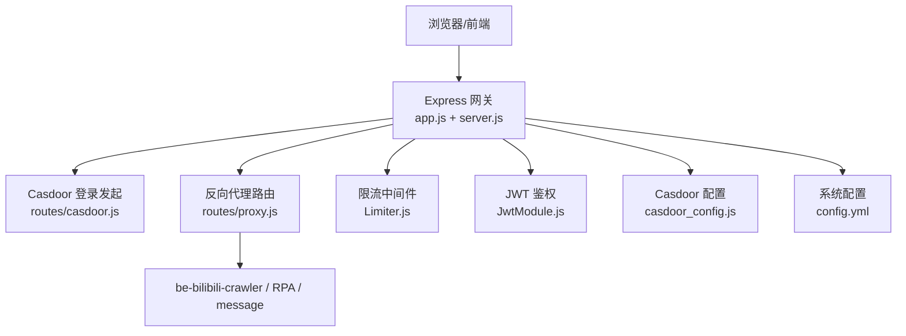
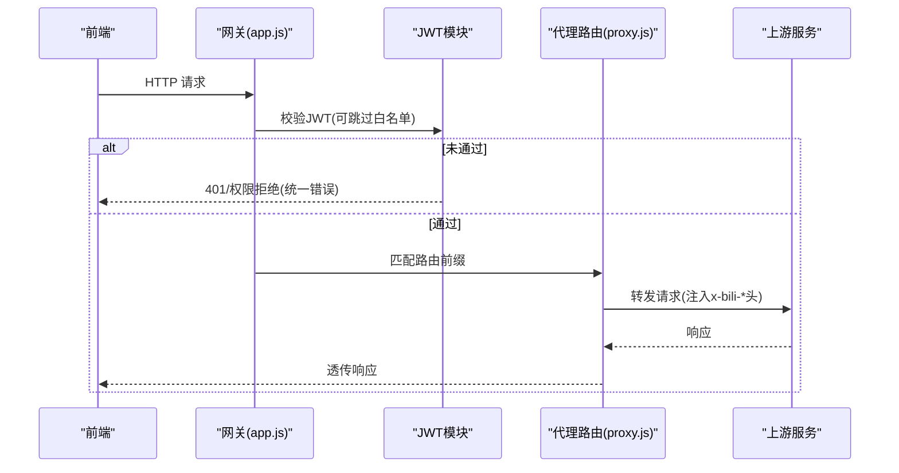
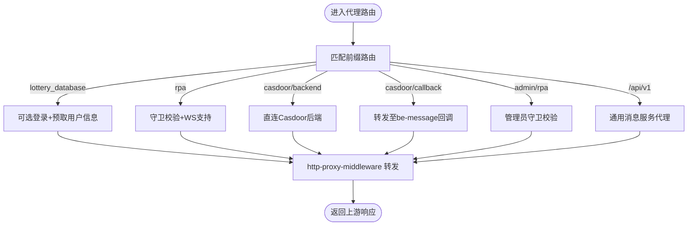
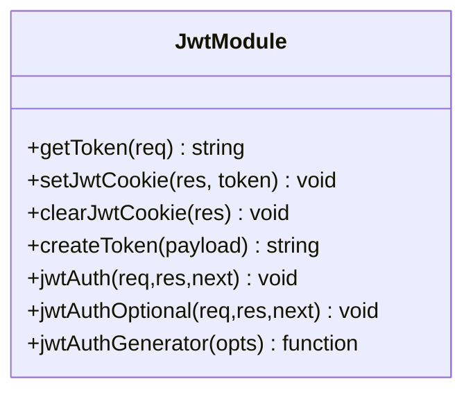
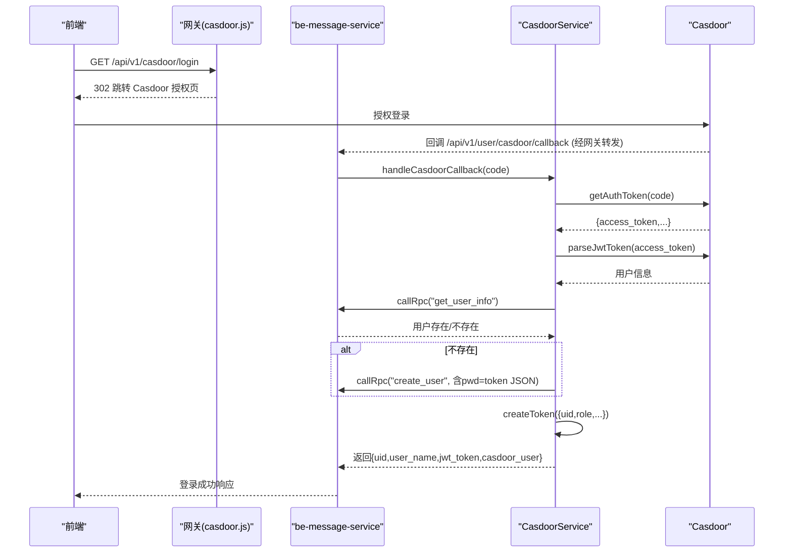
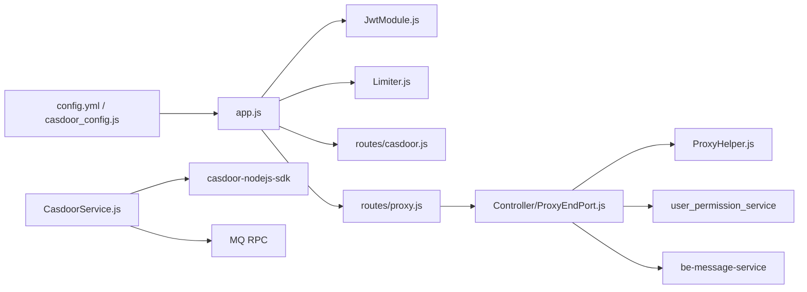

# API 网关服务

<cite>
**本文引用的文件**
- [README.md](file://be-gateway/README.md)
- [package.json](file://be-gateway/package.json)
- [index.js](file://be-gateway/index.js)
- [app.js](file://be-gateway/ExpressServerEnd/app.js)
- [server.js](file://be-gateway/ExpressServerEnd/server.js)
- [config/index.js](file://be-gateway/ExpressServerEnd/config/index.js)
- [config/casdoor_config.js](file://be-gateway/ExpressServerEnd/config/casdoor_config.js)
- [routes/casdoor.js](file://be-gateway/ExpressServerEnd/routes/casdoor.js)
- [routes/proxy.js](file://be-gateway/ExpressServerEnd/routes/proxy.js)
- [MiddleWare/Limiter.js](file://be-gateway/ExpressServerEnd/MiddleWare/Limiter.js)
- [Service/user_permission_module/JwtModule.js](file://be-gateway/ExpressServerEnd/Service/user_permission_module/JwtModule.js)
- [Controller/ProxyEndPort.js](file://be-gateway/ExpressServerEnd/Controller/ProxyEndPort.js)
- [Service/casdoor_module/CasdoorService.js](file://be-gateway/ExpressServerEnd/Service/casdoor_module/CasdoorService.js)
- [config/config.yml](file://be-gateway/ExpressServerEnd/config/config.yml)
</cite>

## 目录
1. [简介](#简介)
2. [项目结构](#项目结构)
3. [核心组件](#核心组件)
4. [架构总览](#架构总览)
5. [详细组件分析](#详细组件分析)
6. [依赖关系分析](#依赖关系分析)
7. [性能与限流](#性能与限流)
8. [故障排查指南](#故障排查指南)
9. [结论](#结论)
10. [附录：配置与调用示例](#附录配置与调用示例)

## 简介
本技术文档聚焦 be-gateway（ExpressServerEnd）作为统一 API 网关的职责：基于 Express 5 的路由与中间件链、Casdoor 统一身份认证集成、JWT 令牌管理、反向代理转发至 be-bilibili-crawler / RPA-Browser / be-message-service，以及限流、日志、错误处理等基础设施能力。文档同时提供配置说明、API 调用示例与常见问题排查建议。

## 项目结构
- 应用入口与启动
  - Express 应用装配在 app.js，包含安全、跨域、超时、解析、鉴权中间件与全局错误处理。
  - server.js 负责端口监听与上游健康检查（be-message-service 为关键依赖）。
- 路由层
  - routes/casdoor.js：Casdoor 登录发起（含来源校验与重定向）。
  - routes/proxy.js：聚合多个反向代理子路由（lottery_database、samsClub、rpa、casdoor/backend、admin/rpa、message 通用代理）。
- 中间件
  - MiddleWare/Limiter.js：基于 Redis 的分布式限流与本地访问限制。
  - Service/user_permission_module/JwtModule.js：JWT 签发、校验、Cookie 管理、白名单豁免路径。
- 服务与配置
  - Service/casdoor_module/CasdoorService.js：Casdoor OAuth 流程、用户同步、Token 刷新、以用户或服务端模式调用 Casdoor。
  - config/casdoor_config.js：Casdoor 连接参数与环境变量映射。
  - config/config.yml：系统级配置（JWT 密钥、等级经验、RPC 超时等）。
  - config/index.js：加载 YAML 配置并输出。

**图表来源**
- [app.js:12-117](file://be-gateway/ExpressServerEnd/app.js#L12-L117)
- [server.js:10-43](file://be-gateway/ExpressServerEnd/server.js#L10-L43)
- [routes/casdoor.js:61-90](file://be-gateway/ExpressServerEnd/routes/casdoor.js#L61-L90)
- [routes/proxy.js:24-162](file://be-gateway/ExpressServerEnd/Controller/ProxyEndPort.js#L24-L162)
- [MiddleWare/Limiter.js:20-50](file://be-gateway/ExpressServerEnd/MiddleWare/Limiter.js#L20-L50)
- [Service/user_permission_module/JwtModule.js:86-131](file://be-gateway/ExpressServerEnd/Service/user_permission_module/JwtModule.js#L86-L131)
- [config/casdoor_config.js:1-18](file://be-gateway/ExpressServerEnd/config/casdoor_config.js#L1-L18)
- [config/config.yml:1-29](file://be-gateway/ExpressServerEnd/config/config.yml#L1-L29)

**章节来源**
- [README.md:29-97](file://be-gateway/README.md#L29-L97)
- [package.json:20-63](file://be-gateway/package.json#L20-L63)

## 核心组件
- 应用装配与错误处理
  - 安全头、CORS、请求体解析、超时保护、统一错误码映射（401/权限拒绝/上游网络错误/未知错误）。
- 路由与反向代理
  - 将不同业务域请求按前缀转发到上游服务，并在代理前后注入用户信息头、修正请求体、设置超时与 WebSocket 支持。
- 认证授权
  - 基于 express-jwt 的全站 JWT 校验，支持可选登录路径白名单；从 HttpOnly Cookie 读取令牌；支持黑名单撤销。
- Casdoor 单点登录
  - 登录发起、回调转发、OAuth Token 获取与解析、用户同步、本地 JWT 签发、Token 刷新与持久化。
- 限流与访问控制
  - 基于 Redis 的分布式速率限制；管理员面板仅允许本地 IP 访问。
- 配置中心
  - YAML 配置加载、环境变量注入（Casdoor、DB、Redis、上游服务地址等）。

**章节来源**
- [app.js:35-185](file://be-gateway/ExpressServerEnd/app.js#L35-L185)
- [Controller/ProxyEndPort.js:24-162](file://be-gateway/ExpressServerEnd/Controller/ProxyEndPort.js#L24-L162)
- [Service/user_permission_module/JwtModule.js:21-157](file://be-gateway/ExpressServerEnd/Service/user_permission_module/JwtModule.js#L21-L157)
- [Service/casdoor_module/CasdoorService.js:31-495](file://be-gateway/ExpressServerEnd/Service/casdoor_module/CasdoorService.js#L31-L495)
- [MiddleWare/Limiter.js:20-69](file://be-gateway/ExpressServerEnd/MiddleWare/Limiter.js#L20-L69)
- [config/index.js:1-7](file://be-gateway/ExpressServerEnd/config/index.js#L1-L7)
- [config/config.yml:1-29](file://be-gateway/ExpressServerEnd/config/config.yml#L1-L29)

## 架构总览
网关作为统一入口，承担以下职责：
- 统一安全策略（Helmet、CORS、超时）
- 统一鉴权（JWT 校验与白名单）
- 统一限流（Redis 存储计数）
- 统一转发（按前缀路由到上游服务）
- 统一错误处理（上游不可达返回 502，超时返回 504，业务错误保持 200 并通过 code 区分）

**图表来源**
- [app.js:82-117](file://be-gateway/ExpressServerEnd/app.js#L82-L117)
- [Service/user_permission_module/JwtModule.js:86-131](file://be-gateway/ExpressServerEnd/Service/user_permission_module/JwtModule.js#L86-L131)
- [Controller/ProxyEndPort.js:24-162](file://be-gateway/ExpressServerEnd/Controller/ProxyEndPort.js#L24-L162)

## 详细组件分析

### 应用装配与错误处理（app.js）
- 安全与跨域：启用 Helmet、CORS（允许携带凭证）、请求体解析。
- 超时保护：connect-timeout 默认 30s。
- 鉴权中间件：全站启用 express-jwt，白名单路径免检。
- 错误处理：
  - 权限拒绝与未登录：HTTP 200，body.code 区分。
  - 超时/上游错误：映射为 504/502。
  - 其他异常：记录堆栈并返回 500。

**章节来源**
- [app.js:68-185](file://be-gateway/ExpressServerEnd/app.js#L68-L185)

### 服务器启动与健康检查（server.js）
- 启动前阻塞检查上游服务健康状态。
- 非关键服务不可用仅告警；be-message-service 不可用时直接退出。
- 监听端口与主机名来自运行参数或默认值。

**章节来源**
- [server.js:10-43](file://be-gateway/ExpressServerEnd/server.js#L10-L43)

### 路由与反向代理（routes/proxy.js → Controller/ProxyEndPort.js）
- 多段路由：
  - /api/v1/lottery_database/bili/：可选登录，预取用户信息，转发至 be-bilibili-crawler。
  - /api/v1/samsClub/graphql：GraphQL 代理。
  - /api/v1/rpa：需守卫校验，WebSocket 支持，长超时。
  - /api/v1/casdoor/backend：代理到 Casdoor 后端。
  - /api/v1/casdoor/callback：转发到 be-message-service 的用户回调处理。
  - /api/admin/rpa：管理员接口，需守卫校验。
  - /api/v1：通用消息服务代理（comment/community/favorite/report 等），可选登录，注入 x-bili-* 头。
- 代理细节：
  - 修正请求体（fixRequestBody）。
  - 注入用户上下文（x-bili-mid、x-bili-role 等）。
  - 自定义超时与 changeOrigin。
  - 统一错误处理（proxyErrorHandler）。

**图表来源**
- [Controller/ProxyEndPort.js:24-162](file://be-gateway/ExpressServerEnd/Controller/ProxyEndPort.js#L24-L162)

**章节来源**
- [routes/proxy.js:1-12](file://be-gateway/ExpressServerEnd/routes/proxy.js#L1-L12)
- [Controller/ProxyEndPort.js:24-162](file://be-gateway/ExpressServerEnd/Controller/ProxyEndPort.js#L24-L162)

### 认证授权与 JWT（JwtModule.js）
- 令牌来源：优先从 HttpOnly Cookie（bili_jwt）读取，兼容 Authorization 头（已注释保留）。
- Cookie 安全：secure 开关受环境变量覆盖，生产环境默认 secure；sameSite lax，path /，有效期 15 天。
- 校验策略：express-jwt 全站启用，credentialsRequired true；白名单路径（登录注册、队列面板、ping、部分社区读接口、Casdoor 相关等）跳过校验。
- 令牌撤销：isRevoked 查询 Redis 黑名单（签名）。
- 可选登录：jwtAuthOptional 用于“有 token 则解析，无 token 不报错”的场景（如公开读接口）。

**图表来源**
- [Service/user_permission_module/JwtModule.js:21-157](file://be-gateway/ExpressServerEnd/Service/user_permission_module/JwtModule.js#L21-L157)

**章节来源**
- [Service/user_permission_module/JwtModule.js:21-157](file://be-gateway/ExpressServerEnd/Service/user_permission_module/JwtModule.js#L21-L157)

### Casdoor 统一身份认证集成
- 登录发起：/api/v1/casdoor/login
  - 解析前端来源（Origin/Referer），校验是否允许（可选白名单 CASDOOR_FRONTEND_ALLOWLIST）。
  - 构造 Casdoor 授权 URL（client_id、response_type=code、redirect_uri、scope=read、state）。
  - 302 跳转至 Casdoor 登录页。
- 登录回调：/api/v1/casdoor/callback
  - 由 proxy.js 转发至 be-message-service 的回调处理器。
- 服务端逻辑（CasdoorService.js）：
  - getOAuthToken(code)：使用 SDK 换取 access_token。
  - getUserInfo(access_token)：解析 JWT 获取用户信息。
  - handleCasdoorCallback：获取 OAuth 令牌 → 解析用户 → 通过 RPC 查询/创建本地用户 → 将完整 OAuth token JSON 写入 TUserInfo.pwd → 生成本地 JWT → 记录登录活动 → 返回结果。
  - syncUserFromCasdoor：根据 Casdoor Token 同步用户信息。
  - getCasdoorUserByUserName：支持“用户调用”（Bearer token）与“service 调用”（query service）两种模式。
  - getCasdoorTokenFromDb / refreshCasdoorToken：从 pwd 字段读取/刷新 Casdoor Token。
  - isEnabled：判断是否启用 Casdoor。

**图表来源**
- [routes/casdoor.js:61-90](file://be-gateway/ExpressServerEnd/routes/casdoor.js#L61-L90)
- [Controller/ProxyEndPort.js:97-113](file://be-gateway/ExpressServerEnd/Controller/ProxyEndPort.js#L97-L113)
- [Service/casdoor_module/CasdoorService.js:59-132](file://be-gateway/ExpressServerEnd/Service/casdoor_module/CasdoorService.js#L59-L132)

**章节来源**
- [routes/casdoor.js:1-106](file://be-gateway/ExpressServerEnd/routes/casdoor.js#L1-L106)
- [Service/casdoor_module/CasdoorService.js:31-495](file://be-gateway/ExpressServerEnd/Service/casdoor_module/CasdoorService.js#L31-L495)
- [config/casdoor_config.js:1-18](file://be-gateway/ExpressServerEnd/config/casdoor_config.js#L1-L18)

### 限流机制与访问控制（Limiter.js）
- 分布式限流：基于 express-rate-limit + rate-limit-redis，窗口时间、最大请求数、Redis 键前缀均可配置。
- 键生成：默认基于客户端 IP（可自定义 keyGenerator）。
- 本地访问限制：restrictToLocalhost 仅允许内网 IP 访问（通过 x-bili-ip 头判断），用于管理面板等敏感接口。

**章节来源**
- [MiddleWare/Limiter.js:20-69](file://be-gateway/ExpressServerEnd/MiddleWare/Limiter.js#L20-L69)

### 配置与环境（config/index.js、config.yml、casdoor_config.js）
- YAML 配置加载：读取 config.yml，输出全局配置对象。
- 系统级配置：JWT 密钥、等级经验阈值、雪花算法 workerId、RPC 超时等。
- Casdoor 配置：endpoint、clientId、clientSecret、organization、application、service、enabled、certificate（支持换行符替换）。

**章节来源**
- [config/index.js:1-7](file://be-gateway/ExpressServerEnd/config/index.js#L1-L7)
- [config/config.yml:1-29](file://be-gateway/ExpressServerEnd/config/config.yml#L1-L29)
- [config/casdoor_config.js:1-18](file://be-gateway/ExpressServerEnd/config/casdoor_config.js#L1-L18)

## 依赖关系分析
- 外部依赖
  - Express 5、helmet、cors、connect-timeout、body-parser
  - express-jwt、jsonwebtoken、jwt-decode
  - casdoor-nodejs-sdk
  - ioredis、rate-limit-redis、express-rate-limit
  - http-proxy-middleware、axios、bull/bullmq
  - sequelize、pg、sequelize-cli
- 内部模块耦合
  - app.js 依赖 JwtModule、Limiter、各路由与服务。
  - ProxyEndPort.js 依赖 JwtModule（可选登录）、PrefetchUserInfo、ProxyHelper、createGuard。
  - CasdoorService 依赖 UserModel/UserDao、MQ RPC、JwtModule。
  - 配置集中通过 config/index.js 与 casdoor_config.js 暴露。

**图表来源**
- [app.js:12-117](file://be-gateway/ExpressServerEnd/app.js#L12-L117)
- [Controller/ProxyEndPort.js:24-162](file://be-gateway/ExpressServerEnd/Controller/ProxyEndPort.js#L24-L162)
- [Service/casdoor_module/CasdoorService.js:1-31](file://be-gateway/ExpressServerEnd/Service/casdoor_module/CasdoorService.js#L1-L31)
- [config/config.yml:1-29](file://be-gateway/ExpressServerEnd/config/config.yml#L1-L29)
- [config/casdoor_config.js:1-18](file://be-gateway/ExpressServerEnd/config/casdoor_config.js#L1-L18)

**章节来源**
- [package.json:20-63](file://be-gateway/package.json#L20-L63)

## 性能与限流
- 超时控制
  - connect-timeout 默认 30s；RPA 代理设置为 180s；消息服务代理 30s。
- 并发与队列
  - Bull/BullMQ 用于异步任务（详见 README 功能列表）。
- 缓存与限流
  - Redis 作为限流存储，避免单机内存限制；key 前缀隔离不同场景。
- 代理优化
  - fixRequestBody 确保请求体正确转发；changeOrigin 适配跨域；ws: true 支持 WebSocket。
- 健康检查
  - 启动时阻塞检查 be-message-service，保障关键依赖可用。

[本节为通用指导，无需具体文件引用]

## 故障排查指南
- 连接失败
  - 确认 DB、Redis、Casdoor、上游服务地址环境变量正确（docker-compose 中注入）。
- 上游不可达
  - 错误码映射：ECONNREFUSED/ENOTFOUND 等返回 502；ETIMEDOUT/ESOCKETTIMEDOUT 返回 504。
- 外键循环依赖
  - 迁移顺序已规避；若仍报错，手动调整迁移或执行 ALTER。
- 新增表未生效
  - 确保模型导出与 init-models 关联更新；必要时重新生成迁移。
- 限流触发
  - 检查 Redis 连接与 key 前缀；必要时调整 windowMs 与 limit。
- 权限拒绝
  - 检查 JWT 是否有效、是否在黑名单；确认路径是否在白名单。

**章节来源**
- [app.js:35-185](file://be-gateway/ExpressServerEnd/app.js#L35-L185)
- [README.md:158-164](file://be-gateway/README.md#L158-L164)

## 结论
be-gateway 以 Express 为核心，结合 Casdoor 统一身份认证、JWT 令牌管理、Redis 分布式限流与健壮的错误处理，提供了稳定可靠的统一入口。通过清晰的前缀路由与代理策略，将不同业务域请求精准转发至上游服务，同时保证安全、可观测性与可扩展性。

[本节为总结，无需具体文件引用]

## 附录：配置与调用示例
- 环境变量（推荐通过 docker-compose 注入）
  - DB：PostgreSQL 连接串
  - REDIS_*：Redis 连接参数
  - CASDOOR_ENDPOINT/CASDOOR_CLIENT_ID/CASDOOR_CLIENT_SECRET/CASDOOR_ORGANIZATION/CASDOOR_APPLICATION/CASDOOR_SERVICE/CASDOOR_CERTIFICATE/CASDOOR_ENABLED
  - BILI_CRAWLER_URI/RPA_SERVICE_URI/MESSAGE_SERVICE_URI：上游服务地址
  - FRONTEND_URL、CASDOOR_FRONTEND_ALLOWLIST：前端来源与白名单
- 启动方式
  - npm run dev / npm run prod（端口默认 9923）
  - Docker：docker compose up -d gateway
- API 路由一览
  - /api/v1/user：用户相关
  - /api/v1/account：B 站账号管理
  - /api/v1/casdoor：Casdoor 单点登录回调
  - /api/v1/do_lottery：抽奖任务
  - /api/v1/feedback/comment：评论互动
  - /api/v1/feedback/content：内容互动
  - /api/v1/ping：健康检查
  - /api/admin/queues：Bull 队列面板（仅 localhost）
  - 其他：反向代理（proxy.js）
- 典型调用示例
  - 登录发起：GET /api/v1/casdoor/login
  - 回调处理：GET /api/v1/casdoor/callback（由网关转发至 be-message-service）
  - 消息服务代理：POST /api/v1/comment/main（可选登录，注入 x-bili-* 头）
  - RPA 代理：POST /api/v1/rpa/...（需守卫校验，长超时）

**章节来源**
- [README.md:79-97](file://be-gateway/README.md#L79-L97)
- [Controller/ProxyEndPort.js:24-162](file://be-gateway/ExpressServerEnd/Controller/ProxyEndPort.js#L24-L162)
- [routes/casdoor.js:61-90](file://be-gateway/ExpressServerEnd/routes/casdoor.js#L61-L90)