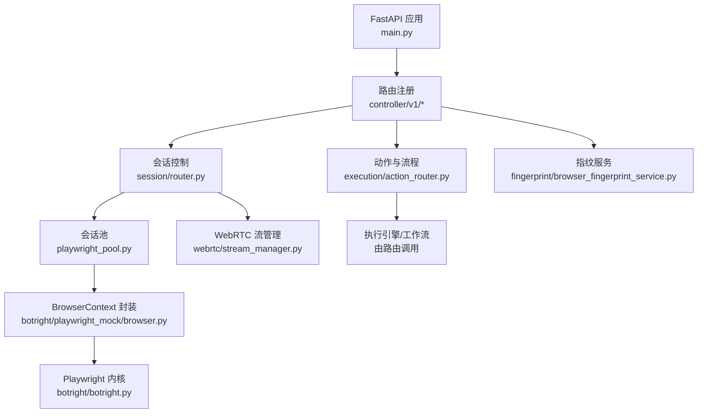
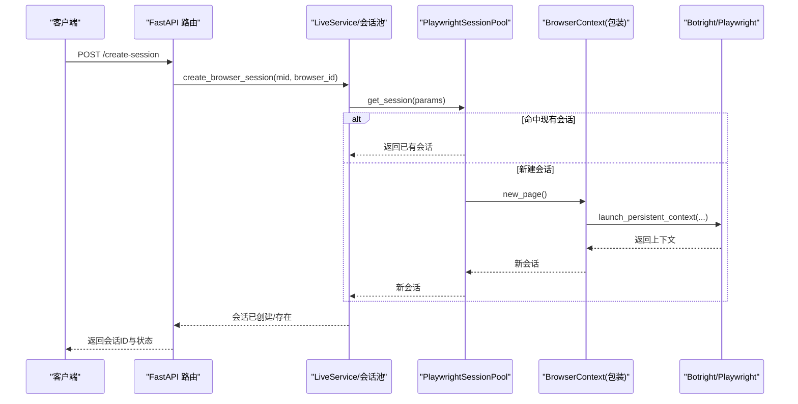
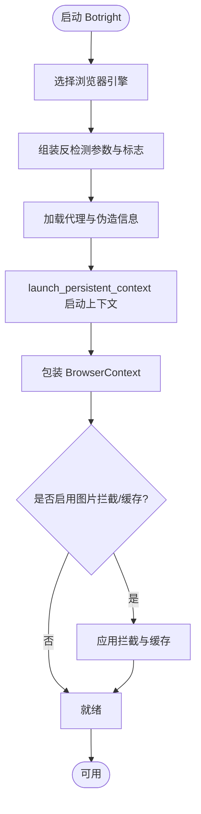
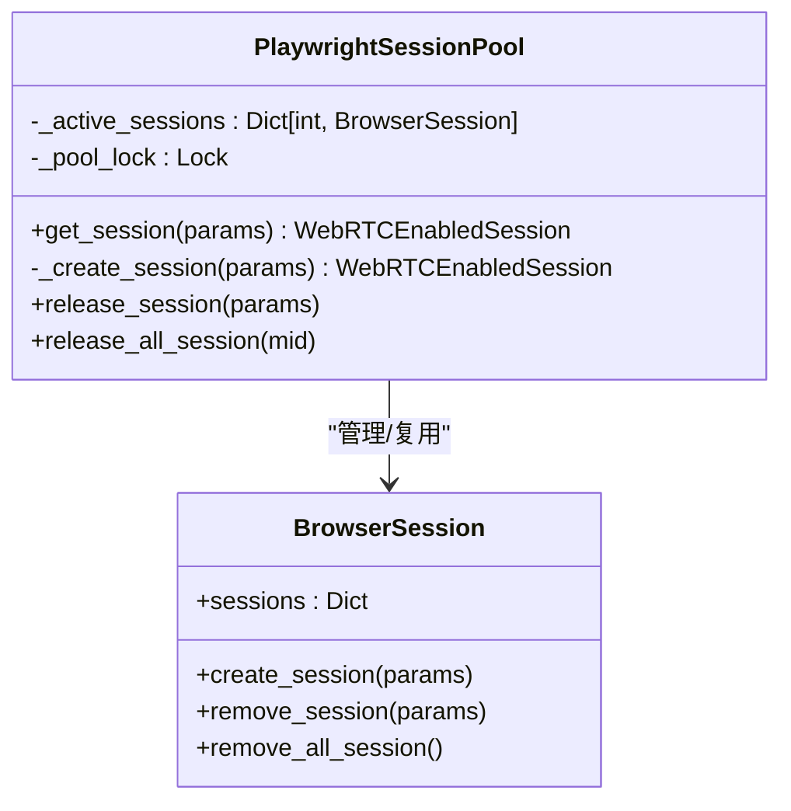
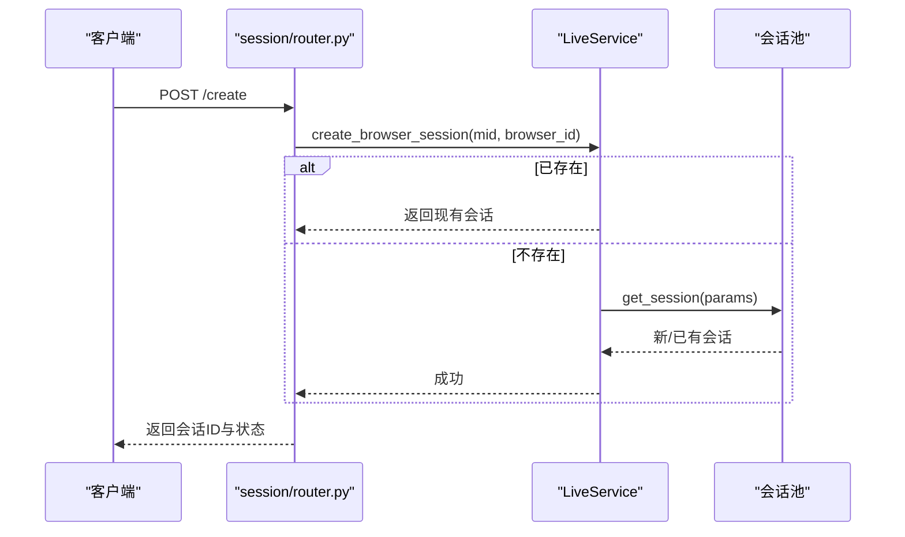
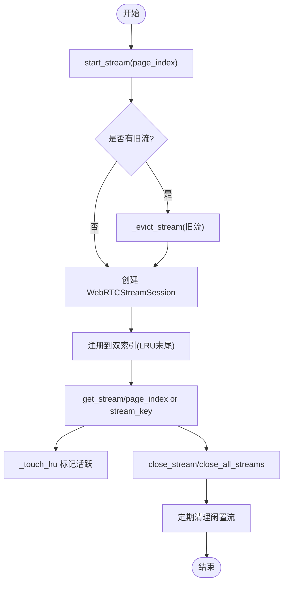
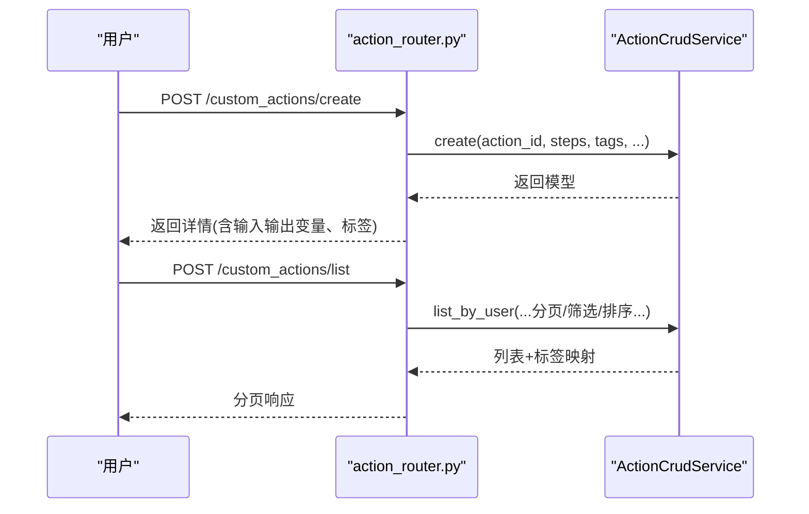
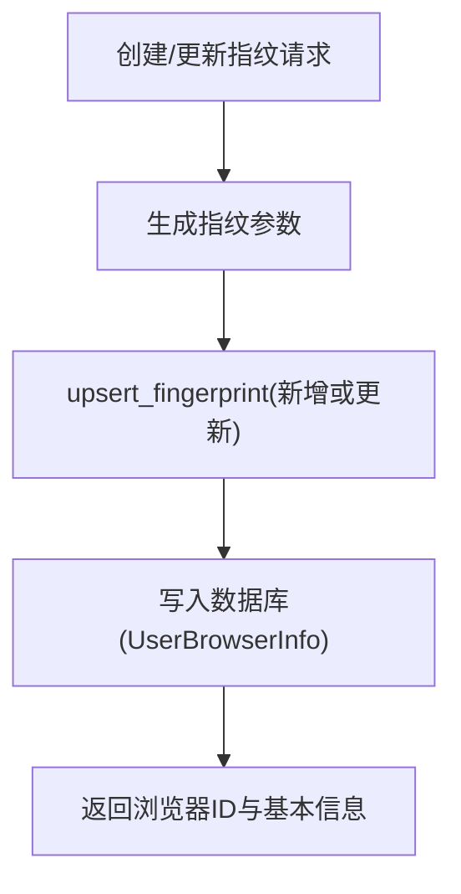
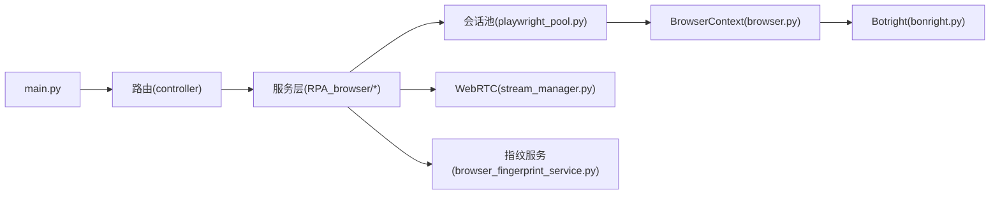

# RPA 浏览器服务

<cite>
**本文引用的文件**
- [main.py](file://RPA-Browser/main.py)
- [botright.py](file://RPA-Browser/botright/botright.py)
- [browser.py](file://RPA-Browser/botright/playwright_mock/browser.py)
- [playwright_pool.py](file://RPA-Browser/app/services/RPA_browser/browser_session_pool/playwright_pool.py)
- [session/router.py](file://RPA-Browser/app/controller/v1/browser_control/session/router.py)
- [action_router.py](file://RPA-Browser/app/controller/v1/browser_control/execution/action_router.py)
- [stream_manager.py](file://RPA-Browser/app/services/RPA_browser/webrtc/stream_manager.py)
- [browser_fingerprint_service.py](file://RPA-Browser/app/services/RPA_browser/fingerprint/browser_fingerprint_service.py)
- [browser_service.py](file://RPA-Browser/app/services/RPA_browser/browser/browser_service.py)
</cite>

## 目录
1. [简介](#简介)
2. [项目结构](#项目结构)
3. [核心组件](#核心组件)
4. [架构总览](#架构总览)
5. [详细组件分析](#详细组件分析)
6. [依赖关系分析](#依赖关系分析)
7. [性能考量](#性能考量)
8. [故障排查指南](#故障排查指南)
9. [结论](#结论)
10. [附录：API 与脚本示例](#附录api-与脚本示例)

## 简介
本技术文档面向 RPA 浏览器服务的后端实现，聚焦于基于 Playwright 的浏览器自动化架构、反检测与指纹伪装、会话与页面操作管理、WebRTC 流能力、任务调度与执行引擎。文档以代码级视角解析关键模块的职责边界、数据流与控制流，并提供可视化图示与调试建议，帮助读者快速理解并高效使用 RPA-Browser 服务。

## 项目结构
RPA-Browser 采用分层与模块化组织：
- 入口与生命周期：FastAPI 应用启动、迁移、后台任务与 RPC 服务初始化
- 浏览器内核封装：Botright 统一封装 Playwright，注入反检测参数、代理与指纹
- 会话池：按用户 mid 复用 BrowserContext，提供并发安全的会话获取与释放
- 控制器层：RESTful API 暴露会话创建/状态/关闭、动作与流程编排等能力
- WebRTC 流管理：为多页面提供视频流生命周期管理与 LRU 淘汰策略
- 指纹服务：生成与管理浏览器指纹，持久化到数据库并支持默认设置

**图表来源**
- [main.py:36-74](file://RPA-Browser/main.py#L36-L74)
- [session/router.py:23-91](file://RPA-Browser/app/controller/v1/browser_control/session/router.py#L23-L91)
- [playwright_pool.py:18-83](file://RPA-Browser/app/services/RPA_browser/browser_session_pool/playwright_pool.py#L18-L83)
- [browser.py:23-95](file://RPA-Browser/botright/playwright_mock/browser.py#L23-L95)
- [botright.py:52-177](file://RPA-Browser/botright/botright.py#L52-L177)
- [stream_manager.py:24-138](file://RPA-Browser/app/services/RPA_browser/webrtc/stream_manager.py#L24-L138)
- [browser_fingerprint_service.py:39-154](file://RPA-Browser/app/services/RPA_browser/fingerprint/browser_fingerprint_service.py#L39-L154)

**章节来源**
- [main.py:36-74](file://RPA-Browser/main.py#L36-L74)

## 核心组件
- Botright：统一启动 Chromium 内核，注入反检测参数、代理、UA、时区、地理信息、视口等；支持可选的“无感知” Playwright 模式；负责清理临时目录与资源回收
- BrowserContext 包装：在 Persistent Context 之上扩展路由拦截、图片拦截、响应缓存、expose_function/binding 适配
- 会话池：按 mid 维度维护活跃 BrowserSession，提供 get_session/release_session/release_all_session，保证并发安全
- 会话控制 API：创建/查询/关闭浏览器会话，异步创建并立即返回，结合心跳与过期策略
- WebRTC 流管理器：为每个页面维护独立流，LRU 淘汰闲置流，定期清理，避免内存泄漏
- 指纹服务：生成/更新/删除/重命名浏览器指纹，支持用户默认设置与应用

**章节来源**
- [botright.py:52-177](file://RPA-Browser/botright/botright.py#L52-L177)
- [browser.py:23-95](file://RPA-Browser/botright/playwright_mock/browser.py#L23-L95)
- [playwright_pool.py:18-127](file://RPA-Browser/app/services/RPA_browser/browser_session_pool/playwright_pool.py#L18-L127)
- [session/router.py:23-196](file://RPA-Browser/app/controller/v1/browser_control/session/router.py#L23-L196)
- [stream_manager.py:24-294](file://RPA-Browser/app/services/RPA_browser/webrtc/stream_manager.py#L24-L294)
- [browser_fingerprint_service.py:39-507](file://RPA-Browser/app/services/RPA_browser/fingerprint/browser_fingerprint_service.py#L39-L507)

## 架构总览
整体架构遵循“请求-路由-服务-内核”的分层模型：
- 请求进入 FastAPI，经路由分发到具体业务控制器
- 控制器调用服务层完成业务逻辑（如会话创建、动作编排）
- 服务层通过会话池获取或创建 BrowserContext，再委托 Botright 启动真实浏览器
- WebRTC 流作为内建能力随会话可用，提供页面级视频流
- 指纹服务贯穿会话创建前后，确保环境隔离与反检测

**图表来源**
- [session/router.py:23-91](file://RPA-Browser/app/controller/v1/browser_control/session/router.py#L23-L91)
- [playwright_pool.py:36-83](file://RPA-Browser/app/services/RPA_browser/browser_session_pool/playwright_pool.py#L36-L83)
- [browser.py:72-95](file://RPA-Browser/botright/playwright_mock/browser.py#L72-L95)
- [botright.py:52-177](file://RPA-Browser/botright/botright.py#L52-L177)

## 详细组件分析

### 浏览器内核与反检测（Botright 与 BrowserContext）
- 启动策略：优先选择 Ungoogled Chromium，其次 Chrome；支持自定义可执行路径
- 反检测标志：禁用自动化特征、关闭无关功能、启用网络优化、屏蔽 Canvas 指纹读取或噪声
- 指纹与代理：注入 UA、时区、地理、视口、语言；支持 HTTP 认证代理
- 资源控制：可选图片拦截与响应缓存，减少带宽与提升稳定性
- 兼容层：对 expose_function/expose_binding 进行包装，适配 Page/Frame/ElementHandle

**图表来源**
- [botright.py:52-177](file://RPA-Browser/botright/botright.py#L52-L177)
- [browser.py:23-95](file://RPA-Browser/botright/playwright_mock/browser.py#L23-L95)

**章节来源**
- [botright.py:52-177](file://RPA-Browser/botright/botright.py#L52-L177)
- [browser.py:23-95](file://RPA-Browser/botright/playwright_mock/browser.py#L23-L95)

### 会话池与会话生命周期
- 会话键：mid + browser_id 唯一标识
- 获取策略：优先复用同 mid 的 BrowserSession；不存在则创建
- 并发保护：全局锁保护会话池写入；创建后校验有效性
- 释放策略：支持单会话释放与全部释放；空集合自动清理

**图表来源**
- [playwright_pool.py:18-127](file://RPA-Browser/app/services/RPA_browser/browser_session_pool/playwright_pool.py#L18-L127)

**章节来源**
- [playwright_pool.py:18-127](file://RPA-Browser/app/services/RPA_browser/browser_session_pool/playwright_pool.py#L18-L127)

### 会话控制 API
- 创建会话：若已存在直接返回；否则异步创建并立即返回
- 状态查询：返回是否存在、是否运行、过期时间等
- 关闭会话：释放资源并返回结果

**图表来源**
- [session/router.py:23-91](file://RPA-Browser/app/controller/v1/browser_control/session/router.py#L23-L91)

**章节来源**
- [session/router.py:23-196](file://RPA-Browser/app/controller/v1/browser_control/session/router.py#L23-L196)

### WebRTC 流管理
- 设计要点：弱引用打破循环引用；OrderedDict 维护 LRU；双向索引 O(1) 查找
- 生命周期：start_stream/get_stream/close_stream/close_all_streams
- 闲置清理：定时任务按 idle_timeout 淘汰旧流，防止内存泄漏

**图表来源**
- [stream_manager.py:24-294](file://RPA-Browser/app/services/RPA_browser/webrtc/stream_manager.py#L24-L294)

**章节来源**
- [stream_manager.py:24-294](file://RPA-Browser/app/services/RPA_browser/webrtc/stream_manager.py#L24-L294)

### 动作与流程编排（Action Router）
- 系统预注册 Action：只读接口，返回精简元数据
- 自定义 Composite Action：CRUD、标签搜索、名称联想、Fork 版本管理
- 权限校验：访问他人私有 Action 将拒绝；公开 Action 允许 Fork

**图表来源**
- [action_router.py:44-151](file://RPA-Browser/app/controller/v1/browser_control/execution/action_router.py#L44-L151)
- [action_router.py:154-221](file://RPA-Browser/app/controller/v1/browser_control/execution/action_router.py#L154-L221)

**章节来源**
- [action_router.py:44-526](file://RPA-Browser/app/controller/v1/browser_control/execution/action_router.py#L44-L526)

### 指纹服务与默认设置
- 生成指纹：基于 BrowserForge 生成基础指纹参数，支持用户默认设置覆盖
- 持久化：UserBrowserInfo 记录指纹与自定义名，支持增删改查与重命名
- 默认设置：UserBrowserDefaultSetting 存储用户偏好（如代理、视口），可按需应用到实例

**图表来源**
- [browser_fingerprint_service.py:39-154](file://RPA-Browser/app/services/RPA_browser/fingerprint/browser_fingerprint_service.py#L39-L154)

**章节来源**
- [browser_fingerprint_service.py:39-507](file://RPA-Browser/app/services/RPA_browser/fingerprint/browser_fingerprint_service.py#L39-L507)
- [browser_service.py:20-114](file://RPA-Browser/app/services/RPA_browser/browser/browser_service.py#L20-L114)

## 依赖关系分析
- 入口 main.py 负责应用生命周期：数据库迁移、依赖初始化、后台任务、RPC 服务
- 控制器依赖服务层，服务层依赖会话池与内核封装
- WebRTC 流管理依赖配置项与调度器，定期清理闲置流
- 指纹服务依赖数据库会话与外部指纹生成工具

**图表来源**
- [main.py:36-74](file://RPA-Browser/main.py#L36-L74)
- [playwright_pool.py:18-127](file://RPA-Browser/app/services/RPA_browser/browser_session_pool/playwright_pool.py#L18-L127)
- [browser.py:23-95](file://RPA-Browser/botright/playwright_mock/browser.py#L23-L95)
- [botright.py:52-177](file://RPA-Browser/botright/botright.py#L52-L177)
- [stream_manager.py:24-294](file://RPA-Browser/app/services/RPA_browser/webrtc/stream_manager.py#L24-L294)
- [browser_fingerprint_service.py:39-507](file://RPA-Browser/app/services/RPA_browser/fingerprint/browser_fingerprint_service.py#L39-L507)

**章节来源**
- [main.py:36-74](file://RPA-Browser/main.py#L36-L74)

## 性能考量
- 会话复用：按 mid 复用 BrowserSession，降低启动开销
- 资源限制：可选图片拦截与响应缓存，减少带宽与渲染压力
- 流淘汰：WebRTC 流基于 LRU 与空闲超时自动清理，避免内存泄漏
- 并发安全：会话池使用全局锁保护临界区，避免竞态条件
- 启动优化：忽略自动化默认参数，禁用不必要特性，提高稳定性

[本节为通用指导，不直接分析具体文件]

## 故障排查指南
- 浏览器未启动：检查会话状态接口返回码与消息；确认会话是否已创建且未过期
- 会话不存在：确认 mid 与 browser_id 组合是否正确；必要时重新创建
- 流异常：检查页面索引是否越界；查看流是否已被淘汰或关闭
- 指纹冲突：重命名或更新指纹时，检查同名冲突与权限
- 资源泄漏：确认会话释放与流关闭；观察定期清理任务是否生效

**章节来源**
- [session/router.py:94-196](file://RPA-Browser/app/controller/v1/browser_control/session/router.py#L94-L196)
- [stream_manager.py:165-201](file://RPA-Browser/app/services/RPA_browser/webrtc/stream_manager.py#L165-L201)
- [browser_fingerprint_service.py:178-235](file://RPA-Browser/app/services/RPA_browser/fingerprint/browser_fingerprint_service.py#L178-L235)

## 结论
RPA-Browser 服务以 Botright 为核心，结合会话池与 WebRTC 流管理，提供了稳定、可扩展的浏览器自动化能力。通过反检测参数注入、指纹伪装与环境隔离，有效提升了隐蔽性与成功率。API 层清晰解耦，便于集成与扩展。建议在大规模部署中关注会话与流的资源监控与调优。

[本节为总结性内容，不直接分析具体文件]

## 附录：API 与脚本示例
- 会话管理
  - 创建会话：POST /browser/session/create
  - 查询状态：POST /browser/session/status
  - 关闭会话：POST /browser/session/close
- 动作与流程
  - 列出系统预注册动作：POST /browser/actions/registered
  - 创建自定义动作：POST /browser/custom_actions/create
  - 列出自定义动作：POST /browser/custom_actions/list
  - Fork 公开动作：POST /browser/custom_actions/fork
- 调试方法
  - 开启日志：检查控制台与日志文件，定位错误堆栈
  - 抓包与路由：利用 route 拦截请求/响应，验证网络行为
  - 流调试：通过 WebRTC 流 key 或 page_index 获取/关闭流，观察状态变化

[本节提供概念性指引，不直接分析具体文件]