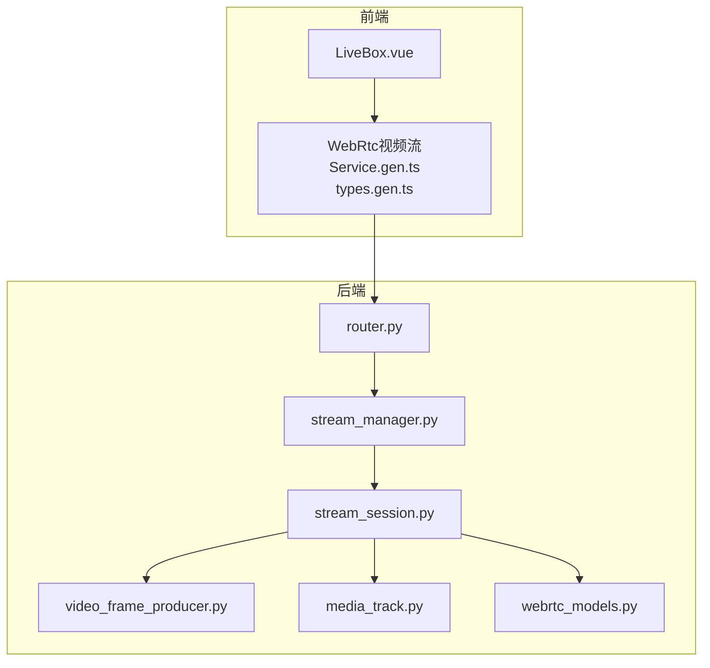
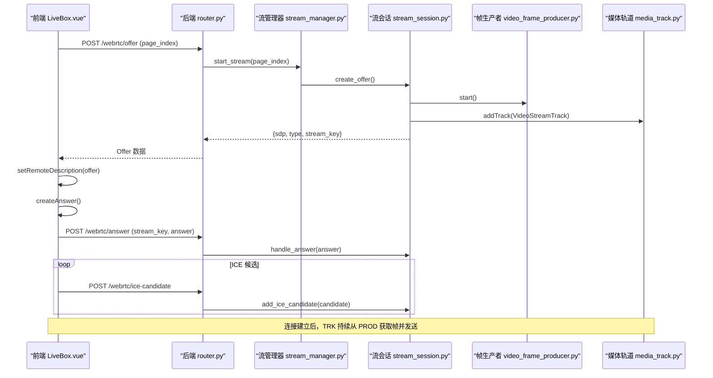
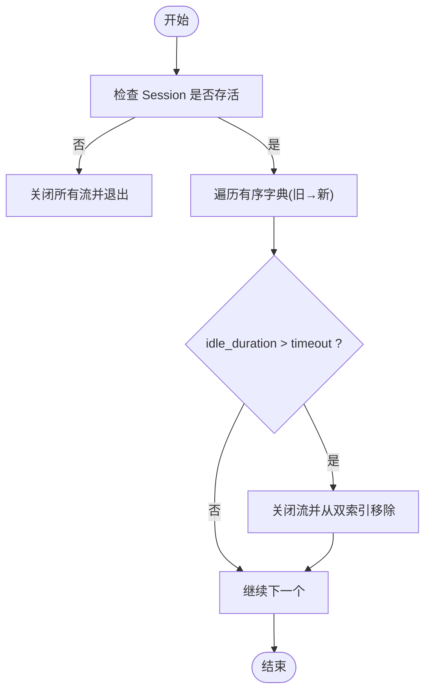
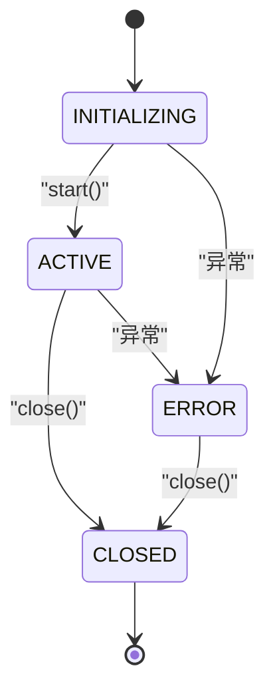
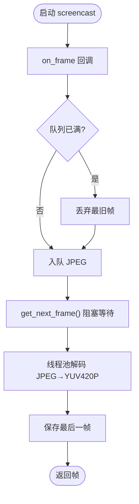
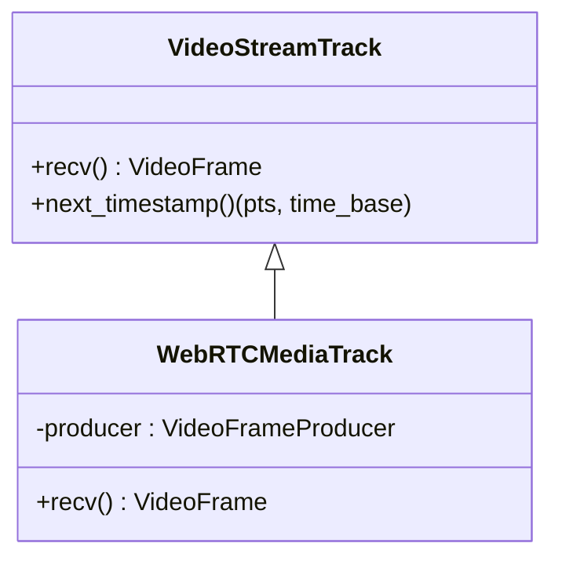
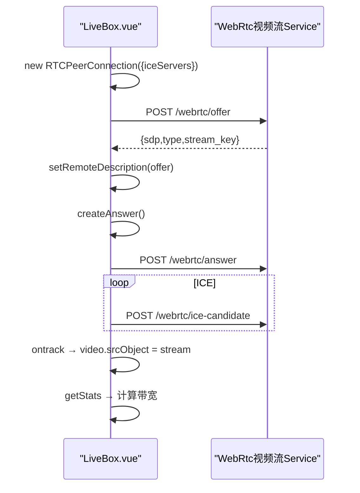
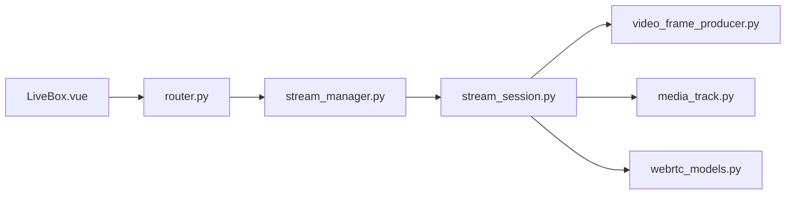

# WebRTC 流媒体

<cite>
**本文引用的文件**
- [stream_session.py](file://RPA-Browser/app/services/RPA_browser/webrtc/stream_session.py)
- [stream_manager.py](file://RPA-Browser/app/services/RPA_browser/webrtc/stream_manager.py)
- [webrtc_models.py](file://RPA-Browser/app/models/runtime/webrtc_models.py)
- [router.py](file://RPA-Browser/app/controller/v1/browser_control/webrtc/router.py)
- [video_frame_producer.py](file://RPA-Browser/app/services/RPA_browser/webrtc/video_frame_producer.py)
- [media_track.py](file://RPA-Browser/app/services/RPA_browser/webrtc/media_track.py)
- [LiveBox.vue](file://Vue3FrontEndDemoExercise/src/components/rpa-browser/LiveBox.vue)
- [types.gen.ts](file://Vue3FrontEndDemoExercise/src/api/browser/hey-api/types.gen.ts)
- [WebRtc视频流Service.gen.ts](file://Vue3FrontEndDemoExercise/src/api/browser/hey-api/services/WebRtc视频流Service.gen.ts)
- [config.py](file://RPA-Browser/app/config.py)
</cite>

## 目录
1. [简介](#简介)
2. [项目结构](#项目结构)
3. [核心组件](#核心组件)
4. [架构总览](#架构总览)
5. [详细组件分析](#详细组件分析)
6. [依赖关系分析](#依赖关系分析)
7. [性能与质量保障](#性能与质量保障)
8. [故障排查指南](#故障排查指南)
9. [结论](#结论)
10. [附录：配置与示例](#附录：配置与示例)

## 简介
本技术文档聚焦于仓库中的 WebRTC 流媒体模块，围绕“实时视频流的采集、编码、传输与播放”展开，覆盖连接建立、媒体轨道管理、帧数据处理、服务质量保障、网络自适应与错误恢复等关键技术。该方案通过后端基于 Playwright 的 screencast 捕获页面画面，使用 aiortc 将帧以视频轨道形式经 WebRTC 传输至前端浏览器进行低延迟播放，实现浏览器远程控制的实时可视化体验。

## 项目结构
WebRTC 流媒体相关代码主要分布在以下位置：
- 后端（Python/FastAPI）：会话管理、流生命周期、信令路由、帧生产者与媒体轨道
- 前端（Vue3/TypeScript）：浏览器端 RTCPeerConnection 控制、信令交互、视频渲染与统计监控

**图示来源**
- [LiveBox.vue:165-259](file://Vue3FrontEndDemoExercise/src/components/rpa-browser/LiveBox.vue#L165-L259)
- [WebRtc视频流Service.gen.ts:132-163](file://Vue3FrontEndDemoExercise/src/api/browser/hey-api/services/WebRtc视频流Service.gen.ts#L132-L163)
- [router.py:62-239](file://RPA-Browser/app/controller/v1/browser_control/webrtc/router.py#L62-L239)
- [stream_manager.py:24-294](file://RPA-Browser/app/services/RPA_browser/webrtc/stream_manager.py#L24-L294)
- [stream_session.py:67-301](file://RPA-Browser/app/services/RPA_browser/webrtc/stream_session.py#L67-L301)
- [video_frame_producer.py:18-229](file://RPA-Browser/app/services/RPA_browser/webrtc/video_frame_producer.py#L18-L229)
- [media_track.py:14-69](file://RPA-Browser/app/services/RPA_browser/webrtc/media_track.py#L14-L69)
- [webrtc_models.py:13-65](file://RPA-Browser/app/models/runtime/webrtc_models.py#L13-L65)

**章节来源**
- [LiveBox.vue:165-259](file://Vue3FrontEndDemoExercise/src/components/rpa-browser/LiveBox.vue#L165-L259)
- [router.py:62-239](file://RPA-Browser/app/controller/v1/browser_control/webrtc/router.py#L62-L239)
- [stream_manager.py:24-294](file://RPA-Browser/app/services/RPA_browser/webrtc/stream_manager.py#L24-L294)
- [stream_session.py:67-301](file://RPA-Browser/app/services/RPA_browser/webrtc/stream_session.py#L67-L301)
- [video_frame_producer.py:18-229](file://RPA-Browser/app/services/RPA_browser/webrtc/video_frame_producer.py#L18-L229)
- [media_track.py:14-69](file://RPA-Browser/app/services/RPA_browser/webrtc/media_track.py#L14-L69)
- [webrtc_models.py:13-65](file://RPA-Browser/app/models/runtime/webrtc_models.py#L13-L65)

## 核心组件
- 流管理器（WebRTCStreamManager）：负责多页面流的生命周期管理、LRU 淘汰、闲置清理、双向索引查找。
- 流会话（WebRTCStreamSession）：封装单个页面的 WebRTC 连接、状态机、Offer/Answer/ICE 处理。
- 帧生产者（VideoFrameProducer）：基于 Playwright screencast 捕获 JPEG 帧，线程池解码为 av.VideoFrame（YUV420P）。
- 媒体轨道（WebRTCMediaTrack）：实现 aiortc VideoStreamTrack，提供带时间戳的视频帧给 PeerConnection。
- 数据模型（webrtc_models）：定义流状态、会话配置、流信息。
- 前端播放器（LiveBox.vue）：创建 RTCPeerConnection、发起 Offer/Answer、转发 ICE Candidate、渲染视频并统计带宽。

**章节来源**
- [stream_manager.py:24-294](file://RPA-Browser/app/services/RPA_browser/webrtc/stream_manager.py#L24-L294)
- [stream_session.py:67-301](file://RPA-Browser/app/services/RPA_browser/webrtc/stream_session.py#L67-L301)
- [video_frame_producer.py:18-229](file://RPA-Browser/app/services/RPA_browser/webrtc/video_frame_producer.py#L18-L229)
- [media_track.py:14-69](file://RPA-Browser/app/services/RPA_browser/webrtc/media_track.py#L14-L69)
- [webrtc_models.py:13-65](file://RPA-Browser/app/models/runtime/webrtc_models.py#L13-L65)
- [LiveBox.vue:165-259](file://Vue3FrontEndDemoExercise/src/components/rpa-browser/LiveBox.vue#L165-L259)

## 架构总览
整体流程：前端调用后端接口创建 Offer → 后端启动帧生产与媒体轨道 → 返回 SDP Offer → 前端设置远端描述并生成 Answer → 发送 Answer → 交换 ICE Candidate → 建立 P2P 连接 → 后端持续推送帧 → 前端渲染视频。

**图示来源**
- [LiveBox.vue:165-259](file://Vue3FrontEndDemoExercise/src/components/rpa-browser/LiveBox.vue#L165-L259)
- [router.py:62-239](file://RPA-Browser/app/controller/v1/browser_control/webrtc/router.py#L62-L239)
- [stream_manager.py:82-138](file://RPA-Browser/app/services/RPA_browser/webrtc/stream_manager.py#L82-L138)
- [stream_session.py:163-235](file://RPA-Browser/app/services/RPA_browser/webrtc/stream_session.py#L163-L235)
- [video_frame_producer.py:43-107](file://RPA-Browser/app/services/RPA_browser/webrtc/video_frame_producer.py#L43-L107)
- [media_track.py:33-69](file://RPA-Browser/app/services/RPA_browser/webrtc/media_track.py#L33-L69)

## 详细组件分析

### 流管理器（WebRTCStreamManager）
- 设计要点：
  - 使用 OrderedDict 维护 LRU 顺序，最近活跃的流在末尾；支持按 page_index 或 stream_key 的 O(1) 查找。
  - 定期任务每 10 分钟扫描，按 idle_timeout 淘汰闲置流，避免资源泄漏。
  - 使用弱引用持有 session，打破循环引用。
- 关键能力：
  - start_stream：校验页面索引、构造 stream_key、创建并启动会话、注册到双索引。
  - get_stream/close_stream/close_all_streams：统一入口，保证索引一致性。
  - _cleanup_idle_streams：基于 LRU 顺序高效淘汰。

**图示来源**
- [stream_manager.py:228-267](file://RPA-Browser/app/services/RPA_browser/webrtc/stream_manager.py#L228-L267)

**章节来源**
- [stream_manager.py:24-294](file://RPA-Browser/app/services/RPA_browser/webrtc/stream_manager.py#L24-L294)

### 流会话（WebRTCStreamSession）
- 状态机：INITIALIZING → ACTIVE → CLOSED/ERROR；非法转换记录警告。
- 生命周期：start() 启动帧生产者、创建媒体轨道并加入 PeerConnection；close() 幂等关闭。
- 信令处理：create_offer/handle_answer/add_ice_candidate；每次活动更新最后活动时间戳。
- 回调：监听 ICE 与连接状态变化，用于活跃度追踪与日志。

**图示来源**
- [stream_session.py:67-177](file://RPA-Browser/app/services/RPA_browser/webrtc/stream_session.py#L67-L177)

**章节来源**
- [stream_session.py:67-301](file://RPA-Browser/app/services/RPA_browser/webrtc/stream_session.py#L67-L301)

### 帧生产者（VideoFrameProducer）
- 采集：使用 Playwright page.screencast.start(on_frame=...) 捕获 JPEG 帧。
- 队列：异步队列 maxsize=frame_queue_size，采用丢旧保新策略。
- 解码：在线程池中用 PIL + av 将 JPEG 转为 YUV420P 的 av.VideoFrame。
- 容错：初始化绿屏帧；解码失败回退绿屏；异常时尝试停止并重启 screencast。

**图示来源**
- [video_frame_producer.py:43-107](file://RPA-Browser/app/services/RPA_browser/webrtc/video_frame_producer.py#L43-L107)
- [video_frame_producer.py:109-173](file://RPA-Browser/app/services/RPA_browser/webrtc/video_frame_producer.py#L109-L173)
- [video_frame_producer.py:175-218](file://RPA-Browser/app/services/RPA_browser/webrtc/video_frame_producer.py#L175-L218)

**章节来源**
- [video_frame_producer.py:18-229](file://RPA-Browser/app/services/RPA_browser/webrtc/video_frame_producer.py#L18-L229)

### 媒体轨道（WebRTCMediaTrack）
- 继承 aiortc.VideoStreamTrack，实现 recv() 拉取下一帧。
- 自动时间戳：使用 next_timestamp() 获取 pts 与 time_base，确保 WebRTC 时钟同步。
- 结束信号：当生产者停止时抛出 StopIteration，通知轨道结束。

**图示来源**
- [media_track.py:14-69](file://RPA-Browser/app/services/RPA_browser/webrtc/media_track.py#L14-L69)

**章节来源**
- [media_track.py:14-69](file://RPA-Browser/app/services/RPA_browser/webrtc/media_track.py#L14-L69)

### 前端播放器（LiveBox.vue）
- 连接建立：创建 RTCPeerConnection（STUN），设置 ontrack/onicecandidate/onconnectionstatechange。
- 信令交互：调用后端 /webrtc/offer → setRemoteDescription → createAnswer → /webrtc/answer。
- ICE 转发：onicecandidate 触发时调用 /webrtc/ice-candidate。
- 播放与统计：ontrack 绑定 srcObject；周期性 getStats 计算上传/下载速率；轮询状态接口刷新 UI。

**图示来源**
- [LiveBox.vue:165-259](file://Vue3FrontEndDemoExercise/src/components/rpa-browser/LiveBox.vue#L165-L259)
- [LiveBox.vue:409-464](file://Vue3FrontEndDemoExercise/src/components/rpa-browser/LiveBox.vue#L409-L464)
- [WebRtc视频流Service.gen.ts:132-163](file://Vue3FrontEndDemoExercise/src/api/browser/hey-api/services/WebRtc视频流Service.gen.ts#L132-L163)
- [types.gen.ts:6379-6436](file://Vue3FrontEndDemoExercise/src/api/browser/hey-api/types.gen.ts#L6379-L6436)

**章节来源**
- [LiveBox.vue:165-259](file://Vue3FrontEndDemoExercise/src/components/rpa-browser/LiveBox.vue#L165-L259)
- [LiveBox.vue:409-464](file://Vue3FrontEndDemoExercise/src/components/rpa-browser/LiveBox.vue#L409-L464)
- [WebRtc视频流Service.gen.ts:132-163](file://Vue3FrontEndDemoExercise/src/api/browser/hey-api/services/WebRtc视频流Service.gen.ts#L132-L163)
- [types.gen.ts:6379-6436](file://Vue3FrontEndDemoExercise/src/api/browser/hey-api/types.gen.ts#L6379-L6436)

## 依赖关系分析
- 模块耦合：
  - router 依赖 stream_manager，后者组合 stream_session。
  - stream_session 组合 video_frame_producer 与 media_track，并通过 webrtc_models 共享配置与状态。
  - 前端通过 Service 类型定义与后端 API 对齐。
- 外部依赖：
  - aiortc（WebRTC 协议栈）、Playwright（页面截图）、av/PIL（图像编解码）。
- 潜在风险：
  - 若 screencast 已存在异常会话，需先 stop 再 restart（已在生产者中处理）。
  - 闲置流未正确清理会导致内存与句柄泄漏（由管理器定时任务兜底）。

**图示来源**
- [router.py:62-239](file://RPA-Browser/app/controller/v1/browser_control/webrtc/router.py#L62-L239)
- [stream_manager.py:24-294](file://RPA-Browser/app/services/RPA_browser/webrtc/stream_manager.py#L24-L294)
- [stream_session.py:67-301](file://RPA-Browser/app/services/RPA_browser/webrtc/stream_session.py#L67-L301)
- [video_frame_producer.py:18-229](file://RPA-Browser/app/services/RPA_browser/webrtc/video_frame_producer.py#L18-L229)
- [media_track.py:14-69](file://RPA-Browser/app/services/RPA_browser/webrtc/media_track.py#L14-L69)
- [webrtc_models.py:13-65](file://RPA-Browser/app/models/runtime/webrtc_models.py#L13-L65)
- [LiveBox.vue:165-259](file://Vue3FrontEndDemoExercise/src/components/rpa-browser/LiveBox.vue#L165-L259)

**章节来源**
- [router.py:62-239](file://RPA-Browser/app/controller/v1/browser_control/webrtc/router.py#L62-L239)
- [stream_manager.py:24-294](file://RPA-Browser/app/services/RPA_browser/webrtc/stream_manager.py#L24-L294)
- [stream_session.py:67-301](file://RPA-Browser/app/services/RPA_browser/webrtc/stream_session.py#L67-L301)
- [video_frame_producer.py:18-229](file://RPA-Browser/app/services/RPA_browser/webrtc/video_frame_producer.py#L18-L229)
- [media_track.py:14-69](file://RPA-Browser/app/services/RPA_browser/webrtc/media_track.py#L14-L69)
- [webrtc_models.py:13-65](file://RPA-Browser/app/models/runtime/webrtc_models.py#L13-L65)
- [LiveBox.vue:165-259](file://Vue3FrontEndDemoExercise/src/components/rpa-browser/LiveBox.vue#L165-L259)

## 性能与质量保障
- 低延迟优化
  - 帧队列大小可调（默认 10），采用丢旧保新策略减少端到端延迟。
  - 解码与格式转换在线程池执行，避免阻塞事件循环。
  - 使用 YUV420P 标准格式，降低浏览器解码开销。
- 质量与带宽平衡
  - 可调节 JPEG 质量（默认 80），结合前端 getStats 统计带宽动态调整。
  - 最大帧率上限（max_fps）可用于限制 CPU 占用。
- 资源回收
  - LRU 淘汰 + 闲置超时（默认 300 秒）自动关闭流，防止资源泄漏。
  - 关闭流时并行关闭所有会话，快速释放资源。
- 网络自适应
  - 前端通过 STUN 服务器进行 NAT 穿透；可替换为 TURN 以提升跨网连通性。
  - 连接状态变更回调与 ICE 候选交换，提升建连成功率。

[本节为通用性能建议，不直接分析具体文件]

## 故障排查指南
- Offer/Answer 失败
  - 检查页面索引是否越界；确认会话是否存在；查看后端日志中错误码。
  - 参考：[router.py:95-102](file://RPA-Browser/app/controller/v1/browser_control/webrtc/router.py#L95-L102)
- ICE 候选无法添加
  - 确认 stream_key 是否正确；检查 candidate 字符串格式解析逻辑。
  - 参考：[stream_session.py:237-271](file://RPA-Browser/app/services/RPA_browser/webrtc/stream_session.py#L237-L271)
- 无画面或黑屏
  - 检查 screencast 是否成功启动；解码失败会回退绿屏帧。
  - 参考：[video_frame_producer.py:53-79](file://RPA-Browser/app/services/RPA_browser/webrtc/video_frame_producer.py#L53-L79)、[video_frame_producer.py:175-203](file://RPA-Browser/app/services/RPA_browser/webrtc/video_frame_producer.py#L175-L203)
- 连接断开或卡顿
  - 观察 onconnectionstatechange 状态；检查前端 getStats 统计的字节数与时间戳。
  - 参考：[LiveBox.vue:204-219](file://Vue3FrontEndDemoExercise/src/components/rpa-browser/LiveBox.vue#L204-L219)、[LiveBox.vue:409-464](file://Vue3FrontEndDemoExercise/src/components/rpa-browser/LiveBox.vue#L409-L464)
- 资源泄漏
  - 确认闲置流被定时任务清理；必要时手动 close_all_streams。
  - 参考：[stream_manager.py:228-267](file://RPA-Browser/app/services/RPA_browser/webrtc/stream_manager.py#L228-L267)

**章节来源**
- [router.py:95-102](file://RPA-Browser/app/controller/v1/browser_control/webrtc/router.py#L95-L102)
- [stream_session.py:237-271](file://RPA-Browser/app/services/RPA_browser/webrtc/stream_session.py#L237-L271)
- [video_frame_producer.py:53-79](file://RPA-Browser/app/services/RPA_browser/webrtc/video_frame_producer.py#L53-L79)
- [video_frame_producer.py:175-203](file://RPA-Browser/app/services/RPA_browser/webrtc/video_frame_producer.py#L175-L203)
- [LiveBox.vue:204-219](file://Vue3FrontEndDemoExercise/src/components/rpa-browser/LiveBox.vue#L204-L219)
- [LiveBox.vue:409-464](file://Vue3FrontEndDemoExercise/src/components/rpa-browser/LiveBox.vue#L409-L464)
- [stream_manager.py:228-267](file://RPA-Browser/app/services/RPA_browser/webrtc/stream_manager.py#L228-L267)

## 结论
该 WebRTC 流媒体模块通过“Playwright 截图 + aiortc 传输 + 前端浏览器播放”的组合，实现了低延迟的远程桌面/浏览器控制场景。其核心优势包括：
- 清晰的流生命周期管理与状态机约束
- 高效的 LRU 闲置淘汰机制与资源回收
- 线程池解耦 CPU 密集型解码，避免阻塞事件循环
- 前端完善的信令交互与带宽统计，便于调优与排障

在生产环境中，建议结合 TURN 服务提升跨网连通性，并根据实际带宽与设备性能动态调整质量与帧率，以获得最佳用户体验。

[本节为总结性内容，不直接分析具体文件]

## 附录：配置与示例
- 会话配置（webrtc_models）
  - quality：JPEG 质量（0-100）
  - max_fps：最大帧率
  - idle_timeout：闲置超时（秒）
  - frame_queue_size：帧队列大小（丢旧保新）
  - 参考：[webrtc_models.py:41-58](file://RPA-Browser/app/models/runtime/webrtc_models.py#L41-L58)
- 后端配置（config）
  - browser_webrtc_idle_timeout：可通过 settings 注入（示例中引用）
  - 参考：[stream_manager.py:121-124](file://RPA-Browser/app/services/RPA_browser/webrtc/stream_manager.py#L121-L124)、[config.py:140-200](file://RPA-Browser/app/config.py#L140-L200)
- 前端 STUN 配置
  - iceServers: stun:stun.l.google.com:19302
  - 参考：[LiveBox.vue:171-173](file://Vue3FrontEndDemoExercise/src/components/rpa-browser/LiveBox.vue#L171-L173)
- API 请求体类型（前端类型定义）
  - WebRtcOfferRequest/WebRtcAnswerRequest/WebRTCIceCandidateRequest/WebRTCCloseRequest
  - 参考：[types.gen.ts:6379-6436](file://Vue3FrontEndDemoExercise/src/api/browser/hey-api/types.gen.ts#L6379-L6436)
- 前端服务方法
  - createWebrtcOffer/handleWebrtcAnswer/addIceCandidate/closeWebrtcStream/getWebrtcStatus
  - 参考：[WebRtc视频流Service.gen.ts:132-163](file://Vue3FrontEndDemoExercise/src/api/browser/hey-api/services/WebRtc视频流Service.gen.ts#L132-L163)

**章节来源**
- [webrtc_models.py:41-58](file://RPA-Browser/app/models/runtime/webrtc_models.py#L41-L58)
- [stream_manager.py:121-124](file://RPA-Browser/app/services/RPA_browser/webrtc/stream_manager.py#L121-L124)
- [config.py:140-200](file://RPA-Browser/app/config.py#L140-L200)
- [LiveBox.vue:171-173](file://Vue3FrontEndDemoExercise/src/components/rpa-browser/LiveBox.vue#L171-L173)
- [types.gen.ts:6379-6436](file://Vue3FrontEndDemoExercise/src/api/browser/hey-api/types.gen.ts#L6379-L6436)
- [WebRtc视频流Service.gen.ts:132-163](file://Vue3FrontEndDemoExercise/src/api/browser/hey-api/services/WebRtc视频流Service.gen.ts#L132-L163)