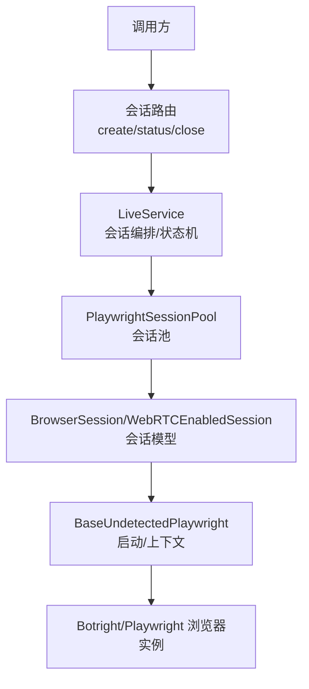
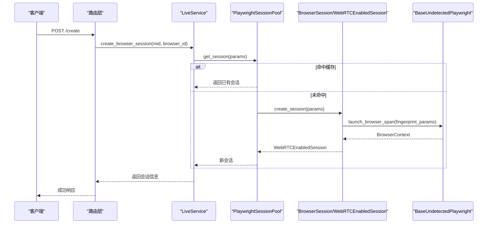
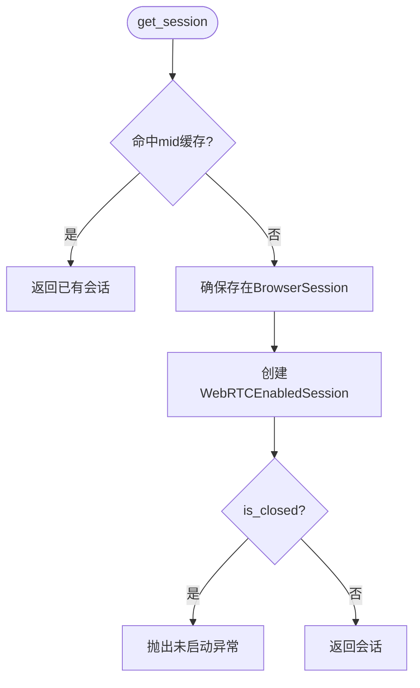
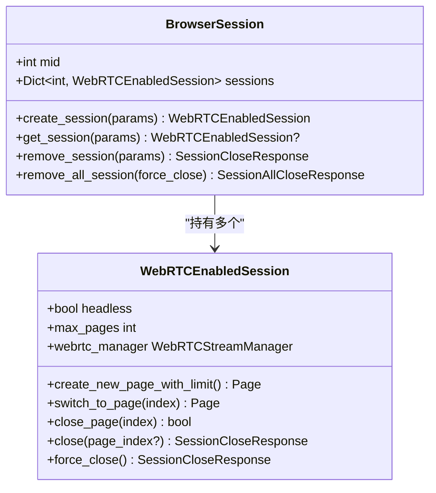
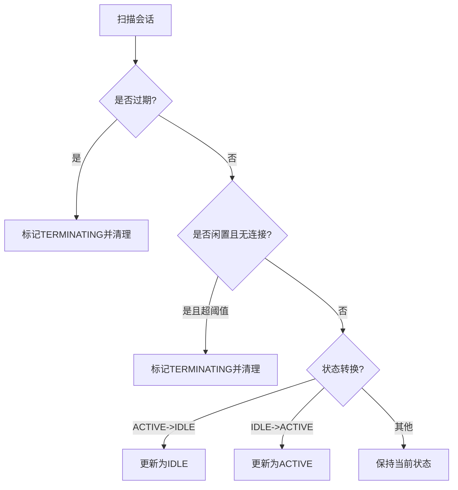
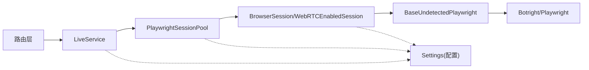

# 会话池管理

<cite>
**本文引用的文件**
- [playwright_pool.py](file://RPA-Browser/app/services/RPA_browser/browser_session_pool/playwright_pool.py)
- [session_pool_model.py](file://RPA-Browser/app/services/RPA_browser/browser_session_pool/session_pool_model.py)
- [live_service.py](file://RPA-Browser/app/services/RPA_browser/session/live_service.py)
- [base_engines.py](file://RPA-Browser/app/services/RPA_browser/base/base_engines.py)
- [config.py](file://RPA-Browser/app/config.py)
- [router.py](file://RPA-Browser/app/controller/v1/browser_control/session/router.py)
- [session.py](file://RPA-Browser/app/models/runtime/session.py)
- [control.py](file://RPA-Browser/app/models/runtime/control.py)
</cite>

## 目录
1. [简介](#简介)
2. [项目结构](#项目结构)
3. [核心组件](#核心组件)
4. [架构总览](#架构总览)
5. [详细组件分析](#详细组件分析)
6. [依赖关系分析](#依赖关系分析)
7. [性能与调优](#性能与调优)
8. [故障排查指南](#故障排查指南)
9. [结论](#结论)
10. [附录：配置示例与参数说明](#附录：配置示例与参数说明)

## 简介
本模块提供浏览器会话的创建、复用、销毁等全生命周期管理，并基于 Playwright（通过 Botright 封装）实现连接池化。核心目标包括：
- 按用户 mid 与浏览器指纹 browser_id 维度进行会话复用与隔离
- 并发安全的会话创建与释放，避免竞态与资源泄漏
- 页面数量限制、下载拦截、WebRTC 流管理等内存优化策略
- 可配置的自动清理策略（闲置超时、过期时间、检查间隔）
- 面向业务层的统一接口（创建/状态/关闭），与心跳机制解耦

## 项目结构
围绕会话池的关键代码分布在以下位置：
- 会话池入口与单例：PlaywrightSessionPool
- 会话模型与页面管理：WebRTCEnabledSession、BrowserSession
- 业务编排与生命周期：LiveService
- 底层浏览器启动：BaseUndetectedPlaywright
- 配置项：Settings（会话清理、页面上限、WebRTC 空闲超时等）
- HTTP 路由：会话创建/状态/关闭接口

**图表来源**
- [router.py:23-91](file://RPA-Browser/app/controller/v1/browser_control/session/router.py#L23-L91)
- [live_service.py:215-324](file://RPA-Browser/app/services/RPA_browser/session/live_service.py#L215-L324)
- [playwright_pool.py:18-106](file://RPA-Browser/app/services/RPA_browser/browser_session_pool/playwright_pool.py#L18-L106)
- [session_pool_model.py:126-533](file://RPA-Browser/app/services/RPA_browser/browser_session_pool/session_pool_model.py#L126-L533)
- [base_engines.py:15-82](file://RPA-Browser/app/services/RPA_browser/base/base_engines.py#L15-L82)

**章节来源**
- [router.py:23-91](file://RPA-Browser/app/controller/v1/browser_control/session/router.py#L23-L91)
- [live_service.py:215-324](file://RPA-Browser/app/services/RPA_browser/session/live_service.py#L215-L324)
- [playwright_pool.py:18-106](file://RPA-Browser/app/services/RPA_browser/browser_session_pool/playwright_pool.py#L18-L106)
- [session_pool_model.py:126-533](file://RPA-Browser/app/services/RPA_browser/browser_session_pool/session_pool_model.py#L126-L533)
- [base_engines.py:15-82](file://RPA-Browser/app/services/RPA_browser/base/base_engines.py#L15-L82)

## 核心组件
- PlaywrightSessionPool：会话池管理器，负责按 mid 查找或创建 WebRTCEnabledSession，维护活跃会话字典与全局锁，支持批量释放。
- BrowserSession：以 mid 为维度的容器，聚合多个 browser_id 的会话，提供创建/获取/移除/全部移除能力。
- WebRTCEnabledSession：具体会话对象，封装 BaseUndetectedPlaywright、BrowserContext、生成器，提供页面创建、切换、关闭、下载拦截、页面数量限制、WebRTC 流管理。
- LiveService：业务编排层，维护会话条目（含状态、过期、清理策略）、并发锁、状态机评估与定时清理；对外暴露 get_or_create/release/create/status 等方法。
- BaseUndetectedPlaywright：底层浏览器启动器，基于 Botright 创建浏览器与上下文，使用指纹参数与用户数据目录。
- 配置 Settings：控制会话清理策略、页面上限、WebRTC 空闲超时等关键参数。

**章节来源**
- [playwright_pool.py:18-127](file://RPA-Browser/app/services/RPA_browser/browser_session_pool/playwright_pool.py#L18-L127)
- [session_pool_model.py:73-607](file://RPA-Browser/app/services/RPA_browser/browser_session_pool/session_pool_model.py#L73-L607)
- [live_service.py:49-533](file://RPA-Browser/app/services/RPA_browser/session/live_service.py#L49-L533)
- [base_engines.py:15-82](file://RPA-Browser/app/services/RPA_browser/base/base_engines.py#L15-L82)
- [config.py:190-204](file://RPA-Browser/app/config.py#L190-L204)

## 架构总览
会话从请求到落地的完整链路如下：
- 路由层接收创建/状态/关闭请求，校验权限与归属
- LiveService 根据 mid+browser_id 判断是否复用现有会话，否则进入创建流程
- PlaywrightSessionPool 在进程内维护会话字典，确保同一 mid 下按 browser_id 复用
- WebRTCEnabledSession 负责页面生命周期、下载拦截、页面数量限制、WebRTC 流
- BaseUndetectedPlaywright 通过 Botright 启动真实浏览器，注入指纹参数与视口/屏幕设置
- 配置项驱动清理策略与资源上限

**图表来源**
- [router.py:23-91](file://RPA-Browser/app/controller/v1/browser_control/session/router.py#L23-L91)
- [live_service.py:215-324](file://RPA-Browser/app/services/RPA_browser/session/live_service.py#L215-L324)
- [playwright_pool.py:36-83](file://RPA-Browser/app/services/RPA_browser/browser_session_pool/playwright_pool.py#L36-L83)
- [session_pool_model.py:507-533](file://RPA-Browser/app/services/RPA_browser/browser_session_pool/session_pool_model.py#L507-L533)
- [base_engines.py:50-82](file://RPA-Browser/app/services/RPA_browser/base/base_engines.py#L50-L82)

## 详细组件分析

### PlaywrightSessionPool：会话池与并发控制
- 职责
  - 维护 _active_sessions: Dict[mid -> BrowserSession]
  - 提供 get_session() 优先复用，不存在则创建
  - 提供 release_session()/release_all_session() 释放资源
  - 使用 asyncio.Lock 保护池操作，避免并发写入冲突
- 创建流程
  - 若 mid 不存在则新建 BrowserSession
  - 调用 BrowserSession.create_session() 创建 WebRTCEnabledSession
  - 创建完成后校验 is_closed，异常时抛出“浏览器未启动”
- 释放流程
  - 按 mid 删除空容器，或按 browser_id 关闭并清理引用

**图表来源**
- [playwright_pool.py:36-83](file://RPA-Browser/app/services/RPA_browser/browser_session_pool/playwright_pool.py#L36-L83)

**章节来源**
- [playwright_pool.py:18-106](file://RPA-Browser/app/services/RPA_browser/browser_session_pool/playwright_pool.py#L18-L106)

### BrowserSession 与 WebRTCEnabledSession：会话模型与页面管理
- BrowserSession
  - 以 mid 为单位聚合多个 browser_id 的会话
  - 提供 create/get/remove/remove_all 方法
  - remove 支持 force_close 强制关闭并删除
- WebRTCEnabledSession
  - 页面创建：_enforce_page_limit 超过上限则关闭最旧页面
  - 下载拦截：on("download") 取消下载，防止资源占用
  - 页面切换：switch_to_page 激活指定页
  - 关闭：close/close_page/force_close，优雅关闭上下文与生成器
  - WebRTC：惰性初始化 WebRTCStreamManager，提供活跃/总数统计

**图表来源**
- [session_pool_model.py:536-607](file://RPA-Browser/app/services/RPA_browser/browser_session_pool/session_pool_model.py#L536-L607)
- [session_pool_model.py:126-533](file://RPA-Browser/app/services/RPA_browser/browser_session_pool/session_pool_model.py#L126-L533)

**章节来源**
- [session_pool_model.py:126-607](file://RPA-Browser/app/services/RPA_browser/browser_session_pool/session_pool_model.py#L126-L607)

### LiveService：会话编排、状态机与清理
- 会话条目
  - 维护 _browser_sessions: Dict[session_key -> BrowserSessionEntry]
  - 每个条目包含 mid、browser_id、browser_session、last_activity、lifecycle_state、cleanup_policy、expires_at 等
- 获取或创建
  - 先快速检查是否存在且运行中
  - 使用会话级锁避免重复创建
  - 委托 PlaywrightSessionPool.get_session 完成实际创建
  - 注册到 _browser_sessions 并设置状态
- 清理策略（状态机）
  - 优先级：过期 > 闲置超时 > 直播流超时
  - 状态转换：ACTIVE <-> IDLE，必要时进入 TERMINATING
  - 定时任务扫描，收集待清理会话后逐个释放
- 释放会话
  - 关闭浏览器会话并从池中移除
  - 使用 force_close=True 确保彻底释放

**图表来源**
- [live_service.py:92-194](file://RPA-Browser/app/services/RPA_browser/session/live_service.py#L92-L194)

**章节来源**
- [live_service.py:49-533](file://RPA-Browser/app/services/RPA_browser/session/live_service.py#L49-L533)

### BaseUndetectedPlaywright：浏览器启动与上下文
- 基于 Botright 启动浏览器，传入指纹参数、代理、视口/屏幕尺寸
- 使用 user_data_dir 隔离不同 mid/browser_id 的用户数据
- 启动后 yield BrowserContext，并在 finally 中关闭浏览器

**章节来源**
- [base_engines.py:15-82](file://RPA-Browser/app/services/RPA_browser/base/base_engines.py#L15-L82)

### 路由层：会话创建/状态/关闭
- 创建：若已存在则直接返回；否则异步创建并立即返回
- 状态：返回会话是否存在、浏览器是否运行、生命周期状态、清理策略、屏幕/视口尺寸
- 关闭：释放浏览器会话并返回结果

**章节来源**
- [router.py:23-196](file://RPA-Browser/app/controller/v1/browser_control/session/router.py#L23-L196)

## 依赖关系分析
- LiveService 依赖 PlaywrightSessionPool 进行会话池操作
- PlaywrightSessionPool 依赖 BrowserSession/WebRTCEnabledSession 进行具体会话管理
- WebRTCEnabledSession 依赖 BaseUndetectedPlaywright 启动浏览器
- 所有组件通过 config.Settings 读取运行时参数（清理策略、页面上限、WebRTC 空闲超时等）

**图表来源**
- [router.py:23-91](file://RPA-Browser/app/controller/v1/browser_control/session/router.py#L23-L91)
- [live_service.py:215-324](file://RPA-Browser/app/services/RPA_browser/session/live_service.py#L215-L324)
- [playwright_pool.py:36-83](file://RPA-Browser/app/services/RPA_browser/browser_session_pool/playwright_pool.py#L36-L83)
- [session_pool_model.py:507-533](file://RPA-Browser/app/services/RPA_browser/browser_session_pool/session_pool_model.py#L507-L533)
- [base_engines.py:50-82](file://RPA-Browser/app/services/RPA_browser/base/base_engines.py#L50-L82)
- [config.py:190-204](file://RPA-Browser/app/config.py#L190-L204)

**章节来源**
- [config.py:190-204](file://RPA-Browser/app/config.py#L190-L204)

## 性能与调优
- 连接池大小控制
  - 通过 settings.browser_max_pages_per_context 限制每个上下文的页面数，超出时自动关闭最旧页面，降低内存占用
  - 建议根据机器内存与并发规模调整该值，避免过多页面导致 OOM
- 资源分配策略
  - 页面创建前执行 _enforce_page_limit，保证不超过上限
  - 下载事件拦截，阻止下载任务占用带宽与磁盘
  - WebRTC 流惰性初始化，仅在首次使用时分配资源
- 并发控制
  - 会话级锁（LiveService._session_locks）与浏览器创建锁（_browser_creation_locks）避免重复创建与竞态
  - 池级锁（PlaywrightSessionPool._pool_lock）保护活跃会话字典
- 异常恢复
  - 创建后立即校验 is_closed，失败时抛出“浏览器未启动”，上层可重试
  - 释放时使用 force_close=True 确保彻底回收，避免僵尸进程
- 内存优化
  - 及时关闭页面与上下文，关闭生成器
  - 合理设置闲置超时与检查间隔，减少长期驻留的空闲会话

**章节来源**
- [session_pool_model.py:291-359](file://RPA-Browser/app/services/RPA_browser/browser_session_pool/session_pool_model.py#L291-L359)
- [session_pool_model.py:194-289](file://RPA-Browser/app/services/RPA_browser/browser_session_pool/session_pool_model.py#L194-L289)
- [live_service.py:215-324](file://RPA-Browser/app/services/RPA_browser/session/live_service.py#L215-L324)
- [config.py:190-204](file://RPA-Browser/app/config.py#L190-L204)

## 故障排查指南
- 常见问题
  - 浏览器未启动：创建后 is_closed 为真，抛出“浏览器未启动”。检查指纹参数、可执行路径、代理配置
  - 页面索引越界：访问不存在的 page_index，抛出索引错误。确认当前页面列表长度
  - 会话不存在：关闭或查询时未找到会话。检查 session_key 是否正确，或是否已被清理
- 定位步骤
  - 查看日志中的“浏览器创建完成/耗时”、“页面数量达到限制”、“关闭旧页面”等关键日志
  - 检查清理策略是否过于激进导致频繁回收
  - 验证 WebRTC 流是否异常占用资源（活跃/总数统计）
- 处理建议
  - 适当增大页面上限或缩短检查间隔
  - 调整闲置超时与过期时间，平衡资源占用与复用率
  - 对高频场景启用会话复用，减少频繁创建开销

**章节来源**
- [playwright_pool.py:73-83](file://RPA-Browser/app/services/RPA_browser/browser_session_pool/playwright_pool.py#L73-L83)
- [session_pool_model.py:322-359](file://RPA-Browser/app/services/RPA_browser/browser_session_pool/session_pool_model.py#L322-L359)
- [live_service.py:92-194](file://RPA-Browser/app/services/RPA_browser/session/live_service.py#L92-L194)

## 结论
本模块通过分层设计将会话池、会话模型、业务编排与底层浏览器启动解耦，实现了高并发下的稳定复用与可控的资源消耗。结合可配置的清理策略与页面限制，能够在保障性能的同时降低内存与 CPU 压力。建议在部署时根据业务负载与硬件资源调优页面上限、闲置超时与检查间隔，以获得最佳吞吐与稳定性。

## 附录：配置示例与参数说明
- 会话清理策略
  - browser_session_auto_cleanup：是否启用自动清理（默认 True）
  - browser_session_max_idle_time：最大闲置时间（秒）
  - browser_session_cleanup_interval：清理检查间隔（秒）
  - browser_session_expiration_time：会话过期时间（秒），None 表示不过期
- 页面与流
  - browser_max_pages_per_context：每个上下文的最大页面数（默认 10）
  - browser_webrtc_idle_timeout：WebRTC 流最大闲置时间（秒）
- 使用建议
  - 高并发低内存环境：降低页面上限，缩短闲置超时
  - 长时任务场景：提高过期时间与闲置超时，减少重建开销
  - 视频流密集场景：关注 WebRTC 空闲超时与活跃流数量，避免资源耗尽

**章节来源**
- [config.py:190-204](file://RPA-Browser/app/config.py#L190-L204)