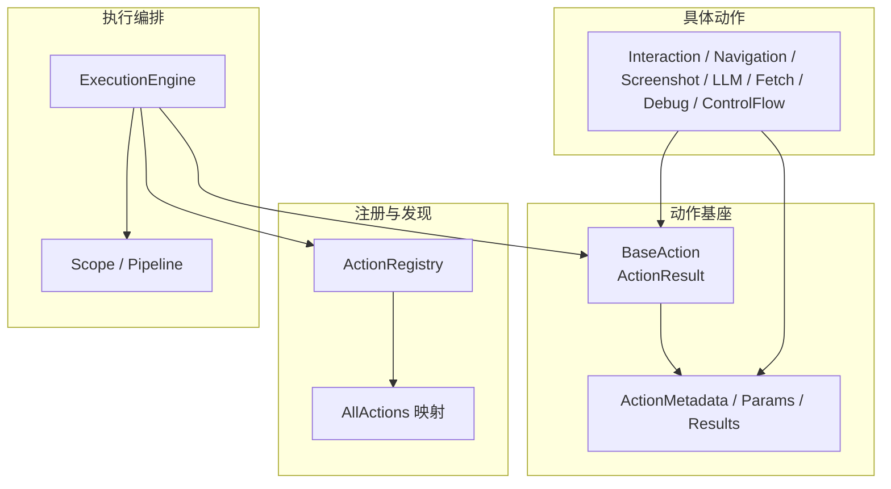
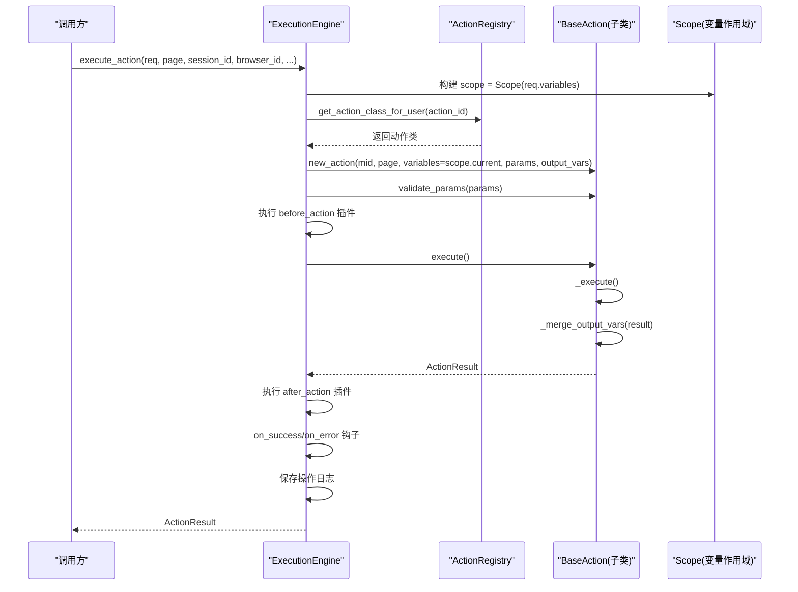
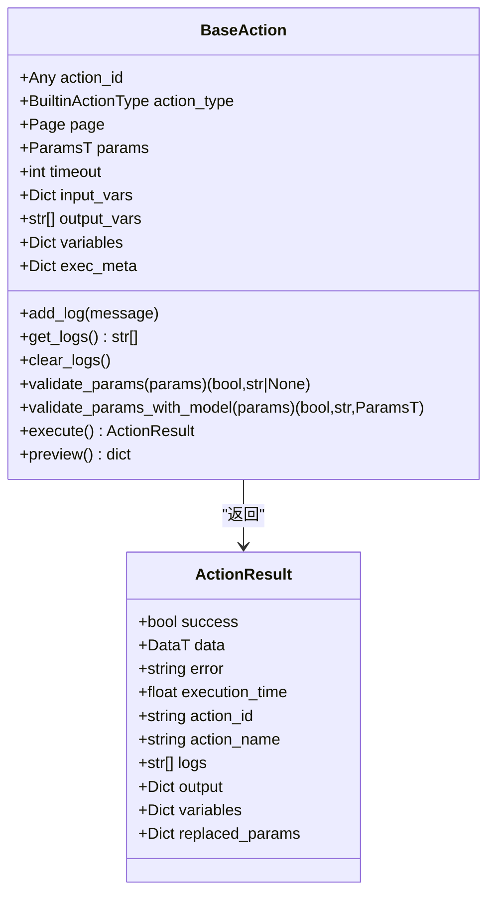
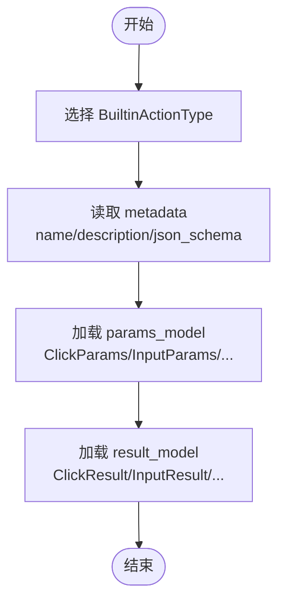
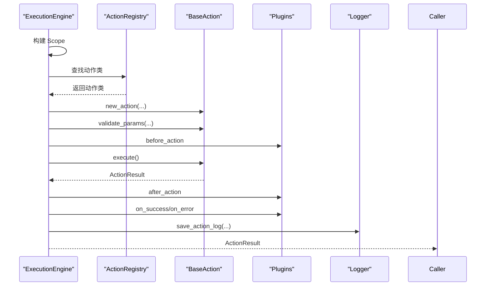
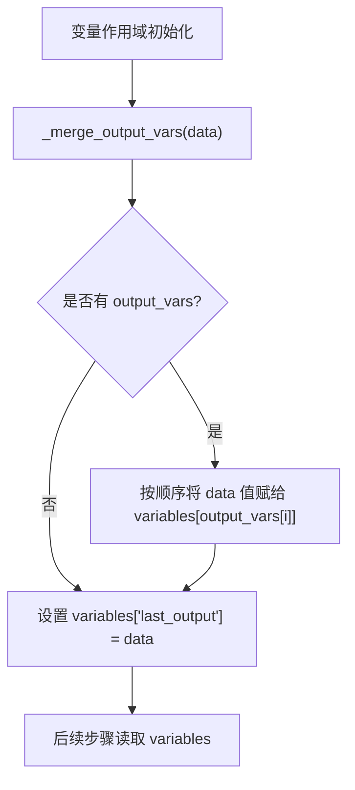
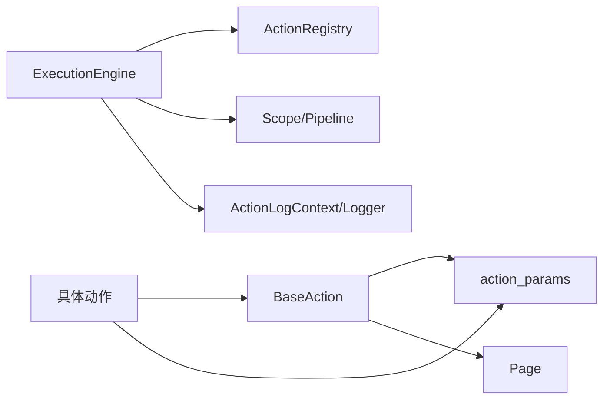

# 动作基础框架

<cite>
**本文引用的文件**
- [base.py](file://RPA-Browser/app/services/execution/actions/base.py)
- [action_params.py](file://RPA-Browser/app/models/execution/action_params.py)
- [all_actions.py](file://RPA-Browser/app/services/execution/actions/all_actions.py)
- [interaction.py](file://RPA-Browser/app/services/execution/actions/interaction.py)
- [control_flow.py](file://RPA-Browser/app/services/execution/actions/control_flow.py)
- [engine.py](file://RPA-Browser/app/services/execution/engine.py)
- [action_registry.py](file://RPA-Browser/app/services/execution/action_registry.py)
</cite>

## 目录
1. [简介](#简介)
2. [项目结构](#项目结构)
3. [核心组件](#核心组件)
4. [架构总览](#架构总览)
5. [详细组件分析](#详细组件分析)
6. [依赖关系分析](#依赖关系分析)
7. [性能考量](#性能考量)
8. [故障排查指南](#故障排查指南)
9. [结论](#结论)
10. [附录：自定义动作开发模板与最佳实践](#附录自定义动作开发模板与最佳实践)

## 简介
本技术文档围绕“动作基础框架”展开，重点解析 BaseAction 抽象基类的设计模式、ActionResult 结果模型、执行阶段控制（validation、pre_execution、execution、post_execution、cleanup）、变量系统（input_vars、output_vars、variables）的工作原理、参数验证机制与元数据管理。同时提供自定义动作开发的基础模板与最佳实践，说明如何正确继承 BaseAction 并实现必要方法。

## 项目结构
动作基础框架位于 RPA-Browser 服务中，核心由以下模块组成：
- 动作基类与结果模型：定义统一的动作生命周期、参数转换、变量合并与预览能力
- 动作类型与参数/结果模型：集中声明内置动作的输入输出结构与元数据
- 动作注册中心：统一查找内置与用户自定义动作
- 执行引擎：编排动作执行、插件钩子、日志采集与作用域变量管理
- 具体动作实现：交互、导航、截图、LLM、外部数据获取、调试与控制流等

图表来源
- [base.py:27-74](file://RPA-Browser/app/services/execution/actions/base.py#L27-L74)
- [action_params.py:79-162](file://RPA-Browser/app/models/execution/action_params.py#L79-L162)
- [all_actions.py:15-41](file://RPA-Browser/app/services/execution/actions/all_actions.py#L15-L41)
- [engine.py:63-164](file://RPA-Browser/app/services/execution/engine.py#L63-L164)

章节来源
- [base.py:27-74](file://RPA-Browser/app/services/execution/actions/base.py#L27-L74)
- [action_params.py:79-162](file://RPA-Browser/app/models/execution/action_params.py#L79-L162)
- [all_actions.py:15-41](file://RPA-Browser/app/services/execution/actions/all_actions.py#L15-L41)
- [engine.py:63-164](file://RPA-Browser/app/services/execution/engine.py#L63-L164)

## 核心组件
- BaseAction：以 dataclass 风格组织参数，持有 page、mid、timeout、变量与作用域引用；提供参数转换、验证、日志收集、变量合并与预览能力；暴露 execute() 统一入口，内部调用子类实现的 _execute()。
- ActionResult：泛型结果模型，包含 success、data、error、execution_time、action_id、action_name、logs、output、variables、replaced_params 等字段，用于标准化返回。
- ActionMetadata / Params / Results：集中描述每个内置动作的参数模型、JSON Schema、结果模型与元信息，便于前端展示与校验。
- ExecutionEngine：动作执行编排器，负责作用域变量替换、动作实例化、参数验证、插件钩子（before_action/after_action/on_success/on_error/on_timeout）、日志采集与超时处理。
- ActionRegistry：动作注册中心，按 action_id 查找内置或用户自定义动作，并提供元数据查询。
- 具体动作实现：基于 BaseAction 实现各业务动作，如点击、输入、等待、滚动、悬停、获取文本/窗口属性、导航、新建页面、截图、LLM、外部数据获取、打印、循环、条件分支、复合操作等。

章节来源
- [base.py:36-273](file://RPA-Browser/app/services/execution/actions/base.py#L36-L273)
- [action_params.py:141-162](file://RPA-Browser/app/models/execution/action_params.py#L141-L162)
- [engine.py:168-363](file://RPA-Browser/app/services/execution/engine.py#L168-L363)
- [action_registry.py:24-96](file://RPA-Browser/app/services/execution/action_registry.py#L24-L96)

## 架构总览
动作执行的核心流程如下：
- 请求进入 ExecutionEngine.execute_action 或 execute_steps
- 构建 Scope（变量作用域），解析参数中的 {{var}} 模板
- 通过 ActionRegistry 查找动作类（内置或自定义）
- 创建 BaseAction 实例，注入 variables（同一引用）、params、output_vars、auth_headers、exec_meta
- 参数验证（validate_params）
- 执行 before_action 插件钩子
- 调用 action.execute() → 内部执行 _execute() → _merge_output_vars 将结果写入 variables
- 执行 after_action 插件钩子
- 根据成功/失败执行 on_success 或 on_error 钩子
- 记录操作日志（含 replaced_params、variables 快照）

图表来源
- [engine.py:72-164](file://RPA-Browser/app/services/execution/engine.py#L72-L164)
- [engine.py:168-363](file://RPA-Browser/app/services/execution/engine.py#L168-L363)
- [action_registry.py:30-59](file://RPA-Browser/app/services/execution/action_registry.py#L30-L59)
- [base.py:237-251](file://RPA-Browser/app/services/execution/actions/base.py#L237-L251)

## 详细组件分析

### BaseAction 抽象基类
- 设计要点
  - dataclass 风格：所有参数在初始化时设置，方便取值与赋值
  - 持有 page 对象与 mid、timeout 等上下文
  - 变量系统：variables 为共享字典引用，_merge_output_vars 将结果按需写入 variables，避免 params 泄漏
  - 参数转换：new_action/_convert_params 支持将 dict 转换为 Pydantic/SQLModel 参数模型
  - 参数验证：validate_params_with_model 使用 params_model.model_validate 进行强校验
  - 生命周期：execute() 统一入口，内部捕获异常并封装为 ActionResult；_execute() 由子类实现
  - 预览：preview() 基于 result_model 构造模拟数据，仅用于测试变量赋值效果
  - 元数据：metadata 委托给 action_type.metadata，便于前端展示 JSON Schema

- 关键方法与字段
  - _merge_output_vars：将 action_result.data 的值按 output_vars 顺序赋给 variables，并始终设置 last_output
  - new_action：安全构造动作实例，自动转换 params/input_vars/output_vars
  - validate_params：对外接口，返回是否通过及错误信息
  - execute：执行并合并输出变量，过滤 callable 值后返回 variables
  - preview：不实际执行，仅生成 mock 结果并合并变量

图表来源
- [base.py:36-273](file://RPA-Browser/app/services/execution/actions/base.py#L36-L273)

章节来源
- [base.py:36-273](file://RPA-Browser/app/services/execution/actions/base.py#L36-L273)

### 动作类型与元数据（ActionMetadata / Params / Results）
- BuiltinActionType：枚举所有内置动作类型，提供 nameDisplay、descDisplay、params_model、result_model、metadata 等属性
- ActionMetadata：描述动作 ID、名称、类型、描述、参数列表、JSON Schema、超时、重试策略、是否需要浏览器上下文等
- AllActionParams / AllActionResult：联合类型，覆盖所有内置动作的入参与出参
- 映射表：BUILTIN_ACTION_PARAMS_MAP、BUILTIN_ACTION_RESULT_MAP 将动作类型与参数/结果模型关联

图表来源
- [action_params.py:79-162](file://RPA-Browser/app/models/execution/action_params.py#L79-L162)
- [action_params.py:691-708](file://RPA-Browser/app/models/execution/action_params.py#L691-L708)

章节来源
- [action_params.py:79-162](file://RPA-Browser/app/models/execution/action_params.py#L79-L162)
- [action_params.py:691-708](file://RPA-Browser/app/models/execution/action_params.py#L691-L708)

### 执行引擎（ExecutionEngine）
- 职责
  - 构建 Scope（变量作用域），解析模板变量
  - 查找动作类（内置/自定义）
  - 创建 BaseAction 实例并注入 variables（同一引用）、params、output_vars、auth_headers、exec_meta
  - 参数验证、插件钩子（before_action/after_action/on_success/on_error/on_timeout）
  - 统一日志采集（ActionLogContext + save_action_log）
  - 超时与异常处理，封装为 ActionResult

- 关键流程
  - execute_action：单动作执行入口
  - execute_steps：工作流步骤序列执行（Pipeline）
  - _run_action_core：核心执行逻辑，包含权限校验（复合操作）、DB 步骤注入、参数合并、插件执行、日志保存

图表来源
- [engine.py:72-164](file://RPA-Browser/app/services/execution/engine.py#L72-L164)
- [engine.py:168-363](file://RPA-Browser/app/services/execution/engine.py#L168-L363)

章节来源
- [engine.py:72-164](file://RPA-Browser/app/services/execution/engine.py#L72-L164)
- [engine.py:168-363](file://RPA-Browser/app/services/execution/engine.py#L168-L363)

### 变量系统（input_vars、output_vars、variables）
- variables：共享字典引用，由 ExecutionEngine 注入到 BaseAction，_merge_output_vars 直接写入，后续步骤可直接读取
- input_vars：动作级输入变量映射，用于将上游输出映射到当前动作参数
- output_vars：动作级输出变量映射，将 action_result.data 的值按顺序赋给 variables 对应键，并始终设置 last_output
- 模板替换：ExecutionEngine 在运行前对 params 进行 {{var}} 模板替换，支持点路径访问

图表来源
- [base.py:75-107](file://RPA-Browser/app/services/execution/actions/base.py#L75-L107)
- [engine.py:277-300](file://RPA-Browser/app/services/execution/engine.py#L277-L300)

章节来源
- [base.py:75-107](file://RPA-Browser/app/services/execution/actions/base.py#L75-L107)
- [engine.py:277-300](file://RPA-Browser/app/services/execution/engine.py#L277-L300)

### 参数验证机制
- validate_params_with_model：使用 params_model.model_validate 进行强校验，返回是否通过、错误信息与验证后的参数
- validate_params：对外接口，若未提供 params 或未配置 params_model，则视为通过
- 内置动作参数模型：如 ClickParams、InputParams、NavigateParams 等，均具备字段约束与自定义校验器

章节来源
- [base.py:205-227](file://RPA-Browser/app/services/execution/actions/base.py#L205-L227)
- [action_params.py:231-248](file://RPA-Browser/app/models/execution/action_params.py#L231-L248)

### 元数据管理
- ActionMetadata：集中描述动作的 JSON Schema、参数列表、超时、重试策略、是否需要浏览器上下文等
- BuiltinActionType.metadata：动态从 params_model 的 model_json_schema 提取参数定义，生成 ActionMetadata
- ActionRegistry.get_all_action_metadatas：返回所有内置动作的元数据，供前端展示与表单生成

章节来源
- [action_params.py:147-162](file://RPA-Browser/app/models/execution/action_params.py#L147-L162)
- [action_params.py:117-138](file://RPA-Browser/app/models/execution/action_params.py#L117-L138)
- [action_registry.py:86-96](file://RPA-Browser/app/services/execution/action_registry.py#L86-L96)

### 具体动作示例（交互类）
- ClickAction：支持 selector 或 position 点击，支持双击、修饰键、延迟、强制点击、试验模式等
- InputAction：支持 selector 填充或无 selector 时键盘输入
- WaitAction：等待元素状态或固定等待，超时返回 element_found=False
- HoverAction：悬停元素或移动到坐标
- GetTextAction：获取元素文本，支持分隔符拼接
- GetWindowAction：安全获取 window 对象属性或遍历对象字段

章节来源
- [interaction.py:18-125](file://RPA-Browser/app/services/execution/actions/interaction.py#L18-L125)
- [interaction.py:127-200](file://RPA-Browser/app/services/execution/actions/interaction.py#L127-L200)
- [interaction.py:202-268](file://RPA-Browser/app/services/execution/actions/interaction.py#L202-L268)
- [interaction.py:271-345](file://RPA-Browser/app/services/execution/actions/interaction.py#L271-L345)
- [interaction.py:348-435](file://RPA-Browser/app/services/execution/actions/interaction.py#L348-L435)
- [interaction.py:438-497](file://RPA-Browser/app/services/execution/actions/interaction.py#L438-L497)
- [interaction.py:500-597](file://RPA-Browser/app/services/execution/actions/interaction.py#L500-L597)

### 控制流动作（Loop、IfElse、Composite）
- LoopStrategy：支持 fixed_count、variable、expression、json_list 多种循环来源；支持 break/continue 条件；支持参数映射（param_mapping）
- IfElseStrategy：结构化条件评估（ConditionRule），执行真/假分支
- CompositeAction：复合操作，支持嵌套步骤、权限校验、DB 步骤注入、子步骤日志串联

章节来源
- [control_flow.py:39-118](file://RPA-Browser/app/services/execution/actions/control_flow.py#L39-L118)
- [control_flow.py:414-664](file://RPA-Browser/app/services/execution/actions/control_flow.py#L414-L664)
- [control_flow.py:666-738](file://RPA-Browser/app/services/execution/actions/control_flow.py#L666-L738)

## 依赖关系分析
- BaseAction 依赖：
  - action_params：BuiltinActionType、ActionMetadata、AllActionResult
  - Page：浏览器上下文
  - SQLModel：参数模型基类
- ExecutionEngine 依赖：
  - ActionRegistry：动作类查找
  - Scope/Pipeline：变量作用域与步骤 IR
  - ActionLogContext/save_action_log：日志采集
  - PluginConfig：插件配置
- 具体动作依赖：
  - BaseAction：统一生命周期与变量合并
  - action_params：各自参数与结果模型

图表来源
- [base.py:10-23](file://RPA-Browser/app/services/execution/actions/base.py#L10-L23)
- [engine.py:26-55](file://RPA-Browser/app/services/execution/engine.py#L26-L55)
- [all_actions.py:1-41](file://RPA-Browser/app/services/execution/actions/all_actions.py#L1-L41)

章节来源
- [base.py:10-23](file://RPA-Browser/app/services/execution/actions/base.py#L10-L23)
- [engine.py:26-55](file://RPA-Browser/app/services/execution/engine.py#L26-L55)
- [all_actions.py:1-41](file://RPA-Browser/app/services/execution/actions/all_actions.py#L1-L41)

## 性能考量
- 变量作用域共享引用：_merge_output_vars 直接写入 variables，避免拷贝开销
- 参数模板替换：在 ExecutionEngine 层一次性完成，减少重复计算
- 插件钩子：after_action 失败仅警告，不影响主流程
- 嵌套深度限制：Loop/IfElse 策略中检查 settings.workflow_max_nesting_depth，防止过深嵌套导致性能问题
- 日志采集：仅在必要时记录 params/result/variables，可配置 max_payload_length 与 retention_days

## 故障排查指南
- 常见错误
  - 未找到动作：检查 action_id 是否正确，或通过 ActionRegistry 确认是否存在
  - 参数验证失败：查看 validate_params 返回的错误信息，确保 params_model 字段满足约束
  - 变量缺失：确认 input_vars 与 output_vars 映射是否正确，检查 variables 中是否存在所需键
  - 超时：检查动作 timeout 配置与底层 API 响应时间
  - 权限问题：复合操作需校验 mid 与 is_public，确保有权执行

- 定位方法
  - 查看 ActionResult.error 与 logs
  - 检查 ActionLogContext 记录的 replaced_params 与 variables 快照
  - 使用 preview() 验证变量赋值效果

章节来源
- [engine.py:273-363](file://RPA-Browser/app/services/execution/engine.py#L273-L363)
- [base.py:237-251](file://RPA-Browser/app/services/execution/actions/base.py#L237-L251)

## 结论
BaseAction 提供了统一的动作生命周期、参数验证、变量管理与结果封装；ExecutionEngine 负责编排执行、插件钩子与日志采集；ActionMetadata/Params/Results 实现了动作元数据的集中管理与前端友好展示。通过该框架，开发者可以高效地扩展自定义动作，并确保执行过程的可观测性与可维护性。

## 附录：自定义动作开发模板与最佳实践
- 继承 BaseAction
  - 定义 action_id、action_type、params 类型注解
  - 实现 _execute() 方法，返回 ActionResult
  - 可选：重写 new_action() 以定制构造逻辑

- 参数模型
  - 使用 Pydantic/SQLModel 定义参数模型，添加字段约束与自定义校验器
  - 通过 BUILTIN_ACTION_PARAMS_MAP 注册参数模型（如需）

- 结果模型
  - 定义结果模型并通过 BUILTIN_ACTION_RESULT_MAP 注册（如需）

- 变量与输出
  - 使用 output_vars 将结果映射到 variables，避免泄露 params
  - 使用 input_vars 将上游输出映射到当前动作参数

- 元数据
  - 利用 BuiltinActionType.metadata 自动生成 JSON Schema，便于前端展示

- 最佳实践
  - 保持 _execute() 幂等与健壮，捕获异常并返回 ActionResult
  - 合理设置 timeout，避免长时间阻塞
  - 使用 ActionLogContext 记录关键日志，便于追踪
  - 对于复杂逻辑，优先使用控制流动作（Loop/IfElse）组合，而非硬编码

章节来源
- [base.py:52-273](file://RPA-Browser/app/services/execution/actions/base.py#L52-L273)
- [action_params.py:198-533](file://RPA-Browser/app/models/execution/action_params.py#L198-L533)
- [action_params.py:691-708](file://RPA-Browser/app/models/execution/action_params.py#L691-L708)
- [all_actions.py:15-41](file://RPA-Browser/app/services/execution/actions/all_actions.py#L15-L41)