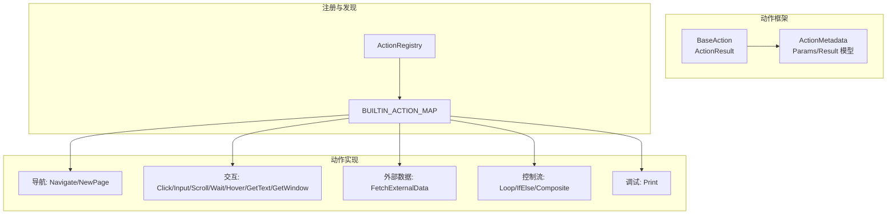
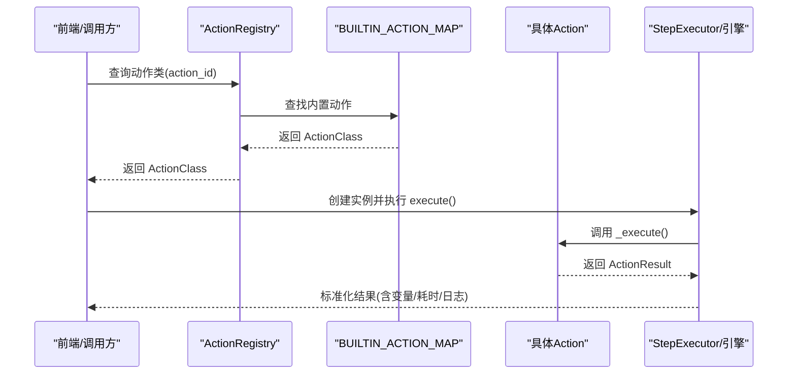
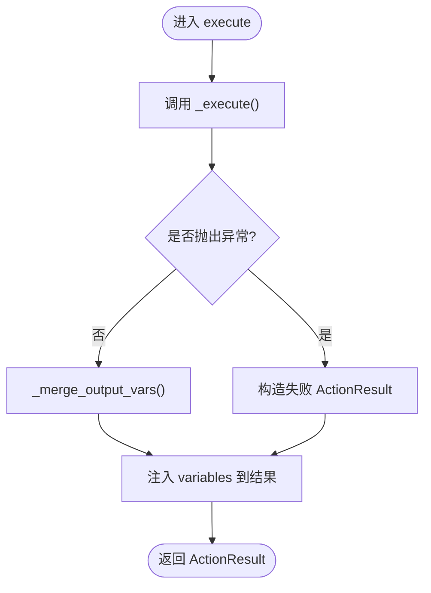
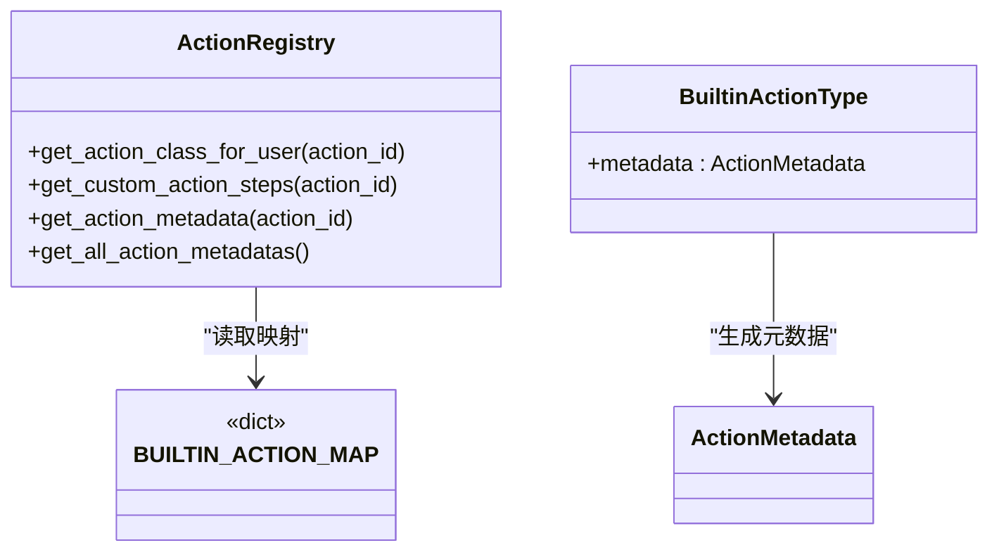
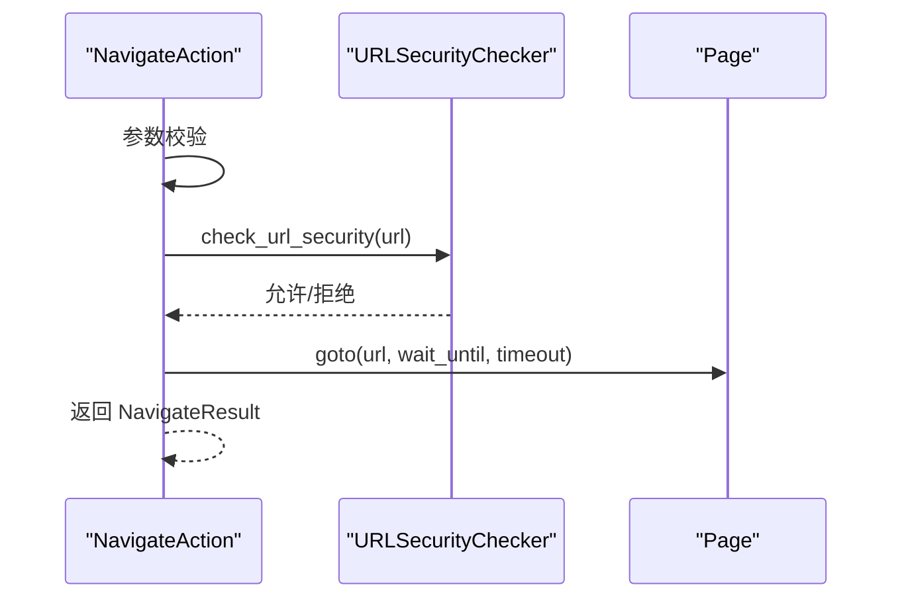
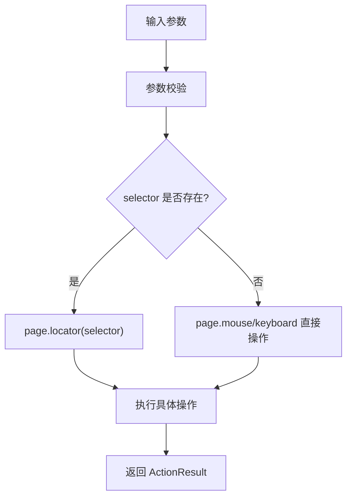
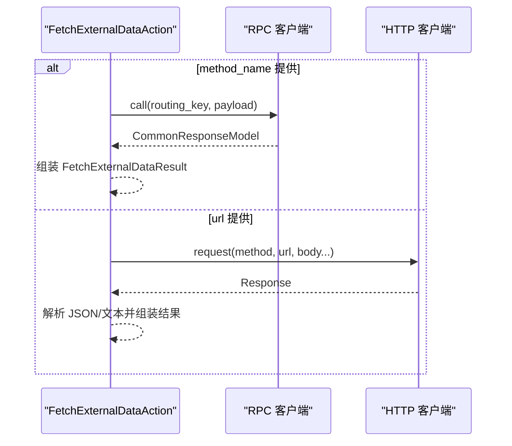
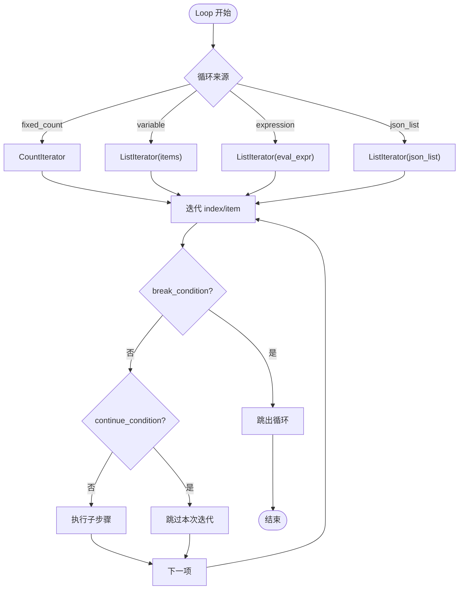
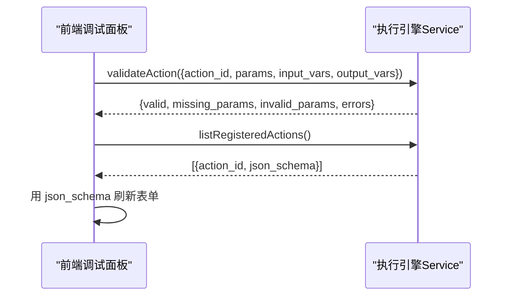
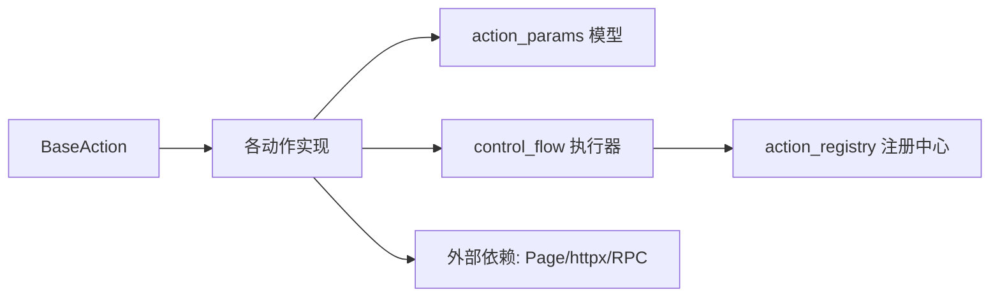

# 动作系统

<cite>
**本文引用的文件**
- [base.py](file://RPA-Browser/app/services/execution/actions/base.py)
- [all_actions.py](file://RPA-Browser/app/services/execution/actions/all_actions.py)
- [action_registry.py](file://RPA-Browser/app/services/execution/action_registry.py)
- [action_params.py](file://RPA-Browser/app/models/execution/action_params.py)
- [navigation.py](file://RPA-Browser/app/services/execution/actions/navigation.py)
- [interaction.py](file://RPA-Browser/app/services/execution/actions/interaction.py)
- [control_flow.py](file://RPA-Browser/app/services/execution/actions/control_flow.py)
- [fetch_external_data.py](file://RPA-Browser/app/services/execution/actions/fetch_external_data.py)
- [useDebugboxExecution.ts](file://Vue3FrontEndDemoExercise/src/components/rpa-browser/useDebugboxExecution.ts)
- [types.gen.ts](file://Vue3FrontEndDemoExercise/src/api/browser/hey-api/types.gen.ts)
</cite>

## 目录
1. [简介](#简介)
2. [项目结构](#项目结构)
3. [核心组件](#核心组件)
4. [架构总览](#架构总览)
5. [详细组件分析](#详细组件分析)
6. [依赖关系分析](#依赖关系分析)
7. [性能与可扩展性](#性能与可扩展性)
8. [故障排查指南](#故障排查指南)
9. [结论](#结论)
10. [附录：自定义动作开发规范与示例](#附录自定义动作开发规范与示例)

## 简介
本技术文档围绕 RPA-Browser 的动作系统，系统性解析 BaseAction 基类设计、动作注册机制、动作元数据管理；详细说明内置动作的分类与实现（页面导航、元素操作、数据提取、条件判断、循环控制等）；并给出自定义动作的开发规范、参数验证机制、结果返回格式、调试方法与最佳实践，帮助扩展新的动作类型。

## 项目结构
动作系统位于 RPA-Browser 后端服务中，采用“基类 + 分类模块 + 统一注册”的分层组织方式：
- 基类与执行框架：BaseAction、ActionResult、执行阶段、变量合并等
- 动作定义与元数据：BuiltinActionType、各 Params/Result 模型、ActionMetadata
- 动作实现：按功能分模块（导航、交互、截图、LLM、外部数据、控制流、调试）
- 注册中心：ActionRegistry 负责内置与自定义动作的查找与元数据提供
- 前端集成：类型定义与调试校验接口调用

图表来源
- [base.py:1-273](file://RPA-Browser/app/services/execution/actions/base.py#L1-L273)
- [action_params.py:79-162](file://RPA-Browser/app/models/execution/action_params.py#L79-L162)
- [all_actions.py:1-56](file://RPA-Browser/app/services/execution/actions/all_actions.py#L1-L56)
- [action_registry.py:24-100](file://RPA-Browser/app/services/execution/action_registry.py#L24-L100)

章节来源
- [base.py:1-273](file://RPA-Browser/app/services/execution/actions/base.py#L1-L273)
- [action_params.py:79-162](file://RPA-Browser/app/models/execution/action_params.py#L79-L162)
- [all_actions.py:1-56](file://RPA-Browser/app/services/execution/actions/all_actions.py#L1-L56)
- [action_registry.py:24-100](file://RPA-Browser/app/services/execution/action_registry.py#L24-L100)

## 核心组件
- BaseAction 基类：封装动作生命周期、参数转换、变量合并、日志采集、预览模式等
- ActionResult：标准化执行结果（成功/失败、耗时、变量、替换后参数等）
- BuiltinActionType：内置动作枚举，绑定参数模型、结果模型与元数据
- ActionMetadata：描述动作名称、描述、JSON Schema、超时、重试策略等
- 执行阶段：validation → pre_execution → execution → post_execution → cleanup（由上层引擎编排）

关键职责
- 参数校验：基于 Pydantic/SQLModel 的强类型参数模型
- 变量作用域：input_vars/output_vars 与 variables 池的合并
- 结果标准化：统一 ActionResult 结构，便于日志与前端展示
- 元数据生成：从参数模型自动生成 JSON Schema，供前端动态表单渲染

章节来源
- [base.py:27-273](file://RPA-Browser/app/services/execution/actions/base.py#L27-L273)
- [action_params.py:79-162](file://RPA-Browser/app/models/execution/action_params.py#L79-L162)

## 架构总览
动作系统通过“工厂映射 + 注册中心 + 执行器”解耦动作定义与执行：
- all_actions.py 维护 action_id → ActionClass 的映射
- ActionRegistry 提供 get_action_class_for_user、get_all_action_metadatas 等能力
- control_flow.py 中的 StepExecutor 根据 action_id 选择执行策略（原子/循环/条件）
- 每个 Action 实现 _execute()，由 BaseAction.execute() 统一包装异常与变量合并

图表来源
- [all_actions.py:15-45](file://RPA-Browser/app/services/execution/actions/all_actions.py#L15-L45)
- [action_registry.py:30-96](file://RPA-Browser/app/services/execution/action_registry.py#L30-L96)
- [control_flow.py:84-118](file://RPA-Browser/app/services/execution/actions/control_flow.py#L84-L118)
- [base.py:228-251](file://RPA-Browser/app/services/execution/actions/base.py#L228-L251)

## 详细组件分析

### BaseAction 基类与执行流程
- 参数转换：_convert_params 将 dict 转为对应 Pydantic 模型
- 参数校验：validate_params / validate_params_with_model
- 执行封装：execute() 捕获异常、合并输出变量、注入 variables
- 预览模式：preview() 使用 result_model 构造模拟数据，不实际执行

图表来源
- [base.py:228-273](file://RPA-Browser/app/services/execution/actions/base.py#L228-L273)

章节来源
- [base.py:27-273](file://RPA-Browser/app/services/execution/actions/base.py#L27-L273)

### 动作注册与元数据管理
- BUILTIN_ACTION_MAP：action_id → ActionClass 的静态映射
- ActionRegistry：
  - get_action_class_for_user：先查内置，再查自定义复合操作
  - get_custom_action_steps：加载自定义步骤并确保 action_type 字段存在
  - get_all_action_metadatas：返回所有内置动作的元数据（含 JSON Schema）
- ActionMetadata：由 BuiltinActionType.metadata 属性动态生成，包含参数 JSON Schema

图表来源
- [action_registry.py:24-100](file://RPA-Browser/app/services/execution/action_registry.py#L24-L100)
- [all_actions.py:15-45](file://RPA-Browser/app/services/execution/actions/all_actions.py#L15-L45)
- [action_params.py:79-162](file://RPA-Browser/app/models/execution/action_params.py#L79-L162)

章节来源
- [action_registry.py:24-100](file://RPA-Browser/app/services/execution/action_registry.py#L24-L100)
- [all_actions.py:15-45](file://RPA-Browser/app/services/execution/actions/all_actions.py#L15-L45)
- [action_params.py:79-162](file://RPA-Browser/app/models/execution/action_params.py#L79-L162)

### 内置动作分类与实现

#### 页面导航
- NavigateAction：URL 安全校验（协议、主机名、IP、DNS），支持 wait_until/timeout
- NewPageAction：创建新页、限制最大页数、激活新页、可选导航 URL

图表来源
- [navigation.py:189-275](file://RPA-Browser/app/services/execution/actions/navigation.py#L189-L275)
- [navigation.py:20-187](file://RPA-Browser/app/services/execution/actions/navigation.py#L20-L187)

章节来源
- [navigation.py:189-275](file://RPA-Browser/app/services/execution/actions/navigation.py#L189-L275)
- [navigation.py:20-187](file://RPA-Browser/app/services/execution/actions/navigation.py#L20-L187)

#### 元素操作
- ClickAction：支持 selector 或坐标点击、双击、修饰键、延迟、强制点击
- InputAction：fill 输入或键盘输入
- ScrollAction：滚动到元素或页面顶部
- WaitAction：等待元素状态或固定等待
- HoverAction：悬停到元素或坐标
- GetTextAction：获取匹配元素文本集合
- GetWindowAction：安全获取 window 对象属性（禁止函数调用）

图表来源
- [interaction.py:18-124](file://RPA-Browser/app/services/execution/actions/interaction.py#L18-L124)
- [interaction.py:127-199](file://RPA-Browser/app/services/execution/actions/interaction.py#L127-L199)
- [interaction.py:202-268](file://RPA-Browser/app/services/execution/actions/interaction.py#L202-L268)
- [interaction.py:271-345](file://RPA-Browser/app/services/execution/actions/interaction.py#L271-L345)
- [interaction.py:348-435](file://RPA-Browser/app/services/execution/actions/interaction.py#L348-L435)
- [interaction.py:438-497](file://RPA-Browser/app/services/execution/actions/interaction.py#L438-L497)
- [interaction.py:500-596](file://RPA-Browser/app/services/execution/actions/interaction.py#L500-L596)

章节来源
- [interaction.py:18-596](file://RPA-Browser/app/services/execution/actions/interaction.py#L18-L596)

#### 数据提取
- LLMAction：调用 LLM 服务，支持结构化输出（response_schema）
- FetchExternalDataAction：支持 RPC 模式（RabbitMQ/RPC）与 HTTP 模式（httpx），统一返回 FetchExternalDataResult

图表来源
- [fetch_external_data.py:75-109](file://RPA-Browser/app/services/execution/actions/fetch_external_data.py#L75-L109)
- [fetch_external_data.py:111-216](file://RPA-Browser/app/services/execution/actions/fetch_external_data.py#L111-L216)
- [fetch_external_data.py:218-313](file://RPA-Browser/app/services/execution/actions/fetch_external_data.py#L218-L313)

章节来源
- [fetch_external_data.py:75-313](file://RPA-Browser/app/services/execution/actions/fetch_external_data.py#L75-L313)

#### 条件判断与循环控制
- IfElseAction：结构化条件评估（ConditionRule），执行真/假分支
- LoopAction：多种循环来源（固定次数、变量、表达式、JSON 列表），支持 break/continue 条件、参数映射、嵌套深度保护
- CompositeAction：复合操作步骤执行，支持子步骤链式执行与错误处理

图表来源
- [control_flow.py:414-641](file://RPA-Browser/app/services/execution/actions/control_flow.py#L414-L641)
- [control_flow.py:666-738](file://RPA-Browser/app/services/execution/actions/control_flow.py#L666-L738)

章节来源
- [control_flow.py:414-738](file://RPA-Browser/app/services/execution/actions/control_flow.py#L414-L738)

### 前端集成与调试
- 前端类型定义：BuiltinActionType、ActionResultResponse、ActionValidateRequest
- 参数验证：前端调用 validateAction 接口，传入 action_id、params、input_vars、output_vars
- 刷新 schema：拉取 registered actions 的 json_schema 更新表单

图表来源
- [types.gen.ts:663-739](file://Vue3FrontEndDemoExercise/src/api/browser/hey-api/types.gen.ts#L663-L739)
- [types.gen.ts:2167-2253](file://Vue3FrontEndDemoExercise/src/api/browser/hey-api/types.gen.ts#L2167-L2253)
- [useDebugboxExecution.ts:121-151](file://Vue3FrontEndDemoExercise/src/components/rpa-browser/useDebugboxExecution.ts#L121-L151)

章节来源
- [types.gen.ts:663-739](file://Vue3FrontEndDemoExercise/src/api/browser/hey-api/types.gen.ts#L663-L739)
- [types.gen.ts:2167-2253](file://Vue3FrontEndDemoExercise/src/api/browser/hey-api/types.gen.ts#L2167-L2253)
- [useDebugboxExecution.ts:121-151](file://Vue3FrontEndDemoExercise/src/components/rpa-browser/useDebugboxExecution.ts#L121-L151)

## 依赖关系分析
- 动作实现依赖：
  - BaseAction：所有动作继承基类，复用参数转换、变量合并、结果封装
  - action_params：强类型参数/结果模型，驱动元数据生成与前端表单
  - control_flow：StepExecutor 与 ExecutionStrategy 决定执行路径
  - action_registry：统一入口，屏蔽内置/自定义差异
- 外部依赖：
  - Playwright（botright.playwright_mock.Page）用于浏览器操作
  - httpx 用于 HTTP 请求
  - RabbitMQ/RPC 客户端用于内部方法调用

图表来源
- [base.py:1-273](file://RPA-Browser/app/services/execution/actions/base.py#L1-L273)
- [action_params.py:79-162](file://RPA-Browser/app/models/execution/action_params.py#L79-L162)
- [control_flow.py:84-118](file://RPA-Browser/app/services/execution/actions/control_flow.py#L84-L118)
- [action_registry.py:24-100](file://RPA-Browser/app/services/execution/action_registry.py#L24-L100)
- [fetch_external_data.py:218-313](file://RPA-Browser/app/services/execution/actions/fetch_external_data.py#L218-L313)

章节来源
- [base.py:1-273](file://RPA-Browser/app/services/execution/actions/base.py#L1-L273)
- [action_params.py:79-162](file://RPA-Browser/app/models/execution/action_params.py#L79-L162)
- [control_flow.py:84-118](file://RPA-Browser/app/services/execution/actions/control_flow.py#L84-L118)
- [action_registry.py:24-100](file://RPA-Browser/app/services/execution/action_registry.py#L24-L100)
- [fetch_external_data.py:218-313](file://RPA-Browser/app/services/execution/actions/fetch_external_data.py#L218-L313)

## 性能与可扩展性
- 性能要点
  - 参数校验在基类集中进行，减少重复逻辑
  - 循环/条件执行器支持嵌套深度限制，避免过深递归导致栈溢出
  - 导航与外部数据请求具备超时与重试配置，提升鲁棒性
- 可扩展点
  - 新增内置动作：在 BuiltinActionType 添加成员，并在 all_actions.py 映射
  - 新增自定义动作：通过 CompositeAction 组合现有步骤，或通过 ActionRegistry 注册
  - 元数据驱动前端：利用 JSON Schema 自动生成表单，降低前后端耦合

[本节为通用指导，不直接分析具体文件]

## 故障排查指南
- 参数验证失败
  - 检查 action_params 模型约束（必填、长度、范围）
  - 使用前端 validateAction 接口快速定位缺失/无效字段
- 执行异常
  - 查看 ActionResult.error 与 logs，定位具体动作与异常堆栈
  - 对导航动作检查 URL 安全策略（协议、回环地址、私有地址）
  - 对外部数据动作检查 RPC 方法白名单与 HTTP 请求体格式
- 循环/条件问题
  - 检查 break/continue 条件表达式与变量作用域
  - 确认 loop_source 与 items 来源正确

章节来源
- [base.py:228-273](file://RPA-Browser/app/services/execution/actions/base.py#L228-L273)
- [navigation.py:20-187](file://RPA-Browser/app/services/execution/actions/navigation.py#L20-L187)
- [fetch_external_data.py:111-216](file://RPA-Browser/app/services/execution/actions/fetch_external_data.py#L111-L216)
- [control_flow.py:414-641](file://RPA-Browser/app/services/execution/actions/control_flow.py#L414-L641)

## 结论
动作系统以 BaseAction 为核心，结合强类型参数模型与统一注册机制，实现了高内聚、低耦合的可扩展执行框架。内置动作覆盖导航、交互、数据提取与控制流，满足常见 RPA 场景；同时通过 ActionMetadata 与前端集成，提供可视化调试与动态表单能力。建议遵循开发规范与最佳实践，持续完善动作生态。

[本节为总结，不直接分析具体文件]

## 附录：自定义动作开发规范与示例

### 开发规范
- 继承 BaseAction，实现 _execute()
- 定义参数模型（继承 BaseActionParams 或更具体的基类）
- 定义结果模型（继承 SQLModel，并与 BuiltinActionType.result_model 对齐）
- 在 all_actions.py 的 BUILTIN_ACTION_MAP 中注册动作映射
- 如需自定义复合动作，使用 CompositeAction 组合步骤，并通过 ActionRegistry 加载

### 参数验证机制
- 使用 Pydantic/SQLModel 字段约束（必填、范围、枚举）
- 基类提供 validate_params / validate_params_with_model 统一校验
- 前端通过 ActionValidateRequest 进行预校验

### 结果返回格式
- 统一返回 ActionResult，包含 success/data/error/execution_time/action_id/action_name/variables/replaced_params/logs
- 数据字段使用对应的 Result 模型，便于序列化与前端展示

### 调试方法
- 使用 PrintAction 打印变量替换后的内容
- 使用前端 validateAction 接口验证参数
- 查看 ActionLogContext 与 save_action_log 记录的执行日志

### 最佳实践
- 保持动作单一职责，复杂逻辑拆分为多个步骤
- 合理设置超时与重试，避免长时间阻塞
- 使用结构化条件（ConditionRule）替代 eval，确保安全
- 通过 JSON Schema 驱动前端表单，减少前后端约定成本

章节来源
- [base.py:108-179](file://RPA-Browser/app/services/execution/actions/base.py#L108-L179)
- [action_params.py:198-533](file://RPA-Browser/app/models/execution/action_params.py#L198-L533)
- [all_actions.py:15-45](file://RPA-Browser/app/services/execution/actions/all_actions.py#L15-L45)
- [control_flow.py:249-340](file://RPA-Browser/app/services/execution/actions/control_flow.py#L249-L340)
- [types.gen.ts:663-739](file://Vue3FrontEndDemoExercise/src/api/browser/hey-api/types.gen.ts#L663-L739)