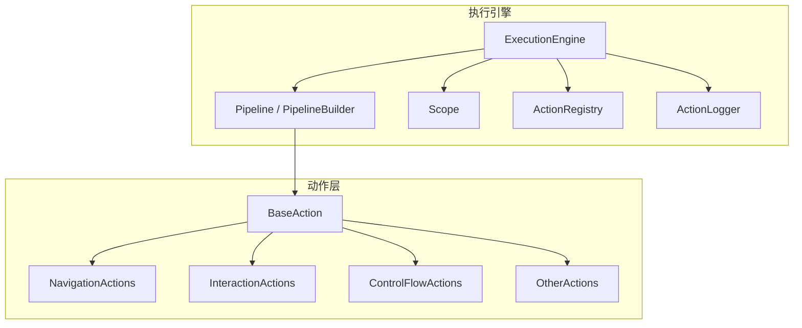
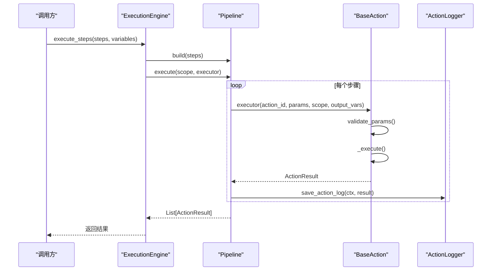
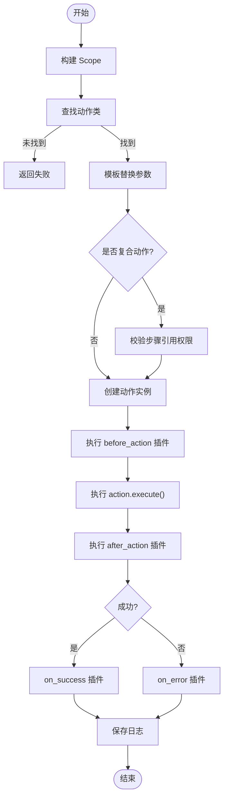
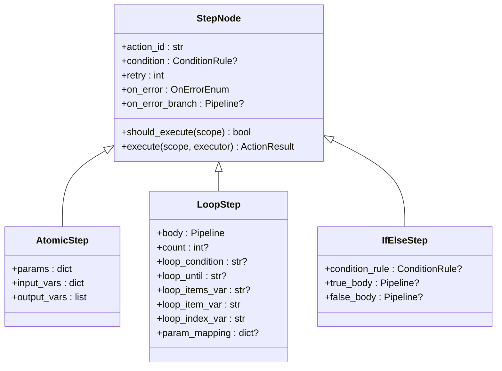
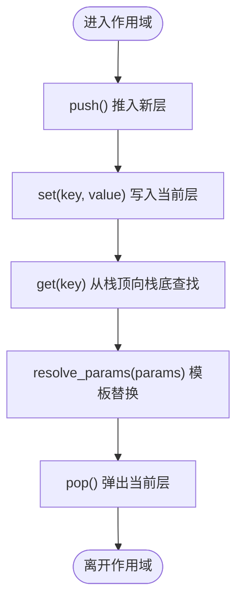
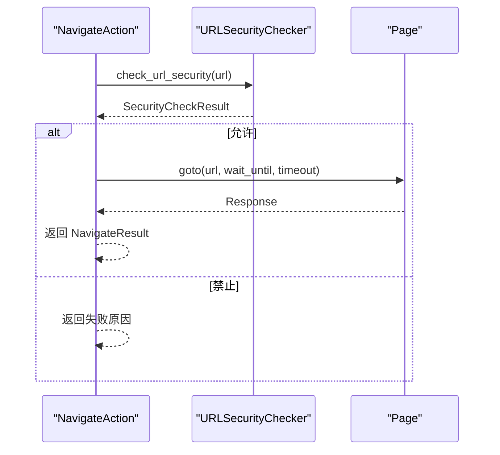
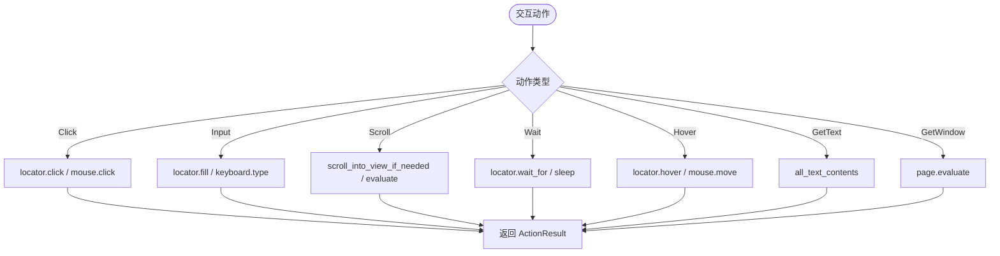
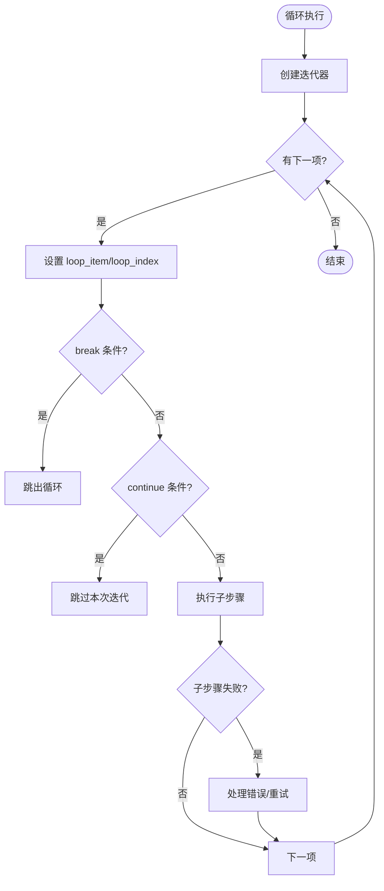
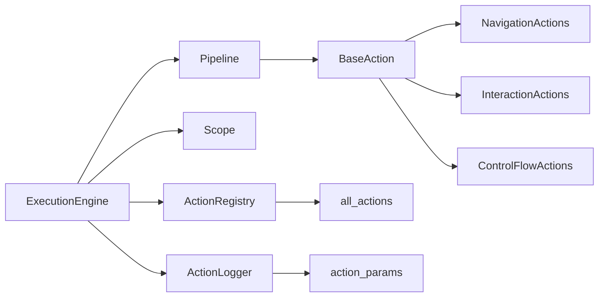

# 执行引擎

<cite>
**本文引用的文件**
- [engine.py](file://RPA-Browser/app/services/execution/engine.py)
- [pipeline.py](file://RPA-Browser/app/services/execution/pipeline.py)
- [action_registry.py](file://RPA-Browser/app/services/execution/action_registry.py)
- [base.py](file://RPA-Browser/app/services/execution/actions/base.py)
- [all_actions.py](file://RPA-Browser/app/services/execution/actions/all_actions.py)
- [navigation.py](file://RPA-Browser/app/services/execution/actions/navigation.py)
- [interaction.py](file://RPA-Browser/app/services/execution/actions/interaction.py)
- [control_flow.py](file://RPA-Browser/app/services/execution/actions/control_flow.py)
- [scope.py](file://RPA-Browser/app/services/execution/scope.py)
- [action_logger.py](file://RPA-Browser/app/services/execution/action_logger.py)
- [action_params.py](file://RPA-Browser/app/models/execution/action_params.py)
</cite>

## 目录
1. [简介](#简介)
2. [项目结构](#项目结构)
3. [核心组件](#核心组件)
4. [架构总览](#架构总览)
5. [详细组件分析](#详细组件分析)
6. [依赖关系分析](#依赖关系分析)
7. [性能考量](#性能考量)
8. [故障排查指南](#故障排查指南)
9. [结论](#结论)
10. [附录](#附录)

## 简介
本技术文档聚焦 RPA 执行引擎模块，系统性解析任务执行流程、动作注册机制、管道处理逻辑与预定义动作实现（页面导航、元素操作、数据提取、条件判断等）。同时文档化自定义动作开发规范、插件扩展机制、错误处理与日志记录，并提供动作开发示例与调试方法，帮助构建复杂自动化工作流。

## 项目结构
执行引擎位于 RPA-Browser 服务的 services/execution 目录下，围绕“作用域 Scope + 管道 Pipeline + 动作 Action”的三层设计组织代码：
- 作用域 Scope：变量栈与作用域隔离，模板变量替换
- 管道 Pipeline：将工作流步骤编译为 IR（原子/循环/分支），按 left-fold 顺序执行
- 动作 Action：统一基类 BaseAction，内置动作分类实现（导航、交互、截图、LLM、外部数据、控制流等）
- 注册中心 ActionRegistry：管理内置与用户自定义动作查找
- 日志 ActionLogger：统一采集执行上下文与结果，支持策略配置与降级兜底
- 参数模型 action_params：枚举、元数据、参数/结果模型、日志选项等

**图表来源**
- [engine.py:63-164](file://RPA-Browser/app/services/execution/engine.py#L63-L164)
- [pipeline.py:67-121](file://RPA-Browser/app/services/execution/pipeline.py#L67-L121)
- [scope.py:17-139](file://RPA-Browser/app/services/execution/scope.py#L17-L139)
- [action_registry.py:24-100](file://RPA-Browser/app/services/execution/action_registry.py#L24-L100)
- [action_logger.py:121-213](file://RPA-Browser/app/services/execution/action_logger.py#L121-L213)

**章节来源**
- [engine.py:1-164](file://RPA-Browser/app/services/execution/engine.py#L1-L164)
- [pipeline.py:1-121](file://RPA-Browser/app/services/execution/pipeline.py#L1-L121)
- [scope.py:1-139](file://RPA-Browser/app/services/execution/scope.py#L1-L139)
- [action_registry.py:1-100](file://RPA-Browser/app/services/execution/action_registry.py#L1-L100)
- [action_logger.py:1-213](file://RPA-Browser/app/services/execution/action_logger.py#L1-L213)

## 核心组件
- ExecutionEngine：无状态执行入口，负责单动作执行与工作流步骤执行；统一埋点日志；插件钩子生命周期管理
- Pipeline/PipelineBuilder：将 WorkflowStep 列表编译为 StepNode（Atomic/Loop/IfElse），并顺序执行；支持 on_error_branch 重试/回退
- Scope：变量作用域栈，支持 push/pop 隔离、模板 {{var}} 解析、快照 snapshot
- ActionRegistry：内置动作映射与用户自定义动作查询（复合操作）
- BaseAction：动作抽象基类，封装参数转换、输出变量合并、预览模式、日志阶段标记
- 动作族：导航（Navigate/NewPage）、交互（Click/Input/Scroll/Wait/Hover/GetText/GetWindow）、控制流（Loop/IfElse/Composite）、其他（Screenshot/LLM/FetchExternalData/Print）
- ActionLogger：统一采集执行上下文与结果，支持多级优先级配置与失败兜底

**章节来源**
- [engine.py:63-464](file://RPA-Browser/app/services/execution/engine.py#L63-L464)
- [pipeline.py:67-619](file://RPA-Browser/app/services/execution/pipeline.py#L67-L619)
- [scope.py:17-139](file://RPA-Browser/app/services/execution/scope.py#L17-L139)
- [action_registry.py:24-100](file://RPA-Browser/app/services/execution/action_registry.py#L24-L100)
- [base.py:36-273](file://RPA-Browser/app/services/execution/actions/base.py#L36-L273)
- [all_actions.py:1-56](file://RPA-Browser/app/services/execution/actions/all_actions.py#L1-L56)
- [action_logger.py:1-213](file://RPA-Browser/app/services/execution/action_logger.py#L1-L213)

## 架构总览
执行引擎采用“作用域+管道+动作”的分层架构：
- 作用域 Scope 提供变量链式查找与模板替换，所有步骤共享同一引用，避免拷贝开销
- 管道 Pipeline 将工作流步骤编译为 IR，按 left-fold 顺序执行，支持条件门控、失败处理分支、重试
- 动作 Action 通过统一基类 BaseAction 暴露 execute()，内部完成参数校验、执行、输出变量合并
- 注册中心 ActionRegistry 负责动作类查找（内置优先，其次自定义复合操作）
- 日志 ActionLogger 在引擎入口处统一埋点，保证日志不遗漏，且不影响业务执行

**图表来源**
- [engine.py:111-164](file://RPA-Browser/app/services/execution/engine.py#L111-L164)
- [pipeline.py:421-498](file://RPA-Browser/app/services/execution/pipeline.py#L421-L498)
- [base.py:228-251](file://RPA-Browser/app/services/execution/actions/base.py#L228-L251)
- [action_logger.py:144-213](file://RPA-Browser/app/services/execution/action_logger.py#L144-L213)

## 详细组件分析

### 执行引擎 ExecutionEngine
- 单动作执行 execute_action：构造 Scope，调用 _run_action，统一日志埋点
- 工作流执行 execute_steps：编译 Pipeline，注入 executor，left-fold 执行步骤
- 核心执行 _run_action_core：查找动作类、复合动作权限校验、参数模板替换、before/after/on_success/on_error 插件钩子、超时与异常处理
- 插件系统：_execute_plugins/_run_hooks，支持 before_action、after_action、on_timeout、on_error 钩子

**图表来源**
- [engine.py:168-363](file://RPA-Browser/app/services/execution/engine.py#L168-L363)
- [engine.py:366-448](file://RPA-Browser/app/services/execution/engine.py#L366-L448)

**章节来源**
- [engine.py:63-464](file://RPA-Browser/app/services/execution/engine.py#L63-L464)

### 管道 Pipeline 与步骤节点
- StepNode：原子/循环/分支三类节点，统一 should_execute 条件门控
- AtomicStep：输入变量合并、模板替换、调用 executor
- LoopStep：支持 items/count/while/until 多种迭代方式，参数映射注入，失败处理分支与重试
- IfElseStep：条件评估选择分支，失败处理分支与重试
- Pipeline：left-fold 顺序执行，失败时先跑 on_error_branch，再按 on_error 策略继续/停止/重试

**图表来源**
- [pipeline.py:67-121](file://RPA-Browser/app/services/execution/pipeline.py#L67-L121)
- [pipeline.py:124-222](file://RPA-Browser/app/services/execution/pipeline.py#L124-L222)
- [pipeline.py:329-418](file://RPA-Browser/app/services/execution/pipeline.py#L329-L418)

**章节来源**
- [pipeline.py:67-619](file://RPA-Browser/app/services/execution/pipeline.py#L67-L619)

### 作用域 Scope
- 变量栈：push/pop 隔离局部作用域，get/set/update 支持链式查找
- 模板替换：resolve_params 递归遍历参数树，支持默认值策略
- 快照：snapshot 展平所有作用域层供条件评估使用

**图表来源**
- [scope.py:17-139](file://RPA-Browser/app/services/execution/scope.py#L17-L139)

**章节来源**
- [scope.py:17-139](file://RPA-Browser/app/services/execution/scope.py#L17-L139)

### 动作注册中心 ActionRegistry
- 内置动作映射：BUILTIN_ACTION_MAP 提供 action_id -> 动作类
- 用户自定义动作：查询 CompositeActionModel，返回 CompositeAction 类
- 元数据获取：BuiltinActionType.metadata 提供 JSON Schema 与描述

**章节来源**
- [action_registry.py:24-100](file://RPA-Browser/app/services/execution/action_registry.py#L24-L100)
- [all_actions.py:1-56](file://RPA-Browser/app/services/execution/actions/all_actions.py#L1-L56)
- [action_params.py:79-138](file://RPA-Browser/app/models/execution/action_params.py#L79-L138)

### 预定义动作实现

#### 页面导航 Navigate/NewPage
- NavigateAction：URL 安全检查（协议、主机名、IP、DNS），goto 导航，返回响应状态
- NewPageAction：创建新页面，限制最大页面数，激活新页面，可选导航到 URL

**图表来源**
- [navigation.py:20-187](file://RPA-Browser/app/services/execution/actions/navigation.py#L20-L187)
- [navigation.py:189-275](file://RPA-Browser/app/services/execution/actions/navigation.py#L189-L275)

**章节来源**
- [navigation.py:189-401](file://RPA-Browser/app/services/execution/actions/navigation.py#L189-L401)

#### 元素交互 Click/Input/Scroll/Wait/Hover/GetText/GetWindow
- ClickAction：支持 selector 或坐标点击，双击/修饰键/延迟/强制点击
- InputAction：selector 填充或直接键盘输入
- ScrollAction：滚动到元素或页面顶部
- WaitAction：等待元素出现或固定时长，超时返回 element_found=false
- HoverAction：悬停到元素或坐标
- GetTextAction：获取元素文本集合并拼接
- GetWindowAction：安全获取 window 对象属性或遍历字段

**图表来源**
- [interaction.py:18-124](file://RPA-Browser/app/services/execution/actions/interaction.py#L18-L124)
- [interaction.py:127-199](file://RPA-Browser/app/services/execution/actions/interaction.py#L127-L199)
- [interaction.py:202-268](file://RPA-Browser/app/services/execution/actions/interaction.py#L202-L268)
- [interaction.py:271-345](file://RPA-Browser/app/services/execution/actions/interaction.py#L271-L345)
- [interaction.py:348-435](file://RPA-Browser/app/services/execution/actions/interaction.py#L348-L435)
- [interaction.py:438-497](file://RPA-Browser/app/services/execution/actions/interaction.py#L438-L497)
- [interaction.py:500-597](file://RPA-Browser/app/services/execution/actions/interaction.py#L500-L597)

**章节来源**
- [interaction.py:18-597](file://RPA-Browser/app/services/execution/actions/interaction.py#L18-L597)

#### 控制流 Loop/IfElse/Composite
- LoopStrategy：支持列表/计数/条件迭代，break/continue 条件，参数映射注入，嵌套深度保护
- IfElseStrategy：条件评估选择分支，嵌套深度保护
- CompositeAction：复合操作，从 DB 加载 steps，权限校验，子步骤执行与日志串联

**图表来源**
- [control_flow.py:414-663](file://RPA-Browser/app/services/execution/actions/control_flow.py#L414-L663)

**章节来源**
- [control_flow.py:39-800](file://RPA-Browser/app/services/execution/actions/control_flow.py#L39-L800)

### 自定义动作开发规范
- 继承 BaseAction，声明 action_id、action_type、params 模型
- 实现 _execute() 方法，返回 ActionResult
- 使用 new_action() 工厂方法创建实例，确保参数转换与变量注入
- 输出变量通过 _merge_output_vars 自动合并到 variables
- 预览模式：使用 preview() 模拟返回值，验证变量赋值效果

**章节来源**
- [base.py:36-273](file://RPA-Browser/app/services/execution/actions/base.py#L36-L273)
- [all_actions.py:1-56](file://RPA-Browser/app/services/execution/actions/all_actions.py#L1-L56)

### 插件扩展机制
- 钩子类型：before_action、after_action、on_timeout、on_error
- 插件执行：_execute_plugins 过滤匹配 hook_type，构造 ActionExecutionRequest 执行自定义动作
- 失败处理：before_action 失败中断执行，after_action 失败仅警告

**章节来源**
- [engine.py:366-448](file://RPA-Browser/app/services/execution/engine.py#L366-L448)

### 错误处理与日志记录
- 错误处理：统一捕获异常，设置 success=False，记录 error 信息
- 日志记录：ActionLogger 统一采集执行上下文与结果，支持多级优先级配置（执行参数 > 父透传 > 自定义操作 DB > 服务端兜底）
- 失败兜底：日志保存失败时写入“保存失败”记录，不影响业务执行

**章节来源**
- [engine.py:355-363](file://RPA-Browser/app/services/execution/engine.py#L355-L363)
- [action_logger.py:90-213](file://RPA-Browser/app/services/execution/action_logger.py#L90-L213)

## 依赖关系分析
- ExecutionEngine 依赖 Pipeline、Scope、ActionRegistry、ActionLogger
- Pipeline 依赖 StepNode（Atomic/Loop/IfElse），通过 ActionExecutor 协议调用动作
- BaseAction 被所有具体动作继承，提供统一接口与工具方法
- ActionRegistry 依赖 all_actions 内置映射与数据库查询
- ActionLogger 依赖 CRUD 服务与配置模型

**图表来源**
- [engine.py:26-55](file://RPA-Browser/app/services/execution/engine.py#L26-L55)
- [pipeline.py:49-63](file://RPA-Browser/app/services/execution/pipeline.py#L49-L63)
- [base.py:51-74](file://RPA-Browser/app/services/execution/actions/base.py#L51-L74)
- [action_registry.py:15-21](file://RPA-Browser/app/services/execution/action_registry.py#L15-L21)
- [action_logger.py:27-34](file://RPA-Browser/app/services/execution/action_logger.py#L27-L34)

**章节来源**
- [engine.py:26-55](file://RPA-Browser/app/services/execution/engine.py#L26-L55)
- [pipeline.py:49-63](file://RPA-Browser/app/services/execution/pipeline.py#L49-L63)
- [base.py:51-74](file://RPA-Browser/app/services/execution/actions/base.py#L51-L74)
- [action_registry.py:15-21](file://RPA-Browser/app/services/execution/action_registry.py#L15-L21)
- [action_logger.py:27-34](file://RPA-Browser/app/services/execution/action_logger.py#L27-L34)

## 性能考量
- 作用域共享引用：所有步骤共享同一 Scope 引用，避免拷贝开销
- 模板替换优化：resolve_params 递归遍历参数树，时间复杂度 O(N)
- 管道执行：left-fold 顺序执行，时间复杂度 O(N)，空间复杂度 O(N)
- 循环优化：支持多种迭代方式，参数映射注入减少重复计算
- 日志采集：缓存自定义操作配置，避免高频查库

**章节来源**
- [scope.py:104-129](file://RPA-Browser/app/services/execution/scope.py#L104-L129)
- [pipeline.py:421-498](file://RPA-Browser/app/services/execution/pipeline.py#L421-L498)
- [action_logger.py:54-82](file://RPA-Browser/app/services/execution/action_logger.py#L54-L82)

## 故障排查指南
- 动作未找到：检查 action_id 是否正确，确认内置或自定义动作已注册
- 参数验证失败：查看 ActionParameter 模型定义，确保必填字段完整
- 条件评估失败：检查 ConditionRule 表达式语法，确认变量存在
- 循环无限执行：检查 break/continue 条件，确认迭代器正确终止
- 日志缺失：确认 ActionLogOption 配置启用，检查父透传配置是否覆盖

**章节来源**
- [engine.py:273-275](file://RPA-Browser/app/services/execution/engine.py#L273-L275)
- [base.py:216-226](file://RPA-Browser/app/services/execution/actions/base.py#L216-L226)
- [control_flow.py:157-171](file://RPA-Browser/app/services/execution/actions/control_flow.py#L157-L171)
- [action_logger.py:90-118](file://RPA-Browser/app/services/execution/action_logger.py#L90-L118)

## 结论
执行引擎通过“作用域+管道+动作”的分层架构，实现了高内聚、低耦合的 RPA 自动化执行框架。统一的动作注册、插件钩子、错误处理与日志记录机制，使得复杂工作流的构建与维护更加便捷。建议在实际使用中充分利用模板变量、参数映射、失败处理分支与日志采集功能，提升自动化流程的健壮性与可观测性。

## 附录
- 动作开发示例：参考 interaction.py 中的 ClickAction/InputAction 实现
- 执行流程调试：使用 print 动作打印变量替换后的参数，结合日志记录定位问题
- 构建复杂工作流：组合导航、交互、控制流动作，利用循环与条件分支实现动态流程

**章节来源**
- [interaction.py:18-124](file://RPA-Browser/app/services/execution/actions/interaction.py#L18-L124)
- [control_flow.py:414-663](file://RPA-Browser/app/services/execution/actions/control_flow.py#L414-L663)
- [action_logger.py:144-213](file://RPA-Browser/app/services/execution/action_logger.py#L144-L213)