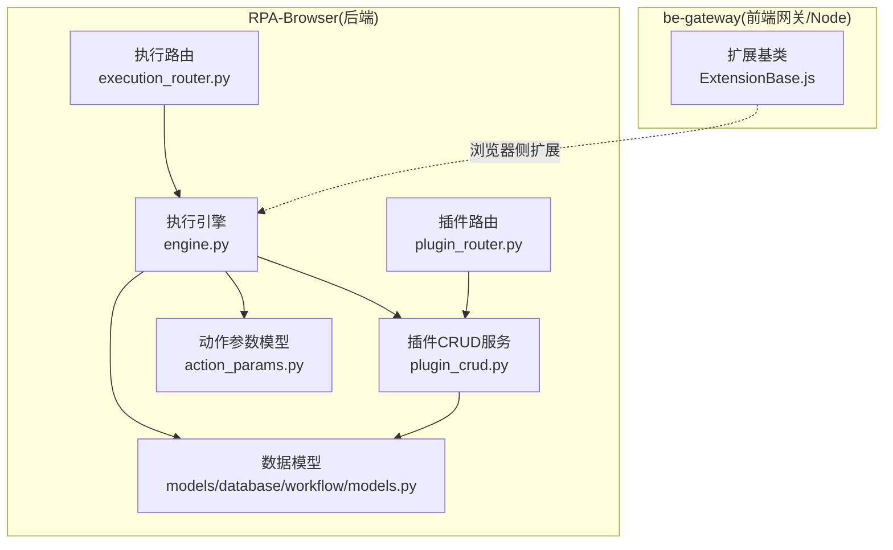
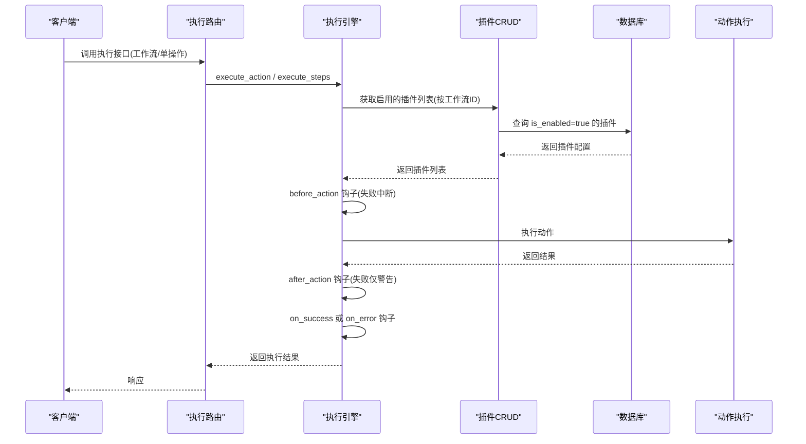
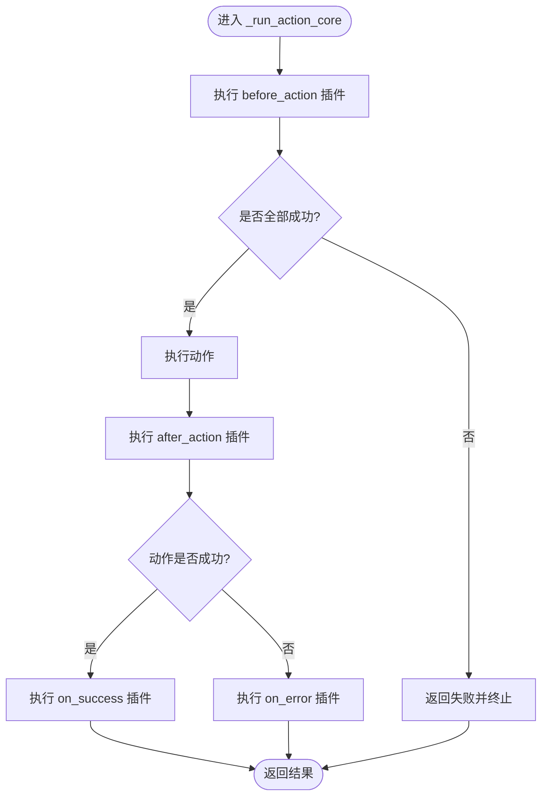
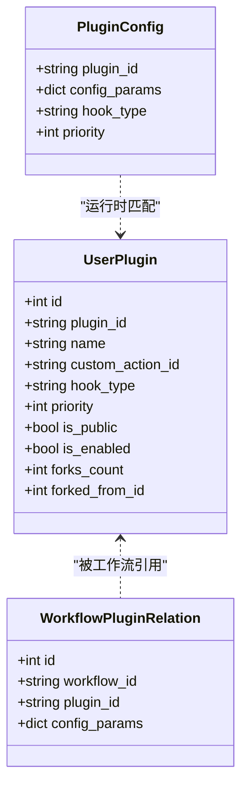
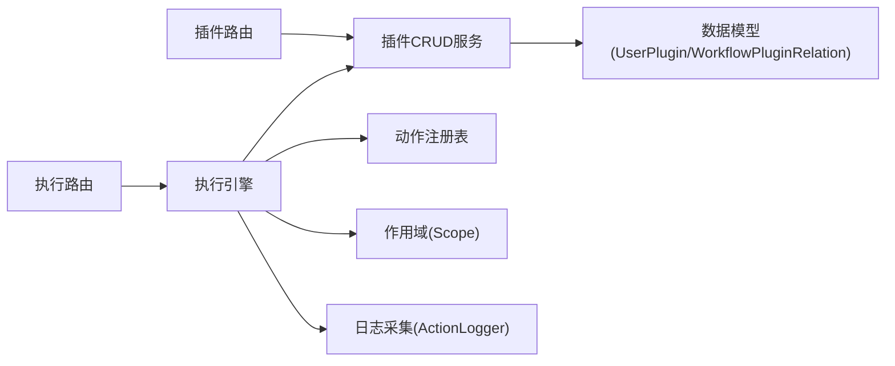

# 插件系统

<cite>
**本文引用的文件**
- [RPA-Browser/app/models/database/workflow/models.py](file://RPA-Browser/app/models/database/workflow/models.py)
- [RPA-Browser/app/controller/v1/browser_control/execution/plugin_router.py](file://RPA-Browser/app/controller/v1/browser_control/execution/plugin_router.py)
- [RPA-Browser/app/services/execution/crud_service/plugin_crud.py](file://RPA-Browser/app/services/execution/crud_service/plugin_crud.py)
- [RPA-Browser/app/services/execution/engine.py](file://RPA-Browser/app/services/execution/engine.py)
- [RPA-Browser/app/controller/v1/browser_control/execution/execution_router.py](file://RPA-Browser/app/controller/v1/browser_control/execution/execution_router.py)
- [RPA-Browser/app/models/execution/action_params.py](file://RPA-Browser/app/models/execution/action_params.py)
- [RPA-Browser/test/controller/test_plugin_router.py](file://RPA-Browser/test/controller/test_plugin_router.py)
- [be-gateway/功能扩展基类/ExtensionBase.js](file://be-gateway/功能扩展基类/ExtensionBase.js)
</cite>

## 目录
1. [简介](#简介)
2. [项目结构](#项目结构)
3. [核心组件](#核心组件)
4. [架构总览](#架构总览)
5. [详细组件分析](#详细组件分析)
6. [依赖关系分析](#依赖关系分析)
7. [性能考虑](#性能考虑)
8. [故障排查指南](#故障排查指南)
9. [结论](#结论)
10. [附录：开发、测试与部署](#附录开发测试与部署)

## 简介
本技术文档围绕 RPA-Browser 的“插件系统”展开，系统性解析插件钩子机制（before_action/after_action/on_success/on_error/on_timeout）、插件配置管理、生命周期、参数传递、错误处理策略，并给出开发规范、安全注意事项、性能影响分析与优化建议。同时提供可操作的示例、测试方法与部署指南，帮助构建可插拔的自动化扩展能力。

## 项目结构
插件系统主要位于 RPA-Browser 后端服务中，涉及数据模型、路由、CRUD 服务与执行引擎四个层次；同时在 be-gateway 中存在一个基于 Node.js 的扩展基类，用于浏览器侧的功能扩展。

图表来源
- [RPA-Browser/app/models/database/workflow/models.py:17-38](file://RPA-Browser/app/models/database/workflow/models.py#L17-L38)
- [RPA-Browser/app/controller/v1/browser_control/execution/plugin_router.py:1-27](file://RPA-Browser/app/controller/v1/browser_control/execution/plugin_router.py#L1-L27)
- [RPA-Browser/app/services/execution/crud_service/plugin_crud.py:18-75](file://RPA-Browser/app/services/execution/crud_service/plugin_crud.py#L18-L75)
- [RPA-Browser/app/services/execution/engine.py:63-110](file://RPA-Browser/app/services/execution/engine.py#L63-L110)
- [RPA-Browser/app/controller/v1/browser_control/execution/execution_router.py:97-134](file://RPA-Browser/app/controller/v1/browser_control/execution/execution_router.py#L97-L134)
- [RPA-Browser/app/models/execution/action_params.py:681-688](file://RPA-Browser/app/models/execution/action_params.py#L681-L688)
- [be-gateway/功能扩展基类/ExtensionBase.js:57-105](file://be-gateway/功能扩展基类/ExtensionBase.js#L57-L105)

章节来源
- [RPA-Browser/app/models/database/workflow/models.py:17-38](file://RPA-Browser/app/models/database/workflow/models.py#L17-L38)
- [RPA-Browser/app/controller/v1/browser_control/execution/plugin_router.py:1-27](file://RPA-Browser/app/controller/v1/browser_control/execution/plugin_router.py#L1-L27)
- [RPA-Browser/app/services/execution/crud_service/plugin_crud.py:18-75](file://RPA-Browser/app/services/execution/crud_service/plugin_crud.py#L18-L75)
- [RPA-Browser/app/services/execution/engine.py:63-110](file://RPA-Browser/app/services/execution/engine.py#L63-L110)
- [RPA-Browser/app/controller/v1/browser_control/execution/execution_router.py:97-134](file://RPA-Browser/app/controller/v1/browser_control/execution/execution_router.py#L97-L134)
- [RPA-Browser/app/models/execution/action_params.py:681-688](file://RPA-Browser/app/models/execution/action_params.py#L681-L688)
- [be-gateway/功能扩展基类/ExtensionBase.js:57-105](file://be-gateway/功能扩展基类/ExtensionBase.js#L57-L105)

## 核心组件
- 插件钩子枚举：定义 before_action、after_action、on_success、on_error、on_timeout 等钩子类型，作为插件挂载点。
- 用户插件模型 UserPlugin：描述每个插件的归属、名称、钩子类型、绑定的自定义动作 ID、优先级、公开状态等。
- 工作流插件配置 PluginConfig：运行时传入执行引擎的插件配置，包含 plugin_id、hook_type、priority、config_params。
- 插件路由 plugin_router：提供创建、更新、删除、Fork、分页查询等 REST API。
- 插件 CRUD 服务 plugin_crud：实现插件的持久化、权限校验、启用/禁用、Fork 计数维护等。
- 执行引擎 engine：在 action 执行前后注入插件钩子，统一处理 on_success/on_error/on_timeout，并串联日志采集。
- 执行路由 execution_router：暴露操作与工作流执行入口，并在执行工作流时加载启用的插件列表。

章节来源
- [RPA-Browser/app/models/database/workflow/models.py:31-38](file://RPA-Browser/app/models/database/workflow/models.py#L31-L38)
- [RPA-Browser/app/models/database/workflow/models.py:208-235](file://RPA-Browser/app/models/database/workflow/models.py#L208-L235)
- [RPA-Browser/app/models/execution/action_params.py:681-688](file://RPA-Browser/app/models/execution/action_params.py#L681-L688)
- [RPA-Browser/app/controller/v1/browser_control/execution/plugin_router.py:30-173](file://RPA-Browser/app/controller/v1/browser_control/execution/plugin_router.py#L30-L173)
- [RPA-Browser/app/services/execution/crud_service/plugin_crud.py:21-75](file://RPA-Browser/app/services/execution/crud_service/plugin_crud.py#L21-L75)
- [RPA-Browser/app/services/execution/engine.py:322-362](file://RPA-Browser/app/services/execution/engine.py#L322-L362)
- [RPA-Browser/app/controller/v1/browser_control/execution/execution_router.py:140-205](file://RPA-Browser/app/controller/v1/browser_control/execution/execution_router.py#L140-L205)

## 架构总览
插件系统在“执行引擎”中通过钩子机制将用户配置的插件（绑定到某个自定义动作）在工作流或单操作的执行生命周期中自动触发。

图表来源
- [RPA-Browser/app/controller/v1/browser_control/execution/execution_router.py:140-205](file://RPA-Browser/app/controller/v1/browser_control/execution/execution_router.py#L140-L205)
- [RPA-Browser/app/services/execution/engine.py:322-362](file://RPA-Browser/app/services/execution/engine.py#L322-L362)
- [RPA-Browser/app/services/execution/crud_service/plugin_crud.py:84-93](file://RPA-Browser/app/services/execution/crud_service/plugin_crud.py#L84-L93)

## 详细组件分析

### 插件钩子机制与执行时机
- 钩子类型：before_action、after_action、on_success、on_error、on_timeout。
- 执行顺序：
  - before_action：在执行动作之前运行，若任一插件失败则中断主流程。
  - 动作执行：执行具体 action。
  - after_action：在动作之后运行，即使失败也仅记录警告，不中断主流程。
  - on_success/on_error：根据动作执行结果选择其一执行。
  - on_timeout：当动作超时异常时触发。
- 参数传递：
  - 变量作用域：执行引擎使用 Scope 管理变量，插件执行时会将当前变量快照传入。
  - 上下文信息：插件执行时会注入 _plugin_action_result（包含 success/data/error）和 _plugin_config（来自 PluginConfig.config_params）。
  - 执行元信息：execution_id、parent_execution_id、browser_id、session_id、workflow_id 等透传给插件内部步骤，便于日志串联。

图表来源
- [RPA-Browser/app/services/execution/engine.py:322-362](file://RPA-Browser/app/services/execution/engine.py#L322-L362)
- [RPA-Browser/app/services/execution/engine.py:366-426](file://RPA-Browser/app/services/execution/engine.py#L366-L426)

章节来源
- [RPA-Browser/app/services/execution/engine.py:322-362](file://RPA-Browser/app/services/execution/engine.py#L322-L362)
- [RPA-Browser/app/services/execution/engine.py:366-426](file://RPA-Browser/app/services/execution/engine.py#L366-L426)

### 插件配置管理
- 数据模型：
  - UserPlugin：存储插件的基本信息与钩子类型、绑定的自定义动作 ID、优先级、公开状态、Fork 来源等。
  - WorkflowPluginRelation：工作流与插件的关联表，支持为工作流附加 config_params。
- 路由与CRUD：
  - 创建/更新/删除：提供 REST 接口，包含名称唯一性校验、钩子类型合法性校验、私有动作访问控制。
  - Fork：支持对公开插件进行 Fork，生成副本并维护 forks_count。
  - 启用/禁用：通过 update 接口设置 is_enabled，执行引擎仅加载 is_enabled=true 的插件。
- 运行时装配：
  - 执行工作流时，从工作流维度加载启用的插件列表，并按 hook_type 过滤后传入执行引擎。

图表来源
- [RPA-Browser/app/models/database/workflow/models.py:196-235](file://RPA-Browser/app/models/database/workflow/models.py#L196-L235)
- [RPA-Browser/app/models/execution/action_params.py:681-688](file://RPA-Browser/app/models/execution/action_params.py#L681-L688)

章节来源
- [RPA-Browser/app/models/database/workflow/models.py:196-235](file://RPA-Browser/app/models/database/workflow/models.py#L196-L235)
- [RPA-Browser/app/controller/v1/browser_control/execution/plugin_router.py:87-173](file://RPA-Browser/app/controller/v1/browser_control/execution/plugin_router.py#L87-L173)
- [RPA-Browser/app/services/execution/crud_service/plugin_crud.py:21-75](file://RPA-Browser/app/services/execution/crud_service/plugin_crud.py#L21-L75)
- [RPA-Browser/app/services/execution/crud_service/plugin_crud.py:255-273](file://RPA-Browser/app/services/execution/crud_service/plugin_crud.py#L255-L273)
- [RPA-Browser/app/services/execution/crud_service/plugin_crud.py:307-353](file://RPA-Browser/app/services/execution/crud_service/plugin_crud.py#L307-L353)

### 生命周期与参数传递
- 生命周期：
  - 工作流启动时加载启用的插件。
  - 每个动作执行前/后及成功/失败/超时时触发对应钩子。
- 参数传递：
  - 变量作用域：Scope 提供变量替换与链式查找，插件执行时继承当前变量。
  - 插件配置：PluginConfig.config_params 作为插件输入。
  - 执行上下文：execution_id、browser_id、session_id、workflow_id 等透传，便于追踪与日志串联。
  - 动作结果：_plugin_action_result 携带 success/data/error，供插件判断分支逻辑。

章节来源
- [RPA-Browser/app/services/execution/engine.py:111-164](file://RPA-Browser/app/services/execution/engine.py#L111-L164)
- [RPA-Browser/app/services/execution/engine.py:366-426](file://RPA-Browser/app/services/execution/engine.py#L366-L426)
- [RPA-Browser/app/models/execution/action_params.py:681-688](file://RPA-Browser/app/models/execution/action_params.py#L681-L688)

### 错误处理策略
- before_action 失败：立即中断主流程，返回失败。
- after_action 失败：仅记录警告，不影响主流程继续。
- on_error：捕获动作执行异常后触发。
- on_timeout：捕获超时异常后触发。
- 插件异常隔离：插件执行异常会被捕获并记录，不会导致整个执行崩溃。

章节来源
- [RPA-Browser/app/services/execution/engine.py:322-362](file://RPA-Browser/app/services/execution/engine.py#L322-L362)
- [RPA-Browser/app/services/execution/engine.py:418-426](file://RPA-Browser/app/services/execution/engine.py#L418-L426)

### 安全与权限
- 动作访问控制：创建/更新插件时校验自定义动作是否存在且启用，且私有动作仅限本人或公开动作可用。
- Fork 限制：仅允许 Fork 公开插件或自己的插件。
- 工作流级插件加载：仅加载 is_enabled=true 的插件，避免未启用插件被执行。
- 认证头透传：执行请求中的 auth_headers 会透传到动作与插件，确保下游 HTTP 请求具备鉴权上下文。

章节来源
- [RPA-Browser/app/services/execution/crud_service/plugin_crud.py:40-52](file://RPA-Browser/app/services/execution/crud_service/plugin_crud.py#L40-L52)
- [RPA-Browser/app/services/execution/crud_service/plugin_crud.py:198-212](file://RPA-Browser/app/services/execution/crud_service/plugin_crud.py#L198-L212)
- [RPA-Browser/app/services/execution/crud_service/plugin_crud.py:307-353](file://RPA-Browser/app/services/execution/crud_service/plugin_crud.py#L307-L353)
- [RPA-Browser/app/services/execution/engine.py:306-316](file://RPA-Browser/app/services/execution/engine.py#L306-L316)

### 性能影响分析
- 插件执行开销：每个动作可能触发多个插件，需控制插件数量与复杂度，避免阻塞主流程。
- 变量复制成本：插件执行时会对变量进行浅拷贝，注意大对象传递带来的内存与序列化开销。
- 日志采集：插件执行会纳入统一日志链路，合理配置 ActionLogOption，避免过大 payload 影响性能。
- 并发与超时：插件内应避免长时间阻塞；必要时利用异步与超时控制，防止拖慢整体执行。

章节来源
- [RPA-Browser/app/services/execution/engine.py:366-426](file://RPA-Browser/app/services/execution/engine.py#L366-L426)
- [RPA-Browser/app/models/database/workflow/models.py:171-181](file://RPA-Browser/app/models/database/workflow/models.py#L171-L181)

## 依赖关系分析
- 路由层依赖：
  - plugin_router 依赖 plugin_crud 服务进行数据操作。
  - execution_router 依赖 execution_engine 执行动作与工作流，并在工作流执行时加载插件。
- 服务层依赖：
  - plugin_crud 依赖数据库模型 UserPlugin、CompositeActionModel，以及会话管理器。
- 执行引擎依赖：
  - 依赖 action_registry、scope、pipeline、action_logger 等模块，统一管理执行与日志。
- 数据模型依赖：
  - PluginHookEnum、UserPlugin、WorkflowPluginRelation、PluginConfig 构成插件系统的核心数据结构。

图表来源
- [RPA-Browser/app/controller/v1/browser_control/execution/plugin_router.py:30-173](file://RPA-Browser/app/controller/v1/browser_control/execution/plugin_router.py#L30-L173)
- [RPA-Browser/app/services/execution/crud_service/plugin_crud.py:18-75](file://RPA-Browser/app/services/execution/crud_service/plugin_crud.py#L18-L75)
- [RPA-Browser/app/controller/v1/browser_control/execution/execution_router.py:140-205](file://RPA-Browser/app/controller/v1/browser_control/execution/execution_router.py#L140-L205)
- [RPA-Browser/app/services/execution/engine.py:63-110](file://RPA-Browser/app/services/execution/engine.py#L63-L110)

章节来源
- [RPA-Browser/app/controller/v1/browser_control/execution/plugin_router.py:30-173](file://RPA-Browser/app/controller/v1/browser_control/execution/plugin_router.py#L30-L173)
- [RPA-Browser/app/services/execution/crud_service/plugin_crud.py:18-75](file://RPA-Browser/app/services/execution/crud_service/plugin_crud.py#L18-L75)
- [RPA-Browser/app/controller/v1/browser_control/execution/execution_router.py:140-205](file://RPA-Browser/app/controller/v1/browser_control/execution/execution_router.py#L140-L205)
- [RPA-Browser/app/services/execution/engine.py:63-110](file://RPA-Browser/app/services/execution/engine.py#L63-L110)

## 性能考虑
- 插件数量与复杂度控制：避免在同一钩子上挂载过多插件或复杂逻辑。
- 变量与参数大小控制：合理使用 config_params，避免超大对象传递。
- 日志配置优化：针对高吞吐场景，调整 log_max_payload_length 与 log_retention_days，减少 I/O 压力。
- 超时与重试：为插件与动作设置合理的超时与重试策略，提升稳定性。

[本节为通用指导，无需特定文件来源]

## 故障排查指南
- 常见问题定位：
  - 插件未执行：检查 is_enabled 是否为 true，hook_type 是否正确，custom_action_id 是否有效。
  - 插件失败中断：查看 before_action 失败日志，确认插件逻辑与参数。
  - 权限问题：确认自定义动作是否公开或属于当前用户。
  - 超时：检查 on_timeout 钩子是否触发，评估插件耗时。
- 调试手段：
  - 使用预览接口验证参数替换与步骤结构。
  - 查看统一日志链路，结合 execution_id 追踪插件执行过程。
  - 单元测试覆盖插件创建、更新、启用/禁用、Fork 等路径。

章节来源
- [RPA-Browser/app/services/execution/engine.py:322-362](file://RPA-Browser/app/services/execution/engine.py#L322-L362)
- [RPA-Browser/app/services/execution/crud_service/plugin_crud.py:40-52](file://RPA-Browser/app/services/execution/crud_service/plugin_crud.py#L40-L52)
- [RPA-Browser/test/controller/test_plugin_router.py:44-117](file://RPA-Browser/test/controller/test_plugin_router.py#L44-L117)

## 结论
该插件系统以执行引擎为核心，通过统一的钩子机制将用户配置的插件无缝嵌入到动作执行的生命周期中。其设计强调安全性（权限校验、私有动作保护）、可观测性（统一日志链路）与可扩展性（Fork、社区资源）。在生产环境中，应严格控制插件数量与复杂度，合理配置日志与超时，确保系统稳定高效运行。

[本节为总结，无需特定文件来源]

## 附录：开发、测试与部署

### 插件开发规范
- 钩子选择：明确插件职责，选择合适的钩子类型（before_action/after_action/on_success/on_error/on_timeout）。
- 参数设计：使用 PluginConfig.config_params 传递必要参数，保持轻量与幂等。
- 错误处理：插件内部捕获异常并返回结构化结果，避免抛出未处理异常。
- 日志记录：遵循统一日志格式，记录关键上下文（execution_id、browser_id、session_id）。
- 安全实践：不直接访问非授权资源，遵循动作访问控制规则。

章节来源
- [RPA-Browser/app/models/execution/action_params.py:681-688](file://RPA-Browser/app/models/execution/action_params.py#L681-L688)
- [RPA-Browser/app/services/execution/engine.py:306-316](file://RPA-Browser/app/services/execution/engine.py#L306-L316)

### 测试方法
- 单元测试：覆盖插件的创建、更新、启用/禁用、Fork 等接口，验证权限与校验逻辑。
- 集成测试：模拟工作流执行，验证插件在不同钩子下的行为与参数传递。
- 断言要点：
  - 成功路径：返回码、数据字段、插件执行次数。
  - 失败路径：错误码、错误消息、日志记录。
  - 权限边界：私有动作不可被他人使用，仅公开插件可被 Fork。

章节来源
- [RPA-Browser/test/controller/test_plugin_router.py:44-117](file://RPA-Browser/test/controller/test_plugin_router.py#L44-L117)

### 部署指南
- 后端服务：
  - 确保数据库迁移完成，UserPlugin、WorkflowPluginRelation 等表存在。
  - 配置日志采集策略，避免过大 payload 影响性能。
  - 启用必要的监控与告警，关注插件执行耗时与失败率。
- 前端网关（Node 扩展）：
  - 使用 ExtensionBase 提供的初始化与页面管理能力，扩展浏览器侧功能。
  - 注意拦截与请求控制，避免触发反作弊检测。

章节来源
- [RPA-Browser/app/models/database/workflow/models.py:196-235](file://RPA-Browser/app/models/database/workflow/models.py#L196-L235)
- [be-gateway/功能扩展基类/ExtensionBase.js:57-105](file://be-gateway/功能扩展基类/ExtensionBase.js#L57-L105)