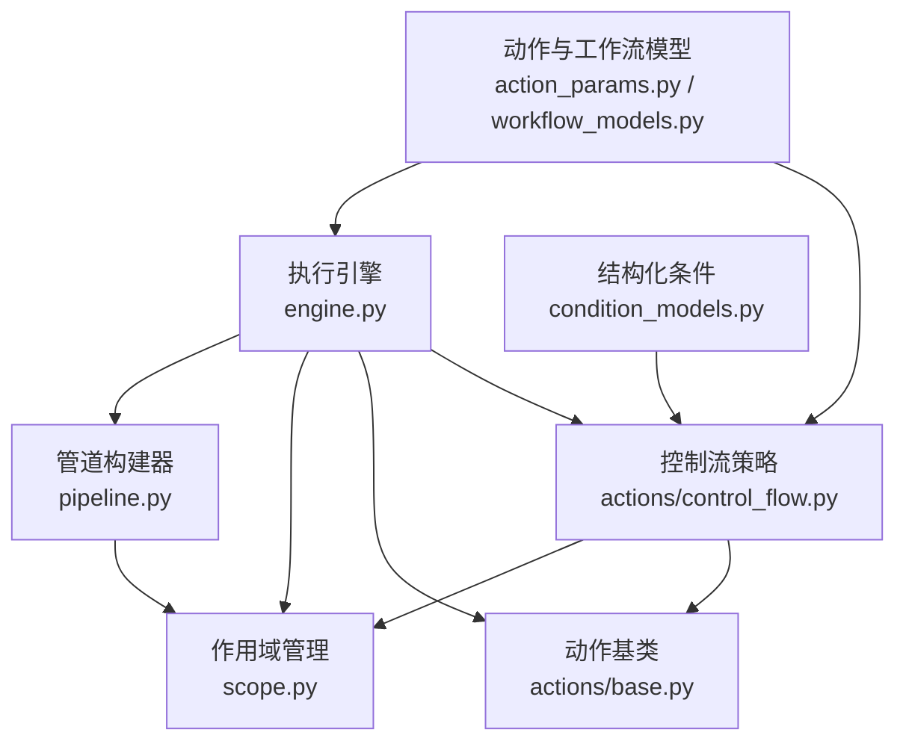
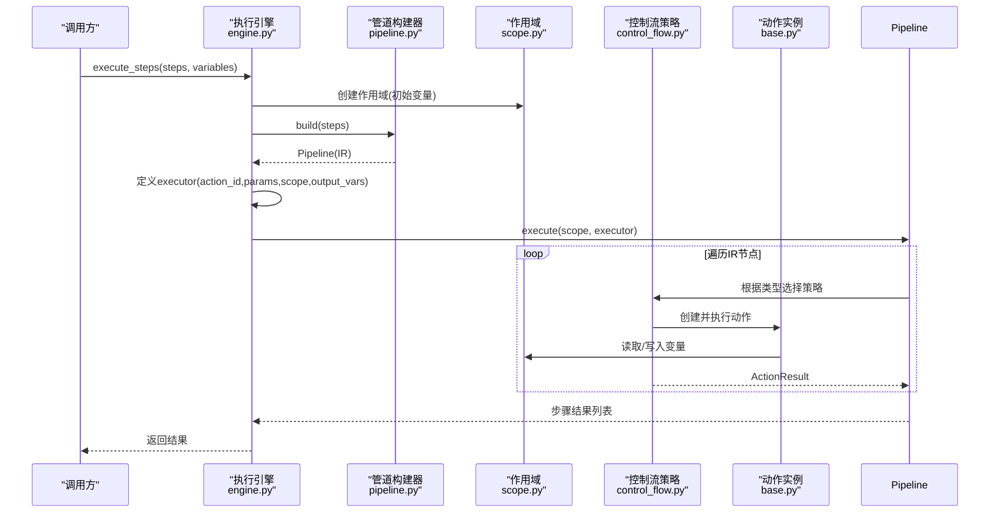
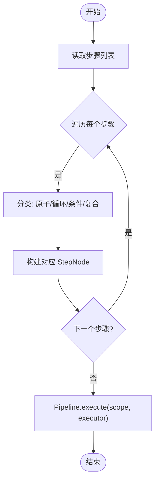
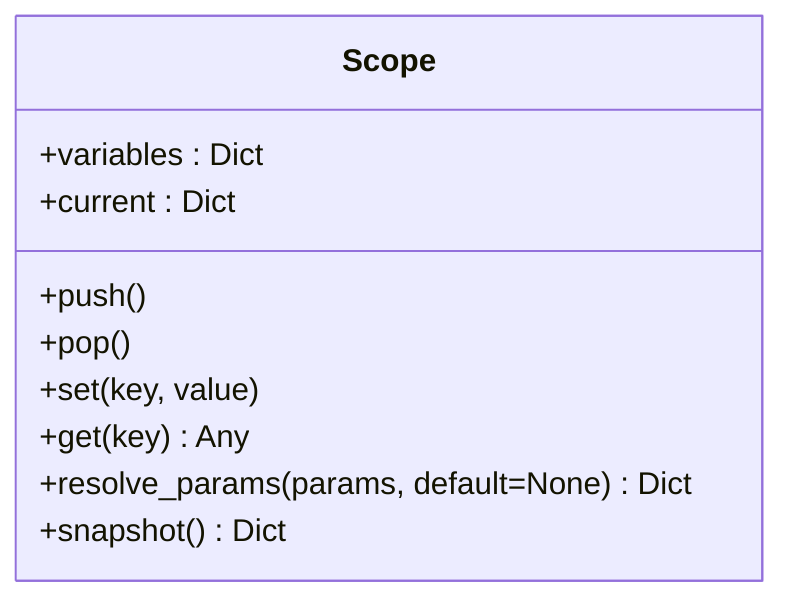
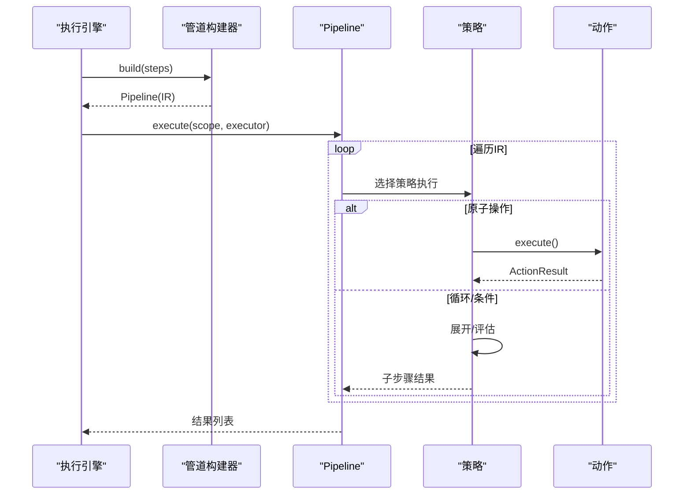
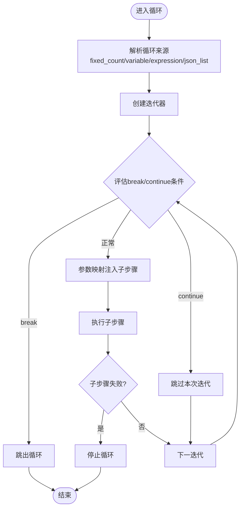
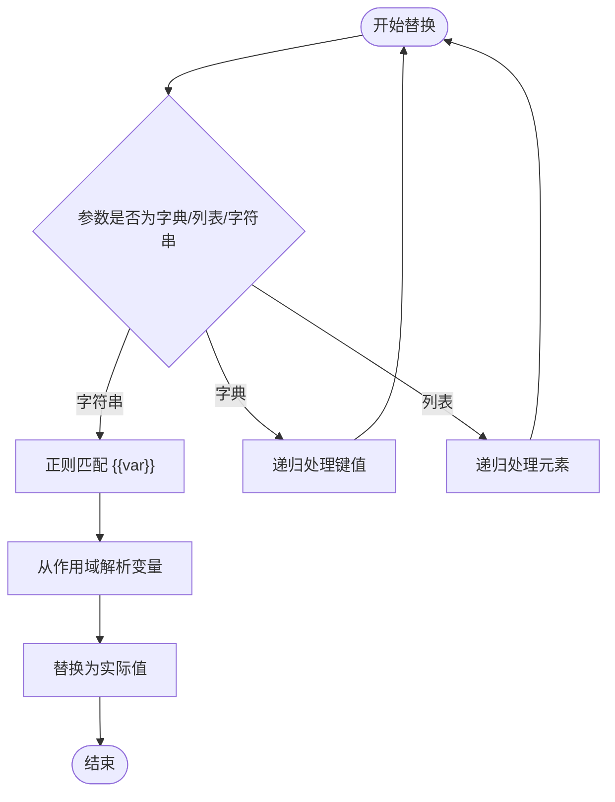
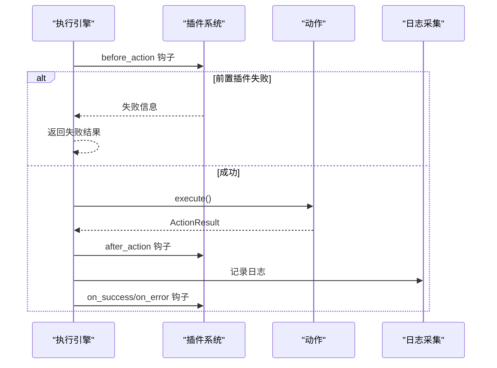
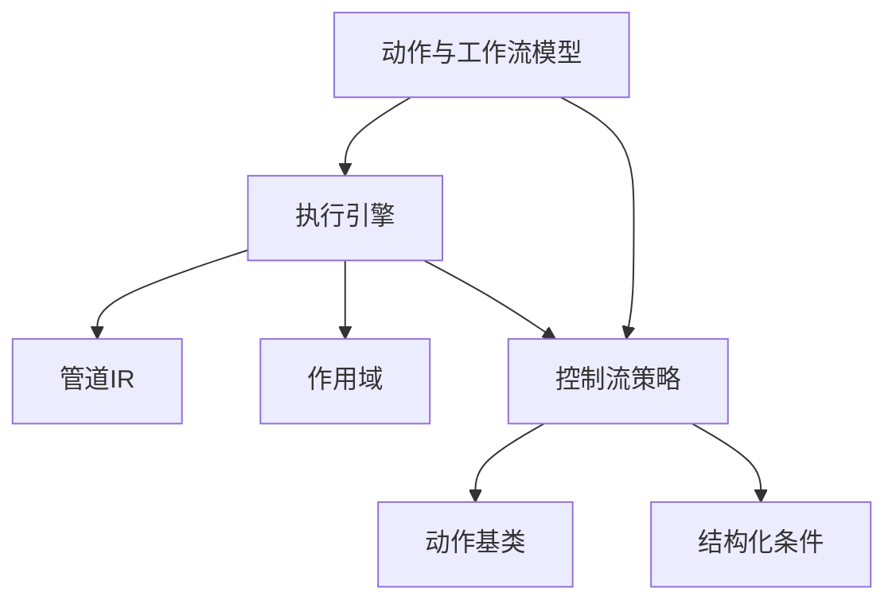

# 管道执行

<cite>
**本文引用的文件**
- [engine.py](file://RPA-Browser/app/services/execution/engine.py)
- [pipeline.py](file://RPA-Browser/app/services/execution/pipeline.py)
- [scope.py](file://RPA-Browser/app/services/execution/scope.py)
- [base.py](file://RPA-Browser/app/services/execution/actions/base.py)
- [control_flow.py](file://RPA-Browser/app/services/execution/actions/control_flow.py)
- [action_params.py](file://RPA-Browser/app/models/execution/action_params.py)
- [condition_models.py](file://RPA-Browser/app/models/execution/condition_models.py)
- [workflow_models.py](file://RPA-Browser/app/models/workflow/models.py)
</cite>

## 目录
1. [简介](#简介)
2. [项目结构](#项目结构)
3. [核心组件](#核心组件)
4. [架构总览](#架构总览)
5. [详细组件分析](#详细组件分析)
6. [依赖关系分析](#依赖关系分析)
7. [性能考量](#性能考量)
8. [故障排查指南](#故障排查指南)
9. [结论](#结论)
10. [附录](#附录)

## 简介
本技术文档面向“管道执行系统”，聚焦以下主题：
- PipelineBuilder 的编译过程与 Pipeline IR（中间表示）构建
- Pipeline 的执行算法（左折叠顺序执行）
- Scope 变量作用域管理与变量替换机制
- 工作流步骤 IR 构建、控制流（循环/条件/复合动作）处理逻辑
- 错误传播机制、插件钩子与日志采集
- 调试方法、执行流程分析与性能优化建议

该系统的核心思想是将工作流步骤序列编译为可执行的 IR，通过统一的执行引擎驱动原子操作与控制流节点，配合作用域变量栈实现安全的参数模板替换与结果传播。

## 项目结构
围绕执行子系统的关键代码分布在如下模块：
- 执行引擎与入口：engine.py
- 管道 IR 与执行器：pipeline.py
- 作用域与变量管理：scope.py
- 动作基类与结果封装：actions/base.py
- 控制流与策略：actions/control_flow.py
- 动作参数与模型定义：models/execution/action_params.py
- 结构化条件评估：models/execution/condition_models.py
- 工作流请求/响应模型：models/workflow/models.py

**图表来源**
- [engine.py:63-164](file://RPA-Browser/app/services/execution/engine.py#L63-L164)
- [pipeline.py:1-200](file://RPA-Browser/app/services/execution/pipeline.py#L1-L200)
- [scope.py:1-200](file://RPA-Browser/app/services/execution/scope.py#L1-L200)
- [base.py:36-273](file://RPA-Browser/app/services/execution/actions/base.py#L36-L273)
- [control_flow.py:39-118](file://RPA-Browser/app/services/execution/actions/control_flow.py#L39-L118)
- [action_params.py:31-160](file://RPA-Browser/app/models/execution/action_params.py#L31-L160)
- [condition_models.py:97-235](file://RPA-Browser/app/models/execution/condition_models.py#L97-L235)

**章节来源**
- [engine.py:63-164](file://RPA-Browser/app/services/execution/engine.py#L63-L164)
- [action_params.py:31-160](file://RPA-Browser/app/models/execution/action_params.py#L31-L160)
- [condition_models.py:97-235](file://RPA-Browser/app/models/execution/condition_models.py#L97-L235)

## 核心组件
- 执行引擎 ExecutionEngine：统一入口，负责动作查找、参数替换、插件钩子、日志采集、超时与异常处理。
- 管道构建器 PipelineBuilder：将工作流步骤列表编译为 Pipeline IR（StepNode 序列），支持控制流节点展开。
- 作用域 Scope：维护变量栈，提供 resolve_params（模板替换）、query（链式查找）、push/pop（隔离）。
- 动作基类 BaseAction：抽象动作接口，封装参数验证、输出变量合并、预览模式等。
- 控制流策略：AtomicStrategy、LoopStrategy、IfElseStrategy，分别处理原子操作、循环、条件分支与复合动作。
- 结构化条件评估：ConditionRule + evaluate_rule，零 eval 安全评估布尔表达式。

**章节来源**
- [engine.py:63-164](file://RPA-Browser/app/services/execution/engine.py#L63-L164)
- [pipeline.py:1-200](file://RPA-Browser/app/services/execution/pipeline.py#L1-L200)
- [scope.py:1-200](file://RPA-Browser/app/services/execution/scope.py#L1-L200)
- [base.py:36-273](file://RPA-Browser/app/services/execution/actions/base.py#L36-L273)
- [control_flow.py:84-118](file://RPA-Browser/app/services/execution/actions/control_flow.py#L84-L118)
- [condition_models.py:97-235](file://RPA-Browser/app/models/execution/condition_models.py#L97-L235)

## 架构总览
执行引擎作为中枢，协调管道编译与作用域变量，驱动控制流策略执行具体步骤。数据流从请求到结果贯穿如下路径：
- 接收请求 → 构建 Scope → 编译 Pipeline → 执行 Pipeline.execute(scope, executor)
- 每个 StepNode 由策略选择执行：原子操作走 AtomicStrategy；循环/条件走 LoopStrategy/IfElseStrategy
- 参数模板替换在 Action 执行前完成（Scope.resolve_params），结果写入 scope.current 并记录日志

**图表来源**
- [engine.py:111-164](file://RPA-Browser/app/services/execution/engine.py#L111-L164)
- [pipeline.py:1-200](file://RPA-Browser/app/services/execution/pipeline.py#L1-L200)
- [control_flow.py:84-118](file://RPA-Browser/app/services/execution/actions/control_flow.py#L84-L118)
- [base.py:228-251](file://RPA-Browser/app/services/execution/actions/base.py#L228-L251)

## 详细组件分析

### PipelineBuilder 与 Pipeline IR
- 编译目标：将 WorkflowStep 列表转换为 Pipeline IR（StepNode 序列），其中包含原子步骤、循环步骤、条件分支步骤。
- 构建过程：遍历步骤，识别 action_id 类型，构造对应节点；对复合动作进行递归展开，确保 IR 可被线性执行。
- 执行算法：Pipeline.execute 采用左折叠方式依次执行每个 StepNode，将上一步的结果注入作用域供后续步骤使用。

**图表来源**
- [pipeline.py:1-200](file://RPA-Browser/app/services/execution/pipeline.py#L1-L200)
- [engine.py:111-164](file://RPA-Browser/app/services/execution/engine.py#L111-L164)

**章节来源**
- [pipeline.py:1-200](file://RPA-Browser/app/services/execution/pipeline.py#L1-L200)
- [engine.py:111-164](file://RPA-Browser/app/services/execution/engine.py#L111-L164)

### Scope 变量作用域管理
- 作用域栈：支持 push/pop，用于嵌套执行时的变量隔离（如循环体、分支）。
- 变量解析：resolve_params 递归遍历参数树，将 {{var}} 模板替换为当前作用域中的值；支持点路径访问（如 loop_item.user.name）。
- 链式查找：query(key) 从栈顶向栈底查找变量，保证局部变量优先于全局变量。

**图表来源**
- [scope.py:1-200](file://RPA-Browser/app/services/execution/scope.py#L1-L200)

**章节来源**
- [scope.py:1-200](file://RPA-Browser/app/services/execution/scope.py#L1-L200)

### 工作流步骤 IR 构建与执行
- 步骤模型：WorkflowStepRequest/WorkflowStepResponse 描述步骤配置，包括 action_id、params、条件、输出变量、子步骤等。
- IR 构建：PipelineBuilder 将步骤转换为可执行节点，控制流节点（循环/条件）在 IR 中保持结构，执行时按需展开。
- 执行流程：Pipeline.execute 按顺序执行节点，AtomicStrategy 直接执行动作；LoopStrategy/IfElseStrategy 处理控制流。

**图表来源**
- [workflow_models.py:38-87](file://RPA-Browser/app/models/workflow/models.py#L38-L87)
- [pipeline.py:1-200](file://RPA-Browser/app/services/execution/pipeline.py#L1-L200)
- [control_flow.py:84-118](file://RPA-Browser/app/services/execution/actions/control_flow.py#L84-L118)

**章节来源**
- [workflow_models.py:38-87](file://RPA-Browser/app/models/workflow/models.py#L38-L87)
- [pipeline.py:1-200](file://RPA-Browser/app/services/execution/pipeline.py#L1-L200)

### 控制流与复合动作
- 循环策略 LoopStrategy：支持固定次数、变量列表、表达式、JSON 列表等多种来源；支持 break/continue 条件；参数映射将循环项字段注入子步骤参数。
- 条件分支 IfElseStrategy：基于 ConditionRule 或字符串表达式评估分支；支持嵌套深度限制。
- 复合动作 CompositeAction：从数据库加载 steps，校验权限与引用动作的可访问性；支持递归执行与状态保存/恢复。

**图表来源**
- [control_flow.py:414-664](file://RPA-Browser/app/services/execution/actions/control_flow.py#L414-L664)

**章节来源**
- [control_flow.py:414-664](file://RPA-Browser/app/services/execution/actions/control_flow.py#L414-L664)

### 变量替换机制
- 模板语法：{{var}} 或 {{loop_item.field}}，支持点路径访问。
- 替换过程：AtomicStrategy._replace_templates 递归遍历 params，匹配模板并调用 _get_variable_value 从作用域获取值。
- 安全评估：条件表达式使用 AST 白名单求值，避免 eval 风险。

**图表来源**
- [control_flow.py:341-376](file://RPA-Browser/app/services/execution/actions/control_flow.py#L341-L376)
- [condition_models.py:157-217](file://RPA-Browser/app/models/execution/condition_models.py#L157-L217)

**章节来源**
- [control_flow.py:341-376](file://RPA-Browser/app/services/execution/actions/control_flow.py#L341-L376)
- [condition_models.py:157-217](file://RPA-Browser/app/models/execution/condition_models.py#L157-L217)

### 错误传播与插件钩子
- 错误传播：原子操作失败时，AtomicStrategy 返回 ActionResult(success=False)，上层策略根据 retry 与 on_error 策略决定是否继续或中断。
- 插件钩子：before_action（失败中断）、after_action（失败仅警告）、on_success/on_error/on_timeout（执行后回调）。
- 日志采集：ActionLogContext 串联执行链路，记录参数、变量快照、结果与耗时。

**图表来源**
- [engine.py:324-362](file://RPA-Browser/app/services/execution/engine.py#L324-L362)
- [base.py:237-251](file://RPA-Browser/app/services/execution/actions/base.py#L237-L251)

**章节来源**
- [engine.py:324-362](file://RPA-Browser/app/services/execution/engine.py#L324-L362)
- [base.py:237-251](file://RPA-Browser/app/services/execution/actions/base.py#L237-L251)

## 依赖关系分析
- 执行引擎依赖管道构建器与作用域，驱动控制流策略执行动作。
- 控制流策略依赖动作基类与结构化条件评估。
- 动作参数模型与工作流模型为整个系统提供类型约束与 API 契约。

**图表来源**
- [engine.py:63-164](file://RPA-Browser/app/services/execution/engine.py#L63-L164)
- [control_flow.py:84-118](file://RPA-Browser/app/services/execution/actions/control_flow.py#L84-L118)
- [action_params.py:31-160](file://RPA-Browser/app/models/execution/action_params.py#L31-L160)
- [condition_models.py:97-235](file://RPA-Browser/app/models/execution/condition_models.py#L97-L235)

**章节来源**
- [engine.py:63-164](file://RPA-Browser/app/services/execution/engine.py#L63-L164)
- [control_flow.py:84-118](file://RPA-Browser/app/services/execution/actions/control_flow.py#L84-L118)
- [action_params.py:31-160](file://RPA-Browser/app/models/execution/action_params.py#L31-L160)
- [condition_models.py:97-235](file://RPA-Browser/app/models/execution/condition_models.py#L97-L235)

## 性能考量
- 时间复杂度：Pipeline.execute 为 O(N)，N 为步骤数（不含嵌套）。
- 作用域查找：resolve_params 与 query 为 O(1) 字典查找，点路径访问为 O(k)（k 为路径长度）。
- 嵌套限制：通过 settings.workflow_max_nesting_depth 防止过深嵌套导致性能问题。
- 插件开销：插件钩子异步执行，失败仅警告（after_action），避免阻塞主流程。
- 日志采集：按需记录，支持最大负载长度与保留天数，减少 I/O 压力。

[本节为通用性能讨论，不直接分析具体文件]

## 故障排查指南
- 未找到操作：检查 action_id 是否正确注册，或自定义操作是否具备访问权限。
- 参数验证失败：确认 params 符合对应动作的 JSON Schema，必要时使用 preview 接口模拟执行。
- 条件评估错误：检查 ConditionRule 结构是否合法，变量是否存在于作用域。
- 循环/分支为空：确保 loopBranch/TrueBranch/FalseBranch 至少提供一个非空列表。
- 超时与异常：查看 on_timeout 与 on_error 钩子日志，定位具体失败步骤。

**章节来源**
- [engine.py:273-362](file://RPA-Browser/app/services/execution/engine.py#L273-L362)
- [control_flow.py:249-340](file://RPA-Browser/app/services/execution/actions/control_flow.py#L249-L340)
- [condition_models.py:157-235](file://RPA-Browser/app/models/execution/condition_models.py#L157-L235)

## 结论
管道执行系统通过 PipelineBuilder 将工作流步骤编译为可执行 IR，结合 Scope 作用域与统一执行引擎，实现了安全的变量替换、灵活的控制流与可扩展的动作体系。结构化条件评估与插件钩子增强了系统的健壮性与可观测性。通过合理的性能优化与故障排查策略，该系统能够高效支撑复杂自动化流程。

[本节为总结性内容，不直接分析具体文件]

## 附录
- 调试方法：
  - 使用 preview 接口模拟执行，观察变量替换与输出变量效果。
  - 启用操作日志采集，记录参数、变量快照与结果。
  - 逐步执行单步（execute_steps 指定 step_index），定位问题步骤。
- 执行流程分析：
  - 通过日志上下文（execution_id、parent_execution_id）串联复合动作内部子步骤。
  - 监控嵌套深度与循环迭代次数，避免资源耗尽。
- 最佳实践：
  - 合理设计变量命名与作用域隔离，避免污染。
  - 使用结构化条件替代字符串表达式，提升安全性与可维护性。
  - 为关键步骤设置重试与超时，增强鲁棒性。

[本节为补充说明，不直接分析具体文件]