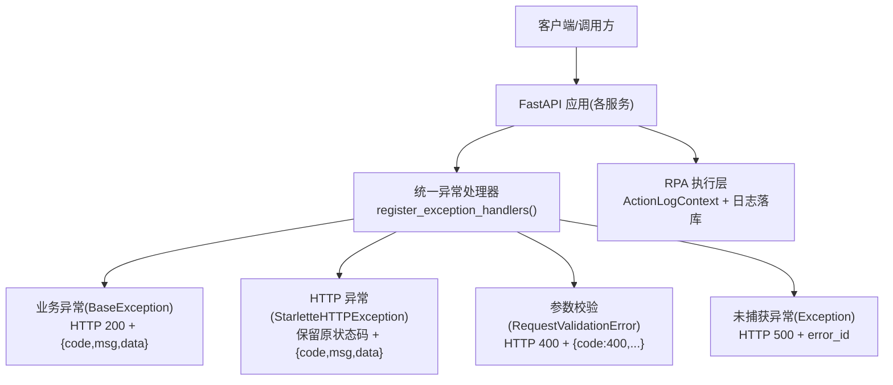
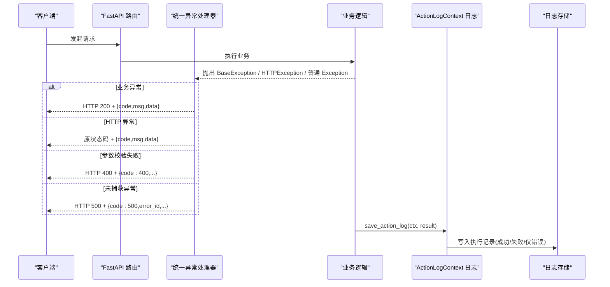
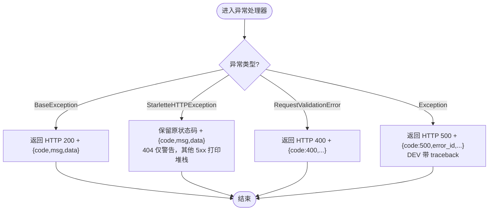
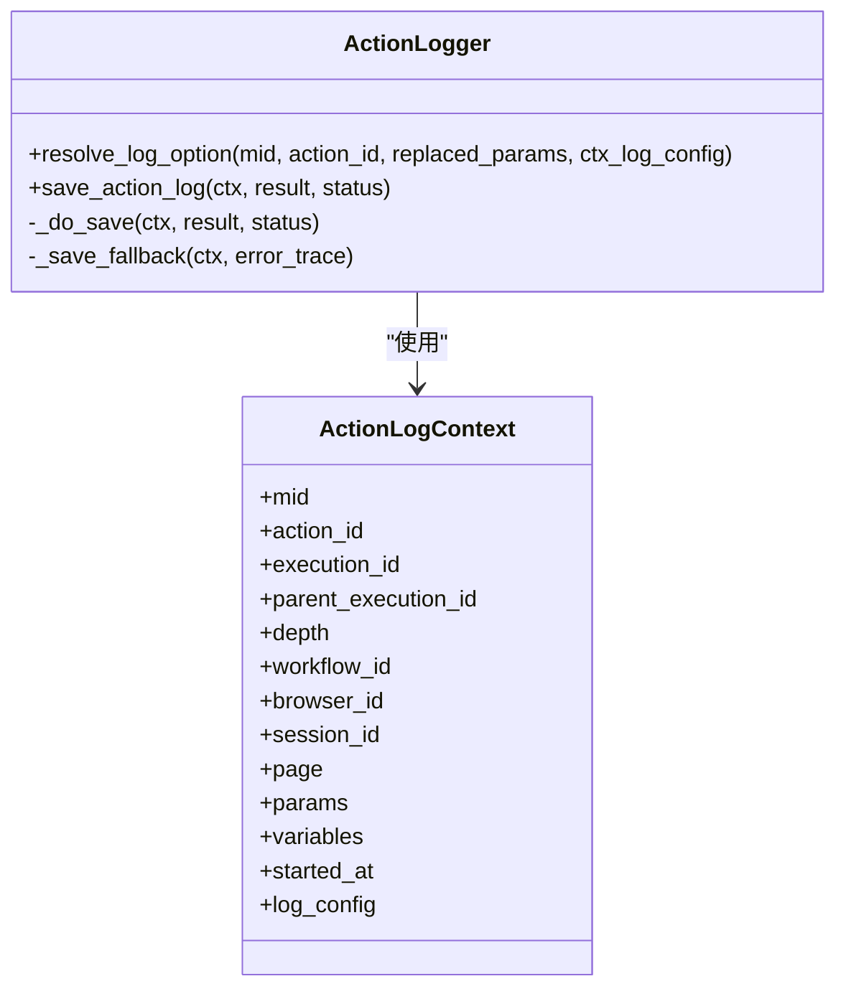
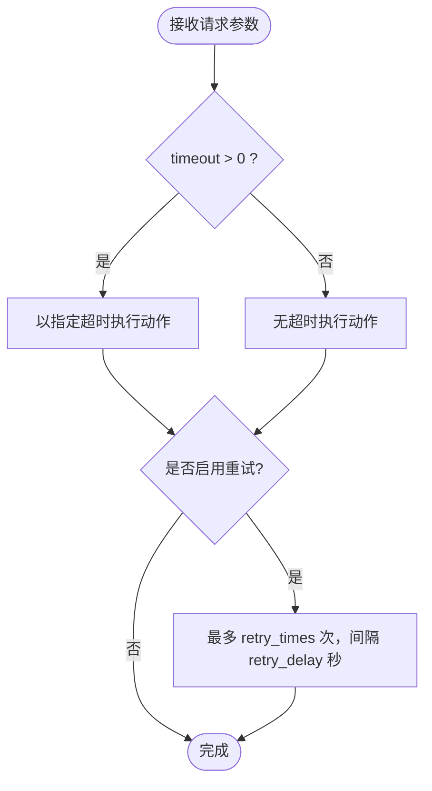
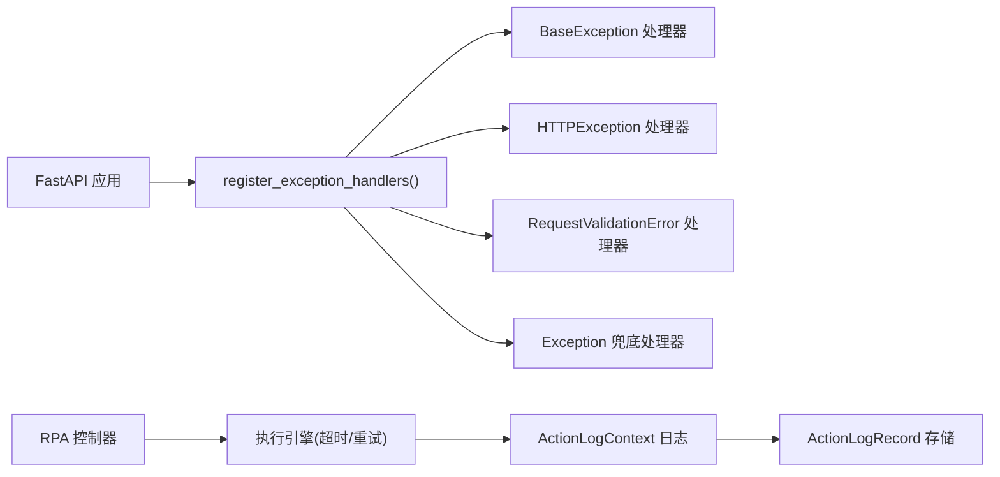

# 错误处理

<cite>
**本文引用的文件**
- [bili_common/exceptions.py](file://bili-common/bili_common/exceptions.py)
- [be-message-service/app/exceptions.py](file://be-message-service/app/exceptions.py)
- [RPA-Browser/app/services/execution/action_logger.py](file://RPA-Browser/app/services/execution/action_logger.py)
- [RPA-Browser/app/models/execution/action_params.py](file://RPA-Browser/app/models/execution/action_params.py)
- [RPA-Browser/app/controller/v1/browser_control/execution/action_router.py](file://RPA-Browser/app/controller/v1/browser_control/execution/action_router.py)
- [RPA-Browser/app/utils/decorator/log_class_decorator.py](file://RPA-Browser/app/utils/decorator/log_class_decorator.py)
</cite>

## 目录
1. [简介](#简介)
2. [项目结构](#项目结构)
3. [核心组件](#核心组件)
4. [架构总览](#架构总览)
5. [详细组件分析](#详细组件分析)
6. [依赖关系分析](#依赖关系分析)
7. [性能考量](#性能考量)
8. [故障排查指南](#故障排查指南)
9. [结论](#结论)
10. [附录](#附录)

## 简介
本技术文档聚焦于项目的错误处理机制，覆盖异常捕获策略、超时与重试、错误传播规则；详解 ActionLogContext 的作用、日志记录机制与执行追踪；系统化文档化错误分类体系、重试策略与降级方案；并提供错误诊断方法、日志分析方法与性能监控指标，帮助构建健壮的自动化执行环境。

## 项目结构
本项目在多个服务中实现了统一的错误处理与日志采集：
- bili-common 提供统一异常基类、HTTP 异常包装器与全局异常处理器注册函数，确保各后端对外返回一致的 {code, msg, data} 契约。
- be-message-service 基于 bili-common 定义业务异常（如评论不可互动），通过统一处理器归一化响应。
- RPA-Browser 在执行层实现动作级日志采集（ActionLogContext）、参数校验与超时/重试配置，并在控制器层透传执行参数。
- 通用日志装饰器为类级别输出独立日志文件，便于隔离问题。

**图表来源**
- [bili_common/exceptions.py:122-250](file://bili-common/bili_common/exceptions.py#L122-L250)
- [RPA-Browser/app/services/execution/action_logger.py:121-213](file://RPA-Browser/app/services/execution/action_logger.py#L121-L213)

**章节来源**
- [bili_common/exceptions.py:1-273](file://bili-common/bili_common/exceptions.py#L1-L273)
- [RPA-Browser/app/services/execution/action_logger.py:1-295](file://RPA-Browser/app/services/execution/action_logger.py#L1-L295)

## 核心组件
- 统一异常体系（bili-common）
  - BaseException：业务异常基类，HTTP 状态码恒为 200，业务状态由 body.code 表达。
  - BiliException：HTTP 异常包装器，附带 code 属性供处理器还原统一响应体。
  - register_exception_handlers(app)：一键注册统一异常处理器，包含业务异常、HTTP 异常、参数校验失败、未捕获异常的兜底处理。
- 业务异常（be-message-service）
  - CommentNotInteractiveException：按评论生命周期状态构造异常，映射到 NOT_FOUND 语义，避免误报“不存在”。
- 执行日志与上下文（RPA-Browser）
  - ActionLogContext：封装一次 action 执行的上下文（用户、执行批次、工作流、浏览器、页面、参数、变量、时间等）。
  - resolve_log_option/save_action_log：解析生效的日志采集选项并持久化执行结果，内部吞异常保证不影响业务。
- 参数与超时/重试（RPA-Browser）
  - BaseActionParams.timeout：操作级最大等待时间（毫秒），支持禁用超时。
  - ActionMetadata.timeout/retry_on_error/retry_times/retry_delay：内置操作的元数据级超时与重试策略。
  - BaseWorkflowStep.retry/on_error/on_error_branch：步骤级重试与失败分支控制。
  - action_router 透传 timeout/retry_* 到执行引擎。

**章节来源**
- [bili_common/exceptions.py:30-250](file://bili-common/bili_common/exceptions.py#L30-L250)
- [be-message-service/app/exceptions.py:1-42](file://be-message-service/app/exceptions.py#L1-L42)
- [RPA-Browser/app/services/execution/action_logger.py:121-213](file://RPA-Browser/app/services/execution/action_logger.py#L121-L213)
- [RPA-Browser/app/models/execution/action_params.py:147-162](file://RPA-Browser/app/models/execution/action_params.py#L147-L162)
- [RPA-Browser/app/models/execution/action_params.py:198-205](file://RPA-Browser/app/models/execution/action_params.py#L198-L205)
- [RPA-Browser/app/models/execution/action_params.py:728-745](file://RPA-Browser/app/models/execution/action_params.py#L728-L745)
- [RPA-Browser/app/controller/v1/browser_control/execution/action_router.py:90-106](file://RPA-Browser/app/controller/v1/browser_control/execution/action_router.py#L90-L106)

## 架构总览
下图展示请求进入 FastAPI 后的异常处理路径，以及 RPA 执行层的日志采集与错误传播。

**图表来源**
- [bili_common/exceptions.py:132-250](file://bili-common/bili_common/exceptions.py#L132-L250)
- [RPA-Browser/app/services/execution/action_logger.py:144-213](file://RPA-Browser/app/services/execution/action_logger.py#L144-L213)

## 详细组件分析

### 统一异常体系（bili-common）
- 设计要点
  - 业务异常（BaseException）：HTTP 200，body.code 表达业务状态，禁止将业务异常 status_code 设为非 200，避免网关/监控误判协议层错误。
  - HTTP 异常（StarletteHTTPException）：保留原状态码，body 仍为 {code,msg,data}。
  - 参数校验失败（RequestValidationError）：HTTP 400，与业务码 INVALID_PARAM=400 一致。
  - 未捕获异常（Exception）：HTTP 500 + error_id，DEV 环境 data 中包含 traceback 等调试信息。
- 关键流程
  - register_exception_handlers(app) 注册四类处理器，确保全项目统一契约。
  - _http_exception_handler 对 404 仅警告日志，其他 5xx 打印堆栈。
  - _unhandled_exception_handler 使用异常对象自身的 __traceback__ 构造完整堆栈，避免跨 await 边界丢失。

**图表来源**
- [bili_common/exceptions.py:132-250](file://bili-common/bili_common/exceptions.py#L132-L250)

**章节来源**
- [bili_common/exceptions.py:30-250](file://bili-common/bili_common/exceptions.py#L30-L250)

### 业务异常（be-message-service）
- 设计要点
  - CommentNotInteractiveException 继承 BiliException，按评论生命周期状态映射到 NOT_FOUND 语义，避免一律误报“不存在”。
  - 通过统一处理器生成 {code,msg,data} 响应，前端可按资源缺失语义归类。

**章节来源**
- [be-message-service/app/exceptions.py:13-39](file://be-message-service/app/exceptions.py#L13-L39)

### 执行日志与上下文（RPA-Browser）
- ActionLogContext
  - 承载 mid、execution_id、parent_execution_id、depth、workflow_id、browser_id、session_id、page、params、variables、started_at 等上下文信息。
  - 用于复合/循环/分支子步骤继承采集配置，保障链路可追溯。
- 日志采集策略
  - resolve_log_option：优先级从高到低解析生效的 log 选项（执行参数 > 父步骤透传 > 自定义操作数据库配置 > 服务端兜底）。
  - save_action_log：根据 option.enabled/only_on_error 决定是否落库；内部吞异常，失败时尝试写入“保存失败”的兜底记录。
- 序列化与安全性
  - _safe_jsonify/_to_jsonable：递归安全序列化任意值，限制深度，避免阻塞或崩溃。
  - _safe_page_url：安全获取页面 URL，防止访问异常。

**图表来源**
- [RPA-Browser/app/services/execution/action_logger.py:121-213](file://RPA-Browser/app/services/execution/action_logger.py#L121-L213)

**章节来源**
- [RPA-Browser/app/services/execution/action_logger.py:59-119](file://RPA-Browser/app/services/execution/action_logger.py#L59-L119)
- [RPA-Browser/app/services/execution/action_logger.py:144-239](file://RPA-Browser/app/services/execution/action_logger.py#L144-L239)
- [RPA-Browser/app/services/execution/action_logger.py:245-284](file://RPA-Browser/app/services/execution/action_logger.py#L245-L284)

### 超时与重试策略（RPA-Browser）
- 操作级超时
  - BaseActionParams.timeout：默认 30000ms，范围 0~300000ms；传入 0 表示禁用超时。
  - NavigateParams/NewPageParams/LlmParams/FetchExternalDataParams 等具体操作也提供各自超时字段。
- 元数据级重试
  - ActionMetadata.timeout/retry_on_error/retry_times/retry_delay：内置操作的元数据级配置，决定默认行为。
- 步骤级重试与失败分支
  - BaseWorkflowStep.retry/on_error/on_error_branch：支持重试次数、失败策略（stop/continue/retry）与失败时执行的回退步骤。
- 控制器透传
  - action_router 将 request.timeout/retry_on_error/retry_times/retry_delay 透传到执行引擎，确保端到端一致性。

**图表来源**
- [RPA-Browser/app/models/execution/action_params.py:198-205](file://RPA-Browser/app/models/execution/action_params.py#L198-L205)
- [RPA-Browser/app/models/execution/action_params.py:147-162](file://RPA-Browser/app/models/execution/action_params.py#L147-L162)
- [RPA-Browser/app/models/execution/action_params.py:728-745](file://RPA-Browser/app/models/execution/action_params.py#L728-L745)
- [RPA-Browser/app/controller/v1/browser_control/execution/action_router.py:90-106](file://RPA-Browser/app/controller/v1/browser_control/execution/action_router.py#L90-L106)

**章节来源**
- [RPA-Browser/app/models/execution/action_params.py:198-205](file://RPA-Browser/app/models/execution/action_params.py#L198-L205)
- [RPA-Browser/app/models/execution/action_params.py:147-162](file://RPA-Browser/app/models/execution/action_params.py#L147-L162)
- [RPA-Browser/app/models/execution/action_params.py:728-745](file://RPA-Browser/app/models/execution/action_params.py#L728-L745)
- [RPA-Browser/app/controller/v1/browser_control/execution/action_router.py:90-106](file://RPA-Browser/app/controller/v1/browser_control/execution/action_router.py#L90-L106)

### 类级日志装饰器（RPA-Browser）
- 作用
  - 为被装饰的类自动添加独立日志文件（按类名命名），设置轮转与保留策略，并将 logger 注入类属性。
- 适用场景
  - 需要隔离不同模块/类的错误日志，便于定位问题。

**章节来源**
- [RPA-Browser/app/utils/decorator/log_class_decorator.py:6-24](file://RPA-Browser/app/utils/decorator/log_class_decorator.py#L6-L24)

## 依赖关系分析
- 统一异常处理器依赖 FastAPI 的异常类型与 JSONResponse，并通过 loguru 记录日志。
- 业务异常依赖 bili-common 的统一异常基类与响应码枚举。
- 执行日志依赖 ActionLogRecord 模型与 CRUD 服务，同时缓存自定义操作的日志配置以降低查询开销。
- 控制器将超时与重试参数透传到执行引擎，形成从 API 到执行层的参数传递链。

**图表来源**
- [bili_common/exceptions.py:235-250](file://bili-common/bili_common/exceptions.py#L235-L250)
- [RPA-Browser/app/controller/v1/browser_control/execution/action_router.py:90-106](file://RPA-Browser/app/controller/v1/browser_control/execution/action_router.py#L90-L106)
- [RPA-Browser/app/services/execution/action_logger.py:144-213](file://RPA-Browser/app/services/execution/action_logger.py#L144-L213)

**章节来源**
- [bili_common/exceptions.py:235-250](file://bili-common/bili_common/exceptions.py#L235-L250)
- [RPA-Browser/app/controller/v1/browser_control/execution/action_router.py:90-106](file://RPA-Browser/app/controller/v1/browser_control/execution/action_router.py#L90-L106)
- [RPA-Browser/app/services/execution/action_logger.py:144-213](file://RPA-Browser/app/services/execution/action_logger.py#L144-L213)

## 性能考量
- 日志采集性能
  - 自定义操作日志配置采用内存缓存（TTL 30s），减少高频查库开销。
  - 序列化深度限制（depth > 8 截断），避免大对象导致阻塞。
  - save_action_log 内部吞异常，确保业务执行不受日志落库影响。
- 超时与重试
  - 合理设置 timeout 与 retry_times/retry_delay，避免雪崩与资源耗尽。
  - 对于外部依赖（HTTP/RPC）建议结合 on_error_branch 进行降级与清理。
- 日志轮转与保留
  - 类级日志装饰器设置 10MB 轮转与 30 天保留，平衡磁盘占用与可观测性。

[本节为通用指导，不直接分析具体文件]

## 故障排查指南
- 快速定位错误
  - 查看统一异常处理器返回的 error_id（未捕获异常），在服务端日志中搜索该 ID 获取完整堆栈。
  - 404 仅警告日志，其他 5xx 会打印堆栈，便于快速定位。
- 执行日志分析
  - 通过 ActionLogRecord 的 execution_id、parent_execution_id、depth 重建执行树，定位失败步骤。
  - 关注 only_on_error 模式下的日志，减少正常执行噪音。
  - 检查 params/result/variables 的序列化结果，若出现 _serialization_error，说明对象不可序列化，需调整数据结构。
- 超时与重试问题
  - 核对 BaseActionParams.timeout 与 ActionMetadata.timeout 是否冲突。
  - 检查 BaseWorkflowStep.retry/on_error 配置是否符合预期，必要时增加 on_error_branch 进行补偿。
- 日志文件隔离
  - 使用类级日志装饰器输出的独立日志文件，按类名快速定位问题模块。

**章节来源**
- [bili_common/exceptions.py:187-232](file://bili-common/bili_common/exceptions.py#L187-L232)
- [RPA-Browser/app/services/execution/action_logger.py:144-239](file://RPA-Browser/app/services/execution/action_logger.py#L144-L239)
- [RPA-Browser/app/utils/decorator/log_class_decorator.py:6-24](file://RPA-Browser/app/utils/decorator/log_class_decorator.py#L6-L24)

## 结论
本项目通过 bili-common 的统一异常体系与各服务的差异化实现，构建了稳定、可观测的错误处理机制。RPA-Browser 在执行层提供了细粒度的日志采集与执行追踪，结合超时与重试策略，有效提升了自动化执行的健壮性。建议在生产环境中合理配置超时、重试与日志保留策略，并结合 error_id 与执行日志进行高效排障。

[本节为总结，不直接分析具体文件]

## 附录
- 错误分类体系
  - 业务异常：HTTP 200 + {code,msg,data}，适用于认证、权限、资源状态等业务错误。
  - HTTP 异常：保留原状态码 + {code,msg,data}，适用于协议层错误（如 404/405）。
  - 参数校验失败：HTTP 400 + {code:400,...}，适用于请求参数非法或缺失。
  - 未捕获异常：HTTP 500 + {code:500,error_id,...}，适用于未知错误。
- 重试策略建议
  - 幂等操作：retry_times > 0，retry_delay 指数退避。
  - 非幂等操作：谨慎重试，配合 on_error_branch 进行补偿。
- 降级方案
  - 外部依赖失败时，返回缓存/默认值或提示用户稍后重试。
  - 复杂流程中，失败分支执行清理或回滚，保证系统一致性。

[本节为概念性内容，不直接分析具体文件]