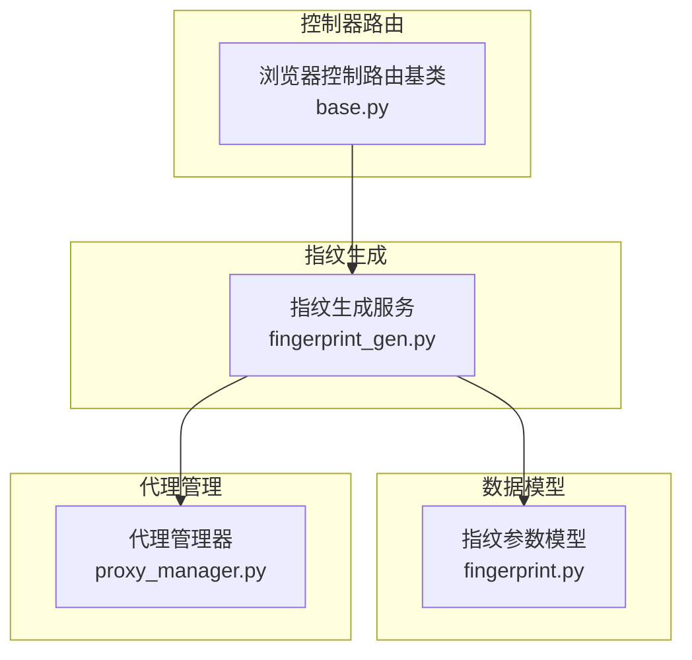
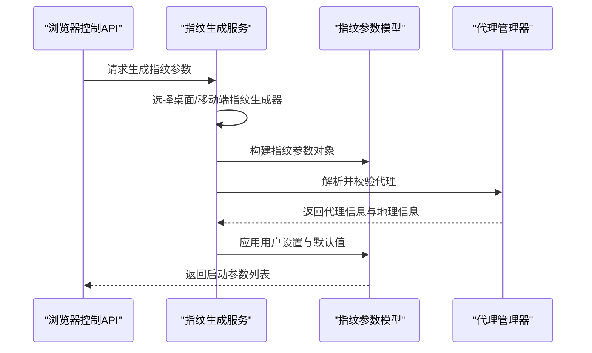
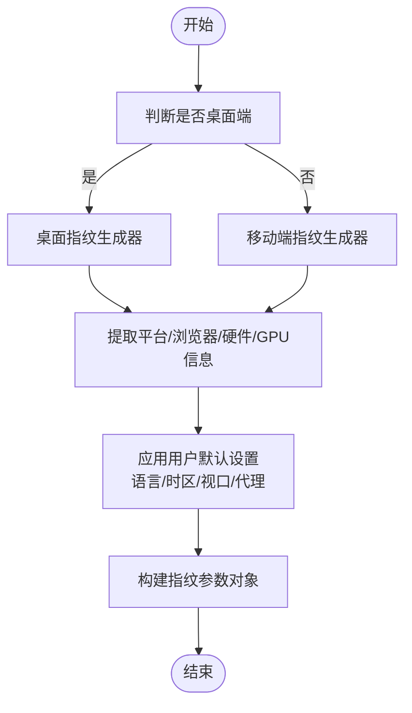
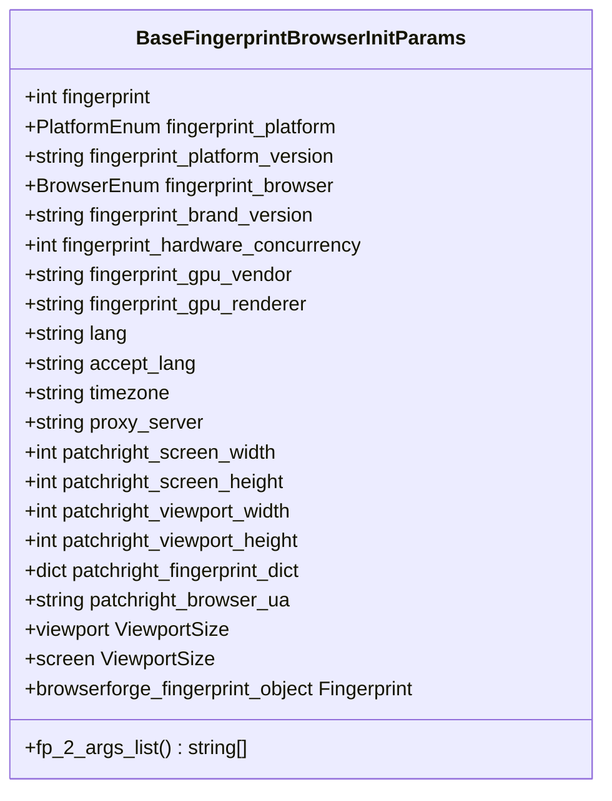
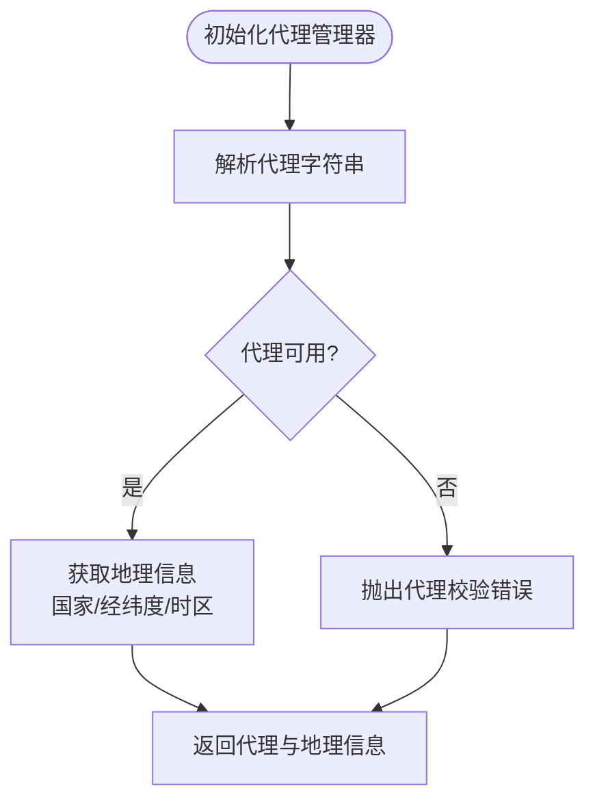
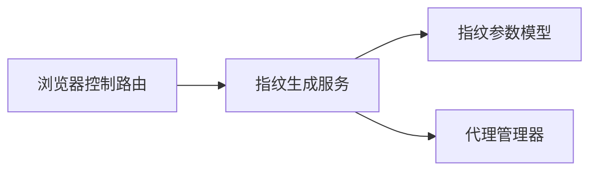

# 指纹管理

<cite>
**本文引用的文件**
- [fingerprint_gen.py](file://RPA-Browser/app/services/broswer_fingerprint/fingerprint_gen.py)
- [fingerprint.py](file://RPA-Browser/app/models/core/browser/fingerprint.py)
- [proxy_manager.py](file://RPA-Browser/botright/modules/proxy_manager.py)
- [base.py](file://RPA-Browser/app/controller/v1/browser_control/base.py)
</cite>

## 目录
1. [简介](#简介)
2. [项目结构](#项目结构)
3. [核心组件](#核心组件)
4. [架构总览](#架构总览)
5. [详细组件分析](#详细组件分析)
6. [依赖关系分析](#依赖关系分析)
7. [性能考虑](#性能考虑)
8. [故障排查指南](#故障排查指南)
9. [结论](#结论)
10. [附录：配置示例与最佳实践](#附录：配置示例与最佳实践)

## 简介
本技术文档聚焦于“指纹管理模块”，围绕浏览器指纹的生成、伪装与管理进行系统化说明。内容涵盖：
- 指纹数据结构设计：用户代理、屏幕分辨率、时区、语言设置等关键参数的建模与流转
- 指纹生成流程：基于外部指纹库与内部工具链的组合生成策略
- 指纹轮换与环境隔离：通过会话级参数与代理池集成实现隔离与轮换
- 配置示例与最佳实践：帮助避免被目标网站识别为自动化程序

## 项目结构
与指纹管理相关的核心代码主要分布在以下位置：
- 指纹生成服务：位于 RPA-Browser/app/services/broswer_fingerprint，负责从指纹库生成并映射到系统模型
- 指纹数据模型：位于 RPA-Browser/app/models/core/browser，定义指纹相关枚举与启动参数模型
- 代理管理：位于 RPA-Browser/botright/modules，提供代理解析、校验与地理信息获取能力
- 控制器路由：位于 RPA-Browser/app/controller/v1/browser_control，用于组织浏览器控制相关接口（会话、执行、操作等）

图表来源
- [fingerprint_gen.py:102-148](file://RPA-Browser/app/services/broswer_fingerprint/fingerprint_gen.py#L102-L148)
- [fingerprint.py:101-229](file://RPA-Browser/app/models/core/browser/fingerprint.py#L101-L229)
- [proxy_manager.py:18-148](file://RPA-Browser/botright/modules/proxy_manager.py#L18-L148)
- [base.py:16-58](file://RPA-Browser/app/controller/v1/browser_control/base.py#L16-L58)

章节来源
- [fingerprint_gen.py:102-148](file://RPA-Browser/app/services/broswer_fingerprint/fingerprint_gen.py#L102-L148)
- [fingerprint.py:101-229](file://RPA-Browser/app/models/core/browser/fingerprint.py#L101-L229)
- [proxy_manager.py:18-148](file://RPA-Browser/botright/modules/proxy_manager.py#L18-L148)
- [base.py:16-58](file://RPA-Browser/app/controller/v1/browser_control/base.py#L16-L58)

## 核心组件
- 指纹生成服务：根据桌面/移动端选择指纹生成器，结合用户默认设置与系统默认值，输出统一的指纹启动参数对象
- 指纹参数模型：定义平台、浏览器、语言、时区、视口、代理等字段，并提供将参数转换为浏览器启动参数的方法
- 代理管理器：解析代理字符串、校验代理可用性、获取代理地理位置与时区信息，供指纹与环境配置使用
- 控制器路由：组织浏览器控制相关接口，便于上层调用指纹生成与会话管理

章节来源
- [fingerprint_gen.py:102-148](file://RPA-Browser/app/services/broswer_fingerprint/fingerprint_gen.py#L102-L148)
- [fingerprint.py:101-229](file://RPA-Browser/app/models/core/browser/fingerprint.py#L101-L229)
- [proxy_manager.py:18-148](file://RPA-Browser/botright/modules/proxy_manager.py#L18-L148)
- [base.py:16-58](file://RPA-Browser/app/controller/v1/browser_control/base.py#L16-L58)

## 架构总览
指纹管理的整体流程如下：
- 上层控制器通过路由发起请求，进入指纹生成服务
- 指纹生成服务根据是否桌面端选择指纹生成器，生成随机指纹并映射平台与浏览器品牌
- 应用用户默认设置（语言、时区、视口、代理），合并到指纹参数模型
- 代理管理器对代理进行解析与校验，并获取地理信息以辅助环境一致性
- 最终输出可反射到浏览器的启动参数列表，用于创建隔离的浏览器会话

图表来源
- [fingerprint_gen.py:102-148](file://RPA-Browser/app/services/broswer_fingerprint/fingerprint_gen.py#L102-L148)
- [fingerprint.py:101-229](file://RPA-Browser/app/models/core/browser/fingerprint.py#L101-L229)
- [proxy_manager.py:18-148](file://RPA-Browser/botright/modules/proxy_manager.py#L18-L148)

## 详细组件分析

### 指纹生成服务
职责与要点：
- 根据 is_desktop 标志选择桌面或移动端指纹生成器
- 从指纹对象中提取平台、浏览器品牌、版本、硬件并发数、GPU 厂商与渲染器
- 应用用户默认设置（语言、时区、视口、代理），若未设置则回退到指纹默认值或系统默认值
- 输出包含完整指纹字典与浏览器 UA 的参数对象，便于后续构造浏览器实例

图表来源
- [fingerprint_gen.py:102-148](file://RPA-Browser/app/services/broswer_fingerprint/fingerprint_gen.py#L102-L148)

章节来源
- [fingerprint_gen.py:102-148](file://RPA-Browser/app/services/broswer_fingerprint/fingerprint_gen.py#L102-L148)

### 指纹参数模型
职责与要点：
- 定义平台、浏览器、语言、时区、视口、代理等字段，支持别名映射与可选字段
- 提供将指纹参数转换为浏览器启动参数列表的方法，过滤无关字段并按平台限制处理 GPU 元数据
- 提供验证规则确保浏览器类型与品牌版本一致、GPU 供应商与渲染器一致
- 支持从指纹字典重建指纹对象，便于后续注入到浏览器运行时

图表来源
- [fingerprint.py:101-229](file://RPA-Browser/app/models/core/browser/fingerprint.py#L101-L229)

章节来源
- [fingerprint.py:101-229](file://RPA-Browser/app/models/core/browser/fingerprint.py#L101-L229)

### 代理管理器
职责与要点：
- 解析代理字符串，支持无认证与用户名密码两种格式
- 构造 HTTPX 客户端并通过多个 IP 查询接口校验代理有效性
- 通过多个地理信息查询接口获取国家、经纬度与时区，辅助环境与指纹一致性
- 暴露浏览器代理配置与 HTTP 代理配置，便于注入到浏览器与网络请求中

图表来源
- [proxy_manager.py:18-148](file://RPA-Browser/botright/modules/proxy_manager.py#L18-L148)

章节来源
- [proxy_manager.py:18-148](file://RPA-Browser/botright/modules/proxy_manager.py#L18-L148)

### 控制器路由（浏览器控制）
职责与要点：
- 提供浏览器控制相关的路由工厂函数，统一封装路径前缀与依赖注入
- 便于上层业务通过会话、执行、操作等子路由访问指纹生成与浏览器管理能力

章节来源
- [base.py:16-58](file://RPA-Browser/app/controller/v1/browser_control/base.py#L16-L58)

## 依赖关系分析
- 指纹生成服务依赖：
  - 指纹参数模型：用于构建与转换启动参数
  - 代理管理器：用于代理解析与校验
  - 外部指纹库与工具：用于生成随机指纹与 UA 列表
- 代理管理器依赖：
  - HTTPX 异步客户端：用于代理检测与地理信息查询
- 控制器路由依赖：
  - 各子路由模块：聚合浏览器控制能力

图表来源
- [fingerprint_gen.py:102-148](file://RPA-Browser/app/services/broswer_fingerprint/fingerprint_gen.py#L102-L148)
- [fingerprint.py:101-229](file://RPA-Browser/app/models/core/browser/fingerprint.py#L101-L229)
- [proxy_manager.py:18-148](file://RPA-Browser/botright/modules/proxy_manager.py#L18-L148)
- [base.py:16-58](file://RPA-Browser/app/controller/v1/browser_control/base.py#L16-L58)

章节来源
- [fingerprint_gen.py:102-148](file://RPA-Browser/app/services/broswer_fingerprint/fingerprint_gen.py#L102-L148)
- [fingerprint.py:101-229](file://RPA-Browser/app/models/core/browser/fingerprint.py#L101-L229)
- [proxy_manager.py:18-148](file://RPA-Browser/botright/modules/proxy_manager.py#L18-L148)
- [base.py:16-58](file://RPA-Browser/app/controller/v1/browser_control/base.py#L16-L58)

## 性能考虑
- 指纹生成：
  - 使用异步指纹生成器减少阻塞；建议缓存常用 UA 列表以降低重复计算
  - 对用户默认设置进行懒加载与局部更新，避免每次请求全量读取
- 代理校验：
  - 多源 IP/地理查询存在失败可能，建议设置合理超时与重试策略
  - 对代理池进行健康检查与淘汰，降低无效代理带来的延迟
- 参数转换：
  - 仅输出必要启动参数，避免冗余字段导致浏览器启动开销增加
  - 在非 Linux 平台禁用 GPU 元数据修改，减少兼容性问题

[本节为通用性能建议，不直接分析具体文件]

## 故障排查指南
常见问题与定位思路：
- 代理不可用或超时：
  - 检查代理字符串格式是否正确，确认用户名密码与端口
  - 查看代理校验日志，确认 IP 与地理信息查询是否成功
- 指纹不一致或被识别：
  - 核对语言、时区、视口与代理地理位置的一致性
  - 检查浏览器品牌与版本是否与 UA 匹配，避免冲突
- 启动参数异常：
  - 确认 GPU 供应商与渲染器同时设置或同时为空
  - 确认浏览器类型与品牌版本同时设置或同时为空

章节来源
- [proxy_manager.py:107-148](file://RPA-Browser/botright/modules/proxy_manager.py#L107-L148)
- [fingerprint.py:231-252](file://RPA-Browser/app/models/core/browser/fingerprint.py#L231-L252)

## 结论
本指纹管理模块通过“指纹生成服务 + 参数模型 + 代理管理”的组合，实现了可配置、可轮换、可隔离的浏览器指纹能力。借助用户默认设置与系统默认值的优先级机制，能够在不同场景下灵活调整语言、时区、视口与代理，从而提升反自动化检测的对抗能力。配合合理的代理池与健康检查，可进一步提升稳定性与成功率。

[本节为总结性内容，不直接分析具体文件]

## 附录：配置示例与最佳实践
- 指纹配置示例（概念性说明）：
  - 桌面端：is_desktop=true，选择桌面指纹生成器，设置语言为 en-US，时区为 America/New_York，视口宽度 1366，高度 768，代理指向可用 HTTP/SOCKS 代理
  - 移动端：is_desktop=false，选择移动端指纹生成器，语言与地区保持一致，视口适配移动设备
- 最佳实践：
  - 保持语言、时区与代理地理位置一致，避免跨地域不一致触发风控
  - 定期轮换代理与指纹，避免同一指纹长时间复用
  - 在 Linux 平台启用 GPU 元数据伪装，在其他平台关闭以避免兼容问题
  - 对代理进行健康检查与淘汰，确保高可用
  - 使用会话级隔离，每个任务绑定独立指纹与代理，避免交叉污染

[本节为概念性指导，不直接分析具体文件]