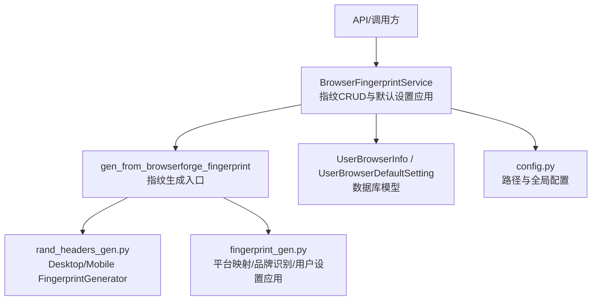
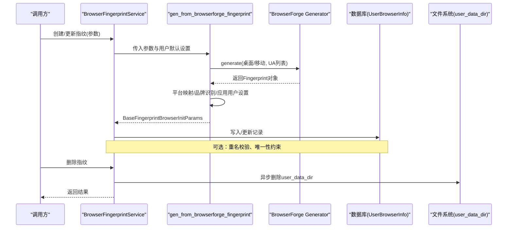
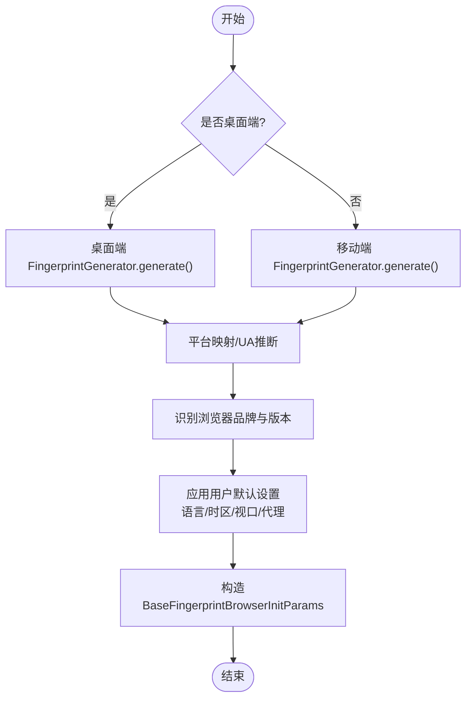
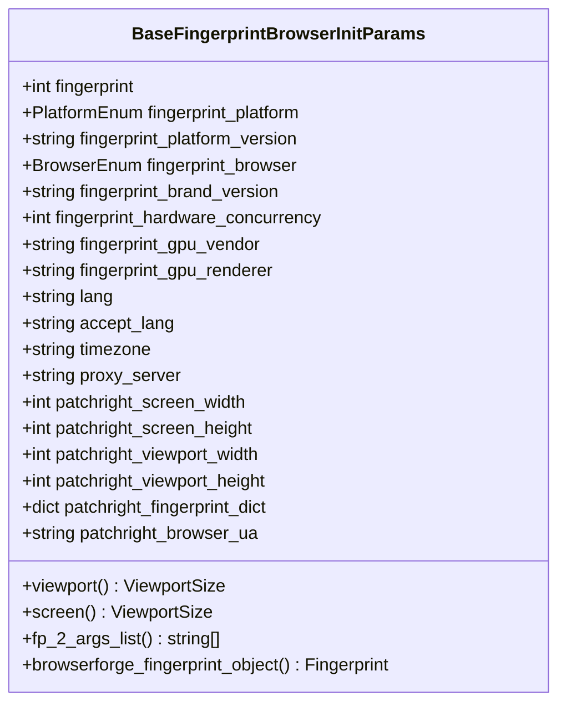
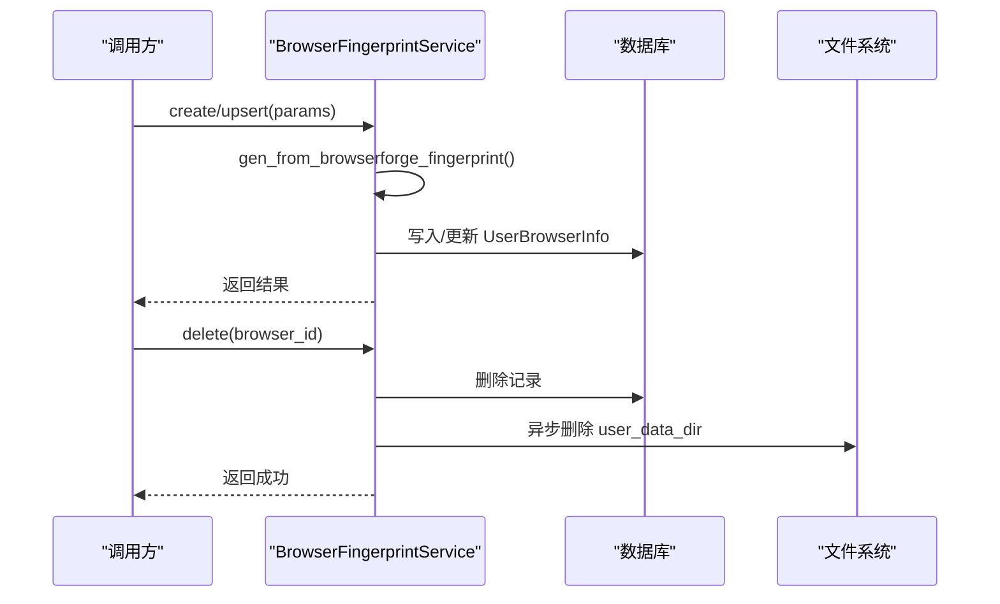
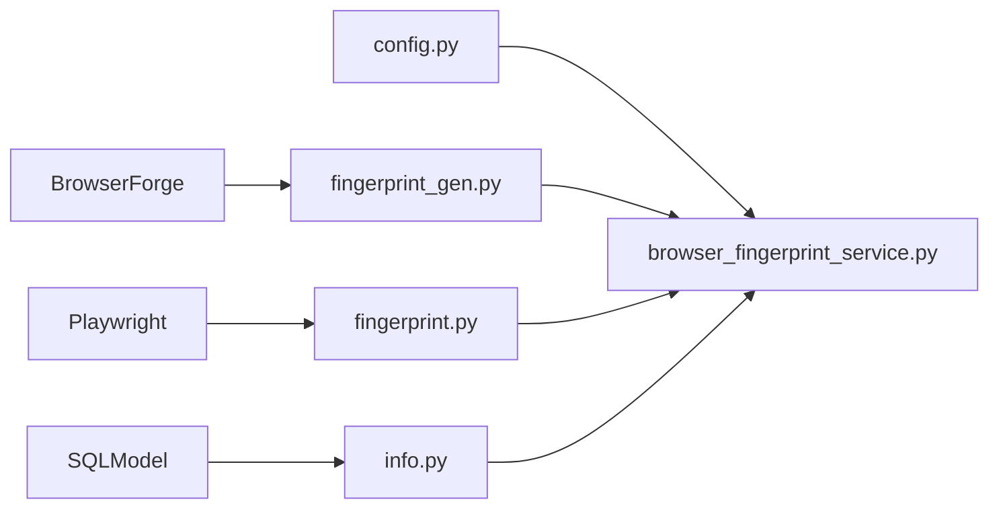

# 指纹管理

<cite>
**本文引用的文件**
- [fingerprint_gen.py](file://RPA-Browser/app/services/broswer_fingerprint/fingerprint_gen.py)
- [rand_headers_gen.py](file://RPA-Browser/app/utils/http/rand_headers_gen.py)
- [fingerprint.py](file://RPA-Browser/app/models/core/browser/fingerprint.py)
- [info.py](file://RPA-Browser/app/models/database/browser/info.py)
- [browser_fingerprint_service.py](file://RPA-Browser/app/services/RPA_browser/fingerprint/browser_fingerprint_service.py)
- [config.py](file://RPA-Browser/app/config.py)
</cite>

## 目录
1. [简介](#简介)
2. [项目结构](#项目结构)
3. [核心组件](#核心组件)
4. [架构总览](#架构总览)
5. [详细组件分析](#详细组件分析)
6. [依赖关系分析](#依赖关系分析)
7. [性能考量](#性能考量)
8. [故障排查指南](#故障排查指南)
9. [结论](#结论)
10. [附录](#附录)

## 简介
本技术文档聚焦于浏览器指纹管理模块，围绕以下目标展开：
- 深入解析基于 BrowserForge 的指纹生成算法与反检测实现
- 说明 BrowserForge 集成方案：指纹参数配置、随机化策略与一致性保证
- 文档化指纹持久化机制：存储格式、版本管理与迁移策略
- 提供指纹定制与自定义配置方法，帮助针对不同网站优化指纹设置
- 给出指纹测试工具与调试方法，验证指纹的有效性与稳定性

该模块位于 RPA-Browser 服务中，通过统一的模型与服务层封装，向上暴露创建、查询、更新、删除等能力，向下对接数据库与 BrowserForge 指纹库。

## 项目结构
与指纹管理相关的代码主要分布在以下位置：
- 指纹生成与反检测：app/services/broswer_fingerprint/fingerprint_gen.py
- BrowserForge 初始化器与全局配置：app/utils/http/rand_headers_gen.py
- 指纹数据模型与校验：app/models/core/browser/fingerprint.py
- 数据库模型与默认设置：app/models/database/browser/info.py
- 业务服务（CRUD、默认设置应用）：app/services/RPA_browser/fingerprint/browser_fingerprint_service.py
- 运行期配置与路径：app/config.py

图表来源
- [browser_fingerprint_service.py:40-154](file://RPA-Browser/app/services/RPA_browser/fingerprint/browser_fingerprint_service.py#L40-L154)
- [fingerprint_gen.py:102-147](file://RPA-Browser/app/services/broswer_fingerprint/fingerprint_gen.py#L102-L147)
- [rand_headers_gen.py:1-29](file://RPA-Browser/app/utils/http/rand_headers_gen.py#L1-L29)
- [info.py:44-114](file://RPA-Browser/app/models/database/browser/info.py#L44-L114)
- [config.py:219-232](file://RPA-Browser/app/config.py#L219-L232)

章节来源
- [fingerprint_gen.py:1-147](file://RPA-Browser/app/services/broswer_fingerprint/fingerprint_gen.py#L1-L147)
- [rand_headers_gen.py:1-29](file://RPA-Browser/app/utils/http/rand_headers_gen.py#L1-L29)
- [fingerprint.py:101-265](file://RPA-Browser/app/models/core/browser/fingerprint.py#L101-L265)
- [info.py:44-114](file://RPA-Browser/app/models/database/browser/info.py#L44-L114)
- [browser_fingerprint_service.py:40-154](file://RPA-Browser/app/services/RPA_browser/fingerprint/browser_fingerprint_service.py#L40-L154)
- [config.py:219-232](file://RPA-Browser/app/config.py#L219-L232)

## 核心组件
- 指纹生成器与反检测
  - 使用 BrowserForge 的 FingerprintGenerator 分别构建桌面端与移动端指纹，并开启 WebRTC 模拟以增强反检测能力
  - 根据请求参数选择桌面或移动指纹生成器，注入 UA 列表提升多样性
- 指纹参数模型与校验
  - BaseFingerprintBrowserInitParams 定义所有可反射到浏览器的启动参数，包含平台、浏览器、语言、时区、视口、代理、GPU 信息等
  - 内置一致性校验：浏览器类型与品牌版本必须同时设置或同时不设置；GPU 供应商与渲染器必须同时设置或同时不设置
  - 支持将指纹对象还原为 BrowserForge Fingerprint，便于后续复用与调试
- 数据库持久化与默认设置
  - UserBrowserInfo 存储每个用户的指纹实例，含自定义名称、平台、浏览器、语言、时区、视口、代理、完整指纹字典等
  - UserBrowserDefaultSetting 提供用户级默认值（平台、浏览器、语言、时区、视口、超时等），可在创建指纹时自动应用
- 业务服务
  - 提供 upsert/create/read/update/delete/rename/list/count 等能力
  - 支持将用户默认设置应用到指定浏览器实例（如代理、视口）
  - 删除指纹时异步清理对应的 user_data_dir 目录

章节来源
- [fingerprint_gen.py:20-99](file://RPA-Browser/app/services/broswer_fingerprint/fingerprint_gen.py#L20-L99)
- [fingerprint.py:101-265](file://RPA-Browser/app/models/core/browser/fingerprint.py#L101-L265)
- [info.py:44-114](file://RPA-Browser/app/models/database/browser/info.py#L44-L114)
- [browser_fingerprint_service.py:40-507](file://RPA-Browser/app/services/RPA_browser/fingerprint/browser_fingerprint_service.py#L40-L507)

## 架构总览
下图展示了从 API 到数据库的完整流程，包括指纹生成、默认设置应用与持久化。

图表来源
- [browser_fingerprint_service.py:40-154](file://RPA-Browser/app/services/RPA_browser/fingerprint/browser_fingerprint_service.py#L40-L154)
- [fingerprint_gen.py:102-147](file://RPA-Browser/app/services/broswer_fingerprint/fingerprint_gen.py#L102-L147)
- [rand_headers_gen.py:1-29](file://RPA-Browser/app/utils/http/rand_headers_gen.py#L1-L29)
- [config.py:219-232](file://RPA-Browser/app/config.py#L219-L232)

## 详细组件分析

### 指纹生成与反检测（BrowserForge 集成）
- 随机化策略
  - 桌面端与移动端分别维护独立的 FingerprintGenerator，限定操作系统、设备类型与区域语言，确保指纹在合理范围内随机
  - 通过 UA 列表注入，使每次生成的指纹具备更多样化的浏览器标识
  - 启用 WebRTC 模拟，降低被检测风险
- 平台与品牌识别
  - 从 Fingerprint.navigator.platform 映射到内部 PlatformEnum，必要时回退到 UA 推断
  - 从 UA 字符串识别浏览器品牌（Chrome/Edge/Opera/Vivaldi），并提取品牌版本与平台版本
- 用户设置应用
  - 优先级：用户默认设置 > 服务端默认设置 > 指纹生成默认值
  - 覆盖字段包括语言、时区、视口宽高、代理服务器
- 输出结构
  - 生成 BaseFingerprintBrowserInitParams，包含指纹种子、平台、浏览器、硬件并发、GPU 信息、语言、时区、视口、代理、完整指纹字典与 UA 等

图表来源
- [fingerprint_gen.py:20-99](file://RPA-Browser/app/services/broswer_fingerprint/fingerprint_gen.py#L20-L99)
- [fingerprint_gen.py:102-147](file://RPA-Browser/app/services/broswer_fingerprint/fingerprint_gen.py#L102-L147)
- [rand_headers_gen.py:1-29](file://RPA-Browser/app/utils/http/rand_headers_gen.py#L1-L29)

章节来源
- [fingerprint_gen.py:20-147](file://RPA-Browser/app/services/broswer_fingerprint/fingerprint_gen.py#L20-L147)
- [rand_headers_gen.py:1-29](file://RPA-Browser/app/utils/http/rand_headers_gen.py#L1-L29)

### 指纹参数模型与一致性保证
- 字段与用途
  - 指纹种子、平台、平台版本、浏览器、品牌版本、硬件并发、GPU 供应商/渲染器、语言、Accept-Language、时区、代理、屏幕尺寸、视口尺寸、完整指纹字典、浏览器 UA
- 一致性校验
  - 浏览器类型与品牌版本必须成对出现
  - GPU 供应商与渲染器必须成对出现
- 转换能力
  - 可将指纹对象还原为 BrowserForge Fingerprint，便于二次处理
  - 可将参数转换为浏览器启动参数列表（Linux 下支持 WebGL 元数据修改）

图表来源
- [fingerprint.py:101-265](file://RPA-Browser/app/models/core/browser/fingerprint.py#L101-L265)

章节来源
- [fingerprint.py:101-265](file://RPA-Browser/app/models/core/browser/fingerprint.py#L101-L265)

### 持久化机制：存储格式、版本管理与迁移策略
- 存储格式
  - UserBrowserInfo 继承 BaseFingerprintBrowserInitParams，新增 custom_name 用于用户自定义命名
  - 完整指纹字典以 JSON 列存储，便于保留原始指纹细节
- 版本管理
  - 通过 Alembic 进行数据库迁移（项目根 alembic 目录），建议新增字段或变更枚举时添加迁移脚本
  - 建议在模型变更后执行迁移并验证兼容性
- 迁移策略
  - 新增字段应允许为空并提供默认值
  - 对关键枚举（平台、浏览器）保持向后兼容
  - 对 JSON 字段进行兼容读取，避免破坏旧数据

章节来源
- [info.py:44-114](file://RPA-Browser/app/models/database/browser/info.py#L44-L114)
- [config.py:205-207](file://RPA-Browser/app/config.py#L205-L207)

### 默认设置与个性化定制
- 用户默认设置
  - 支持设置默认平台、浏览器、语言、时区、视口宽高、超时时间、代理服务器
  - 创建指纹时自动应用默认设置，若未设置则回退到服务端默认或指纹生成默认值
- 按网站优化
  - 针对特定站点，可通过调整语言、时区、视口、代理、UA 列表等参数，提高指纹匹配度
  - 对于需要固定指纹的场景，可保存指纹后重复使用（注意合规与风控）

章节来源
- [info.py:44-114](file://RPA-Browser/app/models/database/browser/info.py#L44-L114)
- [browser_fingerprint_service.py:351-507](file://RPA-Browser/app/services/RPA_browser/fingerprint/browser_fingerprint_service.py#L351-L507)
- [fingerprint_gen.py:61-99](file://RPA-Browser/app/services/broswer_fingerprint/fingerprint_gen.py#L61-L99)

### 业务服务：CRUD 与默认设置应用
- 创建/更新
  - 支持 upsert：若提供 browser_id 则更新现有记录，否则创建新记录并生成指纹
  - 创建时调用指纹生成器，并将结果持久化
- 查询/分页/计数
  - 提供按用户维度查询、分页与计数接口
- 删除
  - 删除记录的同时异步清理 user_data_dir 目录，释放磁盘空间
- 重命名
  - 支持为指纹设置自定义名称，并在同一用户下保证唯一性
- 默认设置应用
  - 可将用户默认设置应用到指定浏览器实例（如代理、视口）

图表来源
- [browser_fingerprint_service.py:40-154](file://RPA-Browser/app/services/RPA_browser/fingerprint/browser_fingerprint_service.py#L40-L154)
- [browser_fingerprint_service.py:208-235](file://RPA-Browser/app/services/RPA_browser/fingerprint/browser_fingerprint_service.py#L208-L235)
- [config.py:219-232](file://RPA-Browser/app/config.py#L219-L232)

章节来源
- [browser_fingerprint_service.py:40-507](file://RPA-Browser/app/services/RPA_browser/fingerprint/browser_fingerprint_service.py#L40-L507)

## 依赖关系分析
- 外部依赖
  - BrowserForge：提供 FingerprintGenerator 与 Fingerprint 数据结构，用于生成与还原指纹
  - Playwright：ViewportSize 类型用于视口大小
  - SQLModel/SQLAlchemy：数据库模型与查询
- 内部依赖
  - 配置模块：提供路径与全局默认值
  - 工具模块：UA 列表获取、雪花ID生成等

图表来源
- [fingerprint_gen.py:1-19](file://RPA-Browser/app/services/broswer_fingerprint/fingerprint_gen.py#L1-L19)
- [fingerprint.py:1-20](file://RPA-Browser/app/models/core/browser/fingerprint.py#L1-L20)
- [info.py:1-20](file://RPA-Browser/app/models/database/browser/info.py#L1-L20)
- [config.py:219-232](file://RPA-Browser/app/config.py#L219-L232)

章节来源
- [fingerprint_gen.py:1-19](file://RPA-Browser/app/services/broswer_fingerprint/fingerprint_gen.py#L1-L19)
- [fingerprint.py:1-20](file://RPA-Browser/app/models/core/browser/fingerprint.py#L1-L20)
- [info.py:1-20](file://RPA-Browser/app/models/database/browser/info.py#L1-L20)
- [config.py:219-232](file://RPA-Browser/app/config.py#L219-L232)

## 性能考量
- 指纹生成开销
  - BrowserForge 生成指纹涉及系统信息与随机化计算，建议在批量创建时考虑缓存或预生成策略
- 数据库读写
  - 大量指纹创建/更新时，注意事务粒度与索引设计（mid、custom_name 唯一约束）
- 文件清理
  - 删除指纹时异步清理 user_data_dir，避免阻塞主流程
- 视口与代理
  - 大视口可能影响页面加载与资源占用，需结合目标站点与设备特性调优

[本节为通用指导，无需具体文件引用]

## 故障排查指南
- 常见错误
  - 浏览器类型与品牌版本不一致：检查模型校验逻辑，确保两者同时设置或同时不设置
  - GPU 供应商与渲染器不一致：确保两者同时设置或同时不设置
  - 名称重复：重命名或更新时检查同一用户下的 custom_name 唯一性
- 定位方法
  - 查看日志：服务启动与配置加载日志，确认路径与默认值
  - 检查数据库：确认 UserBrowserInfo 记录完整性与唯一约束
  - 检查文件系统：确认 user_data_dir 是否存在与权限正确
- 恢复步骤
  - 修正模型字段后执行数据库迁移
  - 重新创建或更新指纹，验证一致性
  - 如需重置环境，删除对应 user_data_dir 并重建

章节来源
- [fingerprint.py:231-252](file://RPA-Browser/app/models/core/browser/fingerprint.py#L231-L252)
- [browser_fingerprint_service.py:93-122](file://RPA-Browser/app/services/RPA_browser/fingerprint/browser_fingerprint_service.py#L93-L122)
- [browser_fingerprint_service.py:208-235](file://RPA-Browser/app/services/RPA_browser/fingerprint/browser_fingerprint_service.py#L208-L235)
- [config.py:219-232](file://RPA-Browser/app/config.py#L219-L232)

## 结论
本模块通过 BrowserForge 实现了高拟真、可定制的浏览器指纹生成，结合严格的模型校验与完善的持久化机制，提供了稳定可靠的指纹管理能力。通过用户默认设置与灵活参数配置，能够针对不同网站进行优化。建议在生产环境中结合日志与监控，持续评估指纹有效性，并根据站点反爬策略迭代优化。

[本节为总结性内容，无需具体文件引用]

## 附录
- 快速上手
  - 配置默认平台、浏览器、语言、时区、视口与代理
  - 调用创建接口生成指纹并持久化
  - 根据需要重命名与复用指纹
- 最佳实践
  - 保持指纹与目标站点环境一致（语言、时区、视口）
  - 合理使用代理与 UA 列表，提升多样性
  - 定期清理无用指纹与 user_data_dir，释放资源

[本节为补充说明，无需具体文件引用]