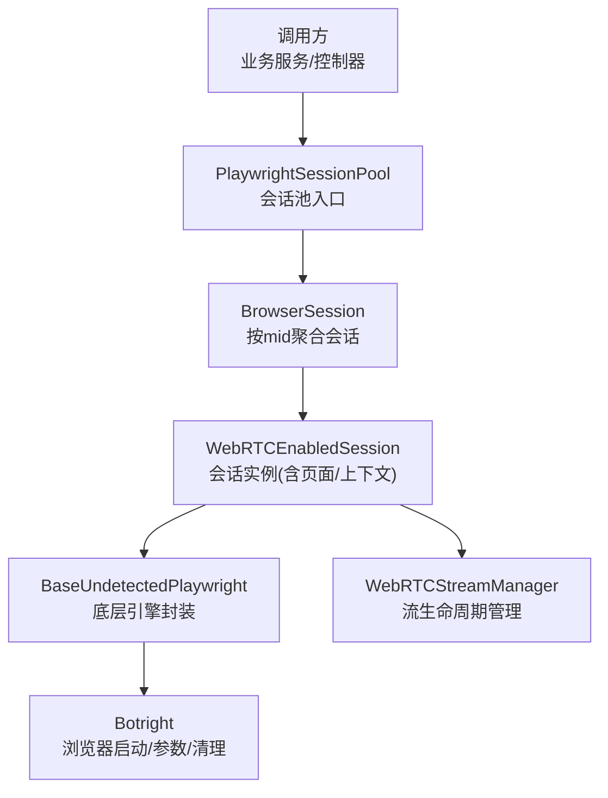
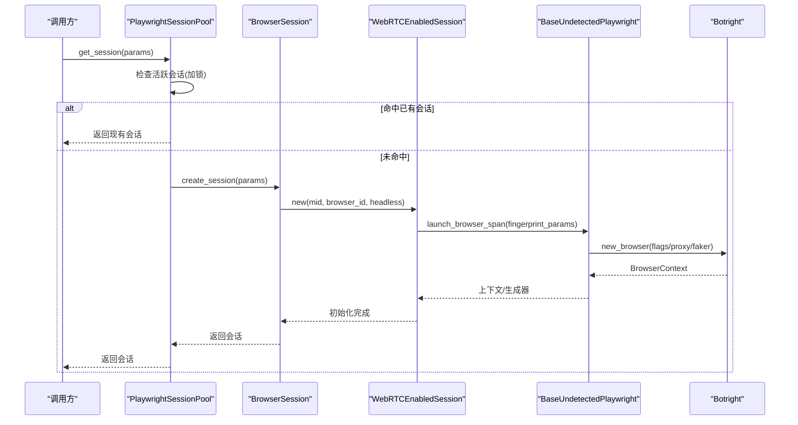
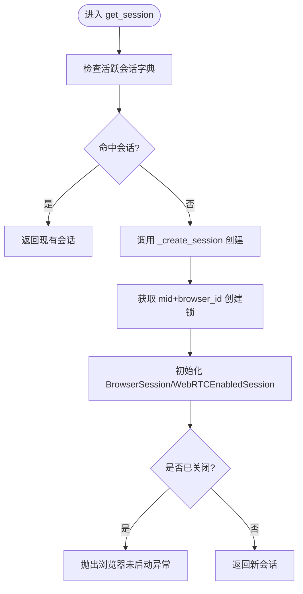
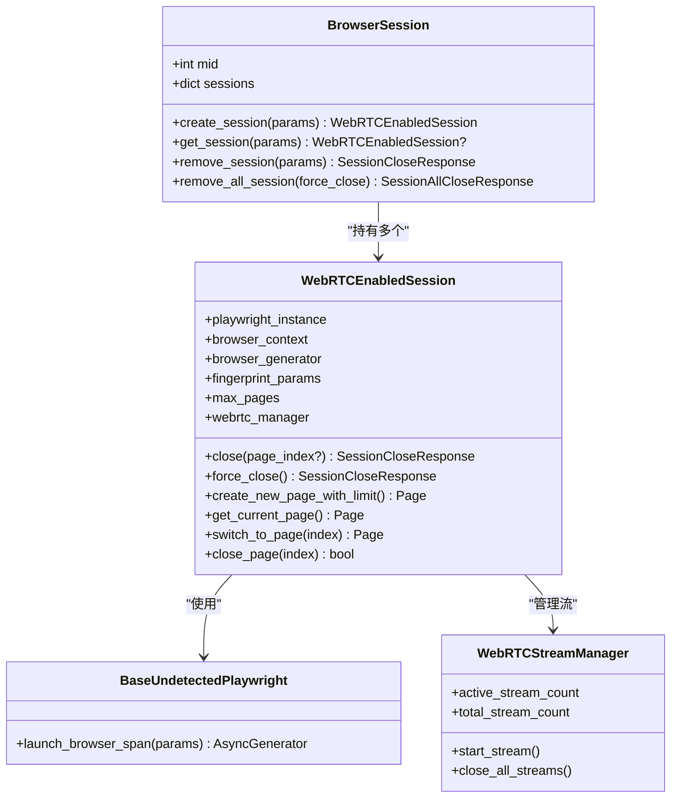
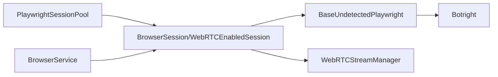

# 浏览器会话管理

<cite>
**本文引用的文件**
- [playwright_pool.py](file://RPA-Browser/app/services/RPA_browser/browser_session_pool/playwright_pool.py)
- [session_pool_model.py](file://RPA-Browser/app/services/RPA_browser/browser_session_pool/session_pool_model.py)
- [browser_service.py](file://RPA-Browser/app/services/RPA_browser/browser/browser_service.py)
- [botright.py](file://RPA-Browser/botright/botright.py)
- [base_engines.py](file://RPA-Browser/app/services/RPA_browser/base/base_engines.py)
- [stream_manager.py](file://RPA-Browser/app/services/RPA_browser/webrtc/stream_manager.py)
</cite>

## 目录
1. [简介](#简介)
2. [项目结构](#项目结构)
3. [核心组件](#核心组件)
4. [架构总览](#架构总览)
5. [详细组件分析](#详细组件分析)
6. [依赖关系分析](#依赖关系分析)
7. [性能与内存优化](#性能与内存优化)
8. [故障排查与异常处理](#故障排查与异常处理)
9. [结论](#结论)
10. [附录：配置选项与最佳实践](#附录配置选项与最佳实践)

## 简介
本技术文档聚焦于浏览器会话管理模块，围绕 Playwright 浏览器实例池的创建、生命周期管理与资源回收机制展开。重点说明会话复用策略、并发控制、页面上下文保持、Cookie/本地存储同步、WebRTC 流管理、崩溃恢复与异常处理，并提供可操作的配置建议与最佳实践。

## 项目结构
该模块位于 RPA-Browser 服务中，核心代码分布在以下位置：
- 会话池与模型：app/services/RPA_browser/browser_session_pool
- 浏览器服务（指纹、通知等）：app/services/RPA_browser/browser
- 底层浏览器封装与启动：botright
- 基础引擎抽象：app/services/RPA_browser/base/base_engines.py
- WebRTC 流管理：app/services/RPA_browser/webrtc/stream_manager.py

图表来源
- [playwright_pool.py:18-127](file://RPA-Browser/app/services/RPA_browser/browser_session_pool/playwright_pool.py#L18-L127)
- [session_pool_model.py:73-607](file://RPA-Browser/app/services/RPA_browser/browser_session_pool/session_pool_model.py#L73-L607)
- [botright.py:22-190](file://RPA-Browser/botright/botright.py#L22-L190)
- [base_engines.py](file://RPA-Browser/app/services/RPA_browser/base/base_engines.py)
- [stream_manager.py](file://RPA-Browser/app/services/RPA_browser/webrtc/stream_manager.py)

章节来源
- [playwright_pool.py:18-127](file://RPA-Browser/app/services/RPA_browser/browser_session_pool/playwright_pool.py#L18-L127)
- [session_pool_model.py:73-607](file://RPA-Browser/app/services/RPA_browser/browser_session_pool/session_pool_model.py#L73-L607)
- [botright.py:22-190](file://RPA-Browser/botright/botright.py#L22-L190)

## 核心组件
- PlaywrightSessionPool：会话池单例，提供 get_session/release_session/release_all_session 等方法，负责按 mid 查找或创建 BrowserSession，并保证并发安全。
- BrowserSession：以 mid 为维度聚合多个 browser_id 对应的 WebRTCEnabledSession，支持创建、获取、移除单个或全部会话。
- WebRTCEnabledSession：封装 BaseUndetectedPlaywright 与 BrowserContext，提供页面创建/切换/关闭、下载拦截、页面数量限制、WebRTC 流管理、优雅/强制关闭等能力。
- Botright：底层浏览器启动器，负责选择 Chromium 内核、注入启动参数、代理与指纹、权限授予与资源清理。
- BaseUndetectedPlaywright：对 Playwright/Patchright 的异步封装，提供 launch_browser_span 等生成器式启动流程。
- WebRTCStreamManager：会话内 WebRTC 流的统一生命周期管理（创建、活跃计数、关闭）。

章节来源
- [playwright_pool.py:18-127](file://RPA-Browser/app/services/RPA_browser/browser_session_pool/playwright_pool.py#L18-L127)
- [session_pool_model.py:73-607](file://RPA-Browser/app/services/RPA_browser/browser_session_pool/session_pool_model.py#L73-L607)
- [botright.py:22-190](file://RPA-Browser/botright/botright.py#L22-L190)
- [base_engines.py](file://RPA-Browser/app/services/RPA_browser/base/base_engines.py)
- [stream_manager.py](file://RPA-Browser/app/services/RPA_browser/webrtc/stream_manager.py)

## 架构总览
下图展示了从请求到浏览器会话创建的完整调用链，以及关键并发保护点。

图表来源
- [playwright_pool.py:36-83](file://RPA-Browser/app/services/RPA_browser/browser_session_pool/playwright_pool.py#L36-L83)
- [session_pool_model.py:453-533](file://RPA-Browser/app/services/RPA_browser/browser_session_pool/session_pool_model.py#L453-L533)
- [botright.py:145-177](file://RPA-Browser/botright/botright.py#L145-L177)

## 详细组件分析

### 会话池与复用策略（PlaywrightSessionPool）
- 会话查找与复用：优先根据 mid 在 _active_sessions 中查找 BrowserSession，再尝试复用其内部已存在的 browser_id 对应会话；若不存在则创建新会话。
- 并发安全：使用 asyncio.Lock 保护会话池的读写；针对“同一 mid+browser_id”的浏览器创建过程，通过全局字典 + 细粒度锁避免重复创建。
- 生命周期：提供 release_session/release_all_session 释放指定或全部会话；当某 mid 下无剩余会话时，自动从池中移除该 mid 条目。

图表来源
- [playwright_pool.py:36-83](file://RPA-Browser/app/services/RPA_browser/browser_session_pool/playwright_pool.py#L36-L83)
- [session_pool_model.py:42-70](file://RPA-Browser/app/services/RPA_browser/browser_session_pool/session_pool_model.py#L42-L70)

章节来源
- [playwright_pool.py:18-127](file://RPA-Browser/app/services/RPA_browser/browser_session_pool/playwright_pool.py#L18-L127)
- [session_pool_model.py:42-70](file://RPA-Browser/app/services/RPA_browser/browser_session_pool/session_pool_model.py#L42-L70)

### 会话模型与页面上下文（WebRTCEnabledSession / BrowserSession）
- 页面上下文保持：每个会话维护一个 BrowserContext，支持多页面；提供 create_new_page_with_limit/get_current_page/switch_to_page/close_page 等方法。
- 页面数量限制：超过配置上限时自动关闭最旧页面，防止内存膨胀。
- Cookie/本地存储同步：基于 BrowserContext 隔离的 Cookie/Storage 随上下文生命周期保持一致；关闭上下文即释放。
- WebRTC 集成：惰性初始化 WebRTCStreamManager，首次访问时才分配流资源；提供活跃/总数统计。

图表来源
- [session_pool_model.py:73-607](file://RPA-Browser/app/services/RPA_browser/browser_session_pool/session_pool_model.py#L73-L607)
- [base_engines.py](file://RPA-Browser/app/services/RPA_browser/base/base_engines.py)
- [stream_manager.py](file://RPA-Browser/app/services/RPA_browser/webrtc/stream_manager.py)

章节来源
- [session_pool_model.py:73-607](file://RPA-Browser/app/services/RPA_browser/browser_session_pool/session_pool_model.py#L73-L607)

### 浏览器启动与参数（Botright）
- 引擎选择：优先 Ungoogled Chromium，其次 Chrome，最后其他 Chromium 内核；支持自定义执行路径。
- 启动参数：注入大量禁用项与性能相关开关，如禁用自动化检测、音频、扩展、崩溃报告等；支持代理与指纹注入。
- 权限与清理：授予通知/定位权限；析构时关闭所有浏览器实例、停止 Playwright、清理临时目录。

章节来源
- [botright.py:22-190](file://RPA-Browser/botright/botright.py#L22-L190)
- [botright.py:196-240](file://RPA-Browser/botright/botright.py#L196-L240)

### 会话状态管理与异常处理
- 会话有效性判断：is_closed 综合检查上下文与首个页面状态；关闭流程先关闭 WebRTC 流，再关闭上下文与生成器。
- 强制关闭：force_close 用于兜底释放资源，捕获异常并记录日志。
- 创建失败处理：若刚创建的会话被关闭，抛出“浏览器未启动”异常，由上层重试或降级。

章节来源
- [session_pool_model.py:87-103](file://RPA-Browser/app/services/RPA_browser/browser_session_pool/session_pool_model.py#L87-L103)
- [session_pool_model.py:194-289](file://RPA-Browser/app/services/RPA_browser/browser_session_pool/session_pool_model.py#L194-L289)
- [playwright_pool.py:73-83](file://RPA-Browser/app/services/RPA_browser/browser_session_pool/playwright_pool.py#L73-L83)

## 依赖关系分析
- PlaywrightSessionPool 依赖 session_pool_model 中的 BrowserSession/WebRTCEnabledSession，并通过全局单例暴露。
- WebRTCEnabledSession 依赖 BaseUndetectedPlaywright 进行浏览器启动，依赖 WebRTCStreamManager 管理流。
- Botright 作为底层浏览器启动器，被 BaseUndetectedPlaywright 间接调用。
- 浏览器指纹与通知配置由 BrowserService 提供，便于会话初始化时的参数注入。

图表来源
- [playwright_pool.py:18-127](file://RPA-Browser/app/services/RPA_browser/browser_session_pool/playwright_pool.py#L18-L127)
- [session_pool_model.py:73-607](file://RPA-Browser/app/services/RPA_browser/browser_session_pool/session_pool_model.py#L73-L607)
- [browser_service.py:20-114](file://RPA-Browser/app/services/RPA_browser/browser/browser_service.py#L20-L114)
- [botright.py:22-190](file://RPA-Browser/botright/botright.py#L22-L190)

章节来源
- [playwright_pool.py:18-127](file://RPA-Browser/app/services/RPA_browser/browser_session_pool/playwright_pool.py#L18-L127)
- [session_pool_model.py:73-607](file://RPA-Browser/app/services/RPA_browser/browser_session_pool/session_pool_model.py#L73-L607)
- [browser_service.py:20-114](file://RPA-Browser/app/services/RPA_browser/browser/browser_service.py#L20-L114)
- [botright.py:22-190](file://RPA-Browser/botright/botright.py#L22-L190)

## 性能与内存优化
- 页面数量限制：通过 max_pages 限制每上下文页面数，超限时自动关闭最旧页面，避免内存泄漏。
- 下载拦截：默认拦截所有下载事件，减少 IO 与内存占用。
- 懒加载 WebRTC：管理器惰性初始化，流仅在首次使用时分配，降低冷启动开销。
- 并发控制：细粒度创建锁避免重复创建浏览器；会话池级锁保证字典操作原子性。
- 启动参数调优：禁用不必要的特性（扩展、崩溃上报、后台任务等），提升稳定性与性能。

章节来源
- [session_pool_model.py:166-169](file://RPA-Browser/app/services/RPA_browser/browser_session_pool/session_pool_model.py#L166-L169)
- [session_pool_model.py:303-350](file://RPA-Browser/app/services/RPA_browser/browser_session_pool/session_pool_model.py#L303-L350)
- [session_pool_model.py:151-163](file://RPA-Browser/app/services/RPA_browser/browser_session_pool/session_pool_model.py#L151-L163)
- [session_pool_model.py:42-70](file://RPA-Browser/app/services/RPA_browser/browser_session_pool/session_pool_model.py#L42-L70)
- [botright.py:99-131](file://RPA-Browser/botright/botright.py#L99-L131)

## 故障排查与异常处理
- 浏览器未启动：创建过程中检测到会话已关闭，抛出“浏览器未启动”异常，建议上层重试或重新分配 fingerprint。
- 关闭失败：close/force_close 均捕获异常并记录错误日志，返回包含反馈信息的响应对象。
- 页面索引越界：switch_to_page/close_page 对索引进行边界校验，越界抛出明确异常信息。
- 资源泄露防护：强制关闭会尝试关闭所有 WebRTC 流与上下文，确保资源释放；析构时清理临时目录与停止引擎。

章节来源
- [playwright_pool.py:73-83](file://RPA-Browser/app/services/RPA_browser/browser_session_pool/playwright_pool.py#L73-L83)
- [session_pool_model.py:194-289](file://RPA-Browser/app/services/RPA_browser/browser_session_pool/session_pool_model.py#L194-L289)
- [session_pool_model.py:361-430](file://RPA-Browser/app/services/RPA_browser/browser_session_pool/session_pool_model.py#L361-L430)
- [botright.py:179-195](file://RPA-Browser/botright/botright.py#L179-L195)

## 结论
该会话管理模块通过“会话池 + 细粒度锁 + 页面限制 + WebRTC 流管理”的组合，实现了高并发下的稳定浏览器复用与资源回收。结合 Botright 的启动参数调优与异常兜底，能够在复杂场景下保持良好性能与鲁棒性。建议在业务侧遵循“按需创建、及时释放、限制页面、监控流”的最佳实践。

## 附录：配置选项与最佳实践
- 会话复用
  - 尽量复用同一 mid+browser_id 的会话，减少频繁创建销毁带来的开销。
  - 使用 get_session 而非直接 new，让池层决定复用策略。
- 并发控制
  - 避免在同一 mid+browser_id 上并发创建；池层已内置锁，但应用层应避免重复触发。
- 页面管理
  - 使用 create_new_page_with_limit 创建页面，自动遵守上限；必要时显式 close_page。
  - 避免长时间持有无用页面引用，及时释放。
- Cookie/本地存储
  - 会话级隔离，关闭上下文即清除；如需跨会话共享，应持久化到外部存储并在创建时注入。
- WebRTC
  - 仅在需要时启用流；关注 active_stream_count 与 total_stream_count，及时关闭不再使用的流。
- 崩溃恢复
  - 捕获“浏览器未启动”异常后，重新获取或创建会话；必要时重置 fingerprint。
- 性能调优
  - 合理设置 max_pages；根据负载调整并发度；利用 Botright 的启动参数禁用不必要功能。

章节来源
- [session_pool_model.py:166-169](file://RPA-Browser/app/services/RPA_browser/browser_session_pool/session_pool_model.py#L166-L169)
- [session_pool_model.py:303-350](file://RPA-Browser/app/services/RPA_browser/browser_session_pool/session_pool_model.py#L303-L350)
- [session_pool_model.py:151-163](file://RPA-Browser/app/services/RPA_browser/browser_session_pool/session_pool_model.py#L151-L163)
- [botright.py:99-131](file://RPA-Browser/botright/botright.py#L99-L131)
- [playwright_pool.py:36-83](file://RPA-Browser/app/services/RPA_browser/browser_session_pool/playwright_pool.py#L36-L83)