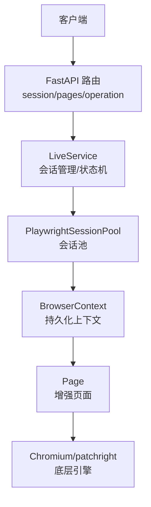
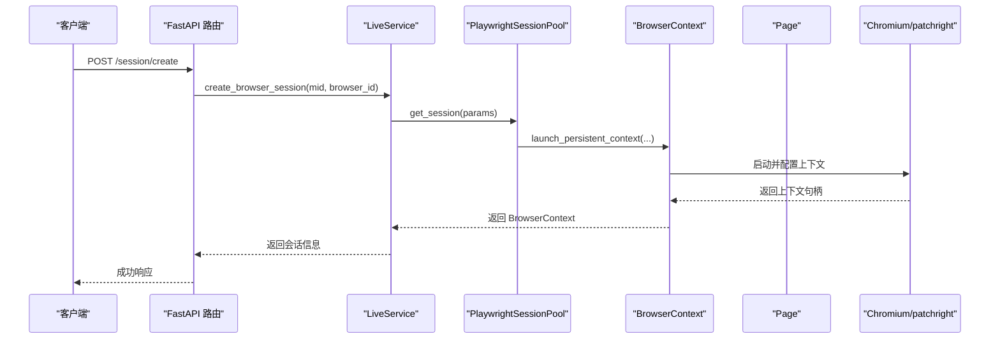
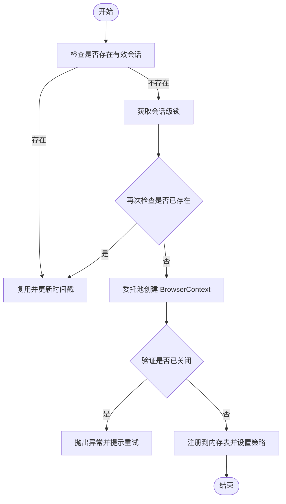
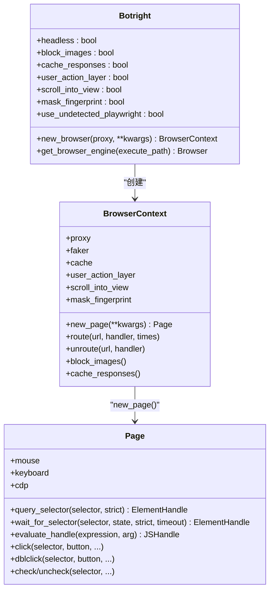
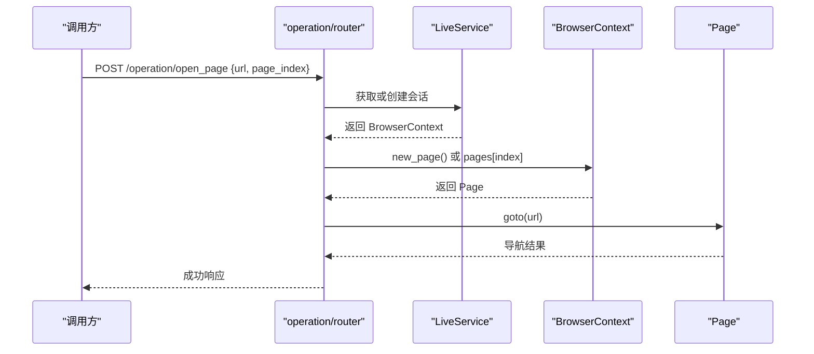
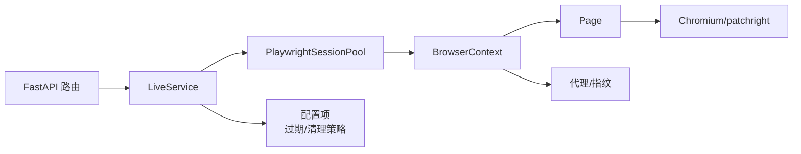

# 浏览器控制核心

<cite>
**本文引用的文件**
- [base.py](file://RPA-Browser/app/controller/v1/browser_control/base.py)
- [session/router.py](file://RPA-Browser/app/controller/v1/browser_control/session/router.py)
- [pages/router.py](file://RPA-Browser/app/controller/v1/browser_control/pages/router.py)
- [operation/router.py](file://RPA-Browser/app/controller/v1/browser_control/operation/router.py)
- [botright.py](file://RPA-Browser/botright/botright.py)
- [browser.py](file://RPA-Browser/botright/playwright_mock/browser.py)
- [page.py](file://RPA-Browser/botright/playwright_mock/page.py)
- [live_service.py](file://RPA-Browser/app/services/RPA_browser/session/live_service.py)
</cite>

## 目录
1. [简介](#简介)
2. [项目结构](#项目结构)
3. [核心组件](#核心组件)
4. [架构总览](#架构总览)
5. [详细组件分析](#详细组件分析)
6. [依赖关系分析](#依赖关系分析)
7. [性能与稳定性](#性能与稳定性)
8. [故障排查指南](#故障排查指南)
9. [结论](#结论)
10. [附录：API 参考与示例](#附录api-参考与示例)

## 简介
本模块提供浏览器会话管理、页面操作模拟、表单填写等自动化能力，基于 Playwright（含 patchright）实现反检测与指纹伪装。通过 FastAPI 暴露统一 API，支持创建/关闭会话、页面导航、截图、DOM 操作、JavaScript 执行、WebRTC 视频流等。服务层采用会话池与状态机进行生命周期管理与自动清理，保障高并发下的稳定性与资源回收。

## 项目结构
- 控制器层（FastAPI Router）
  - 会话管理：创建、查询、关闭
  - 页面管理：列表、切换、关闭
  - 操作控制：打开/关闭/切换页面、获取页面信息、执行 JS、浏览器信息
- 浏览器内核封装（Botright + Playwright Mock）
  - Botright：启动 Playwright、选择浏览器引擎、注入启动参数、代理与指纹
  - BrowserContext/Page：对 Playwright 的上下文与页面进行增强，支持路由拦截、图片拦截、响应缓存、用户行为层、CDP 伪装等
- 服务层（LiveService）
  - 会话生命周期：创建、复用、释放、心跳与自动清理
  - 并发安全：会话级锁、全局锁保护字典
  - 状态机：ACTIVE/IDLE/TERMINATING 转换与清理策略

图表来源
- [session/router.py:23-91](file://RPA-Browser/app/controller/v1/browser_control/session/router.py#L23-L91)
- [pages/router.py:19-57](file://RPA-Browser/app/controller/v1/browser_control/pages/router.py#L19-L57)
- [operation/router.py:65-105](file://RPA-Browser/app/controller/v1/browser_control/operation/router.py#L65-L105)
- [live_service.py:215-324](file://RPA-Browser/app/services/RPA_browser/session/live_service.py#L215-L324)
- [browser.py:72-95](file://RPA-Browser/botright/playwright_mock/browser.py#L72-L95)
- [page.py:63-79](file://RPA-Browser/botright/playwright_mock/page.py#L63-L79)

章节来源
- [base.py:1-59](file://RPA-Browser/app/controller/v1/browser_control/base.py#L1-L59)

## 核心组件
- 会话管理（LiveService）
  - 维护进程内会话表，提供 get_or_create/release/status 等方法
  - 使用会话级锁避免竞态，支持重试创建与双重检查
  - 基于过期时间、闲置时间与连接数进行自动清理
- 浏览器上下文与页面（BrowserContext/Page）
  - 基于 patchright/Playwright 启动 Chromium 持久化上下文
  - 注入 UA、时区、地理、屏幕尺寸、权限、代理等指纹参数
  - 提供图片拦截、响应缓存、路由包装、用户行为层、hCaptcha 辅助
- 路由层（FastAPI）
  - 会话：创建/状态/关闭
  - 页面：列表/切换/关闭
  - 操作：打开/关闭/切换页面、获取页面信息、执行 JS、浏览器信息

章节来源
- [live_service.py:49-194](file://RPA-Browser/app/services/RPA_browser/session/live_service.py#L49-L194)
- [browser.py:23-95](file://RPA-Browser/botright/playwright_mock/browser.py#L23-L95)
- [page.py:82-172](file://RPA-Browser/botright/playwright_mock/page.py#L82-L172)
- [session/router.py:23-91](file://RPA-Browser/app/controller/v1/browser_control/session/router.py#L23-L91)
- [pages/router.py:19-57](file://RPA-Browser/app/controller/v1/browser_control/pages/router.py#L19-L57)
- [operation/router.py:65-247](file://RPA-Browser/app/controller/v1/browser_control/operation/router.py#L65-L247)

## 架构总览
系统以 FastAPI 为入口，将请求分发到各业务路由；路由调用 LiveService 完成会话获取或创建；LiveService 通过会话池管理 BrowserContext 与 Page，最终驱动底层 Chromium 引擎。所有页面级交互均通过增强的 Page 对象完成，具备反检测与可观测性。

图表来源
- [session/router.py:23-91](file://RPA-Browser/app/controller/v1/browser_control/session/router.py#L23-L91)
- [live_service.py:367-440](file://RPA-Browser/app/services/RPA_browser/session/live_service.py#L367-L440)
- [browser.py:72-95](file://RPA-Browser/botright/playwright_mock/browser.py#L72-L95)

## 详细组件分析

### 会话管理（LiveService）
- 功能要点
  - 会话键：mid_browser_id
  - 并发安全：_global_lock 保护 _session_locks；每个会话拥有独立 asyncio.Lock
  - 生命周期：ACTIVE/IDLE/TERMINATED，结合过期时间、闲置超时、无活跃连接触发清理
  - 创建流程：先快速检查，再获取锁，双重检查后委托池创建，注册到内存表
  - 释放流程：关闭会话、删除引用、从池中释放、清理锁
- 关键方法
  - get_or_create_browser_session_entry：获取或创建会话条目
  - release_browser_session：释放并回收资源
  - get_browser_session_status：返回会话状态与指纹参数
  - ensure_webrtc_session：确保带 WebRTC 能力的会话可用

图表来源
- [live_service.py:215-324](file://RPA-Browser/app/services/RPA_browser/session/live_service.py#L215-L324)

章节来源
- [live_service.py:49-194](file://RPA-Browser/app/services/RPA_browser/session/live_service.py#L49-L194)
- [live_service.py:215-324](file://RPA-Browser/app/services/RPA_browser/session/live_service.py#L215-L324)
- [live_service.py:326-365](file://RPA-Browser/app/services/RPA_browser/session/live_service.py#L326-L365)
- [live_service.py:442-499](file://RPA-Browser/app/services/RPA_browser/session/live_service.py#L442-L499)

### 浏览器内核封装（Botright + BrowserContext + Page）
- Botright
  - 启动 Playwright（可选 undetected），选择 Chromium 引擎，注入大量启动参数以规避检测
  - 生成指纹与代理信息，创建 BrowserContext
- BrowserContext
  - 基于 persistent context 启动，注入 locale、UA、时区、地理、权限、代理、忽略默认参数等
  - 支持图片拦截、响应缓存、路由包装、expose_binding 适配
- Page
  - 增强 query_selector/wait_for_selector/locator/evaluate_handle 等
  - 支持 CDP 覆盖 UA、用户行为层脚本注入、hCaptcha 辅助
  - 自定义 click/dblclick/check/uncheck 等交互，保证元素可见性与滚动到视口

图表来源
- [botright.py:22-177](file://RPA-Browser/botright/botright.py#L22-L177)
- [browser.py:23-95](file://RPA-Browser/botright/playwright_mock/browser.py#L23-L95)
- [page.py:63-172](file://RPA-Browser/botright/playwright_mock/page.py#L63-L172)

章节来源
- [botright.py:52-177](file://RPA-Browser/botright/botright.py#L52-L177)
- [browser.py:72-95](file://RPA-Browser/botright/playwright_mock/browser.py#L72-L95)
- [page.py:170-228](file://RPA-Browser/botright/playwright_mock/page.py#L170-L228)
- [page.py:631-779](file://RPA-Browser/botright/playwright_mock/page.py#L631-L779)

### 路由与 API
- 会话路由
  - POST /session/create：创建会话（若已存在则返回现有信息）
  - POST /session/status：查询会话状态（包含生命周期、指纹参数等）
  - POST /session/close：手动关闭会话并释放资源
- 页面路由
  - POST /pages/list：列出当前浏览器所有页面信息
  - POST /pages/switch：切换到指定索引页面
  - POST /pages/close：关闭指定索引页面（至少保留一个）
- 操作路由
  - POST /operation/open_page：打开 URL（支持新建或指定页）
  - POST /operation/close_page：关闭指定页
  - POST /operation/switch_page：切换活动页
  - POST /operation/get_page_info：获取页面 URL、标题、Cookie 数量
  - POST /browser/info：获取浏览器版本、UA、数据目录等

图表来源
- [operation/router.py:65-105](file://RPA-Browser/app/controller/v1/browser_control/operation/router.py#L65-L105)
- [live_service.py:215-324](file://RPA-Browser/app/services/RPA_browser/session/live_service.py#L215-L324)

章节来源
- [session/router.py:23-196](file://RPA-Browser/app/controller/v1/browser_control/session/router.py#L23-L196)
- [pages/router.py:19-171](file://RPA-Browser/app/controller/v1/browser_control/pages/router.py#L19-L171)
- [operation/router.py:65-247](file://RPA-Browser/app/controller/v1/browser_control/operation/router.py#L65-L247)

## 依赖关系分析
- 控制器依赖服务层：路由通过 LiveService 访问会话与页面
- 服务层依赖会话池与模型：通过 PlaywrightSessionPool 管理 BrowserContext，使用运行时模型描述状态
- 内核依赖 Playwright/patchright：BrowserContext 使用 launch_persistent_context，Page 使用 CDP 与事件机制
- 外部依赖：代理、指纹生成器、配置项（过期时间、清理策略）

图表来源
- [live_service.py:215-324](file://RPA-Browser/app/services/RPA_browser/session/live_service.py#L215-L324)
- [browser.py:72-95](file://RPA-Browser/botright/playwright_mock/browser.py#L72-L95)
- [page.py:170-228](file://RPA-Browser/botright/playwright_mock/page.py#L170-L228)

章节来源
- [live_service.py:49-194](file://RPA-Browser/app/services/RPA_browser/session/live_service.py#L49-L194)
- [browser.py:23-95](file://RPA-Browser/botright/playwright_mock/browser.py#L23-L95)
- [page.py:82-172](file://RPA-Browser/botright/playwright_mock/page.py#L82-L172)

## 性能与稳定性
- 并发安全
  - 会话级锁避免重复创建与并发写冲突
  - 全局锁保护会话锁字典
- 资源管理
  - 图片拦截减少带宽与渲染开销
  - 响应缓存降低重复请求成本
  - 自动清理策略防止僵尸会话占用资源
- 反检测与稳定性
  - 启动参数屏蔽自动化特征、禁用无关特性
  - CDP 覆盖 UA、平台、UA 元数据
  - 用户行为层注入提升人机一致性

[本节为通用指导，不直接分析具体文件]

## 故障排查指南
- 常见错误
  - 会话不存在：检查是否已创建或已过期
  - 页面索引越界：确认当前页面数量与索引范围
  - 浏览器未启动：检查会话状态与清理策略
  - 无法关闭最后一个页面：保持至少一个页面
- 定位建议
  - 查看路由日志与 LiveService 日志
  - 使用 /pages/list 与 /operation/get_page_info 确认页面状态
  - 使用 /session/status 检查生命周期与指纹参数
  - 在 Page 层增加 wait_for_selector 与超时处理

章节来源
- [session/router.py:94-127](file://RPA-Browser/app/controller/v1/browser_control/session/router.py#L94-L127)
- [pages/router.py:60-117](file://RPA-Browser/app/controller/v1/browser_control/pages/router.py#L60-L117)
- [operation/router.py:108-170](file://RPA-Browser/app/controller/v1/browser_control/operation/router.py#L108-L170)

## 结论
本模块通过分层设计将浏览器控制抽象为清晰的 API，并以 LiveService 为核心实现会话生命周期与资源治理。Botright 与 Playwright Mock 提供了强大的反检测与扩展能力，满足复杂动态页面与反爬场景。配合路由层的标准化接口，便于前端或上层服务集成与编排。

[本节为总结，不直接分析具体文件]

## 附录：API 参考与示例
- 会话管理
  - POST /session/create：创建或复用会话
  - POST /session/status：查询会话状态
  - POST /session/close：关闭会话
- 页面管理
  - POST /pages/list：获取页面列表
  - POST /pages/switch：切换页面
  - POST /pages/close：关闭页面
- 操作控制
  - POST /operation/open_page：打开 URL
  - POST /operation/close_page：关闭页面
  - POST /operation/switch_page：切换页面
  - POST /operation/get_page_info：获取页面信息
  - POST /browser/info：获取浏览器信息

- 典型自动化流程（示例说明）
  - 创建会话 -> 打开页面 -> 等待元素 -> 输入文本/点击 -> 截图 -> 关闭页面/会话
  - 动态页面：使用 wait_for_selector 与合理超时；必要时启用用户行为层
  - 反检测：启用指纹伪装、代理、UA 覆盖、禁用自动化特征

章节来源
- [session/router.py:23-196](file://RPA-Browser/app/controller/v1/browser_control/session/router.py#L23-L196)
- [pages/router.py:19-171](file://RPA-Browser/app/controller/v1/browser_control/pages/router.py#L19-L171)
- [operation/router.py:65-247](file://RPA-Browser/app/controller/v1/browser_control/operation/router.py#L65-L247)
- [page.py:631-779](file://RPA-Browser/botright/playwright_mock/page.py#L631-L779)
- [browser.py:156-183](file://RPA-Browser/botright/playwright_mock/browser.py#L156-L183)