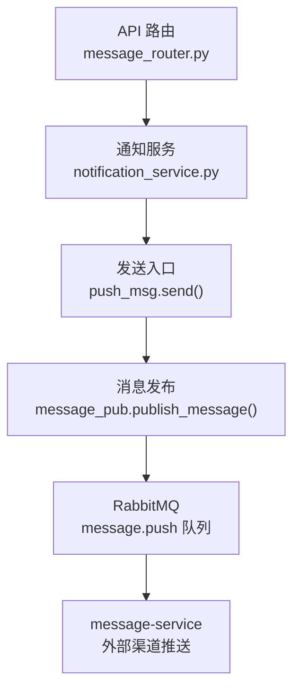
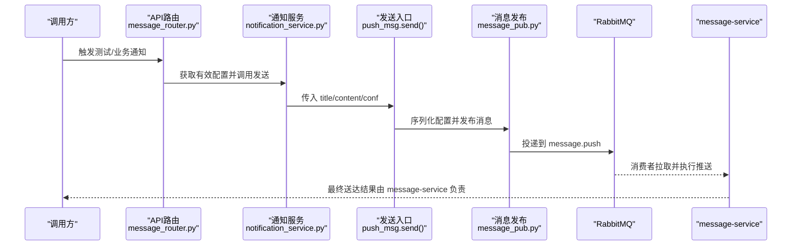
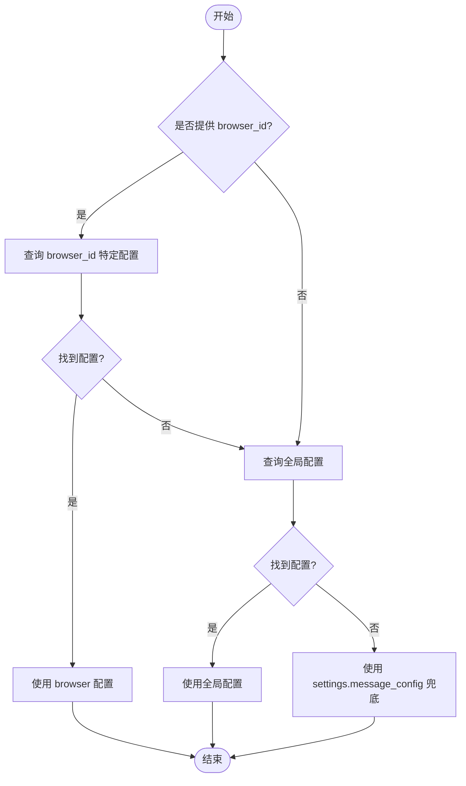
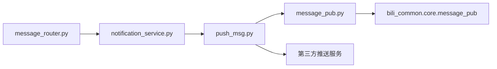

# 通知服务

<cite>
**本文引用的文件**
- [RPA-Browser/app/services/RPA_browser/browser/notification_service.py](file://RPA-Browser/app/services/RPA_browser/browser/notification_service.py)
- [RPA-Browser/app/services/message/push_msg.py](file://RPA-Browser/app/services/message/push_msg.py)
- [RPA-Browser/app/services/message/message_pub.py](file://RPA-Browser/app/services/message/message_pub.py)
- [RPA-Browser/app/models/database/notify/models.py](file://RPA-Browser/app/models/database/notify/models.py)
- [RPA-Browser/app/models/notify/models.py](file://RPA-Browser/app/models/notify/models.py)
- [RPA-Browser/app/controller/v1/browser/message_router.py](file://RPA-Browser/app/controller/v1/browser/message_router.py)
- [RPA-Browser/app/config.py](file://RPA-Browser/app/config.py)
</cite>

## 目录
1. [简介](#简介)
2. [项目结构](#项目结构)
3. [核心组件](#核心组件)
4. [架构总览](#架构总览)
5. [详细组件分析](#详细组件分析)
6. [依赖关系分析](#依赖关系分析)
7. [性能与可靠性](#性能与可靠性)
8. [故障排查指南](#故障排查指南)
9. [结论](#结论)
10. [附录](#附录)

## 简介
本技术文档聚焦于通知服务模块，围绕推送通知的配置管理与消息发送机制展开。重点说明：
- 配置优先级：浏览器特定配置优先于全局配置；当无 per-user 配置时回落到全局 message_config。
- 推送渠道：支持 PushMe、PushPlus、邮箱（SMTP）、Bark、钉钉、飞书、企业微信、Telegram、Ntfy、WxPusher、Chronocat、Server酱、iGot、PushDeer、Synology Chat、go-cqhttp、智能微秘书等。
- 模板与格式化：标题统一附加主题标识与服务标识前缀；内容可追加一言；支持结构化字段透传到下游 message-service。
- 异步处理与日志：通过 RabbitMQ 将推送请求发布到 message-service 消费；本地记录关键日志，便于追踪。
- 错误与重试：当前实现为“仅发布不等待结果”的 fire-and-forget 模式；重试策略由 message-service 侧承担。

## 项目结构
通知能力在 RPA-Browser 中采用“配置 + 路由 + 服务 + 通道封装 + 消息发布”的分层组织：
- 配置模型：数据库表模型与 API 请求/响应模型分离，集中定义各渠道参数。
- 路由层：提供配置的增删改查与测试发送接口。
- 服务层：负责读取有效配置、合并优先级、调用发送入口。
- 通道封装：对第三方推送渠道进行统一封装（HTTP/SMTP）。
- 消息发布：将推送任务投递至 RabbitMQ，交由 message-service 统一执行实际推送。

图表来源
- [RPA-Browser/app/controller/v1/browser/message_router.py:34-90](file://RPA-Browser/app/controller/v1/browser/message_router.py#L34-L90)
- [RPA-Browser/app/services/RPA_browser/browser/notification_service.py:161-191](file://RPA-Browser/app/services/RPA_browser/browser/notification_service.py#L161-L191)
- [RPA-Browser/app/services/message/push_msg.py:1002-1051](file://RPA-Browser/app/services/message/push_msg.py#L1002-L1051)
- [RPA-Browser/app/services/message/message_pub.py:27-41](file://RPA-Browser/app/services/message/message_pub.py#L27-L41)

章节来源
- [RPA-Browser/app/controller/v1/browser/message_router.py:34-302](file://RPA-Browser/app/controller/v1/browser/message_router.py#L34-L302)
- [RPA-Browser/app/services/RPA_browser/browser/notification_service.py:1-192](file://RPA-Browser/app/services/RPA_browser/browser/notification_service.py#L1-L192)
- [RPA-Browser/app/services/message/push_msg.py:1-1051](file://RPA-Browser/app/services/message/push_msg.py#L1-L1051)
- [RPA-Browser/app/services/message/message_pub.py:1-41](file://RPA-Browser/app/services/message/message_pub.py#L1-L41)

## 核心组件
- 通知配置数据模型
  - 数据库模型：NotificationConfigBase/NotificationConfig，包含所有渠道所需字段（如 pushme_key、push_plus_token、smtp_*、tg_* 等）。
  - API 模型：NotificationConfigCreate/Update，用于创建/更新配置；BrowserService 暴露 get/update/create 等方法。
- 通知服务
  - 获取有效配置：优先 browser_id 特定配置，其次全局配置；返回带来源标记的有效配置。
  - 发送消息：根据配置选择渠道；若无 per-user 配置则使用全局 settings.message_config 兜底。
- 推送通道封装
  - PushMessageService：统一封装各渠道发送逻辑，send() 方法按配置启用并并行执行。
  - 辅助类 WeCom：企业微信应用消息收发。
- 消息发布
  - publish_message：将推送请求发布到 RabbitMQ，携带 title、content、config（序列化后的配置），由 message-service 消费并执行实际推送。
- 路由与测试
  - upsert/read/delete/test_notify：提供配置的持久化与测试发送能力；测试接口会尝试构建配置对象并调用 send。

章节来源
- [RPA-Browser/app/models/database/notify/models.py:13-157](file://RPA-Browser/app/models/database/notify/models.py#L13-L157)
- [RPA-Browser/app/models/notify/models.py:13-107](file://RPA-Browser/app/models/notify/models.py#L13-L107)
- [RPA-Browser/app/services/RPA_browser/browser/notification_service.py:24-191](file://RPA-Browser/app/services/RPA_browser/browser/notification_service.py#L24-L191)
- [RPA-Browser/app/services/message/push_msg.py:44-1051](file://RPA-Browser/app/services/message/push_msg.py#L44-L1051)
- [RPA-Browser/app/services/message/message_pub.py:27-41](file://RPA-Browser/app/services/message/message_pub.py#L27-L41)
- [RPA-Browser/app/controller/v1/browser/message_router.py:34-302](file://RPA-Browser/app/controller/v1/browser/message_router.py#L34-L302)

## 架构总览
通知服务采用“配置驱动 + 通道抽象 + 消息队列解耦”的架构：
- 配置驱动：通过 NotificationConfig 或全局 PushChannelConfig 决定启用哪些渠道。
- 通道抽象：PushMessageService 以方法形式暴露各渠道，send() 动态发现并并行执行。
- 消息队列：RPA-Browser 不再直接调用第三方接口，而是将推送任务投递到 message-service，由其统一管理限流、重试、日志与失败告警。

图表来源
- [RPA-Browser/app/controller/v1/browser/message_router.py:171-302](file://RPA-Browser/app/controller/v1/browser/message_router.py#L171-L302)
- [RPA-Browser/app/services/RPA_browser/browser/notification_service.py:161-191](file://RPA-Browser/app/services/RPA_browser/browser/notification_service.py#L161-L191)
- [RPA-Browser/app/services/message/push_msg.py:1002-1051](file://RPA-Browser/app/services/message/push_msg.py#L1002-L1051)
- [RPA-Browser/app/services/message/message_pub.py:27-41](file://RPA-Browser/app/services/message/message_pub.py#L27-L41)

## 详细组件分析

### 配置优先级与继承关系
- 优先级规则
  - 若存在 browser_id 特定的配置，则优先使用该配置。
  - 否则回退到全局配置（browser_id 为空）。
  - 若仍无 per-user 配置，则使用全局 settings.message_config（Pydantic 模型）作为兜底。
- 数据来源
  - 数据库：NotificationConfig 表存储 per-user 配置。
  - 环境变量/配置文件：Settings.message_config 提供全局默认值。
- 有效配置返回
  - 返回对象包含配置字段与来源标记（browser/global），便于前端展示与审计。

图表来源
- [RPA-Browser/app/services/RPA_browser/browser/notification_service.py:24-90](file://RPA-Browser/app/services/RPA_browser/browser/notification_service.py#L24-L90)
- [RPA-Browser/app/config.py:176-183](file://RPA-Browser/app/config.py#L176-L183)

章节来源
- [RPA-Browser/app/services/RPA_browser/browser/notification_service.py:24-90](file://RPA-Browser/app/services/RPA_browser/browser/notification_service.py#L24-L90)
- [RPA-Browser/app/config.py:176-183](file://RPA-Browser/app/config.py#L176-L183)

### 推送渠道与集成方式
- 已支持的渠道（部分示例）
  - PushMe：pushme_key/pushme_url
  - PushPlus：push_plus_token/user/template/channel/webhook/callbackurl/to
  - 邮箱 SMTP：smtp_server/smtp_ssl/smtp_email/smtp_password/smtp_name
  - Bark：bark_push/bark_* 系列参数
  - 钉钉机器人：dd_bot_token/dd_bot_secret
  - 飞书机器人：fskey
  - 企业微信：qywx_origin/qywx_am/qywx_key
  - Telegram：tg_bot_token/tg_user_id/tg_api_host/proxy_*
  - Ntfy：ntfy_url/topic/priority/token/username/password/actions
  - WxPusher：wxpusher_app_token/topic_ids/uids
  - Chronocat：chronocat_url/token/qq
  - Server酱：push_key
  - iGot：igot_push_key
  - PushDeer：deer_key/deer_url
  - Synology Chat：chat_url/chat_token
  - go-cqhttp：gobot_url/gobot_qq/gobot_token
  - 智能微秘书：aibotk_key/type/name
- 集成要点
  - 每个渠道在 PushMessageService 中以独立方法实现，send() 根据配置动态启用。
  - 多数渠道通过 HTTP 调用第三方 API；SMTP 使用同步发送并通过线程池执行以避免阻塞事件循环。
  - 标题统一附加主题标识与服务标识前缀，内容可选追加一言。

章节来源
- [RPA-Browser/app/services/message/push_msg.py:55-894](file://RPA-Browser/app/services/message/push_msg.py#L55-L894)
- [RPA-Browser/app/models/database/notify/models.py:24-135](file://RPA-Browser/app/models/database/notify/models.py#L24-L135)

### 通知模板与消息格式化
- 标题格式
  - 主题标识：[i]/[s]/[w]/[f]（信息/成功/警告/失败）
  - 服务标识：[SERVER_NAME@SERVER_ADDRESS]
  - 最终标题：主题 + 服务标识 + 原始标题
- 内容格式
  - 基础内容可直接传入；当开启一言时自动追加一句随机句子。
  - 不同渠道对内容渲染有差异（例如 WxPusher 支持 HTML 摘要）。
- 结构化配置
  - 配置对象会被序列化为 dict 后随消息一起投递到 message-service，确保下游能基于同一份配置执行推送。

章节来源
- [RPA-Browser/app/services/message/push_msg.py:23-42](file://RPA-Browser/app/services/message/push_msg.py#L23-L42)
- [RPA-Browser/app/services/message/push_msg.py:974-1051](file://RPA-Browser/app/services/message/push_msg.py#L974-L1051)

### 异步处理、错误重试与日志
- 异步处理
  - 各渠道方法多为异步；send() 收集任务列表并使用 asyncio.gather 并行执行。
  - SMTP 为同步方法，通过 run_in_executor 在线程池中执行，避免阻塞事件循环。
- 错误与重试
  - RPA-Browser 侧仅负责发布到 RabbitMQ，不等待第三方结果；因此重试与补偿逻辑由 message-service 承担。
  - 若未配置任何渠道，send() 会抛出异常提示检查变量。
- 日志记录
  - 使用 loguru 在各渠道发送前后记录成功/失败日志；标题附带服务标识便于定位。

章节来源
- [RPA-Browser/app/services/message/push_msg.py:749-894](file://RPA-Browser/app/services/message/push_msg.py#L749-L894)
- [RPA-Browser/app/services/message/message_pub.py:1-41](file://RPA-Browser/app/services/message/message_pub.py#L1-L41)

### API 与测试
- 配置管理接口
  - 新增/更新：upsert_notify_config_router
  - 读取：read_notify_config_router
  - 删除：delete_notify_config_router
- 测试发送接口
  - test_notify_router：构造有效配置并调用 push_msg.send，返回可能发送的渠道列表。

章节来源
- [RPA-Browser/app/controller/v1/browser/message_router.py:34-302](file://RPA-Browser/app/controller/v1/browser/message_router.py#L34-L302)

## 依赖关系分析
- 组件耦合
  - 路由层依赖通知服务；通知服务依赖推送通道封装与消息发布。
  - 推送通道封装依赖 HTTP 客户端与邮件库；消息发布依赖 bili-common 的消息发布函数。
- 外部依赖
  - RabbitMQ：用于解耦推送任务的生产与消费。
  - 第三方服务：PushMe、PushPlus、SMTP、Bark、钉钉、飞书、企业微信、Telegram、Ntfy、WxPusher、Chronocat、Server酱、iGot、PushDeer、Synology Chat、go-cqhttp、智能微秘书等。
- 潜在循环依赖
  - 当前分层清晰，未见循环导入；消息发布单向依赖 bili-common。

图表来源
- [RPA-Browser/app/controller/v1/browser/message_router.py:34-302](file://RPA-Browser/app/controller/v1/browser/message_router.py#L34-L302)
- [RPA-Browser/app/services/RPA_browser/browser/notification_service.py:161-191](file://RPA-Browser/app/services/RPA_browser/browser/notification_service.py#L161-L191)
- [RPA-Browser/app/services/message/push_msg.py:1002-1051](file://RPA-Browser/app/services/message/push_msg.py#L1002-L1051)
- [RPA-Browser/app/services/message/message_pub.py:27-41](file://RPA-Browser/app/services/message/message_pub.py#L27-L41)

章节来源
- [RPA-Browser/app/controller/v1/browser/message_router.py:34-302](file://RPA-Browser/app/controller/v1/browser/message_router.py#L34-L302)
- [RPA-Browser/app/services/RPA_browser/browser/notification_service.py:161-191](file://RPA-Browser/app/services/RPA_browser/browser/notification_service.py#L161-L191)
- [RPA-Browser/app/services/message/push_msg.py:1002-1051](file://RPA-Browser/app/services/message/push_msg.py#L1002-L1051)
- [RPA-Browser/app/services/message/message_pub.py:27-41](file://RPA-Browser/app/services/message/message_pub.py#L27-L41)

## 性能与可靠性
- 并发与吞吐
  - 多通道并行：send() 使用 asyncio.gather 同时发起多个渠道推送，提升整体吞吐。
  - 同步 IO 隔离：SMTP 通过线程池执行，避免阻塞事件循环。
- 可靠性保障
  - 解耦生产与消费：通过 RabbitMQ 将推送任务交给 message-service，降低主服务压力与失败影响面。
  - 兜底配置：无 per-user 配置时使用全局 message_config，保证基本可达性。
- 优化建议
  - 限流与退避：在 message-service 侧对第三方 API 实施限流与指数退避重试。
  - 指标与监控：为各渠道增加成功率、延迟、失败原因等指标，便于容量规划与问题定位。
  - 配置校验：在路由层对敏感字段（如 token、密码）进行最小化校验，减少无效投递。

## 故障排查指南
- 常见问题
  - 未找到通知配置：测试接口返回未找到配置；需先创建 per-user 或全局配置。
  - 无可用渠道：send() 抛出异常提示检查变量；确认至少一个渠道的必要字段已配置。
  - 第三方服务不可达：查看渠道日志中的错误码与响应体；必要时切换备用地址或代理。
- 定位步骤
  - 检查配置优先级：确认 browser_id 特定配置是否存在；如无则检查全局配置。
  - 查看日志：关注各渠道发送前后的成功/失败日志；标题含服务标识便于快速定位。
  - 验证网络与凭据：确认 RabbitMQ 连接、第三方 API 可达性与凭据正确性。
- 恢复措施
  - 修正配置：补齐缺失字段或更正错误值。
  - 降级策略：临时关闭不稳定渠道，保留核心渠道（如邮箱或 PushMe）。
  - 重试与补偿：由 message-service 侧执行重试；必要时人工介入重发。

章节来源
- [RPA-Browser/app/controller/v1/browser/message_router.py:171-302](file://RPA-Browser/app/controller/v1/browser/message_router.py#L171-L302)
- [RPA-Browser/app/services/message/push_msg.py:763-894](file://RPA-Browser/app/services/message/push_msg.py#L763-L894)

## 结论
通知服务通过清晰的配置优先级、统一的通道封装与消息队列解耦，实现了高内聚、低耦合的可扩展通知能力。RPA-Browser 专注于配置管理与任务发布，message-service 负责实际推送与可靠性保障。该设计便于接入新渠道、统一治理限流与重试，并提供完善的日志与可观测性。

## 附录
- 配置字段参考
  - 数据库模型字段覆盖所有渠道必要参数，详见 NotificationConfigBase。
  - 全局配置通过 Settings.message_config 注入，类型与字段与数据库模型一致。
- 常用操作
  - 新增/更新配置：调用 upsert 接口，指定 browser_id 控制作用域。
  - 测试发送：调用 test_notify 接口，验证渠道连通性与配置有效性。
  - 删除配置：调用 delete 接口，谨慎操作且不可恢复。

章节来源
- [RPA-Browser/app/models/database/notify/models.py:13-157](file://RPA-Browser/app/models/database/notify/models.py#L13-L157)
- [RPA-Browser/app/config.py:176-183](file://RPA-Browser/app/config.py#L176-L183)
- [RPA-Browser/app/controller/v1/browser/message_router.py:34-302](file://RPA-Browser/app/controller/v1/browser/message_router.py#L34-L302)