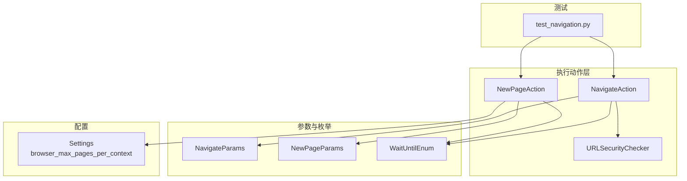
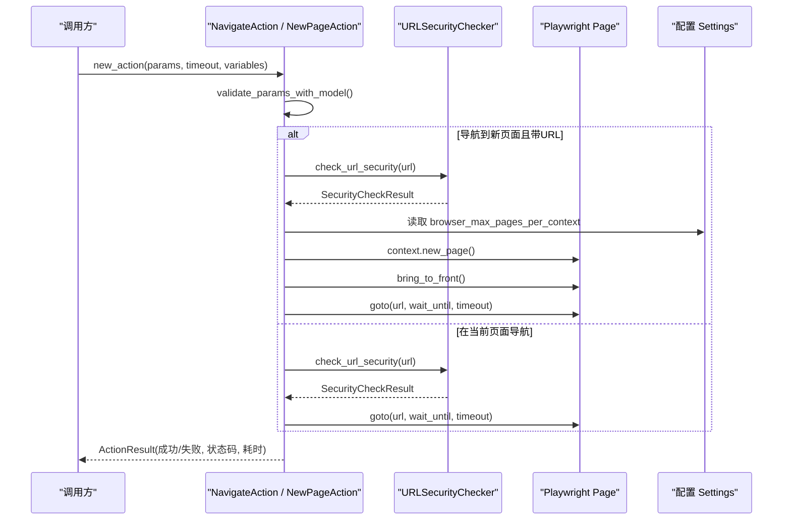
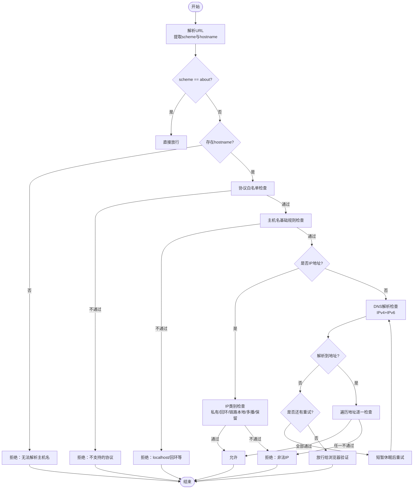
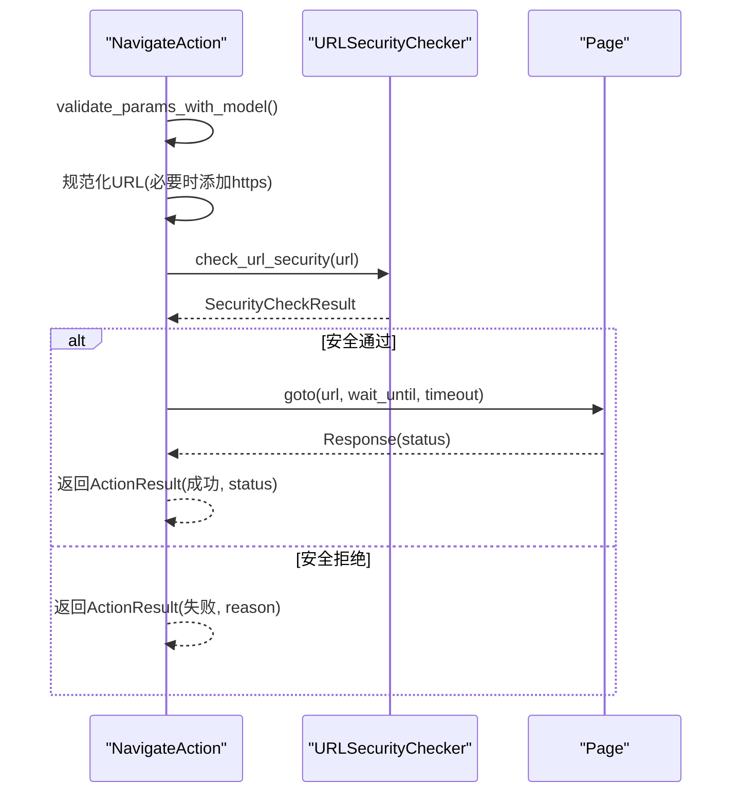
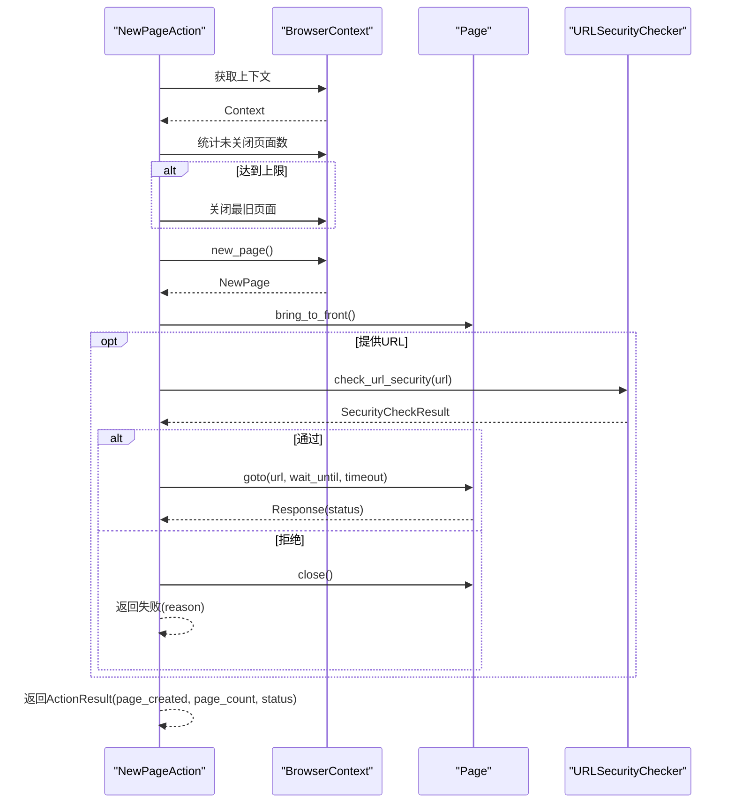
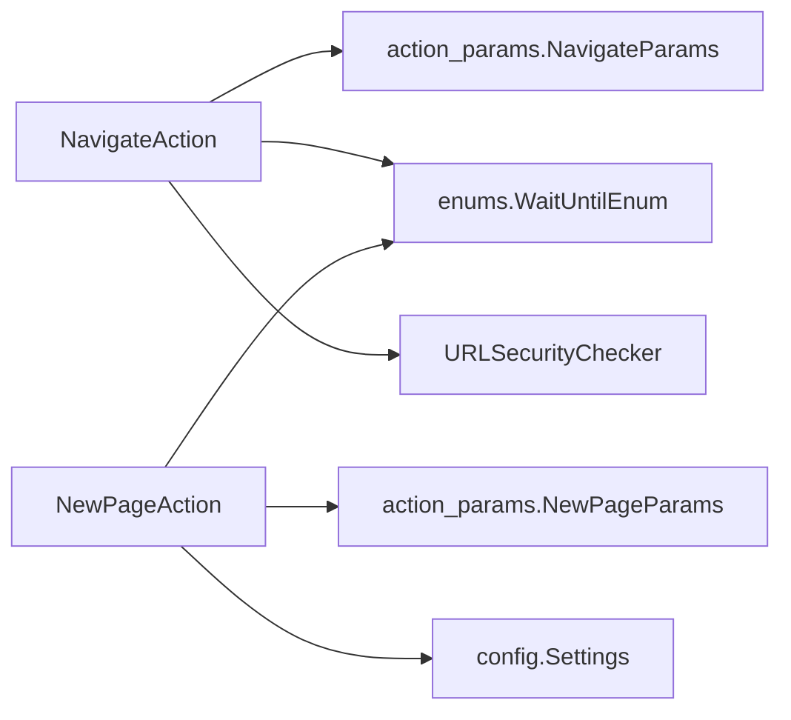

# 页面导航操作

<cite>
**本文引用的文件**
- [navigation.py](file://RPA-Browser/app/services/execution/actions/navigation.py)
- [action_params.py](file://RPA-Browser/app/models/execution/action_params.py)
- [enums.py](file://RPA-Browser/app/models/execution/enums.py)
- [config.py](file://RPA-Browser/app/config.py)
- [test_navigation.py](file://RPA-Browser/test/actions/test_navigation.py)
</cite>

## 目录
1. [简介](#简介)
2. [项目结构](#项目结构)
3. [核心组件](#核心组件)
4. [架构总览](#架构总览)
5. [详细组件分析](#详细组件分析)
6. [依赖关系分析](#依赖关系分析)
7. [性能考量](#性能考量)
8. [故障排查指南](#故障排查指南)
9. [结论](#结论)
10. [附录：使用示例与最佳实践](#附录使用示例与最佳实践)

## 简介
本技术文档聚焦于页面导航操作，深入解析 NavigateAction 与 NewPageAction 的实现机制，覆盖 URL 安全检查、协议验证、DNS 解析检查等安全策略；详述页面导航执行流程，包括 wait_until 策略配置、超时处理与错误重试机制；并文档化新建页面的生命周期管理（页面数量限制、内存优化、资源清理）。同时提供多场景导航示例与最佳实践，以及性能优化建议与故障排查指南。

## 项目结构
导航相关代码主要位于 RPA-Browser 模块的 execution actions 层，参数模型与枚举定义位于 models/execution，配置项集中在 config.py，测试用例在 test/actions。

图表来源
- [navigation.py:189-401](file://RPA-Browser/app/services/execution/actions/navigation.py#L189-L401)
- [action_params.py:251-267](file://RPA-Browser/app/models/execution/action_params.py#L251-L267)
- [enums.py:7-12](file://RPA-Browser/app/models/execution/enums.py#L7-L12)
- [config.py:196-198](file://RPA-Browser/app/config.py#L196-L198)
- [test_navigation.py:17-155](file://RPA-Browser/test/actions/test_navigation.py#L17-L155)

章节来源
- [navigation.py:189-401](file://RPA-Browser/app/services/execution/actions/navigation.py#L189-L401)
- [action_params.py:251-267](file://RPA-Browser/app/models/execution/action_params.py#L251-L267)
- [enums.py:7-12](file://RPA-Browser/app/models/execution/enums.py#L7-L12)
- [config.py:196-198](file://RPA-Browser/app/config.py#L196-L198)
- [test_navigation.py:17-155](file://RPA-Browser/test/actions/test_navigation.py#L17-L155)

## 核心组件
- URL 安全检查器：负责协议白名单、主机名规则、IP 地址类别校验与 DNS 解析检查，支持有限重试与异常兜底放行给浏览器进一步验证。
- 导航动作 NavigateAction：对传入 URL 进行格式修正与安全校验，调用底层 page.goto 完成导航，返回 HTTP 状态码。
- 新页动作 NewPageAction：在浏览器上下文中创建新页面，支持页面数量限制与自动回收最旧页面，可选导航到指定 URL，并激活新页面。
- 参数与枚举：NavigateParams/NewPageParams 定义导航与新页的参数；WaitUntilEnum 控制等待条件。
- 配置项：browser_max_pages_per_context 控制每个上下文的最大页面数。

章节来源
- [navigation.py:20-187](file://RPA-Browser/app/services/execution/actions/navigation.py#L20-L187)
- [navigation.py:189-401](file://RPA-Browser/app/services/execution/actions/navigation.py#L189-L401)
- [action_params.py:251-267](file://RPA-Browser/app/models/execution/action_params.py#L251-L267)
- [enums.py:7-12](file://RPA-Browser/app/models/execution/enums.py#L7-L12)
- [config.py:196-198](file://RPA-Browser/app/config.py#L196-L198)

## 架构总览
下图展示了从动作构造到执行的完整调用链，包括参数校验、URL 安全检查、浏览器导航与结果封装。

图表来源
- [navigation.py:189-401](file://RPA-Browser/app/services/execution/actions/navigation.py#L189-L401)
- [action_params.py:251-267](file://RPA-Browser/app/models/execution/action_params.py#L251-L267)
- [config.py:196-198](file://RPA-Browser/app/config.py#L196-L198)

## 详细组件分析

### URL 安全检查器 URLSecurityChecker
- 协议白名单：仅允许 http、https、about。
- 主机名基础规则：禁止 localhost 及其变体、回环地址。
- IP 地址检查：拒绝私有、回环、链路本地、多播、保留地址段。
- DNS 解析检查：尝试 IPv4/IPv6 解析，最多重试若干次；若解析失败或异常，记录原因并放行由浏览器继续验证。
- 统一返回 SecurityCheckResult，包含 allowed 标志与 reason。

图表来源
- [navigation.py:20-187](file://RPA-Browser/app/services/execution/actions/navigation.py#L20-L187)

章节来源
- [navigation.py:20-187](file://RPA-Browser/app/services/execution/actions/navigation.py#L20-L187)

### 导航动作 NavigateAction
- 参数校验：基于 NavigateParams 校验 url、wait_until、timeout。
- URL 格式修正：对缺少协议的域名自动补全 https://。
- 安全检查：调用 URLSecurityChecker 进行严格校验。
- 执行导航：调用 page.goto，传入 wait_until 与 timeout，返回响应状态码。
- 异常处理：捕获异常并记录堆栈，返回失败结果。

图表来源
- [navigation.py:189-276](file://RPA-Browser/app/services/execution/actions/navigation.py#L189-L276)

章节来源
- [navigation.py:189-276](file://RPA-Browser/app/services/execution/actions/navigation.py#L189-L276)

### 新页动作 NewPageAction
- 上下文获取：优先使用当前 page.context，否则 fallback 到 browser.new_page。
- 页面数量限制：统计未关闭页面数，超过上限时关闭最旧页面以释放资源。
- 创建与激活：创建新页面并 bring_to_front 激活。
- 可选导航：若提供 URL，则进行安全检查后执行 goto。
- 结果返回：返回是否创建成功、当前页面数及 HTTP 状态码（如有）。

图表来源
- [navigation.py:278-401](file://RPA-Browser/app/services/execution/actions/navigation.py#L278-L401)
- [config.py:196-198](file://RPA-Browser/app/config.py#L196-L198)

章节来源
- [navigation.py:278-401](file://RPA-Browser/app/services/execution/actions/navigation.py#L278-L401)
- [config.py:196-198](file://RPA-Browser/app/config.py#L196-L198)

### 参数与枚举
- NavigateParams：url、wait_until、timeout。
- NewPageParams：可选 url、wait_until、timeout。
- WaitUntilEnum：load、domcontentloaded、networkidle、commit。

章节来源
- [action_params.py:251-267](file://RPA-Browser/app/models/execution/action_params.py#L251-L267)
- [enums.py:7-12](file://RPA-Browser/app/models/execution/enums.py#L7-L12)

## 依赖关系分析
- NavigateAction/NewPageAction 依赖 action_params 中的参数模型与 enums 中的等待条件枚举。
- URLSecurityChecker 依赖标准库 socket/ipaddress 与异步睡眠实现 DNS 检查与重试。
- NewPageAction 依赖配置 settings.browser_max_pages_per_context 控制页面数量上限。
- 测试用例覆盖不同 wait_until 与无 URL 的新页场景。

图表来源
- [navigation.py:189-401](file://RPA-Browser/app/services/execution/actions/navigation.py#L189-L401)
- [action_params.py:251-267](file://RPA-Browser/app/models/execution/action_params.py#L251-L267)
- [enums.py:7-12](file://RPA-Browser/app/models/execution/enums.py#L7-L12)
- [config.py:196-198](file://RPA-Browser/app/config.py#L196-L198)

章节来源
- [navigation.py:189-401](file://RPA-Browser/app/services/execution/actions/navigation.py#L189-L401)
- [action_params.py:251-267](file://RPA-Browser/app/models/execution/action_params.py#L251-L267)
- [enums.py:7-12](file://RPA-Browser/app/models/execution/enums.py#L7-L12)
- [config.py:196-198](file://RPA-Browser/app/config.py#L196-L198)

## 性能考量
- 等待策略选择：
  - load：页面基本加载完成，适合大多数场景。
  - domcontentloaded：DOM 构建完成，适合需要快速交互的场景。
  - networkidle：网络空闲，适合确保所有资源加载完毕，但可能较慢。
  - commit：提交阶段，通常用于更细粒度控制。
- 超时设置：根据目标站点复杂度合理设置 timeout，避免过长阻塞。
- 页面数量限制：通过 browser_max_pages_per_context 控制上下文内最大页面数，防止内存膨胀。
- DNS 解析重试：内置有限重试，降低瞬时网络抖动影响。
- 日志与监控：记录执行时间与异常堆栈，便于定位瓶颈。

[本节为通用指导，无需特定文件引用]

## 故障排查指南
- 常见错误类型
  - 协议不被允许：检查 URL scheme 是否为 http/https/about。
  - 访问受限地址：如 localhost、回环地址、私有地址、链路本地、多播、保留地址将被拒绝。
  - DNS 解析失败：检查域名是否正确、网络连通性；系统会重试并记录原因。
  - 页面数量超限：达到上限后将自动关闭最旧页面；如需更多并发，考虑增加上下文或调整上限。
  - 超时：适当增大 timeout 或改用更快的 wait_until。
- 调试建议
  - 查看返回的 ActionResult 的 error 与 logs 字段，定位具体失败原因。
  - 使用测试用例中提供的 wait_until 组合验证行为差异。
  - 检查环境变量或配置文件中的 browser_max_pages_per_context 与实际运行环境是否匹配。

章节来源
- [navigation.py:20-187](file://RPA-Browser/app/services/execution/actions/navigation.py#L20-L187)
- [navigation.py:189-401](file://RPA-Browser/app/services/execution/actions/navigation.py#L189-L401)
- [config.py:196-198](file://RPA-Browser/app/config.py#L196-L198)
- [test_navigation.py:17-155](file://RPA-Browser/test/actions/test_navigation.py#L17-L155)

## 结论
NavigateAction 与 NewPageAction 提供了安全、可控的页面导航能力。通过严格的 URL 安全检查与 DNS 解析校验，有效规避不安全访问；通过 wait_until 与 timeout 的配置，满足不同场景的性能与稳定性需求；通过页面数量限制与自动回收，保障资源占用可控。结合测试用例与配置项，可在生产环境中稳定运行。

[本节为总结，无需特定文件引用]

## 附录：使用示例与最佳实践
- 单页应用导航
  - 使用 wait_until=domcontentloaded 提升交互速度，配合较短 timeout。
  - 参考测试用例中对不同 wait_until 的使用方式。
- 跨域访问
  - 确保目标域名可被 DNS 解析且不在受限地址范围内。
  - 如遇跨域限制，需在目标站点侧配置 CORS。
- 重定向处理
  - 导航成功后可通过返回的 HTTP 状态码判断重定向情况；如需最终落地页，可在后续步骤中读取当前页面 URL。
- 新建页面与并发
  - 合理设置 browser_max_pages_per_context，避免过多页面导致内存压力。
  - 在新建页面后尽快导航到目标地址，减少空页面驻留时间。
- 错误重试
  - 对于偶发网络问题，可在上层工作流中配置重试策略；导航内部已对 DNS 解析做了有限重试。

章节来源
- [test_navigation.py:17-155](file://RPA-Browser/test/actions/test_navigation.py#L17-L155)
- [config.py:196-198](file://RPA-Browser/app/config.py#L196-L198)