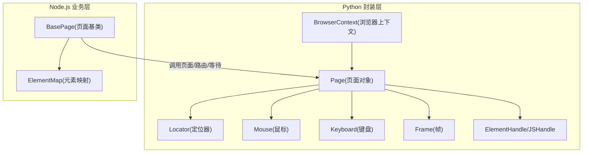
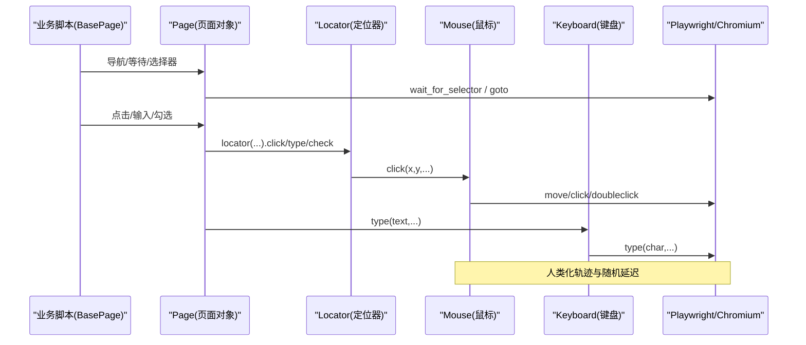
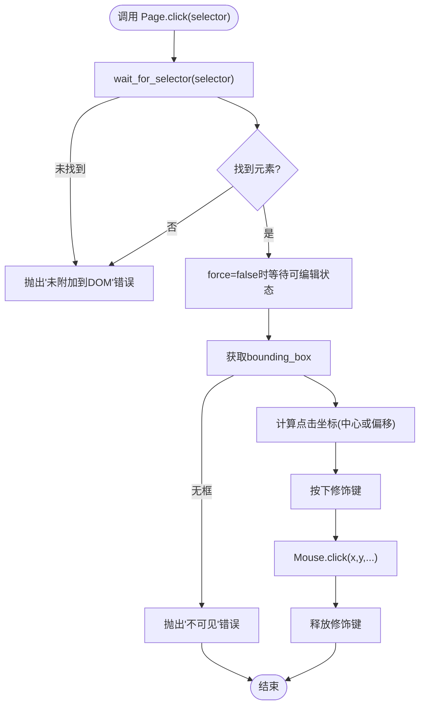
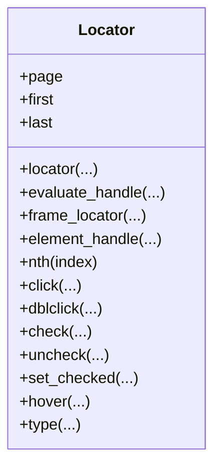
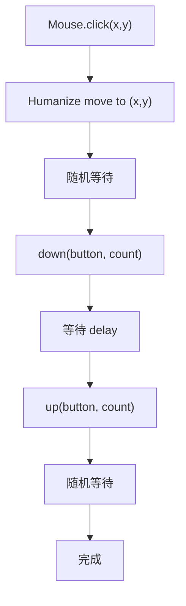
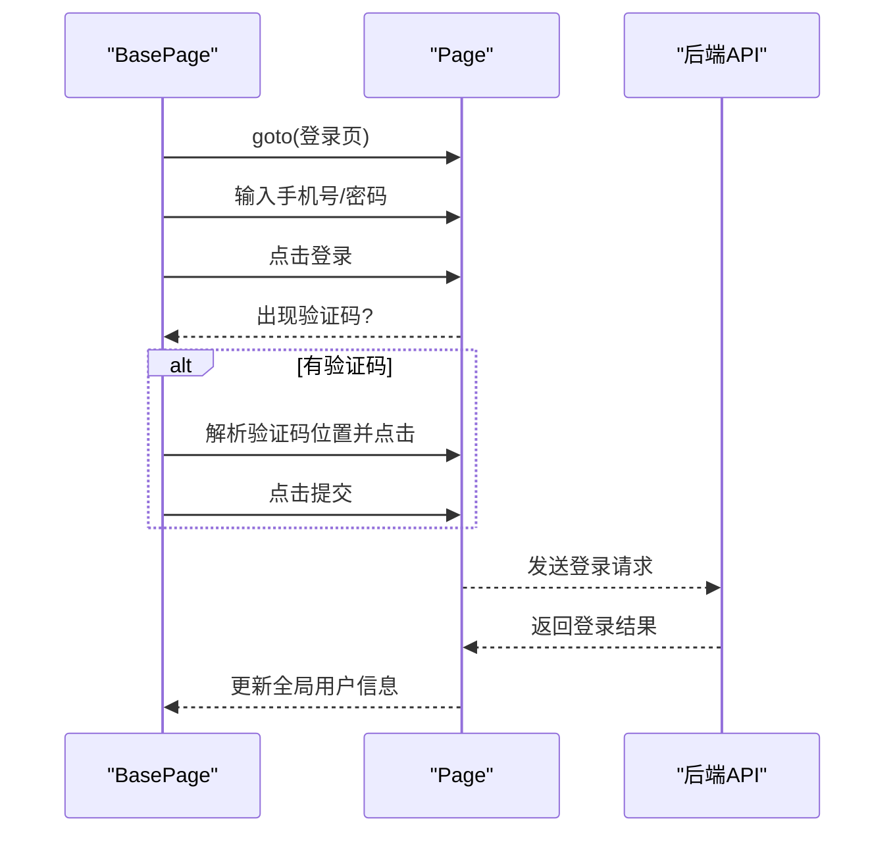
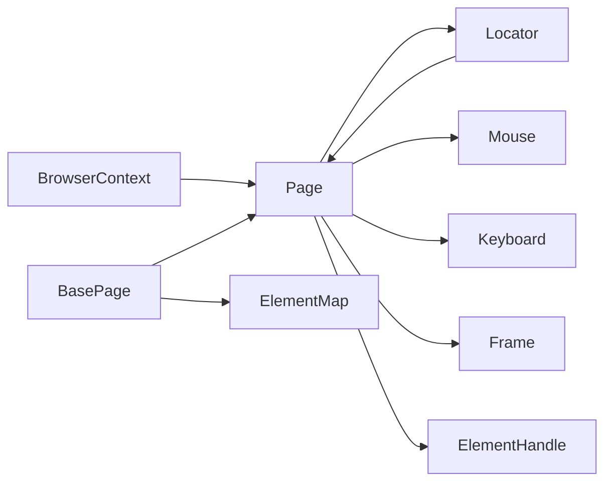

# 页面操作模拟

<cite>
**本文引用的文件**
- [page.py](file://RPA-Browser/botright/playwright_mock/page.py)
- [locator.py](file://RPA-Browser/botright/playwright_mock/locator.py)
- [browser.py](file://RPA-Browser/botright/playwright_mock/browser.py)
- [mouse.py](file://RPA-Browser/botright/playwright_mock/mouse.py)
- [keyboard.py](file://RPA-Browser/botright/playwright_mock/keyboard.py)
- [frame.py](file://RPA-Browser/botright/playwright_mock/frame.py)
- [handles.py](file://RPA-Browser/botright/playwright_mock/handles.py)
- [base_page.js](file://be-gateway/ExpressServerEnd/BiliPPTR/pages/bili_dynamic_page/base_page.js)
- [element_map.js](file://be-gateway/ExpressServerEnd/BiliPPTR/utils/element_map.js)
</cite>

## 目录
1. [简介](#简介)
2. [项目结构](#项目结构)
3. [核心组件](#核心组件)
4. [架构总览](#架构总览)
5. [详细组件分析](#详细组件分析)
6. [依赖关系分析](#依赖关系分析)
7. [性能考量](#性能考量)
8. [故障排查指南](#故障排查指南)
9. [结论](#结论)
10. [附录：最佳实践与示例路径](#附录：最佳实践与示例路径)

## 简介
本技术文档围绕“页面操作模拟模块”展开，聚焦于基于 Playwright 的页面导航、元素定位、用户交互（表单填写、按钮点击、键盘输入）、动态页面处理（等待策略、重试机制、错误处理）以及高级选择器使用（CSS、XPath、文本匹配）。文档同时结合仓库中的 Python 层封装（botright/playwright_mock）与 Node.js 层脚本（BiliPPTR），给出端到端的自动化流程说明与优化建议。

## 项目结构
该模块由两部分组成：
- Python 侧：对 Playwright 进行二次封装，提供人类化鼠标轨迹、统一的选择器与交互入口、CDP 指纹伪装、请求拦截与缓存等能力。
- Node.js 侧：面向 B 站页面的业务脚本，包含登录、响应监听、重试执行、元素选择器等。

图表来源
- [browser.py:23-95](file://RPA-Browser/botright/playwright_mock/browser.py#L23-L95)
- [page.py:82-168](file://RPA-Browser/botright/playwright_mock/page.py#L82-L168)
- [locator.py:15-113](file://RPA-Browser/botright/playwright_mock/locator.py#L15-L113)
- [mouse.py:165-249](file://RPA-Browser/botright/playwright_mock/mouse.py#L165-L249)
- [keyboard.py:13-29](file://RPA-Browser/botright/playwright_mock/keyboard.py#L13-L29)
- [frame.py:18-54](file://RPA-Browser/botright/playwright_mock/frame.py#L18-L54)
- [handles.py:15-36](file://RPA-Browser/botright/playwright_mock/handles.py#L15-L36)
- [base_page.js:15-148](file://be-gateway/ExpressServerEnd/BiliPPTR/pages/bili_dynamic_page/base_page.js#L15-L148)
- [element_map.js:1-75](file://be-gateway/ExpressServerEnd/BiliPPTR/utils/element_map.js#L1-L75)

章节来源
- [browser.py:23-95](file://RPA-Browser/botright/playwright_mock/browser.py#L23-L95)
- [page.py:82-168](file://RPA-Browser/botright/playwright_mock/page.py#L82-L168)
- [base_page.js:15-148](file://be-gateway/ExpressServerEnd/BiliPPTR/pages/bili_dynamic_page/base_page.js#L15-L148)
- [element_map.js:1-75](file://be-gateway/ExpressServerEnd/BiliPPTR/utils/element_map.js#L1-L75)

## 核心组件
- Page：扩展原生 Page，统一封装选择器、等待、点击、双击、勾选、悬停、类型输入等方法；支持 CDP 设置 UA/平台信息；支持 hCaptcha 求解。
- Locator：在 Page 之上提供更稳定的定位与交互，自动滚动到可视区域、可见性校验、修饰键组合点击。
- Mouse：实现人类化移动轨迹（贝塞尔曲线+扰动+缓动），降低被检测概率。
- Keyboard：打字时加入随机延迟，模拟真实输入节奏。
- Frame：对子帧/父帧的访问与操作进行包装，保持与 Page 一致的交互体验。
- ElementHandle/JSHandle：对元素句柄进行包装，保证跨帧/跨页的一致性。
- BrowserContext：持久化上下文创建、图片拦截、响应缓存、路由代理、全局事件监听等。

章节来源
- [page.py:82-168](file://RPA-Browser/botright/playwright_mock/page.py#L82-L168)
- [locator.py:15-113](file://RPA-Browser/botright/playwright_mock/locator.py#L15-L113)
- [mouse.py:165-249](file://RPA-Browser/botright/playwright_mock/mouse.py#L165-L249)
- [keyboard.py:13-29](file://RPA-Browser/botright/playwright_mock/keyboard.py#L13-L29)
- [frame.py:18-54](file://RPA-Browser/botright/playwright_mock/frame.py#L18-L54)
- [handles.py:15-36](file://RPA-Browser/botright/playwright_mock/handles.py#L15-L36)
- [browser.py:98-184](file://RPA-Browser/botright/playwright_mock/browser.py#L98-L184)

## 架构总览
下图展示从业务脚本到底层驱动的调用链：业务脚本通过 BasePage 组织任务，调用元素选择器与交互方法；Python 封装层负责将高层语义转化为具体的 DOM 操作与浏览器控制指令。

图表来源
- [page.py:631-683](file://RPA-Browser/botright/playwright_mock/page.py#L631-L683)
- [locator.py:114-156](file://RPA-Browser/botright/playwright_mock/locator.py#L114-L156)
- [mouse.py:181-229](file://RPA-Browser/botright/playwright_mock/mouse.py#L181-L229)
- [keyboard.py:21-29](file://RPA-Browser/botright/playwright_mock/keyboard.py#L21-L29)

## 详细组件分析

### Page：页面导航与交互中枢
- 导航与等待：封装 query_selector/wait_for_selector/add_script_tag 等，统一返回包装后的 ElementHandle。
- 选择器增强：get_by_* 系列方法均返回 Locator，便于链式操作。
- 交互增强：click/dblclick/check/uncheck 等方法在执行前会等待元素可编辑/可见，必要时滚动至可视区，并计算坐标后交由 Mouse 完成点击。
- CDP 伪装：初始化时可通过 CDP 覆盖 UA、平台、语言等，提升反爬对抗能力。
- 验证码：集成 hCaptcha 求解接口。

图表来源
- [page.py:631-683](file://RPA-Browser/botright/playwright_mock/page.py#L631-L683)

章节来源
- [page.py:82-168](file://RPA-Browser/botright/playwright_mock/page.py#L82-L168)
- [page.py:304-488](file://RPA-Browser/botright/playwright_mock/page.py#L304-L488)
- [page.py:631-800](file://RPA-Browser/botright/playwright_mock/page.py#L631-L800)

### Locator：稳定定位与交互
- 定位能力：支持嵌套 locator、first/last/nth、evaluate_handle、frame_locator、element_handle。
- 交互一致性：click/dblclick/check/uncheck/hover/type 等方法内部统一做可见性检查、滚动到可视区、坐标计算与修饰键处理。
- 容错：当 scroll_into_view 开启时自动滚动；若元素不在视口内则抛出明确错误。

图表来源
- [locator.py:15-113](file://RPA-Browser/botright/playwright_mock/locator.py#L15-L113)
- [locator.py:114-364](file://RPA-Browser/botright/playwright_mock/locator.py#L114-L364)

章节来源
- [locator.py:15-113](file://RPA-Browser/botright/playwright_mock/locator.py#L15-L113)
- [locator.py:114-364](file://RPA-Browser/botright/playwright_mock/locator.py#L114-L364)

### Mouse：人类化轨迹
- 轨迹生成：基于贝塞尔曲线与随机扰动，生成平滑且带抖动的移动点序列。
- 点击行为：move 到目标点后，按下、延时、抬起，配合随机等待，降低机器特征。
- 双击行为：直接调用底层 dblclick，并在前后插入随机等待。

图表来源
- [mouse.py:18-163](file://RPA-Browser/botright/playwright_mock/mouse.py#L18-L163)
- [mouse.py:181-229](file://RPA-Browser/botright/playwright_mock/mouse.py#L181-L229)

章节来源
- [mouse.py:18-163](file://RPA-Browser/botright/playwright_mock/mouse.py#L18-L163)
- [mouse.py:165-249](file://RPA-Browser/botright/playwright_mock/mouse.py#L165-L249)

### Keyboard：自然输入
- 逐字符输入，每字符延迟随机波动，末尾追加随机停顿，模拟人类打字节奏。

章节来源
- [keyboard.py:13-29](file://RPA-Browser/botright/playwright_mock/keyboard.py#L13-L29)

### Frame：多帧环境支持
- 提供 child_frames/parent_frame 访问，封装 query_selector/wait_for_selector/evaluate_handle 等，确保在 iframe 场景下与主页面一致的操作体验。
- 在 click/dblclick/check/uncheck/hover/type 中同样遵循“等待-可见-滚动-坐标-交互”的统一流程。

章节来源
- [frame.py:18-54](file://RPA-Browser/botright/playwright_mock/frame.py#L18-L54)
- [frame.py:204-564](file://RPA-Browser/botright/playwright_mock/frame.py#L204-L564)

### Handles：元素句柄包装
- JSHandle/ElementHandle 包装，统一 owner_frame/content_frame 返回 Frame 实例，避免裸句柄带来的不一致。
- 在 ElementHandle 上复用与 Page/Locator 一致的交互逻辑。

章节来源
- [handles.py:15-36](file://RPA-Browser/botright/playwright_mock/handles.py#L15-L36)
- [handles.py:34-364](file://RPA-Browser/botright/playwright_mock/handles.py#L34-L364)

### BrowserContext：上下文与资源管理
- 启动参数：根据指纹开关注入 locale、UA、时区、地理、视口、代理、忽略自动化标记等。
- 资源控制：支持 block_images 与 cache_responses，减少带宽与重复请求。
- 路由代理：统一包装 Route/Request，便于上层拦截与修改。
- 新页面：new_page 返回包装后的 Page，并清理初始空白页。

章节来源
- [browser.py:23-95](file://RPA-Browser/botright/playwright_mock/browser.py#L23-L95)
- [browser.py:98-184](file://RPA-Browser/botright/playwright_mock/browser.py#L98-L184)
- [browser.py:185-243](file://RPA-Browser/botright/playwright_mock/browser.py#L185-L243)

### Node.js 业务层：登录、监听与重试
- 登录流程：尝试密码登录，遇到验证码时解析背景图位置并点击，等待登录响应。
- 响应监听：拦截关键 API 响应，提取用户信息与业务数据，写入全局变量。
- 重试机制：executeWithRetry 对任务进行最大重试次数控制，失败时可刷新页面并重试。

图表来源
- [base_page.js:401-493](file://be-gateway/ExpressServerEnd/BiliPPTR/pages/bili_dynamic_page/base_page.js#L401-L493)
- [base_page.js:155-394](file://be-gateway/ExpressServerEnd/BiliPPTR/pages/bili_dynamic_page/base_page.js#L155-L394)
- [base_page.js:766-800](file://be-gateway/ExpressServerEnd/BiliPPTR/pages/bili_dynamic_page/base_page.js#L766-L800)

章节来源
- [base_page.js:155-394](file://be-gateway/ExpressServerEnd/BiliPPTR/pages/bili_dynamic_page/base_page.js#L155-L394)
- [base_page.js:401-493](file://be-gateway/ExpressServerEnd/BiliPPTR/pages/bili_dynamic_page/base_page.js#L401-L493)
- [base_page.js:766-800](file://be-gateway/ExpressServerEnd/BiliPPTR/pages/bili_dynamic_page/base_page.js#L766-L800)

## 依赖关系分析
- Page 依赖 Mouse、Keyboard、Frame、ElementHandle/JSHandle，并通过 BrowserContext 管理生命周期与资源。
- Locator 依赖 Page 以访问 mouse/keyboard 与滚动策略。
- Node.js 的 BasePage 通过 element_map 集中管理 CSS/XPath 选择器，降低耦合度。

图表来源
- [browser.py:98-184](file://RPA-Browser/botright/playwright_mock/browser.py#L98-L184)
- [page.py:82-168](file://RPA-Browser/botright/playwright_mock/page.py#L82-L168)
- [locator.py:15-113](file://RPA-Browser/botright/playwright_mock/locator.py#L15-L113)
- [element_map.js:1-75](file://be-gateway/ExpressServerEnd/BiliPPTR/utils/element_map.js#L1-L75)

章节来源
- [browser.py:98-184](file://RPA-Browser/botright/playwright_mock/browser.py#L98-L184)
- [page.py:82-168](file://RPA-Browser/botright/playwright_mock/page.py#L82-L168)
- [locator.py:15-113](file://RPA-Browser/botright/playwright_mock/locator.py#L15-L113)
- [element_map.js:1-75](file://be-gateway/ExpressServerEnd/BiliPPTR/utils/element_map.js#L1-L75)

## 性能考量
- 资源拦截：启用 block_images 可减少带宽与渲染开销；cache_responses 可复用静态资源，降低重复请求。
- 人类化交互：Mouse 轨迹与 Keyboard 随机延迟增加稳定性但引入少量耗时，建议在批量操作中合理批量化与并发控制。
- 等待策略：优先使用 wait_for_selector/wait_for_function 等显式等待，避免盲目 sleep；必要时结合网络空闲等待。
- 视口与滚动：scroll_into_view 可提升点击成功率，但频繁滚动可能影响性能，可按需关闭。

[本节为通用指导，不直接分析具体文件]

## 故障排查指南
- 元素未附加到 DOM：常见于过早操作，应使用 wait_for_selector 并确保 timeout 合理。
- 元素不可见：检查是否被遮挡或未进入视口，必要时启用 scroll_into_view 或调整 position。
- 网络异常：Node.js 层在网络错误时会休眠并重试，注意日志记录与降级策略。
- 验证码：hCaptcha 可通过 Page.solve_hcaptcha/get_hcaptcha 处理；Geetest 当前不可用。
- 路由冲突：BrowserContext.route 与 Page.route 的处理器签名不同，注意参数数量判断与代理包装。

章节来源
- [page.py:631-683](file://RPA-Browser/botright/playwright_mock/page.py#L631-L683)
- [locator.py:114-156](file://RPA-Browser/botright/playwright_mock/locator.py#L114-L156)
- [base_page.js:501-579](file://be-gateway/ExpressServerEnd/BiliPPTR/pages/bili_dynamic_page/base_page.js#L501-L579)
- [base_page.js:766-800](file://be-gateway/ExpressServerEnd/BiliPPTR/pages/bili_dynamic_page/base_page.js#L766-L800)

## 结论
本模块通过 Python 层对 Playwright 的深度封装与 Node.js 层的业务编排，实现了高鲁棒性的页面操作模拟。其核心优势包括：
- 统一的交互接口与强化的等待/可见性检查
- 人类化鼠标轨迹与自然输入节奏
- 灵活的请求拦截与缓存策略
- 完善的错误处理与重试机制
在实际使用中，建议结合业务场景选择合适的等待策略与资源拦截配置，以获得更好的稳定性与性能平衡。

[本节为总结性内容，不直接分析具体文件]

## 附录：最佳实践与示例路径
- 高级选择器
  - CSS/XPath：参考元素映射表，集中维护选择器，便于维护与替换。
  - 文本匹配：使用 get_by_text/get_by_label/get_by_placeholder 等语义化选择器。
  - 角色定位：get_by_role 用于无障碍友好的元素定位。
- 表单填写与按钮点击
  - 使用 Locator.type 进行输入，配合随机延迟；点击前确保元素可见并可编辑。
- 动态页面处理
  - 使用 wait_for_selector/wait_for_function 进行显式等待；必要时结合网络空闲等待。
  - 采用 executeWithRetry 进行任务级重试，失败时可选择刷新页面。
- 性能优化
  - 启用 block_images 与 cache_responses；合理设置 viewport 与缩放。
  - 控制并发与批处理，避免过多页面同时运行导致资源竞争。

章节来源
- [element_map.js:1-75](file://be-gateway/ExpressServerEnd/BiliPPTR/utils/element_map.js#L1-L75)
- [base_page.js:766-800](file://be-gateway/ExpressServerEnd/BiliPPTR/pages/bili_dynamic_page/base_page.js#L766-L800)
- [browser.py:156-184](file://RPA-Browser/botright/playwright_mock/browser.py#L156-L184)
- [page.py:367-488](file://RPA-Browser/botright/playwright_mock/page.py#L367-L488)
- [locator.py:114-364](file://RPA-Browser/botright/playwright_mock/locator.py#L114-L364)