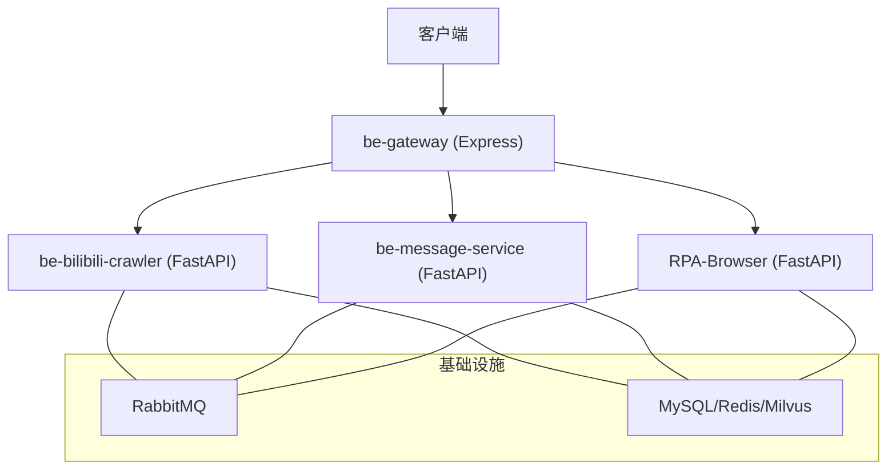
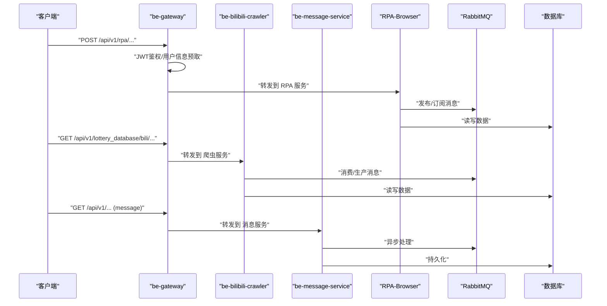
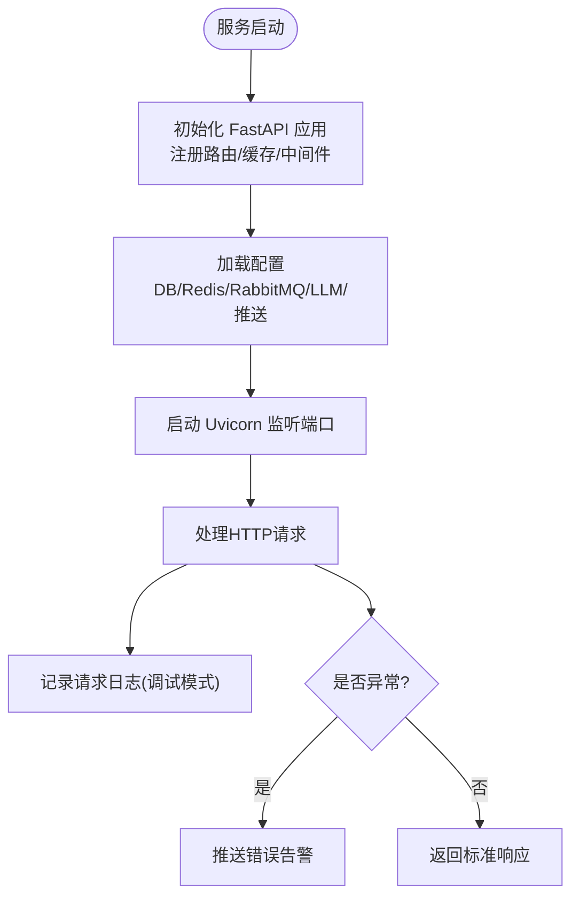
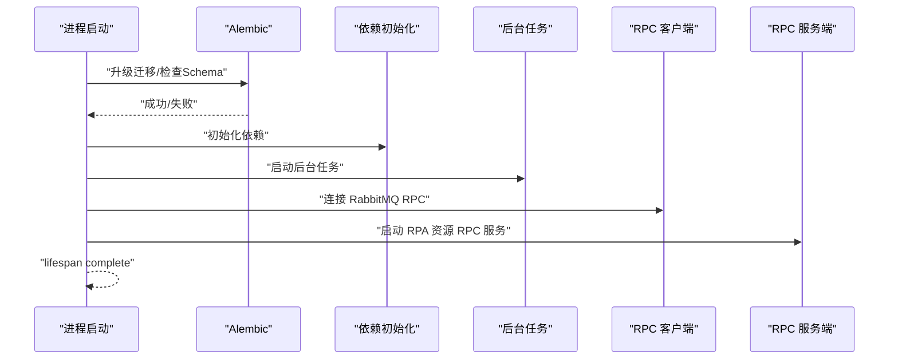
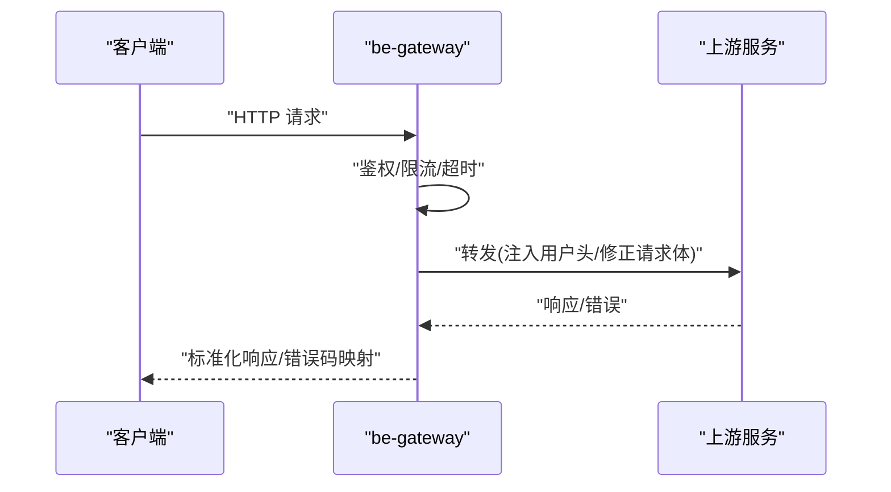
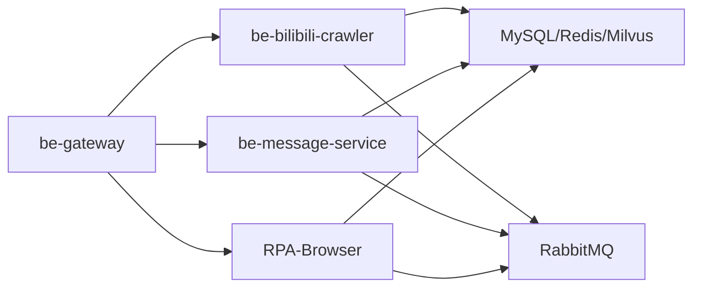

# 核心服务

<cite>
**本文引用的文件**
- [be-bilibili-crawler/main.py](file://be-bilibili-crawler/main.py)
- [be-bilibili-crawler/CONFIG.py](file://be-bilibili-crawler/CONFIG.py)
- [be-bilibili-crawler/controller/v1/background_service/BackgroundServiceController.py](file://be-bilibili-crawler/controller/v1/background_service/BackgroundServiceController.py)
- [RPA-Browser/main.py](file://RPA-Browser/main.py)
- [RPA-Browser/app/config.py](file://RPA-Browser/app/config.py)
- [RPA-Browser/app/routes.py](file://RPA-Browser/app/routes.py)
- [RPA-Browser/app/controller/v1/browser/__init__.py](file://RPA-Browser/app/controller/v1/browser/__init__.py)
- [be-gateway/index.js](file://be-gateway/index.js)
- [be-gateway/ExpressServerEnd/app.js](file://be-gateway/ExpressServerEnd/app.js)
- [be-gateway/ExpressServerEnd/routes/proxy.js](file://be-gateway/ExpressServerEnd/routes/proxy.js)
- [be-gateway/ExpressServerEnd/Controller/ProxyEndPort.js](file://be-gateway/ExpressServerEnd/Controller/ProxyEndPort.js)
</cite>

## 目录
1. [简介](#简介)
2. [项目结构](#项目结构)
3. [核心组件](#核心组件)
4. [架构总览](#架构总览)
5. [详细组件分析](#详细组件分析)
6. [依赖关系分析](#依赖关系分析)
7. [性能考量](#性能考量)
8. [故障排查指南](#故障排查指南)
9. [结论](#结论)
10. [附录](#附录)

## 简介
本技术文档围绕四个核心微服务进行系统化解析：
- be-bilibili-crawler：B站爬虫后端，提供数据采集、反爬策略、后台任务调度与消息队列集成。
- be-message-service：消息推送服务（在本仓库中作为被网关统一转发的目标服务），承载多渠道通知与异步处理。
- RPA-Browser：浏览器自动化服务，基于 Playwright 实现反检测与资源管理，并通过 RPC 与消息服务协作。
- be-gateway：API 网关，负责路由转发、认证授权、用户信息注入与上游错误映射。

文档将覆盖各服务的启动流程、配置选项、API 接口与使用示例，并提供架构图、时序图与流程图帮助理解。

## 项目结构
整体采用多语言多服务架构：
- Python FastAPI 服务：be-bilibili-crawler、RPA-Browser、be-message-service（由网关统一代理）。
- Node.js Express 网关：be-gateway，集中对外暴露 /api/v1 等路径并转发至上游服务。
- 共享库：bili-common（跨服务复用模型、异常、RPC 等能力）。

**图表来源**
- [be-gateway/ExpressServerEnd/Controller/ProxyEndPort.js:24-162](file://be-gateway/ExpressServerEnd/Controller/ProxyEndPort.js#L24-L162)
- [be-bilibili-crawler/main.py:48-60](file://be-bilibili-crawler/main.py#L48-L60)
- [RPA-Browser/main.py:36-74](file://RPA-Browser/main.py#L36-L74)

**章节来源**
- [be-gateway/ExpressServerEnd/app.js:12-117](file://be-gateway/ExpressServerEnd/app.js#L12-L117)
- [be-gateway/ExpressServerEnd/Controller/ProxyEndPort.js:24-162](file://be-gateway/ExpressServerEnd/Controller/ProxyEndPort.js#L24-L162)

## 核心组件
- be-bilibili-crawler
  - 启动入口：FastAPI 应用装配、中间件、全局异常处理、缓存初始化、路由注册。
  - 配置中心：集中式 Settings（数据库、缓存、RabbitMQ、LLM、代理、推送渠道等）。
  - 后台任务：定时任务调度器、状态查询、启停控制。
- RPA-Browser
  - 启动生命周期：Alembic 迁移、依赖初始化、后台任务、RPC 客户端与服务端。
  - 路由组织：按功能域划分（browser、browser_control、admin），统一异常处理。
  - 运行模式：支持浏览器会话清理、页面数量限制、WebRTC 空闲超时、工作流嵌套深度限制等。
- be-gateway
  - 安全与中间件：Helmet、CORS、超时、JWT 鉴权、限流。
  - 路由与代理：对多个上游服务进行反向代理，注入用户头、处理错误码映射。
  - 统一错误：将上游网络错误映射为 502/504，业务错误保持 HTTP 200 并以 body.code 区分。

**章节来源**
- [be-bilibili-crawler/main.py:48-112](file://be-bilibili-crawler/main.py#L48-L112)
- [be-bilibili-crawler/CONFIG.py:225-277](file://be-bilibili-crawler/CONFIG.py#L225-L277)
- [be-bilibili-crawler/controller/v1/background_service/BackgroundServiceController.py:44-274](file://be-bilibili-crawler/controller/v1/background_service/BackgroundServiceController.py#L44-L274)
- [RPA-Browser/main.py:36-74](file://RPA-Browser/main.py#L36-L74)
- [RPA-Browser/app/routes.py:20-48](file://RPA-Browser/app/routes.py#L20-L48)
- [RPA-Browser/app/config.py:140-215](file://RPA-Browser/app/config.py#L140-L215)
- [be-gateway/ExpressServerEnd/app.js:82-117](file://be-gateway/ExpressServerEnd/app.js#L82-L117)
- [be-gateway/ExpressServerEnd/Controller/ProxyEndPort.js:24-162](file://be-gateway/ExpressServerEnd/Controller/ProxyEndPort.js#L24-L162)

## 架构总览
网关作为统一入口，根据路径将请求转发到不同上游服务；上游服务通过 RabbitMQ 与数据库交互，部分服务还通过 gRPC/RPC 进行内部通信。

**图表来源**
- [be-gateway/ExpressServerEnd/Controller/ProxyEndPort.js:24-162](file://be-gateway/ExpressServerEnd/Controller/ProxyEndPort.js#L24-L162)
- [be-bilibili-crawler/CONFIG.py:422-432](file://be-bilibili-crawler/CONFIG.py#L422-L432)
- [RPA-Browser/main.py:53-57](file://RPA-Browser/main.py#L53-L57)

## 详细组件分析

### be-bilibili-crawler（爬虫后端）
- 启动流程
  - 安装 uvloop（非 Windows）或设置 WindowsProactor 事件循环策略。
  - 创建 FastAPI 应用，挂载 CDN 文档补丁，注册各模块路由，初始化内存缓存。
  - 定义全局 HTTP 中间件记录请求耗时与详情（调试模式），并注册全局异常处理器，统一返回标准响应并推送告警。
- 配置选项
  - 数据库连接池（业务与爬虫隔离）、Redis、RabbitMQ、代理、向量数据库、LLM API、推送渠道等。
  - 第三方动态获取并发度、时间范围、默认用户列表等参数。
- 核心功能
  - 后台任务调度：查询/启动/停止/重启指定爬虫服务，查看全局调度器状态与执行信息。
  - 代理状态查询、IP 信息查询、验证码生成、SamsClub 抓取、专栏数据等。
- API 接口（示例）
  - 获取代理状态：GET /proxy/status
  - 全局定时任务：GET /global_jobs
  - 后台服务状态：GET /background_service_status
  - 启动/停止/重启服务：POST /start_service, /stop_service, /restart_service
  - 全局调度器详细状态：GET /global_scheduler_status
- 使用示例
  - 通过网关转发调用：curl -X POST http://gateway/api/v1/background_service/start_service?background_service_name=xxx
  - 直接访问：curl http://crawler:23333/global_scheduler_status

**图表来源**
- [be-bilibili-crawler/main.py:48-112](file://be-bilibili-crawler/main.py#L48-L112)
- [be-bilibili-crawler/CONFIG.py:225-277](file://be-bilibili-crawler/CONFIG.py#L225-L277)

**章节来源**
- [be-bilibili-crawler/main.py:48-112](file://be-bilibili-crawler/main.py#L48-L112)
- [be-bilibili-crawler/CONFIG.py:225-277](file://be-bilibili-crawler/CONFIG.py#L225-L277)
- [be-bilibili-crawler/controller/v1/background_service/BackgroundServiceController.py:44-274](file://be-bilibili-crawler/controller/v1/background_service/BackgroundServiceController.py#L44-L274)

### RPA-Browser（浏览器自动化）
- 启动流程
  - 平台事件循环适配（Windows 兼容）。
  - Alembic 自动迁移与 Schema 一致性检查。
  - 初始化依赖、启动后台任务、连接 RabbitMQ RPC 客户端、启动 RPA 资源 RPC 服务端。
- 配置选项
  - 运行模式、控制器基础路径、Chromium 可执行目录、JWT 算法与过期时间、代理地址、GitHub 镜像源、RabbitMQ 连接、管理员路径、审批开关、浏览器会话清理策略、页面数量限制、WebRTC 空闲超时、工作流嵌套深度、操作日志采集策略等。
- 路由组织
  - 按功能域注册路由：browser（指纹/通知/默认设置）、browser_control（运行时控制）、admin（系统管理）。
  - 统一异常处理：HTTP 异常、验证异常、自定义业务异常、数据库连接异常、全局异常。
- 使用示例
  - 通过网关转发：curl -X GET http://gateway/api/v1/rpa/fingerprint
  - 直接访问：curl http://rpa:28000/api/v1/rpa/fingerprint

**图表来源**
- [RPA-Browser/main.py:36-74](file://RPA-Browser/main.py#L36-L74)

**章节来源**
- [RPA-Browser/main.py:36-74](file://RPA-Browser/main.py#L36-L74)
- [RPA-Browser/app/routes.py:20-48](file://RPA-Browser/app/routes.py#L20-L48)
- [RPA-Browser/app/config.py:140-215](file://RPA-Browser/app/config.py#L140-L215)
- [RPA-Browser/app/controller/v1/browser/__init__.py:1-19](file://RPA-Browser/app/controller/v1/browser/__init__.py#L1-L19)

### be-gateway（API 网关）
- 启动流程
  - 加载环境变量与安全中间件（Helmet、CORS、超时）。
  - 注册 JWT 鉴权、路由（用户、Casdoor、Ping、代理）。
  - 统一错误处理：权限错误、未登录、超时、上游错误映射为 502/504。
- 路由与转发
  - 对 /api/v1/lottery_database/bili、/api/v1/samsClub/graphql、/api/v1/rpa、/api/admin/rpa、/api/v1/casdoor/backend、/api/v1/casdoor/callback、/api/v1（消息服务）等进行反向代理。
  - 注入用户头（x-bili-*）、修正请求体、设置超时与 WebSocket 支持。
- 使用示例
  - 访问消息服务：curl http://gateway/api/v1/message/...
  - 访问 RPA：curl -X POST http://gateway/api/v1/rpa/execution/...
  - 访问抽奖数据：curl http://gateway/api/v1/lottery_database/bili/...

**图表来源**
- [be-gateway/ExpressServerEnd/app.js:82-117](file://be-gateway/ExpressServerEnd/app.js#L82-L117)
- [be-gateway/ExpressServerEnd/Controller/ProxyEndPort.js:24-162](file://be-gateway/ExpressServerEnd/Controller/ProxyEndPort.js#L24-L162)

**章节来源**
- [be-gateway/ExpressServerEnd/app.js:82-185](file://be-gateway/ExpressServerEnd/app.js#L82-L185)
- [be-gateway/ExpressServerEnd/routes/proxy.js:1-12](file://be-gateway/ExpressServerEnd/routes/proxy.js#L1-L12)
- [be-gateway/ExpressServerEnd/Controller/ProxyEndPort.js:24-162](file://be-gateway/ExpressServerEnd/Controller/ProxyEndPort.js#L24-L162)

## 依赖关系分析
- be-bilibili-crawler
  - 依赖 MySQL、Redis、RabbitMQ、Milvus、LLM 服务、代理服务器。
  - 通过 FastAPI 路由暴露后台任务管理与数据查询接口。
- RPA-Browser
  - 依赖 MySQL、RabbitMQ（RPC）、Chromium/Playwright、JWT 鉴权。
  - 通过路由组织浏览器配置、运行时控制与管理接口。
- be-gateway
  - 依赖上游服务：be-bilibili-crawler、be-message-service、RPA-Browser。
  - 依赖 Casdoor 用于 OAuth 回调转发。

**图表来源**
- [be-gateway/ExpressServerEnd/Controller/ProxyEndPort.js:24-162](file://be-gateway/ExpressServerEnd/Controller/ProxyEndPort.js#L24-L162)
- [be-bilibili-crawler/CONFIG.py:422-432](file://be-bilibili-crawler/CONFIG.py#L422-L432)
- [RPA-Browser/main.py:53-57](file://RPA-Browser/main.py#L53-L57)

**章节来源**
- [be-bilibili-crawler/CONFIG.py:422-432](file://be-bilibili-crawler/CONFIG.py#L422-L432)
- [RPA-Browser/main.py:53-57](file://RPA-Browser/main.py#L53-L57)
- [be-gateway/ExpressServerEnd/Controller/ProxyEndPort.js:24-162](file://be-gateway/ExpressServerEnd/Controller/ProxyEndPort.js#L24-L162)

## 性能考量
- 连接池与超时
  - 爬虫服务为业务与爬虫分别配置独立 SQLAlchemy 连接池，避免高并发爬虫占用业务连接。
  - 网关对上游请求设置合理超时（如 RPA 长耗时设置为 180s），避免阻塞。
- 缓存与异步
  - 爬虫服务启用内存缓存（fastapi-cache）减少重复计算。
  - 消息服务通过 RabbitMQ 异步处理通知与事件，提升吞吐。
- 资源限制
  - RPA 服务限制每个上下文页面数、WebRTC 空闲超时与工作流嵌套深度，防止资源耗尽。
- 日志与监控
  - 爬虫服务在调试模式下记录请求耗时与详情；网关在开发环境打印请求日志便于定位。

[本节为通用指导，不直接分析具体文件]

## 故障排查指南
- 爬虫服务异常
  - 全局异常处理器会记录请求 URL、方法、客户端 IP 并推送告警；检查日志与推送消息定位问题。
  - 后台任务状态接口可用于确认调度器是否运行及任务执行情况。
- RPA 服务异常
  - 启动时若 Alembic 迁移失败或 Schema 不一致，会抛出运行时错误；检查数据库连接与迁移脚本。
  - 路由层统一异常处理器会将数据库连接异常转换为友好响应。
- 网关异常
  - 上游不可达或响应无效会被映射为 502；超时映射为 504；业务错误保持 HTTP 200 并在 body.code 中体现。
  - 检查代理配置、目标服务可达性与超时设置。

**章节来源**
- [be-bilibili-crawler/main.py:94-112](file://be-bilibili-crawler/main.py#L94-L112)
- [be-bilibili-crawler/controller/v1/background_service/BackgroundServiceController.py:209-274](file://be-bilibili-crawler/controller/v1/background_service/BackgroundServiceController.py#L209-L274)
- [RPA-Browser/main.py:41-46](file://RPA-Browser/main.py#L41-L46)
- [RPA-Browser/app/routes.py:35-48](file://RPA-Browser/app/routes.py#L35-L48)
- [be-gateway/ExpressServerEnd/app.js:119-185](file://be-gateway/ExpressServerEnd/app.js#L119-L185)

## 结论
四个核心服务通过网关统一对外暴露，形成清晰的前后端分离与职责边界：
- 爬虫服务专注数据采集与后台任务调度，具备完善的配置与监控能力。
- RPA 服务提供浏览器自动化与资源管理，结合 RPC 与消息队列实现高效协作。
- 网关承担鉴权、路由与错误映射，保障一致的用户体验与稳定性。
- 消息服务作为统一的消息与通知中枢，支撑多渠道推送与异步处理。

建议在生产环境中：
- 严格配置连接池与超时，避免资源争用与长时间阻塞。
- 启用必要的监控与告警，及时发现问题。
- 定期审查迁移脚本与 Schema 一致性，确保服务稳定运行。

[本节为总结性内容，不直接分析具体文件]

## 附录
- 常用命令示例
  - 启动爬虫服务：python main.py（监听 23333）
  - 启动 RPA 服务：uvicorn main:app --host 0.0.0.0 --port 28000
  - 通过网关访问：http://gateway/api/v1/...
- 关键配置项
  - 爬虫服务：数据库、Redis、RabbitMQ、LLM、代理、推送渠道等。
  - RPA 服务：运行模式、JWT、代理、RabbitMQ、浏览器会话策略、工作流限制等。
  - 网关：超时、CORS、JWT、代理目标地址、错误映射等。

[本节为补充信息，不直接分析具体文件]