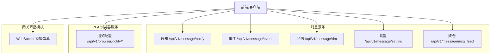
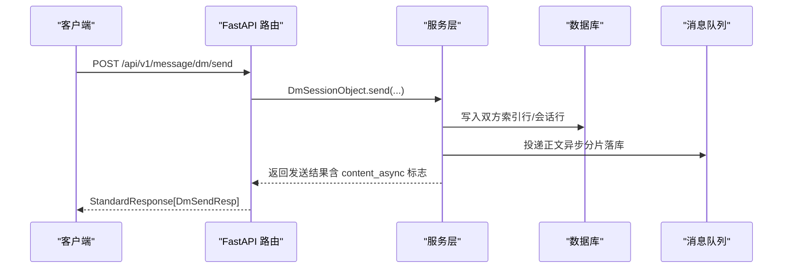
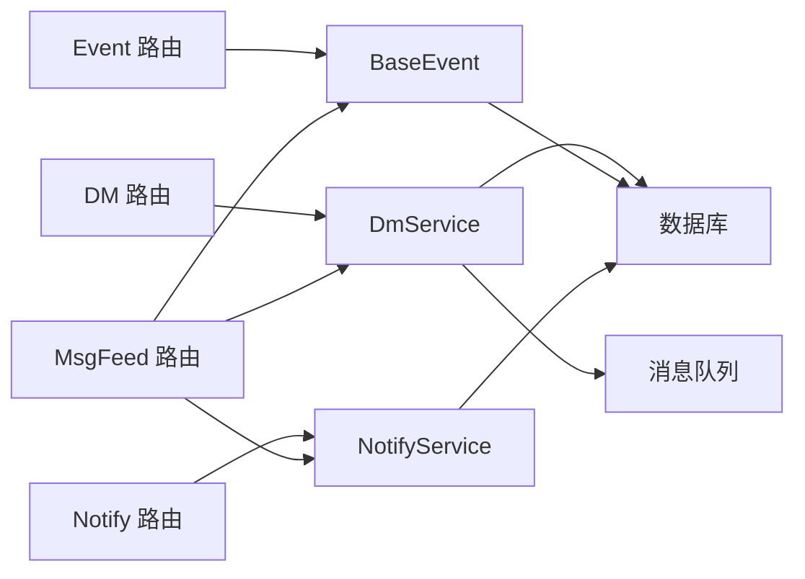

# API 接口参考

<cite>
**本文引用的文件**
- [be-message-service/app/api/notify.py](file://be-message-service/app/api/notify.py)
- [be-message-service/app/api/dm.py](file://be-message-service/app/api/dm.py)
- [be-message-service/app/api/event.py](file://be-message-service/app/api/event.py)
- [be-message-service/app/api/setting.py](file://be-message-service/app/api/setting.py)
- [be-message-service/app/api/msg_feed.py](file://be-message-service/app/api/msg_feed.py)
- [RPA-Browser/app/controller/v1/browser/message_router.py](file://RPA-Browser/app/controller/v1/browser/message_router.py)
- [RPA-Browser/app/controller/v1/browser/base.py](file://RPA-Browser/app/controller/v1/browser/base.py)
- [be-gateway/直播模块/live_dm_server.js](file://be-gateway/直播模块/live_dm_server.js)
</cite>

## 目录
1. [简介](#简介)
2. [项目结构](#项目结构)
3. [核心组件](#核心组件)
4. [架构总览](#架构总览)
5. [详细组件分析](#详细组件分析)
6. [依赖关系分析](#依赖关系分析)
7. [性能与扩展性](#性能与扩展性)
8. [故障排查指南](#故障排查指南)
9. [结论](#结论)
10. [附录：版本管理与兼容性](#附录：版本管理与兼容性)

## 简介
本参考文档面向消息系统相关的所有 RESTful 接口，覆盖系统通知、事件提醒、私信、消息设置等模块；同时补充浏览器侧推送通知配置接口与直播弹幕 WebSocket 接口。文档包含每个接口的 HTTP 方法、URL、请求参数、响应格式、错误码、认证方式、权限控制、请求/响应示例、最佳实践与兼容性说明。

## 项目结构
- 消息服务（be-message-service）提供统一的消息能力：通知、事件、私信、设置、聚合入口。
- RPA 浏览器服务（RPA-Browser）提供浏览器实例的通知配置管理（创建/读取/删除/测试）。
- 网关直播模块（be-gateway）提供直播弹幕的 WebSocket 通信。

**图示来源**
- [be-message-service/app/api/notify.py:40-216](file://be-message-service/app/api/notify.py#L40-L216)
- [be-message-service/app/api/event.py:31-161](file://be-message-service/app/api/event.py#L31-L161)
- [be-message-service/app/api/dm.py:45-207](file://be-message-service/app/api/dm.py#L45-L207)
- [be-message-service/app/api/setting.py:21-61](file://be-message-service/app/api/setting.py#L21-L61)
- [be-message-service/app/api/msg_feed.py:23-65](file://be-message-service/app/api/msg_feed.py#L23-L65)
- [RPA-Browser/app/controller/v1/browser/message_router.py:31-302](file://RPA-Browser/app/controller/v1/browser/message_router.py#L31-L302)
- [be-gateway/直播模块/live_dm_server.js:27-72](file://be-gateway/直播模块/live_dm_server.js#L27-L72)

**章节来源**
- [be-message-service/app/api/notify.py:40-216](file://be-message-service/app/api/notify.py#L40-L216)
- [be-message-service/app/api/event.py:31-161](file://be-message-service/app/api/event.py#L31-L161)
- [be-message-service/app/api/dm.py:45-207](file://be-message-service/app/api/dm.py#L45-L207)
- [be-message-service/app/api/setting.py:21-61](file://be-message-service/app/api/setting.py#L21-L61)
- [be-message-service/app/api/msg_feed.py:23-65](file://be-message-service/app/api/msg_feed.py#L23-L65)
- [RPA-Browser/app/controller/v1/browser/message_router.py:31-302](file://RPA-Browser/app/controller/v1/browser/message_router.py#L31-L302)
- [be-gateway/直播模块/live_dm_server.js:27-72](file://be-gateway/直播模块/live_dm_server.js#L27-L72)

## 核心组件
- 系统通知：支持管理员发布/修改/撤回/列表，用户侧拉取增量、分页历史、未读数、B站风格系统通知列表。
- 事件提醒：上报点赞/回复/@事件，聚合展示、明细列表、已读标记、删除、各类型未读数。
- 私信：发送、会话列表、聊天记录、删除/撤回、已读、未读总数。
- 消息设置：获取/更新消息开关与免打扰时段，查看活跃度快照。
- 聚合入口：一次汇总所有模块未读数，活跃心跳上报。
- 浏览器通知配置：创建/读取/删除/测试推送通知。
- 直播弹幕 WebSocket：连接后按房间号收发弹幕消息。

**章节来源**
- [be-message-service/app/api/notify.py:40-216](file://be-message-service/app/api/notify.py#L40-L216)
- [be-message-service/app/api/event.py:31-161](file://be-message-service/app/api/event.py#L31-L161)
- [be-message-service/app/api/dm.py:45-207](file://be-message-service/app/api/dm.py#L45-L207)
- [be-message-service/app/api/setting.py:21-61](file://be-message-service/app/api/setting.py#L21-L61)
- [be-message-service/app/api/msg_feed.py:23-65](file://be-message-service/app/api/msg_feed.py#L23-L65)
- [RPA-Browser/app/controller/v1/browser/message_router.py:31-302](file://RPA-Browser/app/controller/v1/browser/message_router.py#L31-L302)
- [be-gateway/直播模块/live_dm_server.js:27-72](file://be-gateway/直播模块/live_dm_server.js#L27-L72)

## 架构总览
消息系统采用“路由层 + 服务层”分层设计，HTTP 路由负责鉴权、参数校验与响应封装，业务逻辑下沉至服务层。部分写操作通过 MQ 异步落库或投递，保证高吞吐与低延迟。

**图示来源**
- [be-message-service/app/api/dm.py:58-83](file://be-message-service/app/api/dm.py#L58-L83)

**章节来源**
- [be-message-service/app/api/dm.py:58-83](file://be-message-service/app/api/dm.py#L58-L83)

## 详细组件分析

### 系统通知（/api/v1/message/notify）
- 认证与权限
  - 普通用户：RequiredUser（由网关注入 x-bili-* 头）。
  - 管理员：AdminUser（仅 root），用于发布/修改/撤回/列表。
- 接口清单
  - GET /pull：定时拉取增量通知（游标语义，自动推进游标，读取即已读）。
  - GET /list：分页历史通知（不推进游标，返回前本页置为已读）。
  - GET /unread：未读数。
  - GET /system：模仿 B 站 system_notify/get 的结构返回。
  - POST /delete：仅管理员，逐用户软删指定通知。
  - POST /admin/create：管理员发布通知（支持草稿/定时发布）。
  - POST /admin/update/{notify_id}：管理员修改。
  - POST /admin/revoke/{notify_id}：管理员撤回。
  - GET /admin/list：管理员列表（支持状态筛选）。
- 请求/响应要点
  - 请求体/查询参数见各端点定义（如 cursor/limit/page_num/page_size/status）。
  - 响应统一 StandardResponse[data=具体模型]。
- 错误码
  - 400：参数非法（如 notify_ids 为空）。
  - 404：资源不存在（如通知 ID 不存在）。
  - 5xx：服务端异常。
- 示例
  - 拉取增量：GET /api/v1/message/notify?cursor=0&limit=20 → {code,msg,data:{items,total,unread_count,...}}
  - 管理员发布：POST /api/v1/message/notify/admin/create → {code,msg,data:{...NotifyAdminItem}}

**章节来源**
- [be-message-service/app/api/notify.py:40-216](file://be-message-service/app/api/notify.py#L40-L216)

### 事件提醒（/api/v1/message/event）
- 认证与权限
  - 上报接口面向内部服务调用（不要求登录态），mid 由请求体指定。
  - 其他接口需要 RequiredUser。
- 接口清单
  - POST /report：上报互动事件（幂等去重、消息设置闸门、活跃度分流）。
  - GET /aggregate：聚合卡片列表（消息中心首页）。
  - GET /list：B 站式聚合列表（带 latest/total/unread_count）。
  - POST /read：标记已读（id/类型/分组粒度）。
  - POST /delete：删除提醒。
  - GET /unread：各类型未读数（like/reply/at/total）。
- 请求/响应要点
  - 上报需携带 event_type、source_type、source_id、receiver_mid 等字段。
  - 列表支持 event_type、cursor_id、page_size、only_unread。
- 错误码
  - 400：参数非法（如 event_ids 为空）。
  - 5xx：服务端异常。
- 示例
  - 上报：POST /api/v1/message/event/report → {code,msg,data:{duplicated?:bool}}
  - 聚合列表：GET /api/v1/message/event/aggregate?page_num=1&page_size=20 → {code,msg,data:{items,total,...}}

**章节来源**
- [be-message-service/app/api/event.py:31-161](file://be-message-service/app/api/event.py#L31-L161)

### 私信（/api/v1/message/dm）
- 认证与权限
  - 全部接口需要 RequiredUser。
  - 发送前会检查是否被禁止私信功能。
- 接口清单
  - POST /send：发送私信（写扩散，正文异步落分片）。
  - GET /sessions：会话列表（可拆陌生人分组）。
  - POST /session/delete：删除会话（仅自己不可见）。
  - GET /messages：聊天记录（msgkey 游标翻页，正文来自月度分库分表）。
  - POST /delete：删除消息（仅自己视角）。
  - POST /recall：撤回消息（双方不可见 + 物理抹掉正文，受时间窗口限制）。
  - POST /ack：标记会话已读（未读清零并抬高已读水位）。
  - GET /unread：私信未读总数。
- 请求/响应要点
  - msgkey 以字符串传输（避免 JS 精度丢失）。
  - 发送失败时可能返回 filtered=true（对方关闭陌生人私信）。
- 错误码
  - 400：参数非法（如 msgkeys 为空或格式非法）。
  - 403：账号被封禁私信功能。
  - 500：发送失败。
- 示例
  - 发送：POST /api/v1/message/dm/send → {code,msg,data:{content_async?:bool,...}}
  - 聊天记录：GET /api/v1/message/dm/messages?talker_mid=xxx&cursor=yyy&page_size=20 → {code,msg,data:{...}}

**章节来源**
- [be-message-service/app/api/dm.py:45-207](file://be-message-service/app/api/dm.py#L45-L207)

### 消息设置（/api/v1/message/setting）
- 认证与权限
  - 全部接口需要 RequiredUser。
- 接口清单
  - GET /：获取消息设置（首次访问自动初始化全开）。
  - POST /update：部分更新（只写入显式传入字段）。
  - GET /activity：活跃度快照（决定实时/批量推送策略）。
- 错误码
  - 5xx：服务端异常。
- 示例
  - 获取设置：GET /api/v1/message/setting → {code,msg,data:{...MessageSettingResp}}
  - 更新设置：POST /api/v1/message/setting/update → {code,msg,data:{...MessageSettingResp}}

**章节来源**
- [be-message-service/app/api/setting.py:21-61](file://be-message-service/app/api/setting.py#L21-L61)

### 聚合入口（/api/v1/message/msg_feed）
- 认证与权限
  - 全部接口需要 RequiredUser。
- 接口清单
  - GET /unread：汇总所有模块未读数（like/reply/at/notify/dm/total）。
  - POST /heartbeat：上报活跃心跳（用于推送策略分流）。
- 错误码
  - 5xx：服务端异常。
- 示例
  - 汇总未读：GET /api/v1/message/msg_feed/unread → {code,msg,data:{like,reply,at,notify,dm,total}}
  - 心跳：POST /api/v1/message/msg_feed/heartbeat → {code,msg,data:{...UserActivityResp}}

**章节来源**
- [be-message-service/app/api/msg_feed.py:23-65](file://be-message-service/app/api/msg_feed.py#L23-L65)

### 浏览器通知配置（/api/v1/browser/notify/*）
- 认证与权限
  - 使用 get_auth_info_from_header 获取 mid，并对 browser_id 进行所有权校验。
- 接口清单
  - POST upsert：创建或更新推送通知配置（支持全局或特定浏览器实例）。
  - POST read：读取通知配置（全局默认或特定实例）。
  - POST delete：删除通知配置（不可恢复）。
  - POST test：测试推送通知（尝试所有配置的渠道并返回成功渠道列表）。
- 请求/响应要点
  - 支持多种渠道：bark、server酱、smtp、telegram、钉钉、飞书等。
  - 测试结果包含 config_found、config_source、sent_channels 等字段。
- 错误码
  - 5xx：测试发送失败（内部异常）。
- 示例
  - 测试推送：POST /api/v1/browser/notify/test → {code,msg,data:{success,message,config_found,browser_id,config_source,sent_channels}}

**章节来源**
- [RPA-Browser/app/controller/v1/browser/message_router.py:31-302](file://RPA-Browser/app/controller/v1/browser/message_router.py#L31-L302)
- [RPA-Browser/app/controller/v1/browser/base.py:7-12](file://RPA-Browser/app/controller/v1/browser/base.py#L7-L12)

### 直播弹幕 WebSocket（be-gateway）
- 协议
  - WebSocket 服务器监听端口 wss_port。
  - 连接后接收 JSON 消息，包含 room_id、dm_msg、cheat_mode、stop_flag、send_ts 等字段。
- 流程
  - 建立连接 → 解析消息 → 根据房间号分发到对应发送器 → 执行弹幕发送逻辑。
- 错误处理
  - 消息解析失败或房间不存在时，应记录日志并忽略或返回错误提示。
- 示例
  - 连接 ws://host:wss_port
  - 发送 {"room_id":123456,"dm_msg":"你好","cheat_mode":false,"stop_flag":false,"send_ts":1234567890}

**章节来源**
- [be-gateway/直播模块/live_dm_server.js:27-72](file://be-gateway/直播模块/live_dm_server.js#L27-L72)

## 依赖关系分析
- 路由层依赖服务层完成业务逻辑，服务层再访问数据库与消息队列。
- 私信发送采用“同步写索引 + 异步写正文”的模式，提升吞吐与稳定性。
- 事件提醒在上报阶段即做消息设置闸门与幂等去重，减少无效落库。
- 聚合入口将多模块未读数合并返回，降低前端请求次数。

**图示来源**
- [be-message-service/app/api/dm.py:58-83](file://be-message-service/app/api/dm.py#L58-L83)
- [be-message-service/app/api/event.py:34-50](file://be-message-service/app/api/event.py#L34-L50)
- [be-message-service/app/api/notify.py:46-64](file://be-message-service/app/api/notify.py#L46-L64)
- [be-message-service/app/api/msg_feed.py:26-45](file://be-message-service/app/api/msg_feed.py#L26-L45)

**章节来源**
- [be-message-service/app/api/dm.py:58-83](file://be-message-service/app/api/dm.py#L58-L83)
- [be-message-service/app/api/event.py:34-50](file://be-message-service/app/api/event.py#L34-L50)
- [be-message-service/app/api/notify.py:46-64](file://be-message-service/app/api/notify.py#L46-L64)
- [be-message-service/app/api/msg_feed.py:26-45](file://be-message-service/app/api/msg_feed.py#L26-L45)

## 性能与扩展性
- 私信正文异步落库：发送接口 RT 不受正文长度影响，提高吞吐。
- 事件提醒幂等与闸门：避免重复与无效数据入库。
- 聚合未读接口：减少前端多次请求，降低网络开销。
- 推送策略分流：基于活跃度快照区分实时与批量推送，平衡负载。
- 建议
  - 对高频接口启用缓存（如未读数、热门话题）。
  - 对大体积正文使用对象存储或分片存储，并通过引用传递。
  - 合理设置限流与熔断，保护下游依赖。

[本节为通用指导，无需代码来源]

## 故障排查指南
- 私信发送失败
  - 检查账号是否被封禁私信功能。
  - 确认 MQ 可用性；若不可用，接口会降级为同步落库。
- 事件提醒未生效
  - 检查消息设置是否关闭了相应类型。
  - 确认上报参数正确（event_type/source_type/source_id/receiver_mid）。
- 通知未送达
  - 检查通知配置是否存在且有效。
  - 使用测试接口验证各渠道连通性。
- 直播弹幕无响应
  - 检查 WebSocket 连接是否建立成功。
  - 确认房间号存在且发送器已初始化。

**章节来源**
- [be-message-service/app/api/dm.py:70-83](file://be-message-service/app/api/dm.py#L70-L83)
- [be-message-service/app/api/event.py:34-50](file://be-message-service/app/api/event.py#L34-L50)
- [RPA-Browser/app/controller/v1/browser/message_router.py:171-302](file://RPA-Browser/app/controller/v1/browser/message_router.py#L171-L302)
- [be-gateway/直播模块/live_dm_server.js:48-72](file://be-gateway/直播模块/live_dm_server.js#L48-L72)

## 结论
本参考文档系统化梳理了消息系统的 RESTful 接口与 WebSocket 接口，明确了认证、权限、参数、响应与错误码，提供了关键流程的时序图与架构图，并给出性能优化与故障排查建议。建议在集成时严格遵循游标翻页、幂等上报、消息设置闸门等约定，以保证一致性与可扩展性。

[本节为总结，无需代码来源]

## 附录：版本管理与兼容性
- 版本管理
  - 所有对外接口均以 /api/v1 为前缀，便于后续版本演进。
- 向后兼容
  - 新增可选参数优先于必填参数变更。
  - 响应结构扩展字段时保持原有字段不变。
  - 对 B 站风格接口（如 system_notify/get）保持字段对齐，确保前端兼容。
- 最佳实践
  - 客户端实现重试与退避策略，避免雪崩。
  - 对长整型 ID（如 msgkey）使用字符串传输，防止精度丢失。
  - 对敏感操作（如删除、撤回）增加二次确认与审计日志。

[本节为通用指导，无需代码来源]