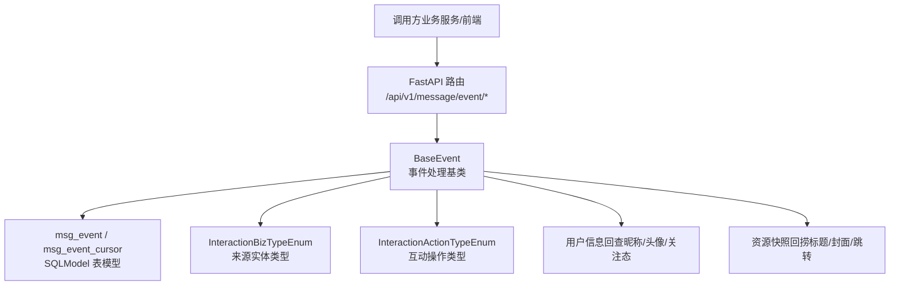
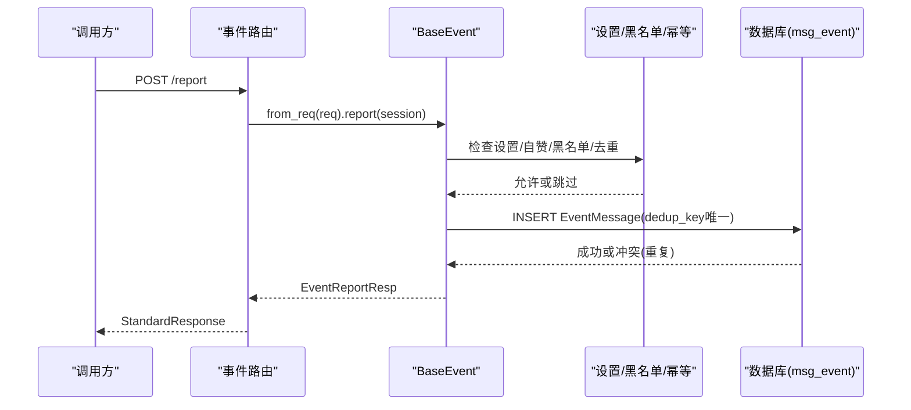
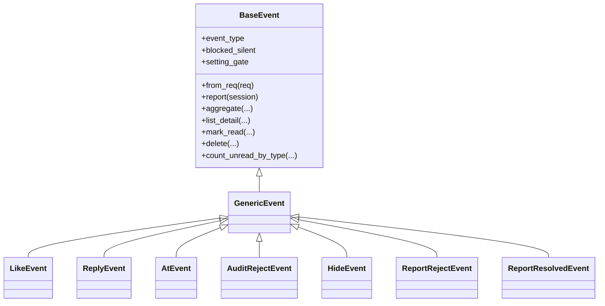
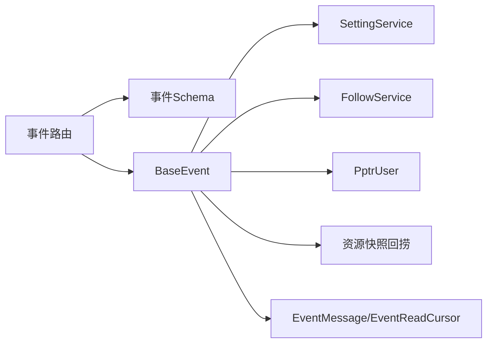
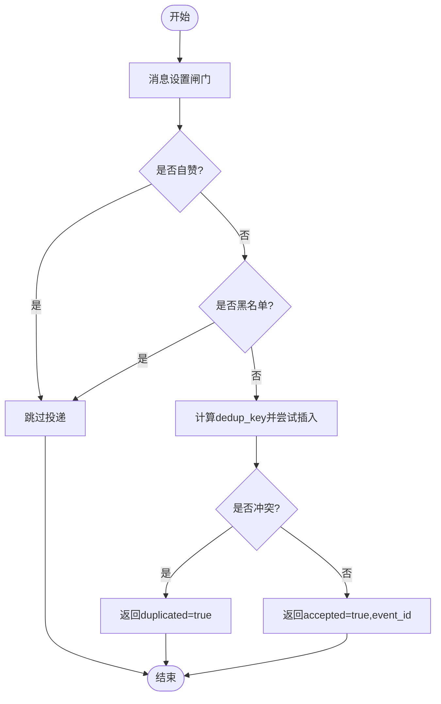

# 事件管理接口

<cite>
**本文引用的文件**
- [be-message-service/app/api/event.py](file://be-message-service/app/api/event.py)
- [be-message-service/app/models/schemas/event.py](file://be-message-service/app/models/schemas/event.py)
- [be-message-service/app/services/message/insite/events/base.py](file://be-message-service/app/services/message/insite/events/base.py)
- [be-message-service/app/services/message/insite/events/handlers.py](file://be-message-service/app/services/message/insite/events/handlers.py)
- [be-message-service/app/models/db/event_tbl.py](file://be-message-service/app/models/db/event_tbl.py)
- [bili-common/bili_common/models/__init__.py](file://bili-common/bili_common/models/__init__.py)
- [bili-common/bili_common/models/interaction.py](file://bili-common/bili_common/models/interaction.py)
- [be-message-service/README.md](file://be-message-service/README.md)
</cite>

## 目录
1. [简介](#简介)
2. [项目结构](#项目结构)
3. [核心组件](#核心组件)
4. [架构总览](#架构总览)
5. [详细组件分析](#详细组件分析)
6. [依赖关系分析](#依赖关系分析)
7. [性能考量](#性能考量)
8. [故障排查指南](#故障排查指南)
9. [结论](#结论)
10. [附录](#附录)

## 简介
本模块提供“事件提醒”的 RESTful API，覆盖点赞、回复、@提及等互动提醒的上报、聚合展示、明细列表、已读标记与未读数查询。事件为站内信模式：落库即送达，接收方通过轮询读取；不依赖第三方推送渠道。系统采用写扩散策略，按用户维度落库，配合索引实现高效聚合与分页。

## 项目结构
事件管理相关代码主要位于 be-message-service 中：
- API 路由：app/api/event.py
- 数据模型与响应 Schema：app/models/schemas/event.py、app/models/db/event_tbl.py
- 事件处理基类与读/写路径：app/services/message/insite/events/base.py
- 各类型处理器（点赞、回复、@提及等）：app/services/message/insite/events/handlers.py
- 公共枚举与标准响应：bili-common/bili_common/models/*

图表来源
- [be-message-service/app/api/event.py:1-162](file://be-message-service/app/api/event.py#L1-L162)
- [be-message-service/app/services/message/insite/events/base.py:295-436](file://be-message-service/app/services/message/insite/events/base.py#L295-L436)
- [be-message-service/app/models/db/event_tbl.py:31-86](file://be-message-service/app/models/db/event_tbl.py#L31-L86)
- [bili-common/bili_common/models/interaction.py:8-119](file://bili-common/bili_common/models/interaction.py#L8-L119)

章节来源
- [be-message-service/app/api/event.py:1-162](file://be-message-service/app/api/event.py#L1-L162)
- [be-message-service/app/models/db/event_tbl.py:1-107](file://be-message-service/app/models/db/event_tbl.py#L1-L107)

## 核心组件
- 事件上报接口：POST /api/v1/message/event/report
- 聚合展示接口：GET /api/v1/message/event/aggregate
- 明细列表接口：GET /api/v1/message/event/list
- 已读标记接口：POST /api/v1/message/event/read
- 删除提醒接口：POST /api/v1/message/event/delete
- 未读数接口：GET /api/v1/message/event/unread

事件处理器族：
- LikeEvent（点赞）、ReplyEvent（回复）、AtEvent（@提及）、AuditRejectEvent（审核驳回）、HideEvent（下架）、ReportRejectEvent（举报未通过）、ReportResolvedEvent（举报成立已处理）

章节来源
- [be-message-service/app/api/event.py:34-158](file://be-message-service/app/api/event.py#L34-L158)
- [be-message-service/app/services/message/insite/events/handlers.py:18-101](file://be-message-service/app/services/message/insite/events/handlers.py#L18-L101)

## 架构总览
事件提醒采用“写扩散 + 聚合索引”的设计：
- 写入：上报时经过消息设置闸门 → 自赞过滤 → 黑名单静默（部分类型）→ dedup_key 幂等 → 落库。
- 读取：按 (mid, event_type, source_type, source_id) 联合索引进行 GROUP BY 聚合，避免额外聚合表；详情列表支持游标翻页。
- 资源补全：标题、封面、跳转目标在读取时批量回捞原资源快照，不冗余存储。

图表来源
- [be-message-service/app/api/event.py:34-50](file://be-message-service/app/api/event.py#L34-L50)
- [be-message-service/app/services/message/insite/events/base.py:376-436](file://be-message-service/app/services/message/insite/events/base.py#L376-L436)
- [be-message-service/app/models/db/event_tbl.py:31-86](file://be-message-service/app/models/db/event_tbl.py#L31-L86)

## 详细组件分析

### 接口清单与契约

- 上报互动事件
  - 方法：POST
  - 路径：/api/v1/message/event/report
  - 请求体：EventReportReq
  - 响应：StandardResponse[EventReportResp]
  - 说明：内部完成消息设置闸门、自赞过滤、黑名单静默（部分类型）、dedup_key 幂等去重后落库；重复上报返回 duplicated=true。面向内部服务调用，mid 由请求体指定。

- 聚合展示互动提醒
  - 方法：GET
  - 路径：/api/v1/message/event/aggregate
  - 查询参数：event_type（可选）、page_num、page_size、only_unread
  - 响应：StandardResponse[EventAggregateResp]
  - 说明：按 source_type + source_id 分组聚合，返回卡片列表及总数。

- 互动提醒列表（B 站式聚合）
  - 方法：GET
  - 路径：/api/v1/message/event/list
  - 查询参数：event_type（可选）、cursor_id（可选）、page_size、only_unread
  - 响应：StandardResponse[EventListResp]
  - 说明：对齐 B 站 msgfeed 结构，包含 latest 与 total 两段，total_count 与 unread_count 用于对账。

- 标记已读
  - 方法：POST
  - 路径：/api/v1/message/event/read
  - 请求体：EventReadReq
  - 响应：StandardResponse[EventReadResp]
  - 说明：支持精确 id、类型、聚合分组、时间戳四种粒度标记已读。

- 删除互动提醒
  - 方法：POST
  - 路径：/api/v1/message/event/delete
  - 请求体：EventReadReq（需携带 event_ids）
  - 响应：StandardResponse[int]
  - 说明：删除指定事件，返回影响行数。

- 各类型未读数
  - 方法：GET
  - 路径：/api/v1/message/event/unread
  - 响应：StandardResponse[dict]
  - 说明：返回 like/reply/at 三类未读数及 total。

章节来源
- [be-message-service/app/api/event.py:34-158](file://be-message-service/app/api/event.py#L34-L158)

### 事件模型说明

- 事件类型（InteractionActionTypeEnum）
  - LIKE（点赞）、REPLY（回复）、AT（@提及）、AUDIT_REJECT（审核驳回）、HIDE（下架）、REPORT_REJECT（举报未通过）、REPORT_RESOLVED（举报成立已处理），以及后续扩展的 DISLIKE/FAVORITE/SHARE/REPOST/VIEW/REPORT/AUDIT_APPROVE 等。
- 来源实体类型（InteractionBizTypeEnum）
  - DYNAMIC（动态）、LOTTERY（抽奖）、RPA_ACTION/RPA_WORKFLOW/RPA_BROWSER/RPA_PLUGIN（RPA 相关）、COMMENT（评论）、USER（用户）。
- 事件载荷关键字段
  - mid：接收者 mid
  - event_type：事件类型
  - source_type：来源实体类型
  - source_id：来源实体 id
  - actor_mid：触发者 mid
  - content：事件正文（如回复正文/@上下文）
  - biz_id：业务资源 id（如评论 rpid/动态 dynId），参与幂等键计算
- 时间戳
  - created_at：事件创建时间（用于排序与游标）
- 状态字段
  - is_read：是否已读
  - read_at：已读时间
  - is_deleted：是否已删除
  - push_strategy/pushed：推送相关（与消息推送子系统对齐）

章节来源
- [bili-common/bili_common/models/interaction.py:8-119](file://bili-common/bili_common/models/interaction.py#L8-L119)
- [be-message-service/app/models/schemas/event.py:44-100](file://be-message-service/app/models/schemas/event.py#L44-L100)
- [be-message-service/app/models/db/event_tbl.py:31-86](file://be-message-service/app/models/db/event_tbl.py#L31-L86)

### 事件订阅机制、回调与重试

- 订阅机制
  - 事件提醒为站内信，无传统“订阅/取消订阅”的 MQ 通道；通过“消息设置闸门”控制是否投递某类提醒（如 recv_like、recv_reply、recv_at）。
- 回调处理
  - 无外部回调；接收方通过轮询 GET /list 或聚合接口感知新事件。
- 重试策略
  - 幂等性：dedup_key 唯一索引保证重复上报不会产生第二条提醒；MQ 重投、前端重试均安全。
  - 弱依赖上报：report_event_weakly 使用独立会话投递，失败不影响主事务，便于异步化与容错。

章节来源
- [be-message-service/app/services/message/insite/events/base.py:273-290](file://be-message-service/app/services/message/insite/events/base.py#L273-L290)
- [be-message-service/app/services/message/insite/events/base.py:376-436](file://be-message-service/app/services/message/insite/events/base.py#L376-L436)
- [be-message-service/README.md:22-41](file://be-message-service/README.md#L22-L41)

### 事件流处理与批量操作

- 事件流
  - 上报：设置闸门 → 自赞过滤 → 黑名单静默（部分类型）→ 幂等去重 → 落库。
  - 聚合：按 (mid, event_type, source_type, source_id) 分组，统计 count、unread_count、latest_*。
  - 详情：按时间倒序分页，批量解析资源身份并回捞快照。
- 批量优化
  - 资源快照批量回捞：按 (resource_type, resource_id, rpid) 分组一次调用，减少 N+1 查询。
  - 用户信息批量回查：按 actor_mid 批量获取昵称/头像/粉丝数/关注态。
  - 评论层级批量解析：CommentIndex 批量加载，构建 root/source/target 关系。

章节来源
- [be-message-service/app/services/message/insite/events/base.py:76-114](file://be-message-service/app/services/message/insite/events/base.py#L76-L114)
- [be-message-service/app/services/message/insite/events/base.py:117-162](file://be-message-service/app/services/message/insite/events/base.py#L117-L162)
- [be-message-service/app/services/message/insite/events/base.py:592-724](file://be-message-service/app/services/message/insite/events/base.py#L592-L724)
- [be-message-service/app/services/message/insite/events/base.py:726-800](file://be-message-service/app/services/message/insite/events/base.py#L726-L800)

### 错误码与异常处理

- 通用响应
  - 所有接口统一返回 StandardResponse，包含 code/msg/data。
- 校验错误
  - 参数校验失败返回 422（由框架自动处理）。
- 业务错误
  - 删除接口未传 event_ids 返回 code=400。
- 幂等冲突
  - 重复上报不会报错，返回 duplicated=true 与已有 event_id。

章节来源
- [be-message-service/app/api/event.py:135-142](file://be-message-service/app/api/event.py#L135-L142)
- [be-message-service/app/services/message/insite/events/base.py:415-430](file://be-message-service/app/services/message/insite/events/base.py#L415-L430)

### 类图（事件处理器族）

图表来源
- [be-message-service/app/services/message/insite/events/base.py:295-436](file://be-message-service/app/services/message/insite/events/base.py#L295-L436)
- [be-message-service/app/services/message/insite/events/handlers.py:18-101](file://be-message-service/app/services/message/insite/events/handlers.py#L18-L101)

## 依赖关系分析
- 路由层依赖：
  - FastAPI Router、SessionDep、RequiredUser、StandardResponse
  - 事件 Schema（EventReportReq/EventReportResp/EventAggregateResp/EventListResp/EventReadReq/EventReadResp）
  - 活动计数 ActivityService.touch（提升活跃度）
  - BaseEvent（事件处理基类）
- 事件处理层依赖：
  - SettingService（消息设置闸门）
  - FollowService（黑名单关系判断）
  - PptrUser（用户信息批量回查）
  - 资源快照回捞（按 biz_class 批量获取）
- 数据层依赖：
  - EventMessage、EventReadCursor（SQLModel 表模型）
  - 联合索引与唯一索引保障聚合与幂等

图表来源
- [be-message-service/app/api/event.py:14-31](file://be-message-service/app/api/event.py#L14-L31)
- [be-message-service/app/services/message/insite/events/base.py:376-436](file://be-message-service/app/services/message/insite/events/base.py#L376-L436)
- [be-message-service/app/models/db/event_tbl.py:31-86](file://be-message-service/app/models/db/event_tbl.py#L31-L86)

章节来源
- [be-message-service/app/api/event.py:14-31](file://be-message-service/app/api/event.py#L14-L31)
- [be-message-service/app/services/message/insite/events/base.py:376-436](file://be-message-service/app/services/message/insite/events/base.py#L376-L436)

## 性能考量
- 聚合查询
  - 利用 (mid, event_type, source_type, source_id) 联合索引进行 GROUP BY，避免额外聚合表。
- 批量回捞
  - 资源快照按类型分组批量获取，减少多次 IO。
  - 用户信息按 mid 批量获取，降低 N+1 查询。
- 分页与游标
  - list 接口支持 cursor_id 翻页，结合时间线索引提升深翻页性能。
- 幂等与去重
  - dedup_key 唯一索引避免重复插入，减轻写入压力。
- 活跃度
  - 聚合接口调用会更新用户活跃度（ActivityService.touch），有助于后续分流策略。

章节来源
- [be-message-service/app/models/db/event_tbl.py:31-42](file://be-message-service/app/models/db/event_tbl.py#L31-L42)
- [be-message-service/app/services/message/insite/events/base.py:76-114](file://be-message-service/app/services/message/insite/events/base.py#L76-L114)
- [be-message-service/app/services/message/insite/events/base.py:592-724](file://be-message-service/app/services/message/insite/events/base.py#L592-L724)

## 故障排查指南
- 重复上报
  - 现象：duplicated=true
  - 原因：命中 dedup_key 唯一索引
  - 处理：无需处理，视为幂等消费
- 未收到提醒
  - 检查消息设置闸门是否关闭对应类型（如 recv_like/recv_reply/recv_at）
  - 检查是否为自赞（mid == actor_mid）被过滤
  - 检查是否存在黑名单关系（针对 @/回复）
- 列表为空或未读数为零
  - 确认筛选条件（event_type、only_unread）是否正确
  - 确认聚合与详情接口使用的索引与分页参数
- 资源显示异常
  - 资源可能已被删除或不存，读取时会标记 resource_deleted，前端应展示占位且不跳转

章节来源
- [be-message-service/app/services/message/insite/events/base.py:376-436](file://be-message-service/app/services/message/insite/events/base.py#L376-L436)
- [be-message-service/app/services/message/insite/events/base.py:76-114](file://be-message-service/app/services/message/insite/events/base.py#L76-L114)

## 结论
事件管理模块以简洁的 RESTful API 暴露事件提醒能力，采用写扩散与聚合索引实现高性能读取，通过 dedup_key 保证幂等，结合消息设置闸门与黑名单静默满足精细化投递需求。资源快照与用户信息的批量回捞有效降低查询开销，适合高并发场景。

## 附录

### 接口流程图（上报）

图表来源
- [be-message-service/app/services/message/insite/events/base.py:376-436](file://be-message-service/app/services/message/insite/events/base.py#L376-L436)