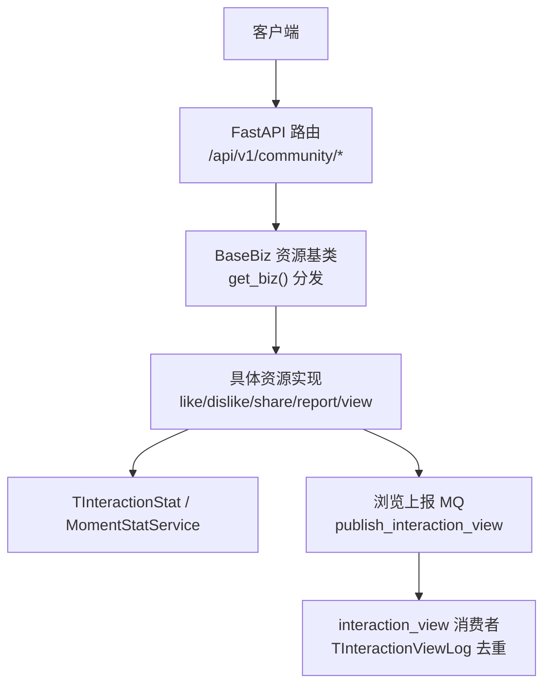
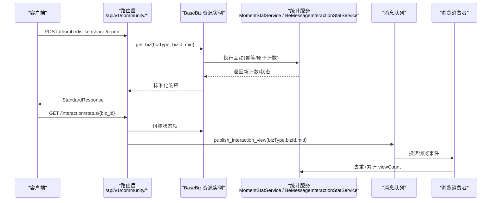
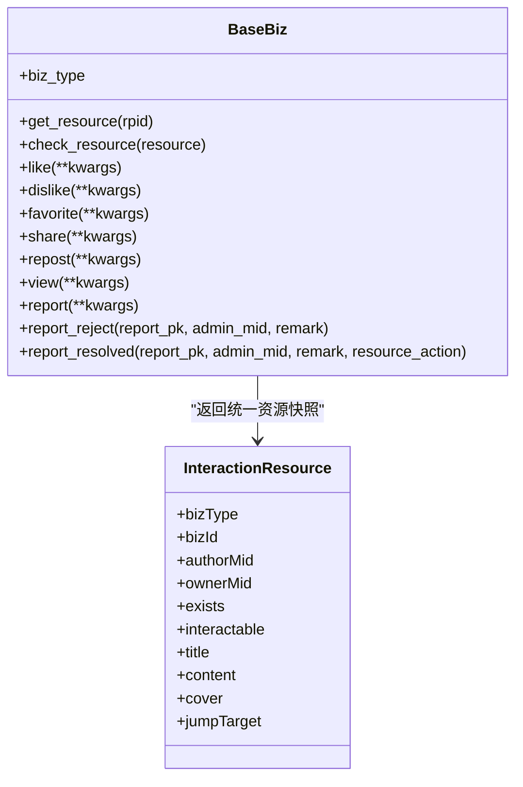
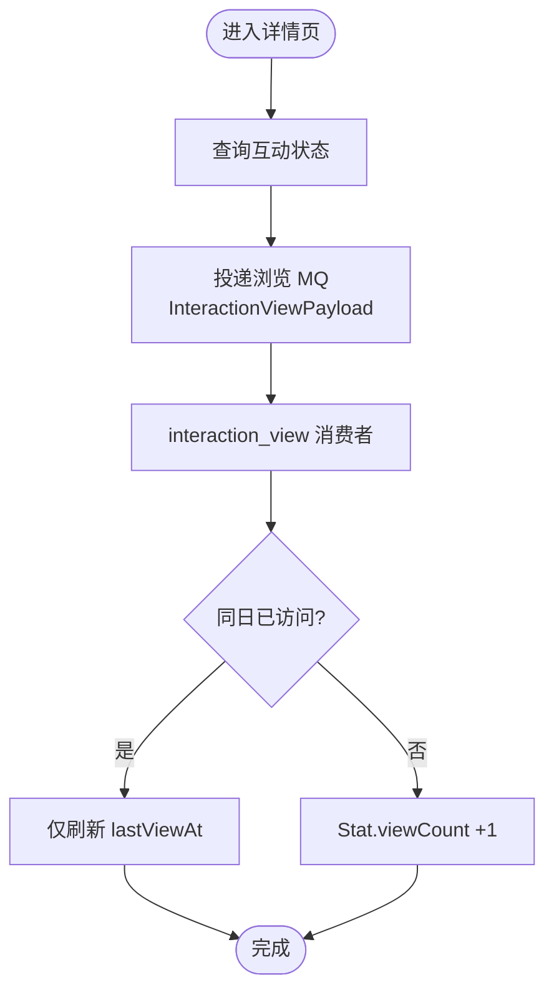
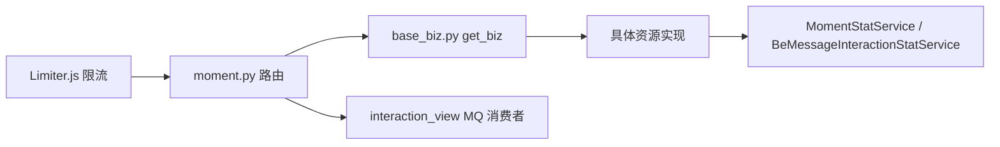

# 互动管理接口

<cite>
**本文引用的文件**
- [be-message-service/app/api/moment.py](file://be-message-service/app/api/moment.py)
- [be-message-service/app/services/interaction_actions/base_biz.py](file://be-message-service/app/services/interaction_actions/base_biz.py)
- [be-message-service/app/models/schemas/interaction.py](file://be-message-service/app/models/schemas/interaction.py)
- [bili-common/bili_common/models/interaction.py](file://bili-common/bili_common/models/interaction.py)
- [be-message-service/app/services/moment/interaction.py](file://be-message-service/app/services/moment/interaction.py)
- [be-message-service/app/services/moment/moment_stat.py](file://be-message-service/app/services/moment/moment_stat.py)
- [be-message-service/app/mq/consumers/interaction_view.py](file://be-message-service/app/mq/consumers/interaction_view.py)
- [be-message-service/app/models/db/interaction_tbl.py](file://be-message-service/app/models/db/interaction_tbl.py)
- [be-gateway/ExpressServerEnd/MiddleWare/Limiter.js](file://be-gateway/ExpressServerEnd/MiddleWare/Limiter.js)
</cite>

## 目录
1. [简介](#简介)
2. [项目结构](#项目结构)
3. [核心组件](#核心组件)
4. [架构总览](#架构总览)
5. [详细组件分析](#详细组件分析)
6. [依赖关系分析](#依赖关系分析)
7. [性能与扩展性](#性能与扩展性)
8. [故障排查指南](#故障排查指南)
9. [结论](#结论)
10. [附录：API 规范表](#附录api-规范表)

## 简介
本文件为“互动管理模块”的 RESTful API 文档，覆盖收藏、点赞、点踩、分享、举报、浏览统计等用户互动能力，以及批量查询互动状态。所有写操作均基于统一的资源主体模型（BaseBiz），按 bizType 分发到具体资源实现；计数统一走通用统计表，支持幂等明细 + 原子计数更新。列表接口不累计浏览，详情页进入时通过消息队列异步去重累计浏览数。

## 项目结构
- 路由层：FastAPI 路由集中在社区模块，提供发布、互动、话题等接口。
- 业务层：以 BaseBiz 为核心的资源型操作框架，按 InteractionBizTypeEnum 自动注册并分发。
- 数据层：通用交互统计表 TInteractionStat、浏览去重表 TInteractionViewLog，动态统计服务 MomentStatService。
- 消息层：浏览上报通过 MQ 异步消费，避免阻塞主链路。
- 网关层：限流中间件基于 Redis 实现，支持自定义 key 生成与窗口限制。

图表来源
- [be-message-service/app/api/moment.py:280-380](file://be-message-service/app/api/moment.py#L280-L380)
- [be-message-service/app/services/interaction_actions/base_biz.py:130-223](file://be-message-service/app/services/interaction_actions/base_biz.py#L130-L223)
- [be-message-service/app/services/moment/moment_stat.py:102-142](file://be-message-service/app/services/moment/moment_stat.py#L102-L142)
- [be-message-service/app/mq/consumers/interaction_view.py](file://be-message-service/app/mq/consumers/interaction_view.py)

章节来源
- [be-message-service/app/api/moment.py:1-104](file://be-message-service/app/api/moment.py#L1-L104)

## 核心组件
- 资源类型枚举 InteractionBizTypeEnum：统一标识资源归属（动态、抽奖、RPA、评论、用户等）。
- 动作类型枚举 InteractionActionTypeEnum：统一标识互动动作（点赞、点踩、收藏、分享、转发、浏览、举报等）。
- BaseBiz：以资源为主体的操作基类，声明式权限校验（relation/acl），统一资源存在性与可互动性检查。
- BeMessageInteractionStatService：绑定 TInteractionStat/TInteractionViewLog，提供跨资源的计数与浏览去重逻辑。
- MomentStatService：动态专属统计（如浏览、点赞、收藏、评论、转发等）与批量读取。

章节来源
- [bili-common/bili_common/models/interaction.py:8-119](file://bili-common/bili_common/models/interaction.py#L8-L119)
- [be-message-service/app/services/interaction_actions/base_biz.py:89-223](file://be-message-service/app/services/interaction_actions/base_biz.py#L89-L223)
- [be-message-service/app/services/moment/interaction.py:22-48](file://be-message-service/app/services/moment/interaction.py#L22-L48)
- [be-message-service/app/services/moment/moment_stat.py:102-142](file://be-message-service/app/services/moment/moment_stat.py#L102-L142)

## 架构总览
互动流程采用“资源为主体”的设计：路由层根据 bizType 获取对应资源实例，调用其 like/dislike/share/report/view 等方法；计数写入通用统计表或动态统计表；详情访问触发浏览上报，经 MQ 异步去重累计。

图表来源
- [be-message-service/app/api/moment.py:280-380](file://be-message-service/app/api/moment.py#L280-L380)
- [be-message-service/app/api/moment.py:538-604](file://be-message-service/app/api/moment.py#L538-L604)
- [be-message-service/app/services/interaction_actions/base_biz.py:130-223](file://be-message-service/app/services/interaction_actions/base_biz.py#L130-L223)
- [be-message-service/app/services/moment/moment_stat.py:102-142](file://be-message-service/app/services/moment/moment_stat.py#L102-L142)

## 详细组件分析

### 互动路由与请求/响应
- 基础约定
  - 认证：复用 RequiredUser（JWT → x-bili-mid）。
  - 错误处理：业务异常以 ValueError 抛出，由统一异常中间件转为标准响应；路由层负责 400/403/404 语义映射。
  - 响应体：StandardResponse<T>，包含 code/msg/data。

- 点赞 / 取消点赞
  - 方法：POST
  - 路径：/api/v1/community/thumb
  - 请求参数：bizType、bizId/dynId、up（是否点赞）
  - 响应字段：bizType、bizId、dynId、isLike、likeCount
  - 行为：幂等；通过 BaseBiz.like 更新计数。

- 点踩 / 取消点踩
  - 方法：POST
  - 路径：/api/v1/community/dislike
  - 请求参数：bizType（当前仅 dynamic）、bizId/dynId、up
  - 响应字段：bizType、bizId、dynId、isDislike、dislikeCount
  - 行为：幂等；用于 EdgeRank 降权。

- 分享上报
  - 方法：POST
  - 路径：/api/v1/community/share
  - 请求参数：dynId
  - 响应字段：dynId、shareCount
  - 行为：非幂等；normal 动态 shareCount 原子 +1。

- 举报动态
  - 方法：POST
  - 路径：/api/v1/community/report
  - 请求参数：dynId、reasonType、reasonDesc
  - 响应字段：dynId
  - 行为：不改 auditStatus，加入审核队列。

- 批量查询互动状态（列表专用）
  - 方法：GET
  - 路径：/api/v1/community/interaction/status
  - 查询参数：bizType、bizIds（逗号分隔，最多 50）
  - 响应字段：items[]（每个资源含 isLike/isFavorite/likeCount/favoriteCount/commentCount/repostCount/viewCount/reportCount/reportPeopleCount/detail）
  - 行为：不累计浏览；防乱调校验资源存在性。

- 单资源互动状态（详情专用，兼作浏览触发点）
  - 方法：GET
  - 路径：/api/v1/community/interaction/status/{biz_id}
  - 查询参数：bizType
  - 响应字段：同 items 单个元素
  - 行为：查询后投递浏览 MQ 异步累计；同日重复访问不重复计数。

章节来源
- [be-message-service/app/api/moment.py:280-380](file://be-message-service/app/api/moment.py#L280-L380)
- [be-message-service/app/api/moment.py:538-604](file://be-message-service/app/api/moment.py#L538-L604)
- [be-message-service/app/models/schemas/interaction.py:39-63](file://be-message-service/app/models/schemas/interaction.py#L39-L63)

### BaseBiz 资源模型与权限
- 设计要点
  - 一个资源一个类，继承 BaseBiz 并声明 _biz_type，自动登记到注册表。
  - 操作即接口：InteractionActionTypeEnum 的成员在基类上声明为方法，默认抛未实现，子类按需覆盖。
  - 声明式权限：biz_action 装饰器声明 relation/acl，基类在执行前统一校验。
  - 资源装配：get_resource 统一折叠为 InteractionResource，封装 exists/interactable/authorMid/title/cover/jumpTarget。

- 关键方法
  - check_exists / _load_meta / _load_author_mid / _load_interactable：资源钩子，供 get_resource 调用。
  - check_resource：校验资源存在性与可互动性。
  - _enforce/_check_relation/_check_acl：集中执行关系与 DAC 权限。
  - report_reject/report_resolved：举报审核通用实现，通知举报人并可联动下架。

图表来源
- [be-message-service/app/services/interaction_actions/base_biz.py:89-223](file://be-message-service/app/services/interaction_actions/base_biz.py#L89-L223)
- [be-message-service/app/models/schemas/interaction.py:14-37](file://be-message-service/app/models/schemas/interaction.py#L14-L37)

章节来源
- [be-message-service/app/services/interaction_actions/base_biz.py:50-223](file://be-message-service/app/services/interaction_actions/base_biz.py#L50-L223)

### 数据统计与浏览去重
- 通用统计表
  - TInteractionStat：每种 bizType+bizId 一行计数，承载收藏/点赞/浏览等计数。
  - TInteractionViewLog：每用户每资源一行，lastViewAt 判断自然日窗口，跨天访问才 +1。

- 动态统计
  - MomentStatService.batch_read_stats：批量读取动态统计（严禁 COUNT 聚合）。
  - ensure_stat_row：惰性建行兜底，MySQL 原子 upsert 防并发冲突。

- 浏览上报流程
  - 详情接口 GET /interaction/status/{biz_id} 查询后投递 MQ。
  - 消费者 interaction_view 消费并去重累计 viewCount。

图表来源
- [be-message-service/app/api/moment.py:567-604](file://be-message-service/app/api/moment.py#L567-L604)
- [be-message-service/app/services/moment/moment_stat.py:102-142](file://be-message-service/app/services/moment/moment_stat.py#L102-L142)
- [be-message-service/app/models/db/interaction_tbl.py:18-42](file://be-message-service/app/models/db/interaction_tbl.py#L18-L42)

章节来源
- [be-message-service/app/models/db/interaction_tbl.py:1-43](file://be-message-service/app/models/db/interaction_tbl.py#L1-L43)
- [be-message-service/app/services/moment/moment_stat.py:102-142](file://be-message-service/app/services/moment/moment_stat.py#L102-L142)

### 防刷机制、频率限制与异常行为检测
- 路由层防乱调
  - 批量查询前校验资源存在性，缺失则整体 400，避免部分结果泄露。
  - 详情接口仅在进入时触发浏览上报，列表不累计。

- 幂等与去重
  - 点赞/点踩/收藏：明细表幂等，计数原子 ±1。
  - 浏览：TInteractionViewLog 按 (bizType,bizId,mid) 唯一键，lastViewAt 判自然日窗口。

- 网关限流
  - Express rate-limit 基于 Redis 存储，支持 windowMs/limit/keyGenerator 配置。
  - 可针对特定场景自定义 key（如 IP、mid），防止高频刷接口。

章节来源
- [be-message-service/app/api/moment.py:382-416](file://be-message-service/app/api/moment.py#L382-L416)
- [be-message-service/app/models/db/interaction_tbl.py:28-42](file://be-message-service/app/models/db/interaction_tbl.py#L28-L42)
- [be-gateway/ExpressServerEnd/MiddleWare/Limiter.js:20-51](file://be-gateway/ExpressServerEnd/MiddleWare/Limiter.js#L20-L51)

## 依赖关系分析
- 路由层依赖 BaseBiz 工厂 get_biz，按 InteractionBizTypeEnum 分发到具体资源实现。
- 资源实现依赖统计服务（MomentStatService/BeMessageInteractionStatService）进行计数与去重。
- 详情接口依赖 MQ 发布浏览事件，消费者异步更新视图计数。
- 网关层提供限流能力，保护后端免受滥用。

图表来源
- [be-message-service/app/api/moment.py:280-380](file://be-message-service/app/api/moment.py#L280-L380)
- [be-message-service/app/services/interaction_actions/base_biz.py:454-484](file://be-message-service/app/services/interaction_actions/base_biz.py#L454-L484)
- [be-message-service/app/services/moment/interaction.py:22-48](file://be-message-service/app/services/moment/interaction.py#L22-L48)
- [be-gateway/ExpressServerEnd/MiddleWare/Limiter.js:20-51](file://be-gateway/ExpressServerEnd/MiddleWare/Limiter.js#L20-L51)

章节来源
- [be-message-service/app/services/interaction_actions/base_biz.py:454-484](file://be-message-service/app/services/interaction_actions/base_biz.py#L454-L484)
- [be-message-service/app/services/moment/interaction.py:22-48](file://be-message-service/app/services/moment/interaction.py#L22-L48)

## 性能与扩展性
- 计数范式：明细表幂等 + 计数原子 ±1，保证高并发下的正确性与一致性。
- 批量读取：禁止 COUNT 聚合，直接读取预计算字段，降低数据库压力。
- 异步化：浏览上报通过 MQ 解耦，主链路不阻塞。
- 可扩展：新增资源只需继承 BaseBiz 并声明 _biz_type，即可自动注册并获得完整能力。

[本节为通用指导，无需引用具体文件]

## 故障排查指南
- 400 错误
  - bizId/dynId 不合法或缺失：检查请求参数与资源类型约束。
  - 资源不存在：批量查询会整体失败；详情接口不会投递浏览。
- 403/404
  - 权限不足或资源不可见：检查鉴权与资源状态。
- 计数异常
  - 确认明细表幂等与原子计数逻辑；检查 TInteractionStat/TInteractionViewLog 唯一键与 lastViewAt。
- 限流触发
  - 检查网关 Limiter.js 配置（windowMs/limit/keyGenerator），必要时调整策略。

章节来源
- [be-message-service/app/api/moment.py:280-380](file://be-message-service/app/api/moment.py#L280-L380)
- [be-message-service/app/api/moment.py:538-604](file://be-message-service/app/api/moment.py#L538-L604)
- [be-gateway/ExpressServerEnd/MiddleWare/Limiter.js:20-51](file://be-gateway/ExpressServerEnd/MiddleWare/Limiter.js#L20-L51)

## 结论
本模块以 BaseBiz 为核心，将互动操作抽象为资源方法，统一了权限校验、资源存在性与可互动性检查；计数与浏览去重通过通用统计表与 MQ 实现，兼顾一致性与性能。配合网关限流与路由层防乱调，形成完整的互动管理能力。

[本节为总结，无需引用具体文件]

## 附录：API 规范表

- 点赞 / 取消点赞
  - 方法：POST
  - 路径：/api/v1/community/thumb
  - 请求参数：bizType、bizId/dynId、up
  - 响应字段：bizType、bizId、dynId、isLike、likeCount
  - 错误码：400（参数不合法/资源不存在）

- 点踩 / 取消点踩
  - 方法：POST
  - 路径：/api/v1/community/dislike
  - 请求参数：bizType（当前仅 dynamic）、bizId/dynId、up
  - 响应字段：bizType、bizId、dynId、isDislike、dislikeCount
  - 错误码：400（参数不合法/资源不存在）

- 分享上报
  - 方法：POST
  - 路径：/api/v1/community/share
  - 请求参数：dynId
  - 响应字段：dynId、shareCount
  - 错误码：400（参数不合法/资源不存在）

- 举报动态
  - 方法：POST
  - 路径：/api/v1/community/report
  - 请求参数：dynId、reasonType、reasonDesc
  - 响应字段：dynId
  - 错误码：400（参数不合法/资源不存在）

- 批量查询互动状态
  - 方法：GET
  - 路径：/api/v1/community/interaction/status
  - 查询参数：bizType、bizIds（逗号分隔，最多 50）
  - 响应字段：items[]（bizType、bizId、isLike、isFavorite、likeCount、favoriteCount、commentCount、repostCount、viewCount、reportCount、reportPeopleCount、detail）
  - 错误码：400（bizIds 不合法/资源不存在）

- 单资源互动状态（详情专用）
  - 方法：GET
  - 路径：/api/v1/community/interaction/status/{biz_id}
  - 查询参数：bizType
  - 响应字段：同 items 单个元素
  - 错误码：400（bizId 不合法/资源不存在）

章节来源
- [be-message-service/app/api/moment.py:280-380](file://be-message-service/app/api/moment.py#L280-L380)
- [be-message-service/app/api/moment.py:538-604](file://be-message-service/app/api/moment.py#L538-L604)
- [be-message-service/app/models/schemas/interaction.py:39-63](file://be-message-service/app/models/schemas/interaction.py#L39-L63)