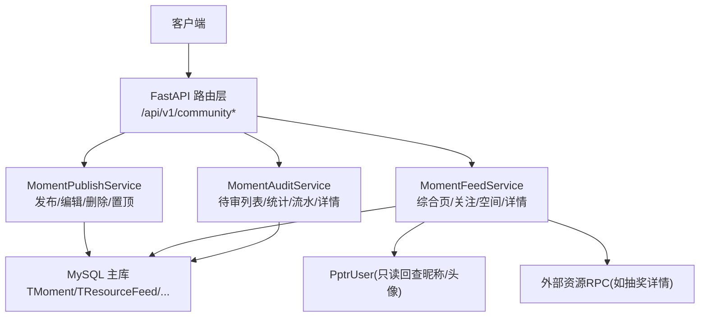
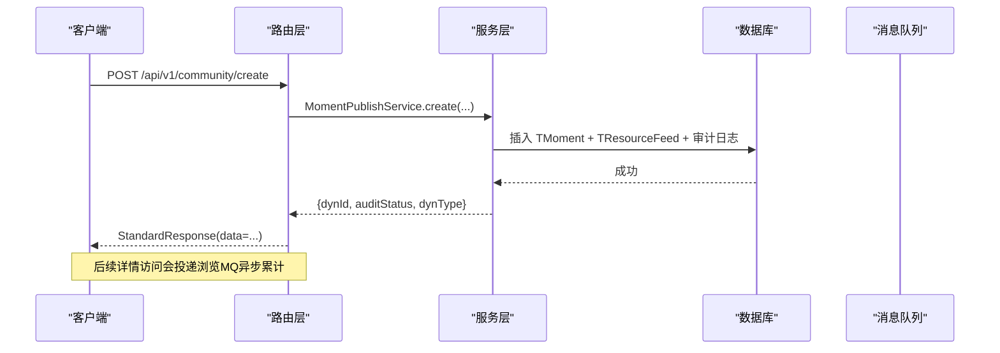
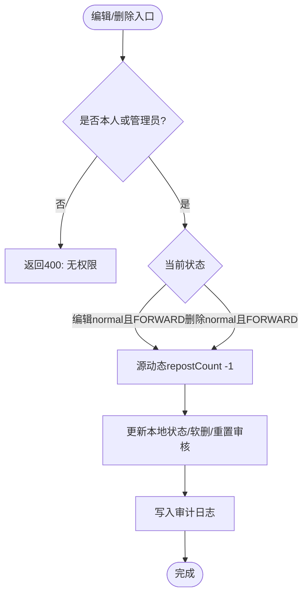
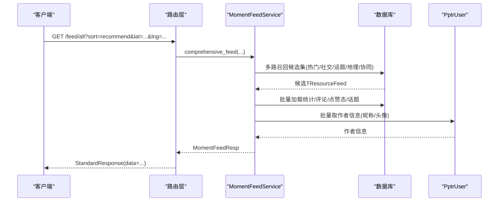
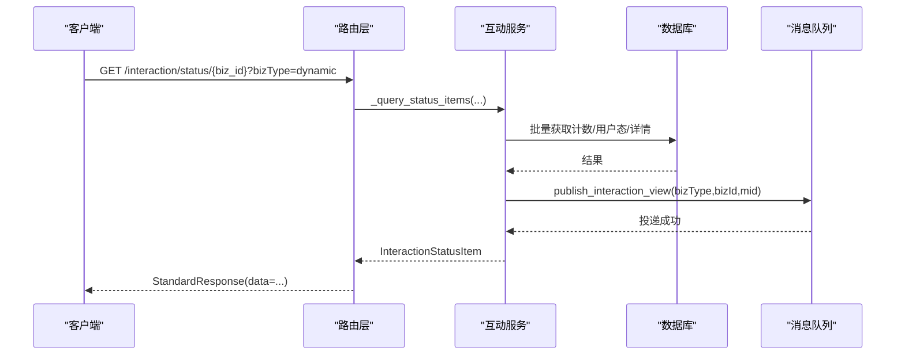
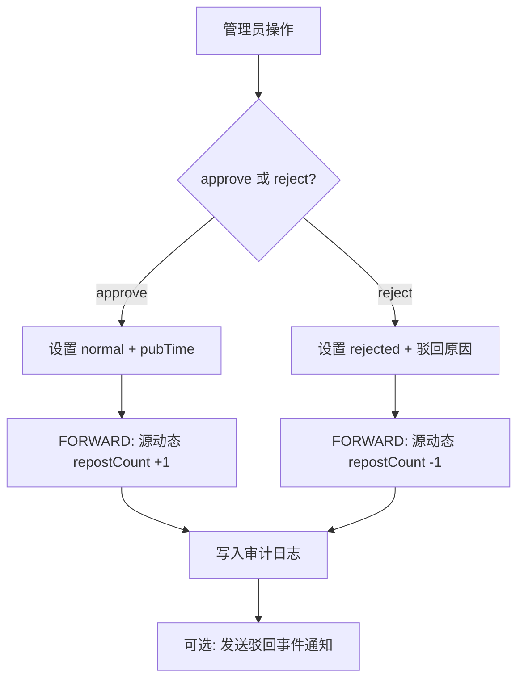
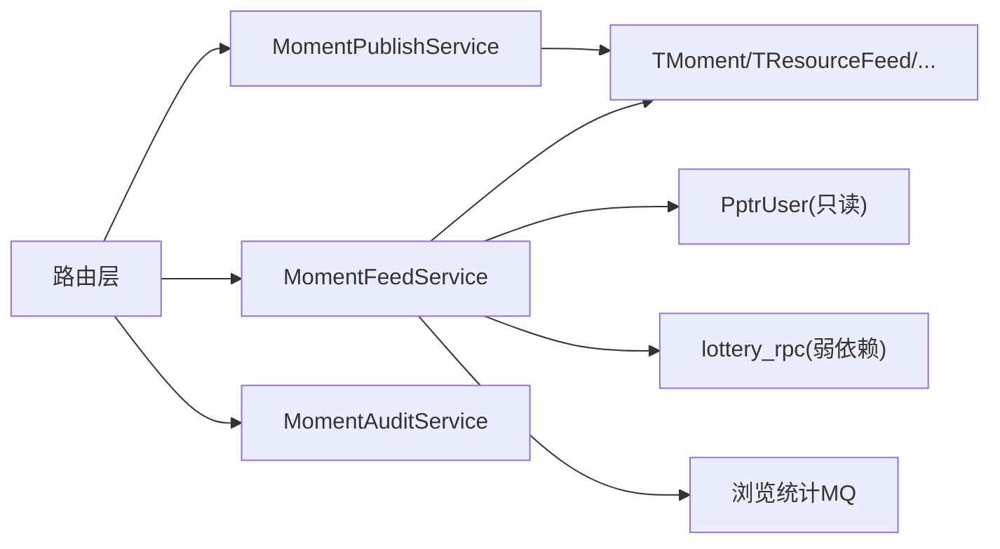

# 动态管理接口

<cite>
**本文引用的文件**
- [moment.py](file://be-message-service/app/api/moment.py)
- [moment_feed.py](file://be-message-service/app/api/moment_feed.py)
- [moment_audit.py](file://be-message-service/app/api/moment_audit.py)
- [moment.py（模型）](file://be-message-service/app/models/schemas/moment.py)
- [moment_tbl.py](file://be-message-service/app/models/db/moment_tbl.py)
- [moment_feed.py（服务）](file://be-message-service/app/services/moment/moment_feed.py)
- [moment_publish.py](file://be-message-service/app/services/moment/moment_publish.py)
- [moment_audit.py（服务）](file://be-message-service/app/services/moment/moment_audit.py)
</cite>

## 目录
1. [简介](#简介)
2. [项目结构](#项目结构)
3. [核心组件](#核心组件)
4. [架构总览](#架构总览)
5. [详细组件分析](#详细组件分析)
6. [依赖关系分析](#依赖关系分析)
7. [性能考虑](#性能考虑)
8. [故障排查指南](#故障排查指南)
9. [结论](#结论)
10. [附录：API 清单与数据模型](#附录api-清单与数据模型)

## 简介
本文件为“动态管理模块”的 RESTful API 文档，覆盖动态发布、浏览、互动、审核、话题与@/POI 辅助能力。文档包含每个接口的 HTTP 方法、URL、请求参数、响应格式、错误码定义；并提供动态模型说明（内容、媒体附件、标签等）、Feed 流算法与推荐机制、内容分发策略，以及审核流程与社区治理相关接口。

## 项目结构
动态模块位于 be-message-service 中，采用“路由层 → 服务层 → 数据层”的分层组织：
- 路由层：FastAPI Router，负责鉴权、参数校验、异常映射与标准响应封装
- 服务层：MomentPublishService / MomentFeedService / MomentAuditService 等，承载业务逻辑
- 数据层：SQLModel ORM 模型与索引，支撑查询与写入

**图示来源**
- [moment.py:118-274](file://be-message-service/app/api/moment.py#L118-L274)
- [moment_feed.py:73-226](file://be-message-service/app/api/moment_feed.py#L73-L226)
- [moment_audit.py:36-153](file://be-message-service/app/api/moment_audit.py#L36-L153)

**章节来源**
- [moment.py:1-104](file://be-message-service/app/api/moment.py#L1-L104)
- [moment_feed.py:1-34](file://be-message-service/app/api/moment_feed.py#L1-L34)
- [moment_audit.py:1-33](file://be-message-service/app/api/moment_audit.py#L1-L33)

## 核心组件
- 动态发布与生命周期：创建 WORD/FORWARD、编辑、删除（软删）、转发、置顶/取消置顶、发布前预校验
- 动态浏览与详情：综合页 Feed（推荐/最新）、关注流、个人空间 Feed、单条/批量详情
- 互动与计数：点赞/点踩/分享/举报、批量状态查询、详情页触发浏览统计
- 审核管理：待审列表、通过/驳回、审核记录流水、单条审核详情、审核统计
- 话题与@/POI：话题广场/热门/详情/话题流、@用户推荐与搜索、附近地点与关键词搜索

**章节来源**
- [moment.py:118-800](file://be-message-service/app/api/moment.py#L118-L800)
- [moment_feed.py:73-276](file://be-message-service/app/api/moment_feed.py#L73-L276)
- [moment_audit.py:36-153](file://be-message-service/app/api/moment_audit.py#L36-L153)

## 架构总览
动态模块以 FastAPI 路由为入口，统一使用 StandardResponse 返回；写操作通过 ValueError 抛出业务错误，由中间件转为 400/422 等语义化响应。Feed 与详情在读取时进行权限过滤（非作者且非 normal 不可见），并通过异步 MQ 累计浏览数。

**图示来源**
- [moment.py:118-135](file://be-message-service/app/api/moment.py#L118-L135)
- [moment_publish.py:360-457](file://be-message-service/app/services/moment/moment_publish.py#L360-L457)
- [moment_feed.py:567-604](file://be-message-service/app/api/moment_feed.py#L567-L604)

## 详细组件分析

### 动态发布与编辑
- 创建动态（WORD/FORWARD）
  - 方法/路径：POST /api/v1/community/create
  - 请求体：MomentCreateReq（scene/content/attach/repostSrc/topics/topic/lbs/option）
  - 响应：StandardResponse[MomentCreateResp]（含 dynId/dynIdStr/auditStatus/dynType）
  - 行为：新建一律 auditing，pubTime=NULL；FORWARD 需源动态已 normal 且未软删；自动解析 IP 属地与位置；附加卡仅存 bizType+bizId
- 编辑动态
  - 方法/路径：POST /api/v1/community/edit
  - 请求体：MomentEditReq（dynId/scene/content/attach/topics/topic/option）
  - 响应：StandardResponse[MomentEditResp]
  - 行为：rejected/auditing 编辑后回 auditing；normal 编辑触发源动态 repostCount -1（状态机触发点③）
- 删除动态（软删）
  - 方法/路径：POST /api/v1/community/remove
  - 请求体：MomentRemoveReq（dynId）
  - 响应：StandardResponse[MomentRemoveResp]
  - 行为：仅本人可删；软删置 deletedAt；FORWARD 且 before=normal 时源动态 repostCount -1（触发点④）
- 管理员删除
  - 方法/路径：POST /api/v1/community/admin/remove
  - 权限：RootUser
  - 行为：跳过作者校验，审计记录 operatorRole=admin
- 转发动态
  - 方法/路径：POST /api/v1/community/repost
  - 请求体：MomentRepostReq（srcDynId/content）
  - 响应：StandardResponse[MomentRepostResp]
  - 行为：创建时不 +repostCount，待审核通过后 +1（触发点⑥）
- 置顶/取消置顶
  - 方法/路径：POST /api/v1/community/space/top | /space/untop
  - 请求体：MomentTopReq（dynId）
  - 响应：StandardResponse[MomentTopResp]
  - 行为：仅本人且 normal 可操作
- 发布页预校验
  - 方法/路径：POST /api/v1/community/create/check
  - 请求体：MomentCreateCheckReq（scene）
  - 响应：StandardResponse[MomentCreateCheckResp]（allowedScenes/setting/permission）

**图示来源**
- [moment_publish.py:588-750](file://be-message-service/app/services/moment/moment_publish.py#L588-L750)

**章节来源**
- [moment.py:118-274](file://be-message-service/app/api/moment.py#L118-L274)
- [moment_publish.py:360-800](file://be-message-service/app/services/moment/moment_publish.py#L360-L800)

### 动态浏览与详情（Feed/Detail）
- 综合页 Feed
  - 方法/路径：GET /api/v1/community/feed/all
  - 参数：sort(recommend/time)、ps/page_size、last_showlist、history_offset、lat/lng（地理位置召回）
  - 响应：StandardResponse[MomentFeedResp]（items/hasMore/updateBaseline/historyOffset/updateNum）
  - 行为：recommend 模式为 EdgeRank 推荐流；time 模式按 pubTime 倒序游标分页
- 关注流 Feed
  - 方法/路径：GET /api/v1/community/feed/following
  - 权限：RequiredUser（必须登录）
  - 响应：StandardResponse[MomentFeedResp]
- 个人空间 Feed
  - 方法/路径：GET /api/v1/community/feed/space/{mid}
  - 行为：本人视角含 auditing/rejected；访客仅 normal；黑名单互访拒绝
- 动态详情
  - 方法/路径：GET /api/v1/community/detail/{moment_id}
  - 行为：非作者且非 normal → 404；详情不直接累计浏览，由 interaction/status/{bizId} 触发
- 批量详情
  - 方法/路径：POST /api/v1/community/details
  - 请求体：MomentDetailsReq（dynamicIds，限20）
  - 响应：StandardResponse[list[MomentDetailResp]]
- 点赞明细/转发列表
  - 方法/路径：GET /api/v1/community/{moment_id}/likers | /forwards
  - 响应：StandardResponse[MomentLikerListResp/MomentForwardListResp]

**图示来源**
- [moment_feed.py:73-124](file://be-message-service/app/api/moment_feed.py#L73-L124)
- [moment_feed.py:555-772](file://be-message-service/app/services/moment/moment_feed.py#L555-L772)
- [moment_feed.py:354-432](file://be-message-service/app/services/moment/moment_feed.py#L354-L432)

**章节来源**
- [moment_feed.py:73-276](file://be-message-service/app/api/moment_feed.py#L73-L276)
- [moment_feed.py:775-1540](file://be-message-service/app/services/moment/moment_feed.py#L775-L1540)

### 互动与计数
- 点赞/取消点赞
  - 方法/路径：POST /api/v1/community/thumb
  - 请求体：MomentThumbReq（bizType/bizId/dynId/up）
  - 响应：StandardResponse[MomentThumbResp]（isLike/likeCount）
- 点踩/取消点踩
  - 方法/路径：POST /api/v1/community/dislike
  - 请求体：MomentDislikeReq（bizType/bizId/dynId/up）
  - 响应：StandardResponse[MomentDislikeResp]（isDislike/dislikeCount）
- 分享上报
  - 方法/路径：POST /api/v1/community/share
  - 请求体：MomentShareReq（dynId）
  - 响应：StandardResponse[MomentShareResp]（shareCount）
- 举报动态
  - 方法/路径：POST /api/v1/community/report
  - 请求体：MomentReportReq（dynId/reasonType/reasonDesc）
  - 响应：StandardResponse[MomentReportResp]
- 批量互动状态
  - 方法/路径：GET /api/v1/community/interaction/status
  - 参数：bizType、bizIds（逗号分隔，限50）
  - 响应：StandardResponse[InteractionStatusResp]（items: isLike/isFavorite/各计数/报告数/详情）
- 单资源互动状态（详情专用，触发浏览统计）
  - 方法/路径：GET /api/v1/community/interaction/status/{biz_id}
  - 参数：bizType
  - 行为：查询后投递浏览 MQ 异步去重累计（同日重复进入不重复计数）

**图示来源**
- [moment.py:538-604](file://be-message-service/app/api/moment.py#L538-L604)

**章节来源**
- [moment.py:280-624](file://be-message-service/app/api/moment.py#L280-L624)
- [moment.py:382-535](file://be-message-service/app/api/moment.py#L382-L535)

### 审核管理
- 待审核列表
  - 方法/路径：GET /api/v1/community/audit/list
  - 参数：auditStatus（默认 auditing）、page_num、page_size
  - 响应：StandardResponse[MomentAuditListResp]
- 审核总统计
  - 方法/路径：GET /api/v1/community/audit/statistics
  - 响应：StandardResponse[MomentAuditStatisticsResp]（byType/byStatus/total）
- 审核记录流水
  - 方法/路径：GET /api/v1/community/audit/list/history
  - 参数：dynId/operatorMid/fromDate/toDate/page_num/page_size
  - 响应：StandardResponse[MomentAuditLogListResp]
- 审核通过
  - 方法/路径：POST /api/v1/community/audit/approve
  - 请求体：MomentAuditActionReq（dynId/remark）
  - 行为：→ normal + pubTime；FORWARD 时源动态 repostCount +1；写审计日志
- 审核驳回
  - 方法/路径：POST /api/v1/community/audit/reject
  - 请求体：MomentAuditRejectReq（dynId/rejectReason/remark）
  - 行为：→ rejected + 驳回原因；FORWARD ∧ before=normal 时源动态 repostCount -1；发驳回事件通知
- 单条审核详情
  - 方法/路径：GET /api/v1/community/audit/{dynId}
  - 响应：StandardResponse[MomentAuditDetailResp]（item/logs）

**图示来源**
- [moment_audit.py:100-153](file://be-message-service/app/api/moment_audit.py#L100-L153)
- [moment_audit.py:196-386](file://be-message-service/app/services/moment/moment_audit.py#L196-L386)

**章节来源**
- [moment_audit.py:36-153](file://be-message-service/app/api/moment_audit.py#L36-L153)
- [moment_audit.py:196-386](file://be-message-service/app/services/moment/moment_audit.py#L196-L386)

### 话题与@/POI
- 话题广场/热门/详情/话题流
  - 方法/路径：GET /topic/square | /hot-search | /detail/{topicId} | /feed/{topicId}
  - 行为：支持 hot/time 排序；话题创建即进入审核
- @用户推荐与搜索
  - 方法/路径：GET /at/list | /at/search
  - 行为：推荐来自关注/粉丝分组；搜索基于昵称模糊匹配
- POI 附近/关键词搜索
  - 方法/路径：GET /poi/nearby | /poi/search
  - 行为：MVP 本地模式，基于已发动态的 LBS 字段聚合

**章节来源**
- [moment.py:630-800](file://be-message-service/app/api/moment.py#L630-L800)

## 依赖关系分析
- 路由层依赖：
  - 鉴权：RequiredUser（JWT → x-bili-mid）、RootUser（管理员）
  - 服务：MomentPublishService / MomentFeedService / MomentAuditService
  - 模型：Moment schemas、StandardResponse
- 服务层依赖：
  - 数据库：TMoment、TResourceFeed、TInteractionStat、TMomentTopicRel 等
  - 外部只读：PptrUser（昵称/头像）、lottery_rpc（附加卡详情）
  - 消息：publish_interaction_view（浏览统计）
- 数据层：
  - 表与索引：TMoment（主键、时间/可见范围/话题索引）、TMomentTopic、TMomentTopicRel、MomentAuthorQuality

**图示来源**
- [moment.py:92-101](file://be-message-service/app/api/moment.py#L92-L101)
- [moment_feed.py:27-68](file://be-message-service/app/services/moment/moment_feed.py#L27-L68)
- [moment_publish.py:27-56](file://be-message-service/app/services/moment/moment_publish.py#L27-L56)

**章节来源**
- [moment_tbl.py:35-190](file://be-message-service/app/models/db/moment_tbl.py#L35-L190)
- [moment_feed.py:27-68](file://be-message-service/app/services/moment/moment_feed.py#L27-L68)

## 性能考虑
- 批量装配与 N+1 规避：作者信息、话题名称、统计、评论主体均批量 IN 查询
- 推荐流候选集限制：edgerank_candidate_limit 控制候选规模，避免过大计算
- 计数统一 TInteractionStat：禁止热路径 COUNT 聚合，直接读字段
- 弱依赖降级：lottery_rpc/PptrUser 失败不影响主链路
- 浏览统计异步：详情访问投递 MQ 去重累计，主链路不阻塞
- 转发嵌套深度限制：_MAX_FORWARD_DEPTH=3 防止无限递归

**章节来源**
- [moment_feed.py:354-432](file://be-message-service/app/services/moment/moment_feed.py#L354-L432)
- [moment_feed.py:555-772](file://be-message-service/app/services/moment/moment_feed.py#L555-L772)
- [moment_feed.py:212-351](file://be-message-service/app/services/moment/moment_feed.py#L212-L351)

## 故障排查指南
- 400 业务错误：常见于参数非法、资源不存在、无权操作（ValueError 由路由层转 400）
- 403 访问拒绝：黑名单互访、未登录访问关注流
- 404 不存在：动态不在权限范围内或已软删；话题不存在
- 422 校验失败：场景不支持、正文为空、图片外链不合法、话题未过审
- 审核相关：
  - 审核通过/驳回后，注意 FORWARD 源动态 repostCount 变化
  - 审核记录可通过 /audit/list/history 追踪
- 浏览统计：
  - 确保调用 /interaction/status/{bizId} 触发浏览；列表接口不累计
- 附加卡/话题：
  - 附加卡详情依赖 RPC，失败时降级显示基础信息
  - 话题需 normal 才可关联

**章节来源**
- [moment.py:118-274](file://be-message-service/app/api/moment.py#L118-L274)
- [moment_feed.py:162-208](file://be-message-service/app/api/moment_feed.py#L162-L208)
- [moment_audit.py:100-153](file://be-message-service/app/api/moment_audit.py#L100-L153)

## 结论
本模块提供完整的动态全生命周期管理能力：从发布、浏览、互动到审核与治理，具备高扩展性的 Feed 推荐与内容分发策略。通过分层设计与弱依赖降级，兼顾了功能完整性与系统稳定性。建议在生产环境关注审核时效、推荐候选规模与异步任务健康度，持续优化用户体验与内容质量。

## 附录：API 清单与数据模型

### API 清单（动态相关）
- 发布类
  - POST /api/v1/community/create
  - POST /api/v1/community/edit
  - POST /api/v1/community/remove
  - POST /api/v1/community/admin/remove
  - POST /api/v1/community/repost
  - POST /api/v1/community/space/top
  - POST /api/v1/community/space/untop
  - POST /api/v1/community/create/check
- 浏览与详情
  - GET /api/v1/community/feed/all
  - GET /api/v1/community/feed/following
  - GET /api/v1/community/feed/space/{mid}
  - GET /api/v1/community/detail/{moment_id}
  - POST /api/v1/community/details
  - GET /api/v1/community/{moment_id}/likers
  - GET /api/v1/community/{moment_id}/forwards
- 互动与计数
  - POST /api/v1/community/thumb
  - POST /api/v1/community/dislike
  - POST /api/v1/community/share
  - POST /api/v1/community/report
  - GET /api/v1/community/interaction/status
  - GET /api/v1/community/interaction/status/{biz_id}
- 审核管理
  - GET /api/v1/community/audit/list
  - GET /api/v1/community/audit/statistics
  - GET /api/v1/community/audit/list/history
  - POST /api/v1/community/audit/approve
  - POST /api/v1/community/audit/reject
  - GET /api/v1/community/audit/{dynId}
- 话题与@/POI
  - GET /api/v1/community/topic/square
  - GET /api/v1/community/topic/hot-search
  - GET /api/v1/community/topic/detail/{topicId}
  - GET /api/v1/community/topic/feed/{topicId}
  - GET /api/v1/community/at/list
  - GET /api/v1/community/at/search
  - GET /api/v1/community/poi/nearby
  - GET /api/v1/community/poi/search

**章节来源**
- [moment.py:118-800](file://be-message-service/app/api/moment.py#L118-L800)
- [moment_feed.py:73-276](file://be-message-service/app/api/moment_feed.py#L73-L276)
- [moment_audit.py:36-153](file://be-message-service/app/api/moment_audit.py#L36-L153)

### 动态数据模型（核心字段）
- 富文本节点（contentJson）
  - 类型：WORDS/AT/TOPIC/LINK/RESOURCE
  - 关键字段：type/text/bizType/bizId/name/cover/jumpUrl/picMeta
- 附加卡（attach）
  - 仅保存 bizType+bizId，详情由 RPC 实时获取
- 话题引用（topics/topic）
  - 多对多关系表 TMomentTopicRel；主话题 topicId 保留兼容
- 可见范围（visibleScope）
  - public/follower/self/charge；FORWARD 强制 public
- 审核状态（auditStatus）
  - auditing/normal/rejected/hidden；发布默认 auditing
- 其他
  - 位置：lbsPoi/lbsLat/lbsLng（服务端根据 IP 解析）
  - IP 属地/运营商：ipLocation/ipIsp
  - 置顶：isTop/topTime
  - 定时发布：timerPubTime
  - 软删：deletedAt

**章节来源**
- [moment.py（模型）:30-117](file://be-message-service/app/models/schemas/moment.py#L30-L117)
- [moment.py（模型）:247-378](file://be-message-service/app/models/schemas/moment.py#L247-L378)
- [moment_tbl.py:35-190](file://be-message-service/app/models/db/moment_tbl.py#L35-L190)

### Feed 推荐与内容分发策略
- 推荐模式（recommend）
  - 多路召回：热门趋势、社交关系、内容标签/分类、地理位置、协同过滤（简化 ItemCF）
  - 候选集上限：edgerank_candidate_limit
  - 去重：last_showlist 排除已展示 dynId
- 最新模式（time）
  - 按 pubTime 倒序，historyOffset 游标分页
- 权限过滤
  - 仅 normal 且未软删；个人空间本人视角含 auditing/rejected
- 计数与活跃
  - 统一 TInteractionStat 字段；评论系统 CommentSubject 提供最后活跃时间

**章节来源**
- [moment_feed.py:555-772](file://be-message-service/app/services/moment/moment_feed.py#L555-L772)
- [moment_feed.py:775-1540](file://be-message-service/app/services/moment/moment_feed.py#L775-L1540)