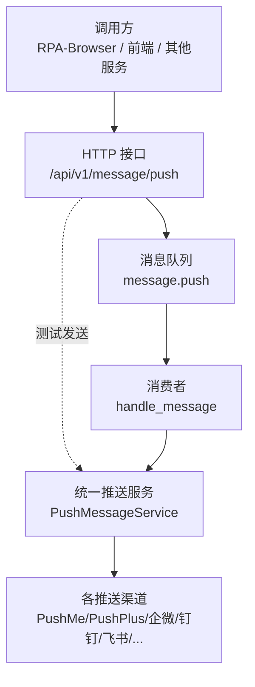
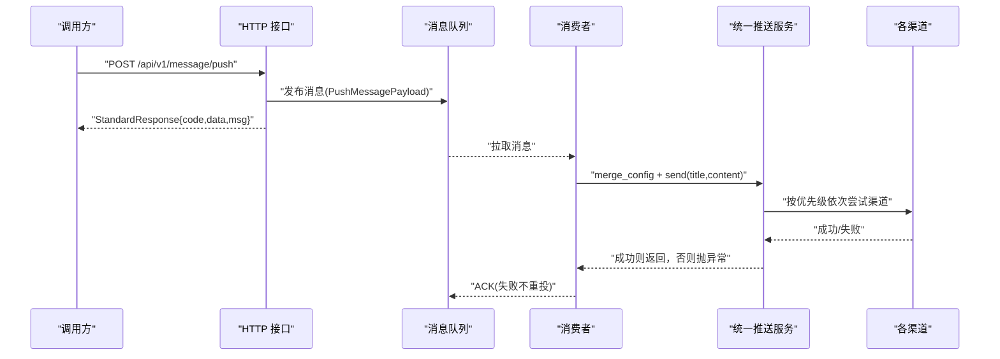
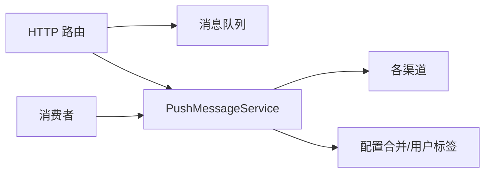

# 外部推送接口

<cite>
**本文引用的文件**
- [be-message-service/app/api/external_push.py](file://be-message-service/app/api/external_push.py)
- [be-message-service/app/consumers/external_push.py](file://be-message-service/app/consumers/external_push.py)
- [be-message-service/app/services/message/external/push.py](file://be-message-service/app/services/message/external/push.py)
- [be-message-service/app/services/message/external/push_helper.py](file://be-message-service/app/services/message/external/push_helper.py)
- [bili-common/bili_common/models/push.py](file://bili-common/bili_common/models/push.py)
- [bili-common/bili_common/rpc/push.py](file://bili-common/bili_common/rpc/push.py)
</cite>

## 目录
1. [简介](#简介)
2. [项目结构](#项目结构)
3. [核心组件](#核心组件)
4. [架构总览](#架构总览)
5. [详细组件分析](#详细组件分析)
6. [依赖关系分析](#依赖关系分析)
7. [性能与可靠性](#性能与可靠性)
8. [故障排查指南](#故障排查指南)
9. [结论](#结论)
10. [附录：API 规范与模型说明](#附录api-规范与模型说明)

## 简介
本文件为“外部推送模块”的完整 API 接口文档，覆盖以下能力：
- 推送渠道配置：支持多通道（PushMe、PushPlus、企业微信、钉钉、飞书、Bark、Gotify、Ntfy、WxPusher、iGot、go-cqhttp、Chronocat、智能微秘书、Synology Chat、SMTP 邮件、自定义 Webhook 等）
- 消息发送：提供 HTTP 异步投递与同步测试发送；同时提供 RPC 契约供系统间调用
- 状态跟踪：通过日志与返回体字段体现发送结果与失败原因
- 多渠道策略：按优先级降级分发，任一成功即停止
- 失败重试机制：消费者侧不重投，避免死信风暴；服务内部已做全渠道尝试
- 安全认证：微服务间互信，不做 JWT；用户信息通过上游网关注入的请求头解析并用于标题前缀标注
- 限流控制：HTTP 层未内置限流，建议由网关或消息队列进行流量治理
- 监控告警：基于结构化日志输出，可接入统一日志平台实现告警

## 项目结构
外部推送模块位于 message-service 中，采用“HTTP 路由 + 消息队列消费者 + 统一推送执行器”的分层设计：
- HTTP 路由：对外暴露 RESTful 接口，负责参数校验、组装消息、投递到队列或立即发送
- 消费者：消费队列中的推送请求，合并配置后调用统一推送服务
- 推送执行器：封装所有渠道实现与降级逻辑，保证高可用与可观测性

图表来源
- [be-message-service/app/api/external_push.py:36-66](file://be-message-service/app/api/external_push.py#L36-L66)
- [be-message-service/app/consumers/external_push.py:16-35](file://be-message-service/app/consumers/external_push.py#L16-L35)
- [be-message-service/app/services/message/external/push.py:664-708](file://be-message-service/app/services/message/external/push.py#L664-L708)

章节来源
- [be-message-service/app/api/external_push.py:1-162](file://be-message-service/app/api/external_push.py#L1-L162)
- [be-message-service/app/consumers/external_push.py:1-35](file://be-message-service/app/consumers/external_push.py#L1-L35)
- [be-message-service/app/services/message/external/push.py:1-726](file://be-message-service/app/services/message/external/push.py#L1-L726)

## 核心组件
- HTTP 路由层：提供三个端点
  - POST /api/v1/message/push：将推送请求投递到消息队列（异步）
  - POST /api/v1/message/push/test：立即发送测试推送（同步）
  - POST /api/v1/message/push/feedback：提交用户反馈（仅推送到全局配置）
- 消费者层：消费 message.push 队列，合并配置并调用统一推送服务
- 统一推送服务：封装所有渠道实现与降级顺序，确保至少一个渠道成功
- 配置合并工具：合并全局环境变量配置与消息内 per-user 配置，忽略空值与模板占位符
- 公共数据模型：定义 PushChannelConfig、PushMessagePayload 等跨服务复用模型

章节来源
- [be-message-service/app/api/external_push.py:36-162](file://be-message-service/app/api/external_push.py#L36-L162)
- [be-message-service/app/consumers/external_push.py:16-35](file://be-message-service/app/consumers/external_push.py#L16-L35)
- [be-message-service/app/services/message/external/push.py:160-708](file://be-message-service/app/services/message/external/push.py#L160-L708)
- [be-message-service/app/services/message/external/push_helper.py:26-37](file://be-message-service/app/services/message/external/push_helper.py#L26-L37)
- [bili-common/bili_common/models/push.py:14-153](file://bili-common/bili_common/models/push.py#L14-L153)

## 架构总览
外部推送采用“HTTP 入站 -> 队列缓冲 -> 消费者处理 -> 统一推送执行器 -> 多渠道发送”的链路。HTTP 层负责快速响应与消息解耦；消费者负责可靠处理；统一推送执行器负责渠道选择与降级；多渠道发送具备强容错与可观测性。

图表来源
- [be-message-service/app/api/external_push.py:36-66](file://be-message-service/app/api/external_push.py#L36-L66)
- [be-message-service/app/consumers/external_push.py:16-35](file://be-message-service/app/consumers/external_push.py#L16-L35)
- [be-message-service/app/services/message/external/push.py:664-708](file://be-message-service/app/services/message/external/push.py#L664-L708)

## 详细组件分析

### HTTP 接口：POST /api/v1/message/push
- 功能：投递一条推送请求到消息队列，由消费者异步分发到各渠道
- 方法：POST
- 路径：/api/v1/message/push
- 请求体：PushMessage（包含 title、content、push_type、config）
- 响应：StandardResponse{code, data, msg}
- 行为：
  - 将上游透传的用户信息拼入标题前缀
  - 构造 PushMessagePayload 并发布到 message.push 队列
  - 发布失败返回 code=500
- 错误码：
  - 200：消息已投递
  - 500：发布推送消息失败

章节来源
- [be-message-service/app/api/external_push.py:36-66](file://be-message-service/app/api/external_push.py#L36-L66)

### HTTP 接口：POST /api/v1/message/push/test
- 功能：立即发送测试推送（不经过队列），便于验证渠道配置
- 方法：POST
- 路径：/api/v1/message/push/test
- 请求体：TestPushRequest（包含 title、content、push_type、config）
- 响应：StandardResponse{code, data: TestPushResponse, msg}
- 行为：
  - 合并配置（消息内 config 优先，否则回落全局环境变量）
  - 构造 PushMessageService 并立即发送
  - 无可用渠道返回 code=400
  - 发送异常返回 code=500
- 错误码：
  - 200：测试推送已发送
  - 400：未找到可用的推送渠道
  - 500：测试推送失败

章节来源
- [be-message-service/app/api/external_push.py:69-110](file://be-message-service/app/api/external_push.py#L69-L110)

### HTTP 接口：POST /api/v1/message/push/feedback
- 功能：提交用户反馈，固定使用全局 message_config 推送到站长
- 方法：POST
- 路径：/api/v1/message/push/feedback
- 请求体：FeedbackRequest（包含 content、source、contact）
- 响应：StandardResponse{code, data: TestPushResponse, msg}
- 行为：
  - 校验内容非空
  - 生成标题前缀（用户反馈|来源 + 用户标签）
  - 合并配置（config=None 回落全局）
  - 发送失败返回 code=400/500
- 错误码：
  - 200：反馈已提交给站长
  - 400：反馈内容为空或无可用推送渠道
  - 500：提交反馈失败

章节来源
- [be-message-service/app/api/external_push.py:113-162](file://be-message-service/app/api/external_push.py#L113-L162)

### 消费者：handle_message
- 功能：消费 message.push 队列中的推送请求，合并配置并调用统一推送服务
- 行为：
  - merge_config(message) 合并全局与 per-user 配置
  - 构造 PushMessageService 并 send(title, content)
  - 捕获异常记录错误日志，消息正常 ACK（不重投）
- 注意：推送失败不重投，避免死信风暴

章节来源
- [be-message-service/app/consumers/external_push.py:16-35](file://be-message-service/app/consumers/external_push.py#L16-L35)

### 统一推送服务：PushMessageService
- 功能：整合所有渠道实现，按优先级降级分发，直到有一个渠道成功
- 关键特性：
  - 每个渠道在真正发送失败时抛出异常
  - send() 按 FALLBACK_ORDER 顺序尝试已启用渠道
  - 全部失败则抛出 RuntimeError，由消费者记录并丢弃消息
- 渠道列表与优先级：
  - pushme、pushplus_bot、smtp、telegram_bot、bark、dingding_bot、feishu_bot、serverJ、pushdeer、qmsg_bot、wecom_bot、wecom_app、gotify、ntfy、wxpusher_bot、iGot、go_cqhttp、chronocat、aibotk、chat、weplus_bot、webhook
- 附加能力：
  - 可选追加“一言”内容（hitokoto）
  - SMTP 同步发送通过线程池执行，避免阻塞事件循环

章节来源
- [be-message-service/app/services/message/external/push.py:59-83](file://be-message-service/app/services/message/external/push.py#L59-L83)
- [be-message-service/app/services/message/external/push.py:664-708](file://be-message-service/app/services/message/external/push.py#L664-L708)

### 配置合并与用户标签
- merge_config：以全局 message_config 为基准，消息内 config 优先覆盖有效字段；空值与模板占位符视为未设置
- format_user_label：根据用户 mid 与用户名生成标题前缀，便于区分推送来源

章节来源
- [be-message-service/app/services/message/external/push_helper.py:26-37](file://be-message-service/app/services/message/external/push_helper.py#L26-L37)
- [be-message-service/app/services/message/external/push_helper.py:40-51](file://be-message-service/app/services/message/external/push_helper.py#L40-L51)

### RPC 契约（系统间调用）
- 方法名：
  - push_message：异步投递到队列（等价 HTTP /api/v1/message/push）
  - send_push_now：同步立即发送（等价 HTTP /api/v1/message/push/test）
- 路由键：message.push.rpc.<method_name>
- 请求/响应模型：
  - PushRpcSendParams / PushRpcSendResult
  - PushRpcSendNowParams / PushRpcSendNowResult
- 特点：
  - 客户端通过 direct reply-to 收取响应
  - 服务端返回 StandardResponse{code, msg, data}
  - 与 HTTP 共用同一套执行器

章节来源
- [bili-common/bili_common/rpc/push.py:27-101](file://bili-common/bili_common/rpc/push.py#L27-L101)
- [bili-common/bili_common/models/push_rpc.py:1-31](file://bili-common/bili_common/models/push_rpc.py#L1-L31)

## 依赖关系分析
- HTTP 路由依赖：
  - broker、message_exchange、message_queue（消息基础设施）
  - CurrentUser（从上游注入的用户信息）
  - PushMessageService、push_helper（业务逻辑）
- 消费者依赖：
  - FastStream RabbitMQ 消费者
  - PushMessageService、push_helper
- 推送执行器依赖：
  - httpx.AsyncClient（共享异步客户端）
  - 各渠道第三方接口（PushMe、PushPlus、企业微信、钉钉、飞书、Bark、Gotify、Ntfy、WxPusher、iGot、go-cqhttp、Chronocat、智能微秘书、Synology Chat、SMTP、自定义 Webhook）

图表来源
- [be-message-service/app/api/external_push.py:17-30](file://be-message-service/app/api/external_push.py#L17-L30)
- [be-message-service/app/consumers/external_push.py:8-13](file://be-message-service/app/consumers/external_push.py#L8-L13)
- [be-message-service/app/services/message/external/push.py:33-41](file://be-message-service/app/services/message/external/push.py#L33-L41)

章节来源
- [be-message-service/app/api/external_push.py:17-30](file://be-message-service/app/api/external_push.py#L17-L30)
- [be-message-service/app/consumers/external_push.py:8-13](file://be-message-service/app/consumers/external_push.py#L8-L13)
- [be-message-service/app/services/message/external/push.py:33-41](file://be-message-service/app/services/message/external/push.py#L33-L41)

## 性能与可靠性
- 性能
  - 共享 httpx.AsyncClient 减少连接开销
  - SMTP 同步发送通过线程池执行，避免阻塞事件循环
  - 队列缓冲降低瞬时峰值对下游的影响
- 可靠性
  - 多渠道降级：任一成功即停止，提升送达率
  - 消费者不重投：避免失败消息反复重投导致死信风暴
  - 全渠道失败记录 CRITICAL 日志，便于定位与告警
- 限流与监控
  - 建议在网关或消息队列层实施限流与熔断
  - 通过结构化日志接入监控平台，对失败率、延迟、渠道成功率进行监控告警

[本节为通用指导，无需特定文件引用]

## 故障排查指南
- 常见问题
  - 无可用推送渠道：检查全局 message_config 或消息内 config 是否配置有效字段
  - 渠道发送失败：查看对应渠道返回码与日志，确认密钥、URL、权限等配置正确
  - 消费者异常：确认消息格式与字段类型符合 PushMessagePayload 模型
- 排查步骤
  - 使用 /test 接口验证单个渠道是否可用
  - 观察统一推送服务的降级顺序日志，定位失败渠道
  - 检查消费者日志，确认消息是否被正确处理
- 日志关键字
  - “开始降级推送，渠道顺序”
  - “推送成功（渠道：xxx）”
  - “渠道 xxx 推送失败，尝试下一种”
  - “【彻底推送失败】所有渠道均失败”

章节来源
- [be-message-service/app/services/message/external/push.py:664-708](file://be-message-service/app/services/message/external/push.py#L664-L708)
- [be-message-service/app/consumers/external_push.py:28-35](file://be-message-service/app/consumers/external_push.py#L28-L35)

## 结论
外部推送模块通过 HTTP + 队列 + 统一执行器的分层设计，实现了高可用、可扩展、可观测的多渠道推送能力。其核心优势包括：
- 多渠道支持与优先级降级，提升送达率
- 配置合并与用户标签，增强灵活性与可追溯性
- 消费者不重投与全渠道失败告警，保障系统稳定性
- 提供 HTTP 与 RPC 双入口，适配不同调用场景

[本节为总结性内容，无需特定文件引用]

## 附录：API 规范与模型说明

### HTTP 接口规范
- 基础路径：/api/v1/message/push
- 统一响应：StandardResponse{code, data, msg}
- 认证：微服务间互信，不做 JWT；用户信息通过上游网关注入的请求头解析

#### 接口一：POST /api/v1/message/push
- 描述：投递推送消息到队列（异步）
- 请求体：PushMessage（title、content、push_type、config）
- 响应：StandardResponse{data: {title}}
- 错误码：
  - 200：消息已投递
  - 500：发布推送消息失败

章节来源
- [be-message-service/app/api/external_push.py:36-66](file://be-message-service/app/api/external_push.py#L36-L66)

#### 接口二：POST /api/v1/message/push/test
- 描述：立即发送测试推送（同步）
- 请求体：TestPushRequest（title、content、push_type、config）
- 响应：StandardResponse{data: TestPushResponse{success, message}}
- 错误码：
  - 200：测试推送已发送
  - 400：未找到可用的推送渠道
  - 500：测试推送失败

章节来源
- [be-message-service/app/api/external_push.py:69-110](file://be-message-service/app/api/external_push.py#L69-L110)

#### 接口三：POST /api/v1/message/push/feedback
- 描述：提交用户反馈（仅推送到全局配置）
- 请求体：FeedbackRequest（content、source、contact）
- 响应：StandardResponse{data: TestPushResponse{success, message}}
- 错误码：
  - 200：反馈已提交给站长
  - 400：反馈内容为空或无可用推送渠道
  - 500：提交反馈失败

章节来源
- [be-message-service/app/api/external_push.py:113-162](file://be-message-service/app/api/external_push.py#L113-L162)

### 推送模型说明
- PushChannelConfig：推送渠道配置模型，包含各渠道所需字段（如 bark、dd_bot_secret、fskey、gobot_url、gotify_url、igot_push_key、push_key、deer_key、chat_url、push_plus_token、we_plus_bot_token、qmsg_key、qywx_origin、tg_bot_token、aibotk_key、smtp_server、pushme_key、chronocat_url、webhook_url、ntfy_url、wxpusher_app_token 等）
- PushMessagePayload：消息队列载体，包含 title、content、push_type、config

章节来源
- [bili-common/bili_common/models/push.py:14-153](file://bili-common/bili_common/models/push.py#L14-L153)

### RPC 契约说明
- 方法名：
  - push_message：异步投递到队列
  - send_push_now：同步立即发送
- 路由键：message.push.rpc.<method_name>
- 请求/响应模型：
  - PushRpcSendParams / PushRpcSendResult
  - PushRpcSendNowParams / PushRpcSendNowResult

章节来源
- [bili-common/bili_common/rpc/push.py:27-101](file://bili-common/bili_common/rpc/push.py#L27-L101)

### 多渠道推送策略
- 优先级顺序：pushme、pushplus_bot、smtp、telegram_bot、bark、dingding_bot、feishu_bot、serverJ、pushdeer、qmsg_bot、wecom_bot、wecom_app、gotify、ntfy、wxpusher_bot、iGot、go_cqhttp、chronocat、aibotk、chat、weplus_bot、webhook
- 策略说明：按顺序尝试已启用渠道，任一成功即停止；全部失败抛出异常并记录 CRITICAL 日志

章节来源
- [be-message-service/app/services/message/external/push.py:59-83](file://be-message-service/app/services/message/external/push.py#L59-L83)
- [be-message-service/app/services/message/external/push.py:664-708](file://be-message-service/app/services/message/external/push.py#L664-L708)

### 失败重试机制
- 消费者侧不重投：避免失败消息反复重投导致死信风暴
- 服务内部全渠道尝试：确保至少一个渠道成功
- 失败记录：记录最后错误与堆栈，便于定位与告警

章节来源
- [be-message-service/app/consumers/external_push.py:22-35](file://be-message-service/app/consumers/external_push.py#L22-L35)
- [be-message-service/app/services/message/external/push.py:664-708](file://be-message-service/app/services/message/external/push.py#L664-L708)

### 推送效果分析与监控告警
- 指标建议：
  - 渠道成功率、失败率、平均耗时
  - 各渠道调用次数与错误分布
  - 消费者处理延迟与积压情况
- 告警规则：
  - 连续失败阈值触发告警
  - 渠道不可用或配置错误告警
  - 消费者异常与消息堆积告警
- 日志采集：
  - 结构化日志接入统一日志平台
  - 关键字段：title、push_type、channel、status、error

[本节为通用指导，无需特定文件引用]