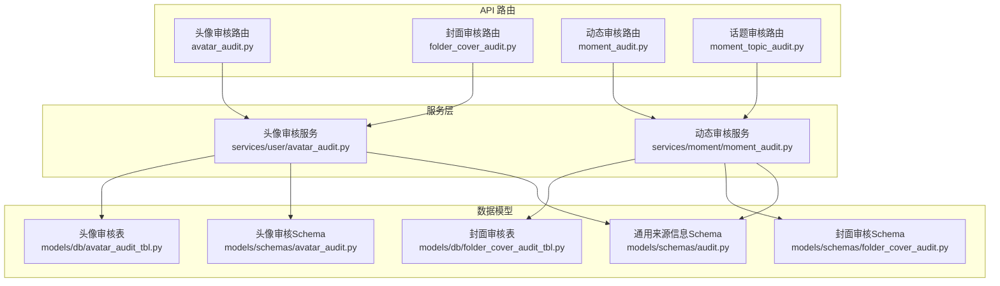
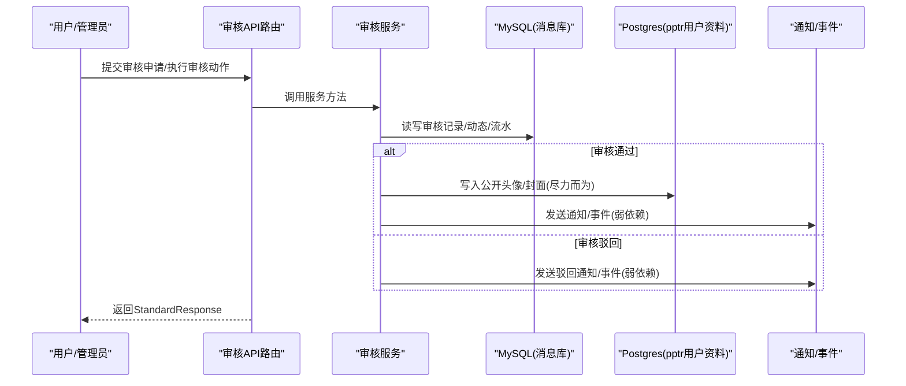
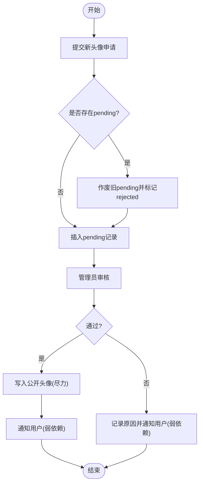
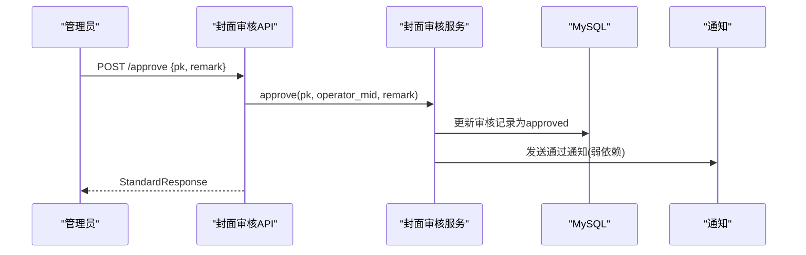
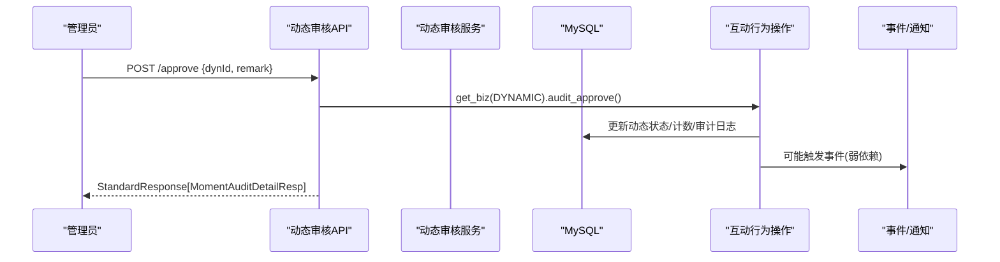
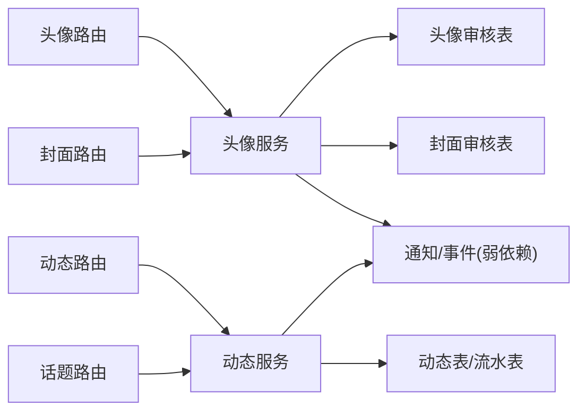

# 审核管理接口

<cite>
**本文引用的文件**
- [be-message-service/app/api/avatar_audit.py](file://be-message-service/app/api/avatar_audit.py)
- [be-message-service/app/api/folder_cover_audit.py](file://be-message-service/app/api/folder_cover_audit.py)
- [be-message-service/app/api/moment_audit.py](file://be-message-service/app/api/moment_audit.py)
- [be-message-service/app/api/moment_topic_audit.py](file://be-message-service/app/api/moment_topic_audit.py)
- [be-message-service/app/models/schemas/audit.py](file://be-message-service/app/models/schemas/audit.py)
- [be-message-service/app/models/schemas/avatar_audit.py](file://be-message-service/app/models/schemas/avatar_audit.py)
- [be-message-service/app/models/schemas/folder_cover_audit.py](file://be-message-service/app/models/schemas/folder_cover_audit.py)
- [be-message-service/app/models/db/avatar_audit_tbl.py](file://be-message-service/app/models/db/avatar_audit_tbl.py)
- [be-message-service/app/models/db/folder_cover_audit_tbl.py](file://be-message-service/app/models/db/folder_cover_audit_tbl.py)
- [be-message-service/app/services/user/avatar_audit.py](file://be-message-service/app/services/user/avatar_audit.py)
- [be-message-service/app/services/moment/moment_audit.py](file://be-message-service/app/services/moment/moment_audit.py)
</cite>

## 目录
1. [简介](#简介)
2. [项目结构](#项目结构)
3. [核心组件](#核心组件)
4. [架构总览](#架构总览)
5. [详细组件分析](#详细组件分析)
6. [依赖关系分析](#依赖关系分析)
7. [性能考虑](#性能考虑)
8. [故障排查指南](#故障排查指南)
9. [结论](#结论)
10. [附录](#附录)

## 简介
本文件为“审核管理模块”的 API 接口文档，覆盖头像审核、收藏夹封面审核、动态（Moment）审核与话题（Topic）审核等能力。文档包含：
- RESTful 接口定义：HTTP 方法、URL、请求参数、响应格式、错误码
- 审核模型说明：审核状态、结果、意见等字段
- 审核工作流：自动审核规则、人工审核流程
- 审核统计、质量分析与合规性检查支持

所有接口默认返回统一包装 StandardResponse，业务数据位于 data 字段；当 code 非 200 时以 msg 描述错误信息。

## 项目结构
审核相关代码集中在 be-message-service 中，采用“API 路由层 + 服务层 + 数据模型层”的分层组织：
- API 路由层：FastAPI Router，负责鉴权、参数校验、调用服务并封装响应
- 服务层：业务逻辑实现，含数据库操作、跨库写入、通知投递、事件上报等
- 数据模型层：SQLModel ORM 表结构与 Pydantic 请求/响应 Schema

图表来源
- [be-message-service/app/api/avatar_audit.py:1-100](file://be-message-service/app/api/avatar_audit.py#L1-L100)
- [be-message-service/app/api/folder_cover_audit.py:1-115](file://be-message-service/app/api/folder_cover_audit.py#L1-L115)
- [be-message-service/app/api/moment_audit.py:1-157](file://be-message-service/app/api/moment_audit.py#L1-L157)
- [be-message-service/app/api/moment_topic_audit.py:1-83](file://be-message-service/app/api/moment_topic_audit.py#L1-L83)
- [be-message-service/app/services/user/avatar_audit.py:1-281](file://be-message-service/app/services/user/avatar_audit.py#L1-L281)
- [be-message-service/app/services/moment/moment_audit.py:1-386](file://be-message-service/app/services/moment/moment_audit.py#L1-L386)
- [be-message-service/app/models/db/avatar_audit_tbl.py:1-52](file://be-message-service/app/models/db/avatar_audit_tbl.py#L1-L52)
- [be-message-service/app/models/db/folder_cover_audit_tbl.py:1-59](file://be-message-service/app/models/db/folder_cover_audit_tbl.py#L1-L59)
- [be-message-service/app/models/schemas/audit.py:1-41](file://be-message-service/app/models/schemas/audit.py#L1-L41)
- [be-message-service/app/models/schemas/avatar_audit.py:1-68](file://be-message-service/app/models/schemas/avatar_audit.py#L1-L68)
- [be-message-service/app/models/schemas/folder_cover_audit.py:1-71](file://be-message-service/app/models/schemas/folder_cover_audit.py#L1-L71)

章节来源
- [be-message-service/app/api/avatar_audit.py:1-100](file://be-message-service/app/api/avatar_audit.py#L1-L100)
- [be-message-service/app/api/folder_cover_audit.py:1-115](file://be-message-service/app/api/folder_cover_audit.py#L1-L115)
- [be-message-service/app/api/moment_audit.py:1-157](file://be-message-service/app/api/moment_audit.py#L1-L157)
- [be-message-service/app/api/moment_topic_audit.py:1-83](file://be-message-service/app/api/moment_topic_audit.py#L1-L83)

## 核心组件
- 头像审核：用户提交新头像后进入 pending，管理员通过 /approve 或 /reject 处理；通过后写入公开头像并通知用户
- 收藏夹封面审核：与头像审核一致，针对收藏夹封面进行先审后发
- 动态审核：提供待审核列表、统计、历史流水、详情、通过/驳回；通过时更新发布状态，驳回时记录原因并通知作者
- 话题审核：创建话题需审核，通过后发布，驳回则通知创建者

章节来源
- [be-message-service/app/api/avatar_audit.py:1-100](file://be-message-service/app/api/avatar_audit.py#L1-L100)
- [be-message-service/app/api/folder_cover_audit.py:1-115](file://be-message-service/app/api/folder_cover_audit.py#L1-L115)
- [be-message-service/app/api/moment_audit.py:1-157](file://be-message-service/app/api/moment_audit.py#L1-L157)
- [be-message-service/app/api/moment_topic_audit.py:1-83](file://be-message-service/app/api/moment_topic_audit.py#L1-L83)

## 架构总览
审核管理遵循“先审后发”原则：
- 用户侧提交变更（头像/封面/话题/动态），系统插入审核记录，保持原内容可见
- 管理员在后台对队列进行处理，通过后生效并通知用户；驳回则保留原内容并告知原因
- 部分场景（如动态转发计数）会在通过/驳回时联动调整资源计数
- 通知与事件投递采用弱依赖，失败不影响主事务

图表来源
- [be-message-service/app/services/user/avatar_audit.py:176-245](file://be-message-service/app/services/user/avatar_audit.py#L176-L245)
- [be-message-service/app/services/moment/moment_audit.py:196-386](file://be-message-service/app/services/moment/moment_audit.py#L196-L386)

## 详细组件分析

### 头像审核接口
- 基础信息
  - 路由前缀：/api/v1/user/avatar/audit
  - 权限：管理端接口仅 root 角色可访问；用户侧查询当前登录用户本人状态
- 接口清单
  - GET /mine
    - 功能：查询当前用户的头像审核状态
    - 参数：无（从当前登录用户上下文获取 UID）
    - 响应：StandardResponse[AvatarAuditMineResp | None]
    - 错误码：404 表示无记录（data 为 null）
  - GET /list
    - 功能：管理员待审核头像列表（pending）
    - 参数：page_num, page_size
    - 响应：StandardResponse[AvatarAuditListResp]
  - POST /approve
    - 功能：审核通过，写入公开头像并通知用户
    - 请求体：pk, remark（可选）
    - 响应：StandardResponse[AvatarAuditListResp]
    - 错误码：404 记录不存在或已处理
  - POST /reject
    - 功能：审核驳回，保持旧头像并通知用户
    - 请求体：pk, reason, remark（可选）
    - 响应：StandardResponse[AvatarAuditListResp]
    - 错误码：404 记录不存在或已处理
- 数据模型要点
  - 审核项：包含 pk、mid、authorName、oldAvatar、newAvatar、auditStatus、createdAt
  - 列表响应：items、total、page_num、page_size
  - 用户侧响应：新增字段 auditReason、auditedAt
- 工作流
  - 提交：同一时刻每人至多一条 pending，重复提交会作废旧 pending 并插入新记录
  - 通过：状态置 approved，写入公开头像（pptr Postgres，独立会话，失败不回滚），发送通知
  - 驳回：状态置 rejected，记录原因，发送通知

图表来源
- [be-message-service/app/services/user/avatar_audit.py:65-107](file://be-message-service/app/services/user/avatar_audit.py#L65-L107)
- [be-message-service/app/services/user/avatar_audit.py:176-245](file://be-message-service/app/services/user/avatar_audit.py#L176-L245)

章节来源
- [be-message-service/app/api/avatar_audit.py:1-100](file://be-message-service/app/api/avatar_audit.py#L1-L100)
- [be-message-service/app/models/schemas/avatar_audit.py:1-68](file://be-message-service/app/models/schemas/avatar_audit.py#L1-L68)
- [be-message-service/app/models/db/avatar_audit_tbl.py:1-52](file://be-message-service/app/models/db/avatar_audit_tbl.py#L1-L52)
- [be-message-service/app/services/user/avatar_audit.py:1-281](file://be-message-service/app/services/user/avatar_audit.py#L1-L281)

### 收藏夹封面审核接口
- 基础信息
  - 路由前缀：/api/v1/favorite/folder/cover/audit
  - 权限：管理端接口仅 root 角色可访问；用户侧查询本人某收藏夹封面审核状态
- 接口清单
  - GET /mine
    - 功能：查询指定收藏夹封面的审核状态
    - 参数：folderId（字符串）
    - 响应：StandardResponse[FolderCoverAuditMineResp | None]
    - 错误码：400 参数不合法；404 无记录
  - GET /list
    - 功能：管理员待审核封面列表（pending）
    - 参数：page_num, page_size
    - 响应：StandardResponse[FolderCoverAuditListResp]
  - POST /approve
    - 功能：审核通过，写入封面并通知用户
    - 请求体：pk, remark（可选）
    - 响应：StandardResponse[FolderCoverAuditListResp]
    - 错误码：404 记录不存在或已处理
  - POST /reject
    - 功能：审核驳回，保持原封面并通知用户
    - 请求体：pk, reason, remark（可选）
    - 响应：StandardResponse[FolderCoverAuditListResp]
    - 错误码：404 记录不存在或已处理
- 数据模型要点
  - 审核项：包含 folderId、mid、authorName、oldCover、newCover、auditStatus、createdAt
  - 列表响应：items、total、page_num、page_size
  - 用户侧响应：新增字段 auditReason、auditedAt

图表来源
- [be-message-service/app/api/folder_cover_audit.py:72-88](file://be-message-service/app/api/folder_cover_audit.py#L72-L88)
- [be-message-service/app/models/schemas/folder_cover_audit.py:36-48](file://be-message-service/app/models/schemas/folder_cover_audit.py#L36-L48)

章节来源
- [be-message-service/app/api/folder_cover_audit.py:1-115](file://be-message-service/app/api/folder_cover_audit.py#L1-L115)
- [be-message-service/app/models/schemas/folder_cover_audit.py:1-71](file://be-message-service/app/models/schemas/folder_cover_audit.py#L1-L71)
- [be-message-service/app/models/db/folder_cover_audit_tbl.py:1-59](file://be-message-service/app/models/db/folder_cover_audit_tbl.py#L1-L59)

### 动态（Moment）审核接口
- 基础信息
  - 路由前缀：/api/v1/community/audit
  - 权限：全部接口仅 root 角色可访问
- 接口清单
  - GET /list
    - 功能：管理员待审核列表（可按状态筛选）
    - 参数：auditStatus（默认 auditing）、page_num、page_size
    - 响应：StandardResponse[MomentAuditListResp]
  - GET /statistics
    - 功能：动态审核总统计（按类型+状态聚合）
    - 响应：StandardResponse[MomentAuditStatisticsResp]
  - GET /list/history
    - 功能：审核记录流水（按 dynId/操作员/时间段过滤）
    - 参数：dynId、operatorMid、fromDate、toDate、page_num、page_size
    - 响应：StandardResponse[MomentAuditLogListResp]
  - POST /approve
    - 功能：审核通过（→ normal + pubTime，写 AuditLog；FORWARD 时源动态 repostCount +1；不发通知）
    - 请求体：dynId、remark
    - 响应：StandardResponse[MomentAuditDetailResp]
    - 错误码：404 动态不存在或已处理
  - POST /reject
    - 功能：审核驳回（→ rejected + 原因，写 AuditLog，发驳回事件通知；FORWARD ∧ before=normal 时源动态 -1）
    - 请求体：dynId、rejectReason、remark
    - 响应：StandardResponse[MomentAuditDetailResp]
    - 错误码：404 动态不存在或已处理
  - GET /{dynId}
    - 功能：单条动态审核详情（含历史流转）
    - 响应：StandardResponse[MomentAuditDetailResp]
    - 错误码：404 动态不存在
- 数据模型要点
  - 审核项：包含 dynId、mid、authorName、authorFace、dynType、contentText、pubTime、createdTime、auditStatus、isTop、topicId
  - 流水项：包含 pk、dynId、operatorMid、operatorRole、fromStatus、toStatus、actionType、rejectReason、remark、createdTime
  - 统计：byType（按动态类型分桶）、byStatus（按状态聚合）、total
- 工作流
  - 列表：按 auditStatus 过滤，默认 auditing，分页倒序
  - 通过：更新状态与发布时间，写审计日志，必要时调整转发计数
  - 驳回：更新状态与原因，写审计日志，发送驳回事件通知

图表来源
- [be-message-service/app/api/moment_audit.py:100-137](file://be-message-service/app/api/moment_audit.py#L100-L137)
- [be-message-service/app/services/moment/moment_audit.py:196-386](file://be-message-service/app/services/moment/moment_audit.py#L196-L386)

章节来源
- [be-message-service/app/api/moment_audit.py:1-157](file://be-message-service/app/api/moment_audit.py#L1-L157)
- [be-message-service/app/services/moment/moment_audit.py:1-386](file://be-message-service/app/services/moment/moment_audit.py#L1-L386)

### 话题（Topic）审核接口
- 基础信息
  - 路由前缀：/api/v1/community/topic/audit
  - 权限：仅 root 角色可访问
- 接口清单
  - GET /list
    - 功能：管理员话题待审核列表（auditing 队列分页）
    - 参数：page_num、page_size
    - 响应：StandardResponse[MomentTopicAuditListResp]
  - POST /approve
    - 功能：审核通过（→ normal + pubTime=now()，不发通知）
    - 请求体：topicId、remark（可选）
    - 响应：StandardResponse[MomentTopicAuditListResp]
    - 错误码：404 话题不存在或已处理
  - POST /reject
    - 功能：审核驳回（→ rejected + 原因，发驳回通知给创建者）
    - 请求体：topicId、rejectReason、remark（可选）
    - 响应：StandardResponse[MomentTopicAuditListResp]
    - 错误码：404 话题不存在或已处理

章节来源
- [be-message-service/app/api/moment_topic_audit.py:1-83](file://be-message-service/app/api/moment_topic_audit.py#L1-L83)

### 通用来源信息与模型
- 审核项的内容来源（AuditSourceInfo）用于管理端点击直达原始内容：
  - kind：来源大类（comment/dm）
  - biz_type：业务类型
  - label：人类可读的来源名
  - oid：业务实体 id（字符串）
  - up_mid：内容作者 mid
  - url：站内相对路径
  - external_url：站外原始内容链接
  - params：附加定位参数（rpid/msgkey/session_key）

章节来源
- [be-message-service/app/models/schemas/audit.py:1-41](file://be-message-service/app/models/schemas/audit.py#L1-L41)

## 依赖关系分析
- 路由层依赖服务层：各审核路由调用对应 Service 完成业务逻辑
- 服务层依赖数据模型：使用 SQLModel 表结构进行持久化
- 跨库写入：头像/封面审核通过时会尝试写入 pptr Postgres 公开资料，失败不阻塞主事务
- 通知与事件：采用弱依赖机制，确保审核主流程不受影响

图表来源
- [be-message-service/app/api/avatar_audit.py:1-100](file://be-message-service/app/api/avatar_audit.py#L1-L100)
- [be-message-service/app/api/folder_cover_audit.py:1-115](file://be-message-service/app/api/folder_cover_audit.py#L1-L115)
- [be-message-service/app/api/moment_audit.py:1-157](file://be-message-service/app/api/moment_audit.py#L1-L157)
- [be-message-service/app/api/moment_topic_audit.py:1-83](file://be-message-service/app/api/moment_topic_audit.py#L1-L83)
- [be-message-service/app/services/user/avatar_audit.py:1-281](file://be-message-service/app/services/user/avatar_audit.py#L1-L281)
- [be-message-service/app/services/moment/moment_audit.py:1-386](file://be-message-service/app/services/moment/moment_audit.py#L1-L386)

章节来源
- [be-message-service/app/services/user/avatar_audit.py:176-245](file://be-message-service/app/services/user/avatar_audit.py#L176-L245)
- [be-message-service/app/services/moment/moment_audit.py:161-186](file://be-message-service/app/services/moment/moment_audit.py#L161-L186)

## 性能考虑
- 列表查询分页：所有列表接口均支持 page_num/page_size，并对 size 做上限限制（≤50）
- 统计聚合：动态审核统计使用 GROUP BY 一次聚合，避免循环 COUNT
- 作者信息降级：取作者昵称/头像为弱依赖，失败时返回空，不阻塞审核主流程
- 跨库写入：头像/封面审核通过时写入公开资料为异步/独立会话，失败仅告警
- 通知/事件：弱依赖投递，失败不影响审核事务

章节来源
- [be-message-service/app/services/moment/moment_audit.py:246-297](file://be-message-service/app/services/moment/moment_audit.py#L246-L297)
- [be-message-service/app/services/user/avatar_audit.py:202-211](file://be-message-service/app/services/user/avatar_audit.py#L202-L211)
- [be-message-service/app/services/moment/moment_audit.py:103-115](file://be-message-service/app/services/moment/moment_audit.py#L103-L115)

## 故障排查指南
- 常见错误码
  - 400：参数不合法（如封面审核的 folderId 解析失败）
  - 404：记录不存在或已处理（头像/封面/动态/话题审核）
- 排查步骤
  - 确认请求参数类型与必填字段
  - 检查审核记录是否已被处理（重复审核会被拒绝）
  - 查看服务日志中的跨库写入与通知投递异常
  - 对于动态审核，关注 FORWARD 场景下的源动态计数变化
- 典型问题
  - 审核通过后未显示新头像/封面：检查 pptr 写入是否成功（弱依赖，失败仅告警）
  - 审核驳回未收到通知：检查通知/事件投递是否成功（弱依赖，失败仅告警）

章节来源
- [be-message-service/app/api/folder_cover_audit.py:27-52](file://be-message-service/app/api/folder_cover_audit.py#L27-L52)
- [be-message-service/app/api/avatar_audit.py:67-96](file://be-message-service/app/api/avatar_audit.py#L67-L96)
- [be-message-service/app/api/moment_audit.py:110-137](file://be-message-service/app/api/moment_audit.py#L110-L137)
- [be-message-service/app/api/moment_topic_audit.py:50-79](file://be-message-service/app/api/moment_topic_audit.py#L50-L79)

## 结论
本审核管理模块实现了头像、封面、动态与话题的“先审后发”机制，提供完整的管理端接口与用户侧查询能力。通过统一的 StandardResponse 包装、严格的权限控制与弱依赖的通知/事件机制，在保证审核流程可靠性的同时兼顾了系统稳定性与可扩展性。建议在生产环境结合监控与告警，重点关注跨库写入与通知投递的异常情况。

## 附录
- 审核状态枚举（示例）
  - 头像/封面：pending/approved/rejected
  - 动态：auditing/normal/rejected/hidden
- 审核意见字段
  - rejectReason：驳回原因
  - remark：审核备注（可选）
- 数据来源
  - 管理端列表与详情来自 MySQL 主库（消息库）
  - 用户资料（昵称/头像）来自 pptr Postgres（只读回查）