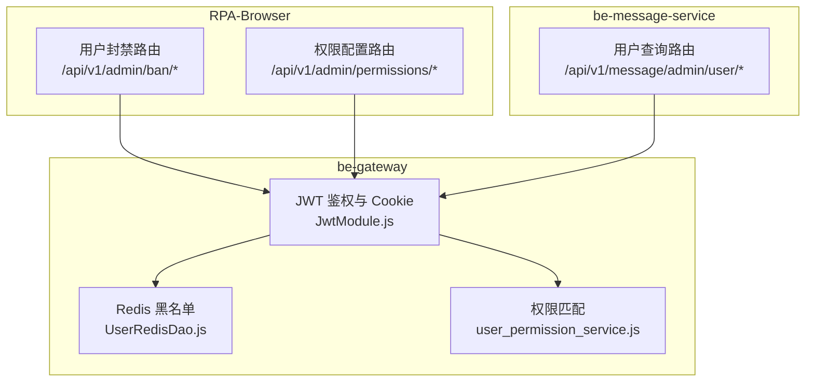
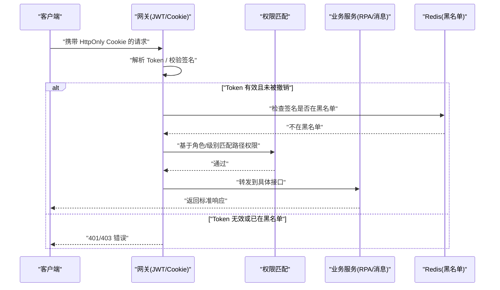
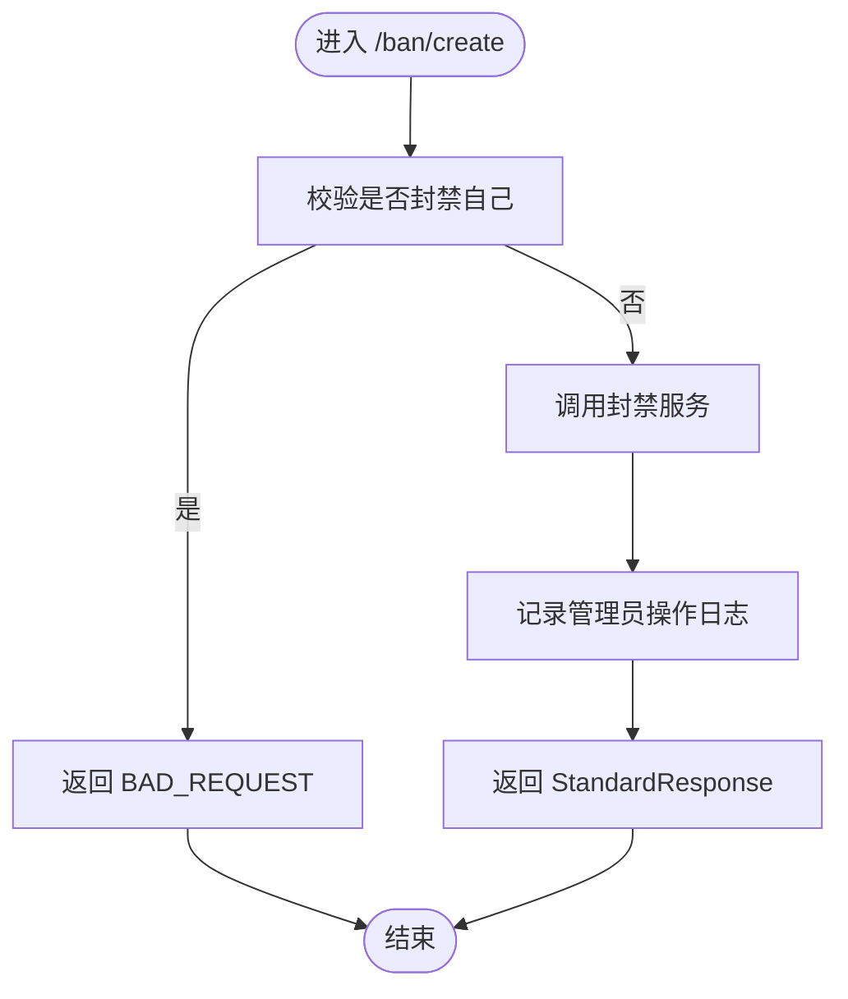
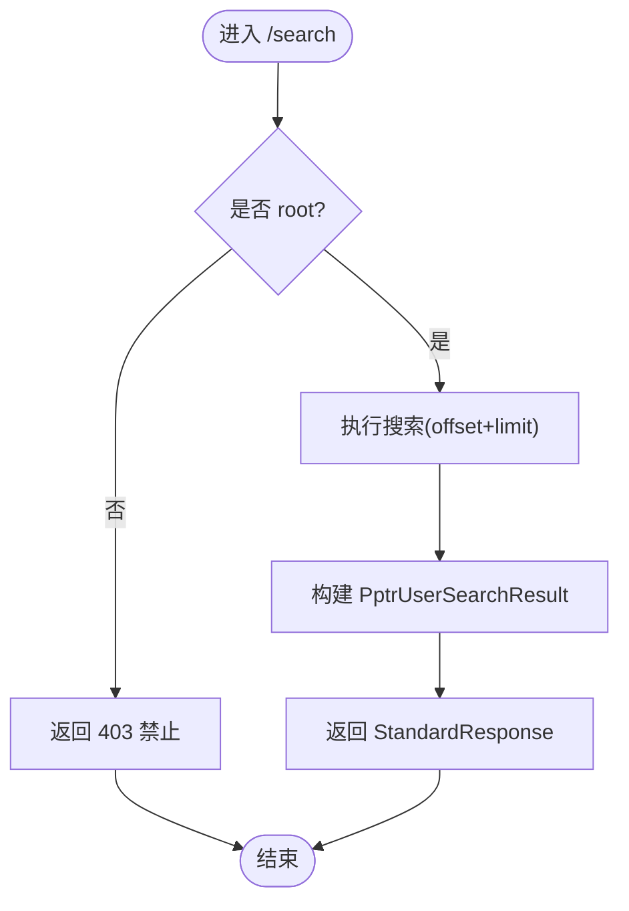
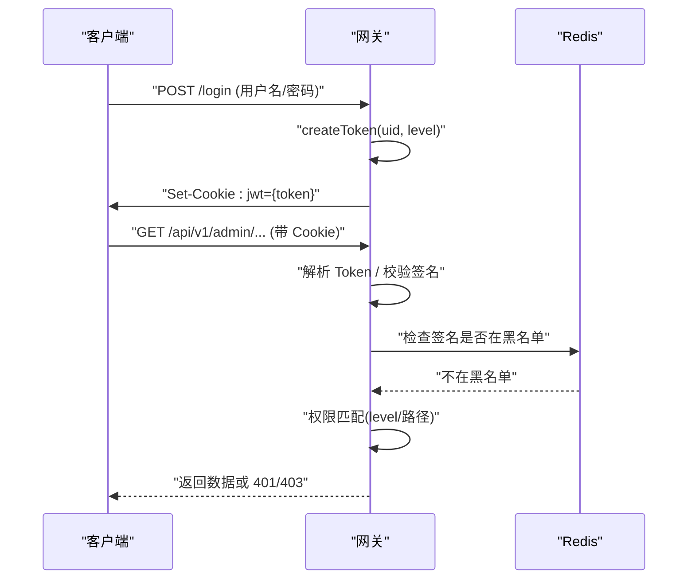
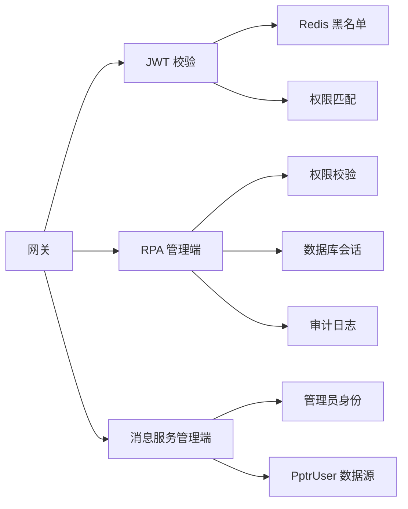

# 用户管理接口

<cite>
**本文引用的文件**
- [user_ban_router.py](file://RPA-Browser/app/controller/v1/admin/user_ban_router.py)
- [permission_router.py](file://RPA-Browser/app/controller/v1/admin/permission_router.py)
- [user_ban.py](file://RPA-Browser/app/models/system/user_ban.py)
- [user.py](file://be-message-service/app/api/user.py)
- [JwtModule.js](file://be-gateway/ExpressServerEnd/Service/user_permission_module/JwtModule.js)
- [UserRedisDao.js](file://be-gateway/ExpressServerEnd/DAO/UserRedisDao.js)
- [user_permission_service.js](file://be-gateway/ExpressServerEnd/Service/user_permission_module/user_permission_service.js)
</cite>

## 目录
1. [简介](#简介)
2. [项目结构](#项目结构)
3. [核心组件](#核心组件)
4. [架构总览](#架构总览)
5. [详细组件分析](#详细组件分析)
6. [依赖关系分析](#依赖关系分析)
7. [性能考虑](#性能考虑)
8. [故障排查指南](#故障排查指南)
9. [结论](#结论)
10. [附录](#附录)

## 简介
本文件为用户管理模块的 API 接口文档，覆盖以下能力：
- 用户信息查询与搜索（消息服务管理端）
- 权限配置读取、更新与重置（RPA 管理端）
- 用户封禁/解封与封禁状态查询（RPA 管理端）
- 认证与会话：JWT 签发、Cookie 设置、黑名单校验、可选鉴权中间件
- 安全策略：Token 有效期、Cookie 安全标志、签名黑名单、权限匹配

说明：
- 本仓库包含多个子系统，用户相关能力分布在 RPA-Browser（管理端）、be-message-service（消息服务管理端）以及 be-gateway（网关鉴权）。
- 本文档仅基于已检索到的代码进行整理，未涉及的能力不在此展开。

## 项目结构
围绕用户管理的代码主要位于：
- RPA-Browser：管理员侧的用户封禁、权限配置等接口
- be-message-service：管理端批量查询用户信息、按关键字搜索用户
- be-gateway：JWT 鉴权、Cookie 管理、权限匹配与黑名单校验

图表来源
- [user_ban_router.py:1-188](file://RPA-Browser/app/controller/v1/admin/user_ban_router.py#L1-L188)
- [permission_router.py:1-77](file://RPA-Browser/app/controller/v1/admin/permission_router.py#L1-L77)
- [user.py:1-86](file://be-message-service/app/api/user.py#L1-L86)
- [JwtModule.js:35-155](file://be-gateway/ExpressServerEnd/Service/user_permission_module/JwtModule.js#L35-L155)
- [UserRedisDao.js:1-27](file://be-gateway/ExpressServerEnd/DAO/UserRedisDao.js#L1-L27)
- [user_permission_service.js:1-46](file://be-gateway/ExpressServerEnd/Service/user_permission_module/user_permission_service.js#L1-L46)

章节来源
- [user_ban_router.py:1-188](file://RPA-Browser/app/controller/v1/admin/user_ban_router.py#L1-L188)
- [permission_router.py:1-77](file://RPA-Browser/app/controller/v1/admin/permission_router.py#L1-L77)
- [user.py:1-86](file://be-message-service/app/api/user.py#L1-L86)
- [JwtModule.js:35-155](file://be-gateway/ExpressServerEnd/Service/user_permission_module/JwtModule.js#L35-L155)
- [UserRedisDao.js:1-27](file://be-gateway/ExpressServerEnd/DAO/UserRedisDao.js#L1-L27)
- [user_permission_service.js:1-46](file://be-gateway/ExpressServerEnd/Service/user_permission_module/user_permission_service.js#L1-L46)

## 核心组件
- 用户封禁管理（RPA 管理端）
  - 封禁用户、解封用户、分页查询封禁记录、查询封禁状态
- 权限配置管理（RPA 管理端）
  - 获取权限配置、更新权限配置、重置为默认值
- 用户信息查询（消息服务管理端）
  - 按 mid 批量查询用户信息、按关键字搜索用户
- 认证与会话（网关）
  - JWT 签发与验证、HttpOnly Cookie 设置、过期与黑名单处理、可选鉴权中间件

章节来源
- [user_ban_router.py:57-184](file://RPA-Browser/app/controller/v1/admin/user_ban_router.py#L57-L184)
- [permission_router.py:14-76](file://RPA-Browser/app/controller/v1/admin/permission_router.py#L14-L76)
- [user.py:40-82](file://be-message-service/app/api/user.py#L40-L82)
- [JwtModule.js:43-155](file://be-gateway/ExpressServerEnd/Service/user_permission_module/JwtModule.js#L43-L155)

## 架构总览
下图展示一次受保护的管理端请求在网关与后端之间的交互流程，包括 JWT 校验、黑名单检查与权限匹配。

图表来源
- [JwtModule.js:63-155](file://be-gateway/ExpressServerEnd/Service/user_permission_module/JwtModule.js#L63-L155)
- [UserRedisDao.js:10-21](file://be-gateway/ExpressServerEnd/DAO/UserRedisDao.js#L10-L21)
- [user_permission_service.js:15-46](file://be-gateway/ExpressServerEnd/Service/user_permission_module/user_permission_service.js#L15-L46)

## 详细组件分析

### 用户封禁管理（RPA 管理端）
- 基础信息
  - 前缀：/api/v1/admin
  - 标签：admin_management
  - 权限：root 或持有 user:ban（封禁/解封）、user:ban-view（查看）
  - 生效范围：仅 RPA 服务（被封禁用户访问 RPA 接口时由中间件拦截）

- 接口清单
  - POST /api/v1/admin/ban/create
    - 功能：封禁用户（永久/临时）
    - 请求体：BanUserRequest
      - mid: int（目标用户）
      - ban_type: string（permanent/temporary）
      - duration_minutes: int?（临时时长分钟数）
      - expired_at: datetime?（临时到期时间，优先于 duration_minutes）
      - reason: string（理由）
      - note: string（备注）
    - 成功响应：StandardResponse<UserBanItemResp>
    - 失败码：BAD_REQUEST（如 self-ban）、INTERNAL_ERROR
  - POST /api/v1/admin/ban/lift
    - 功能：解封用户
    - 请求体：LiftBanRequest
      - mid: int
      - reason: string
    - 成功响应：StandardResponse<UserBanItemResp>
    - 失败码：NOT_FOUND（当前未封禁）、INTERNAL_ERROR
  - POST /api/v1/admin/ban/list
    - 功能：分页查询封禁记录
    - 查询参数：page, per_page, mid?, status?（active/lifted/expired）
    - 成功响应：StandardResponse<BanListResponse>
    - 失败码：INTERNAL_ERROR
  - POST /api/v1/admin/ban/status
    - 功能：查询指定用户当前封禁状态（临时封禁到期自动失效）
    - 请求体：BanStatusRequest
      - mid: int
    - 成功响应：StandardResponse<BanStatusResponse>
    - 失败码：INTERNAL_ERROR

- 数据模型
  - BanUserRequest、LiftBanRequest、UserBanItemResp、BanListRequest、BanListResponse、BanStatusRequest、BanStatusResponse
  - 字段见“附录：数据模型”

- 流程图（封禁用户）

图表来源
- [user_ban_router.py:57-88](file://RPA-Browser/app/controller/v1/admin/user_ban_router.py#L57-L88)
- [user_ban.py:13-54](file://RPA-Browser/app/models/system/user_ban.py#L13-L54)

章节来源
- [user_ban_router.py:57-184](file://RPA-Browser/app/controller/v1/admin/user_ban_router.py#L57-L184)
- [user_ban.py:13-97](file://RPA-Browser/app/models/system/user_ban.py#L13-L97)

### 权限配置管理（RPA 管理端）
- 基础信息
  - 前缀：/api/v1/admin
  - 标签：admin_management
  - 权限：管理员（内部实现以服务层控制）

- 接口清单
  - POST /api/v1/admin/permissions/get
    - 功能：获取权限配置
    - 成功响应：StandardResponse<PermissionConfigList>
  - POST /api/v1/admin/permissions/update
    - 功能：更新权限配置
    - 请求体：PermissionConfigList
    - 成功响应：StandardResponse<dict>（包含 levels_count）
  - POST /api/v1/admin/permissions/reset
    - 功能：重置权限配置为默认值
    - 成功响应：StandardResponse<dict>

章节来源
- [permission_router.py:14-76](file://RPA-Browser/app/controller/v1/admin/permission_router.py#L14-L76)

### 用户信息查询（消息服务管理端）
- 基础信息
  - 前缀：/api/v1/message/admin/user
  - 标签：message-admin-user
  - 权限：系统管理员 root（搜索接口强制要求 root）

- 接口清单
  - GET /api/v1/message/admin/user/batch
    - 功能：按 mid 批量查询用户信息（昵称/头像/等级/大会员/性别/签名）
    - 查询参数：mids: list[StrInt]
    - 成功响应：StandardResponse<List<CommentUserBrief>>
  - GET /api/v1/message/admin/user/search
    - 功能：按昵称/注册名/mid/邮箱搜索用户
    - 查询参数：keyword, offset, limit
    - 成功响应：StandardResponse<PptrUserSearchResult>
    - 失败：非 root 返回 403

- 流程图（搜索用户）

图表来源
- [user.py:63-82](file://be-message-service/app/api/user.py#L63-L82)

章节来源
- [user.py:25-82](file://be-message-service/app/api/user.py#L25-L82)

### 认证与会话（网关）
- JWT 与 Cookie
  - 签发：createToken(payload)，payload 包含 uid、level（角色）
  - 有效期：15 天（秒级）
  - 算法：HS256
  - Cookie：HttpOnly、SameSite=lax、path=/、maxAge=15 天；secure 根据环境变量或生产环境决定
  - 可选鉴权：jwtAuthOptional（credentialsRequired=false），有 token 则解析，无 token 不报错
  - 强制鉴权：jwtAuthGenerator({ credentialsRequired=true })

- 黑名单与撤销
  - 黑名单键：jwt_black_list:{signature}
  - 校验：is_jwt_signature_in_black_list
  - 加入黑名单：add_black_list_jwt_signature(signature, ttl)

- 权限匹配
  - 使用 express-jwt-permissions，基于 req.auth.level 与路径模式匹配
  - 支持通配符 * 的路径匹配

- 序列图（登录与鉴权）

图表来源
- [JwtModule.js:43-155](file://be-gateway/ExpressServerEnd/Service/user_permission_module/JwtModule.js#L43-L155)
- [UserRedisDao.js:10-21](file://be-gateway/ExpressServerEnd/DAO/UserRedisDao.js#L10-L21)
- [user_permission_service.js:15-46](file://be-gateway/ExpressServerEnd/Service/user_permission_module/user_permission_service.js#L15-L46)

章节来源
- [JwtModule.js:35-155](file://be-gateway/ExpressServerEnd/Service/user_permission_module/JwtModule.js#L35-L155)
- [UserRedisDao.js:1-27](file://be-gateway/ExpressServerEnd/DAO/UserRedisDao.js#L1-L27)
- [user_permission_service.js:1-46](file://be-gateway/ExpressServerEnd/Service/user_permission_module/user_permission_service.js#L1-L46)

## 依赖关系分析
- RPA 管理端接口依赖：
  - 权限校验：require_permission(UserPermission.*)
  - 数据库会话：DatabaseSessionManager.async_session()
  - 审计日志：log_admin_action(...)
- 消息服务管理端接口依赖：
  - 管理员身份：MsgAdminUser（root 校验）
  - 用户数据源：PptrUser（只读 Postgres）
- 网关依赖：
  - JWT：express-jwt + express-jwt-permissions
  - Redis：黑名单存储与查询
  - 权限树：Trie 匹配路径模式

图表来源
- [user_ban_router.py:11-34](file://RPA-Browser/app/controller/v1/admin/user_ban_router.py#L11-L34)
- [user.py:16-20](file://be-message-service/app/api/user.py#L16-L20)
- [JwtModule.js:63-155](file://be-gateway/ExpressServerEnd/Service/user_permission_module/JwtModule.js#L63-L155)
- [UserRedisDao.js:10-21](file://be-gateway/ExpressServerEnd/DAO/UserRedisDao.js#L10-L21)
- [user_permission_service.js:15-46](file://be-gateway/ExpressServerEnd/Service/user_permission_module/user_permission_service.js#L15-L46)

章节来源
- [user_ban_router.py:11-34](file://RPA-Browser/app/controller/v1/admin/user_ban_router.py#L11-L34)
- [user.py:16-20](file://be-message-service/app/api/user.py#L16-L20)
- [JwtModule.js:63-155](file://be-gateway/ExpressServerEnd/Service/user_permission_module/JwtModule.js#L63-L155)
- [UserRedisDao.js:10-21](file://be-gateway/ExpressServerEnd/DAO/UserRedisDao.js#L10-L21)
- [user_permission_service.js:15-46](file://be-gateway/ExpressServerEnd/Service/user_permission_module/user_permission_service.js#L15-L46)

## 性能考虑
- 分页与过滤
  - 封禁列表采用 offset/limit 分页，建议合理设置 per_page，避免过大页导致数据库压力
  - 支持按 mid、status 过滤，减少不必要扫描
- 黑名单查询
  - Redis 单键 O(1) 查询，注意 TTL 设置与键空间膨胀
- 权限匹配
  - Trie 结构对路径匹配高效，适合大量规则场景
- 批量查询
  - 用户批量查询按 mid 列表一次性拉取，减少多次往返

## 故障排查指南
- 401/403
  - 检查 Cookie 是否携带、是否 HttpOnly、Secure 配置是否正确
  - 检查 Token 是否过期或被加入黑名单
  - 检查权限级别是否满足路径要求
- 404
  - 解封接口返回 NOT_FOUND：确认用户当前处于封禁状态
- 500
  - 关注服务端日志中的异常堆栈，定位数据库或外部依赖问题
- 封禁状态异常
  - 临时封禁到期应自动失效，若未生效，检查服务逻辑与数据库状态

章节来源
- [user_ban_router.py:84-109](file://RPA-Browser/app/controller/v1/admin/user_ban_router.py#L84-L109)
- [user_ban_router.py:152-184](file://RPA-Browser/app/controller/v1/admin/user_ban_router.py#L152-L184)
- [JwtModule.js:63-155](file://be-gateway/ExpressServerEnd/Service/user_permission_module/JwtModule.js#L63-L155)

## 结论
本模块提供了完整的用户管理闭环：从认证与会话、权限控制，到用户信息查询与封禁治理。通过网关层的 JWT 与权限匹配，结合后端的细粒度权限与审计日志，实现了可追溯、可管控的管理能力。建议在后续迭代中完善密码策略与账户锁定策略的具体实现，并补充更多用户生命周期管理接口。

## 附录

### 数据模型
- 封禁相关
  - BanUserRequest：mid, ban_type, duration_minutes, expired_at, reason, note
  - LiftBanRequest：mid, reason
  - UserBanItemResp：id, mid, ban_type, status, scope, reason, banned_by, banned_at, expired_at, lifted_by, lifted_at, lift_reason, note
  - BanListRequest：mid?, status?
  - BanListResponse：分页封装
  - BanStatusRequest：mid
  - BanStatusResponse：mid, is_banned, ban_type, reason, expired_at, banned_at, ban_id

- 用户查询相关
  - CommentUserBrief：用于批量查询返回的用户简要信息
  - PptrUserSearchResult：items, has_more

章节来源
- [user_ban.py:13-97](file://RPA-Browser/app/models/system/user_ban.py#L13-L97)
- [user.py:40-82](file://be-message-service/app/api/user.py#L40-L82)

### 错误码定义
- ResponseCode.BAD_REQUEST：请求参数错误或业务约束不满足（如封禁自己）
- ResponseCode.NOT_FOUND：资源不存在（如解封未封禁用户）
- ResponseCode.INTERNAL_ERROR：服务器内部错误
- HTTP 401/403：网关层鉴权失败（未认证或权限不足）

章节来源
- [user_ban_router.py:63-88](file://RPA-Browser/app/controller/v1/admin/user_ban_router.py#L63-L88)
- [user_ban_router.py:97-109](file://RPA-Browser/app/controller/v1/admin/user_ban_router.py#L97-L109)
- [user.py:77-79](file://be-message-service/app/api/user.py#L77-L79)

### 安全与策略
- 密码策略
  - 当前代码未提供密码策略实现细节，建议在登录与修改密码接口增加复杂度校验与历史密码限制
- 账户锁定策略
  - 当前代码未提供连续失败锁定实现，建议引入失败计数与冷却期机制
- 会话与 Token
  - Token 有效期：15 天
  - Cookie：HttpOnly、SameSite=lax、path=/；secure 按环境或环境变量控制
  - 黑名单：支持将已签发的 Token 签名加入 Redis 黑名单以实现即时失效
- 权限控制
  - 基于角色/级别与路径模式的权限匹配，支持通配符

章节来源
- [JwtModule.js:35-155](file://be-gateway/ExpressServerEnd/Service/user_permission_module/JwtModule.js#L35-L155)
- [UserRedisDao.js:10-21](file://be-gateway/ExpressServerEnd/DAO/UserRedisDao.js#L10-L21)
- [user_permission_service.js:15-46](file://be-gateway/ExpressServerEnd/Service/user_permission_module/user_permission_service.js#L15-L46)