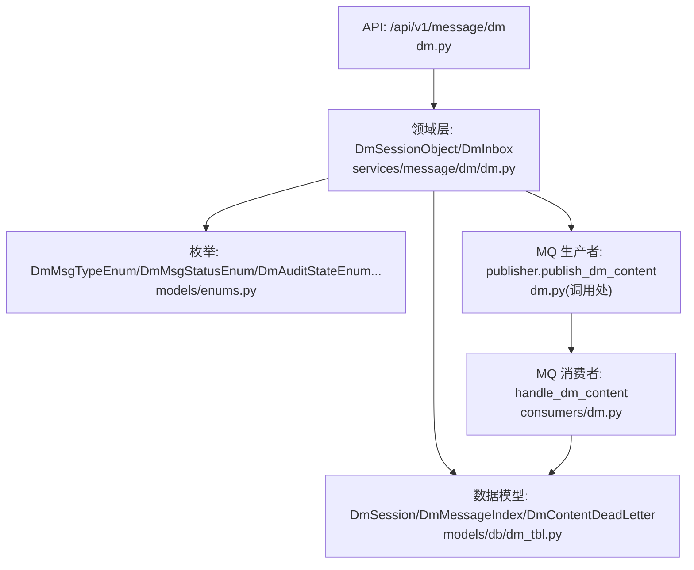
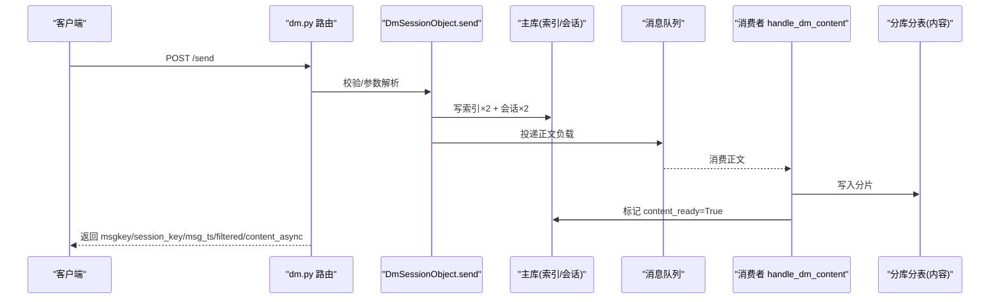
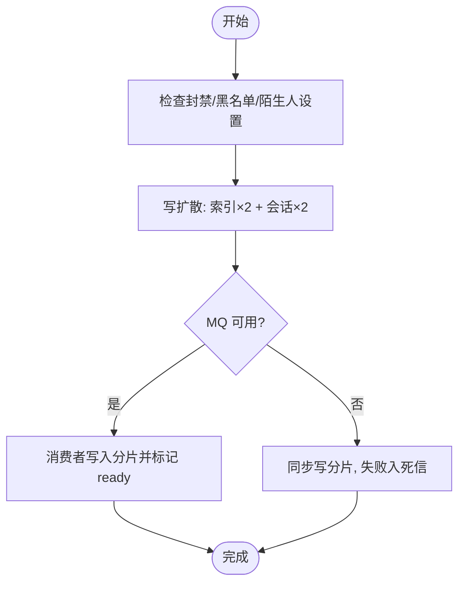
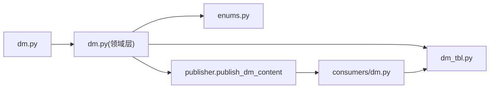

# 私信管理接口

<cite>
**本文引用的文件**
- [be-message-service/app/api/dm.py](file://be-message-service/app/api/dm.py)
- [be-message-service/app/api/dm_admin.py](file://be-message-service/app/api/dm_admin.py)
- [be-message-service/app/services/message/dm/dm.py](file://be-message-service/app/services/message/dm/dm.py)
- [be-message-service/app/consumers/dm.py](file://be-message-service/app/consumers/dm.py)
- [be-message-service/app/models/db/dm_tbl.py](file://be-message-service/app/models/db/dm_tbl.py)
- [be-message-service/app/models/enums.py](file://be-message-service/app/models/enums.py)
</cite>

## 目录
1. [简介](#简介)
2. [项目结构](#项目结构)
3. [核心组件](#核心组件)
4. [架构总览](#架构总览)
5. [详细组件分析](#详细组件分析)
6. [依赖关系分析](#依赖关系分析)
7. [性能与可用性](#性能与可用性)
8. [故障排查指南](#故障排查指南)
9. [结论](#结论)
10. [附录：消息模型与字段说明](#附录消息模型与字段说明)

## 简介
本文件为私信管理模块的 API 接口文档，覆盖私信发送、会话列表、聊天记录拉取、删除/撤回、已读标记、未读数统计，以及管理端审核、会话上下文查看与全局统计等能力。同时说明消息存储分层、异步正文落库、死信补偿、陌生人过滤、封禁控制、权限与审计等关键机制。

## 项目结构
私信模块位于 be-message-service 中，HTTP 路由集中在 dm.py（用户侧）与 dm_admin.py（管理端），领域逻辑在 services/message/dm/dm.py，数据库模型在 models/db/dm_tbl.py，枚举定义在 models/enums.py，MQ 消费者在 consumers/dm.py。

图表来源
- [be-message-service/app/api/dm.py:1-208](file://be-message-service/app/api/dm.py#L1-L208)
- [be-message-service/app/services/message/dm/dm.py:1-800](file://be-message-service/app/services/message/dm/dm.py#L1-L800)
- [be-message-service/app/consumers/dm.py:1-54](file://be-message-service/app/consumers/dm.py#L1-L54)
- [be-message-service/app/models/db/dm_tbl.py:1-179](file://be-message-service/app/models/db/dm_tbl.py#L1-L179)
- [be-message-service/app/models/enums.py:44-94](file://be-message-service/app/models/enums.py#L44-L94)

章节来源
- [be-message-service/app/api/dm.py:1-208](file://be-message-service/app/api/dm.py#L1-L208)
- [be-message-service/app/api/dm_admin.py:1-218](file://be-message-service/app/api/dm_admin.py#L1-L218)
- [be-message-service/app/services/message/dm/dm.py:1-800](file://be-message-service/app/services/message/dm/dm.py#L1-L800)
- [be-message-service/app/consumers/dm.py:1-54](file://be-message-service/app/consumers/dm.py#L1-L54)
- [be-message-service/app/models/db/dm_tbl.py:1-179](file://be-message-service/app/models/db/dm_tbl.py#L1-L179)
- [be-message-service/app/models/enums.py:44-94](file://be-message-service/app/models/enums.py#L44-L94)

## 核心组件
- 用户侧 HTTP 路由：发送、会话列表、聊天记录、删除/撤回、已读、未读总数
- 管理端 HTTP 路由：审核、批量审核、审核队列、会话上下文、统计
- 领域对象：DmSessionObject（单段会话）、DmInbox（收件箱）
- 存储层：会话表、索引表、内容分片（按 msgkey 时间路由到月度库+分表）、死信表
- MQ 消费：正文异步写入与就绪标记、失败转死信并 ack

章节来源
- [be-message-service/app/api/dm.py:1-208](file://be-message-service/app/api/dm.py#L1-L208)
- [be-message-service/app/api/dm_admin.py:1-218](file://be-message-service/app/api/dm_admin.py#L1-L218)
- [be-message-service/app/services/message/dm/dm.py:1-800](file://be-message-service/app/services/message/dm/dm.py#L1-L800)
- [be-message-service/app/consumers/dm.py:1-54](file://be-message-service/app/consumers/dm.py#L1-L54)
- [be-message-service/app/models/db/dm_tbl.py:1-179](file://be-message-service/app/models/db/dm_tbl.py#L1-L179)

## 架构总览
私信采用“写扩散 + 内容异步化”的架构：
- 同步路径：生成 msgkey → 写双方索引行与会话行（决定“立刻可见”）→ 投递正文到 MQ
- 异步路径：消费者将正文写入月度库分片，成功后回写索引 content_ready 标志
- 兜底与补偿：MQ 不可用降级同步写；仍失败则入死信表，定时任务重试

图表来源
- [be-message-service/app/api/dm.py:58-83](file://be-message-service/app/api/dm.py#L58-L83)
- [be-message-service/app/services/message/dm/dm.py:253-361](file://be-message-service/app/services/message/dm/dm.py#L253-L361)
- [be-message-service/app/consumers/dm.py:24-50](file://be-message-service/app/consumers/dm.py#L24-L50)

## 详细组件分析

### 用户侧私信接口（/api/v1/message/dm）
- 发送私信
  - 方法/路径：POST /api/v1/message/dm/send
  - 鉴权：登录用户
  - 请求体：包含接收方 mid、消息类型、内容、可选对方昵称/头像等（具体字段见附录）
  - 响应：StandardResponse[DmSendResp]，含 msgkey、session_key、msg_ts、filtered、content_async
  - 行为要点：
    - 封禁校验：被封禁 DM 服务的用户禁止发送
    - 陌生人过滤：若对方关闭陌生人私信，仅保留在发送方视角（filtered=true）
    - 先发后审：可配置开启，此时对接收方显示“审核中”，不增加未读
    - 正文异步：优先走 MQ，不可用时降级同步写，仍失败则入死信
- 会话列表
  - 方法/路径：GET /api/v1/message/dm/sessions
  - 查询参数：relation（normal/stranger/空）、page_num、page_size
  - 响应：StandardResponse[DmSessionListResp]
- 删除会话
  - 方法/路径：POST /api/v1/message/dm/session/delete
  - 请求体：talker_mid
  - 响应：StandardResponse[DmOperationResp]
- 拉取聊天记录
  - 方法/路径：GET /api/v1/message/dm/messages
  - 查询参数：talker_mid、cursor（上一页最小 msgkey，字符串）、page_size
  - 响应：StandardResponse[DmMessageListResp]，items 含 msgkey、sender_uid、msg_type、msg_status、content、msg_ts、content_ready、audit_state、recalled_at/recalled_by
- 删除消息
  - 方法/路径：POST /api/v1/message/dm/delete
  - 请求体：msgkeys（字符串数组）
  - 响应：StandardResponse[DmOperationResp]
- 撤回消息
  - 方法/路径：POST /api/v1/message/dm/recall
  - 请求体：msgkey（字符串）
  - 响应：StandardResponse[DmOperationResp]
  - 限制：仅发送者可撤回，且在配置的时间窗口内；撤回会物理清除正文
- 标记已读
  - 方法/路径：POST /api/v1/message/dm/ack
  - 请求体：talker_mid、ack_msgkey（可选）
  - 响应：StandardResponse[DmOperationResp]
- 未读总数
  - 方法/路径：GET /api/v1/message/dm/unread
  - 响应：StandardResponse[int]

错误码与异常
- 400：参数非法（如 msgkey 格式错误、msgkeys 为空）
- 403：账号被禁用私信功能
- 404：会话不存在
- 500：服务内部异常

章节来源
- [be-message-service/app/api/dm.py:58-204](file://be-message-service/app/api/dm.py#L58-L204)
- [be-message-service/app/services/message/dm/dm.py:253-680](file://be-message-service/app/services/message/dm/dm.py#L253-L680)

### 管理端私信接口（/api/v1/message/dm/admin）
- 人工审核
  - 方法/路径：POST /api/v1/message/dm/admin/audit
  - 鉴权：root
  - 请求体：msgkey、op（pass/reject/hidden/restore）
  - 响应：StandardResponse[DmAuditItem]
- 批量审核
  - 方法/路径：POST /api/v1/message/dm/admin/audit/batch
  - 鉴权：root
  - 请求体：msgkeys、op、note/notes
  - 响应：StandardResponse[DmBulkAuditResp]
- 审核队列
  - 方法/路径：GET /api/v1/message/dm/admin/audit
  - 鉴权：MsgAdminUser
  - 查询参数：state（多选，仅 root 可用）、page_num、page_size
  - 响应：StandardResponse[DmAuditListResp]
- 会话上下文
  - 方法/路径：GET /api/v1/message/dm/admin/session
  - 鉴权：MsgAdminUser
  - 查询参数：session_key 或 msgkey、page_size
  - 响应：StandardResponse[DmSessionContextResp]
- 统计
  - 方法/路径：GET /api/v1/message/dm/admin/stats
  - 鉴权：MsgAdminUser
  - 响应：StandardResponse[DmStatsResp]

权限说明
- root：可查看全部状态审核队列，执行通过/驳回/下架/恢复
- 非 root 管理员：仅可查看 auditing（待审核），越权请求返回 403

章节来源
- [be-message-service/app/api/dm_admin.py:48-214](file://be-message-service/app/api/dm_admin.py#L48-L214)

### 领域层与数据流
- 发送链路
  - 校验：账号存在且正常、封禁检查、黑名单检查、陌生人过滤
  - 写扩散：索引×2 + 会话×2（统一锁顺序避免并发死锁）
  - 异步正文：MQ 投递；不可用降级同步写；失败入死信
  - 到达提醒：站内未读计数与会话快照已更新，前端轮询感知
- 读取链路
  - 先查索引（轻量），再批量回捞正文；正文缺失时回退摘要
  - 进入会话即清零未读并提升 ack 水位
- 撤回/删除
  - 删除：仅影响自己视角（索引状态置 DELETED）
  - 撤回：双方均不可见，物理清除正文，记录撤回时间与操作者

图表来源
- [be-message-service/app/services/message/dm/dm.py:253-473](file://be-message-service/app/services/message/dm/dm.py#L253-L473)
- [be-message-service/app/consumers/dm.py:24-50](file://be-message-service/app/consumers/dm.py#L24-L50)

章节来源
- [be-message-service/app/services/message/dm/dm.py:1-800](file://be-message-service/app/services/message/dm/dm.py#L1-L800)
- [be-message-service/app/consumers/dm.py:1-54](file://be-message-service/app/consumers/dm.py#L1-L54)

## 依赖关系分析
- 路由层依赖领域层 DmSessionObject/DmInbox
- 领域层依赖数据库模型与枚举
- 领域层通过 publisher 投递 MQ，消费者负责落库与就绪标记
- 管理端路由依赖 DmAdminService（封装审核、上下文、统计）

图表来源
- [be-message-service/app/api/dm.py:1-208](file://be-message-service/app/api/dm.py#L1-L208)
- [be-message-service/app/services/message/dm/dm.py:1-800](file://be-message-service/app/services/message/dm/dm.py#L1-L800)
- [be-message-service/app/consumers/dm.py:1-54](file://be-message-service/app/consumers/dm.py#L1-L54)
- [be-message-service/app/models/enums.py:44-94](file://be-message-service/app/models/enums.py#L44-L94)
- [be-message-service/app/models/db/dm_tbl.py:1-179](file://be-message-service/app/models/db/dm_tbl.py#L1-L179)

章节来源
- [be-message-service/app/api/dm.py:1-208](file://be-message-service/app/api/dm.py#L1-L208)
- [be-message-service/app/services/message/dm/dm.py:1-800](file://be-message-service/app/services/message/dm/dm.py#L1-L800)
- [be-message-service/app/consumers/dm.py:1-54](file://be-message-service/app/consumers/dm.py#L1-L54)
- [be-message-service/app/models/enums.py:44-94](file://be-message-service/app/models/enums.py#L44-L94)
- [be-message-service/app/models/db/dm_tbl.py:1-179](file://be-message-service/app/models/db/dm_tbl.py#L1-L179)

## 性能与可用性
- 写扩散：单聊固定放大系数 2，读路径极简（无需 JOIN）
- 内容异步化：正文走 MQ 异步落库，降低发送 RT；索引冗余摘要保证可读性
- 死锁处理：MySQL 1213 死锁捕获并按同一 msgkey 重试，避免重复消息
- 降级与补偿：MQ 不可用降级同步写；仍失败入死信表，定时任务重试
- 分页与游标：基于 msgkey 倒序翻页，减少全表扫描
- 未读优化：进入会话自动清零未读，避免无谓写库

[本节为通用性能讨论，不直接分析具体文件]

## 故障排查指南
- 发送失败
  - 400：检查 msgkey/msgkeys 格式、必填字段
  - 403：确认账号未被封禁私信功能
  - 500：查看日志中的异常堆栈
- 消息不可见
  - 审核中：等待管理端通过；发送者本人始终可见
  - 被驳回/下架：聊天窗过滤，需管理端恢复
- 正文缺失
  - 首次读取可能返回摘要（content_ready=false），稍后再拉取即可获取完整正文
  - 若长期缺失，检查死信表与消费者是否正常运行
- 撤回/删除
  - 撤回需在时间窗口内且仅发送者可操作
  - 删除仅影响自己视角

章节来源
- [be-message-service/app/api/dm.py:58-204](file://be-message-service/app/api/dm.py#L58-L204)
- [be-message-service/app/services/message/dm/dm.py:596-651](file://be-message-service/app/services/message/dm/dm.py#L596-L651)
- [be-message-service/app/consumers/dm.py:24-50](file://be-message-service/app/consumers/dm.py#L24-L50)

## 结论
该私信模块以写扩散与内容异步化为核心，兼顾高吞吐与可用性；通过陌生人过滤、封禁控制、审核机制与管理端工具，形成完整的私信闭环。建议在生产环境关注 MQ 健康度、死信补偿任务与审核队列流转，确保消息最终一致与合规。

[本节为总结，不直接分析具体文件]

## 附录：消息模型与字段说明

### 数据模型概览
- 会话表（msg_dm_session）
  - owner_mid/talker_mid/session_key：会话归属与键
  - last_msgkey/last_content_preview/last_msg_ts/last_sender_uid：最后一条消息快照
  - unread_count/ack_msgkey：未读计数与已读水位
  - relation/is_top/is_muted/is_deleted：关系与展示控制
- 索引表（msg_dm_index）
  - msgkey/sender_uid/msg_type/msg_status/msg_ts：消息元信息
  - content_preview/content_ready：异步正文的兜底与就绪标记
  - audit_state/recalled_at/recalled_by：审核与撤回信息
- 死信表（msg_dm_content_dlq）
  - msgkey/session_key/sender_uid/receiver_uid/msg_type/content/msg_ts/retry_count/last_error/resolved：异步写入失败的补偿记录

章节来源
- [be-message-service/app/models/db/dm_tbl.py:36-179](file://be-message-service/app/models/db/dm_tbl.py#L36-L179)

### 枚举定义（部分）
- 消息类型：TEXT=1, IMAGE=2, SYSTEM=3
- 消息状态：NORMAL=0, RECALLED=1, DELETED=2
- 会话类型：SINGLE=1
- 会话关系：NORMAL=1, STRANGER=2
- 审核状态：NORMAL=1, AUDITING=2, REJECTED=3, HIDDEN=4

章节来源
- [be-message-service/app/models/enums.py:47-94](file://be-message-service/app/models/enums.py#L47-L94)

### 接口请求/响应字段（摘要）
- 发送请求（DmSendReq）
  - receiver_mid：接收方 mid
  - msg_type：消息类型
  - content：消息正文
  - receiver_name/receiver_avatar：可选，用于会话快照
- 发送响应（DmSendResp）
  - msgkey：消息唯一键（字符串）
  - session_key：会话键
  - msg_ts：毫秒时间戳
  - filtered：是否仅保留在发送方视角
  - content_async：正文是否走 MQ 异步
- 会话列表响应（DmSessionListResp）
  - items：会话项列表（含 talker_mid、会话键、最后消息摘要、未读数、关系等）
  - page_num/page_size/total：分页信息
- 聊天记录响应（DmMessageListResp）
  - items：消息项列表（含 msgkey、sender_uid、msg_type、msg_status、content、msg_ts、content_ready、audit_state、撤回信息等）
  - cursor：下一页游标（上一页最小 msgkey）
  - has_more：是否有更多
- 操作响应（DmOperationResp）
  - affected：受影响行数
  - message：提示信息

章节来源
- [be-message-service/app/api/dm.py:58-204](file://be-message-service/app/api/dm.py#L58-L204)
- [be-message-service/app/services/message/dm/dm.py:476-577](file://be-message-service/app/services/message/dm/dm.py#L476-L577)

### WebSocket、加密传输与离线消息
- WebSocket 实时通信：当前代码未实现专用 WebSocket 推送；送达提醒通过站内未读计数与会话快照体现，前端可通过轮询 msg_feed/heartbeat 感知新私信红点
- 消息加密传输：未在相关文件中发现端到端加密实现；如需加密可在网关或应用层另行实现
- 离线消息处理：通过写扩散与会话未读计数保证离线可达；正文异步化由 MQ 与死信补偿保障最终一致

[本节为概念性说明，不直接分析具体文件]