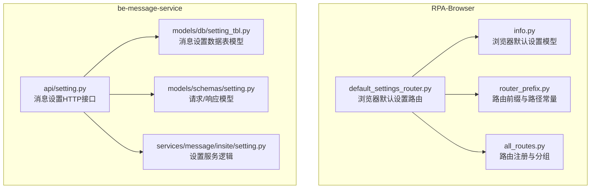
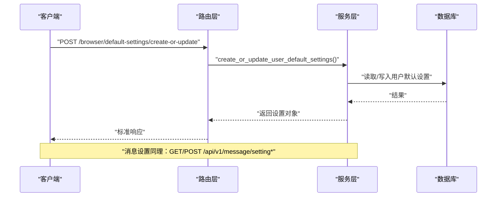
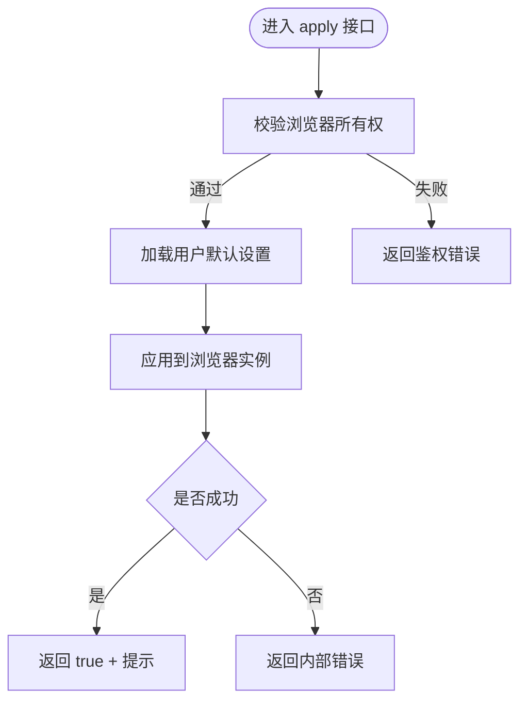
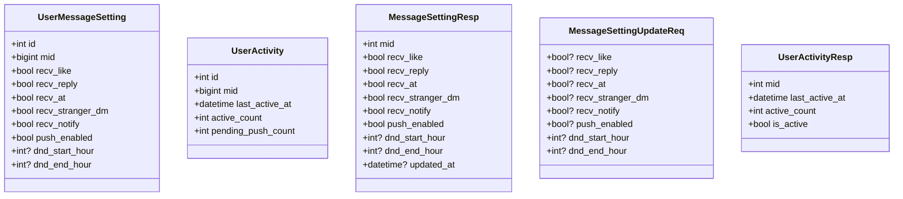
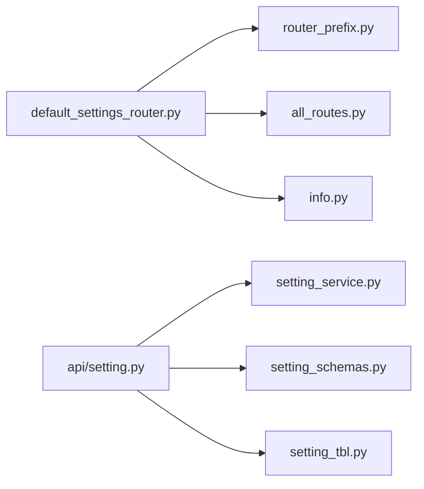

# 设置管理接口

<cite>
**本文引用的文件**
- [default_settings_router.py](file://RPA-Browser/app/controller/v1/browser/default_settings_router.py)
- [info.py](file://RPA-Browser/app/models/database/browser/info.py)
- [all_routes.py](file://RPA-Browser/app/models/router/all_routes.py)
- [router_prefix.py](file://RPA-Browser/app/models/router/router_prefix.py)
- [setting.py](file://be-message-service/app/api/setting.py)
- [setting_tbl.py](file://be-message-service/app/models/db/setting_tbl.py)
- [setting_schemas.py](file://be-message-service/app/models/schemas/setting.py)
- [setting_service.py](file://be-message-service/app/services/message/insite/setting.py)
</cite>

## 目录
1. [简介](#简介)
2. [项目结构](#项目结构)
3. [核心组件](#核心组件)
4. [架构总览](#架构总览)
5. [详细组件分析](#详细组件分析)
6. [依赖关系分析](#依赖关系分析)
7. [性能考虑](#性能考虑)
8. [故障排查指南](#故障排查指南)
9. [结论](#结论)
10. [附录](#附录)

## 简介
本文件为“设置管理模块”的 API 接口文档，覆盖两类设置能力：
- RPA-Browser 用户浏览器默认设置：提供获取、创建/更新、删除、应用至浏览器实例以及获取服务端默认值等接口。
- be-message-service 消息通知设置：提供获取、更新消息提醒开关与免打扰时段，并附带活跃度快照查询。

文档包含每个接口的 HTTP 方法、URL 路径、请求参数、响应格式、错误码说明；同时给出设置模型字段定义、默认值与校验规则；并对权限控制、审计日志与安全注意事项进行说明。

## 项目结构
设置相关代码分布在两个服务中：
- RPA-Browser：浏览器默认设置的路由、模型与路由前缀集中管理。
- be-message-service：消息通知设置的 API、数据表模型、请求/响应模型与服务逻辑。

图表来源
- [default_settings_router.py:1-155](file://RPA-Browser/app/controller/v1/browser/default_settings_router.py#L1-L155)
- [info.py:44-163](file://RPA-Browser/app/models/database/browser/info.py#L44-L163)
- [router_prefix.py:94-110](file://RPA-Browser/app/models/router/router_prefix.py#L94-L110)
- [all_routes.py:49-54](file://RPA-Browser/app/models/router/all_routes.py#L49-L54)
- [setting.py:1-62](file://be-message-service/app/api/setting.py#L1-L62)
- [setting_tbl.py:19-68](file://be-message-service/app/models/db/setting_tbl.py#L19-L68)
- [setting_schemas.py:9-51](file://be-message-service/app/models/schemas/setting.py#L9-L51)
- [setting_service.py:31-155](file://be-message-service/app/services/message/insite/setting.py#L31-L155)

章节来源
- [default_settings_router.py:1-155](file://RPA-Browser/app/controller/v1/browser/default_settings_router.py#L1-L155)
- [setting.py:1-62](file://be-message-service/app/api/setting.py#L1-L62)

## 核心组件
- 浏览器默认设置（RPA-Browser）
  - 路由：GET/POST 统一使用 POST 语义（见路由实现），提供获取、创建/更新、删除、应用、获取服务端默认值。
  - 模型：UserBrowserDefaultSettingRequest / UserBrowserDefaultSettingResponse / UserBrowserServerSideDefaultSetting。
  - 路由前缀：/browser，具体路径在 router_prefix 中定义。
- 消息通知设置（be-message-service）
  - 路由：/api/v1/message/setting，提供获取、更新、活跃度快照。
  - 模型：UserMessageSetting（数据库表）、MessageSettingResp / MessageSettingUpdateReq / UserActivityResp（请求/响应）。
  - 服务：SettingService 提供 get_or_create、update、闸门判定、批量确保等能力。

章节来源
- [info.py:44-163](file://RPA-Browser/app/models/database/browser/info.py#L44-L163)
- [setting_tbl.py:19-68](file://be-message-service/app/models/db/setting_tbl.py#L19-L68)
- [setting_schemas.py:9-51](file://be-message-service/app/models/schemas/setting.py#L9-L51)
- [setting_service.py:31-155](file://be-message-service/app/services/message/insite/setting.py#L31-L155)

## 架构总览
设置管理采用“路由层 + 服务层 + 数据模型”的分层设计：
- 路由层负责解析请求、鉴权、调用服务层。
- 服务层封装业务逻辑（如默认值初始化、部分更新、闸门判定、免打扰时段计算）。
- 数据模型层定义持久化结构与请求/响应契约。

图表来源
- [default_settings_router.py:66-82](file://RPA-Browser/app/controller/v1/browser/default_settings_router.py#L66-L82)
- [setting.py:34-46](file://be-message-service/app/api/setting.py#L34-L46)
- [setting_service.py:71-85](file://be-message-service/app/services/message/insite/setting.py#L71-L85)

## 详细组件分析

### 浏览器默认设置 API（RPA-Browser）
- 基础信息
  - 前缀：/browser
  - 版本标签：v1
  - Tag：browser_default_settings
- 接口清单
  - POST /browser/default-settings/get
    - 功能：获取当前用户的浏览器默认设置；未设置时返回空。
    - 鉴权：需要认证头（从 Header 提取 AuthInfo）。
    - 响应：StandardResponse<UserBrowserDefaultSettingResponse | null>。
  - POST /browser/default-settings/create-or-update
    - 功能：创建或更新用户默认设置（部分字段更新）。
    - 请求体：UserBrowserDefaultSettingRequest。
    - 响应：StandardResponse<UserBrowserDefaultSettingResponse>。
  - POST /browser/default-settings/delete
    - 功能：删除用户默认设置；不存在返回 false。
    - 响应：StandardResponse<bool>。
  - POST /browser/default-settings/apply
    - 功能：将用户默认设置应用到指定浏览器实例。
    - 鉴权：需验证浏览器所有权（verify_browser_ownership）。
    - 响应：StandardResponse<bool>，成功附带提示消息。
  - POST /browser/default-settings/server-defaults/get
    - 功能：获取服务端预定义的默认设置值（用于前端填充）。
    - 响应：StandardResponse<UserBrowserDefaultSettingResponse>。

- 请求/响应模型要点
  - 指纹默认配置：platform、browser、lang、timezone。
  - 浏览器默认配置：viewport_width(800~3840)、viewport_height(600~2160)、timeout(≥1000)。
  - 可选代理服务器地址 default_proxy_server。

- 错误处理
  - 应用失败时返回内部错误码与提示信息。

图表来源
- [default_settings_router.py:112-134](file://RPA-Browser/app/controller/v1/browser/default_settings_router.py#L112-L134)

章节来源
- [default_settings_router.py:39-155](file://RPA-Browser/app/controller/v1/browser/default_settings_router.py#L39-L155)
- [info.py:44-163](file://RPA-Browser/app/models/database/browser/info.py#L44-L163)
- [router_prefix.py:94-102](file://RPA-Browser/app/models/router/router_prefix.py#L94-L102)
- [all_routes.py:49-54](file://RPA-Browser/app/models/router/all_routes.py#L49-L54)

### 消息通知设置 API（be-message-service）
- 基础信息
  - 前缀：/api/v1/message/setting
  - Tag：message-setting
- 接口清单
  - GET /api/v1/message/setting
    - 功能：获取当前用户的消息设置；首次访问按默认值自动初始化。
    - 鉴权：RequiredUser。
    - 响应：StandardResponse<MessageSettingResp>。
  - POST /api/v1/message/setting/update
    - 功能：部分更新消息设置（仅写入显式传入字段）。
    - 请求体：MessageSettingUpdateReq。
    - 响应：StandardResponse<MessageSettingResp>。
  - GET /api/v1/message/setting/activity
    - 功能：查看自身活跃度快照（is_active 表示是否在活跃窗口内）。
    - 响应：StandardResponse<UserActivityResp>。

- 数据模型与默认值
  - UserMessageSetting：包含点赞、回复、@提及、陌生人私信、系统通知开关，外部推送总开关 push_enabled，免打扰时段 dnd_start_hour/dnd_end_hour（0~23）。
  - UserActivity：记录 last_active_at、active_count、pending_push_count。

- 服务逻辑要点
  - get_or_create：不存在则按默认值（全部开启）创建。
  - update：部分更新，记录 updated_at。
  - 闸门判定：accept_event、accept_stranger_dm、accept_notify。
  - 免打扰时段：can_push_now 支持跨零点区间。
  - 批量确保：bulk_ensure 使用 INSERT ... ON DUPLICATE KEY UPDATE 幂等插入。

图表来源
- [setting_tbl.py:19-68](file://be-message-service/app/models/db/setting_tbl.py#L19-L68)
- [setting_schemas.py:9-51](file://be-message-service/app/models/schemas/setting.py#L9-L51)

章节来源
- [setting.py:24-58](file://be-message-service/app/api/setting.py#L24-L58)
- [setting_tbl.py:19-68](file://be-message-service/app/models/db/setting_tbl.py#L19-L68)
- [setting_schemas.py:9-51](file://be-message-service/app/models/schemas/setting.py#L9-L51)
- [setting_service.py:31-155](file://be-message-service/app/services/message/insite/setting.py#L31-L155)

## 依赖关系分析
- RPA-Browser 设置路由依赖：
  - 路由前缀与路径常量（router_prefix.py）。
  - 路由分组与版本标签（all_routes.py）。
  - 浏览器默认设置模型（info.py）。
  - 鉴权依赖：get_auth_info_from_header、verify_browser_ownership。
- be-message-service 设置 API 依赖：
  - 数据表模型（setting_tbl.py）。
  - 请求/响应模型（setting_schemas.py）。
  - 服务逻辑（setting_service.py）。
  - 鉴权依赖：RequiredUser。

图表来源
- [default_settings_router.py:1-33](file://RPA-Browser/app/controller/v1/browser/default_settings_router.py#L1-L33)
- [router_prefix.py:94-110](file://RPA-Browser/app/models/router/router_prefix.py#L94-L110)
- [all_routes.py:49-54](file://RPA-Browser/app/models/router/all_routes.py#L49-L54)
- [setting.py:1-21](file://be-message-service/app/api/setting.py#L1-L21)
- [setting_service.py:1-20](file://be-message-service/app/services/message/insite/setting.py#L1-L20)
- [setting_schemas.py:1-9](file://be-message-service/app/models/schemas/setting.py#L1-L9)
- [setting_tbl.py:1-18](file://be-message-service/app/models/db/setting_tbl.py#L1-L18)

章节来源
- [default_settings_router.py:1-33](file://RPA-Browser/app/controller/v1/browser/default_settings_router.py#L1-L33)
- [setting.py:1-21](file://be-message-service/app/api/setting.py#L1-L21)

## 性能考虑
- 消息设置读多写少：
  - 使用 MySQL 主键/唯一索引点查满足高并发读取。
  - 批量确保使用 INSERT ... ON DUPLICATE KEY UPDATE 避免 N+1 问题。
- 免打扰时段计算：
  - 基于当前小时判断，支持跨零点区间，计算开销极低。
- 浏览器默认设置应用：
  - 应用流程涉及数据库读取与浏览器实例操作，建议异步化或队列化以降低同步阻塞。

[本节为通用性能建议，不直接分析具体文件]

## 故障排查指南
- 浏览器默认设置应用失败
  - 现象：返回内部错误与提示信息。
  - 排查：检查用户默认设置是否存在、浏览器实例是否有效、鉴权是否通过。
  - 参考：应用接口错误分支。
- 消息设置更新后未生效
  - 现象：事件上报仍产生推送。
  - 排查：确认更新字段是否正确、updated_at 是否刷新、闸门判定逻辑是否短路。
  - 参考：SettingService.update 与 accept_* 系列方法。
- 免打扰时段异常
  - 现象：非预期时间段收到推送。
  - 排查：检查 dnd_start_hour/dnd_end_hour 范围（0~23）、跨零点区间逻辑。
  - 参考：can_push_now 实现。

章节来源
- [default_settings_router.py:128-134](file://RPA-Browser/app/controller/v1/browser/default_settings_router.py#L128-L134)
- [setting_service.py:71-85](file://be-message-service/app/services/message/insite/setting.py#L71-L85)
- [setting_service.py:117-131](file://be-message-service/app/services/message/insite/setting.py#L117-L131)

## 结论
- 浏览器默认设置与消息通知设置均遵循清晰的分层架构，具备完善的请求/响应模型与鉴权机制。
- 消息设置提供灵活的闸门控制与免打扰时段，适合大规模推送场景。
- 建议在应用浏览器默认设置时引入异步处理，提升用户体验与系统稳定性。

[本节为总结性内容，不直接分析具体文件]

## 附录

### 接口清单与规范

- 浏览器默认设置（RPA-Browser）
  - POST /browser/default-settings/get
    - 鉴权：Header 认证（AuthInfo）。
    - 响应：StandardResponse<UserBrowserDefaultSettingResponse | null>。
  - POST /browser/default-settings/create-or-update
    - 请求体：UserBrowserDefaultSettingRequest。
    - 响应：StandardResponse<UserBrowserDefaultSettingResponse>。
  - POST /browser/default-settings/delete
    - 响应：StandardResponse<bool>。
  - POST /browser/default-settings/apply
    - 鉴权：浏览器所有权验证。
    - 响应：StandardResponse<bool>。
  - POST /browser/default-settings/server-defaults/get
    - 响应：StandardResponse<UserBrowserDefaultSettingResponse>。

- 消息通知设置（be-message-service）
  - GET /api/v1/message/setting
    - 鉴权：RequiredUser。
    - 响应：StandardResponse<MessageSettingResp>。
  - POST /api/v1/message/setting/update
    - 请求体：MessageSettingUpdateReq。
    - 响应：StandardResponse<MessageSettingResp>。
  - GET /api/v1/message/setting/activity
    - 响应：StandardResponse<UserActivityResp>。

章节来源
- [default_settings_router.py:45-155](file://RPA-Browser/app/controller/v1/browser/default_settings_router.py#L45-L155)
- [setting.py:24-58](file://be-message-service/app/api/setting.py#L24-L58)

### 设置模型字段说明

- 浏览器默认设置（UserBrowserDefaultSettingRequest/Response）
  - default_proxy_server: 字符串或空，代理服务器地址。
  - default_platform: 平台枚举（如 windows）。
  - default_browser: 浏览器枚举（如 chrome）。
  - default_lang: 语言代码（最大长度 20）。
  - default_timezone: 时区标识（最大长度 50）。
  - default_viewport_width: 视口宽度（800~3840）。
  - default_viewport_height: 视口高度（600~2160）。
  - default_timeout: 超时时间（毫秒，≥1000）。

- 消息通知设置（UserMessageSetting / MessageSettingResp）
  - recv_like: 是否接收点赞提醒（默认 True）。
  - recv_reply: 是否接收回复提醒（默认 True）。
  - recv_at: 是否接收 @ 提醒（默认 True）。
  - recv_stranger_dm: 是否接收陌生人私信（默认 True）。
  - recv_notify: 是否接收系统通知（默认 True）。
  - push_enabled: 外部推送渠道总开关（默认 True）。
  - dnd_start_hour: 免打扰开始小时（0~23，可空）。
  - dnd_end_hour: 免打扰结束小时（0~23，可空）。
  - updated_at: 更新时间戳。

章节来源
- [info.py:44-163](file://RPA-Browser/app/models/database/browser/info.py#L44-L163)
- [setting_tbl.py:19-68](file://be-message-service/app/models/db/setting_tbl.py#L19-L68)
- [setting_schemas.py:9-51](file://be-message-service/app/models/schemas/setting.py#L9-L51)

### 权限控制、审计日志与安全考虑
- 权限控制
  - 浏览器默认设置：通过 Header 中的 AuthInfo 识别用户；应用设置需验证浏览器所有权。
  - 消息通知设置：通过 RequiredUser 保证登录态。
- 审计日志
  - 消息设置更新会记录日志（用户 mid 与变更字段），便于追踪。
- 安全考虑
  - 所有写操作均需鉴权。
  - 输入校验严格（如 viewport 范围、dnd 小时范围）。
  - 免打扰时段支持跨零点，避免误判。

章节来源
- [default_settings_router.py:45-134](file://RPA-Browser/app/controller/v1/browser/default_settings_router.py#L45-L134)
- [setting.py:24-46](file://be-message-service/app/api/setting.py#L24-L46)
- [setting_service.py:71-85](file://be-message-service/app/services/message/insite/setting.py#L71-L85)