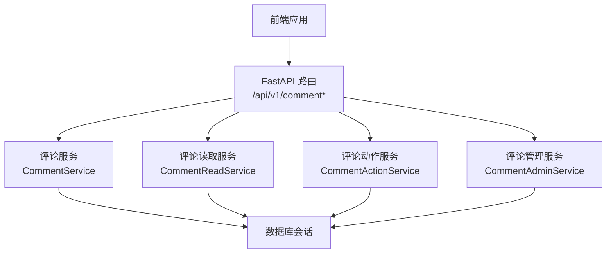
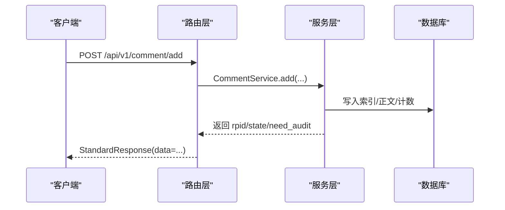
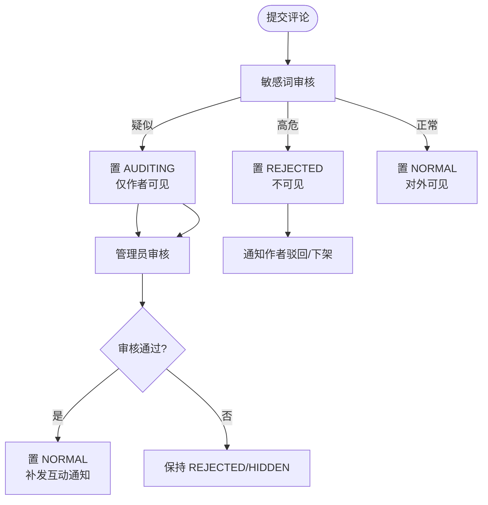
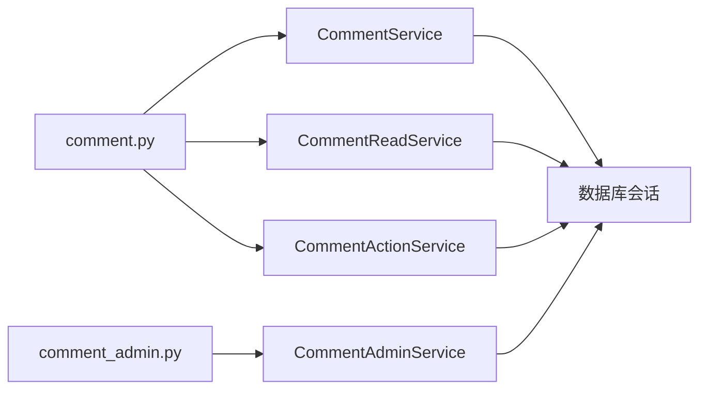

# 评论管理接口

<cite>
**本文引用的文件**
- [be-message-service/app/api/comment.py](file://be-message-service/app/api/comment.py)
- [be-message-service/app/api/comment_admin.py](file://be-message-service/app/api/comment_admin.py)
- [be-message-service/app/models/schemas/comment.py](file://be-message-service/app/models/schemas/comment.py)
- [be-message-service/app/services/comment/comment.py](file://be-message-service/app/services/comment/comment.py)
- [be-message-service/app/services/comment/comment_admin.py](file://be-message-service/app/services/comment/comment_admin.py)
- [be-message-service/app/services/comment/comment_action.py](file://be-message-service/app/services/comment/comment_action.py)
- [be-message-service/app/services/comment/comment_read.py](file://be-message-service/app/services/comment/comment_read.py)
- [be-message-service/app/services/admin/report.py](file://be-message-service/app/services/admin/report.py)
- [be-message-service/tests/test_comment_phase23.py](file://be-message-service/tests/test_comment_phase23.py)
- [Vue3FrontEndDemoExercise/src/api/lottery_comment.ts](file://Vue3FrontEndDemoExercise/src/api/lottery_comment.ts)
</cite>

## 目录
1. [简介](#简介)
2. [项目结构](#项目结构)
3. [核心组件](#核心组件)
4. [架构总览](#架构总览)
5. [详细组件分析](#详细组件分析)
6. [依赖关系分析](#依赖关系分析)
7. [性能考虑](#性能考虑)
8. [故障排查指南](#故障排查指南)
9. [结论](#结论)
10. [附录](#附录)

## 简介
本文件为“评论管理模块”的 RESTful API 文档，覆盖评论的创建、查询、修改、删除、互动（点赞/点踩/取消）、举报、审核队列、批量审核、内容来源、原始 IP 查看以及评论区统计等能力。文档同时说明评论模型字段、审核流程、敏感词过滤与举报处理机制，并给出管理员操作接口与数据分析接口。

## 项目结构
评论相关能力集中在 be-message-service 中：
- HTTP 路由层：app/api/comment.py（用户侧）、app/api/comment_admin.py（管理端）
- 服务层：app/services/comment/*（发布、读取、动作、审核、统计）
- 数据模型：app/models/schemas/comment.py（请求/响应模型）
- 测试用例：tests/test_comment_phase23.py（审核、敏感词、防刷等）
- 前端调用示例：Vue3FrontEndDemoExercise/src/api/lottery_comment.ts

图表来源
- [be-message-service/app/api/comment.py:1-404](file://be-message-service/app/api/comment.py#L1-L404)
- [be-message-service/app/api/comment_admin.py:1-236](file://be-message-service/app/api/comment_admin.py#L1-L236)
- [be-message-service/app/services/comment/comment.py:294-314](file://be-message-service/app/services/comment/comment.py#L294-L314)
- [be-message-service/app/services/comment/comment_admin.py:43-599](file://be-message-service/app/services/comment/comment_admin.py#L43-L599)

章节来源
- [be-message-service/app/api/comment.py:1-404](file://be-message-service/app/api/comment.py#L1-L404)
- [be-message-service/app/api/comment_admin.py:1-236](file://be-message-service/app/api/comment_admin.py#L1-L236)

## 核心组件
- 用户侧接口（/api/v1/comment）：发表评论、删除评论、一级评论列表、单条详情、计数、楼中楼展开、点赞/点踩/取消、举报、@搜索、置顶/取消置顶。
- 管理端接口（/api/v1/comment/admin）：人工审核（单条/批量）、审核队列、内容来源、原始 IP 查看、全局统计。
- 评论模型：统一的请求/响应模型定义在 schemas/comment.py，所有 64 位 ID 以字符串传输以避免精度丢失。
- 审核与风控：发布时进行敏感词审核（高危直接拒绝，疑似进入待审），支持“先审后发”开关；举报累计达到阈值自动转入审核；管理端可审核通过/驳回/下架/恢复。

章节来源
- [be-message-service/app/models/schemas/comment.py:1-402](file://be-message-service/app/models/schemas/comment.py#L1-L402)
- [be-message-service/app/services/comment/comment.py:294-314](file://be-message-service/app/services/comment/comment.py#L294-L314)
- [be-message-service/tests/test_comment_phase23.py:374-533](file://be-message-service/tests/test_comment_phase23.py#L374-L533)

## 架构总览
评论系统采用分层设计：路由层负责参数校验与鉴权，服务层封装业务逻辑（含审核、通知、统计同步），数据层通过 SQLModel/SQLAlchemy 访问数据库。管理端与用户端路由分离，权限控制严格（root 与普通管理员可见范围不同）。

图表来源
- [be-message-service/app/api/comment.py:92-130](file://be-message-service/app/api/comment.py#L92-L130)
- [be-message-service/app/services/comment/comment.py:294-314](file://be-message-service/app/services/comment/comment.py#L294-L314)

## 详细组件分析

### 用户侧接口（/api/v1/comment）
- 发表评论
  - 方法/路径：POST /api/v1/comment/add
  - 认证：需要登录态（RequiredUser）
  - 请求体：参考 CommentAddReq（oid/type/root/parent/message/pictures/at_mids/at_name_to_mid/emote_meta/up_mid）
  - 行为：封禁校验、提取客户端 IP、GeoIP 解析、敏感词审核（高危拒绝/疑似待审/正常）、可选“先审后发”
  - 响应：StandardResponse[CommentAddResp]（rpid/state/need_audit）
  - 错误码：400（参数非法/业务异常），403（被封禁）
- 删除评论
  - 方法/路径：POST /api/v1/comment/del
  - 认证：需要登录态
  - 请求体：CommentDelReq（rpid）
  - 权限：作者/UP主/管理员
  - 响应：StandardResponse[CommentOperationResp]
- 一级评论列表
  - 方法/路径：GET /api/v1/comment/main
  - 参数：oid/type/sort/page_num/page_size/focus_rpid
  - 行为：未登录限制 page_size=10；置顶不参与分页；读冗余计数
  - 响应：StandardResponse[CommentListResp]
- 评论详情
  - 方法/路径：GET /api/v1/comment/detail/{rpid}
  - 响应：StandardResponse[CommentItem]；已删除/下架返回 404
- 评论区计数
  - 方法/路径：GET /api/v1/comment/count
  - 参数：oid/type
  - 响应：StandardResponse[CommentCountResp]
- 楼中楼展开
  - 方法/路径：GET /api/v1/comment/reply
  - 参数：root/oid/type/page_num/page_size
  - 响应：StandardResponse[CommentSubListResp]
- 点赞/点踩/取消
  - 方法/路径：POST /api/v1/comment/action
  - 认证：需要登录态
  - 请求体：CommentActionReq（rpid/action）
  - 幂等：重复操作不重复计数
  - 响应：StandardResponse[CommentActionResp]
- 举报评论
  - 方法/路径：POST /api/v1/comment/report
  - 认证：需要登录态
  - 请求体：CommentReportReq（rpid/reasonType/reasonDesc）
  - 行为：一人一评一次；达阈值转审核
  - 响应：StandardResponse[CommentReportResp]
- @用户搜索
  - 方法/路径：GET /api/v1/comment/at/search
  - 参数：keyword/limit
  - 响应：StandardResponse[list[CommentUserBrief]]
- 置顶/取消置顶
  - 方法/路径：POST /api/v1/comment/top
  - 认证：需要登录态
  - 请求体：CommentTopReq（oid/type/rpid/top）
  - 权限：内容作者或管理员
  - 响应：StandardResponse[CommentTopResp]

章节来源
- [be-message-service/app/api/comment.py:92-400](file://be-message-service/app/api/comment.py#L92-L400)
- [be-message-service/app/models/schemas/comment.py:132-277](file://be-message-service/app/models/schemas/comment.py#L132-L277)

### 管理端接口（/api/v1/comment/admin）
- 人工审核（单条）
  - 方法/路径：POST /api/v1/comment/admin/audit
  - 认证：RootUser
  - 请求体：CommentAuditReq（rpid/op/note）
  - 行为：pass/reject/hidden/restore；状态变更同步统计与通知
  - 响应：StandardResponse[CommentAuditItem]
- 批量审核
  - 方法/路径：POST /api/v1/comment/admin/audit/batch
  - 认证：RootUser
  - 请求体：CommentBulkAuditReq（rpids/op/note/notes）
  - 响应：StandardResponse[CommentBulkAuditResp]
- 审核队列
  - 方法/路径：GET /api/v1/comment/admin/audit
  - 认证：MsgAdminUser
  - 参数：state（仅 root 可用多选）、page_num、page_size
  - 行为：非 root 只能看待审核；明文 IP 仅 root 可见
  - 响应：StandardResponse[CommentAuditListResp]
- 内容来源
  - 方法/路径：GET /api/v1/comment/admin/source/{rpid}
  - 认证：MsgAdminUser
  - 响应：StandardResponse[CommentSourceResp]
- 查看原始 IP
  - 方法/路径：GET /api/v1/comment/admin/ip/{rpid}
  - 认证：RootUser
  - 响应：StandardResponse[{rpid, ip_v4, ip_v6}]
- 评论统计
  - 方法/路径：GET /api/v1/comment/admin/stats
  - 认证：MsgAdminUser
  - 响应：StandardResponse[CommentStatsResp]

章节来源
- [be-message-service/app/api/comment_admin.py:49-232](file://be-message-service/app/api/comment_admin.py#L49-L232)
- [be-message-service/app/models/schemas/comment.py:279-378](file://be-message-service/app/models/schemas/comment.py#L279-L378)

### 评论模型说明
- 通用规则：所有 64 位 ID（rpid/oid/root/parent/dialog）在接口入参与出参中一律使用字符串，避免 JS 精度丢失。
- 评论项 CommentItem 关键字段：
  - rpid/oid/type：标识评论及所属资源类型
  - mid/member：发布者及其展示快照（直连 pptr 只读）
  - root/parent/dialog/floor：层级与楼层信息
  - message/pictures/at_users/at_name_to_mid/topics_meta/emote_meta：内容与元信息
  - like_count/hate_count/rcount：互动与子评论数
  - action：当前登录用户的互动态（NONE/LIKE/HATE）
  - state/is_top/is_essence/is_up_liked：状态与标记
  - ip_location/ip_isp/plat/device/ctime：来源与时间
  - replies：楼中楼预览
- 其他模型：
  - CommentAddReq/CommentAddResp：发布与返回
  - CommentListResp/CommentSubListResp：列表与分页
  - CommentCountResp：计数
  - CommentActionReq/CommentActionResp：互动
  - CommentReportReq/CommentReportResp：举报
  - CommentTopReq/CommentTopResp：置顶
  - CommentAuditReq/CommentAuditItem/CommentAuditListResp：审核
  - CommentSourceResp：内容来源
  - CommentStatsResp：全局统计

章节来源
- [be-message-service/app/models/schemas/comment.py:25-378](file://be-message-service/app/models/schemas/comment.py#L25-L378)

### 审核流程、敏感词过滤与举报处理
- 敏感词审核：
  - 发布时执行文本审核，高危直接拒绝（REJECTED），疑似进入待审（AUDITING），正常则 NORMAL。
  - 支持“先审后发”开关：开启后，原本可直接展示的评论也先进入 AUDITING，需管理端通过后对外可见。
- 举报处理：
  - 举报幂等（一人对同一评论只记一次），累计达到阈值将评论由 NORMAL 转为 AUDITING，交由管理员复核。
  - 管理端统一举报处理：reject（驳回）或 resolve（成立，可联动 hide 下架）。
- 审核结果通知：
  - 负面结果（驳回/下架）向作者推送系统通知，包含来源与原因。
  - 审核通过/恢复（非 NORMAL → NORMAL）补发先前跳过的互动通知（回复/@）。

图表来源
- [be-message-service/app/services/comment/comment.py:294-314](file://be-message-service/app/services/comment/comment.py#L294-L314)
- [be-message-service/app/services/comment/comment_admin.py:48-137](file://be-message-service/app/services/comment/comment_admin.py#L48-L137)
- [be-message-service/app/services/admin/report.py:187-213](file://be-message-service/app/services/admin/report.py#L187-L213)
- [be-message-service/tests/test_comment_phase23.py:374-533](file://be-message-service/tests/test_comment_phase23.py#L374-L533)

章节来源
- [be-message-service/app/services/comment/comment.py:294-314](file://be-message-service/app/services/comment/comment.py#L294-L314)
- [be-message-service/app/services/comment/comment_admin.py:48-137](file://be-message-service/app/services/comment/comment_admin.py#L48-L137)
- [be-message-service/app/services/admin/report.py:187-213](file://be-message-service/app/services/admin/report.py#L187-L213)
- [be-message-service/tests/test_comment_phase23.py:374-533](file://be-message-service/tests/test_comment_phase23.py#L374-L533)

### 管理员操作与统计
- 审核队列：按身份分层可见（root 查看全部，普通管理员仅待审核），支持分页与状态过滤。
- 内容来源：返回评论所属评论区、UP 主、跳转地址与计数。
- 原始 IP：仅 root 可查看明文 IPv4/IPv6。
- 全局统计：总数、今日新增、各状态分布、TOP 作者等。

章节来源
- [be-message-service/app/api/comment_admin.py:123-232](file://be-message-service/app/api/comment_admin.py#L123-L232)
- [be-message-service/app/services/comment/comment_admin.py:334-599](file://be-message-service/app/services/comment/comment_admin.py#L334-L599)

### 前端调用示例
- 前端通过生成的服务类调用评论接口，包括添加评论、点赞/点踩/取消、删除评论等。
- 注意：ID 以字符串传递，错误时统一降级为默认响应。

章节来源
- [Vue3FrontEndDemoExercise/src/api/lottery_comment.ts:111-148](file://Vue3FrontEndDemoExercise/src/api/lottery_comment.ts#L111-L148)

## 依赖关系分析
- 路由依赖：
  - comment.py 依赖 CommentService、CommentReadService、CommentActionService、CommentAdminUser、IP 解析工具。
  - comment_admin.py 依赖 CommentAdminService、标准响应模型与枚举。
- 服务依赖：
  - CommentService：发布、删除、举报、审核、通知、统计同步。
  - CommentReadService：列表、详情、计数、子评论。
  - CommentActionService：点赞/点踩/取消的幂等处理。
  - CommentAdminService：审核队列、批量审核、内容来源、明文 IP、统计。
- 外部依赖：
  - pptr Postgres：用户展示快照（昵称头像等）只读回查。
  - 事件/通知服务：弱依赖投递，失败仅告警。

图表来源
- [be-message-service/app/api/comment.py:1-404](file://be-message-service/app/api/comment.py#L1-L404)
- [be-message-service/app/api/comment_admin.py:1-236](file://be-message-service/app/api/comment_admin.py#L1-L236)

章节来源
- [be-message-service/app/api/comment.py:1-404](file://be-message-service/app/api/comment.py#L1-L404)
- [be-message-service/app/api/comment_admin.py:1-236](file://be-message-service/app/api/comment_admin.py#L1-L236)

## 性能考虑
- 列表接口：常量 SQL 次数（主列表 + 置顶 + 4 次批量回捞），避免 N+1。
- 计数口径：优先读冗余计数（root_count/all_count），减少 COUNT(*)。
- 审核队列：批量取 UP 主与作者信息，IN 查询优化。
- 统计接口：低频聚合查询，允许 COUNT 分组。
- 匿名限制：未登录强制 page_size=10，降低负载。

章节来源
- [be-message-service/app/api/comment.py:162-211](file://be-message-service/app/api/comment.py#L162-L211)
- [be-message-service/app/services/comment/comment_admin.py:334-407](file://be-message-service/app/services/comment/comment_admin.py#L334-L407)
- [be-message-service/app/services/comment/comment_admin.py:520-599](file://be-message-service/app/services/comment/comment_admin.py#L520-L599)

## 故障排查指南
- 常见错误码：
  - 400：参数非法（如 rpid/oid 格式错误）、业务校验失败（如被拉黑无法评论）。
  - 403：无权限（被封禁、越权查看状态、无权置顶）。
  - 404：评论不存在或已删除/下架。
- 审核与通知：
  - 审核状态变更通知为弱依赖，失败仅告警，不影响审核结果。
  - 审核通过/恢复会补发此前因不可见而跳过的互动通知。
- 举报与阈值：
  - 举报幂等，达到阈值自动转入审核；管理端可 reject/resolve。
- 日志与定位：
  - 审核队列与统计接口提供审计线索（来源、IP、状态分布）。

章节来源
- [be-message-service/app/api/comment.py:92-400](file://be-message-service/app/api/comment.py#L92-L400)
- [be-message-service/app/api/comment_admin.py:49-232](file://be-message-service/app/api/comment_admin.py#L49-L232)
- [be-message-service/app/services/comment/comment_admin.py:48-137](file://be-message-service/app/services/comment/comment_admin.py#L48-L137)
- [be-message-service/app/services/admin/report.py:187-213](file://be-message-service/app/services/admin/report.py#L187-L213)

## 结论
评论管理模块提供了完整的用户侧与管理端接口，涵盖评论生命周期（创建、查询、修改、删除）、互动（点赞/点踩/取消）、举报与审核、内容来源与统计等。通过严格的权限控制、敏感词审核与举报阈值机制，保障社区内容质量与安全性。建议在生产环境关注统计接口的负载与缓存策略，确保高并发下的稳定性。

## 附录
- 接口清单速览（HTTP 方法与路径）：
  - 用户侧：
    - POST /api/v1/comment/add
    - POST /api/v1/comment/del
    - GET /api/v1/comment/main
    - GET /api/v1/comment/detail/{rpid}
    - GET /api/v1/comment/count
    - GET /api/v1/comment/reply
    - POST /api/v1/comment/action
    - POST /api/v1/comment/report
    - GET /api/v1/comment/at/search
    - POST /api/v1/comment/top
  - 管理端：
    - POST /api/v1/comment/admin/audit
    - POST /api/v1/comment/admin/audit/batch
    - GET /api/v1/comment/admin/audit
    - GET /api/v1/comment/admin/source/{rpid}
    - GET /api/v1/comment/admin/ip/{rpid}
    - GET /api/v1/comment/admin/stats

章节来源
- [be-message-service/app/api/comment.py:92-400](file://be-message-service/app/api/comment.py#L92-L400)
- [be-message-service/app/api/comment_admin.py:49-232](file://be-message-service/app/api/comment_admin.py#L49-L232)