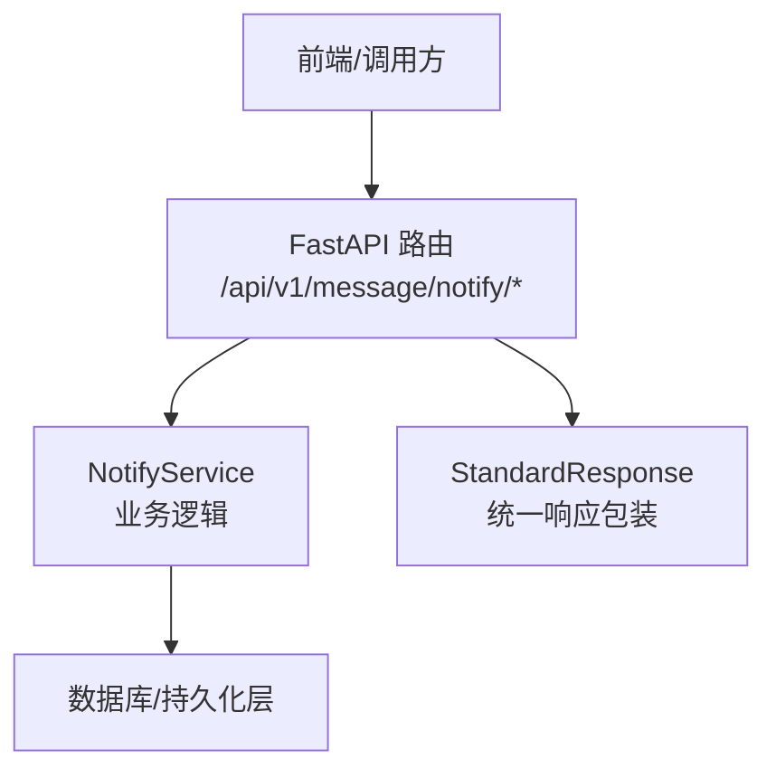
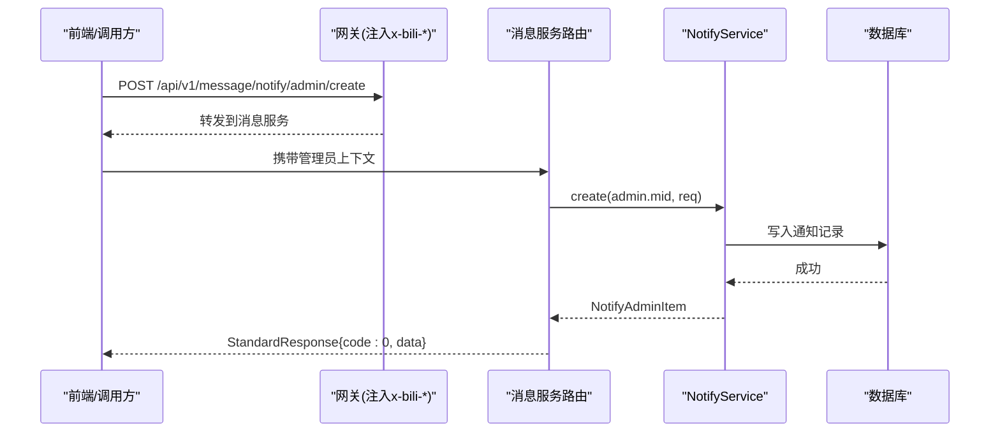
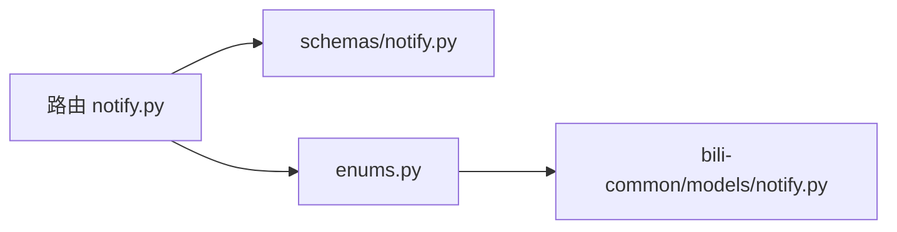

# 通知管理接口

<cite>
**本文引用的文件**
- [be-message-service/app/api/notify.py](file://be-message-service/app/api/notify.py)
- [be-message-service/app/models/schemas/notify.py](file://be-message-service/app/models/schemas/notify.py)
- [bili-common/bili_common/models/notify.py](file://bili-common/bili_common/models/notify.py)
- [be-message-service/app/models/enums.py](file://be-message-service/app/models/enums.py)
- [docs/_archive/response-code-design.md](file://docs/_archive/response-code-design.md)
</cite>

## 目录
1. [简介](#简介)
2. [项目结构](#项目结构)
3. [核心组件](#核心组件)
4. [架构总览](#架构总览)
5. [详细接口说明](#详细接口说明)
6. [依赖关系分析](#依赖关系分析)
7. [性能与最佳实践](#性能与最佳实践)
8. [故障排查指南](#故障排查指南)
9. [结论](#结论)

## 简介
本章节面向“系统通知”模块，提供完整的 RESTful API 文档。覆盖管理员侧的通知创建、修改、撤回、列表查询，以及用户侧的增量拉取、分页历史查看、未读数统计、B站风格系统通知列表等能力；同时给出认证方式、权限控制、错误码约定与使用建议。

## 项目结构
- 路由定义位于消息服务：/api/v1/message/notify
- 请求/响应模型位于 be-message-service 的 schemas
- 枚举（目标类型、级别、状态）在公共库 bili-common 中统一定义，并在消息服务内复用
- 统一响应体 StandardResponse 包裹业务数据，业务码遵循公共规范

**图示来源**
- [be-message-service/app/api/notify.py:1-40](file://be-message-service/app/api/notify.py#L1-L40)
- [be-message-service/app/models/schemas/notify.py:1-20](file://be-message-service/app/models/schemas/notify.py#L1-L20)

**章节来源**
- [be-message-service/app/api/notify.py:1-40](file://be-message-service/app/api/notify.py#L1-L40)

## 核心组件
- 路由与端点：负责鉴权、参数校验、调用服务层并返回统一响应
- 数据模型：包含创建/更新请求、用户侧与管理员侧响应、B站风格系统通知响应
- 枚举：通知目标类型、重要级别、生命周期状态
- 统一响应：StandardResponse(code, msg, data)

**章节来源**
- [be-message-service/app/api/notify.py:40-217](file://be-message-service/app/api/notify.py#L40-L217)
- [be-message-service/app/models/schemas/notify.py:12-208](file://be-message-service/app/models/schemas/notify.py#L12-L208)
- [bili-common/bili_common/models/notify.py:17-40](file://bili-common/bili_common/models/notify.py#L17-L40)
- [be-message-service/app/models/enums.py:28-37](file://be-message-service/app/models/enums.py#L28-L37)

## 架构总览
下图展示一次“管理员发布通知”的调用链：前端通过网关注入可信登录态后访问消息服务，路由层校验管理员身份，调用服务层落库并触发后续推送策略。

**图示来源**
- [be-message-service/app/api/notify.py:143-163](file://be-message-service/app/api/notify.py#L143-L163)
- [be-message-service/app/models/schemas/notify.py:12-36](file://be-message-service/app/models/schemas/notify.py#L12-L36)

## 详细接口说明

### 通用约定
- 基础路径：/api/v1/message/notify
- 认证方式：完全依赖上游网关注入的可信登录态（如 x-bili-*），不做本地令牌校验
- 统一响应体：StandardResponse{code, msg, data}
- 业务码规范：HTTP 始终返回 200，业务码落在 body.code

**章节来源**
- [be-message-service/app/api/notify.py:13-16](file://be-message-service/app/api/notify.py#L13-L16)
- [docs/_archive/response-code-design.md:35-51](file://docs/_archive/response-code-design.md#L35-L51)

---

### 用户侧接口

#### GET /pull — 定时拉取增量通知
- 功能：按游标拉取当前用户可见的增量通知；重复调用不会重复消费
- 鉴权：需要登录用户
- 请求参数
  - cursor: int | None — 客户端游标；不传则使用服务端持久化游标
  - limit: int — 每次拉取条数，范围 1..100，默认 20
- 响应数据 NotifyPullResp
  - items: NotifyItem[] — 本次拉取到的通知列表
  - cursor: int — 本次拉取后的新游标
  - unread_count: int — 标记已读后的剩余未读数
  - has_more: bool — 是否还有更多增量
- 行为说明
  - 读取即已读：返回前自动将本页通知置为已读
  - 每次拉取会记录一次用户活跃，用于后续推送策略分流

**章节来源**
- [be-message-service/app/api/notify.py:46-64](file://be-message-service/app/api/notify.py#L46-L64)
- [be-message-service/app/models/schemas/notify.py:85-96](file://be-message-service/app/models/schemas/notify.py#L85-L96)

#### GET /list — 分页查看历史通知
- 功能：分页查看历史通知，不推进拉取游标
- 鉴权：需要登录用户
- 请求参数
  - page_num: int — 页码，≥1，默认 1
  - page_size: int — 每页条数，范围 1..100，默认 20
- 响应数据 NotifyListResp
  - items: NotifyItem[]
  - total: int
  - page_num: int
  - page_size: int
- 行为说明
  - 返回前将本页通知置为已读
  - is_read 字段表示本次读取前的快照，可用于高亮新通知

**章节来源**
- [be-message-service/app/api/notify.py:67-87](file://be-message-service/app/api/notify.py#L67-L87)
- [be-message-service/app/models/schemas/notify.py:98-105](file://be-message-service/app/models/schemas/notify.py#L98-L105)

#### GET /unread — 系统通知未读数
- 功能：获取当前用户的未读系统通知总数
- 鉴权：需要登录用户
- 响应数据：int

**章节来源**
- [be-message-service/app/api/notify.py:90-92](file://be-message-service/app/api/notify.py#L90-L92)

#### GET /system — 系统通知列表（模仿 B 站）
- 功能：返回结构与 B 站 /x/v2/feedsystem/system_notify/get 一致
- 鉴权：需要登录用户
- 请求参数
  - page_num: int — 页码，≥1，默认 1
  - page_size: int — 每页条数，范围 1..100，默认 20
- 响应数据 BiliSystemNotifyResp
  - code/msg/message/ttl: 外层壳
  - data.system_notify_list: SystemNotifyItem[]
    - id, cursor(纳秒时间戳), type=4, title, content(JSON字符串{"web":"..."}), time_at, card_type/card_link/is_send 等
- 行为说明
  - 读取即已读；is_send 映射 dispatched

**章节来源**
- [be-message-service/app/api/notify.py:95-121](file://be-message-service/app/api/notify.py#L95-L121)
- [be-message-service/app/models/schemas/notify.py:125-192](file://be-message-service/app/models/schemas/notify.py#L125-L192)

#### POST /delete — 删除通知（仅管理员）
- 功能：按用户视角软删指定通知（仅该用户不可见，不影响通知本体与其他用户）
- 鉴权：管理员
- 请求体 NotifyDeleteReq
  - notify_ids: list[int] | None — 要删除的通知ID列表
- 响应数据：int — 受影响的用户-通知关联数量
- 约束：notify_ids 不能为空

**章节来源**
- [be-message-service/app/api/notify.py:124-137](file://be-message-service/app/api/notify.py#L124-L137)
- [be-message-service/app/models/schemas/notify.py:116-120](file://be-message-service/app/models/schemas/notify.py#L116-L120)

---

### 管理员侧接口

#### POST /admin/create — 发布系统通知
- 功能：发布一条系统通知；支持草稿、定时发布、过期时间
- 鉴权：管理员
- 请求体 NotifyCreateReq
  - title: str — 标题
  - content: str — 正文
  - jump_url: str | None — 跳转链接
  - target_type: NotifyTargetTypeEnum — 目标用户类型
  - target_value: str | None — 目标值（按类型含义不同）
  - level: NotifyLevelEnum — 重要级别
  - publish_at: datetime | None — 定时发布时间
  - expire_at: datetime | None — 过期时间
  - publish_now: bool — 是否立即进入已发布状态（False 则为草稿）
- 响应数据 NotifyAdminItem
  - id, title, content, jump_url, target_type, target_value, level, status, publish_at, expire_at, creator_mid, dispatched, created_at

**章节来源**
- [be-message-service/app/api/notify.py:143-163](file://be-message-service/app/api/notify.py#L143-L163)
- [be-message-service/app/models/schemas/notify.py:12-36](file://be-message-service/app/models/schemas/notify.py#L12-L36)
- [be-message-service/app/models/schemas/notify.py:67-83](file://be-message-service/app/models/schemas/notify.py#L67-L83)

#### POST /admin/update/{notify_id} — 修改系统通知
- 功能：修改通知内容（通常仅草稿态可改内容）
- 鉴权：管理员
- 路径参数
  - notify_id: StrInt
- 请求体 NotifyUpdateReq
  - 可选字段：title, content, jump_url, target_type, target_value, level, publish_at, expire_at, status
- 响应数据 NotifyAdminItem
- 错误处理：不存在时返回 code=404

**章节来源**
- [be-message-service/app/api/notify.py:166-177](file://be-message-service/app/api/notify.py#L166-L177)
- [be-message-service/app/models/schemas/notify.py:38-50](file://be-message-service/app/models/schemas/notify.py#L38-L50)

#### POST /admin/revoke/{notify_id} — 撤回系统通知
- 功能：管理员撤回通知，用户侧立即不可见
- 鉴权：管理员
- 路径参数
  - notify_id: StrInt
- 响应数据：bool
- 错误处理：不存在时返回 code=404

**章节来源**
- [be-message-service/app/api/notify.py:180-191](file://be-message-service/app/api/notify.py#L180-L191)

#### GET /admin/list — 通知列表（管理员）
- 功能：分页查看通知（含投放配置与状态）
- 鉴权：管理员
- 请求参数
  - page_num: int — 页码，≥1，默认 1
  - page_size: int — 每页条数，范围 1..100，默认 20
  - status: NotifyStatusEnum | None — 按状态筛选
- 响应数据 NotifyAdminListResp
  - items: NotifyAdminItem[]
  - total: int
  - page_num: int
  - page_size: int

**章节来源**
- [be-message-service/app/api/notify.py:194-213](file://be-message-service/app/api/notify.py#L194-L213)
- [be-message-service/app/models/schemas/notify.py:107-114](file://be-message-service/app/models/schemas/notify.py#L107-L114)

---

### 枚举与字段说明

- 通知目标类型 NotifyTargetTypeEnum
  - ALL(1): 全体用户
  - ROLE(2): 按角色，target_value 为角色名
  - LEVEL(3): 按等级，target_value 为最低等级
  - VIP(4): 仅大会员
  - CUSTOM(5): 指定用户，target_value 为逗号分隔的 mid 列表

- 通知级别 NotifyLevelEnum
  - NORMAL(1): 普通
  - IMPORTANT(2): 重要
  - URGENT(3): 紧急

- 通知状态 NotifyStatusEnum
  - DRAFT(1): 草稿
  - PUBLISHED(2): 已发布
  - REVOKED(3): 已撤回

**章节来源**
- [bili-common/bili_common/models/notify.py:17-40](file://bili-common/bili_common/models/notify.py#L17-L40)
- [be-message-service/app/models/enums.py:28-37](file://be-message-service/app/models/enums.py#L28-L37)

---

### 批量操作与过滤
- 批量删除：POST /delete，传入 notify_ids 列表，实现逐用户软删
- 分页查询：/list、/admin/list 均支持 page_num/page_size
- 过滤条件：/admin/list 支持按 status 筛选

**章节来源**
- [be-message-service/app/api/notify.py:124-137](file://be-message-service/app/api/notify.py#L124-L137)
- [be-message-service/app/api/notify.py:194-213](file://be-message-service/app/api/notify.py#L194-L213)

---

### 认证与权限
- 认证：依赖上游网关注入的可信登录态（如 x-bili-*），不在本服务做令牌校验
- 权限：
  - 用户侧接口：RequiredUser
  - 管理员侧接口：AdminUser
  - 普通用户不允许删除系统通知（系统通知面向全体、内容一致），删除仅限管理员

**章节来源**
- [be-message-service/app/api/notify.py:13-16](file://be-message-service/app/api/notify.py#L13-L16)
- [be-message-service/app/api/notify.py:124-137](file://be-message-service/app/api/notify.py#L124-L137)

---

### 错误码与响应
- HTTP 状态码：统一返回 200
- 业务码 code：
  - 0: 成功
  - 400: 参数错误（如 notify_ids 为空）
  - 401: 未登录
  - 403: 无权限
  - 404: 资源不存在（如通知不存在）
  - 500: 服务器内部错误
- 响应体：StandardResponse{code, msg, data}

**章节来源**
- [docs/_archive/response-code-design.md:35-51](file://docs/_archive/response-code-design.md#L35-L51)
- [be-message-service/app/api/notify.py:174-177](file://be-message-service/app/api/notify.py#L174-L177)
- [be-message-service/app/api/notify.py:188-191](file://be-message-service/app/api/notify.py#L188-L191)
- [be-message-service/app/api/notify.py:134-136](file://be-message-service/app/api/notify.py#L134-L136)

---

### 请求/响应示例（示意）
以下为典型请求与响应的结构示意（以字段为主，非真实数据）：

- 管理员创建通知
  - 方法/路径：POST /api/v1/message/notify/admin/create
  - 请求体字段：title, content, jump_url, target_type, target_value, level, publish_at, expire_at, publish_now
  - 响应体：StandardResponse{data: NotifyAdminItem}

- 用户增量拉取
  - 方法/路径：GET /api/v1/message/notify/pull?cursor=&limit=
  - 响应体：StandardResponse{data: NotifyPullResp{items, cursor, unread_count, has_more}}

- 用户分页历史
  - 方法/路径：GET /api/v1/message/notify/list?page_num=&page_size=
  - 响应体：StandardResponse{data: NotifyListResp{items, total, page_num, page_size}}

- 管理员列表（可按状态筛选）
  - 方法/路径：GET /api/v1/message/notify/admin/list?page_num=&page_size=&status=
  - 响应体：StandardResponse{data: NotifyAdminListResp{items, total, page_num, page_size}}

**章节来源**
- [be-message-service/app/models/schemas/notify.py:12-36](file://be-message-service/app/models/schemas/notify.py#L12-L36)
- [be-message-service/app/models/schemas/notify.py:85-114](file://be-message-service/app/models/schemas/notify.py#L85-L114)

## 依赖关系分析
- 路由依赖：SessionDep、AdminUser/RequiredUser、标准响应与模型
- 模型依赖：NotifyCreateReq/UpdateReq/Item/AdminItem/Pull/List/Bili 系列
- 枚举依赖：NotifyTargetTypeEnum、NotifyLevelEnum、NotifyStatusEnum（来自公共库）

**图示来源**
- [be-message-service/app/api/notify.py:18-38](file://be-message-service/app/api/notify.py#L18-L38)
- [be-message-service/app/models/schemas/notify.py:1-10](file://be-message-service/app/models/schemas/notify.py#L1-L10)
- [be-message-service/app/models/enums.py:1-14](file://be-message-service/app/models/enums.py#L1-L14)
- [bili-common/bili_common/models/notify.py:1-12](file://bili-common/bili_common/models/notify.py#L1-L12)

**章节来源**
- [be-message-service/app/api/notify.py:18-38](file://be-message-service/app/api/notify.py#L18-L38)
- [be-message-service/app/models/schemas/notify.py:1-10](file://be-message-service/app/models/schemas/notify.py#L1-L10)
- [be-message-service/app/models/enums.py:1-14](file://be-message-service/app/models/enums.py#L1-L14)
- [bili-common/bili_common/models/notify.py:1-12](file://bili-common/bili_common/models/notify.py#L1-L12)

## 性能与最佳实践
- 增量拉取优先：使用 /pull 配合游标，避免全量轮询
- 合理分页：/list 与 /admin/list 建议使用较小 page_size 提升首屏速度
- 读取即已读：/pull 与 /list 会在返回前自动标记已读，无需额外接口
- 批量删除：/delete 支持批量 notify_ids，减少往返次数
- 权限最小化：管理员接口严格限制 AdminUser，避免越权
- 幂等性：RPC 侧具备幂等发布能力，HTTP 管理端为人工显式操作，注意去重

[本节为通用指导，不直接分析具体文件]

## 故障排查指南
- 404 通知不存在：常见于 update/revoke 时 notify_id 无效
- 400 参数错误：如 delete 接口 notify_ids 为空
- 401/403 认证/权限问题：检查网关是否注入可信登录态及用户角色
- 未读数异常：确认是否已通过 /pull 或 /list 读取过（读取即已读）

**章节来源**
- [be-message-service/app/api/notify.py:174-177](file://be-message-service/app/api/notify.py#L174-L177)
- [be-message-service/app/api/notify.py:188-191](file://be-message-service/app/api/notify.py#L188-L191)
- [be-message-service/app/api/notify.py:134-136](file://be-message-service/app/api/notify.py#L134-L136)

## 结论
本模块提供了完整的通知管理能力：管理员可创建、修改、撤回与查询通知；用户可通过增量拉取与分页历史查看通知，且具备读取即已读的简化体验。接口设计遵循统一响应与业务码规范，结合网关可信登录态与细粒度权限控制，满足生产环境的安全与稳定性要求。