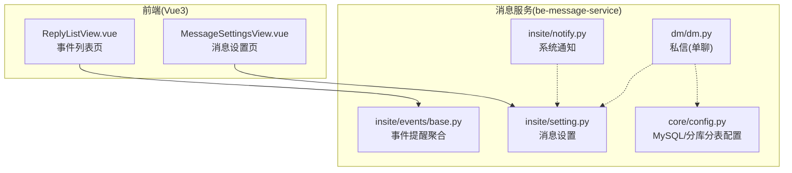
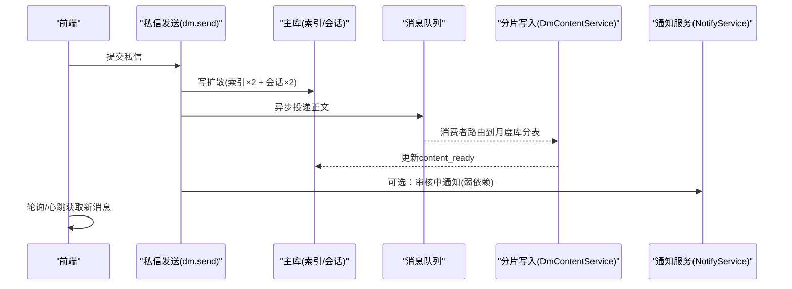
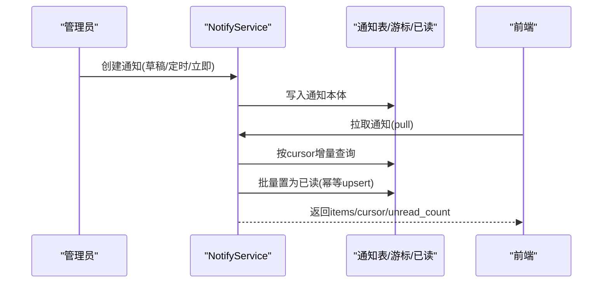
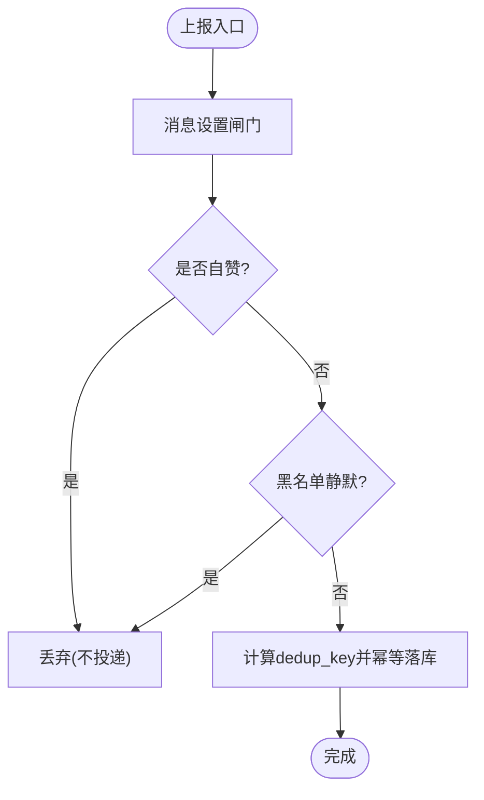
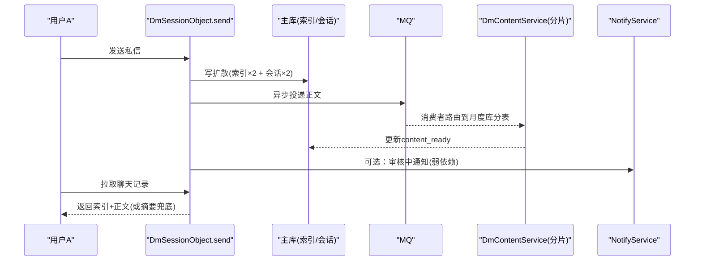
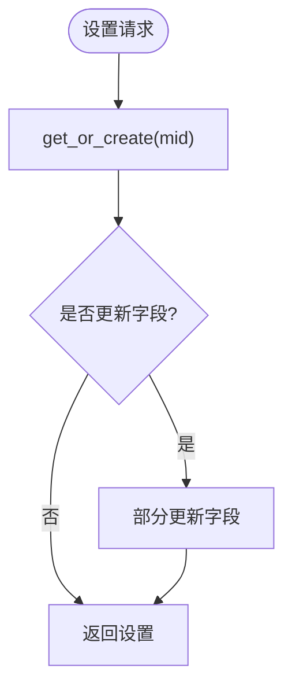
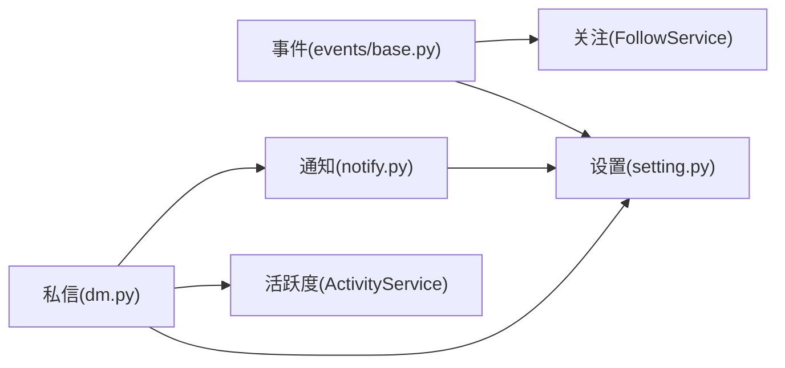

# 业务功能模块

<cite>
**本文引用的文件**
- [notify.py](file://be-message-service/app/services/message/insite/notify.py)
- [events_base.py](file://be-message-service/app/services/message/insite/events/base.py)
- [dm.py](file://be-message-service/app/services/message/dm/dm.py)
- [setting.py](file://be-message-service/app/services/message/insite/setting.py)
- [config.py](file://be-message-service/app/core/config.py)
- [README.md](file://be-message-service/README.md)
- [20260902_1515-f2712dc213c3_.py](file://be-message-service/alembic/versions/20260902_1515-f2712dc213c3_.py)
- [MessageSettingsView.vue](file://Vue3FrontEndDemoExercise/src/views/message/MessageSettingsView.vue)
- [ReplyListView.vue](file://Vue3FrontEndDemoExercise/src/views/message/ReplyListView.vue)
</cite>

## 目录
1. [简介](#简介)
2. [项目结构](#项目结构)
3. [核心组件](#核心组件)
4. [架构总览](#架构总览)
5. [详细组件分析](#详细组件分析)
6. [依赖关系分析](#依赖关系分析)
7. [性能考量](#性能考量)
8. [故障排查指南](#故障排查指南)
9. [结论](#结论)
10. [附录：API 与数据模型速查](#附录api-与数据模型速查)

## 简介
本模块文档围绕消息服务的四大核心业务展开：系统通知管理、事件提醒聚合、私信处理（单聊）、消息设置管理。重点说明各模块的数据模型、业务逻辑、API 接口、模块间依赖与数据流转，并提供典型业务流程的时序图与代码片段路径，帮助读者快速理解并落地使用。

## 项目结构
消息服务以 be-message-service 为核心，按领域划分 services：
- insite：站内通知与事件提醒、用户消息设置
- dm：私信（单聊）写扩散与内容异步化
- infrastructure/mq：基础设施与消息投递
- core：配置、数据库连接、分库分表路由等

前端 Vue3FrontEndDemoExercise 提供消息中心页面（通知、事件、私信、设置），通过 API 调用后端服务。

图表来源
- [notify.py:108-415](file://be-message-service/app/services/message/insite/notify.py#L108-L415)
- [events_base.py:295-436](file://be-message-service/app/services/message/insite/events/base.py#L295-L436)
- [dm.py:253-361](file://be-message-service/app/services/message/dm/dm.py#L253-L361)
- [setting.py:31-151](file://be-message-service/app/services/message/insite/setting.py#L31-L151)
- [config.py:41-58](file://be-message-service/app/core/config.py#L41-L58)
- [MessageSettingsView.vue:65-101](file://Vue3FrontEndDemoExercise/src/views/message/MessageSettingsView.vue#L65-L101)
- [ReplyListView.vue:30-46](file://Vue3FrontEndDemoExercise/src/views/message/ReplyListView.vue#L30-L46)

章节来源
- [notify.py:108-415](file://be-message-service/app/services/message/insite/notify.py#L108-L415)
- [events_base.py:295-436](file://be-message-service/app/services/message/insite/events/base.py#L295-L436)
- [dm.py:253-361](file://be-message-service/app/services/message/dm/dm.py#L253-L361)
- [setting.py:31-151](file://be-message-service/app/services/message/insite/setting.py#L31-L151)
- [config.py:41-58](file://be-message-service/app/core/config.py#L41-L58)
- [MessageSettingsView.vue:65-101](file://Vue3FrontEndDemoExercise/src/views/message/MessageSettingsView.vue#L65-L101)
- [ReplyListView.vue:30-46](file://Vue3FrontEndDemoExercise/src/views/message/ReplyListView.vue#L30-L46)

## 核心组件
- 系统通知管理：管理员发布（草稿/定时/立即）、用户侧增量拉取（游标去重）、读取即已读、撤回、未读数统计、定时投递推送标记。
- 事件提醒聚合：点赞/回复/@提及等统一上报、闸门过滤、黑名单静默、幂等落库、聚合与明细查询、msgfeed 构建、已读水位推进。
- 私信处理（单聊）：写扩散索引+会话、内容异步落库（月度分库分表）、摘要兜底、审核态控制、撤回/删除、死信重试。
- 消息设置管理：开关（点赞/回复/@/陌生人私信/系统通知/第三方推送）、免打扰时段判定、批量确保存在。

章节来源
- [notify.py:108-668](file://be-message-service/app/services/message/insite/notify.py#L108-L668)
- [events_base.py:295-800](file://be-message-service/app/services/message/insite/events/base.py#L295-L800)
- [dm.py:201-800](file://be-message-service/app/services/message/dm/dm.py#L201-L800)
- [setting.py:31-151](file://be-message-service/app/services/message/insite/setting.py#L31-L151)

## 架构总览
消息服务采用“写扩散 + 读扩散”混合策略：
- 系统通知：读扩散（通知本体一份，用户侧维护游标与已读状态）。
- 事件提醒：写扩散（事件明细落库，聚合层按 source_type/source_id 分组展示）。
- 私信：写扩散（索引+会话行），正文异步到 MQ，再路由至月度分库分表；主库仅存轻量索引与会话。

图表来源
- [dm.py:253-361](file://be-message-service/app/services/message/dm/dm.py#L253-L361)
- [dm.py:453-473](file://be-message-service/app/services/message/dm/dm.py#L453-L473)
- [notify.py:218-293](file://be-message-service/app/services/message/insite/notify.py#L218-L293)

章节来源
- [dm.py:253-361](file://be-message-service/app/services/message/dm/dm.py#L253-L361)
- [dm.py:453-473](file://be-message-service/app/services/message/dm/dm.py#L453-L473)
- [notify.py:218-293](file://be-message-service/app/services/message/insite/notify.py#L218-L293)

## 详细组件分析

### 系统通知管理（管理员发布、定时拉取、已读管理）
- 数据模型
  - 通知本体：标题、内容、跳转链接、投放目标类型与值、等级、状态、发布时间、过期时间、是否已投递推送等。
  - 用户游标：记录 last_notify_id，用于增量拉取。
  - 用户已读状态：(mid, notify_id) 唯一索引，支持幂等置为已读/删除。
- 业务逻辑
  - 管理员创建：支持草稿、定时发布、立即发布；使用数据库时钟避免 now() 偏差。
  - 幂等发布：针对 CUSTOM+单个 mid 的通知，基于 (target_value, title) 判重，结合 SettingService 的用户开关可跳过写入。
  - 用户拉取：按 id > cursor 增量返回，返回前批量置为已读，推进服务端游标；支持历史分页与未读数统计。
  - 撤回：将状态改为撤回，用户侧立即不可见。
  - 定时投递：只处理未投递过的通知，投递后标记 dispatched。
- API 参考
  - 管理员列表：GET /api/v1/message/notify/admin/list
  - 用户拉取：GET /api/v1/message/notify/pull
  - 管理员创建/更新/撤回：POST/PUT/DELETE（由控制器暴露）
- 关键实现位置
  - 创建与幂等发布：[notify.py:113-216](file://be-message-service/app/services/message/insite/notify.py#L113-L216)
  - 用户拉取与读取即已读：[notify.py:346-415](file://be-message-service/app/services/message/insite/notify.py#L346-L415)
  - 历史列表与未读数：[notify.py:417-496](file://be-message-service/app/services/message/insite/notify.py#L417-L496)
  - 定时投递与目标解析：[notify.py:565-615](file://be-message-service/app/services/message/insite/notify.py#L565-L615)

图表来源
- [notify.py:113-216](file://be-message-service/app/services/message/insite/notify.py#L113-L216)
- [notify.py:346-415](file://be-message-service/app/services/message/insite/notify.py#L346-L415)
- [notify.py:498-532](file://be-message-service/app/services/message/insite/notify.py#L498-L532)

章节来源
- [notify.py:113-216](file://be-message-service/app/services/message/insite/notify.py#L113-L216)
- [notify.py:346-415](file://be-message-service/app/services/message/insite/notify.py#L346-L415)
- [notify.py:498-532](file://be-message-service/app/services/message/insite/notify.py#L498-L532)

### 事件提醒聚合（点赞、回复、@提及）
- 数据模型
  - 事件明细：接收方 mid、事件类型、来源类型与 ID、业务 ID、触发者、内容、幂等键、是否已读/删除。
  - 已读游标：按事件类型维护 last_read_id，支持 read_before 限定。
- 业务逻辑
  - 上报链路：消息设置闸门 → 自赞过滤 → 黑名单静默（@/回复）→ dedup_key 幂等 → 落库。
  - 聚合与明细：按 source_type + source_id 分组聚合，支持未读计数；明细列表支持筛选。
  - msgfeed 构建：评论锚定事件回捞楼层关系与正文，非评论事件直接定位资源；统一组装 EventMsgfeedContent。
  - 已读管理：支持按 id/类型/聚合粒度标记已读，推进游标。
- API 参考
  - 事件上报：POST /api/v1/message/event/report
  - 聚合列表：GET /api/v1/message/event/aggregate
  - 明细列表：GET /api/v1/message/event/detail
  - 已读标记：POST /api/v1/message/event/read
- 关键实现位置
  - 虚基类与上报流程：[events_base.py:295-436](file://be-message-service/app/services/message/insite/events/base.py#L295-L436)
  - 聚合与明细查询：[events_base.py:592-800](file://be-message-service/app/services/message/insite/events/base.py#L592-L800)
  - 游标推进：[events_base.py:1175-1204](file://be-message-service/app/services/message/insite/events/base.py#L1175-L1204)

图表来源
- [events_base.py:376-436](file://be-message-service/app/services/message/insite/events/base.py#L376-L436)

章节来源
- [events_base.py:295-436](file://be-message-service/app/services/message/insite/events/base.py#L295-L436)
- [events_base.py:592-800](file://be-message-service/app/services/message/insite/events/base.py#L592-L800)
- [events_base.py:1175-1204](file://be-message-service/app/services/message/insite/events/base.py#L1175-L1204)

### 私信处理（单聊写扩散、月度分库分表）
- 数据模型
  - 索引表：owner_mid、talker_mid、session_key、msgkey、sender_uid、msg_type、msg_status、msg_ts、content_preview、content_ready、audit_state。
  - 会话表：owner_mid、talker_mid、session_key、last_msgkey、last_content_preview、unread_count、relation、is_top、is_muted。
  - 内容分片：按月分库（{prefix}_{YYYYMM}），库内分表（{prefix}_{00..99}），由 msgkey 内嵌时间戳与取余路由。
- 业务逻辑
  - 发送链路：陌生人过滤 → 生成 msgkey → 同步写主库（索引×2 + 会话×2）→ 异步投递正文到 MQ → 消费者路由到月度库分表 → 标记 content_ready。
  - 摘要兜底：正文未就绪时读接口返回 content_preview，保证可读性。
  - 审核态：可开启先审后发，审核中消息对接收方可见但无未读红点，通过后补发。
  - 撤回/删除：撤回双向隐藏并清理分片正文；删除仅自己视角不可见。
  - 死信补偿：MQ 失败降级同步写入，仍失败则入死信表，定时任务重试。
- API 参考
  - 发送私信：POST /api/v1/message/dm/send
  - 聊天记录：GET /api/v1/message/dm/messages
  - 已读确认：POST /api/v1/message/dm/ack
  - 撤回/删除：POST /api/v1/message/dm/recall / DELETE /api/v1/message/dm/messages
- 关键实现位置
  - 发送与写扩散：[dm.py:253-361](file://be-message-service/app/services/message/dm/dm.py#L253-L361)
  - 索引与会话 upsert：[dm.py:363-451](file://be-message-service/app/services/message/dm/dm.py#L363-L451)
  - 内容异步与降级：[dm.py:453-473](file://be-message-service/app/services/message/dm/dm.py#L453-L473)
  - 聊天拉取与已读清零：[dm.py:476-577](file://be-message-service/app/services/message/dm/dm.py#L476-L577)
  - 撤回与删除：[dm.py:581-651](file://be-message-service/app/services/message/dm/dm.py#L581-L651)
  - 分库分表配置：[config.py:41-58](file://be-message-service/app/core/config.py#L41-L58)
  - 迁移脚本（索引/会话表）：[20260902_1515-f2712dc213c3_.py:494-511](file://be-message-service/alembic/versions/20260902_1515-f2712dc213c3_.py#L494-L511)

图表来源
- [dm.py:253-361](file://be-message-service/app/services/message/dm/dm.py#L253-L361)
- [dm.py:453-473](file://be-message-service/app/services/message/dm/dm.py#L453-L473)
- [notify.py:218-293](file://be-message-service/app/services/message/insite/notify.py#L218-L293)

章节来源
- [dm.py:253-361](file://be-message-service/app/services/message/dm/dm.py#L253-L361)
- [dm.py:453-473](file://be-message-service/app/services/message/dm/dm.py#L453-L473)
- [dm.py:476-577](file://be-message-service/app/services/message/dm/dm.py#L476-L577)
- [dm.py:581-651](file://be-message-service/app/services/message/dm/dm.py#L581-L651)
- [config.py:41-58](file://be-message-service/app/core/config.py#L41-L58)
- [20260902_1515-f2712dc213c3_.py:494-511](file://be-message-service/alembic/versions/20260902_1515-f2712dc213c3_.py#L494-L511)

### 消息设置管理（提醒开关、免打扰时段）
- 数据模型
  - 用户消息设置：recv_like、recv_reply、recv_at、recv_stranger_dm、recv_notify、push_enabled、dnd_start_hour、dnd_end_hour。
- 业务逻辑
  - 获取/更新：不存在则按默认值创建；部分更新字段。
  - 闸门判定：事件上报、私信陌生人过滤、系统通知推送均先查设置。
  - 免打扰时段：跨零点区间支持；当前小时在区间内则禁止外部推送。
- API 参考
  - 获取设置：GET /api/v1/message/setting
  - 更新设置：PATCH /api/v1/message/setting
- 关键实现位置
  - 设置读写与闸门：[setting.py:31-151](file://be-message-service/app/services/message/insite/setting.py#L31-L151)
  - 前端设置页交互：[MessageSettingsView.vue:65-101](file://Vue3FrontEndDemoExercise/src/views/message/MessageSettingsView.vue#L65-L101)

图表来源
- [setting.py:34-85](file://be-message-service/app/services/message/insite/setting.py#L34-L85)

章节来源
- [setting.py:31-151](file://be-message-service/app/services/message/insite/setting.py#L31-L151)
- [MessageSettingsView.vue:65-101](file://Vue3FrontEndDemoExercise/src/views/message/MessageSettingsView.vue#L65-L101)

## 依赖关系分析
- 模块耦合
  - 事件上报依赖 SettingService 闸门与 FollowService 黑名单判定。
  - 私信发送依赖 SettingService 陌生人过滤、ActivityService 活跃度、NotifyService 审核通知（弱依赖）。
  - 系统通知依赖 SettingService 用户开关进行定向通知的幂等与跳过。
- 外部依赖
  - MySQL：主库存储索引与会话、通知与事件明细、用户设置。
  - MQ：私信正文异步投递，失败降级同步写入或入死信表。
  - 分库分表：按 msgkey 内嵌时间戳与取余路由到月度库与表。
- 循环依赖
  - 未发现明显循环依赖；各服务通过显式导入与接口契约解耦。

图表来源
- [events_base.py:295-436](file://be-message-service/app/services/message/insite/events/base.py#L295-L436)
- [dm.py:253-361](file://be-message-service/app/services/message/dm/dm.py#L253-L361)
- [notify.py:218-293](file://be-message-service/app/services/message/insite/notify.py#L218-L293)
- [setting.py:31-151](file://be-message-service/app/services/message/insite/setting.py#L31-L151)

章节来源
- [events_base.py:295-436](file://be-message-service/app/services/message/insite/events/base.py#L295-L436)
- [dm.py:253-361](file://be-message-service/app/services/message/dm/dm.py#L253-L361)
- [notify.py:218-293](file://be-message-service/app/services/message/insite/notify.py#L218-L293)
- [setting.py:31-151](file://be-message-service/app/services/message/insite/setting.py#L31-L151)

## 性能考量
- 系统通知：读扩散减少冗余写入；LEFT JOIN 过滤已读；批量置为已读降低写放大。
- 事件提醒：聚合层按 source_type/source_id 分组，减少前端渲染压力；dedup_key 唯一索引防重复。
- 私信：写扩散索引+会话保持低延迟可见；正文异步化避免长文本阻塞；分库分表提升写入吞吐；死信补偿保障最终一致。
- 免打扰：在外部推送链路前置判断，减少无效推送。

章节来源
- [notify.py:346-415](file://be-message-service/app/services/message/insite/notify.py#L346-L415)
- [events_base.py:592-800](file://be-message-service/app/services/message/insite/events/base.py#L592-L800)
- [dm.py:253-361](file://be-message-service/app/services/message/dm/dm.py#L253-L361)
- [README.md:43-68](file://be-message-service/README.md#L43-L68)

## 故障排查指南
- 私信发送失败
  - 检查陌生人过滤与黑名单：[dm.py:280-293](file://be-message-service/app/services/message/dm/dm.py#L280-L293)
  - 查看死信表与重试任务：[dm.py:161-195](file://be-message-service/app/services/message/dm/dm.py#L161-L195)
  - 审核态导致不可见：[dm.py:493-497](file://be-message-service/app/services/message/dm/dm.py#L493-L497)
- 事件提醒未送达
  - 检查消息设置闸门与免打扰：[setting.py:89-131](file://be-message-service/app/services/message/insite/setting.py#L89-L131)
  - 检查黑名单静默与自赞过滤：[events_base.py:376-401](file://be-message-service/app/services/message/insite/events/base.py#L376-L401)
- 通知未显示或重复
  - 检查游标推进与读取即已读：[notify.py:346-415](file://be-message-service/app/services/message/insite/notify.py#L346-L415)
  - 检查幂等发布与 dispatched 标记：[notify.py:157-216](file://be-message-service/app/services/message/insite/notify.py#L157-L216), [notify.py:565-590](file://be-message-service/app/services/message/insite/notify.py#L565-L590)

章节来源
- [dm.py:161-195](file://be-message-service/app/services/message/dm/dm.py#L161-L195)
- [dm.py:280-293](file://be-message-service/app/services/message/dm/dm.py#L280-L293)
- [dm.py:493-497](file://be-message-service/app/services/message/dm/dm.py#L493-L497)
- [setting.py:89-131](file://be-message-service/app/services/message/insite/setting.py#L89-L131)
- [events_base.py:376-401](file://be-message-service/app/services/message/insite/events/base.py#L376-L401)
- [notify.py:157-216](file://be-message-service/app/services/message/insite/notify.py#L157-L216)
- [notify.py:346-415](file://be-message-service/app/services/message/insite/notify.py#L346-L415)
- [notify.py:565-590](file://be-message-service/app/services/message/insite/notify.py#L565-L590)

## 结论
本模块通过清晰的领域分层与稳健的幂等/闸门机制，实现了高可用、可扩展的消息能力：系统通知读扩散降低冗余，事件提醒聚合提升可读性，私信写扩散与内容异步化保障高性能与一致性，消息设置提供灵活的触达控制。配合前端消息中心，形成完整的站内消息闭环。

## 附录：API 与数据模型速查
- 系统通知
  - 管理员列表：GET /api/v1/message/notify/admin/list
  - 用户拉取：GET /api/v1/message/notify/pull
  - 数据模型：通知本体、游标、已读状态
  - 参考实现：[notify.py:113-216](file://be-message-service/app/services/message/insite/notify.py#L113-L216), [notify.py:346-415](file://be-message-service/app/services/message/insite/notify.py#L346-L415)
- 事件提醒
  - 上报：POST /api/v1/message/event/report
  - 聚合/明细/已读：GET/POST 对应端点
  - 数据模型：事件明细、已读游标
  - 参考实现：[events_base.py:295-436](file://be-message-service/app/services/message/insite/events/base.py#L295-L436), [events_base.py:592-800](file://be-message-service/app/services/message/insite/events/base.py#L592-L800)
- 私信
  - 发送：POST /api/v1/message/dm/send
  - 聊天记录：GET /api/v1/message/dm/messages
  - 已读/撤回/删除：POST/DELETE 对应端点
  - 数据模型：索引、会话、内容分片
  - 参考实现：[dm.py:253-361](file://be-message-service/app/services/message/dm/dm.py#L253-L361), [dm.py:476-577](file://be-message-service/app/services/message/dm/dm.py#L476-L577)
- 消息设置
  - 获取/更新：GET/PATCH /api/v1/message/setting
  - 数据模型：用户设置字段
  - 参考实现：[setting.py:31-151](file://be-message-service/app/services/message/insite/setting.py#L31-L151)

章节来源
- [notify.py:113-216](file://be-message-service/app/services/message/insite/notify.py#L113-L216)
- [notify.py:346-415](file://be-message-service/app/services/message/insite/notify.py#L346-L415)
- [events_base.py:295-436](file://be-message-service/app/services/message/insite/events/base.py#L295-L436)
- [events_base.py:592-800](file://be-message-service/app/services/message/insite/events/base.py#L592-L800)
- [dm.py:253-361](file://be-message-service/app/services/message/dm/dm.py#L253-L361)
- [dm.py:476-577](file://be-message-service/app/services/message/dm/dm.py#L476-L577)
- [setting.py:31-151](file://be-message-service/app/services/message/insite/setting.py#L31-L151)