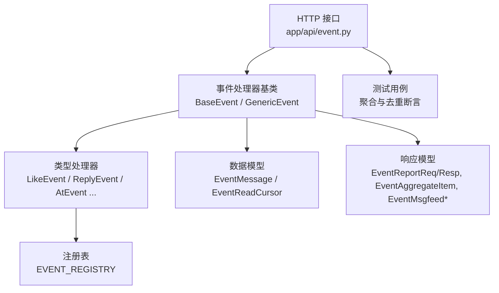
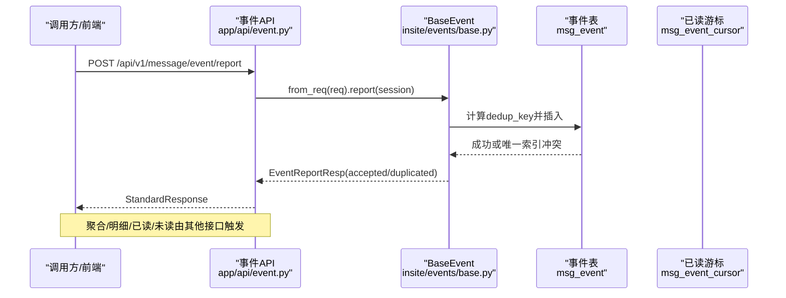
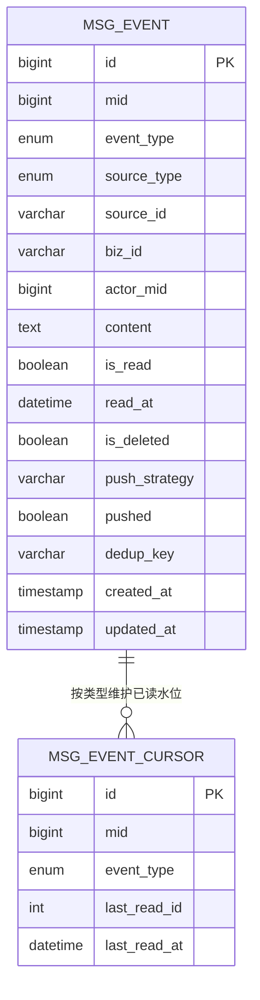
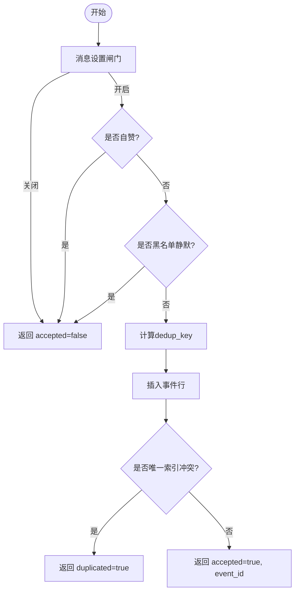
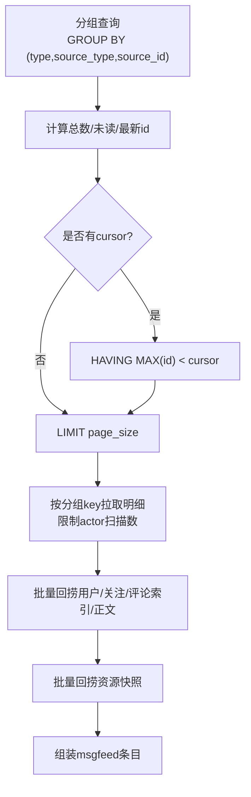
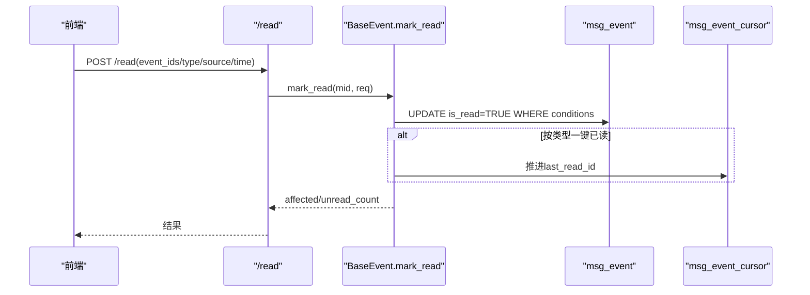
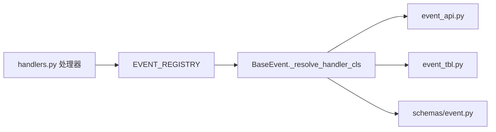

# 事件提醒聚合

<cite>
**本文引用的文件**
- [base.py](file://be-message-service/app/services/message/insite/events/base.py)
- [handlers.py](file://be-message-service/app/services/message/insite/events/handlers.py)
- [registry.py](file://be-message-service/app/services/message/insite/events/registry.py)
- [event_tbl.py](file://be-message-service/app/models/db/event_tbl.py)
- [event.py](file://be-message-service/app/models/schemas/event.py)
- [event_api.py](file://be-message-service/app/api/event.py)
- [test_phase_b_smoke.py](file://be-message-service/tests/test_phase_b_smoke.py)
</cite>

## 目录
1. [简介](#简介)
2. [项目结构](#项目结构)
3. [核心组件](#核心组件)
4. [架构总览](#架构总览)
5. [详细组件分析](#详细组件分析)
6. [依赖关系分析](#依赖关系分析)
7. [性能考量](#性能考量)
8. [故障排查指南](#故障排查指南)
9. [结论](#结论)
10. [附录：典型场景与调用示例路径](#附录：典型场景与调用示例路径)

## 简介
本模块负责“事件提醒聚合”，统一处理点赞、回复、@提及等用户互动事件的收集、验证、去重、聚合与展示。其设计要点包括：
- 写路径：消息设置闸门 → 自赞过滤 → 黑名单静默 → dedup_key 幂等 → 落库即送达（接收方轮询读取）。
- 读路径：按来源实体分组聚合，支持明细列表、B 站风格 msgfeed、已读管理、未读数统计。
- 数据模型：仅存储定位所需 id 与事件正文，标题/封面/跳转等在读取时实时回捞原资源，避免冗余与过期。
- 聚合算法：基于数据库索引的 GROUP BY + HAVING max(id) 游标翻页，保证组级排序与分页一致性。

## 项目结构
事件提醒聚合位于 be-message-service 中，围绕“处理器基类 + 类型处理器 + 注册表”的组织方式展开，配合统一的 HTTP API 与数据模型。

图表来源
- [event_api.py:1-162](file://be-message-service/app/api/event.py#L1-L162)
- [base.py:295-438](file://be-message-service/app/services/message/insite/events/base.py#L295-L438)
- [handlers.py:18-101](file://be-message-service/app/services/message/insite/events/handlers.py#L18-L101)
- [registry.py:22-54](file://be-message-service/app/services/message/insite/events/registry.py#L22-L54)
- [event_tbl.py:31-106](file://be-message-service/app/models/db/event_tbl.py#L31-L106)
- [event.py:44-233](file://be-message-service/app/models/schemas/event.py#L44-L233)
- [test_phase_b_smoke.py:293-310](file://be-message-service/tests/test_phase_b_smoke.py#L293-L310)

章节来源
- [event_api.py:1-162](file://be-message-service/app/api/event.py#L1-L162)
- [base.py:1-800](file://be-message-service/app/services/message/insite/events/base.py#L1-L800)
- [handlers.py:1-102](file://be-message-service/app/services/message/insite/events/handlers.py#L1-L102)
- [registry.py:1-54](file://be-message-service/app/services/message/insite/events/registry.py#L1-L54)
- [event_tbl.py:1-107](file://be-message-service/app/models/db/event_tbl.py#L1-L107)
- [event.py:1-314](file://be-message-service/app/models/schemas/event.py#L1-L314)
- [test_phase_b_smoke.py:293-310](file://be-message-service/tests/test_phase_b_smoke.py#L293-L310)

## 核心组件
- 事件处理器基类 BaseEvent：封装写路径（report）、跨类型读路径（aggregate/list_detail/list_msgfeed/mark_read/delete/count_unread/count_unread_by_type）与通用内容构建（_generic_content）。
- 具体事件处理器：LikeEvent、ReplyEvent、AtEvent 等，声明 event_type、blocked_silent、setting_gate，复用基类逻辑。
- 注册表 EVENT_REGISTRY：将事件枚举映射到处理器类，新增类型只需在 handlers 中注册。
- 数据模型：EventMessage（事件行）、EventReadCursor（已读水位），以及一系列 Pydantic/SQLModel 请求/响应模型。
- HTTP 接口：/report、/aggregate、/list、/read、/delete、/unread，覆盖上报、聚合、明细、已读、删除、未读数。

章节来源
- [base.py:295-1225](file://be-message-service/app/services/message/insite/events/base.py#L295-L1225)
- [handlers.py:18-101](file://be-message-service/app/services/message/insite/events/handlers.py#L18-L101)
- [registry.py:22-54](file://be-message-service/app/services/message/insite/events/registry.py#L22-L54)
- [event_tbl.py:31-106](file://be-message-service/app/models/db/event_tbl.py#L31-L106)
- [event.py:44-233](file://be-message-service/app/models/schemas/event.py#L44-L233)
- [event_api.py:34-162](file://be-message-service/app/api/event.py#L34-L162)

## 架构总览
事件从业务侧通过 HTTP 上报，经 BaseEvent.report 完成校验与幂等写入；前端通过 /aggregate、/list、/unread 拉取聚合卡片、明细与红点计数。

图表来源
- [event_api.py:34-50](file://be-message-service/app/api/event.py#L34-L50)
- [base.py:376-436](file://be-message-service/app/services/message/insite/events/base.py#L376-L436)
- [event_tbl.py:31-86](file://be-message-service/app/models/db/event_tbl.py#L31-L86)

## 详细组件分析

### 数据模型设计
- 事件行 EventMessage：包含 mid、event_type、source_type、source_id、biz_id、actor_mid、content、is_read/read_at/is_deleted、push_strategy/pushed、dedup_key 及时间戳。通过联合索引实现高效聚合查询，通过 dedup_key 唯一索引实现幂等。
- 已读游标 EventReadCursor：记录每种事件类型的 last_read_id 与 last_read_at，用于一键已读后的水位推进。
- 请求/响应模型：EventReportReq/Resp、EventAggregateItem、EventItem、EventMsgfeedContent/Item/Section/Cursor、EventListResp、EventReadReq/Resp、EventUnreadResp 等，明确字段语义与用途。

图表来源
- [event_tbl.py:31-106](file://be-message-service/app/models/db/event_tbl.py#L31-L106)

章节来源
- [event_tbl.py:31-106](file://be-message-service/app/models/db/event_tbl.py#L31-L106)
- [event.py:44-233](file://be-message-service/app/models/schemas/event.py#L44-L233)

### 事件处理器工作流（上报）
- 工厂构造：BaseEvent.from_req(req) 根据 event_type 解析处理器类。
- 写路径 gate：
  - 消息设置闸门：SettingService.accept_event 控制是否投递。
  - 自赞过滤：mid == actor_mid 直接拒绝。
  - 黑名单静默：对 @/回复等点对点打扰类型，若存在双向任一向黑名单则静默。
  - 幂等键：build_dedup_key 基于 mid:event_type:actor_mid:source_type:source_id:biz_id 摘要，唯一索引拦截重复。
  - 落库：提交事务，捕获 IntegrityError 返回 duplicated=True。

图表来源
- [base.py:376-436](file://be-message-service/app/services/message/insite/events/base.py#L376-L436)
- [handlers.py:18-79](file://be-message-service/app/services/message/insite/events/handlers.py#L18-L79)

章节来源
- [base.py:376-436](file://be-message-service/app/services/message/insite/events/base.py#L376-L436)
- [handlers.py:18-79](file://be-message-service/app/services/message/insite/events/handlers.py#L18-L79)

### 事件聚合算法（分组、去重、批量回捞）
- 分组键：(event_type, source_type, source_id)。同一来源实体的同类互动聚合成一张卡片。
- 聚合查询：GROUP BY + COUNT + SUM(is_read==false) + MAX(id) 作为 latest_id，用于排序与游标定位。
- 游标翻页：使用 HAVING MAX(id) < cursor 定位下一页，避免以单行 id 过滤导致整组被误删。
- 详情回捞：按分组 key 拉取组内事件（限制扫描行数），批量获取触发者信息、关注态、评论索引与正文、资源快照，最终组装为 msgfeed 条目。
- 资源快照：按 resource_type/resource_id 批量回捞 title/cover/jumpTarget，不存在时标记 resource_deleted。

图表来源
- [base.py:803-1069](file://be-message-service/app/services/message/insite/events/base.py#L803-L1069)

章节来源
- [base.py:592-724](file://be-message-service/app/services/message/insite/events/base.py#L592-L724)
- [base.py:803-1069](file://be-message-service/app/services/message/insite/events/base.py#L803-L1069)

### 已读管理与游标推进
- 标记已读：支持精确 id、类型、聚合分组、时间戳四种粒度；时间戳条件确保只标记 cutoff 之前的消息。
- 游标推进：当按类型一键已读时，更新 EventReadCursor.last_read_id 至该类型下最大 id（受 read_before 限制）。

图表来源
- [base.py:1071-1199](file://be-message-service/app/services/message/insite/events/base.py#L1071-L1199)
- [event_tbl.py:88-106](file://be-message-service/app/models/db/event_tbl.py#L88-L106)

章节来源
- [base.py:1071-1199](file://be-message-service/app/services/message/insite/events/base.py#L1071-L1199)

### 事件处理器分类与投递语义
- LikeEvent：点赞，setting_gate="recv_like"，非点对点打扰，不启用黑名单静默。
- ReplyEvent：回复，blocked_silent=True，setting_gate="recv_reply"。
- AtEvent：@提及，blocked_silent=True，setting_gate="recv_at"。
- 系统处置类：AuditRejectEvent、HideEvent、ReportRejectEvent、ReportResolvedEvent，无特殊静默。

章节来源
- [handlers.py:18-101](file://be-message-service/app/services/message/insite/events/handlers.py#L18-L101)
- [registry.py:22-54](file://be-message-service/app/services/message/insite/events/registry.py#L22-L54)

## 依赖关系分析
- 处理器与注册表：handlers 在定义完处理器后填充 EVENT_REGISTRY，base 通过 _resolve_handler_cls 查找处理器类，未登记类型回落 GenericEvent。
- 数据访问：BaseEvent 依赖 EventMessage、EventReadCursor 表模型，以及用户服务、评论索引、资源快照等外部能力。
- API 层：event_api 暴露标准 REST 接口，调用 BaseEvent 提供的方法。

图表来源
- [registry.py:22-54](file://be-message-service/app/services/message/insite/events/registry.py#L22-L54)
- [base.py:1221-1225](file://be-message-service/app/services/message/insite/events/base.py#L1221-L1225)
- [handlers.py:81-101](file://be-message-service/app/services/message/insite/events/handlers.py#L81-L101)
- [event_api.py:34-162](file://be-message-service/app/api/event.py#L34-L162)
- [event_tbl.py:31-106](file://be-message-service/app/models/db/event_tbl.py#L31-L106)
- [event.py:44-233](file://be-message-service/app/models/schemas/event.py#L44-L233)

章节来源
- [registry.py:22-54](file://be-message-service/app/services/message/insite/events/registry.py#L22-L54)
- [base.py:1221-1225](file://be-message-service/app/services/message/insite/events/base.py#L1221-L1225)
- [handlers.py:81-101](file://be-message-service/app/services/message/insite/events/handlers.py#L81-L101)
- [event_api.py:34-162](file://be-message-service/app/api/event.py#L34-L162)

## 性能考量
- 索引优化：联合索引 (mid, event_type, source_type, source_id) 支撑高效分组聚合；时间线索引 (mid, event_type, id) 支撑时间倒序翻页。
- 幂等写入：dedup_key 唯一索引避免重复上报，减少无效写入与重复通知。
- 批量回捞：用户信息、评论索引/正文、资源快照均批量获取，降低 N+1 查询开销。
- 游标分页：基于 HAVING MAX(id) 的分组级游标，避免丢组与提前结束，保证 total_count 与 has_more 一致。
- 扫描限制：组内 actor 扫描上限，防止超大分组拖慢响应。

[本节为通用性能建议，无需特定文件引用]

## 故障排查指南
- 重复上报未去重：检查 dedup_key 唯一索引是否存在；确认上报参数 mid/event_type/actor_mid/source_type/source_id/biz_id 是否正确。
- 未读数恒为 0：确认 count_unread_by_type 返回字典键为整数（InteractionActionTypeEnum.value），避免字符串键导致前端无法命中。
- 已读未生效：检查 mark_read 的条件（event_ids/type/source/time）与 read_before 时区转换；确认 EventReadCursor 推进逻辑。
- 聚合丢组/提前结束：确认使用 HAVING MAX(id) < cursor 进行分组级翻页，而非对事件行 id 做过滤。

章节来源
- [base.py:1154-1173](file://be-message-service/app/services/message/insite/events/base.py#L1154-L1173)
- [base.py:1071-1199](file://be-message-service/app/services/message/insite/events/base.py#L1071-L1199)
- [event_tbl.py:31-86](file://be-message-service/app/models/db/event_tbl.py#L31-L86)

## 结论
事件提醒聚合模块通过面向对象的事件处理器、严格的幂等写入、高效的分组聚合与游标翻页，实现了点赞、回复、@提及等互动事件的高可用采集与展示。数据模型精简、读取时实时回捞的策略有效避免了冗余与过期问题；已读管理与游标推进保证了用户体验的一致性。整体架构清晰、扩展性强，便于新增事件类型与业务规则。

[本节为总结性内容，无需特定文件引用]

## 附录：典型场景与调用示例路径
- 上报点赞事件：POST /api/v1/message/event/report
  - 参考路径：[event_api.py:34-50](file://be-message-service/app/api/event.py#L34-L50)
  - 处理器入口：[base.py:376-436](file://be-message-service/app/services/message/insite/events/base.py#L376-L436)
- 查看聚合卡片：GET /api/v1/message/event/aggregate
  - 参考路径：[event_api.py:53-80](file://be-message-service/app/api/event.py#L53-L80)
  - 聚合实现：[base.py:592-724](file://be-message-service/app/services/message/insite/events/base.py#L592-L724)
- 查看明细列表：GET /api/v1/message/event/list
  - 参考路径：[event_api.py:83-114](file://be-message-service/app/api/event.py#L83-L114)
  - msgfeed 实现：[base.py:803-1069](file://be-message-service/app/services/message/insite/events/base.py#L803-L1069)
- 标记已读：POST /api/v1/message/event/read
  - 参考路径：[event_api.py:117-132](file://be-message-service/app/api/event.py#L117-L132)
  - 已读实现：[base.py:1071-1199](file://be-message-service/app/services/message/insite/events/base.py#L1071-L1199)
- 未读数统计：GET /api/v1/message/event/unread
  - 参考路径：[event_api.py:145-158](file://be-message-service/app/api/event.py#L145-L158)
  - 未读统计：[base.py:1154-1173](file://be-message-service/app/services/message/insite/events/base.py#L1154-L1173)
- 去重与聚合测试断言：
  - 参考路径：[test_phase_b_smoke.py:293-310](file://be-message-service/tests/test_phase_b_smoke.py#L293-L310)