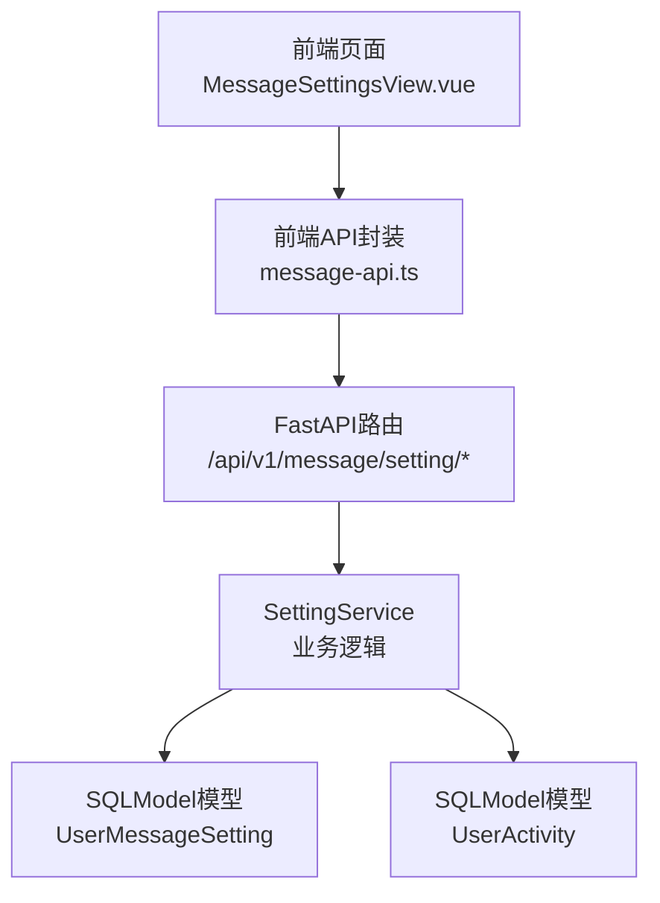
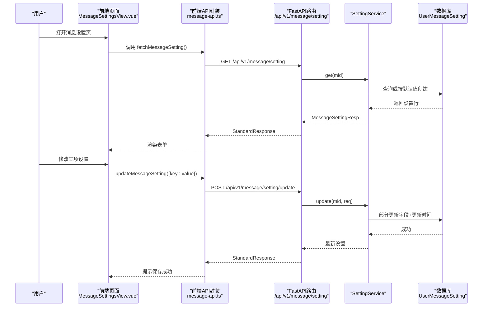
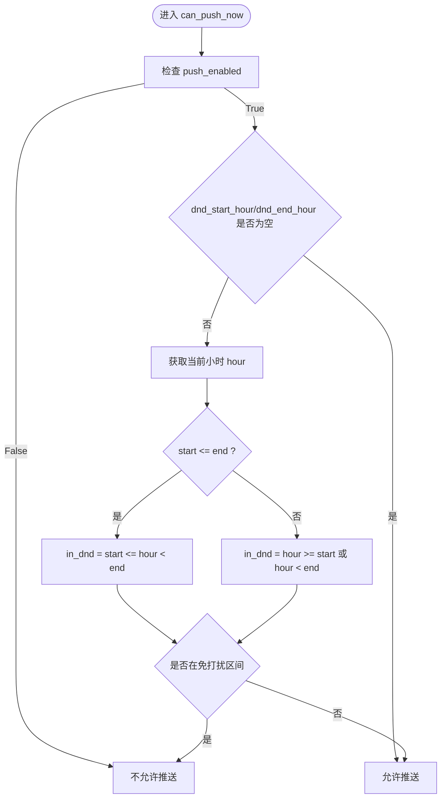
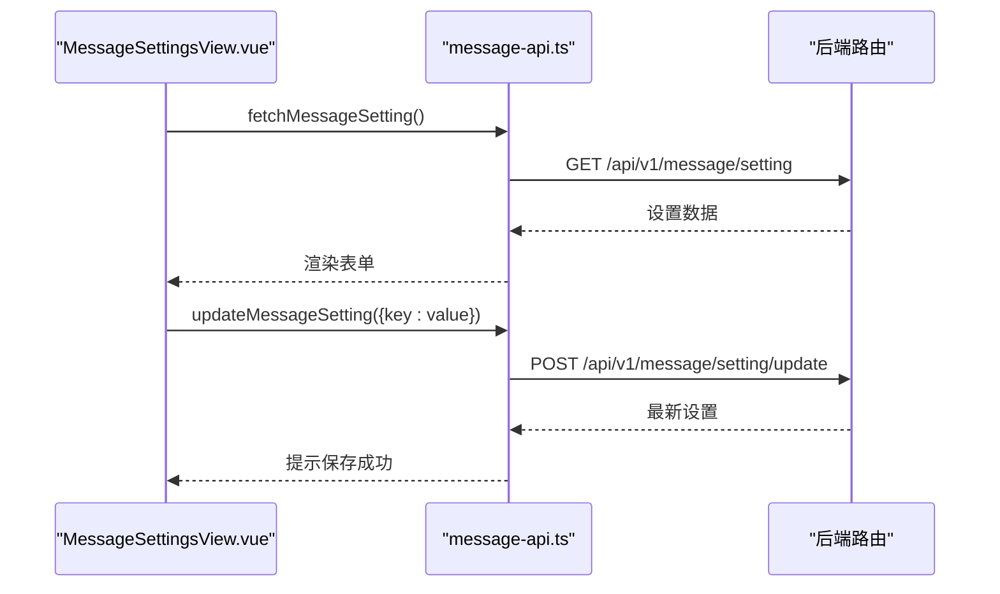
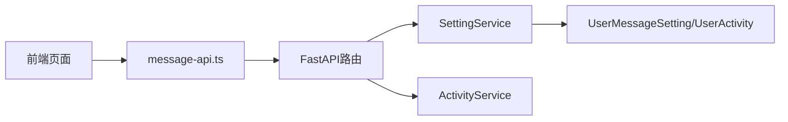

# 消息设置管理

<cite>
**本文引用的文件**
- [setting.py](file://be-message-service/app/services/message/insite/setting.py)
- [setting.py](file://be-message-service/app/api/setting.py)
- [setting_tbl.py](file://be-message-service/app/models/db/setting_tbl.py)
- [setting.py](file://be-message-service/app/models/schemas/setting.py)
- [MessageSettingsView.vue](file://Vue3FrontEndDemoExercise/src/views/message/MessageSettingsView.vue)
- [message-api.ts](file://Vue3FrontEndDemoExercise/src/api/notify/message-api.ts)
</cite>

## 目录
1. [简介](#简介)
2. [项目结构](#项目结构)
3. [核心组件](#核心组件)
4. [架构总览](#架构总览)
5. [详细组件分析](#详细组件分析)
6. [依赖关系分析](#依赖关系分析)
7. [性能与扩展性](#性能与扩展性)
8. [故障排查指南](#故障排查指南)
9. [结论](#结论)
10. [附录：API 定义与交互流程](#附录api-定义与交互流程)

## 简介
本模块提供用户消息偏好设置的管理能力，包括提醒开关（点赞、回复、@提及）、陌生人私信接收、系统通知接收、外部推送渠道总开关以及免打扰时段配置。该设置是消息系统的“第一道闸门”：事件上报、私信投递、通知推送在落库或推送前都会先查询此处，被关闭的类型直接短路，不产生后续流量。

## 项目结构
后端采用 FastAPI + SQLModel 的清晰分层：
- API 层：暴露 REST 接口，负责鉴权、参数校验与响应封装
- 服务层：业务逻辑与规则判定（含免打扰时段判断）
- 数据模型层：数据库表结构与请求/响应 Schema
前端基于 Vue3 + TypeScript，通过统一 API 封装调用后端接口，实现设置页面的加载与增量更新。

图表来源
- [MessageSettingsView.vue:1-101](file://Vue3FrontEndDemoExercise/src/views/message/MessageSettingsView.vue#L1-L101)
- [message-api.ts:394-422](file://Vue3FrontEndDemoExercise/src/api/notify/message-api.ts#L394-L422)
- [setting.py:24-58](file://be-message-service/app/api/setting.py#L24-L58)
- [setting.py:31-151](file://be-message-service/app/services/message/insite/setting.py#L31-L151)
- [setting_tbl.py:19-66](file://be-message-service/app/models/db/setting_tbl.py#L19-L66)

章节来源
- [setting.py:24-58](file://be-message-service/app/api/setting.py#L24-L58)
- [setting.py:31-151](file://be-message-service/app/services/message/insite/setting.py#L31-L151)
- [setting_tbl.py:19-66](file://be-message-service/app/models/db/setting_tbl.py#L19-L66)
- [setting.py:9-48](file://be-message-service/app/models/schemas/setting.py#L9-L48)
- [MessageSettingsView.vue:65-101](file://Vue3FrontEndDemoExercise/src/views/message/MessageSettingsView.vue#L65-L101)
- [message-api.ts:394-422](file://Vue3FrontEndDemoExercise/src/api/notify/message-api.ts#L394-L422)

## 核心组件
- SettingService：提供设置的获取、部分更新、批量确保存在、事件闸门判定、免打扰时段判断等能力
- API Router：提供 GET /update /activity 三个端点
- 数据模型：UserMessageSetting（用户消息设置）、UserActivity（活跃度快照）
- 请求/响应模型：MessageSettingResp、MessageSettingUpdateReq、UserActivityResp
- 前端视图：MessageSettingsView.vue 展示并编辑设置项
- 前端API封装：message-api.ts 提供 fetch/update 方法

章节来源
- [setting.py:31-151](file://be-message-service/app/services/message/insite/setting.py#L31-L151)
- [setting.py:24-58](file://be-message-service/app/api/setting.py#L24-L58)
- [setting_tbl.py:19-66](file://be-message-service/app/models/db/setting_tbl.py#L19-L66)
- [setting.py:9-48](file://be-message-service/app/models/schemas/setting.py#L9-L48)
- [MessageSettingsView.vue:65-101](file://Vue3FrontEndDemoExercise/src/views/message/MessageSettingsView.vue#L65-L101)
- [message-api.ts:394-422](file://Vue3FrontEndDemoExercise/src/api/notify/message-api.ts#L394-L422)

## 架构总览
消息设置作为全局闸门，贯穿事件上报、私信投递、通知推送全流程。前端通过统一的 API 封装进行读取与增量更新；后端在服务层完成并发安全的“不存在即创建”、字段级部分更新、免打扰时段判定与批量初始化。

图表来源
- [MessageSettingsView.vue:86-98](file://Vue3FrontEndDemoExercise/src/views/message/MessageSettingsView.vue#L86-L98)
- [message-api.ts:394-422](file://Vue3FrontEndDemoExercise/src/api/notify/message-api.ts#L394-L422)
- [setting.py:24-58](file://be-message-service/app/api/setting.py#L24-L58)
- [setting.py:35-85](file://be-message-service/app/services/message/insite/setting.py#L35-L85)
- [setting_tbl.py:19-47](file://be-message-service/app/models/db/setting_tbl.py#L19-L47)

## 详细组件分析

### 数据模型设计
- 用户ID：mid（BIGINT，唯一索引）
- 设置项与值：
  - recv_like：是否接收点赞提醒
  - recv_reply：是否接收回复提醒
  - recv_at：是否接收@提醒
  - recv_stranger_dm：是否接收陌生人私信
  - recv_notify：是否接收系统通知
  - push_enabled：是否推送到外部渠道（PushMe/邮件等）
- 免打扰时段：dnd_start_hour、dnd_end_hour（0~23小时，空表示不限制）
- 时间戳：created_at、updated_at（继承自基类）

复杂度与约束
- 单用户一行，读多写少，主键/唯一索引点查高效
- 批量初始化使用 MySQL INSERT ... ON DUPLICATE KEY UPDATE，避免 N+1

章节来源
- [setting_tbl.py:19-47](file://be-message-service/app/models/db/setting_tbl.py#L19-L47)
- [setting.py:21-29](file://be-message-service/app/services/message/insite/setting.py#L21-L29)
- [setting.py:134-151](file://be-message-service/app/services/message/insite/setting.py#L134-L151)

### CRUD API 接口
- GET /api/v1/message/setting：获取当前用户的消息设置；首次访问自动按默认值创建
- POST /api/v1/message/setting/update：部分更新，仅写入显式传入字段，未传字段保持原值
- GET /api/v1/message/setting/activity：获取活跃度快照（用于实时/批量推送分流）

请求/响应
- 请求体：MessageSettingUpdateReq（各字段可选，支持 ge/le 校验）
- 响应体：StandardResponse[MessageSettingResp]

验证规则
- dnd_start_hour/dnd_end_hour 范围 0~23
- 布尔型开关均为可选，未传则不覆盖

章节来源
- [setting.py:24-58](file://be-message-service/app/api/setting.py#L24-L58)
- [setting.py:9-48](file://be-message-service/app/models/schemas/setting.py#L9-L48)

### 免打扰时段实现逻辑
- 总开关优先：push_enabled=False 时，任何时刻都不允许外部推送
- 时段为空：任一为 None 视为不限制，允许推送
- 普通区间：start <= end 时，当前小时 hour 满足 start <= hour < end 即为免打扰
- 跨零点区间：start > end 时，hour >= start 或 hour < end 即为免打扰
- 最终结果：不在免打扰区间且开启外部推送才允许推送

图表来源
- [setting.py:117-131](file://be-message-service/app/services/message/insite/setting.py#L117-L131)

章节来源
- [setting.py:117-131](file://be-message-service/app/services/message/insite/setting.py#L117-L131)

### 事件闸门与优先级
- accept_event：根据 setting_gate 字段动态读取对应开关；None 表示系统侧通知恒投递
- accept_stranger_dm：控制陌生人私信是否接收
- accept_notify：控制系统通知是否接收
- 优先级：外部推送总开关 > 免打扰时段 > 具体类型开关

章节来源
- [setting.py:89-114](file://be-message-service/app/services/message/insite/setting.py#L89-L114)

### 前端交互流程
- 页面加载：调用 fetchMessageSetting 拉取设置并填充表单
- 变更触发：每个开关/时段控件变化时立即调用 updateMessageSetting 进行增量更新
- 反馈体验：成功后显示本地提示文案

图表来源
- [MessageSettingsView.vue:86-98](file://Vue3FrontEndDemoExercise/src/views/message/MessageSettingsView.vue#L86-L98)
- [message-api.ts:394-422](file://Vue3FrontEndDemoExercise/src/api/notify/message-api.ts#L394-L422)
- [setting.py:24-58](file://be-message-service/app/api/setting.py#L24-L58)

章节来源
- [MessageSettingsView.vue:65-101](file://Vue3FrontEndDemoExercise/src/views/message/MessageSettingsView.vue#L65-L101)
- [message-api.ts:394-422](file://Vue3FrontEndDemoExercise/src/api/notify/message-api.ts#L394-L422)

## 依赖关系分析
- API 路由依赖：SessionDep、RequiredUser、SettingService、ActivityService
- 服务层依赖：SQLModel 异步会话、MySQL 方言插入、日志记录
- 数据层依赖：UserMessageSetting、UserActivity 表模型
- 前端依赖：hey-api 生成的 SDK、统一 request 封装

图表来源
- [setting.py:24-58](file://be-message-service/app/api/setting.py#L24-L58)
- [setting.py:31-151](file://be-message-service/app/services/message/insite/setting.py#L31-L151)
- [setting_tbl.py:19-66](file://be-message-service/app/models/db/setting_tbl.py#L19-L66)
- [message-api.ts:394-422](file://Vue3FrontEndDemoExercise/src/api/notify/message-api.ts#L394-L422)

章节来源
- [setting.py:24-58](file://be-message-service/app/api/setting.py#L24-L58)
- [setting.py:31-151](file://be-message-service/app/services/message/insite/setting.py#L31-L151)
- [setting_tbl.py:19-66](file://be-message-service/app/models/db/setting_tbl.py#L19-L66)
- [message-api.ts:394-422](file://Vue3FrontEndDemoExercise/src/api/notify/message-api.ts#L394-L422)

## 性能与扩展性
- 读多写少：每用户一行设置，点查高效；批量初始化使用 UPSERT 降低往返
- 并发安全：get_or_create 在冲突时回滚并重试读取，保证幂等
- 可扩展点：
  - 新增提醒类型：在模型与默认值中增加字段，并在 accept_event 映射到对应字段
  - 更细粒度免打扰：可引入分钟级区间或多段区间，需调整 can_push_now 逻辑
  - 渠道选择：可在 push_enabled 基础上增加 channel 列表与优先级策略

[本节为通用指导，无需特定文件引用]

## 故障排查指南
常见问题与定位建议
- 设置未生效：确认事件上报路径是否调用 accept_event/accept_stranger_dm/accept_notify 进行前置判断
- 免打扰误判：检查 dnd_start_hour/dnd_end_hour 是否为空、是否跨零点、当前小时计算是否正确
- 并发冲突：观察 get_or_create 的回滚重试逻辑，确认唯一键冲突场景
- 前端未刷新：确认 update 成功后前端是否正确更新 form 状态并提示

章节来源
- [setting.py:35-53](file://be-message-service/app/services/message/insite/setting.py#L35-L53)
- [setting.py:117-131](file://be-message-service/app/services/message/insite/setting.py#L117-L131)

## 结论
消息设置管理模块以简洁的数据模型和清晰的分层实现了高内聚、低耦合的设置管理能力。通过“第一道闸门”的设计，有效减少无效流量；免打扰时段与优先级处理保证了用户体验与系统效率的平衡。前后端协作流畅，支持增量更新与即时反馈，具备良好的可维护性与扩展性。

[本节为总结性内容，无需特定文件引用]

## 附录：API 定义与交互流程

### API 端点
- GET /api/v1/message/setting
  - 功能：获取当前用户消息设置；首次访问自动初始化
  - 响应：StandardResponse[MessageSettingResp]
- POST /api/v1/message/setting/update
  - 功能：部分更新设置项
  - 请求：MessageSettingUpdateReq（字段可选，带范围校验）
  - 响应：StandardResponse[MessageSettingResp]
- GET /api/v1/message/setting/activity
  - 功能：获取活跃度快照（is_active 决定实时/批量推送）
  - 响应：StandardResponse[UserActivityResp]

章节来源
- [setting.py:24-58](file://be-message-service/app/api/setting.py#L24-L58)
- [setting.py:9-48](file://be-message-service/app/models/schemas/setting.py#L9-L48)

### 前端调用示例（路径引用）
- 加载设置：见 [MessageSettingsView.vue:86-90](file://Vue3FrontEndDemoExercise/src/views/message/MessageSettingsView.vue#L86-L90)
- 增量更新：见 [MessageSettingsView.vue:92-98](file://Vue3FrontEndDemoExercise/src/views/message/MessageSettingsView.vue#L92-L98)
- API 封装：见 [message-api.ts:394-422](file://Vue3FrontEndDemoExercise/src/api/notify/message-api.ts#L394-L422)

章节来源
- [MessageSettingsView.vue:86-98](file://Vue3FrontEndDemoExercise/src/views/message/MessageSettingsView.vue#L86-L98)
- [message-api.ts:394-422](file://Vue3FrontEndDemoExercise/src/api/notify/message-api.ts#L394-L422)