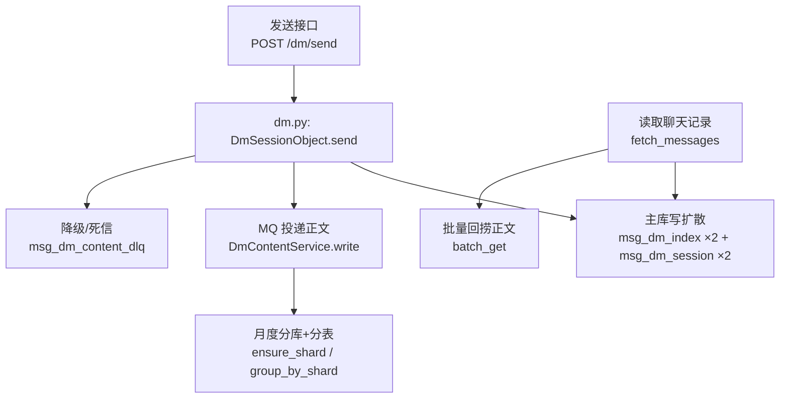
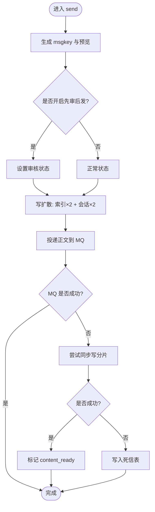
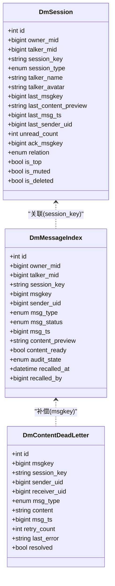
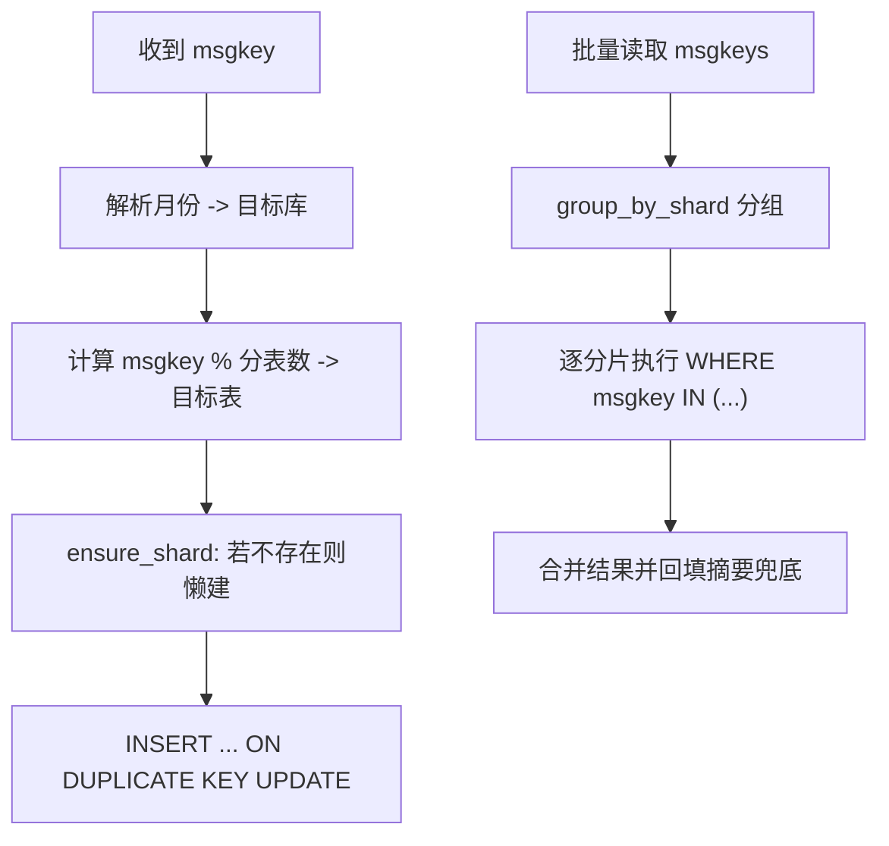
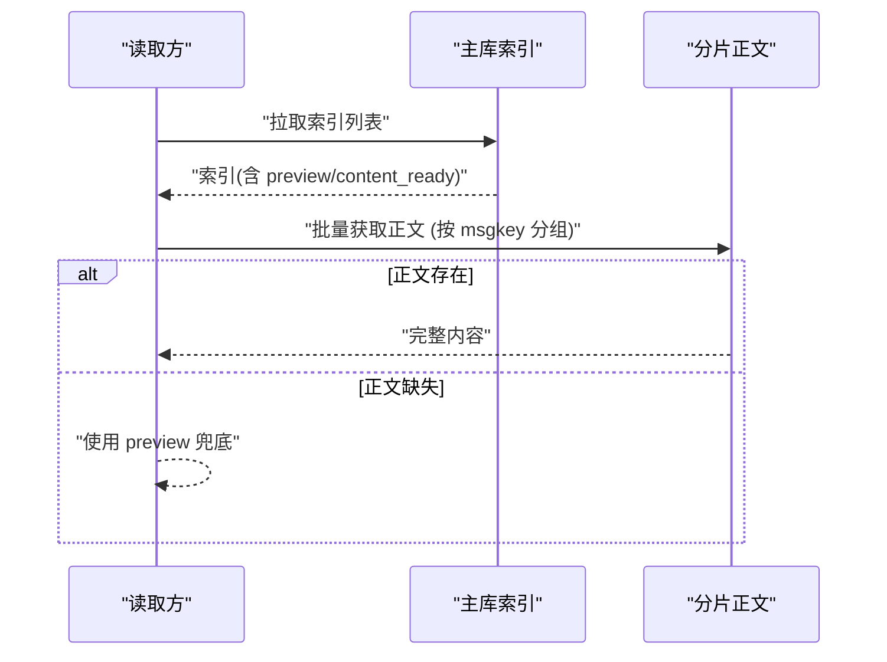
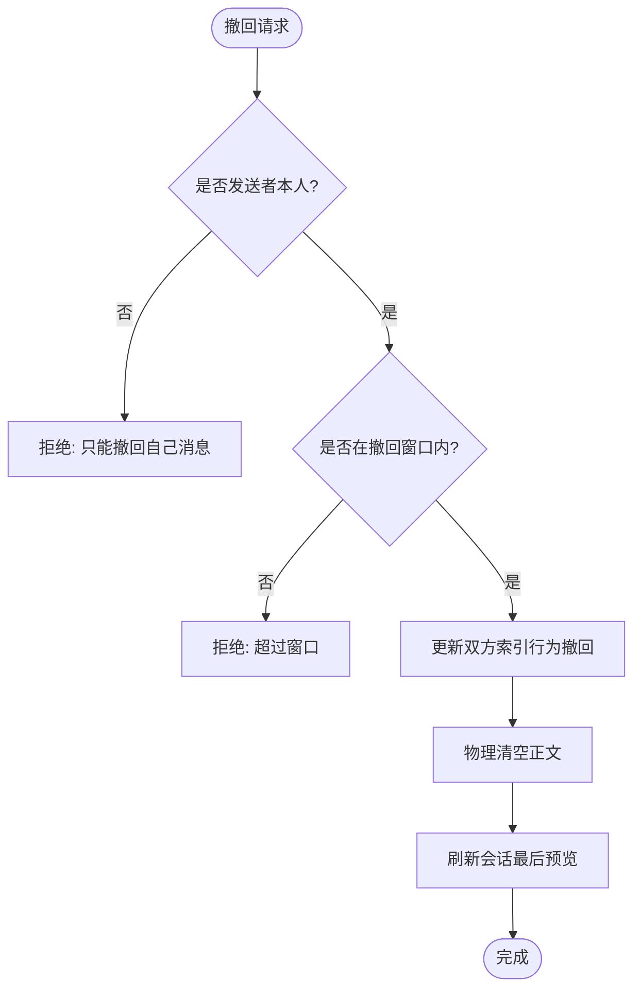
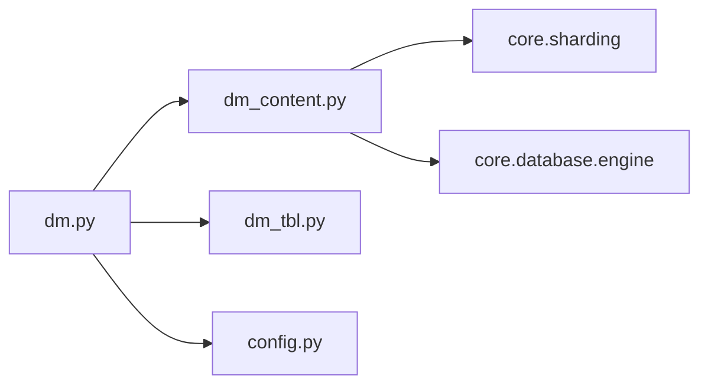

# 私信处理

<cite>
**本文引用的文件**
- [dm.py](file://be-message-service/app/services/message/dm/dm.py)
- [dm_content.py](file://be-message-service/app/services/message/dm/dm_content.py)
- [dm_tbl.py](file://be-message-service/app/models/db/dm_tbl.py)
- [config.py](file://be-message-service/app/core/config.py)
- [README.md](file://be-message-service/README.md)
</cite>

## 目录
1. [简介](#简介)
2. [项目结构](#项目结构)
3. [核心组件](#核心组件)
4. [架构总览](#架构总览)
5. [详细组件分析](#详细组件分析)
6. [依赖关系分析](#依赖关系分析)
7. [性能考量](#性能考量)
8. [故障排查指南](#故障排查指南)
9. [结论](#结论)
10. [附录](#附录)

## 简介
本模块实现私信（单聊）的读写与分库分表策略，采用“写扩散 + 内容异步化”的设计：发送时同步写入主库索引与会话行，确保消息立刻可见；正文通过 MQ 异步落库到按月度分库、按月内分表的存储中。读路径先查主库索引，再批量回捞正文，缺失时以摘要兜底，保证用户体验不受异步延迟影响。同时提供死信重试机制，保障正文最终一致。

## 项目结构
私信相关代码集中在 be-message-service 服务中，关键文件如下：
- 领域层与流程编排：app/services/message/dm/dm.py
- 内容分片读写：app/services/message/dm/dm_content.py
- 数据模型定义：app/models/db/dm_tbl.py
- 配置项（分库分表前缀、数量等）：app/core/config.py
- 路由与说明文档：be-message-service/README.md



图表来源
- [dm.py:253-361](file://be-message-service/app/services/message/dm/dm.py#L253-L361)
- [dm_content.py:38-92](file://be-message-service/app/services/message/dm/dm_content.py#L38-L92)
- [config.py:41-52](file://be-message-service/app/core/config.py#L41-L52)
- [README.md:52-67](file://be-message-service/README.md#L52-L67)

章节来源
- [dm.py:1-100](file://be-message-service/app/services/message/dm/dm.py#L1-L100)
- [dm_content.py:1-32](file://be-message-service/app/services/message/dm/dm_content.py#L1-L32)
- [dm_tbl.py:1-18](file://be-message-service/app/models/db/dm_tbl.py#L1-L18)
- [config.py:41-58](file://be-message-service/app/core/config.py#L41-L58)
- [README.md:43-67](file://be-message-service/README.md#L43-L67)

## 核心组件
- 会话对象与发送流程：DmSessionObject（封装 owner/talker 视角的写扩散、撤回、已读、删除等）
- 内容分片服务：DmContentService（按 msgkey 路由到月度库分表，支持幂等写入与批量读取）
- 数据模型：DmSession（会话）、DmMessageIndex（消息索引）、DmContentDeadLetter（正文死信）
- 配置：分库名前缀、分表名前缀、分表数量、连接池参数等

章节来源
- [dm.py:201-361](file://be-message-service/app/services/message/dm/dm.py#L201-L361)
- [dm_content.py:35-112](file://be-message-service/app/services/message/dm/dm_content.py#L35-L112)
- [dm_tbl.py:36-179](file://be-message-service/app/models/db/dm_tbl.py#L36-L179)
- [config.py:41-58](file://be-message-service/app/core/config.py#L41-L58)

## 架构总览
私信系统采用“主库索引 + 分片正文”的分层存储：
- 主库：仅存轻量索引与会话，保证低延迟、高吞吐的读写
- 分片库：按 msgkey 内嵌时间戳选择月度库，再按取余选择分表，承载大字段正文
- 异步化：正文通过 MQ 异步落库，失败走降级与死信补偿
- 读侧兜底：索引冗余 content_preview 与 content_ready，正文未就绪时返回摘要

```mermaid
sequenceDiagram
participant Client as "客户端"
participant API as "dm.py : send"
participant DB as "主库(索引/会话)"
participant MQ as "消息队列"
participant Shard as "分片库(月度库+分表)"
participant DLQ as "死信表"
Client->>API : "POST /dm/send"
API->>DB : "写扩散 : 索引×2 + 会话×2"
API-->>Client : "返回 msgkey/session_key/msg_ts"
API->>MQ : "投递正文 payload"
alt MQ 成功
MQ->>Shard : "异步写入分片(幂等)"
Shard-->>MQ : "OK"
else MQ 失败
API->>DB : "降级同步写分片(可选)"
alt 同步也失败
API->>DLQ : "记录死信(等待定时重试)"
end
end
Note over Client,Shard : "读接口可立即返回摘要; 正文就绪后自动切到完整内容"
```

图表来源
- [dm.py:253-361](file://be-message-service/app/services/message/dm/dm.py#L253-L361)
- [dm_content.py:38-92](file://be-message-service/app/services/message/dm/dm_content.py#L38-L92)
- [dm_tbl.py:150-179](file://be-message-service/app/models/db/dm_tbl.py#L150-L179)
- [README.md:52-67](file://be-message-service/README.md#L52-L67)

## 详细组件分析

### 写扩散与发送链路
- 生成 msgkey（雪花 ID，内嵌毫秒时间戳），用于后续路由与时间判断
- 同步写主库：为发送方与接收方各写一条索引行，并更新双方会话行（统一锁顺序避免双向并发死锁）
- 异步投递正文到 MQ，消费者路由到月度库分表写入
- 到达提醒按活跃度决定实时或批量（站内信场景不依赖第三方推送）
- 审核态弱依赖通知发送者，不影响主流程



图表来源
- [dm.py:253-361](file://be-message-service/app/services/message/dm/dm.py#L253-L361)
- [dm.py:453-473](file://be-message-service/app/services/message/dm/dm.py#L453-L473)

章节来源
- [dm.py:253-361](file://be-message-service/app/services/message/dm/dm.py#L253-L361)
- [dm.py:363-451](file://be-message-service/app/services/message/dm/dm.py#L363-L451)
- [dm.py:453-473](file://be-message-service/app/services/message/dm/dm.py#L453-L473)

### 私信数据模型
- 会话表（msg_dm_session）：owner_mid、talker_mid、session_key、last_msgkey、last_content_preview、unread_count、ack_msgkey、relation、is_top、is_muted、is_deleted 等
- 索引表（msg_dm_index）：owner_mid、talker_mid、session_key、msgkey、sender_uid、msg_type、msg_status、msg_ts、content_preview、content_ready、audit_state、recalled_at/recalled_by
- 死信表（msg_dm_content_dlq）：msgkey、session_key、sender_uid、receiver_uid、msg_type、content、msg_ts、retry_count、last_error、resolved



图表来源
- [dm_tbl.py:36-179](file://be-message-service/app/models/db/dm_tbl.py#L36-L179)

章节来源
- [dm_tbl.py:36-179](file://be-message-service/app/models/db/dm_tbl.py#L36-L179)

### 月度分库分表策略
- 分片键：msgkey（雪花 ID，内嵌毫秒时间戳）
- 路由规则：
  - 库名 = dm_content_db_prefix_YYYYMM（由 msgkey 解析月份）
  - 表名 = dm_content_table_prefix_XX（由 msgkey % 分表数量）
- 懒建与预热：不存在则运行时创建；定时任务提前预建下月分表
- 读优化：按 msgkey 分组到不同分片，每个分片一次 IN 查询，最多 N 次查询命中 N 张表



图表来源
- [README.md:52-67](file://be-message-service/README.md#L52-L67)
- [dm_content.py:38-92](file://be-message-service/app/services/message/dm/dm_content.py#L38-L92)
- [config.py:41-52](file://be-message-service/app/core/config.py#L41-L52)

章节来源
- [README.md:52-67](file://be-message-service/README.md#L52-L67)
- [dm_content.py:38-92](file://be-message-service/app/services/message/dm/dm_content.py#L38-L92)
- [config.py:41-52](file://be-message-service/app/core/config.py#L41-L52)

### 读写分离与内容异步化
- 写路径：主库索引与会话同步写入；正文异步落库到分片
- 读路径：主库索引优先返回，正文按需批量回捞；未就绪时使用 content_preview 兜底
- 一致性：content_ready 置位标志正文就绪；死信表保障最终一致



图表来源
- [dm.py:476-577](file://be-message-service/app/services/message/dm/dm.py#L476-L577)
- [dm_content.py:65-92](file://be-message-service/app/services/message/dm/dm_content.py#L65-L92)
- [dm_tbl.py:126-132](file://be-message-service/app/models/db/dm_tbl.py#L126-L132)

章节来源
- [dm.py:476-577](file://be-message-service/app/services/message/dm/dm.py#L476-L577)
- [dm_content.py:65-92](file://be-message-service/app/services/message/dm/dm_content.py#L65-L92)
- [dm_tbl.py:126-132](file://be-message-service/app/models/db/dm_tbl.py#L126-L132)

### 撤回与删除
- 删除：仅对当前视角索引行标记删除，对方仍可见
- 撤回：限制时间内仅发送者可撤回；双向索引行标记撤回并清空正文；会话列表快照同步刷新



图表来源
- [dm.py:596-651](file://be-message-service/app/services/message/dm/dm.py#L596-L651)

章节来源
- [dm.py:596-651](file://be-message-service/app/services/message/dm/dm.py#L596-L651)

## 依赖关系分析
- 领域层依赖：
  - dm.py 依赖 dm_content.py（正文分片读写）、数据库模型（dm_tbl.py）、配置（config.py）、活动与通知服务
  - dm_content.py 依赖 core.sharding（路由）、core.database（引擎）
- 外部依赖：
  - MySQL（主库与分片库）
  - 消息队列（MQ，用于正文异步投递）
  - 定时任务（死信重试、分表预热）



图表来源
- [dm.py:49-74](file://be-message-service/app/services/message/dm/dm.py#L49-L74)
- [dm_content.py:18-24](file://be-message-service/app/services/message/dm/dm_content.py#L18-L24)

章节来源
- [dm.py:49-74](file://be-message-service/app/services/message/dm/dm.py#L49-L74)
- [dm_content.py:18-24](file://be-message-service/app/services/message/dm/dm_content.py#L18-L24)

## 性能考量
- 写扩散降低读复杂度：单聊固定放大系数 2，读路径无需 JOIN，适合高并发读取
- 内容异步化隔离 RT：正文长度与跨库路由（可能触发 DDL）不影响发送接口响应
- 幂等写入：ON DUPLICATE KEY UPDATE 保证 MQ 重投不重复
- 批量回捞：按分片分组 IN 查询，减少网络与 SQL 开销
- 死锁与重试：MySQL 1213 死锁捕获后按同一 msgkey 重试，避免重复消息
- 连接池与超时：合理配置 pool_size、max_overflow、recycle，避免资源耗尽
- 预热与懒建：提前创建下月分表，降低冷启动抖动

章节来源
- [dm.py:94-107](file://be-message-service/app/services/message/dm/dm.py#L94-L107)
- [dm_content.py:38-92](file://be-message-service/app/services/message/dm/dm_content.py#L38-L92)
- [config.py:41-58](file://be-message-service/app/core/config.py#L41-L58)
- [README.md:52-67](file://be-message-service/README.md#L52-L67)

## 故障排查指南
- 正文未显示或显示摘要：检查 content_ready 与 batch_get 是否命中分片；历史月份库不存在会返回空，上层用摘要兜底
- 发送失败或丢正文：查看 MQ 投递与降级逻辑；确认是否落入 msg_dm_content_dlq；检查定时任务是否执行重试
- 死锁频繁：关注并发写扩散导致的 MySQL 1213；确认重试次数与日志；必要时调整并发度或索引
- 分片路由异常：核对 msgkey 解析月份与取余是否正确；确认分库名前缀与分表数量配置
- 撤回/删除无效：检查权限与时间窗口；确认索引行状态与正文清理是否执行

章节来源
- [dm_content.py:65-92](file://be-message-service/app/services/message/dm/dm_content.py#L65-L92)
- [dm.py:453-473](file://be-message-service/app/services/message/dm/dm.py#L453-L473)
- [dm.py:596-651](file://be-message-service/app/services/message/dm/dm.py#L596-L651)
- [dm_tbl.py:150-179](file://be-message-service/app/models/db/dm_tbl.py#L150-L179)
- [config.py:41-52](file://be-message-service/app/core/config.py#L41-L52)

## 结论
该私信模块通过写扩散与内容异步化，在保证“消息立刻可见”的同时，将正文落库与可能的 DDL 从同步链路剥离，显著提升写吞吐与稳定性。月度分库分表基于 msgkey 自解释路由，读侧通过批量回捞与摘要兜底兼顾可用性与性能。配合死信重试与预热机制，系统在高峰与异常场景下具备良好弹性与恢复能力。

## 附录
- 配置项参考：
  - 分库名前缀、分表名前缀、分表数量、连接池大小与溢出、回收周期等
- 关键流程参考：
  - 发送链路、读取链路、撤回/删除、死信补偿

章节来源
- [config.py:41-58](file://be-message-service/app/core/config.py#L41-L58)
- [README.md:43-67](file://be-message-service/README.md#L43-L67)