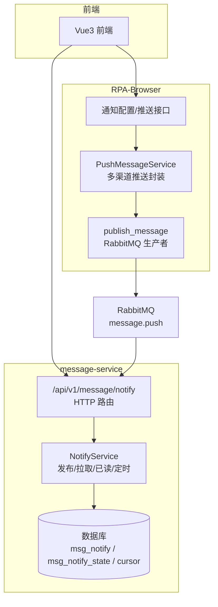
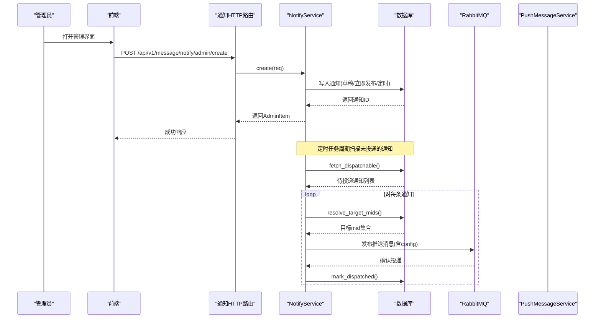
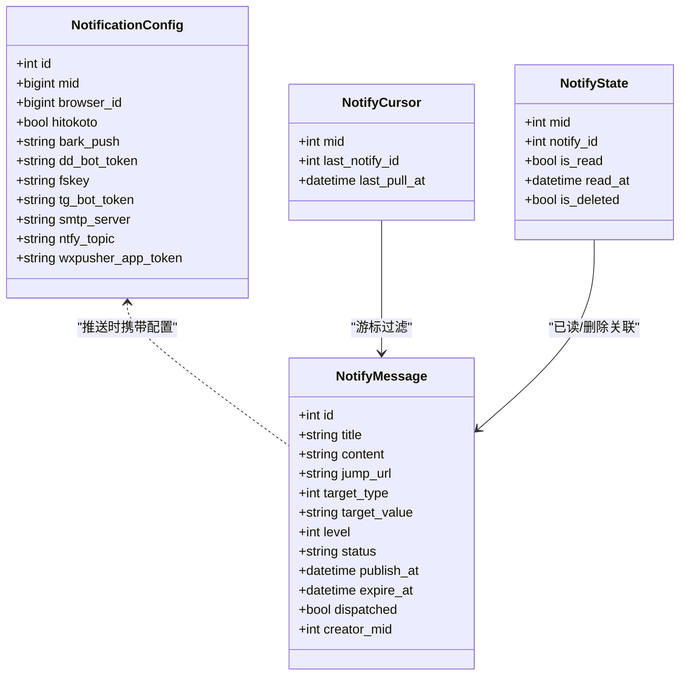
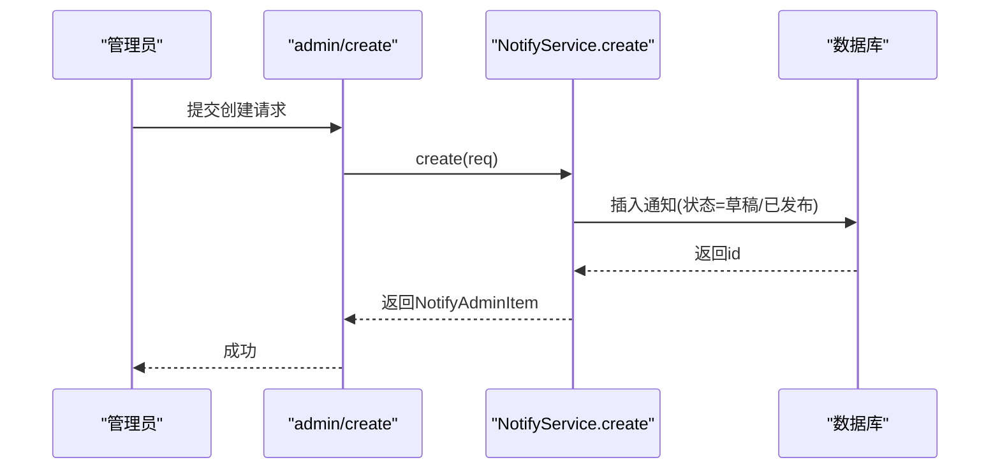
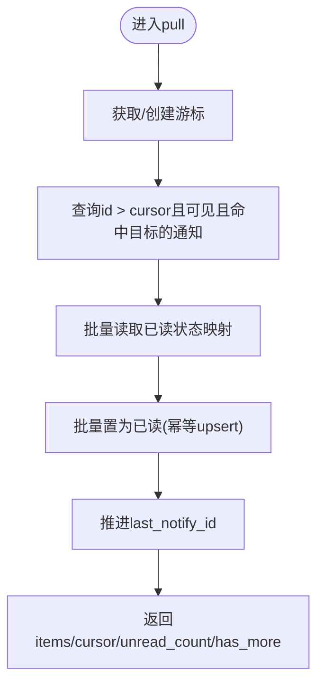
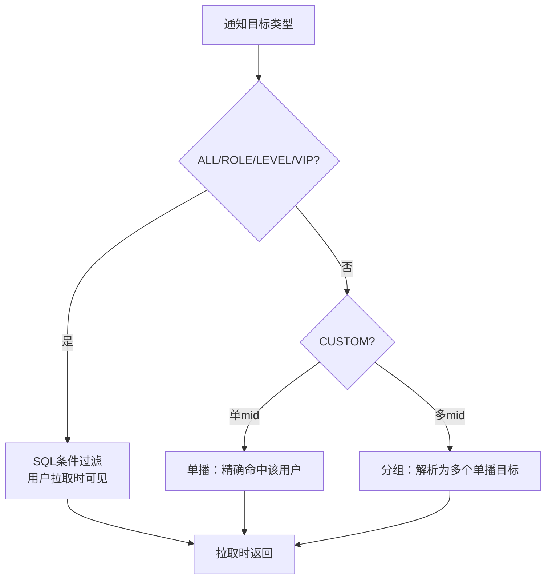
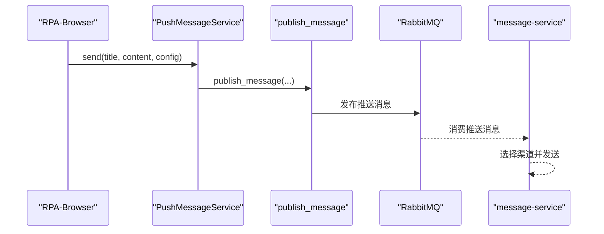
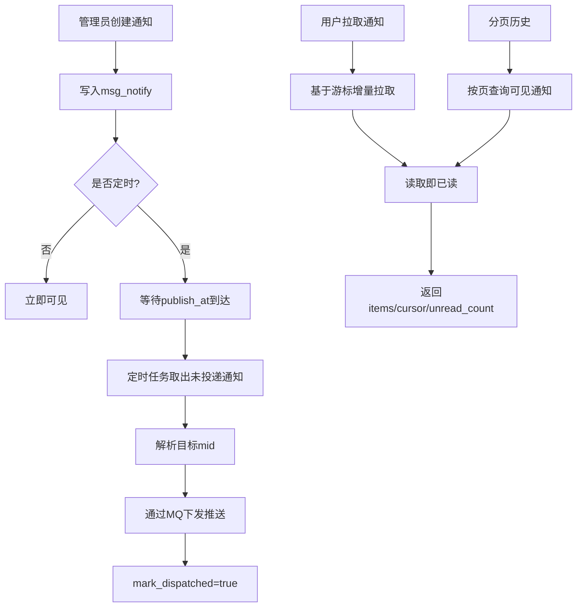
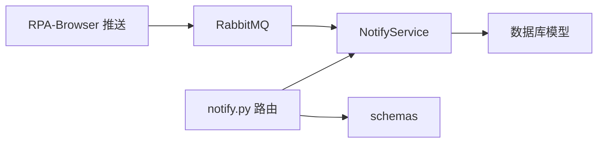

# 系统通知管理

<cite>
**本文引用的文件**
- [be-message-service/app/api/notify.py](file://be-message-service/app/api/notify.py)
- [be-message-service/app/services/message/insite/notify.py](file://be-message-service/app/services/message/insite/notify.py)
- [RPA-Browser/app/models/database/notify/models.py](file://RPA-Browser/app/models/database/notify/models.py)
- [RPA-Browser/app/models/notify/request_models.py](file://RPA-Browser/app/models/notify/request_models.py)
- [RPA-Browser/app/models/notify/response_models.py](file://RPA-Browser/app/models/notify/response_models.py)
- [RPA-Browser/app/services/message/push_msg.py](file://RPA-Browser/app/services/message/push_msg.py)
- [RPA-Browser/app/services/message/message_pub.py](file://RPA-Browser/app/services/message/message_pub.py)
- [Vue3FrontEndDemoExercise/src/api/community/hey-api/services/MessageNotifyService.gen.ts](file://Vue3FrontEndDemoExercise/src/api/community/hey-api/services/MessageNotifyService.gen.ts)
</cite>

## 目录
1. [简介](#简介)
2. [项目结构](#项目结构)
3. [核心组件](#核心组件)
4. [架构总览](#架构总览)
5. [详细组件分析](#详细组件分析)
6. [依赖关系分析](#依赖关系分析)
7. [性能与可扩展性](#性能与可扩展性)
8. [故障排查指南](#故障排查指南)
9. [结论](#结论)
10. [附录：API 参考](#附录api-参考)

## 简介
本模块提供“系统通知”的完整生命周期能力：管理员发布（含定时）、用户侧增量拉取与分页查看、读取即已读、未读数统计、撤回与删除（仅管理员），以及面向站内消息的分发机制。同时，RPA-Browser 侧提供“推送渠道配置”的统一管理与多通道推送能力，并通过消息队列将推送请求交由 message-service 统一处理。

## 项目结构
- be-message-service：负责通知的持久化、可见性判定、游标拉取、已读状态维护、管理员操作与定时投递准备。
- RPA-Browser：负责推送渠道配置（按浏览器实例或全局）与多渠道推送封装；通过消息队列把推送任务交给 message-service。
- Vue3 前端：调用后端通知 API（如管理员创建通知等）。

图表来源
- [be-message-service/app/api/notify.py:1-217](file://be-message-service/app/api/notify.py#L1-L217)
- [be-message-service/app/services/message/insite/notify.py:1-668](file://be-message-service/app/services/message/insite/notify.py#L1-L668)
- [RPA-Browser/app/services/message/push_msg.py:1-800](file://RPA-Browser/app/services/message/push_msg.py#L1-L800)
- [RPA-Browser/app/services/message/message_pub.py:1-41](file://RPA-Browser/app/services/message/message_pub.py#L1-L41)

章节来源
- [be-message-service/app/api/notify.py:1-217](file://be-message-service/app/api/notify.py#L1-L217)
- [be-message-service/app/services/message/insite/notify.py:1-668](file://be-message-service/app/services/message/insite/notify.py#L1-L668)
- [RPA-Browser/app/services/message/push_msg.py:1-800](file://RPA-Browser/app/services/message/push_msg.py#L1-L800)
- [RPA-Browser/app/services/message/message_pub.py:1-41](file://RPA-Browser/app/services/message/message_pub.py#L1-L41)

## 核心组件
- 通知服务 NotifyService：实现管理员发布/更新/撤回、用户拉取/分页/未读数、读取即已读、定时投递准备、目标受众解析。
- 通知 HTTP 路由：暴露管理员与普通用户的通知接口。
- 推送渠道服务 PushMessageService：聚合 Bark、钉钉、飞书、企业微信、Telegram、SMTP、Ntfy、WxPusher 等多通道。
- 消息发布器 publish_message：将推送请求发送到 RabbitMQ，由 message-service 消费并执行实际推送。
- 通知配置模型：支持按浏览器实例或全局的配置项，用于 RPA-Browser 侧推送。

章节来源
- [be-message-service/app/services/message/insite/notify.py:108-668](file://be-message-service/app/services/message/insite/notify.py#L108-L668)
- [be-message-service/app/api/notify.py:43-217](file://be-message-service/app/api/notify.py#L43-L217)
- [RPA-Browser/app/services/message/push_msg.py:44-800](file://RPA-Browser/app/services/message/push_msg.py#L44-L800)
- [RPA-Browser/app/services/message/message_pub.py:1-41](file://RPA-Browser/app/services/message/message_pub.py#L1-L41)
- [RPA-Browser/app/models/database/notify/models.py:13-157](file://RPA-Browser/app/models/database/notify/models.py#L13-L157)

## 架构总览
通知系统采用“读扩散 + 游标 + 已读表”的设计：
- 通知本体只存一份（msg_notify），用户侧维护游标（msg_notify_cursor）和已读/删除状态（msg_notify_state）。
- 避免重复消费：游标增量拉取、已读幂等 upsert、定时投递使用 dispatched 标记。
- 推送通道解耦：RPA-Browser 通过消息队列发送推送请求，message-service 统一消费并调用各渠道。

图表来源
- [be-message-service/app/api/notify.py:143-163](file://be-message-service/app/api/notify.py#L143-L163)
- [be-message-service/app/services/message/insite/notify.py:113-154](file://be-message-service/app/services/message/insite/notify.py#L113-L154)
- [be-message-service/app/services/message/insite/notify.py:565-615](file://be-message-service/app/services/message/insite/notify.py#L565-L615)
- [RPA-Browser/app/services/message/message_pub.py:27-41](file://RPA-Browser/app/services/message/message_pub.py#L27-L41)

## 详细组件分析

### 数据模型设计
- 通知消息（msg_notify）：包含标题、内容、跳转链接、目标类型、目标值、优先级、状态、发布时间、过期时间、是否已投递等字段。
- 用户游标（msg_notify_cursor）：记录每个用户上次拉取的 last_notify_id。
- 用户状态（msg_notify_state）：记录每个用户对某条通知的已读/删除状态及时间。
- 推送渠道配置（NotificationConfig）：支持按浏览器实例或全局配置多种推送渠道参数。

图表来源
- [RPA-Browser/app/models/database/notify/models.py:13-157](file://RPA-Browser/app/models/database/notify/models.py#L13-L157)
- [be-message-service/app/services/message/insite/notify.py:32-46](file://be-message-service/app/services/message/insite/notify.py#L32-L46)

章节来源
- [RPA-Browser/app/models/database/notify/models.py:13-157](file://RPA-Browser/app/models/database/notify/models.py#L13-L157)
- [be-message-service/app/services/message/insite/notify.py:32-46](file://be-message-service/app/services/message/insite/notify.py#L32-L46)

### 管理员发布通知
- 入口：POST /api/v1/message/notify/admin/create
- 行为：根据 publish_now 决定立即发布或草稿；若 publish_at 为未来时间则为定时发布；最终落库并返回管理员视图对象。
- 幂等：RPC 通道使用 create_idempotent 针对 CUSTOM+单 mid 场景进行判重，HTTP 管理端不做判重。

图表来源
- [be-message-service/app/api/notify.py:143-163](file://be-message-service/app/api/notify.py#L143-L163)
- [be-message-service/app/services/message/insite/notify.py:113-154](file://be-message-service/app/services/message/insite/notify.py#L113-L154)

章节来源
- [be-message-service/app/api/notify.py:143-163](file://be-message-service/app/api/notify.py#L143-L163)
- [be-message-service/app/services/message/insite/notify.py:113-154](file://be-message-service/app/services/message/insite/notify.py#L113-L154)

### 定时拉取与已读管理
- 拉取：GET /api/v1/message/notify/pull
  - 游标语义：仅返回 id > cursor 的增量；服务端推进 last_notify_id，避免重复消费。
  - 读取即已读：返回前批量置为已读，unread_count 为标记后的剩余未读数。
- 历史分页：GET /api/v1/message/notify/list
  - 不推进游标；返回前本页自动置为已读；is_read 为本次读取前的快照。
- 未读数：GET /api/v1/message/notify/unread
  - 一次 LEFT JOIN 计算可见且未读的数量。

图表来源
- [be-message-service/app/api/notify.py:46-64](file://be-message-service/app/api/notify.py#L46-L64)
- [be-message-service/app/services/message/insite/notify.py:346-415](file://be-message-service/app/services/message/insite/notify.py#L346-L415)
- [be-message-service/app/services/message/insite/notify.py:499-532](file://be-message-service/app/services/message/insite/notify.py#L499-L532)

章节来源
- [be-message-service/app/api/notify.py:46-92](file://be-message-service/app/api/notify.py#L46-L92)
- [be-message-service/app/services/message/insite/notify.py:346-496](file://be-message-service/app/services/message/insite/notify.py#L346-L496)

### 通知分发机制（单播、广播、分组）
- 广播（全体/角色/等级/VIP）：通过 _target_condition 在 SQL 层构造条件，用户拉取时一次性过滤。
- 单播（CUSTOM+单 mid）：定向投放到指定用户；支持幂等发布与用户设置闸门。
- 分组（CUSTOM+多 mid）：逗号分隔的 mid 列表，解析为多个单播目标。
- 推送投递：定时任务取出未投递通知，解析目标 mid 列表后通过消息队列下发，message-service 消费并调用各渠道。

图表来源
- [be-message-service/app/services/message/insite/notify.py:55-86](file://be-message-service/app/services/message/insite/notify.py#L55-L86)
- [be-message-service/app/services/message/insite/notify.py:593-615](file://be-message-service/app/services/message/insite/notify.py#L593-L615)

章节来源
- [be-message-service/app/services/message/insite/notify.py:55-86](file://be-message-service/app/services/message/insite/notify.py#L55-L86)
- [be-message-service/app/services/message/insite/notify.py:593-615](file://be-message-service/app/services/message/insite/notify.py#L593-L615)

### 推送渠道与配置
- 推送渠道：Bark、钉钉机器人、飞书、go-cqhttp、Gotify、iGot、Server酱、PushDeer、Synology Chat、PushPlus、微加机器人、Qmsg、企业微信（应用/机器人）、Telegram、智能微秘书、SMTP、PushMe、Chronocat、Ntfy、WxPusher。
- 配置来源：优先使用浏览器实例配置；若无则回落到全局配置 settings.message_config。
- 发送流程：RPA-Browser 调用 push_msg.send -> message_pub.publish_message -> RabbitMQ -> message-service 消费并调用具体渠道。

图表来源
- [RPA-Browser/app/services/message/push_msg.py:763-800](file://RPA-Browser/app/services/message/push_msg.py#L763-L800)
- [RPA-Browser/app/services/message/message_pub.py:27-41](file://RPA-Browser/app/services/message/message_pub.py#L27-L41)

章节来源
- [RPA-Browser/app/services/message/push_msg.py:55-747](file://RPA-Browser/app/services/message/push_msg.py#L55-L747)
- [RPA-Browser/app/services/message/message_pub.py:1-41](file://RPA-Browser/app/services/message/message_pub.py#L1-L41)

### 业务流程图（创建、查询、管理）

图表来源
- [be-message-service/app/api/notify.py:143-163](file://be-message-service/app/api/notify.py#L143-L163)
- [be-message-service/app/services/message/insite/notify.py:346-415](file://be-message-service/app/services/message/insite/notify.py#L346-L415)
- [be-message-service/app/services/message/insite/notify.py:565-590](file://be-message-service/app/services/message/insite/notify.py#L565-L590)

## 依赖关系分析
- 路由层依赖：FastAPI Router、认证依赖（AdminUser/RequiredUser）、标准响应模型。
- 服务层依赖：数据库会话、枚举（NotifyLevelEnum/StatusEnum/TargetTypeEnum）、Schema 模型。
- 推送依赖：RPA-Browser 的 PushMessageService 与 bili_common 的消息发布器；RabbitMQ 作为解耦通道。
- 前端依赖：生成的 TypeScript 客户端调用 /api/v1/message/notify/admin/create。

图表来源
- [be-message-service/app/api/notify.py:18-39](file://be-message-service/app/api/notify.py#L18-L39)
- [be-message-service/app/services/message/insite/notify.py:23-46](file://be-message-service/app/services/message/insite/notify.py#L23-L46)
- [RPA-Browser/app/services/message/message_pub.py:15-41](file://RPA-Browser/app/services/message/message_pub.py#L15-L41)

章节来源
- [be-message-service/app/api/notify.py:18-39](file://be-message-service/app/api/notify.py#L18-L39)
- [be-message-service/app/services/message/insite/notify.py:23-46](file://be-message-service/app/services/message/insite/notify.py#L23-L46)
- [RPA-Browser/app/services/message/message_pub.py:15-41](file://RPA-Browser/app/services/message/message_pub.py#L15-L41)

## 性能与可扩展性
- 读扩散策略：减少写放大，适合通知低频读取场景；通过 LEFT JOIN 与索引优化查询。
- 游标与幂等：避免重复消费与并发问题；已读 upsert 保证幂等。
- 推送异步化：通过 RabbitMQ 解耦，提升吞吐与容错。
- 可扩展点：新增推送渠道只需在 PushMessageService 中增加方法并在 send 中启用；新增目标类型可在 _target_condition 扩展。

## 故障排查指南
- 通知不可见：检查 status 是否为 PUBLISHED、publish_at 是否已到、expire_at 是否过期；确认 _visible_condition 与 _target_condition 是否符合预期。
- 重复通知：确认是否走 RPC 的 create_idempotent；检查 CUSTOM+单 mid 的判重键 (target_value, title)。
- 推送失败：查看对应渠道日志（如 Bark、钉钉、飞书等）；确认配置项是否齐全；检查 RabbitMQ 连接与消息是否被消费。
- 游标异常：核对 last_notify_id 是否单调递增；确认 pull 接口是否推进游标。

章节来源
- [be-message-service/app/services/message/insite/notify.py:89-105](file://be-message-service/app/services/message/insite/notify.py#L89-L105)
- [be-message-service/app/services/message/insite/notify.py:157-216](file://be-message-service/app/services/message/insite/notify.py#L157-L216)
- [RPA-Browser/app/services/message/push_msg.py:55-747](file://RPA-Browser/app/services/message/push_msg.py#L55-L747)

## 结论
本模块以“读扩散 + 游标 + 已读表”为核心，结合管理员发布、用户拉取与定时投递，实现了高可用、可扩展的系统通知能力。推送通道通过消息队列解耦，便于接入更多渠道与横向扩展。整体设计兼顾了正确性（幂等、去重、可见性控制）与性能（批量操作、SQL 层过滤、异步推送）。

## 附录：API 参考
- 管理员发布通知
  - 路径：POST /api/v1/message/notify/admin/create
  - 说明：发布一条系统通知；publish_now=False 时为草稿；publish_at 为未来时间即为定时发布。
  - 参考：[be-message-service/app/api/notify.py:143-163](file://be-message-service/app/api/notify.py#L143-L163)

- 修改通知（管理员）
  - 路径：POST /api/v1/message/notify/admin/update/{notify_id}
  - 说明：更新通知内容或属性。
  - 参考：[be-message-service/app/api/notify.py:166-177](file://be-message-service/app/api/notify.py#L166-L177)

- 撤回通知（管理员）
  - 路径：POST /api/v1/message/notify/admin/revoke/{notify_id}
  - 说明：撤回后用户侧立即不可见。
  - 参考：[be-message-service/app/api/notify.py:180-191](file://be-message-service/app/api/notify.py#L180-L191)

- 通知列表（管理员）
  - 路径：GET /api/v1/message/notify/admin/list
  - 说明：分页查看通知，可按状态筛选。
  - 参考：[be-message-service/app/api/notify.py:194-213](file://be-message-service/app/api/notify.py#L194-L213)

- 用户侧拉取增量
  - 路径：GET /api/v1/message/notify/pull
  - 说明：游标增量拉取；返回前自动标记已读；返回 unread_count。
  - 参考：[be-message-service/app/api/notify.py:46-64](file://be-message-service/app/api/notify.py#L46-L64)

- 用户侧历史分页
  - 路径：GET /api/v1/message/notify/list
  - 说明：分页查看历史通知；返回前自动标记已读；is_read 为读取前快照。
  - 参考：[be-message-service/app/api/notify.py:67-87](file://be-message-service/app/api/notify.py#L67-L87)

- 未读数
  - 路径：GET /api/v1/message/notify/unread
  - 说明：返回当前用户未读数量。
  - 参考：[be-message-service/app/api/notify.py:90-92](file://be-message-service/app/api/notify.py#L90-L92)

- 系统通知列表（兼容 B 站格式）
  - 路径：GET /api/v1/message/notify/system
  - 说明：结构与 B 站保持一致，包含 system_notify_list。
  - 参考：[be-message-service/app/api/notify.py:95-121](file://be-message-service/app/api/notify.py#L95-L121)

- 删除通知（仅管理员）
  - 路径：POST /api/v1/message/notify/delete
  - 说明：逐用户软删，不影响其他用户可见性。
  - 参考：[be-message-service/app/api/notify.py:124-137](file://be-message-service/app/api/notify.py#L124-L137)

- 前端调用示例（TypeScript）
  - 说明：调用管理员创建通知接口。
  - 参考：[Vue3FrontEndDemoExercise/src/api/community/hey-api/services/MessageNotifyService.gen.ts:100-118](file://Vue3FrontEndDemoExercise/src/api/community/hey-api/services/MessageNotifyService.gen.ts#L100-L118)