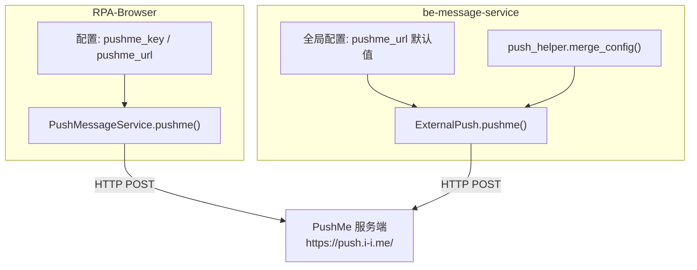
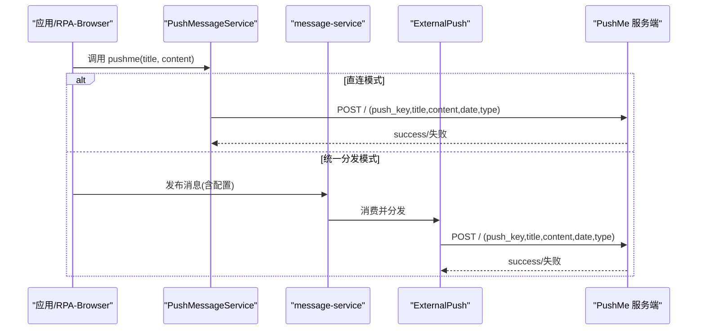
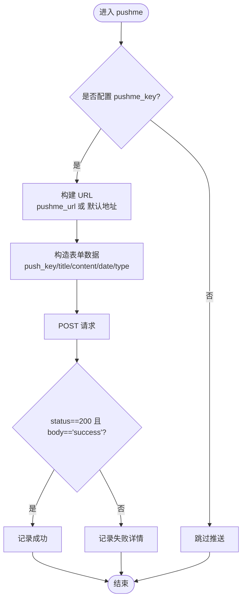
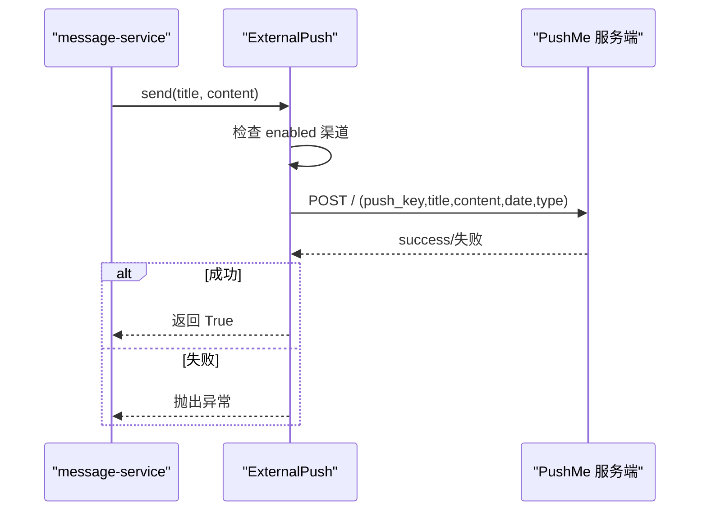
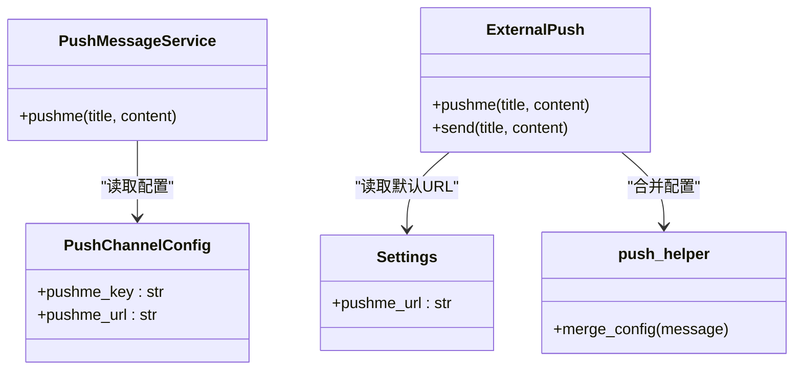

# PushMe 推送渠道

<cite>
**本文引用的文件**
- [be-bilibili-crawler/Utils/推送/PushMe.py](file://be-bilibili-crawler/Utils/推送/PushMe.py)
- [RPA-Browser/app/services/message/push_msg.py](file://RPA-Browser/app/services/message/push_msg.py)
- [RPA-Browser/app/config.py](file://RPA-Browser/app/config.py)
- [RPA-Browser/app/models/database/notify/models.py](file://RPA-Browser/app/models/database/notify/models.py)
- [be-message-service/app/services/message/external/push.py](file://be-message-service/app/services/message/external/push.py)
- [be-message-service/app/core/config.py](file://be-message-service/app/core/config.py)
- [be-message-service/app/services/message/external/push_helper.py](file://be-message-service/app/services/message/external/push_helper.py)
</cite>

## 目录
1. [简介](#简介)
2. [项目结构](#项目结构)
3. [核心组件](#核心组件)
4. [架构总览](#架构总览)
5. [详细组件分析](#详细组件分析)
6. [依赖关系分析](#依赖关系分析)
7. [性能与限流](#性能与限流)
8. [故障排查指南](#故障排查指南)
9. [结论](#结论)
10. [附录：配置示例与消息格式](#附录配置示例与消息格式)

## 简介
本章节面向“PushMe”推送渠道，系统化说明其在本项目中的集成方式、API 调用细节、参数配置、消息格式转换以及与 PushPlus 模板的对应关系。文档覆盖 pushme_key 的配置方法、自定义 URL 设置、消息类型映射机制，并提供完整的配置示例与错误处理方案（网络异常、API 限流等）。

## 项目结构
PushMe 在本仓库中涉及两个主要服务：
- RPA-Browser：提供本地/业务侧的推送能力封装，包含 PushMessageService 对 PushMe 的直接调用实现。
- be-message-service：统一的消息分发与外部推送执行中心，负责将上游消息投递到具体渠道（包括 PushMe），并支持降级链与集中化错误处理。

图表来源
- [RPA-Browser/app/services/message/push_msg.py:567-591](file://RPA-Browser/app/services/message/push_msg.py#L567-L591)
- [be-message-service/app/services/message/external/push.py:501-517](file://be-message-service/app/services/message/external/push.py#L501-L517)
- [be-message-service/app/core/config.py:331-336](file://be-message-service/app/core/config.py#L331-L336)
- [be-message-service/app/services/message/external/push_helper.py:12-27](file://be-message-service/app/services/message/external/push_helper.py#L12-L27)

章节来源
- [RPA-Browser/app/services/message/push_msg.py:567-591](file://RPA-Browser/app/services/message/push_msg.py#L567-L591)
- [be-message-service/app/services/message/external/push.py:501-517](file://be-message-service/app/services/message/external/push.py#L501-L517)
- [be-message-service/app/core/config.py:331-336](file://be-message-service/app/core/config.py#L331-L336)
- [be-message-service/app/services/message/external/push_helper.py:12-27](file://be-message-service/app/services/message/external/push_helper.py#L12-L27)

## 核心组件
- RPA-Browser 的 PushMessageService.pushme：直接构造 HTTP 请求调用 PushMe 接口，使用 pushme_key、可选的 pushme_url，发送 title/content/date/type 等字段。
- be-message-service 的 ExternalPush.pushme：统一的外部推送实现，同样以 pushme_key 为鉴权标识，支持通过全局或 per-user 配置合并后的 pushme_url 进行调用。
- 配置模型：
  - RPA-Browser：PushChannelConfig 定义 pushme_key、pushme_url；数据库模型 NotificationConfigBase 持久化用户级配置。
  - be-message-service：Settings 提供默认 pushme_url；push_helper.merge_config 负责合并全局与 per-user 配置，避免占位符污染。

章节来源
- [RPA-Browser/app/config.py:109-111](file://RPA-Browser/app/config.py#L109-L111)
- [RPA-Browser/app/models/database/notify/models.py:107-109](file://RPA-Browser/app/models/database/notify/models.py#L107-L109)
- [be-message-service/app/core/config.py:331-336](file://be-message-service/app/core/config.py#L331-L336)
- [be-message-service/app/services/message/external/push_helper.py:12-27](file://be-message-service/app/services/message/external/push_helper.py#L12-L27)

## 架构总览
PushMe 在系统中的调用路径有两种：
- 直连模式（RPA-Browser）：业务代码直接调用 PushMessageService.pushme，构造表单数据发送至 PushMe 服务端。
- 统一分发模式（be-message-service）：上游通过 RabbitMQ 发布消息，message-service 消费后按渠道分发，其中 PushMe 作为可启用渠道之一，遵循降级顺序执行。

图表来源
- [RPA-Browser/app/services/message/push_msg.py:567-591](file://RPA-Browser/app/services/message/push_msg.py#L567-L591)
- [be-message-service/app/services/message/external/push.py:501-517](file://be-message-service/app/services/message/external/push.py#L501-L517)

## 详细组件分析

### RPA-Browser 的 PushMe 实现
- 入口方法：PushMessageService.pushme
- 关键行为：
  - 校验 pushme_key 是否配置，未配置则跳过。
  - 确定目标 URL：优先使用 pushme_url，否则回退至默认 https://push.i-i.me/。
  - 构造表单数据：push_key、title、content、date、type。
  - 发送 HTTP POST 请求，判断响应状态码与文本是否为 success。
  - 日志记录成功或失败信息。

图表来源
- [RPA-Browser/app/services/message/push_msg.py:567-591](file://RPA-Browser/app/services/message/push_msg.py#L567-L591)

章节来源
- [RPA-Browser/app/services/message/push_msg.py:567-591](file://RPA-Browser/app/services/message/push_msg.py#L567-L591)

### be-message-service 的 PushMe 实现
- 入口方法：ExternalPush.pushme
- 关键行为：
  - 校验 pushme_key 是否配置。
  - 确定目标 URL：优先使用配置中的 pushme_url，否则使用默认 https://push.i-i.me/。
  - 构造表单数据：push_key、title、content、date、type（type 来自 push_type）。
  - 发送 HTTP POST 请求，若成功返回 status_code=200 且 body="success"，否则抛出 RuntimeError。
  - 在 send 降级链中，pushme 作为可用渠道之一参与排序与尝试。

图表来源
- [be-message-service/app/services/message/external/push.py:501-517](file://be-message-service/app/services/message/external/push.py#L501-L517)
- [be-message-service/app/services/message/external/push.py:626-699](file://be-message-service/app/services/message/external/push.py#L626-L699)

章节来源
- [be-message-service/app/services/message/external/push.py:501-517](file://be-message-service/app/services/message/external/push.py#L501-L517)
- [be-message-service/app/services/message/external/push.py:626-699](file://be-message-service/app/services/message/external/push.py#L626-L699)

### 配置与合并策略
- RPA-Browser：
  - PushChannelConfig 包含 pushme_key、pushme_url。
  - 数据库模型 NotificationConfigBase 持久化用户级配置，支持 per-user 覆盖。
- be-message-service：
  - Settings 提供默认 pushme_url。
  - push_helper.merge_config 合并全局与 per-user 配置，过滤空值与占位符（如 <PUSHME_KEY>），防止污染全局配置。

章节来源
- [RPA-Browser/app/config.py:109-111](file://RPA-Browser/app/config.py#L109-L111)
- [RPA-Browser/app/models/database/notify/models.py:107-109](file://RPA-Browser/app/models/database/notify/models.py#L107-L109)
- [be-message-service/app/core/config.py:331-336](file://be-message-service/app/core/config.py#L331-L336)
- [be-message-service/app/services/message/external/push_helper.py:12-27](file://be-message-service/app/services/message/external/push_helper.py#L12-L27)

### 消息类型映射与 PushPlus 模板对应
- PushMe 表单字段中包含 type，用于指定消息类型。当前实现中：
  - RPA-Browser：type 为空字符串（可从配置扩展）。
  - be-message-service：type 取自 push_type（由上游消息携带）。
- 本项目同时支持 PushPlus，其模板字段 template 常见值为 text/json/markdown/html 等。PushMe 的 type 与 PushPlus 的 template 并非严格一一对应，但语义上可类比：
  - text：纯文本
  - json：结构化 JSON
  - markdown：Markdown 格式
  - html：HTML 富文本
- 建议：
  - 若需与 PushPlus 模板保持一致，可在上游消息中显式设置 push_type，并在 message-service 层映射到 PushMe 的 type。
  - 对于复杂内容，推荐使用 markdown 或 html 以获得更好的展示效果。

章节来源
- [RPA-Browser/app/services/message/push_msg.py:567-591](file://RPA-Browser/app/services/message/push_msg.py#L567-L591)
- [be-message-service/app/services/message/external/push.py:501-517](file://be-message-service/app/services/message/external/push.py#L501-L517)

## 依赖关系分析
- RPA-Browser 的 PushMessageService 依赖：
  - httpx_client：异步 HTTP 客户端。
  - NotificationConfig：用户级通知配置（包含 pushme_key、pushme_url）。
- be-message-service 的 ExternalPush 依赖：
  - get_client：统一 HTTP 客户端。
  - push_helper.merge_config：配置合并逻辑。
  - Settings：全局默认配置（如 pushme_url）。

图表来源
- [RPA-Browser/app/services/message/push_msg.py:567-591](file://RPA-Browser/app/services/message/push_msg.py#L567-L591)
- [be-message-service/app/services/message/external/push.py:501-517](file://be-message-service/app/services/message/external/push.py#L501-L517)
- [be-message-service/app/core/config.py:331-336](file://be-message-service/app/core/config.py#L331-L336)
- [be-message-service/app/services/message/external/push_helper.py:12-27](file://be-message-service/app/services/message/external/push_helper.py#L12-L27)

章节来源
- [RPA-Browser/app/services/message/push_msg.py:567-591](file://RPA-Browser/app/services/message/push_msg.py#L567-L591)
- [be-message-service/app/services/message/external/push.py:501-517](file://be-message-service/app/services/message/external/push.py#L501-L517)
- [be-message-service/app/core/config.py:331-336](file://be-message-service/app/core/config.py#L331-L336)
- [be-message-service/app/services/message/external/push_helper.py:12-27](file://be-message-service/app/services/message/external/push_helper.py#L12-L27)

## 性能与限流
- RPA-Browser 侧限流：
  - 在 be-bilibili-crawler 的 PushMe 工具模块中，实现了去重队列与最小推送间隔（至少 60 秒），避免短时间大量推送打爆服务。
- message-service 侧降级链：
  - 多个渠道按固定顺序尝试，直到成功；若全部失败则抛出异常，便于上层重试或告警。
- 建议：
  - 在高并发场景下，优先使用 message-service 的统一分发模式，利用其降级链与集中日志。
  - 合理设置 push_type，减少不必要的富文本渲染开销。

章节来源
- [be-bilibili-crawler/Utils/推送/PushMe.py:46-137](file://be-bilibili-crawler/Utils/推送/PushMe.py#L46-L137)
- [be-message-service/app/services/message/external/push.py:626-699](file://be-message-service/app/services/message/external/push.py#L626-L699)

## 故障排查指南
- 常见问题：
  - pushme_key 未配置：推送被跳过。
  - 网络异常：HTTP 请求失败，记录错误日志或抛出异常。
  - API 限流：PushMe 服务端可能返回非 success 响应，需根据日志中的状态码与响应体定位问题。
- 处理策略：
  - 检查 pushme_key 与 pushme_url 是否正确。
  - 查看 message-service 的降级链日志，确认是否尝试了其他渠道。
  - 对于频繁失败，考虑增加重试与退避策略（在上游或 message-service 层实现）。
  - 使用 push_type 控制消息格式，避免服务端解析失败。

章节来源
- [RPA-Browser/app/services/message/push_msg.py:567-591](file://RPA-Browser/app/services/message/push_msg.py#L567-L591)
- [be-message-service/app/services/message/external/push.py:501-517](file://be-message-service/app/services/message/external/push.py#L501-L517)

## 结论
PushMe 在本项目中通过两种路径集成：RPA-Browser 的直连调用与 message-service 的统一分发。两者均基于 pushme_key 鉴权，支持自定义 URL，并通过表单字段传递标题、内容与类型。结合 message-service 的降级链与配置合并机制，可实现高可用的推送能力。建议在复杂场景中优先使用 message-service，并利用 push_type 控制消息格式，以获得更好的兼容性与展示效果。

## 附录：配置示例与消息格式
- 环境变量配置（message-service）：
  - MESSAGE_CONFIG 可包含 pushme_key、pushme_url 等字段，用于全局兜底配置。
- 用户级配置（RPA-Browser）：
  - 在 NotificationConfigBase 中设置 pushme_key、pushme_url，支持 per-user 覆盖。
- 消息格式：
  - text：纯文本
  - json：JSON 结构
  - markdown：Markdown 富文本
  - html：HTML 富文本
- 错误处理：
  - 网络异常：记录错误日志，必要时触发重试。
  - API 限流：根据响应码与响应体调整推送频率或切换渠道。

章节来源
- [be-message-service/app/core/config.py:331-336](file://be-message-service/app/core/config.py#L331-L336)
- [RPA-Browser/app/models/database/notify/models.py:107-109](file://RPA-Browser/app/models/database/notify/models.py#L107-L109)
- [be-message-service/app/services/message/external/push_helper.py:12-27](file://be-message-service/app/services/message/external/push_helper.py#L12-L27)