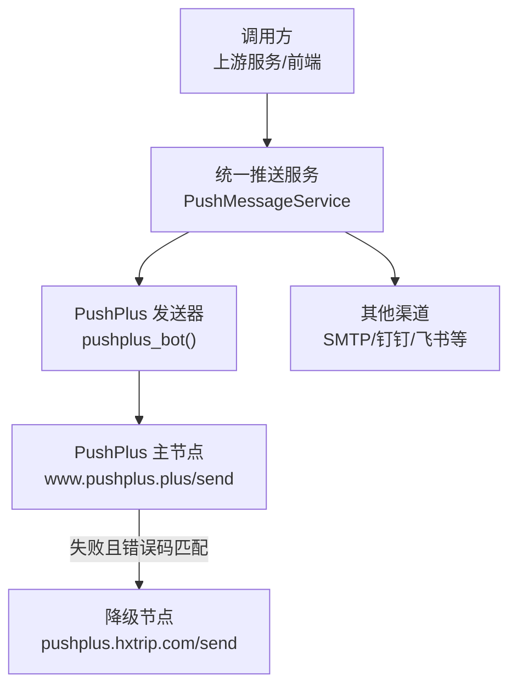
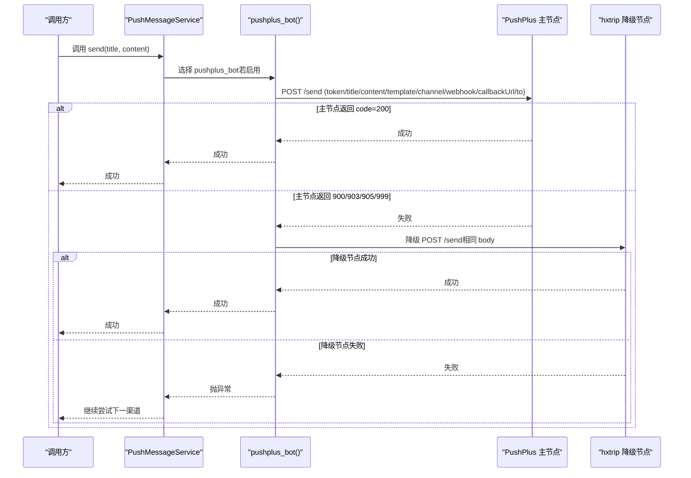
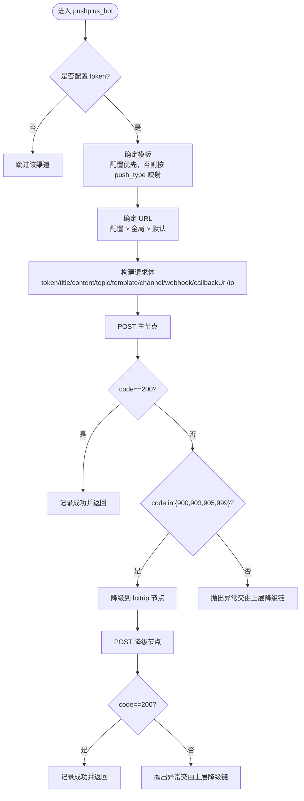
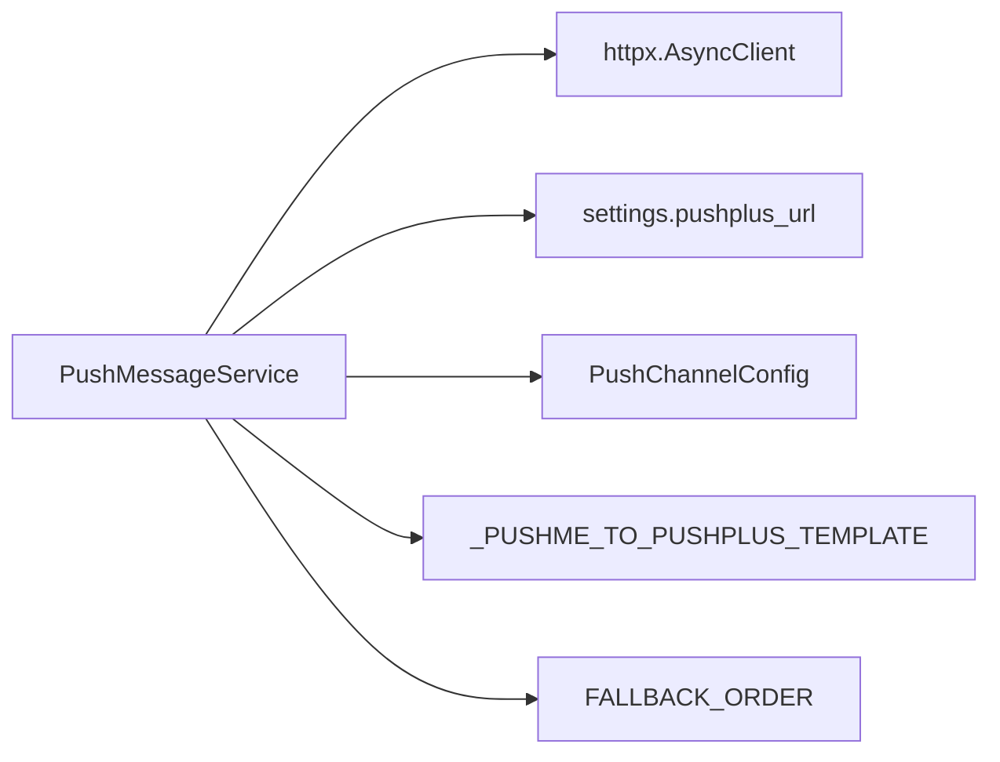

# PushPlus 推送渠道

<cite>
**本文引用的文件**
- [push.py](file://be-message-service/app/services/message/external/push.py)
- [push.py（模型定义）](file://bili-common/bili_common/models/push.py)
- [push_helper.py](file://be-message-service/app/services/message/external/push_helper.py)
- [test_push_channels.py](file://be-message-service/tests/test_push_channels.py)
</cite>

## 目录
1. [简介](#简介)
2. [项目结构](#项目结构)
3. [核心组件](#核心组件)
4. [架构总览](#架构总览)
5. [详细组件分析](#详细组件分析)
6. [依赖关系分析](#依赖关系分析)
7. [性能与可靠性](#性能与可靠性)
8. [故障排查指南](#故障排查指南)
9. [结论](#结论)
10. [附录：配置与示例](#附录配置与示例)

## 简介
本章节面向使用 PushPlus 推送渠道的开发者与运维人员，系统性说明在消息服务中如何集成 PushPlus，包括 token 配置、模板映射、用户分组、高级参数（channel、webhook、callbackUrl、to）以及主节点失败自动降级到 hxtrip 节点的容错机制。文档同时提供常见问题的定位思路与排障建议。

## 项目结构
PushPlus 推送能力由统一推送服务集中实现，并通过配置模型承载各渠道参数。关键位置如下：
- 统一推送服务：负责多通道分发与降级逻辑，包含 PushPlus 的具体发送实现
- 推送配置模型：定义 PushPlus 相关字段及默认值
- 配置合并工具：将全局环境变量配置与消息内 per-user 配置合并，避免占位符污染
- 测试用例：用于连通性验证与渠道可用性检查

图表来源
- [push.py:311-350](file://be-message-service/app/services/message/external/push.py#L311-L350)
- [push.py:664-708](file://be-message-service/app/services/message/external/push.py#L664-L708)

章节来源
- [push.py:1-11](file://be-message-service/app/services/message/external/push.py#L1-L11)
- [push.py:664-708](file://be-message-service/app/services/message/external/push.py#L664-L708)

## 核心组件
- 统一推送服务类：封装所有渠道发送方法，并提供按优先级降级的 send() 流程
- PushPlus 发送方法：构造请求体并发送到 PushPlus 接口，支持模板映射与高级参数
- 配置模型：定义 push_plus_token、push_plus_url、push_plus_user、push_plus_template、push_plus_channel、push_plus_webhook、push_plus_callbackurl、push_plus_to 等字段
- 配置合并工具：合并全局与 per-user 配置，过滤无效值与模板占位符

章节来源
- [push.py:160-166](file://be-message-service/app/services/message/external/push.py#L160-L166)
- [push.py:311-350](file://be-message-service/app/services/message/external/push.py#L311-L350)
- [push.py（模型定义）:66-74](file://bili-common/bili_common/models/push.py#L66-L74)
- [push_helper.py:26-37](file://be-message-service/app/services/message/external/push_helper.py#L26-L37)

## 架构总览
PushPlus 的集成位于统一推送服务的“外部推送”模块中。发送流程遵循以下原则：
- 每个渠道在真正发送失败时抛出异常，供上层捕获并尝试下一个渠道
- send() 按预定义的 FALLBACK_ORDER 顺序依次尝试已启用的渠道，直到成功或全部失败
- PushPlus 内部具备主节点失败时的自动降级逻辑：当返回特定错误码时，自动切换到 hxtrip 节点重试

图表来源
- [push.py:311-350](file://be-message-service/app/services/message/external/push.py#L311-L350)
- [push.py:664-708](file://be-message-service/app/services/message/external/push.py#L664-L708)

## 详细组件分析

### PushPlus 发送器（pushplus_bot）
- 功能要点
  - 校验 token：未配置则跳过该渠道
  - 模板选择：优先使用配置中的 template；若存在 push_type，则通过映射表转换为 PushPlus 支持的模板
  - URL 选择：优先使用配置的 push_plus_url，其次回落到全局 settings.pushplus_url，最后使用默认地址
  - 请求体：包含 token、title、content、topic（用户分组）、template、channel、webhook、callbackUrl、to
  - 响应处理：code=200 视为成功；特定错误码（900/903/905/999）触发降级到 hxtrip 节点
  - 降级逻辑：以相同 body 再次请求 hxtrip 节点，成功则记录日志，失败则抛出异常交由上层降级链处理

- 数据流与复杂度
  - 时间复杂度：O(1)，固定 JSON 序列化与一次 HTTP 请求
  - 空间复杂度：O(1)，仅维护临时请求体与响应对象

- 错误处理
  - 网络异常或接口错误均抛出异常，便于上层统一捕获并尝试其他渠道
  - 降级节点失败会抛出异常，确保彻底失败可被消费者识别

图表来源
- [push.py:311-350](file://be-message-service/app/services/message/external/push.py#L311-L350)

章节来源
- [push.py:311-350](file://be-message-service/app/services/message/external/push.py#L311-L350)

### 模板映射机制
- 映射表：将 push_type（如 text/data/markdata/html/txt/json/markdown/cloudMonitor/jenkins/route/pay）映射为 PushPlus 的 template（txt/json/markdown/html 等）
- 优先级：配置项 push_plus_template 优先；若未设置且存在 push_type，则按映射表覆盖
- 支持的内容格式
  - 文字：txt
  - JSON：json
  - Markdown：markdown
  - HTML：html
  - 其他扩展类型：cloudMonitor、jenkins、route、pay（取决于 PushPlus 服务端支持）

章节来源
- [push.py:44-57](file://be-message-service/app/services/message/external/push.py#L44-L57)
- [push.py:315-319](file://be-message-service/app/services/message/external/push.py#L315-L319)

### 用户分组与高级参数
- 用户分组（topic）：通过 push_plus_user 指定目标用户或分组，便于定向推送
- channel：指定推送渠道（如 wechat），影响最终触达方式
- webhook：附加回调地址，用于接收状态通知或二次处理
- callbackUrl：回调地址，用于异步结果回传
- to：目标标识，可用于更细粒度的接收者控制

章节来源
- [push.py:321-331](file://be-message-service/app/services/message/external/push.py#L321-L331)
- [push.py（模型定义）:66-74](file://bili-common/bili_common/models/push.py#L66-L74)

### 配置合并与生效范围
- 全局配置：通过 settings.message_config 提供默认值
- per-user 配置：消息携带的 config 字段可覆盖全局配置
- 覆盖规则：仅覆盖有效非空字段；形如 <...> 的模板占位符被视为未设置，防止污染全局兜底配置

章节来源
- [push_helper.py:12-23](file://be-message-service/app/services/message/external/push_helper.py#L12-L23)
- [push_helper.py:26-37](file://be-message-service/app/services/message/external/push_helper.py#L26-L37)

### 降级链与整体流程
- 降级顺序：FALLBACK_ORDER 定义了渠道尝试顺序，PushPlus 位于靠前的位置
- 行为语义：任一渠道成功即停止；全部失败则抛出 RuntimeError，由消费者判定为彻底失败
- 适用场景：保障在 PushPlus 主节点不可用时仍能通过 hxtrip 节点完成推送

章节来源
- [push.py:59-83](file://be-message-service/app/services/message/external/push.py#L59-L83)
- [push.py:664-708](file://be-message-service/app/services/message/external/push.py#L664-L708)

## 依赖关系分析
- 外部依赖
  - httpx.AsyncClient：统一的 HTTP 客户端，超时设置为 15 秒
  - loguru.logger：结构化日志输出
  - app.core.config.settings：全局配置（含 pushplus_url）
- 内部依赖
  - PushChannelConfig：推送渠道配置模型
  - PUSHME_TO_PUSHPLUS_TEMPLATE：模板映射表
  - FALLBACK_ORDER：渠道降级顺序

图表来源
- [push.py:27-31](file://be-message-service/app/services/message/external/push.py#L27-L31)
- [push.py:44-83](file://be-message-service/app/services/message/external/push.py#L44-L83)

章节来源
- [push.py:27-31](file://be-message-service/app/services/message/external/push.py#L27-L31)
- [push.py:44-83](file://be-message-service/app/services/message/external/push.py#L44-L83)

## 性能与可靠性
- 性能
  - 单次 PushPlus 请求为 O(1) 操作，HTTP 超时 15 秒，避免长时间阻塞
  - 模板映射与 JSON 序列化开销极小
- 可靠性
  - 主节点失败时自动降级到 hxtrip 节点，提升成功率
  - 统一异常抛出机制，便于上层进行多渠道重试与告警
  - 可通过测试用例对已配置渠道进行连通性验证

章节来源
- [push.py:36-41](file://be-message-service/app/services/message/external/push.py#L36-L41)
- [push.py:311-350](file://be-message-service/app/services/message/external/push.py#L311-L350)
- [test_push_channels.py:1-54](file://be-message-service/tests/test_push_channels.py#L1-L54)

## 故障排查指南
- 常见问题
  - 未配置 token：渠道将被跳过，不会发送
  - 模板不匹配：确认 push_type 与 push_plus_template 的设置是否正确
  - 主节点失败：检查返回码是否为 900/903/905/999，若命中则会自动降级
  - 降级节点失败：查看响应体与日志，确认网络与凭据有效性
- 定位步骤
  - 使用测试用例对当前配置的所有渠道发起真实推送，快速定位失效渠道
  - 检查日志中的 url、body、resp 信息，结合错误码判断问题来源
  - 核对配置合并逻辑，确保 per-user 配置未覆盖全局默认值导致异常

章节来源
- [test_push_channels.py:1-54](file://be-message-service/tests/test_push_channels.py#L1-L54)
- [push_helper.py:12-23](file://be-message-service/app/services/message/external/push_helper.py#L12-L23)
- [push.py:311-350](file://be-message-service/app/services/message/external/push.py#L311-L350)

## 结论
PushPlus 推送渠道在统一推送服务中以高内聚的方式实现，具备灵活的模板映射、用户分组与高级参数支持，并在主节点失败时自动降级到 hxtrip 节点，显著提升推送成功率与系统韧性。配合配置合并与测试用例，可在不同环境下稳定运行并快速定位问题。

## 附录：配置与示例
- 必要配置
  - push_plus_token：必填，用于鉴权
  - push_plus_url：可选，未设置时使用全局 settings.pushplus_url 或默认地址
  - push_plus_user：可选，用于用户分组
  - push_plus_template：可选，默认 html；也可通过 push_type 映射
  - push_plus_channel：可选，默认 wechat
  - push_plus_webhook：可选，用于回调
  - push_plus_callbackurl：可选，用于异步结果回传
  - push_plus_to：可选，用于目标标识
- 内容格式
  - 文字：txt
  - JSON：json
  - Markdown：markdown
  - HTML：html
  - 其他扩展类型：cloudMonitor、jenkins、route、pay（视服务端支持）
- 降级机制
  - 主节点返回 900/903/905/999 时自动切换到 hxtrip 节点
- 测试与验证
  - 使用测试用例对已配置渠道进行连通性验证，确保 token 有效

章节来源
- [push.py（模型定义）:66-74](file://bili-common/bili_common/models/push.py#L66-L74)
- [push.py:44-57](file://be-message-service/app/services/message/external/push.py#L44-L57)
- [push.py:311-350](file://be-message-service/app/services/message/external/push.py#L311-L350)
- [test_push_channels.py:1-54](file://be-message-service/tests/test_push_channels.py#L1-L54)