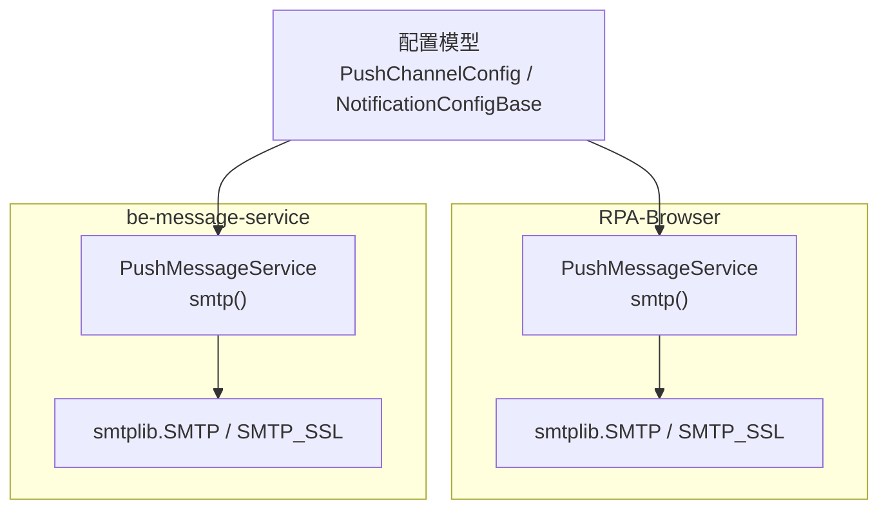
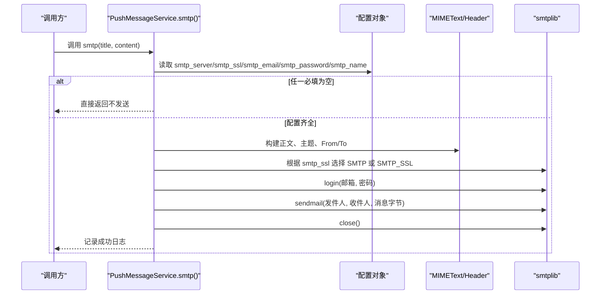
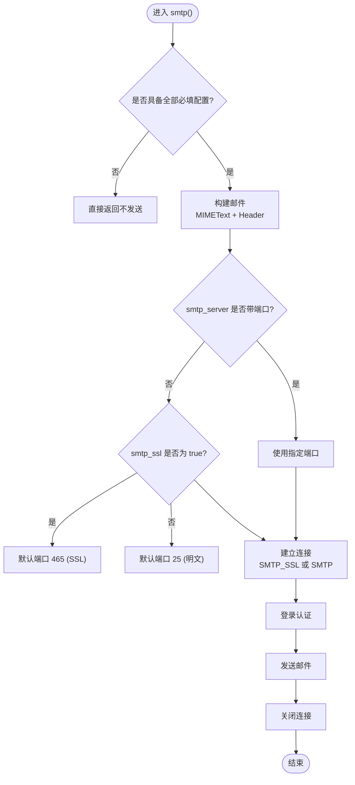
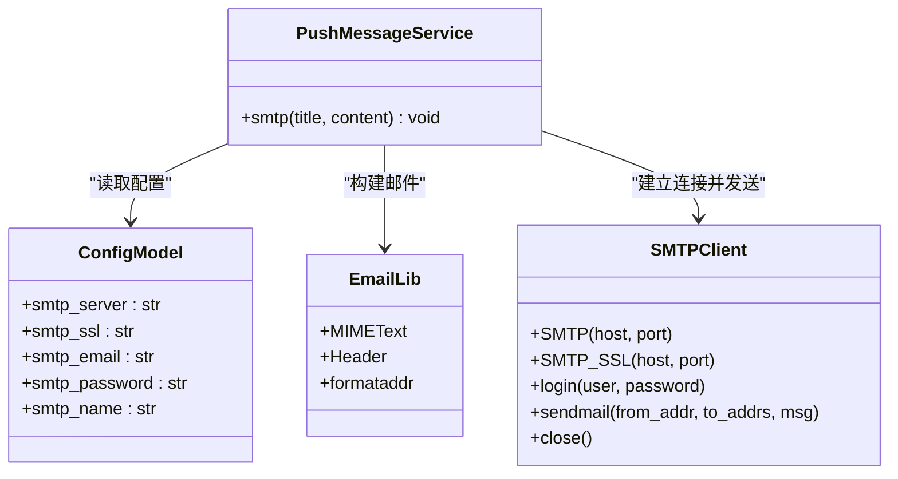

# SMTP 邮件推送渠道

<cite>
**本文引用的文件**
- [RPA-Browser/app/services/message/push_msg.py](file://RPA-Browser/app/services/message/push_msg.py)
- [be-message-service/app/services/message/external/push.py](file://be-message-service/app/services/message/external/push.py)
- [RPA-Browser/app/config.py](file://RPA-Browser/app/config.py)
- [RPA-Browser/app/models/database/notify/models.py](file://RPA-Browser/app/models/database/notify/models.py)
- [RPA-Browser/app/models/notify/response_models.py](file://RPA-Browser/app/models/notify/response_models.py)
- [RPA-Browser/alembic/versions/bcd8bcf2d600_.py](file://RPA-Browser/alembic/versions/bcd8bcf2d600_.py)
</cite>

## 目录
1. [简介](#简介)
2. [项目结构](#项目结构)
3. [核心组件](#核心组件)
4. [架构总览](#架构总览)
5. [详细组件分析](#详细组件分析)
6. [依赖关系分析](#依赖关系分析)
7. [性能与可靠性](#性能与可靠性)
8. [配置指南](#配置指南)
9. [主流邮箱服务商配置示例](#主流邮箱服务商配置示例)
10. [故障排查指南](#故障排查指南)
11. [结论](#结论)

## 简介
本章节面向“SMTP 邮件推送渠道”，系统化说明邮件发送的实现机制、配置项、端口处理逻辑、SSL/TLS 加密连接、认证方式、邮件内容格式与主题编码、发件人显示名称等，并提供常见邮箱服务商的配置要点与排障建议。

## 项目结构
本项目在两个位置实现了 SMTP 邮件推送：
- RPA-Browser 服务中的统一推送服务（同步实现）
- be-message-service 的推送执行体（同步实现，通过线程池在异步环境中调用）

两者均基于 Python 标准库 smtplib 与 email.mime.text.MIMEText 完成邮件构建与发送，并通过统一的配置模型加载 SMTP 相关参数。

图表来源
- [RPA-Browser/app/services/message/push_msg.py:521-565](file://RPA-Browser/app/services/message/push_msg.py#L521-L565)
- [be-message-service/app/services/message/external/push.py:474-499](file://be-message-service/app/services/message/external/push.py#L474-L499)
- [RPA-Browser/app/config.py:102-107](file://RPA-Browser/app/config.py#L102-L107)
- [RPA-Browser/app/models/database/notify/models.py:100-105](file://RPA-Browser/app/models/database/notify/models.py#L100-L105)

章节来源
- [RPA-Browser/app/services/message/push_msg.py:521-565](file://RPA-Browser/app/services/message/push_msg.py#L521-L565)
- [be-message-service/app/services/message/external/push.py:474-499](file://be-message-service/app/services/message/external/push.py#L474-L499)
- [RPA-Browser/app/config.py:102-107](file://RPA-Browser/app/config.py#L102-L107)
- [RPA-Browser/app/models/database/notify/models.py:100-105](file://RPA-Browser/app/models/database/notify/models.py#L100-L105)

## 核心组件
- 推送服务类：提供 smtp(title, content) 方法，负责构造邮件并调用 SMTP 协议发送。
- 配置模型：定义 SMTP 相关字段（服务器、SSL、邮箱账号、密码、发件人名称）。
- 数据库模型：持久化通知配置，包含 SMTP 字段。
- 迁移脚本：确保数据库表包含 SMTP 列。

章节来源
- [RPA-Browser/app/services/message/push_msg.py:521-565](file://RPA-Browser/app/services/message/push_msg.py#L521-L565)
- [be-message-service/app/services/message/external/push.py:474-499](file://be-message-service/app/services/message/external/push.py#L474-L499)
- [RPA-Browser/app/config.py:102-107](file://RPA-Browser/app/config.py#L102-L107)
- [RPA-Browser/app/models/database/notify/models.py:100-105](file://RPA-Browser/app/models/database/notify/models.py#L100-L105)
- [RPA-Browser/alembic/versions/bcd8bcf2d600_.py:168-172](file://RPA-Browser/alembic/versions/bcd8bcf2d600_.py#L168-L172)

## 架构总览
下图展示了从“触发推送”到“SMTP 发送”的关键流程，包括配置校验、邮件构建、连接选择（SSL/TLS）、登录认证、发送与关闭连接。

图表来源
- [RPA-Browser/app/services/message/push_msg.py:521-565](file://RPA-Browser/app/services/message/push_msg.py#L521-L565)
- [be-message-service/app/services/message/external/push.py:474-499](file://be-message-service/app/services/message/external/push.py#L474-L499)

## 详细组件分析

### 1) 配置模型与数据源
- 运行时配置（环境变量/JSON）：PushChannelConfig 定义了 SMTP 相关字段，默认值与类型约束清晰。
- 数据库配置：NotificationConfigBase 将 SMTP 字段持久化，便于按用户或浏览器维度管理。
- 迁移脚本：确保数据库包含 smtp_server、smtp_ssl、smtp_email、smtp_password、smtp_name 等列。

章节来源
- [RPA-Browser/app/config.py:102-107](file://RPA-Browser/app/config.py#L102-L107)
- [RPA-Browser/app/models/database/notify/models.py:100-105](file://RPA-Browser/app/models/database/notify/models.py#L100-L105)
- [RPA-Browser/app/models/notify/response_models.py:113-118](file://RPA-Browser/app/models/notify/response_models.py#L113-L118)
- [RPA-Browser/alembic/versions/bcd8bcf2d600_.py:168-172](file://RPA-Browser/alembic/versions/bcd8bcf2d600_.py#L168-L172)

### 2) 邮件构建与编码
- 正文：使用 MIMEText(content, "plain", "utf-8")，支持 UTF-8 文本。
- 主题：使用 Header(title, "utf-8") 进行编码，避免中文乱码。
- From/To：使用 formataddr((Header(smtp_name, "utf-8").encode(), smtp_email)) 设置发件人与收件人，同时支持显示名称。

章节来源
- [RPA-Browser/app/services/message/push_msg.py:535-548](file://RPA-Browser/app/services/message/push_msg.py#L535-L548)
- [be-message-service/app/services/message/external/push.py:479-482](file://be-message-service/app/services/message/external/push.py#L479-L482)

### 3) 连接与端口处理逻辑
- SSL/TLS：当 smtp_ssl == "true" 时使用 SMTP_SSL，否则使用 SMTP。
- 端口解析：
  - 若 smtp_server 包含冒号且冒号后为数字（如 "smtp.163.com:465"），则提取端口；
  - 否则根据 smtp_ssl 决定默认端口：SSL 模式默认 465，非 SSL 模式默认 25。
- 登录与发送：login(邮箱, 密码) -> sendmail(发件人, 收件人, 消息字节) -> close()。

图表来源
- [be-message-service/app/services/message/external/push.py:483-499](file://be-message-service/app/services/message/external/push.py#L483-L499)

章节来源
- [be-message-service/app/services/message/external/push.py:483-499](file://be-message-service/app/services/message/external/push.py#L483-L499)
- [RPA-Browser/app/services/message/push_msg.py:550-565](file://RPA-Browser/app/services/message/push_msg.py#L550-L565)

### 4) 错误处理与日志
- 成功路径：记录“SMTP 邮件 推送成功！”日志。
- 失败路径：捕获异常并记录错误信息；在 message-service 中会抛出 RuntimeError，由上层降级逻辑处理。

章节来源
- [RPA-Browser/app/services/message/push_msg.py:563-565](file://RPA-Browser/app/services/message/push_msg.py#L563-L565)
- [be-message-service/app/services/message/external/push.py:497-499](file://be-message-service/app/services/message/external/push.py#L497-L499)

## 依赖关系分析
- 模块耦合：
  - PushMessageService 依赖配置模型（PushChannelConfig / NotificationConfigBase）获取 SMTP 参数。
  - 邮件构建依赖 email.mime.text.MIMEText 与 email.header.Header。
  - 网络通信依赖 smtplib（SMTP/SMTP_SSL）。
- 外部依赖：
  - 各邮箱服务商的 SMTP 服务器地址与端口策略（见下文配置示例）。

图表来源
- [RPA-Browser/app/services/message/push_msg.py:521-565](file://RPA-Browser/app/services/message/push_msg.py#L521-L565)
- [be-message-service/app/services/message/external/push.py:474-499](file://be-message-service/app/services/message/external/push.py#L474-L499)
- [RPA-Browser/app/config.py:102-107](file://RPA-Browser/app/config.py#L102-L107)
- [RPA-Browser/app/models/database/notify/models.py:100-105](file://RPA-Browser/app/models/database/notify/models.py#L100-L105)

章节来源
- [RPA-Browser/app/services/message/push_msg.py:521-565](file://RPA-Browser/app/services/message/push_msg.py#L521-L565)
- [be-message-service/app/services/message/external/push.py:474-499](file://be-message-service/app/services/message/external/push.py#L474-L499)

## 性能与可靠性
- 连接开销：每次发送都会新建 SMTP 连接并在完成后关闭，适合低频告警场景；高频场景可考虑复用连接或队列化批量发送。
- 超时与重试：当前实现未内置超时与重试；建议在调用层增加超时控制与重试策略以提升鲁棒性。
- 降级机制：message-service 中采用 FALLBACK_ORDER 顺序尝试多个渠道，SMTP 失败会自动尝试其他渠道，提高整体送达率。

[本节为通用指导，不直接分析具体文件]

## 配置指南
- 必需配置项
  - smtp_server：SMTP 服务器地址，支持带端口（如 "smtp.163.com:465"）或不带端口（自动根据 ssl 选择默认端口）。
  - smtp_ssl：字符串 "true"/"false"，决定是否使用 SSL/TLS。
  - smtp_email：发件邮箱账号。
  - smtp_password：发件邮箱授权码或密码。
  - smtp_name：发件人显示名称（用于邮件头显示）。
- 配置来源
  - 运行时：PushChannelConfig（环境变量/JSON）。
  - 持久化：NotificationConfigBase（数据库）。
- 注意事项
  - 若任一必填项为空，smtp() 将直接返回，不会发送。
  - 主题与正文使用 UTF-8 编码，避免中文乱码。
  - 发件人与收件人在当前实现中均为同一邮箱账号（自发自收），如需多收件人可在调用侧扩展。

章节来源
- [RPA-Browser/app/config.py:102-107](file://RPA-Browser/app/config.py#L102-L107)
- [RPA-Browser/app/models/database/notify/models.py:100-105](file://RPA-Browser/app/models/database/notify/models.py#L100-L105)
- [RPA-Browser/app/services/message/push_msg.py:525-532](file://RPA-Browser/app/services/message/push_msg.py#L525-L532)
- [be-message-service/app/services/message/external/push.py:474-482](file://be-message-service/app/services/message/external/push.py#L474-L482)

## 主流邮箱服务商配置示例
以下为常见邮箱服务商的典型 SMTP 配置参考（请结合各自官方文档确认最新端口与要求）：
- 163 邮箱
  - 服务器：smtp.163.com
  - SSL：开启（通常端口 465）
  - 认证：使用授权码而非登录密码
- QQ 邮箱
  - 服务器：smtp.qq.com
  - SSL：开启（通常端口 465）
  - 认证：使用授权码
- Gmail
  - 服务器：smtp.gmail.com
  - SSL：开启（通常端口 465 或 587 STARTTLS）
  - 认证：需启用两步验证并使用应用专用密码

注意：
- 若 smtp_server 已包含端口（如 "smtp.163.com:465"），系统将直接使用指定端口；
- 若未包含端口，系统会根据 smtp_ssl 选择默认端口（SSL=465，非 SSL=25）。

[本节为通用指导，不直接分析具体文件]

## 故障排查指南
- 无法连接服务器
  - 检查防火墙/代理是否放行 SMTP 端口（465/25/587）；
  - 确认 smtp_server 与端口是否正确；
  - 观察日志中“SMTP 邮件 推送失败”的错误信息。
- 认证失败
  - 确认 smtp_email 与 smtp_password（或授权码）正确；
  - 部分邮箱需开启 SMTP 服务并生成授权码。
- 主题或正文乱码
  - 确认标题与正文使用 UTF-8；
  - 检查 Header 与 MIMEText 的编码设置。
- 仅自发自收
  - 当前实现 To 与 From 相同，如需发送给他人，请在调用侧扩展收件人列表。
- 频繁失败
  - 建议在调用层增加重试与退避策略；
  - 结合 message-service 的降级链，确保其他渠道可用。

章节来源
- [RPA-Browser/app/services/message/push_msg.py:563-565](file://RPA-Browser/app/services/message/push_msg.py#L563-L565)
- [be-message-service/app/services/message/external/push.py:497-499](file://be-message-service/app/services/message/external/push.py#L497-L499)

## 结论
本项目的 SMTP 邮件推送渠道以简洁可靠的实现覆盖了常见的 SMTP 场景：支持带/不带端口的服务器地址、SSL/TLS 加密、UTF-8 编码的主题与正文、以及发件人显示名称。通过统一的配置模型与数据库持久化，便于在不同环境与管理维度下灵活配置。结合 message-service 的降级机制，可有效提升通知送达的可靠性。对于高频或高可用场景，建议在调用层补充超时、重试与连接复用策略。