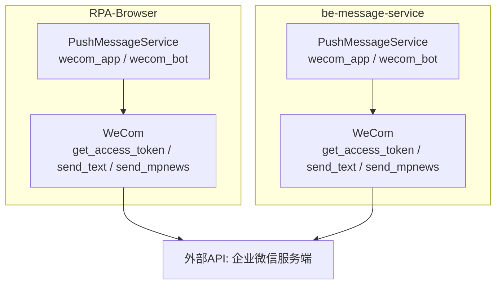
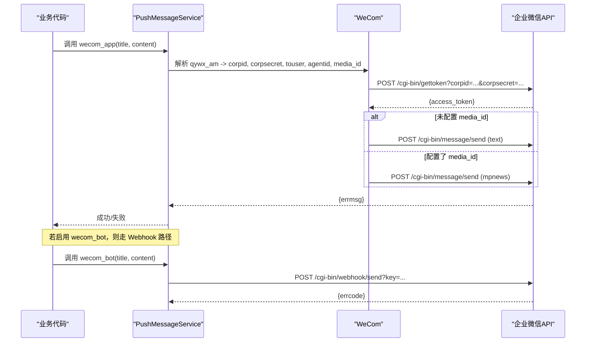
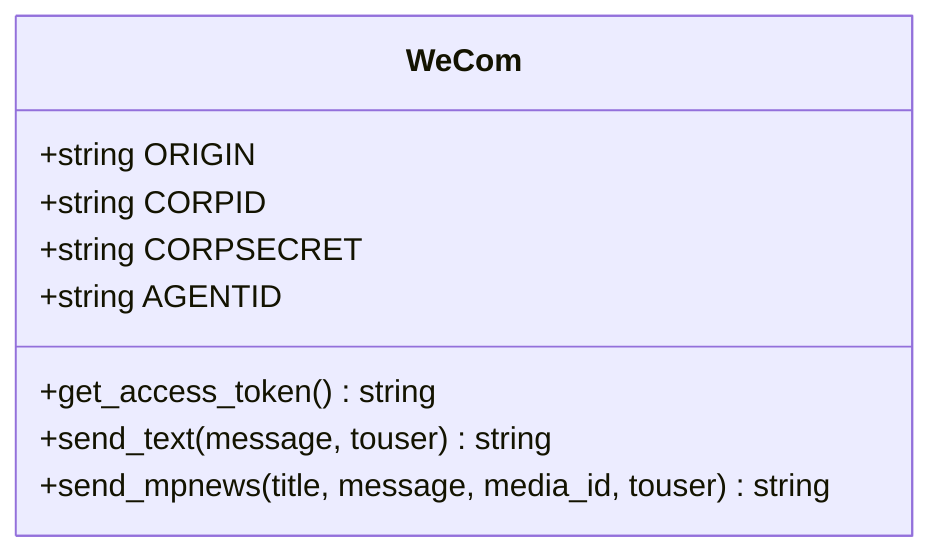
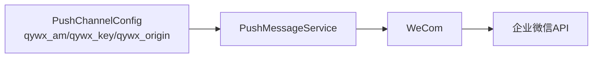

# 企业微信推送渠道

<cite>
**本文引用的文件**
- [RPA-Browser/app/services/message/push_msg.py](file://RPA-Browser/app/services/message/push_msg.py)
- [be-message-service/app/services/message/external/push.py](file://be-message-service/app/services/message/external/push.py)
- [bili-common/bili_common/models/push.py](file://bili-common/bili_common/models/push.py)
- [RPA-Browser/app/config.py](file://RPA-Browser/app/config.py)
</cite>

## 目录
1. [简介](#简介)
2. [项目结构](#项目结构)
3. [核心组件](#核心组件)
4. [架构总览](#架构总览)
5. [详细组件分析](#详细组件分析)
6. [依赖关系分析](#依赖关系分析)
7. [性能与可靠性](#性能与可靠性)
8. [故障排查指南](#故障排查指南)
9. [结论](#结论)
10. [附录：配置示例](#附录：配置示例)

## 简介
本章节面向企业微信推送渠道，覆盖两种推送方式：
- 企业微信应用（App）推送：通过 corpid、corpsecret 获取 access_token，调用消息发送接口，支持文本与图文（mpnews）多媒体消息。
- 企业微信群机器人（Webhook）推送：通过 webhook key 直接发送文本消息到群。

文档将详细说明 qywx_am 配置格式、access_token 获取机制、消息发送流程、多媒体消息支持，以及 webhook 的配置与使用，并提供不同场景的完整配置示例。

## 项目结构
企业微信推送能力在两个服务中实现：
- RPA-Browser：提供统一的推送服务类，封装了多种渠道（含企业微信 App/Webhook）。
- be-message-service：从 RPA-Browser 移植的统一推送服务，具备降级重试与更严格的错误处理。

图表来源
- [RPA-Browser/app/services/message/push_msg.py:386-439](file://RPA-Browser/app/services/message/push_msg.py#L386-L439)
- [RPA-Browser/app/services/message/push_msg.py:899-957](file://RPA-Browser/app/services/message/push_msg.py#L899-L957)
- [be-message-service/app/services/message/external/push.py:86-157](file://be-message-service/app/services/message/external/push.py#L86-L157)
- [be-message-service/app/services/message/external/push.py:390-425](file://be-message-service/app/services/message/external/push.py#L390-L425)

章节来源
- [RPA-Browser/app/services/message/push_msg.py:386-439](file://RPA-Browser/app/services/message/push_msg.py#L386-L439)
- [be-message-service/app/services/message/external/push.py:86-157](file://be-message-service/app/services/message/external/push.py#L86-L157)

## 核心组件
- WeCom（企业微信客户端）：负责 access_token 获取、文本消息发送、图文消息发送。
- PushMessageService（统一推送服务）：封装企业微信 App/Webhook 的调用入口，并在 message-service 中提供降级策略。
- 配置模型 PushChannelConfig：定义 qywx_origin、qywx_am、qywx_key 等字段，承载企业微信相关配置。

章节来源
- [be-message-service/app/services/message/external/push.py:86-157](file://be-message-service/app/services/message/external/push.py#L86-L157)
- [RPA-Browser/app/services/message/push_msg.py:899-957](file://RPA-Browser/app/services/message/push_msg.py#L899-L957)
- [bili-common/bili_common/models/push.py:85-88](file://bili-common/bili_common/models/push.py#L85-L88)

## 架构总览
企业微信推送的整体流程如下：
- 应用推送：读取 qywx_am 解析 corpid/corpsecret/touser/agentid/media_id；调用 gettoken 获取 access_token；调用 message/send 发送文本或 mpnews。
- Webhook 推送：读取 qywx_key；构造 webhook URL；发送文本消息到群。

图表来源
- [RPA-Browser/app/services/message/push_msg.py:386-439](file://RPA-Browser/app/services/message/push_msg.py#L386-L439)
- [RPA-Browser/app/services/message/push_msg.py:899-957](file://RPA-Browser/app/services/message/push_msg.py#L899-L957)
- [be-message-service/app/services/message/external/push.py:86-157](file://be-message-service/app/services/message/external/push.py#L86-L157)
- [be-message-service/app/services/message/external/push.py:390-425](file://be-message-service/app/services/message/external/push.py#L390-L425)

## 详细组件分析

### WeCom（企业微信应用推送）
- 职责：
  - 解析 qywx_am 配置，提取 corpid、corpsecret、touser、agentid、media_id。
  - 调用 /cgi-bin/gettoken 获取 access_token。
  - 调用 /cgi-bin/message/send 发送文本或 mpnews。
- 关键点：
  - ORIGIN 默认 https://qyapi.weixin.qq.com，可通过 qywx_origin 覆盖（例如自建代理或域名）。
  - 文本消息：msgtype=text，携带 text.content。
  - 图文消息：msgtype=mpnews，articles[0].thumb_media_id 为 media_id，content 中的换行会被替换为  。

图表来源
- [be-message-service/app/services/message/external/push.py:86-157](file://be-message-service/app/services/message/external/push.py#L86-L157)
- [RPA-Browser/app/services/message/push_msg.py:899-957](file://RPA-Browser/app/services/message/push_msg.py#L899-L957)

章节来源
- [be-message-service/app/services/message/external/push.py:86-157](file://be-message-service/app/services/message/external/push.py#L86-L157)
- [RPA-Browser/app/services/message/push_msg.py:899-957](file://RPA-Browser/app/services/message/push_msg.py#L899-L957)

### PushMessageService（统一推送入口）
- 职责：
  - 暴露 wecom_app 与 wecom_bot 方法，分别对应企业微信应用与 Webhook 推送。
  - 在 message-service 中，所有渠道失败时抛出异常，由上层按 FALLBACK_ORDER 降级重试。
- 行为差异：
  - RPA-Browser：记录日志并返回 errmsg。
  - be-message-service：失败即抛 RuntimeError，便于统一降级与告警。

章节来源
- [RPA-Browser/app/services/message/push_msg.py:386-439](file://RPA-Browser/app/services/message/push_msg.py#L386-L439)
- [be-message-service/app/services/message/external/push.py:390-425](file://be-message-service/app/services/message/external/push.py#L390-L425)

### 配置模型 PushChannelConfig
- 企业微信相关字段：
  - qywx_origin：可选，覆盖 API 基础地址。
  - qywx_am：企业微信应用推送配置串，逗号分隔。
  - qywx_key：企业微信群机器人 webhook key。

章节来源
- [bili-common/bili_common/models/push.py:85-88](file://bili-common/bili_common/models/push.py#L85-L88)
- [RPA-Browser/app/config.py:84-88](file://RPA-Browser/app/config.py#L84-L88)

## 依赖关系分析
- 模块耦合：
  - PushMessageService 依赖 WeCom 完成企业微信应用推送。
  - 两者均依赖 httpx 异步客户端进行网络请求。
- 外部依赖：
  - 企业微信服务端 API：/cgi-bin/gettoken、/cgi-bin/message/send、/cgi-bin/webhook/send。
- 配置依赖：
  - qywx_am 必须包含至少 corpid、corpsecret；可选包含 touser、agentid、media_id。
  - qywx_key 用于 Webhook 推送。

图表来源
- [bili-common/bili_common/models/push.py:85-88](file://bili-common/bili_common/models/push.py#L85-L88)
- [be-message-service/app/services/message/external/push.py:86-157](file://be-message-service/app/services/message/external/push.py#L86-L157)
- [RPA-Browser/app/services/message/push_msg.py:386-439](file://RPA-Browser/app/services/message/push_msg.py#L386-L439)

章节来源
- [bili-common/bili_common/models/push.py:85-88](file://bili-common/bili_common/models/push.py#L85-L88)
- [be-message-service/app/services/message/external/push.py:86-157](file://be-message-service/app/services/message/external/push.py#L86-L157)
- [RPA-Browser/app/services/message/push_msg.py:386-439](file://RPA-Browser/app/services/message/push_msg.py#L386-L439)

## 性能与可靠性
- 连接复用：message-service 使用共享的 httpx.AsyncClient，减少握手开销。
- 超时控制：默认 15s 超时，避免长时间阻塞。
- 降级策略：message-service 按预定义顺序尝试多个渠道，任一成功即停止；全部失败则抛出异常，便于上层重试或告警。
- 错误处理：各渠道失败时抛出异常，集中记录上下文（URL、请求体、响应），便于定位问题。

章节来源
- [be-message-service/app/services/message/external/push.py:36-41](file://be-message-service/app/services/message/external/push.py#L36-L41)
- [be-message-service/app/services/message/external/push.py:664-708](file://be-message-service/app/services/message/external/push.py#L664-L708)

## 故障排查指南
- access_token 获取失败：
  - 检查 qywx_am 前两位是否为有效的 corpid、corpsecret。
  - 确认 qywx_origin 是否正确（默认企业微信官方域名）。
- 文本消息发送失败：
  - 检查 agentid 是否设置（qywx_am 第4位）。
  - 检查 touser 是否有效（个人用户ID或“@all”）。
- 图文消息发送失败：
  - 确认 media_id 是否有效且属于当前应用。
  - 注意 mpnews 的 content 中换行会被转换为  。
- Webhook 推送失败：
  - 检查 qywx_key 是否正确。
  - 确认群机器人已启用并允许接收消息。
- 通用建议：
  - 查看日志中的错误码与响应体，快速定位问题。
  - 在 message-service 中，失败会抛出异常并记录最后错误，便于追踪。

章节来源
- [be-message-service/app/services/message/external/push.py:96-157](file://be-message-service/app/services/message/external/push.py#L96-L157)
- [RPA-Browser/app/services/message/push_msg.py:899-957](file://RPA-Browser/app/services/message/push_msg.py#L899-L957)
- [be-message-service/app/services/message/external/push.py:412-425](file://be-message-service/app/services/message/external/push.py#L412-L425)

## 结论
本项目在企业微信推送方面提供了两种成熟方案：
- 企业微信应用推送：适合需要精准触达个人或群组、支持图文等多媒体消息的场景。
- 企业微信群机器人推送：适合简单文本通知、快速集成的场景。

通过统一的配置模型与推送服务，系统实现了可插拔、可降级、易排错的推送能力。

## 附录：配置示例
以下示例基于 qywx_am 的逗号分隔格式与 qywx_key 的使用。请根据实际环境替换占位值。

- 基础说明
  - qywx_am 格式：corpid,corpsecret,touser,agentid[,media_id]
    - corpid：企业ID
    - corpsecret：应用密钥
    - touser：目标用户ID或“@all”
    - agentid：应用ID
    - media_id：可选，图文消息缩略图ID
  - qywx_key：企业微信群机器人的 webhook key
  - qywx_origin：可选，覆盖 API 基础地址

- 个人消息（文本）
  - 配置 qywx_am：corpid,corpsecret,USER_ID,AGENT_ID
  - 调用 wecom_app(title, content)
  - 结果：向指定用户发送文本消息

- 群消息（文本）
  - 配置 qywx_am：corpid,corpsecret,@all,AGENT_ID
  - 调用 wecom_app(title, content)
  - 结果：向全员发送文本消息

- 图文消息（mpnews）
  - 配置 qywx_am：corpid,corpsecret,USER_OR_GROUP,AGENT_ID,MEDIA_ID
  - 调用 wecom_app(title, content)
  - 结果：发送图文消息，缩略图为 MEDIA_ID

- 群机器人（Webhook）
  - 配置 qywx_key：WEBHOOK_KEY
  - 调用 wecom_bot(title, content)
  - 结果：向群内发送文本消息

- 自定义 API 域名
  - 配置 qywx_origin：https://your-domain.com
  - 适用于自建代理或域名映射场景

章节来源
- [RPA-Browser/app/services/message/push_msg.py:386-439](file://RPA-Browser/app/services/message/push_msg.py#L386-L439)
- [RPA-Browser/app/services/message/push_msg.py:899-957](file://RPA-Browser/app/services/message/push_msg.py#L899-L957)
- [be-message-service/app/services/message/external/push.py:86-157](file://be-message-service/app/services/message/external/push.py#L86-L157)
- [be-message-service/app/services/message/external/push.py:390-425](file://be-message-service/app/services/message/external/push.py#L390-L425)
- [bili-common/bili_common/models/push.py:85-88](file://bili-common/bili_common/models/push.py#L85-L88)
- [RPA-Browser/app/config.py:84-88](file://RPA-Browser/app/config.py#L84-L88)