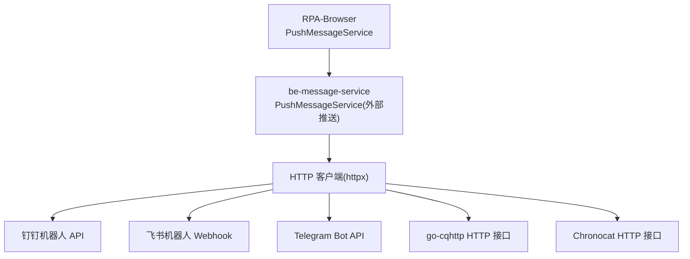
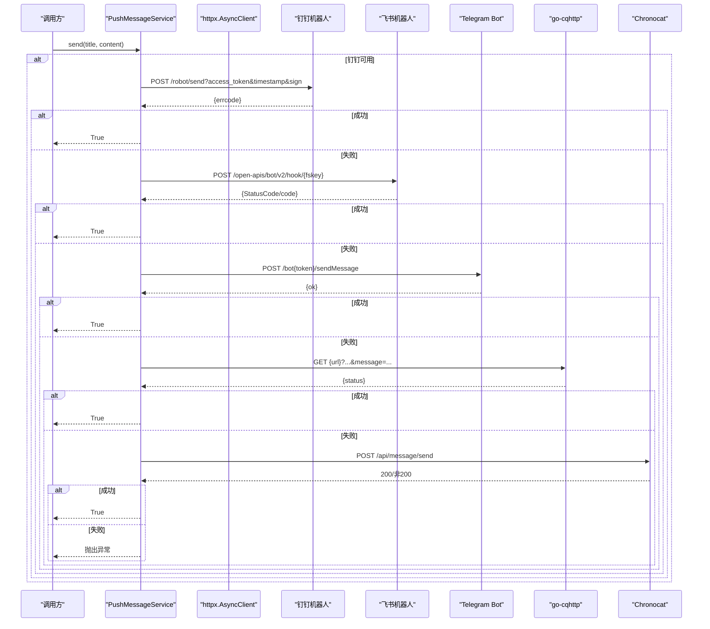
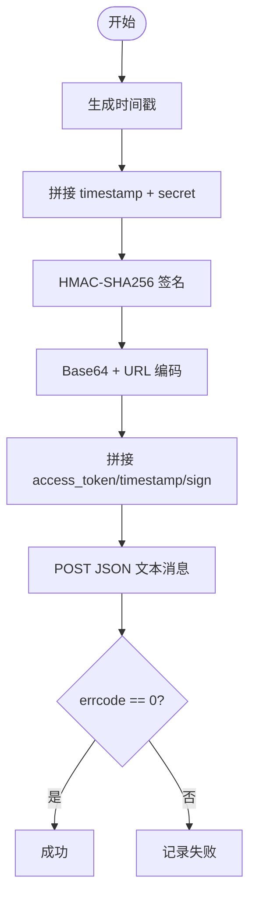
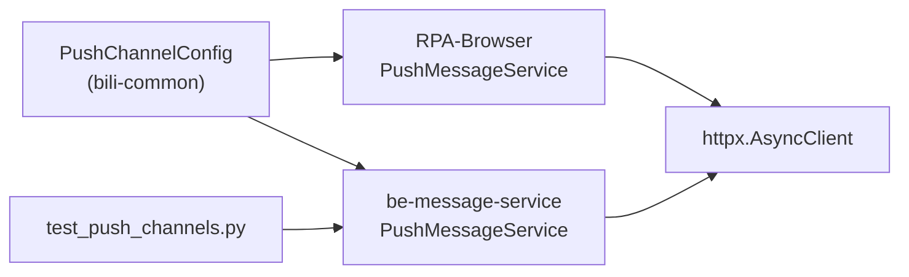

# 即时通讯平台渠道

<cite>
**本文引用的文件**
- [RPA-Browser/app/services/message/push_msg.py](file://RPA-Browser/app/services/message/push_msg.py)
- [be-message-service/app/services/message/external/push.py](file://be-message-service/app/services/message/external/push.py)
- [bili-common/bili_common/models/push.py](file://bili-common/bili_common/models/push.py)
- [RPA-Browser/app/models/notify/models.py](file://RPA-Browser/app/models/notify/models.py)
- [RPA-Browser/app/models/notify/response_models.py](file://RPA-Browser/app/models/notify/response_models.py)
- [be-message-service/tests/test_push_channels.py](file://be-message-service/tests/test_push_channels.py)
</cite>

## 目录
1. [简介](#简介)
2. [项目结构](#项目结构)
3. [核心组件](#核心组件)
4. [架构总览](#架构总览)
5. [详细组件分析](#详细组件分析)
6. [依赖关系分析](#依赖关系分析)
7. [性能与可靠性](#性能与可靠性)
8. [故障排查指南](#故障排查指南)
9. [结论](#结论)
10. [附录：配置与消息格式速查](#附录配置与消息格式速查)

## 简介
本文件面向“即时通讯平台推送渠道”的集成实现，覆盖钉钉机器人、飞书机器人、Telegram Bot、go-cqhttp、Chronocat 等平台的认证方式、API 调用格式、消息类型支持，并深入解析钉钉签名验证机制、飞书 Webhook 配置、Telegram 代理支持。同时文档化 QQ 消息推送的 go-cqhttp 与 Chronocat 两种实现方式，提供各平台配置示例、消息格式规范、错误处理策略与性能优化建议。

## 项目结构
推送能力由两部分组成：
- RPA-Browser 中的统一推送服务（PushMessageService），封装了多平台推送方法。
- be-message-service 中移植后的统一推送服务，作为消息服务的唯一推送执行体，具备降级重试与异常上报能力。
- bili-common 定义了跨模块复用的推送配置模型 PushChannelConfig，确保两端契约一致。

图表来源
- [RPA-Browser/app/services/message/push_msg.py:111-176](file://RPA-Browser/app/services/message/push_msg.py#L111-L176)
- [be-message-service/app/services/message/external/push.py:198-242](file://be-message-service/app/services/message/external/push.py#L198-L242)
- [be-message-service/app/services/message/external/push.py:427-451](file://be-message-service/app/services/message/external/push.py#L427-L451)
- [be-message-service/app/services/message/external/push.py:519-538](file://be-message-service/app/services/message/external/push.py#L519-L538)

章节来源
- [RPA-Browser/app/services/message/push_msg.py:1-1051](file://RPA-Browser/app/services/message/push_msg.py#L1-L1051)
- [be-message-service/app/services/message/external/push.py:1-726](file://be-message-service/app/services/message/external/push.py#L1-L726)
- [bili-common/bili_common/models/push.py:14-156](file://bili-common/bili_common/models/push.py#L14-L156)

## 核心组件
- 统一推送服务类：在两个项目中均存在 PushMessageService，负责按配置启用对应渠道并发送消息。
- 配置模型：PushChannelConfig 集中定义所有渠道所需的凭据与参数，供两端复用。
- 降级与重试：message-service 的 send() 按预设顺序尝试已启用的渠道，任一成功即返回；全部失败则抛出异常，便于上层判定彻底失败。

章节来源
- [RPA-Browser/app/services/message/push_msg.py:44-800](file://RPA-Browser/app/services/message/push_msg.py#L44-L800)
- [be-message-service/app/services/message/external/push.py:160-726](file://be-message-service/app/services/message/external/push.py#L160-L726)
- [bili-common/bili_common/models/push.py:14-156](file://bili-common/bili_common/models/push.py#L14-L156)

## 架构总览
推送流程概览：
- 调用方构造标题与内容，选择或自动发现已启用的渠道。
- 通过统一的 httpx 异步客户端发起请求。
- 各渠道独立实现，失败时抛出异常，由上层降级到下一个渠道。
- 日志记录成功/失败，便于排障。

图表来源
- [RPA-Browser/app/services/message/push_msg.py:111-176](file://RPA-Browser/app/services/message/push_msg.py#L111-L176)
- [be-message-service/app/services/message/external/push.py:198-242](file://be-message-service/app/services/message/external/push.py#L198-L242)
- [be-message-service/app/services/message/external/push.py:427-451](file://be-message-service/app/services/message/external/push.py#L427-L451)
- [be-message-service/app/services/message/external/push.py:519-538](file://be-message-service/app/services/message/external/push.py#L519-L538)

## 详细组件分析

### 钉钉机器人
- 认证方式：使用 access_token 与 secret 计算签名。
- 签名验证机制：
  - 生成毫秒级时间戳。
  - 将 timestamp 与 secret 拼接为待签名字符串。
  - 使用 HMAC-SHA256 对字符串进行签名，再进行 Base64 编码与 URL 安全编码。
  - 将 access_token、timestamp、sign 拼接到请求 URL。
- API 调用格式：POST JSON，msgtype=text，text.content 包含标题与内容。
- 错误处理：检查 errcode 是否为空/0，否则记录失败。

图表来源
- [RPA-Browser/app/services/message/push_msg.py:119-139](file://RPA-Browser/app/services/message/push_msg.py#L119-L139)
- [be-message-service/app/services/message/external/push.py:202-216](file://be-message-service/app/services/message/external/push.py#L202-L216)

章节来源
- [RPA-Browser/app/services/message/push_msg.py:111-139](file://RPA-Browser/app/services/message/push_msg.py#L111-L139)
- [be-message-service/app/services/message/external/push.py:198-216](file://be-message-service/app/services/message/external/push.py#L198-L216)

### 飞书机器人
- 认证方式：Webhook 地址中包含 fskey。
- API 调用格式：POST JSON，msg_type=text，content.text 包含标题与内容。
- 错误处理：检查 StatusCode 或 code 是否为 0，否则记录失败或抛出异常（message-service 版本）。

章节来源
- [RPA-Browser/app/services/message/push_msg.py:141-158](file://RPA-Browser/app/services/message/push_msg.py#L141-L158)
- [be-message-service/app/services/message/external/push.py:218-229](file://be-message-service/app/services/message/external/push.py#L218-L229)

### Telegram Bot
- 认证方式：使用 bot token 与 chat_id。
- API 调用格式：POST form-encoded，字段包括 chat_id、text、disable_web_page_preview。
- 代理支持：
  - 可配置 tg_api_host 自定义 API 主机。
  - 可配置 tg_proxy_host、tg_proxy_port、tg_proxy_auth，构建 http/https 代理字典传入 httpx。
- 错误处理：检查 ok 字段，否则记录失败或抛出异常。

章节来源
- [RPA-Browser/app/services/message/push_msg.py:441-476](file://RPA-Browser/app/services/message/push_msg.py#L441-L476)
- [be-message-service/app/services/message/external/push.py:427-451](file://be-message-service/app/services/message/external/push.py#L427-L451)
- [bili-common/bili_common/models/push.py:90-96](file://bili-common/bili_common/models/push.py#L90-L96)

### go-cqhttp（QQ 消息推送）
- 认证方式：URL 参数 access_token 与 gobot_qq（目标用户/群标识）。
- API 调用格式：GET 请求，message 参数携带标题与内容。
- 错误处理：检查 status 是否为 ok，否则记录失败或抛出异常。

章节来源
- [RPA-Browser/app/services/message/push_msg.py:160-176](file://RPA-Browser/app/services/message/push_msg.py#L160-L176)
- [be-message-service/app/services/message/external/push.py:231-242](file://be-message-service/app/services/message/external/push.py#L231-L242)
- [bili-common/bili_common/models/push.py:42-45](file://bili-common/bili_common/models/push.py#L42-L45)

### Chronocat（QQ 消息推送）
- 认证方式：Authorization: Bearer {chronocat_token}。
- API 调用格式：POST JSON，peer.chatType 区分个人(1)/群(2)，elements 包含文本元素。
- 错误处理：检查 HTTP 状态码是否为 200，否则记录失败或抛出异常。

章节来源
- [RPA-Browser/app/services/message/push_msg.py:593-640](file://RPA-Browser/app/services/message/push_msg.py#L593-L640)
- [be-message-service/app/services/message/external/push.py:519-538](file://be-message-service/app/services/message/external/push.py#L519-L538)
- [bili-common/bili_common/models/push.py:114-117](file://bili-common/bili_common/models/push.py#L114-L117)

### 统一推送服务与降级链
- 渠道可用性检测：根据配置字段判断是否启用某渠道。
- 降级顺序：FALLBACK_ORDER 定义了优先顺序，例如 pushme、pushplus_bot、smtp、telegram_bot、bark、dingding_bot、feishu_bot 等。
- 发送语义：每个渠道在真正发送失败时抛异常；send() 依次尝试，直到成功或全部失败。

章节来源
- [be-message-service/app/services/message/external/push.py:59-83](file://be-message-service/app/services/message/external/push.py#L59-L83)
- [be-message-service/app/services/message/external/push.py:628-708](file://be-message-service/app/services/message/external/push.py#L628-L708)

## 依赖关系分析
- 配置模型共享：PushChannelConfig 在 bili-common 中定义，被 RPA-Browser 与 be-message-service 共同使用，保证契约一致。
- HTTP 客户端：统一使用 httpx.AsyncClient，设置超时与代理，提升稳定性。
- 测试支撑：test_push_channels.py 用于连通性测试，读取全局配置并对已启用渠道逐一发送真实消息。

图表来源
- [bili-common/bili_common/models/push.py:14-156](file://bili-common/bili_common/models/push.py#L14-L156)
- [be-message-service/tests/test_push_channels.py:1-54](file://be-message-service/tests/test_push_channels.py#L1-L54)

章节来源
- [bili-common/bili_common/models/push.py:14-156](file://bili-common/bili_common/models/push.py#L14-L156)
- [be-message-service/tests/test_push_channels.py:1-54](file://be-message-service/tests/test_push_channels.py#L1-L54)

## 性能与可靠性
- 连接复用：使用共享的 httpx.AsyncClient，减少握手开销。
- 超时控制：统一设置超时（如 15s），避免长时间阻塞。
- 降级与重试：按 FALLBACK_ORDER 顺序尝试多个渠道，提高送达率。
- 并发与串行：当前实现为串行尝试，避免并发竞争导致的限流或资源争用。
- 代理与自定义主机：Telegram 支持代理与自定义 API 主机，增强网络可达性。
- 日志与可观测性：每个渠道成功/失败均有日志，便于定位问题。

[本节为通用指导，不直接分析具体文件]

## 故障排查指南
- 钉钉签名失败：检查 timestamp 与 secret 是否正确拼接，签名算法是否为 HMAC-SHA256，并进行 Base64 与 URL 编码。
- 飞书 Webhook 失败：确认 fskey 正确且 Webhook 已启用，检查返回码 StatusCode/code 是否为 0。
- Telegram 推送失败：检查 bot token、chat_id、代理配置与 API 主机；查看 ok 字段。
- go-cqhttp 失败：确认 access_token、gobot_qq、URL 正确，检查 status 是否为 ok。
- Chronocat 失败：确认 Authorization 头与 URL 正确，检查 peer.chatType 与 elements 格式，确认 HTTP 200。
- 全渠道失败：查看最后异常信息，确认至少一个渠道配置有效；运行连通性测试用例。

章节来源
- [RPA-Browser/app/services/message/push_msg.py:111-176](file://RPA-Browser/app/services/message/push_msg.py#L111-L176)
- [be-message-service/app/services/message/external/push.py:198-242](file://be-message-service/app/services/message/external/push.py#L198-L242)
- [be-message-service/app/services/message/external/push.py:427-451](file://be-message-service/app/services/message/external/push.py#L427-L451)
- [be-message-service/app/services/message/external/push.py:519-538](file://be-message-service/app/services/message/external/push.py#L519-L538)
- [be-message-service/tests/test_push_channels.py:1-54](file://be-message-service/tests/test_push_channels.py#L1-L54)

## 结论
本项目实现了多平台即时通讯推送的统一抽象，涵盖钉钉、飞书、Telegram、go-cqhttp、Chronocat 等渠道。通过共享配置模型与统一 HTTP 客户端，保证了代码复用与一致性；通过降级链与严格错误处理，提升了推送的可靠性与可观测性。建议在生产环境结合代理与自定义主机配置，完善监控与告警，持续验证各渠道连通性。

[本节为总结，不直接分析具体文件]

## 附录：配置与消息格式速查
- 钉钉机器人
  - 配置字段：dd_bot_token、dd_bot_secret
  - 消息格式：JSON，msgtype=text，text.content 含标题与内容
  - 签名：HMAC-SHA256(timestamp+secret)，Base64+URL 编码后作为 sign
- 飞书机器人
  - 配置字段：fskey
  - 消息格式：JSON，msg_type=text，content.text 含标题与内容
- Telegram Bot
  - 配置字段：tg_bot_token、tg_user_id、tg_api_host、tg_proxy_host、tg_proxy_port、tg_proxy_auth
  - 消息格式：form-encoded，chat_id、text、disable_web_page_preview
- go-cqhttp
  - 配置字段：gobot_url、gobot_qq、gobot_token
  - 消息格式：GET 请求，message 参数含标题与内容
- Chronocat
  - 配置字段：chronocat_url、chronocat_qq、chronocat_token
  - 消息格式：JSON，peer.chatType（个人/群）、elements 文本元素

章节来源
- [bili-common/bili_common/models/push.py:35-45](file://bili-common/bili_common/models/push.py#L35-L45)
- [bili-common/bili_common/models/push.py:90-96](file://bili-common/bili_common/models/push.py#L90-L96)
- [bili-common/bili_common/models/push.py:114-117](file://bili-common/bili_common/models/push.py#L114-L117)
- [RPA-Browser/app/models/notify/models.py:67-85](file://RPA-Browser/app/models/notify/models.py#L67-L85)
- [RPA-Browser/app/models/notify/response_models.py:129-148](file://RPA-Browser/app/models/notify/response_models.py#L129-L148)