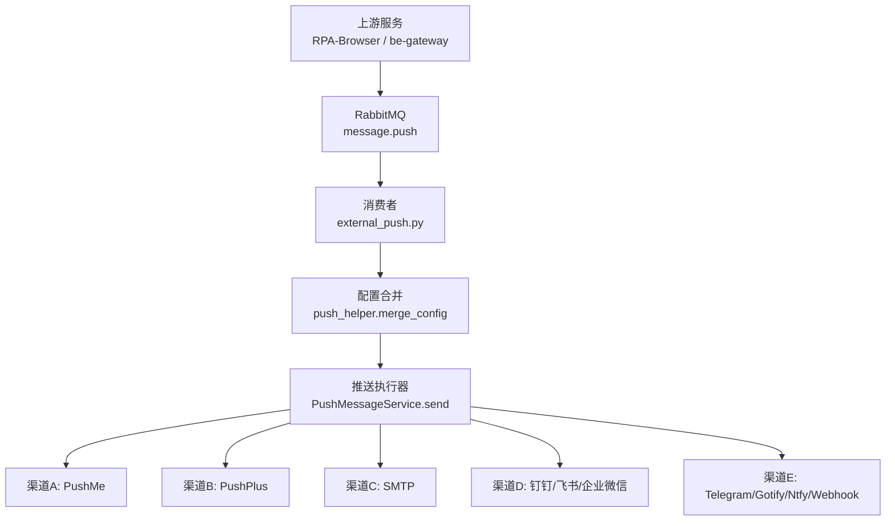
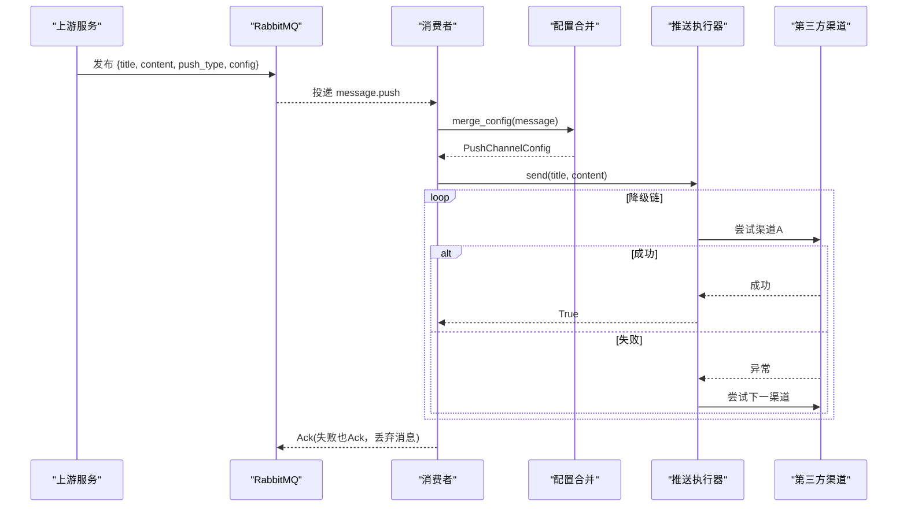
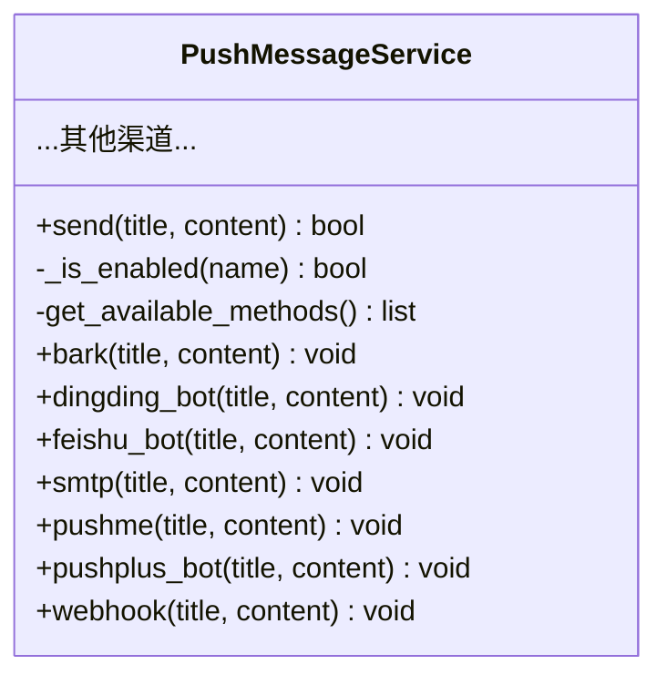
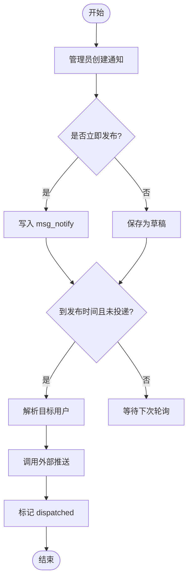
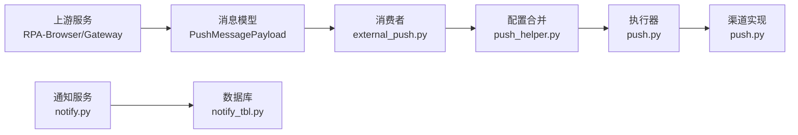

# 多渠道推送系统

<cite>
**本文引用的文件**
- [push.py](file://be-message-service/app/services/message/external/push.py)
- [push_helper.py](file://be-message-service/app/services/message/external/push_helper.py)
- [notify.py](file://be-message-service/app/services/message/insite/notify.py)
- [notify_tbl.py](file://be-message-service/app/models/db/notify_tbl.py)
- [external_push.py](file://be-message-service/app/consumers/external_push.py)
- [retry.py](file://be-message-service/app/consumers/retry.py)
- [message_pub.py](file://be-bilibili-crawler/Service/MQ/message/message_pub.py)
- [PushMe.py](file://be-bilibili-crawler/Utils/推送/PushMe.py)
- [CommonRouter.py](file://be-bilibili-crawler/controller/common/CommonRouter.py)
- [BackgroundServiceController.py](file://be-bilibili-crawler/controller/v1/background_service/BackgroundServiceController.py)
- [system_mq_task_service.js](file://be-gateway/ExpressServerEnd/Service/background_task_module/system_mq_task_service.js)
- [types.gen.ts](file://Vue3FrontEndDemoExercise/src/api/community/hey-api/types.gen.ts)
</cite>

## 目录
1. [简介](#简介)
2. [项目结构](#项目结构)
3. [核心组件](#核心组件)
4. [架构总览](#架构总览)
5. [详细组件分析](#详细组件分析)
6. [依赖关系分析](#依赖关系分析)
7. [性能与可靠性](#性能与可靠性)
8. [故障排查指南](#故障排查指南)
9. [结论](#结论)
10. [附录：渠道配置与API参考](#附录渠道配置与api参考)

## 简介
本系统提供统一的多渠道推送能力，支持 PushMe、PushPlus、邮箱（SMTP）、钉钉、飞书、企业微信、Telegram、Gotify、Ntfy、Webhook 等第三方服务。消息由上游服务通过消息队列投递至 message-service，消费者按“降级链”依次尝试已启用的渠道，任一成功即完成；全部失败则记录严重日志并丢弃消息，避免无限重试污染队列。系统同时提供站内通知的发布、拉取、定时投递与状态管理，确保通知不重复、可追踪、可撤回。

## 项目结构
- 推送执行层：位于 be-message-service 的 external 模块，集中实现各渠道发送逻辑与降级调度。
- 消息消费层：RabbitMQ 消费者接收推送请求，合并配置后调用推送执行层。
- 站内通知：insite 模块负责通知的持久化、可见性判定、游标拉取与定时投递。
- 上游集成：RPA-Browser 与 be-gateway 通过 MQ 或本地任务触发推送。
- 前端模型：Vue3 前端使用类型定义与后端保持一致，便于传递 per-user 推送配置。

图表来源
- [external_push.py:1-35](file://be-message-service/app/consumers/external_push.py#L1-L35)
- [push_helper.py:26-37](file://be-message-service/app/services/message/external/push_helper.py#L26-L37)
- [push.py:664-708](file://be-message-service/app/services/message/external/push.py#L664-L708)

章节来源
- [external_push.py:1-35](file://be-message-service/app/consumers/external_push.py#L1-L35)
- [push_helper.py:26-37](file://be-message-service/app/services/message/external/push_helper.py#L26-L37)
- [push.py:664-708](file://be-message-service/app/services/message/external/push.py#L664-L708)

## 核心组件
- 统一推送执行器：封装所有渠道发送方法，按优先级顺序尝试，失败抛异常以触发降级。
- 配置合并器：将全局配置与消息内 per-user 配置合并，模板占位符视为未设置，避免覆盖。
- 消费者：从 RabbitMQ 消费推送消息，合并配置后调用执行器；失败不重投，直接 ack。
- 站内通知服务：提供通知创建、幂等发布、用户拉取、定时投递与已读/删除状态管理。
- 数据模型：通知本体、游标表、状态表，保证读扩散与幂等。

章节来源
- [push.py:160-708](file://be-message-service/app/services/message/external/push.py#L160-L708)
- [push_helper.py:26-51](file://be-message-service/app/services/message/external/push_helper.py#L26-L51)
- [external_push.py:16-35](file://be-message-service/app/consumers/external_push.py#L16-L35)
- [notify.py:108-668](file://be-message-service/app/services/message/insite/notify.py#L108-L668)
- [notify_tbl.py:24-112](file://be-message-service/app/models/db/notify_tbl.py#L24-L112)

## 架构总览

图表来源
- [message_pub.py:45-62](file://be-bilibili-crawler/Service/MQ/message/message_pub.py#L45-L62)
- [external_push.py:16-35](file://be-message-service/app/consumers/external_push.py#L16-L35)
- [push_helper.py:26-37](file://be-message-service/app/services/message/external/push_helper.py#L26-L37)
- [push.py:664-708](file://be-message-service/app/services/message/external/push.py#L664-L708)

## 详细组件分析

### 统一推送执行器（PushMessageService）
- 职责：聚合所有渠道发送方法；按 FALLBACK_ORDER 排序已启用渠道；任一成功即返回；全部失败抛出 RuntimeError。
- 关键特性：
  - 共享 httpx.AsyncClient 提升并发性能。
  - 支持 hitokoto 一言附加内容。
  - 对 SMTP 采用线程池同步执行，避免阻塞事件循环。
  - 每个渠道失败抛异常，供外层捕获并继续降级。

图表来源
- [push.py:160-708](file://be-message-service/app/services/message/external/push.py#L160-L708)

章节来源
- [push.py:160-708](file://be-message-service/app/services/message/external/push.py#L160-L708)

### 配置合并与用户标签
- 合并策略：以全局 settings.message_config 为基准，消息内 per-user 配置优先覆盖非空字段；模板占位符视为未设置，不覆盖。
- 用户标签：根据 mid 与用户名生成标题前缀，便于区分不同用户推送。

章节来源
- [push_helper.py:26-51](file://be-message-service/app/services/message/external/push_helper.py#L26-L51)

### 消费者与重试策略
- 消费者：消费 message.push 队列，合并配置后调用执行器；失败捕获异常并记录错误，正常返回以 Ack 丢弃消息，避免死信堆积。
- 重试工具：提供读取 x-death 头统计重投次数，用于其它业务场景的重试上限控制（推送本身不重投）。

章节来源
- [external_push.py:16-35](file://be-message-service/app/consumers/external_push.py#L16-L35)
- [retry.py:1-31](file://be-message-service/app/consumers/retry.py#L1-L31)

### 站内通知：发布、拉取与定时投递
- 发布：管理员创建通知，支持草稿与定时发布；幂等发布避免重复写入。
- 拉取：基于游标的增量拉取，读取即已读，避免重复消费。
- 定时投递：定时任务取出已到发布时间且未投递的通知，解析目标用户并标记 dispatched，防止重复推送。
- 状态管理：已读/删除状态维护，支持批量置已读与用户删除。

图表来源
- [notify.py:113-216](file://be-message-service/app/services/message/insite/notify.py#L113-L216)
- [notify.py:565-590](file://be-message-service/app/services/message/insite/notify.py#L565-L590)
- [notify_tbl.py:24-73](file://be-message-service/app/models/db/notify_tbl.py#L24-L73)

章节来源
- [notify.py:108-668](file://be-message-service/app/services/message/insite/notify.py#L108-L668)
- [notify_tbl.py:24-112](file://be-message-service/app/models/db/notify_tbl.py#L24-L112)

### 上游集成与测试
- RPA-Browser：通过 MQ 发布推送消息，绕过 PushMe 限流，确保每次测试都能触发 message-service。
- Gateway：使用 BullMQ Worker 处理系统级推送任务，调用 PushPlus。
- 测试接口：故意抛错并发布测试告警，验证推送链路。

章节来源
- [message_pub.py:45-62](file://be-bilibili-crawler/Service/MQ/message/message_pub.py#L45-L62)
- [system_mq_task_service.js:6-27](file://be-gateway/ExpressServerEnd/Service/background_task_module/system_mq_task_service.js#L6-L27)
- [CommonRouter.py:67-94](file://be-bilibili-crawler/controller/common/CommonRouter.py#L67-L94)
- [PushMe.py:116-136](file://be-bilibili-crawler/Utils/推送/PushMe.py#L116-L136)

## 依赖关系分析
- 推送执行器依赖 httpx 异步客户端与配置模型；各渠道方法独立，耦合度低。
- 消费者依赖 FastStream/RabbitMQ 与配置合并器；与执行器解耦。
- 站内通知依赖 SQLModel/MySQL，使用读扩散与游标机制降低写放大。
- 上游服务通过 MQ 与 message-service 通信，网关通过本地队列触发系统级推送。

图表来源
- [external_push.py:16-35](file://be-message-service/app/consumers/external_push.py#L16-L35)
- [push_helper.py:26-37](file://be-message-service/app/services/message/external/push_helper.py#L26-L37)
- [push.py:664-708](file://be-message-service/app/services/message/external/push.py#L664-L708)
- [notify.py:565-590](file://be-message-service/app/services/message/insite/notify.py#L565-L590)
- [notify_tbl.py:24-112](file://be-message-service/app/models/db/notify_tbl.py#L24-L112)

章节来源
- [push.py:664-708](file://be-message-service/app/services/message/external/push.py#L664-L708)
- [notify.py:565-590](file://be-message-service/app/services/message/insite/notify.py#L565-L590)
- [notify_tbl.py:24-112](file://be-message-service/app/models/db/notify_tbl.py#L24-L112)

## 性能与可靠性
- 连接复用：共享 httpx.AsyncClient，减少握手开销。
- 降级链：按优先级尝试，提高成功率；失败快速切换下一渠道。
- 异步优先：HTTP 渠道全异步；SMTP 同步通过线程池执行，避免阻塞。
- 幂等与去重：站内通知通过游标与 dispatched 标记避免重复；上游 PushMe 限流与内容去重在调用方侧处理。
- 失败不重投：外部推送失败直接丢弃，避免死信与资源浪费。

[本节为通用指导，无需特定文件引用]

## 故障排查指南
- 检查渠道配置：确认对应渠道必填字段已设置（如 token、secret、key 等），否则该渠道会被跳过。
- 查看日志：执行器在渠道失败时记录 ERROR，全部失败记录 CRITICAL，包含最后错误与堆栈。
- 队列积压：若消费者频繁失败，检查上游发布是否正确；推送失败会 Ack 丢弃，不会阻塞队列。
- 站内通知未送达：确认通知已发布且到生效时间；检查 dispatched 标记与目标用户解析结果。
- 重试计数：使用 retry_count 工具读取 x-death 头，判断消息重投次数，避免无限重试。

章节来源
- [push.py:690-708](file://be-message-service/app/services/message/external/push.py#L690-L708)
- [external_push.py:28-35](file://be-message-service/app/consumers/external_push.py#L28-L35)
- [notify.py:565-590](file://be-message-service/app/services/message/insite/notify.py#L565-L590)
- [retry.py:19-27](file://be-message-service/app/consumers/retry.py#L19-L27)

## 结论
本多渠道推送系统通过统一的执行器与降级链，实现了高可用的第三方渠道发送；结合站内通知的读扩散与游标机制，保证了通知的幂等与高效分发。上游通过 MQ 解耦，消费者失败不重投，整体具备良好扩展性与可观测性。新增渠道只需实现方法并在 _is_enabled 中声明即可接入。

[本节为总结，无需特定文件引用]

## 附录：渠道配置与API参考
- 渠道列表与优先级：见 FALLBACK_ORDER，涵盖 PushMe、PushPlus、SMTP、钉钉、飞书、企业微信、Telegram、Gotify、Ntfy、Webhook 等。
- 配置合并：merge_config 支持全局与 per-user 配置合并，模板占位符不覆盖。
- 前端模型：PushChannelConfig 字段与后端一致，便于传递 per-user 配置。
- 上游发布：RPA-Browser 通过 MQ 发布推送消息；Gateway 通过 BullMQ Worker 触发系统级推送。
- 测试用例：CommonRouter 提供测试抛错接口，验证推送链路。

章节来源
- [push.py:59-83](file://be-message-service/app/services/message/external/push.py#L59-L83)
- [push_helper.py:26-37](file://be-message-service/app/services/message/external/push_helper.py#L26-L37)
- [types.gen.ts:7019-7098](file://Vue3FrontEndDemoExercise/src/api/community/hey-api/types.gen.ts#L7019-L7098)
- [message_pub.py:45-62](file://be-bilibili-crawler/Service/MQ/message/message_pub.py#L45-L62)
- [system_mq_task_service.js:6-27](file://be-gateway/ExpressServerEnd/Service/background_task_module/system_mq_task_service.js#L6-L27)
- [CommonRouter.py:67-94](file://be-bilibili-crawler/controller/common/CommonRouter.py#L67-L94)