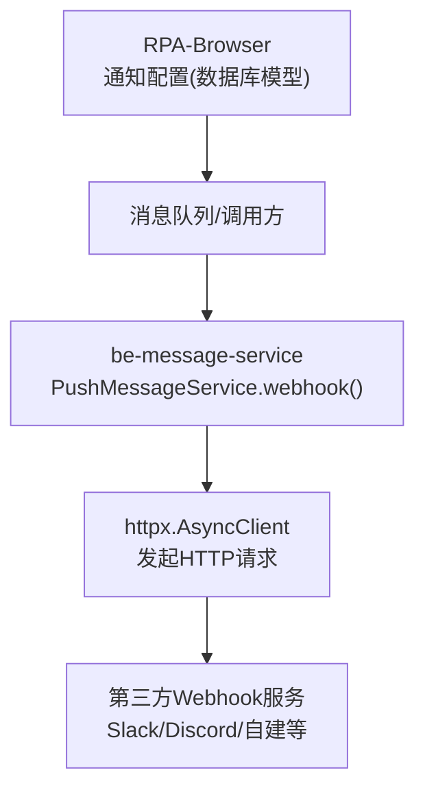
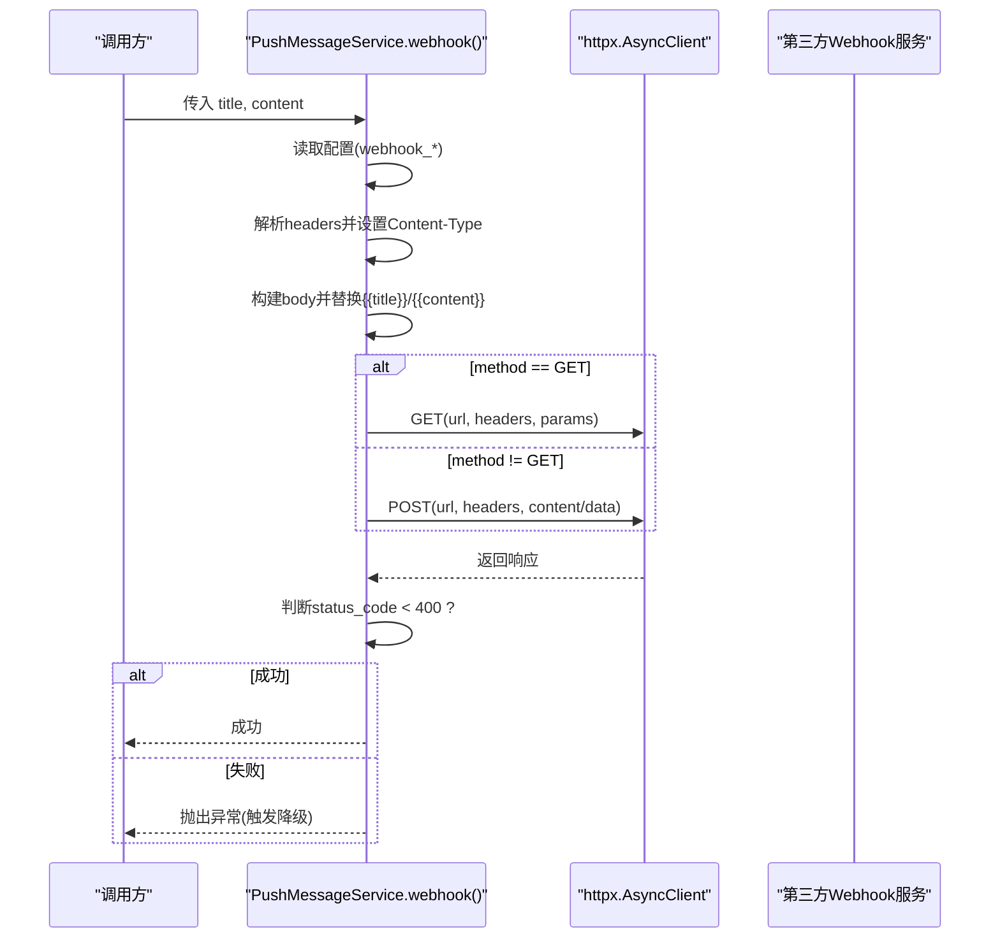
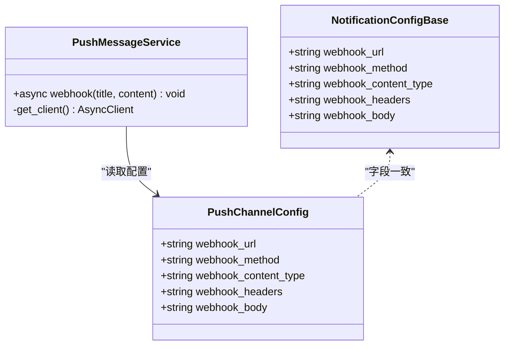
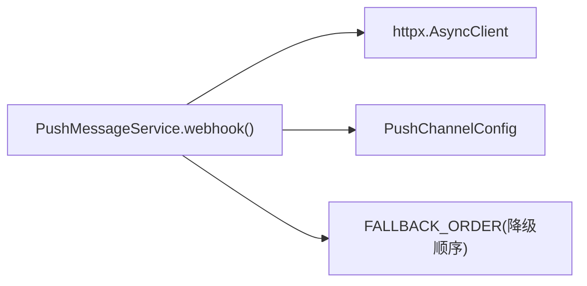

# 自定义 Webhook 渠道

<cite>
**本文引用的文件**
- [be-message-service/app/services/message/external/push.py](file://be-message-service/app/services/message/external/push.py)
- [bili-common/bili_common/models/push.py](file://bili-common/bili_common/models/push.py)
- [RPA-Browser/app/models/database/notify/models.py](file://RPA-Browser/app/models/database/notify/models.py)
- [RPA-Browser/app/models/notify/models.py](file://RPA-Browser/app/models/notify/models.py)
</cite>

## 目录
1. [简介](#简介)
2. [项目结构](#项目结构)
3. [核心组件](#核心组件)
4. [架构总览](#架构总览)
5. [详细组件分析](#详细组件分析)
6. [依赖关系分析](#依赖关系分析)
7. [性能与可靠性](#性能与可靠性)
8. [故障排查指南](#故障排查指南)
9. [结论](#结论)
10. [附录：第三方集成示例](#附录第三方集成示例)

## 简介
本章节面向“自定义 Webhook 推送渠道”，说明其实现机制、配置参数、模板变量替换、请求方法支持（GET/POST）、内容类型处理、响应状态码判断逻辑，并提供多种第三方服务集成思路（如 Slack、Discord、自建服务等）。该能力由统一推送服务提供，作为众多通知渠道之一，具备降级重试与失败上报能力。

## 项目结构
- 推送执行体位于 be-message-service，负责实际发送 HTTP 请求并处理结果。
- 推送配置模型在 bili-common 中定义，供 RPA-Browser 与 be-message-service 共享契约。
- RPA-Browser 的数据库模型包含 webhook 相关字段，用于持久化用户配置。

图表来源
- [RPA-Browser/app/models/database/notify/models.py:116-121](file://RPA-Browser/app/models/database/notify/models.py#L116-L121)
- [bili-common/bili_common/models/push.py:119-124](file://bili-common/bili_common/models/push.py#L119-L124)
- [be-message-service/app/services/message/external/push.py:592-624](file://be-message-service/app/services/message/external/push.py#L592-L624)

章节来源
- [RPA-Browser/app/models/database/notify/models.py:116-121](file://RPA-Browser/app/models/database/notify/models.py#L116-L121)
- [bili-common/bili_common/models/push.py:119-124](file://bili-common/bili_common/models/push.py#L119-L124)
- [be-message-service/app/services/message/external/push.py:592-624](file://be-message-service/app/services/message/external/push.py#L592-L624)

## 核心组件
- PushChannelConfig：定义所有推送渠道的配置字段，包括 webhook_url、webhook_method、webhook_content_type、webhook_headers、webhook_body。
- NotificationConfigBase/NotificationConfig：数据库模型，持久化 webhook 相关配置。
- PushMessageService.webhook：统一推送服务的自定义 Webhook 实现，负责组装请求、模板替换、发送与结果判定。

章节来源
- [bili-common/bili_common/models/push.py:119-124](file://bili-common/bili_common/models/push.py#L119-L124)
- [RPA-Browser/app/models/database/notify/models.py:116-121](file://RPA-Browser/app/models/database/notify/models.py#L116-L121)
- [be-message-service/app/services/message/external/push.py:592-624](file://be-message-service/app/services/message/external/push.py#L592-L624)

## 架构总览
自定义 Webhook 推送流程如下：
- 读取配置：从 PushChannelConfig 获取 webhook_url、webhook_method、webhook_content_type、webhook_headers、webhook_body。
- 构建请求头：设置 Content-Type，并按行解析 webhook_headers 追加到请求头。
- 构建请求体：若未提供 webhook_body，则默认生成 JSON；当 content_type 为 application/json 时，对 {{title}} 和 {{content}} 进行模板替换。
- 选择方法：根据 webhook_method 决定 GET 或 POST；GET 时将 body 解析为查询参数（仅当 content_type 为 application/json）。
- 发送请求：使用共享 httpx.AsyncClient 发送请求。
- 判定结果：若响应状态码 < 400 视为成功，否则抛出异常触发降级链。

图表来源
- [be-message-service/app/services/message/external/push.py:592-624](file://be-message-service/app/services/message/external/push.py#L592-L624)

## 详细组件分析

### 配置参数说明
- webhook_url：目标 Webhook 地址，必填。为空时跳过该渠道。
- webhook_method：HTTP 方法，默认 POST，支持 GET。
- webhook_content_type：请求内容类型，默认 application/json。影响请求体格式与模板替换行为。
- webhook_headers：每行一个键值对，形如 Key: Value，会被解析并合并到请求头。
- webhook_body：请求体模板字符串。若为空且 content_type 为 application/json，将自动生成 {"title": "...", "content": "..."}。

章节来源
- [RPA-Browser/app/models/database/notify/models.py:116-121](file://RPA-Browser/app/models/database/notify/models.py#L116-L121)
- [RPA-Browser/app/models/notify/models.py:86-90](file://RPA-Browser/app/models/notify/models.py#L86-L90)
- [bili-common/bili_common/models/push.py:119-124](file://bili-common/bili_common/models/push.py#L119-L124)

### 模板变量替换机制
- 当 content_type 为 application/json 时，系统会对 body 中的 {{title}} 与 {{content}} 进行简单字符串替换，以注入标题与正文。
- 若未提供 webhook_body，默认会生成包含 title 与 content 的 JSON 对象，再进行模板替换。
- 非 JSON 内容类型不会进行模板替换。

章节来源
- [be-message-service/app/services/message/external/push.py:608-613](file://be-message-service/app/services/message/external/push.py#L608-L613)

### 自定义请求头与内容类型
- 请求头默认包含 Content-Type，值为 webhook_content_type。
- webhook_headers 按行解析，遇到包含冒号的行，按第一个冒号分割为键与值，去除首尾空白后加入请求头。
- 解析失败会记录错误日志但不中断后续流程。

章节来源
- [be-message-service/app/services/message/external/push.py:598-607](file://be-message-service/app/services/message/external/push.py#L598-L607)

### 请求方法与数据承载
- GET：当 method 为 GET 时，使用 URL 查询参数传递数据；若 content_type 为 application/json，会将 body 解析为 JSON 作为查询参数。
- POST：当 method 不为 GET 时，使用 POST；若 content_type 为 application/json，则以 JSON 形式发送；否则以表单形式发送。

章节来源
- [be-message-service/app/services/message/external/push.py:614-620](file://be-message-service/app/services/message/external/push.py#L614-L620)

### 响应状态码判断逻辑
- 若响应状态码小于 400，视为成功，记录成功日志。
- 否则抛出运行时异常，包含 url、body、状态码与响应文本，便于定位问题；同时触发整体降级链尝试其他渠道。

章节来源
- [be-message-service/app/services/message/external/push.py:621-624](file://be-message-service/app/services/message/external/push.py#L621-L624)

### 类与方法关系图

图表来源
- [bili-common/bili_common/models/push.py:119-124](file://bili-common/bili_common/models/push.py#L119-L124)
- [RPA-Browser/app/models/database/notify/models.py:116-121](file://RPA-Browser/app/models/database/notify/models.py#L116-L121)
- [be-message-service/app/services/message/external/push.py:592-624](file://be-message-service/app/services/message/external/push.py#L592-L624)

## 依赖关系分析
- 外部依赖：httpx.AsyncClient 用于异步 HTTP 请求，超时时间固定。
- 内部依赖：PushChannelConfig 提供配置；PushMessageService 统一管理各渠道发送与降级。
- 耦合度：Webhook 实现与其他渠道解耦，通过统一的 send 入口与 FALLBACK_ORDER 顺序进行降级。

图表来源
- [be-message-service/app/services/message/external/push.py:36-41](file://be-message-service/app/services/message/external/push.py#L36-L41)
- [be-message-service/app/services/message/external/push.py:592-624](file://be-message-service/app/services/message/external/push.py#L592-L624)
- [be-message-service/app/services/message/external/push.py:60-83](file://be-message-service/app/services/message/external/push.py#L60-L83)

章节来源
- [be-message-service/app/services/message/external/push.py:36-41](file://be-message-service/app/services/message/external/push.py#L36-L41)
- [be-message-service/app/services/message/external/push.py:60-83](file://be-message-service/app/services/message/external/push.py#L60-L83)
- [be-message-service/app/services/message/external/push.py:592-624](file://be-message-service/app/services/message/external/push.py#L592-L624)

## 性能与可靠性
- 连接复用：共享 httpx.AsyncClient 减少握手开销。
- 超时控制：客户端默认超时 15 秒，避免长时间阻塞。
- 降级策略：按预设顺序依次尝试各渠道，任一成功即停止；全部失败则抛出异常，便于上层感知。
- 日志记录：成功与失败均有日志输出，便于监控与排障。

[本节为通用指导，不直接分析具体文件]

## 故障排查指南
- 检查 webhook_url 是否配置正确且可达。
- 核对 webhook_method、webhook_content_type 是否与目标服务要求一致。
- 确认 webhook_headers 格式正确（每行 Key: Value），避免解析失败。
- 若使用 GET 且 content_type 为 application/json，确保 body 可被解析为 JSON 作为查询参数。
- 查看响应状态码与响应文本，定位服务端错误。
- 若失败，观察降级链日志，确认是否有其他渠道成功。

章节来源
- [be-message-service/app/services/message/external/push.py:598-624](file://be-message-service/app/services/message/external/push.py#L598-L624)

## 结论
自定义 Webhook 渠道提供了高度灵活的扩展能力，支持多种 HTTP 方法与内容类型，内置模板变量替换与健壮的错误处理。通过统一推送服务，可与 Slack、Discord、自建服务等广泛集成，满足多样化通知需求。

[本节为总结性内容，不直接分析具体文件]

## 附录：第三方集成示例
以下为常见第三方服务的集成要点与推荐配置方式（基于通用 Webhook 能力）：

- Slack
  - 使用 Slack Incoming Webhook 或 Bot Webhook。
  - 建议 method=POST，content_type=application/json。
  - 在 webhook_body 中使用模板变量，例如包含 channel、text 等字段。
  - 如需认证，可在 webhook_headers 中添加 Authorization 或 token 相关头部。

- Discord
  - 使用 Discord Webhook URL。
  - 建议 method=POST，content_type=application/json。
  - 在 webhook_body 中构造 embeds、content 等字段，并使用 {{title}}、{{content}} 动态插入。
  - 如需签名校验，可在服务端验证或使用 Discord 提供的安全选项。

- 自建服务
  - 根据接口文档设置 method、content_type、headers。
  - 若接口要求表单提交，设置 content_type 为非 JSON（如 application/x-www-form-urlencoded），并在 webhook_body 中提供键值对。
  - 若接口要求 GET，请确保 webhook_body 可解析为 JSON 作为查询参数。

[本节为概念性说明，不直接分析具体文件]