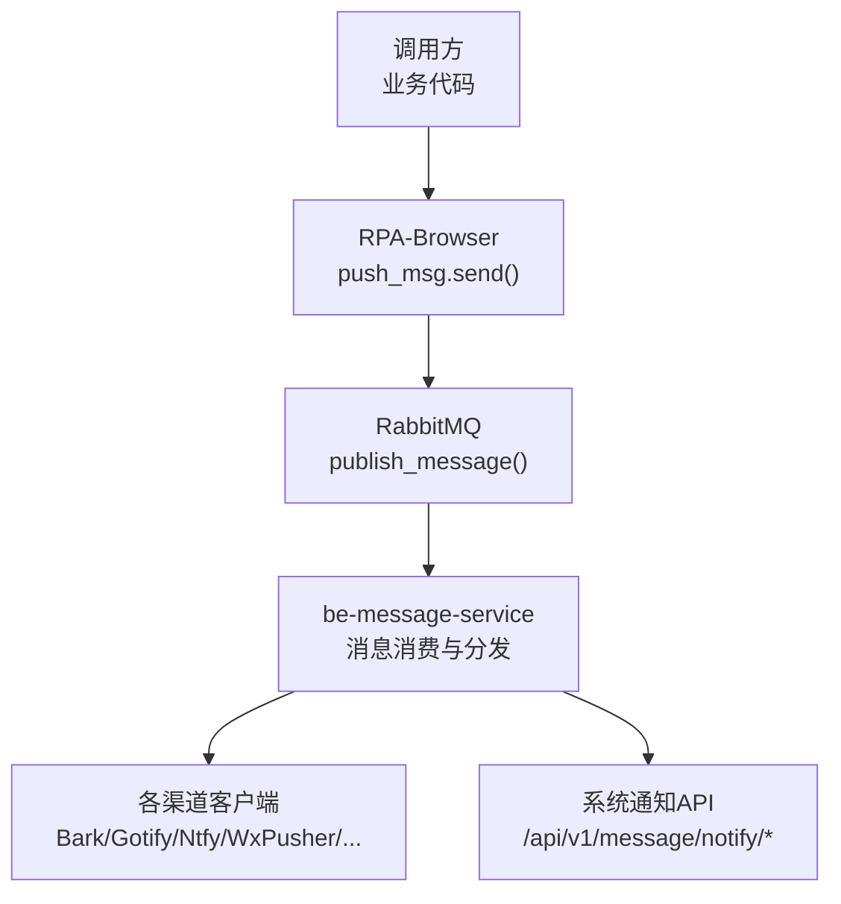
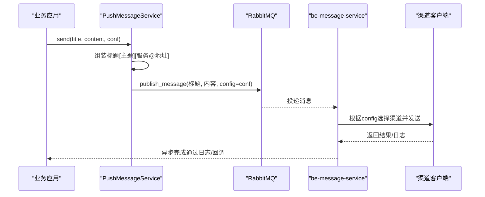
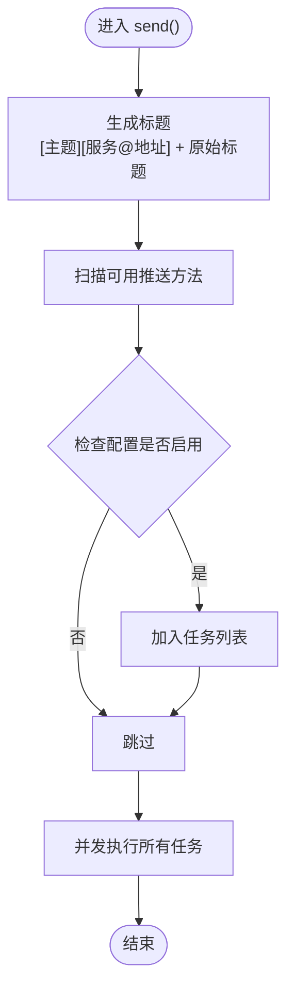
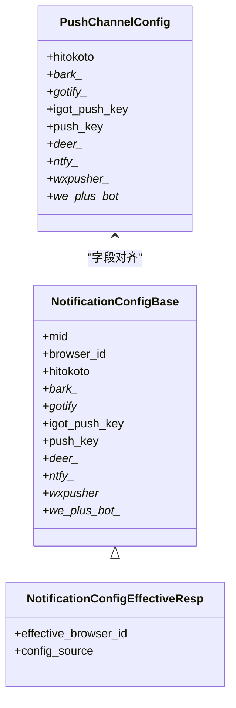
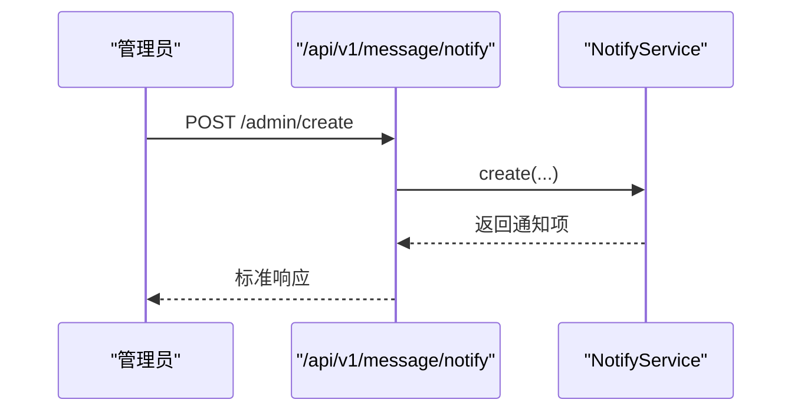
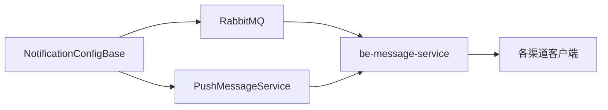

# 通知服务渠道

<cite>
**本文引用的文件**
- [RPA-Browser/app/models/database/notify/models.py](file://RPA-Browser/app/models/database/notify/models.py)
- [RPA-Browser/app/services/message/push_msg.py](file://RPA-Browser/app/services/message/push_msg.py)
- [RPA-Browser/app/config.py](file://RPA-Browser/app/config.py)
- [RPA-Browser/app/models/notify/response_models.py](file://RPA-Browser/app/models/notify/response_models.py)
- [be-message-service/app/api/notify.py](file://be-message-service/app/api/notify.py)
- [be-message-service/app/models/schemas/notify.py](file://be-message-service/app/models/schemas/notify.py)
- [bili-common/bili_common/models/notify.py](file://bili-common/bili_common/models/notify.py)
</cite>

## 目录
1. [简介](#简介)
2. [项目结构](#项目结构)
3. [核心组件](#核心组件)
4. [架构总览](#架构总览)
5. [详细组件分析](#详细组件分析)
6. [依赖关系分析](#依赖关系分析)
7. [性能考量](#性能考量)
8. [故障排查指南](#故障排查指南)
9. [结论](#结论)
10. [附录](#附录)

## 简介
本文件面向“通知服务类推送渠道”，聚焦移动端与系统级通知能力，覆盖 Bark、Gotify、Ntfy、WxPusher、Server酱、PushDeer、iGot、微加机器人等渠道。文档从配置模型、推送实现、统一调度到企业级能力（批量推送、主题订阅、用户分组）进行系统化说明，并提供各渠道的注册要点、API Key 获取方式、配置参数、使用场景、优缺点对比与迁移建议。

## 项目结构
本项目将“通知配置”和“推送执行”解耦：
- RPA-Browser 侧提供统一的推送入口与多渠道实现，并通过消息队列将推送任务投递给 be-message-service 集中执行。
- be-message-service 负责系统通知的发布、拉取、状态管理，以及对外 RPC 的统一接入。
- bili-common 提供跨服务共享的通知枚举与契约。

图表来源
- [RPA-Browser/app/services/message/push_msg.py:1002-1051](file://RPA-Browser/app/services/message/push_msg.py#L1002-L1051)
- [be-message-service/app/api/notify.py:46-217](file://be-message-service/app/api/notify.py#L46-L217)

章节来源
- [RPA-Browser/app/services/message/push_msg.py:1002-1051](file://RPA-Browser/app/services/message/push_msg.py#L1002-L1051)
- [be-message-service/app/api/notify.py:46-217](file://be-message-service/app/api/notify.py#L46-L217)

## 核心组件
- 通知配置模型：定义各渠道所需字段（如 URL、Token、优先级、动作等），支持全局与浏览器维度配置。
- 推送服务：封装各渠道发送逻辑，并支持按配置自动启用多个渠道并行推送。
- 统一发送入口：对外暴露 send/send_error，自动附加主题与服务标识，并将任务投递至消息队列。
- 系统通知 API：提供管理员发布/修改/撤回通知，以及用户侧增量拉取、分页查看等能力。

章节来源
- [RPA-Browser/app/models/database/notify/models.py:13-157](file://RPA-Browser/app/models/database/notify/models.py#L13-L157)
- [RPA-Browser/app/services/message/push_msg.py:44-1051](file://RPA-Browser/app/services/message/push_msg.py#L44-L1051)
- [be-message-service/app/api/notify.py:46-217](file://be-message-service/app/api/notify.py#L46-L217)

## 架构总览
下图展示了从业务调用到最终触达用户设备的端到端流程，包括主题前缀、服务标识、多渠道并发与错误处理。

图表来源
- [RPA-Browser/app/services/message/push_msg.py:1002-1051](file://RPA-Browser/app/services/message/push_msg.py#L1002-L1051)
- [be-message-service/app/api/notify.py:46-217](file://be-message-service/app/api/notify.py#L46-L217)

## 详细组件分析

### 推送服务与渠道实现
- 统一入口：send() 会读取所有可用方法，依据配置决定是否启用对应渠道，并以并发方式执行；SMTP 为同步方法，采用线程池执行。
- 渠道开关：每个渠道在 send() 中通过检查对应配置字段来决定是否启用。
- 主题与标识：标题自动追加主题前缀（信息/成功/警告/失败）和服务标识（服务名@地址）。

图表来源
- [RPA-Browser/app/services/message/push_msg.py:763-894](file://RPA-Browser/app/services/message/push_msg.py#L763-L894)

章节来源
- [RPA-Browser/app/services/message/push_msg.py:44-1051](file://RPA-Browser/app/services/message/push_msg.py#L44-L1051)

### 通知配置模型
- 数据库模型 NotificationConfigBase 定义了所有渠道的配置字段，包含 Bark、Gotify、iGot、Server酱、PushDeer、Ntfy、WxPusher、微加机器人等。
- 响应模型 NotificationConfigEffectiveResp 用于对外返回有效配置，支持浏览器级与全局配置的优先级合并。
- 全局配置 PushChannelConfig 用于无 per-user 配置时的兜底，与 message-service 保持一致以便序列化投递。

图表来源
- [RPA-Browser/app/models/database/notify/models.py:13-157](file://RPA-Browser/app/models/database/notify/models.py#L13-L157)
- [RPA-Browser/app/models/notify/response_models.py:26-167](file://RPA-Browser/app/models/notify/response_models.py#L26-L167)
- [RPA-Browser/app/config.py:13-138](file://RPA-Browser/app/config.py#L13-L138)

章节来源
- [RPA-Browser/app/models/database/notify/models.py:13-157](file://RPA-Browser/app/models/database/notify/models.py#L13-L157)
- [RPA-Browser/app/models/notify/response_models.py:26-167](file://RPA-Browser/app/models/notify/response_models.py#L26-L167)
- [RPA-Browser/app/config.py:13-138](file://RPA-Browser/app/config.py#L13-L138)

### 各渠道详解

#### Bark
- 注册与 Key：在 Bark 服务端或 Day.app 获取设备 Key（或自定义域名）。
- 关键配置：
  - bark_push：设备 Key 或自定义 URL
  - bark_archive：归档
  - bark_group：分组
  - bark_sound：声音
  - bark_icon：图标
  - bark_level：级别（影响 iOS 通知优先级）
  - bark_url：点击跳转链接
- 高级功能：支持声音、图标、优先级、链接跳转、分组与归档。
- 使用示例路径：见推送实现中的 bark() 方法与 send() 中的启用判断。
- 适用场景：iOS 设备即时提醒，适合运维告警、任务完成通知。
- 优缺点：
  - 优点：原生体验好、支持丰富参数、易于集成。
  - 缺点：依赖第三方服务可用性。

章节来源
- [RPA-Browser/app/models/database/notify/models.py:24-31](file://RPA-Browser/app/models/database/notify/models.py#L24-L31)
- [RPA-Browser/app/services/message/push_msg.py:55-110](file://RPA-Browser/app/services/message/push_msg.py#L55-L110)
- [RPA-Browser/app/services/message/push_msg.py:785-786](file://RPA-Browser/app/services/message/push_msg.py#L785-L786)

#### Gotify
- 注册与 Key：部署 Gotify 后创建应用并获取 Token。
- 关键配置：
  - gotify_url：服务端地址
  - gotify_token：应用 Token
  - gotify_priority：优先级（整数）
- 高级功能：优先级控制。
- 使用示例路径：见 gotify() 方法与 send() 中的启用判断。
- 适用场景：自托管通知中心，适合团队内部告警。
- 优缺点：
  - 优点：可私有化部署、轻量。
  - 缺点：需自行维护服务。

章节来源
- [RPA-Browser/app/models/database/notify/models.py:45-48](file://RPA-Browser/app/models/database/notify/models.py#L45-L48)
- [RPA-Browser/app/services/message/push_msg.py:178-199](file://RPA-Browser/app/services/message/push_msg.py#L178-L199)
- [RPA-Browser/app/services/message/push_msg.py:808-812](file://RPA-Browser/app/services/message/push_msg.py#L808-L812)

#### Ntfy
- 注册与 Key：部署 Ntfy 或使用公共实例，创建 Topic；可选 Token 或用户名密码认证。
- 关键配置：
  - ntfy_url：服务端地址
  - ntfy_topic：主题
  - ntfy_priority：优先级（字符串）
  - ntfy_token / ntfy_username / ntfy_password：认证
  - ntfy_actions：动作（Actions 头）
- 高级功能：支持 Actions、优先级、认证、RFC2047 编码标题。
- 使用示例路径：见 ntfy() 方法与 send() 中的启用判断。
- 适用场景：跨平台通知，适合多端订阅与自动化。
- 优缺点：
  - 优点：灵活、支持 Actions、可私有化。
  - 缺点：需理解 Topic 与认证策略。

章节来源
- [RPA-Browser/app/models/database/notify/models.py:123-130](file://RPA-Browser/app/models/database/notify/models.py#L123-L130)
- [RPA-Browser/app/services/message/push_msg.py:642-688](file://RPA-Browser/app/services/message/push_msg.py#L642-L688)
- [RPA-Browser/app/services/message/push_msg.py:867-868](file://RPA-Browser/app/services/message/push_msg.py#L867-L868)

#### WxPusher
- 注册与 Key：在 WxPusher 平台创建应用获取 appToken；可配置主题 ID 或用户 UID。
- 关键配置：
  - wxpusher_app_token：应用令牌
  - wxpusher_topic_ids：主题ID（分号分隔）
  - wxpusher_uids：用户UID（分号分隔）
- 高级功能：主题订阅、用户分组（通过 uids）、HTML 内容。
- 使用示例路径：见 wxpusher_bot() 方法与 send() 中的启用判断。
- 适用场景：微信生态通知，适合个人与企业用户。
- 优缺点：
  - 优点：微信直达、支持主题与用户分组。
  - 缺点：依赖第三方平台。

章节来源
- [RPA-Browser/app/models/database/notify/models.py:132-135](file://RPA-Browser/app/models/database/notify/models.py#L132-L135)
- [RPA-Browser/app/services/message/push_msg.py:690-747](file://RPA-Browser/app/services/message/push_msg.py#L690-L747)
- [RPA-Browser/app/services/message/push_msg.py:869-874](file://RPA-Browser/app/services/message/push_msg.py#L869-L874)

#### Server酱
- 注册与 Key：在 Server酱平台获取 push_key（支持 sctp 格式）。
- 关键配置：
  - push_key：推送密钥
- 高级功能：支持文本与描述，自动适配不同域名。
- 使用示例路径：见 serverJ() 方法与 send() 中的启用判断。
- 适用场景：快速微信通知，适合个人开发者。
- 优缺点：
  - 优点：简单易用。
  - 缺点：功能相对基础。

章节来源
- [RPA-Browser/app/models/database/notify/models.py:53-54](file://RPA-Browser/app/models/database/notify/models.py#L53-L54)
- [RPA-Browser/app/services/message/push_msg.py:221-244](file://RPA-Browser/app/services/message/push_msg.py#L221-L244)
- [RPA-Browser/app/services/message/push_msg.py:815-816](file://RPA-Browser/app/services/message/push_msg.py#L815-L816)

#### PushDeer
- 注册与 Key：在 PushDeer 平台获取 pushkey，可自定义服务端地址。
- 关键配置：
  - deer_key：推送密钥
  - deer_url：可选自定义服务端地址
- 高级功能：Markdown 内容、多端同步。
- 使用示例路径：见 pushdeer() 方法与 send() 中的启用判断。
- 适用场景：多端通知聚合。
- 优缺点：
  - 优点：多端、Markdown。
  - 缺点：依赖第三方服务。

章节来源
- [RPA-Browser/app/models/database/notify/models.py:56-58](file://RPA-Browser/app/models/database/notify/models.py#L56-L58)
- [RPA-Browser/app/services/message/push_msg.py:246-269](file://RPA-Browser/app/services/message/push_msg.py#L246-L269)
- [RPA-Browser/app/services/message/push_msg.py:817-818](file://RPA-Browser/app/services/message/push_msg.py#L817-L818)

#### iGot
- 注册与 Key：在 iGot 平台获取 push key。
- 关键配置：
  - igot_push_key：推送密钥
- 高级功能：基础文本推送。
- 使用示例路径：见 iGot() 方法与 send() 中的启用判断。
- 适用场景：简单微信通知。
- 优缺点：
  - 优点：轻量。
  - 缺点：功能有限。

章节来源
- [RPA-Browser/app/models/database/notify/models.py:50-51](file://RPA-Browser/app/models/database/notify/models.py#L50-L51)
- [RPA-Browser/app/services/message/push_msg.py:201-219](file://RPA-Browser/app/services/message/push_msg.py#L201-L219)
- [RPA-Browser/app/services/message/push_msg.py:813-814](file://RPA-Browser/app/services/message/push_msg.py#L813-L814)

#### 微加机器人
- 注册与 Key：在微加机器人平台获取 token，可设置接收者与版本。
- 关键配置：
  - we_plus_bot_token：令牌
  - we_plus_bot_receiver：接收者
  - we_plus_bot_version：版本（默认 pro）
- 高级功能：模板自动切换（txt/html）。
- 使用示例路径：见 weplus_bot() 方法与 send() 中的启用判断。
- 适用场景：企业微信生态通知。
- 优缺点：
  - 优点：与企业微信集成良好。
  - 缺点：依赖第三方平台。

章节来源
- [RPA-Browser/app/models/database/notify/models.py:73-76](file://RPA-Browser/app/models/database/notify/models.py#L73-L76)
- [RPA-Browser/app/services/message/push_msg.py:337-366](file://RPA-Browser/app/services/message/push_msg.py#L337-L366)
- [RPA-Browser/app/services/message/push_msg.py:823-824](file://RPA-Browser/app/services/message/push_msg.py#L823-L824)

### 批量推送、主题订阅、用户分组
- 批量推送：send() 会并发执行所有已启用的渠道，实现“一次调用、多端到达”。
- 主题订阅：Ntfy 通过 Topic 实现订阅；WxPusher 通过 topicIds 实现主题推送。
- 用户分组：WxPusher 通过 uids 指定用户；系统通知通过 NotifyTargetTypeEnum 支持全体、角色、等级、VIP、自定义 mid 列表。

章节来源
- [RPA-Browser/app/services/message/push_msg.py:763-894](file://RPA-Browser/app/services/message/push_msg.py#L763-L894)
- [RPA-Browser/app/services/message/push_msg.py:642-747](file://RPA-Browser/app/services/message/push_msg.py#L642-L747)
- [bili-common/bili_common/models/notify.py:17-40](file://bili-common/bili_common/models/notify.py#L17-L40)

### 系统通知 API（管理与用户侧）
- 用户侧：增量拉取（pull）、历史分页（list）、未读数（unread）、系统通知列表（system）。
- 管理员侧：发布（create）、修改（update）、撤回（revoke）、列表（admin/list）、删除（delete，仅管理员）。
- 目标类型与级别：支持 ALL/ROLE/LEVEL/VIP/CUSTOM 与 NORMAL/IMPORTANT/URGENT。

图表来源
- [be-message-service/app/api/notify.py:143-163](file://be-message-service/app/api/notify.py#L143-L163)
- [be-message-service/app/models/schemas/notify.py:12-36](file://be-message-service/app/models/schemas/notify.py#L12-L36)

章节来源
- [be-message-service/app/api/notify.py:46-217](file://be-message-service/app/api/notify.py#L46-L217)
- [be-message-service/app/models/schemas/notify.py:12-208](file://be-message-service/app/models/schemas/notify.py#L12-L208)
- [bili-common/bili_common/models/notify.py:17-40](file://bili-common/bili_common/models/notify.py#L17-L40)

## 依赖关系分析
- 配置层：NotificationConfigBase 与 PushChannelConfig 字段对齐，便于序列化传递。
- 执行层：PushMessageService 依赖 httpx_client 与各渠道 API；send() 动态发现并并发执行。
- 协作层：通过 RabbitMQ 将推送任务交给 be-message-service 统一处理，降低耦合。

图表来源
- [RPA-Browser/app/models/database/notify/models.py:13-157](file://RPA-Browser/app/models/database/notify/models.py#L13-L157)
- [RPA-Browser/app/services/message/push_msg.py:1002-1051](file://RPA-Browser/app/services/message/push_msg.py#L1002-L1051)
- [be-message-service/app/api/notify.py:46-217](file://be-message-service/app/api/notify.py#L46-L217)

章节来源
- [RPA-Browser/app/models/database/notify/models.py:13-157](file://RPA-Browser/app/models/database/notify/models.py#L13-L157)
- [RPA-Browser/app/services/message/push_msg.py:1002-1051](file://RPA-Browser/app/services/message/push_msg.py#L1002-L1051)
- [be-message-service/app/api/notify.py:46-217](file://be-message-service/app/api/notify.py#L46-L217)

## 性能考量
- 并发推送：send() 使用 asyncio.gather 并发执行所有已启用渠道，提升整体吞吐。
- 超时与重试：HTTP 请求设置合理超时；失败时记录日志，便于定位。
- 资源隔离：SMTP 为同步方法，使用线程池避免阻塞事件循环。
- 限流与背压：由 message-service 统一管控渠道限流与重试策略（在服务侧实现）。

[本节为通用性能建议，不直接分析具体文件]

## 故障排查指南
- 常见错误：
  - 渠道未配置：send() 中会因缺少必要字段而跳过该渠道。
  - 网络异常：httpx 请求失败时记录错误日志，检查 URL、Token、代理。
  - 权限问题：Ntfy 认证失败、WxPusher 未订阅主题或未授权用户。
- 排查步骤：
  - 确认配置字段是否正确填写（参考配置模型）。
  - 检查渠道返回码与日志（各渠道方法内均有成功/失败日志）。
  - 验证主题与用户匹配（WxPusher 的 topicIds/uids，Ntfy 的 Topic）。
  - 若使用系统通知，确认目标类型与级别是否符合预期。

章节来源
- [RPA-Browser/app/services/message/push_msg.py:55-747](file://RPA-Browser/app/services/message/push_msg.py#L55-L747)
- [RPA-Browser/app/models/database/notify/models.py:13-157](file://RPA-Browser/app/models/database/notify/models.py#L13-L157)

## 结论
本项目通过统一的推送服务与消息队列，实现了多渠道、高可用的通知能力。Bark、Gotify、Ntfy、WxPusher、Server酱、PushDeer、iGot、微加机器人等渠道均具备清晰的配置模型与实现，支持移动端高级特性（声音、图标、优先级、链接跳转）与企业级能力（批量推送、主题订阅、用户分组）。系统通知 API 提供了完整的管理与用户侧能力，便于构建一致的通知体验。

[本节为总结性内容，不直接分析具体文件]

## 附录

### 配置示例与使用场景
- Bark：适用于 iOS 设备即时提醒，配置 bark_push、bark_sound、bark_level、bark_url。
- Gotify：适用于自托管通知中心，配置 gotify_url、gotify_token、gotify_priority。
- Ntfy：适用于跨平台订阅，配置 ntfy_url、ntfy_topic、ntfy_priority、认证与 actions。
- WxPusher：适用于微信生态，配置 appToken、topicIds、uids。
- Server酱：适用于快速微信通知，配置 push_key。
- PushDeer：适用于多端通知，配置 deer_key、可选 deer_url。
- iGot：适用于简单微信通知，配置 igot_push_key。
- 微加机器人：适用于企业微信生态，配置 token、receiver、version。

章节来源
- [RPA-Browser/app/models/database/notify/models.py:24-135](file://RPA-Browser/app/models/database/notify/models.py#L24-L135)
- [RPA-Browser/app/services/message/push_msg.py:55-747](file://RPA-Browser/app/services/message/push_msg.py#L55-L747)

### 迁移指南
- 从本地直推到消息队列：将原有直接调用各渠道的代码替换为 send()/send_error()，并传入对应的 conf。
- 从单渠道到多渠道：在配置中启用多个渠道，send() 会自动并发推送。
- 从全局配置到 per-user：使用 NotificationConfigBase 的 browser_id/mid 维度配置，结合 effective 响应模型进行优先级合并。

章节来源
- [RPA-Browser/app/services/message/push_msg.py:1002-1051](file://RPA-Browser/app/services/message/push_msg.py#L1002-L1051)
- [RPA-Browser/app/models/notify/response_models.py:26-167](file://RPA-Browser/app/models/notify/response_models.py#L26-L167)