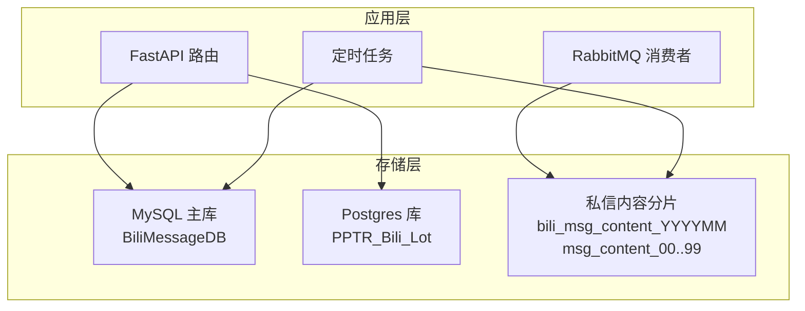
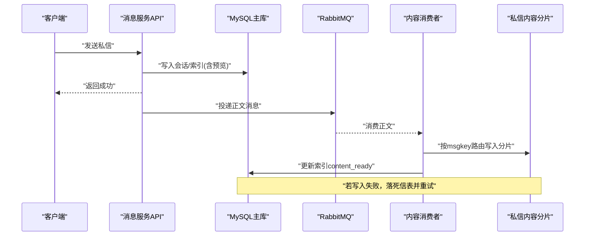
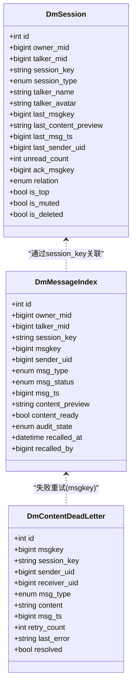
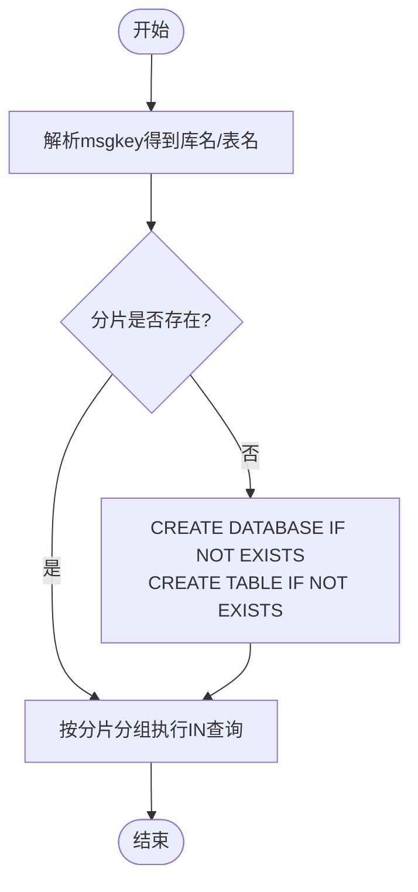
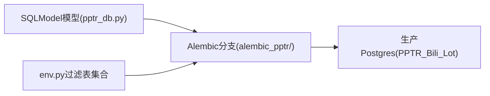
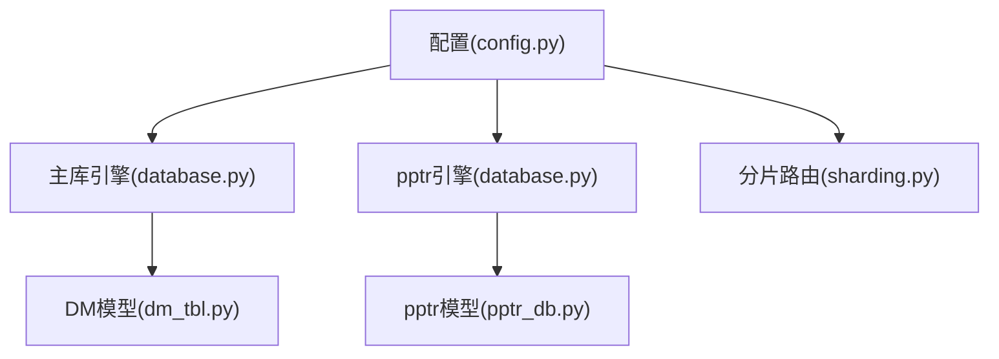

# 数据库设计

<cite>
**本文引用的文件**
- [be-message-service/app/core/database.py](file://be-message-service/app/core/database.py)
- [be-message-service/app/core/config.py](file://be-message-service/app/core/config.py)
- [be-message-service/app/core/sharding.py](file://be-message-service/app/core/sharding.py)
- [be-message-service/app/models/db/dm_tbl.py](file://be-message-service/app/models/db/dm_tbl.py)
- [be-message-service/app/models/pptr_db.py](file://be-message-service/app/models/pptr_db.py)
- [be-message-service/alembic_pptr/env.py](file://be-message-service/alembic_pptr/env.py)
- [be-message-service/alembic_pptr/versions/20260810_1030-fda501cc07b2_init_pptr_production_baseline.py](file://be-message-service/alembic_pptr/versions/20260810_1030-fda501cc07b2_init_pptr_production_baseline.py)
- [be-message-service/alembic_pptr/versions/20260810_1031-d366ed68066f_sync_models_to_production.py](file://be-message-service/alembic_pptr/versions/20260810_1031-d366ed68066f_sync_models_to_production.py)
- [be-message-service/README.md](file://be-message-service/README.md)
</cite>

## 目录
1. [简介](#简介)
2. [项目结构](#项目结构)
3. [核心组件](#核心组件)
4. [架构总览](#架构总览)
5. [详细组件分析](#详细组件分析)
6. [依赖关系分析](#依赖关系分析)
7. [性能考量](#性能考量)
8. [故障排查指南](#故障排查指南)
9. [结论](#结论)
10. [附录](#附录)

## 简介
本文件面向消息系统的数据库设计与实现，重点说明主库（MySQL）与 pptr Postgres 只读库的分工、私信内容的月度分库分表方案、数据迁移策略、索引与约束、查询模式与缓存策略，以及初始化脚本、迁移文件说明和备份恢复建议。

## 项目结构
消息系统使用双库架构：
- MySQL 主库（BiliMessageDB）：承载系统通知、事件提醒、私信索引与会话、设置等元数据；由 SQLModel + Alembic 管理版本。
- Postgres（PPTR_Bili_Lot）：原为 be-gateway 的 pptr 库，现被 be-message 彻底接管（可读可写），通过独立 Alembic 分支 alembic_pptr/ 管理演进。

图表来源
- [be-message-service/app/core/database.py:28-46](file://be-message-service/app/core/database.py#L28-L46)
- [be-message-service/app/core/database.py:86-120](file://be-message-service/app/core/database.py#L86-L120)
- [be-message-service/app/core/sharding.py:151-171](file://be-message-service/app/core/sharding.py#L151-L171)

章节来源
- [be-message-service/app/core/database.py:1-202](file://be-message-service/app/core/database.py#L1-L202)
- [be-message-service/app/core/config.py:41-74](file://be-message-service/app/core/config.py#L41-L74)

## 核心组件
- 主库引擎与会话：提供异步连接池、隔离级别、自动建库与健康检查。
- pptr Postgres 引擎与会话：独立连接池，供 be-message 读写 pptr 用户相关表。
- 私信分片路由：基于 msgkey 解析出月度库与库内分表，懒创建并预热。
- 模型定义：主库 DM 会话/索引/死信表；pptr 用户信息、等级、VIP、行为日志等。

章节来源
- [be-message-service/app/core/database.py:28-120](file://be-message-service/app/core/database.py#L28-L120)
- [be-message-service/app/core/sharding.py:33-130](file://be-message-service/app/core/sharding.py#L33-L130)
- [be-message-service/app/models/db/dm_tbl.py:36-178](file://be-message-service/app/models/db/dm_tbl.py#L36-L178)
- [be-message-service/app/models/pptr_db.py:34-290](file://be-message-service/app/models/pptr_db.py#L34-L290)

## 架构总览
消息写入采用“写扩散 + 冷热分离”：
- 写路径：发送接口快速落主库索引与会话，正文投递到 MQ，由消费者异步写入对应分片。
- 读路径：先查主库索引，若内容未就绪则用摘要兜底；内容就绪后按 msgkey 批量定位分片读取。
- 失败补偿：内容写入失败进入死信表，定时任务重试直至成功。

图表来源
- [be-message-service/app/models/db/dm_tbl.py:94-148](file://be-message-service/app/models/db/dm_tbl.py#L94-L148)
- [be-message-service/app/core/sharding.py:181-199](file://be-message-service/app/core/sharding.py#L181-L199)
- [be-message-service/README.md:52-68](file://be-message-service/README.md#L52-L68)

## 详细组件分析

### 主库（MySQL）数据模型与索引
- 私信会话表（msg_dm_session）
  - 主键：自增 id
  - 唯一约束：owner_mid + talker_mid
  - 索引：owner_mid, is_deleted, last_msg_ts；talker_mid；session_key；last_msg_ts；relation
  - 用途：会话列表展示、未读数、置顶、免打扰、最后消息快照
- 私信索引表（msg_dm_index）
  - 主键：自增 id
  - 唯一约束：owner_mid + msgkey
  - 索引：owner_mid, talker_mid, msgkey；msg_status；msg_ts；content_ready；audit_state
  - 用途：聊天记录翻页、状态管理、审核状态、内容就绪标记
- 私信内容死信表（msg_dm_content_dlq）
  - 主键：自增 id
  - 唯一约束：msgkey
  - 索引：msgkey；retry_count；resolved
  - 用途：异步落库失败的重试队列

图表来源
- [be-message-service/app/models/db/dm_tbl.py:36-178](file://be-message-service/app/models/db/dm_tbl.py#L36-L178)

章节来源
- [be-message-service/app/models/db/dm_tbl.py:36-178](file://be-message-service/app/models/db/dm_tbl.py#L36-L178)

### 私信内容分库分表（月度库 + 库内100表）
- 路由规则
  - 库名：{dm_content_db_prefix}_{YYYYMM}，由 msgkey 内嵌时间戳解析
  - 表名：{dm_content_table_prefix}_{00..99}，由 msgkey % 100 决定
  - 全限定名：`库名`.`表名`，可直接拼入 SQL
- 懒创建与预热
  - 首次写入时按需创建库与表，进程级缓存已创建的分片
  - 启动时可预热当月全部 100 张表，避免首条写入 DDL 延迟
- 读取优化
  - 将一批 msgkey 按物理分片分组，每个分片一条 IN 查询，最多 N 次查询命中 N 张表

图表来源
- [be-message-service/app/core/sharding.py:106-130](file://be-message-service/app/core/sharding.py#L106-L130)
- [be-message-service/app/core/sharding.py:151-199](file://be-message-service/app/core/sharding.py#L151-L199)

章节来源
- [be-message-service/app/core/sharding.py:106-199](file://be-message-service/app/core/sharding.py#L106-L199)
- [be-message-service/README.md:52-68](file://be-message-service/README.md#L52-L68)

### pptr Postgres 数据模型与迁移
- 模型范围
  - 用户主数据：TUserInfo、TUserDetail、TUserLevel、TUserVip（拍平为独立表）
  - 行为与记录：TUserActInfoLog、TUserExpRecord、TUserNameRecord、TUserPwdRecord
- 迁移策略
  - 基线迁移：以生产库真实结构为准，不做变更
  - 同步迁移：补建缺失对象、清理孤儿表，确保代码模型与生产一致
  - 仅纳管 pptr 表：Alembic env 中通过 __tablename__ 白名单过滤，避免误管 MySQL 元数据

图表来源
- [be-message-service/app/models/pptr_db.py:34-290](file://be-message-service/app/models/pptr_db.py#L34-L290)
- [be-message-service/alembic_pptr/env.py:33-65](file://be-message-service/alembic_pptr/env.py#L33-L65)
- [be-message-service/alembic_pptr/versions/20260810_1030-fda501cc07b2_init_pptr_production_baseline.py:22-25](file://be-message-service/alembic_pptr/versions/20260810_1030-fda501cc07b2_init_pptr_production_baseline.py#L22-L25)
- [be-message-service/alembic_pptr/versions/20260810_1031-d366ed68066f_sync_models_to_production.py:22-66](file://be-message-service/alembic_pptr/versions/20260810_1031-d366ed68066f_sync_models_to_production.py#L22-L66)

章节来源
- [be-message-service/app/models/pptr_db.py:34-290](file://be-message-service/app/models/pptr_db.py#L34-L290)
- [be-message-service/alembic_pptr/env.py:33-65](file://be-message-service/alembic_pptr/env.py#L33-L65)
- [be-message-service/alembic_pptr/versions/20260810_1030-fda501cc07b2_init_pptr_production_baseline.py:1-30](file://be-message-service/alembic_pptr/versions/20260810_1030-fda501cc07b2_init_pptr_production_baseline.py#L1-L30)
- [be-message-service/alembic_pptr/versions/20260810_1031-d366ed68066f_sync_models_to_production.py:1-73](file://be-message-service/alembic_pptr/versions/20260810_1031-d366ed68066f_sync_models_to_production.py#L1-L73)

### 数据模型关系与查询模式
- 关系
  - 会话与索引通过 session_key 关联；索引行包含 msgkey、sender/receiver、类型、状态、时间戳、审核状态等
  - 内容分片表以 msgkey 为主键，附带 session_key、sender/receiver、类型、内容、时间戳
  - 死信表以 msgkey 唯一，用于重试补偿
- 查询模式
  - 会话列表：按 owner_mid + last_msg_ts 倒序
  - 聊天记录：按 owner_mid + talker_mid + msgkey 倒序分页
  - 内容读取：按 msgkey 批量点查分片，未就绪时用 content_preview 兜底

章节来源
- [be-message-service/app/models/db/dm_tbl.py:36-178](file://be-message-service/app/models/db/dm_tbl.py#L36-L178)
- [be-message-service/app/core/sharding.py:132-141](file://be-message-service/app/core/sharding.py#L132-L141)

### 缓存策略
- 当前实现未引入 Redis 作为缓存层，所有数据直接落 MySQL；热点数据可通过应用层内存缓存或前端轮询（心跳）降低压力。
- 对于私信内容读取，建议在应用层对高频会话/消息做短期缓存，注意失效策略与一致性。

章节来源
- [be-message-service/app/core/database.py:1-12](file://be-message-service/app/core/database.py#L1-L12)

## 依赖关系分析
- 配置依赖
  - MySQL 连接串、连接池参数、私信分库分表前缀与数量
  - Postgres 连接串、schema、连接池参数
- 运行时依赖
  - 主库引擎负责会话与事务；pptr 引擎独立管理用户相关数据
  - 分片路由依赖 msgkey 生成器与配置项

图表来源
- [be-message-service/app/core/config.py:41-74](file://be-message-service/app/core/config.py#L41-L74)
- [be-message-service/app/core/database.py:28-120](file://be-message-service/app/core/database.py#L28-L120)
- [be-message-service/app/core/sharding.py:33-130](file://be-message-service/app/core/sharding.py#L33-L130)

章节来源
- [be-message-service/app/core/config.py:41-74](file://be-message-service/app/core/config.py#L41-L74)
- [be-message-service/app/core/database.py:28-120](file://be-message-service/app/core/database.py#L28-L120)
- [be-message-service/app/core/sharding.py:33-130](file://be-message-service/app/core/sharding.py#L33-L130)

## 性能考量
- 隔离级别：主库使用 READ COMMITTED，降低高并发插入死锁概率。
- 连接池：合理设置 pool_size、max_overflow、pool_recycle，避免连接耗尽。
- 分片策略：月度库 + 库内100表，均匀分散写入压力，历史库可归档降配。
- 异步化：正文异步落库，发送接口 RT 不受内容长度影响；失败走死信重试。
- 懒创建：分片按需创建，减少元数据开销；支持启动预热当月分片。

章节来源
- [be-message-service/app/core/database.py:28-46](file://be-message-service/app/core/database.py#L28-L46)
- [be-message-service/app/core/sharding.py:181-217](file://be-message-service/app/core/sharding.py#L181-L217)
- [be-message-service/README.md:52-68](file://be-message-service/README.md#L52-L68)

## 故障排查指南
- 连接测试
  - 主库连通性：test_connection()
  - pptr Postgres 连通性：test_pptr_connection()
- 常见问题
  - 主库不存在：ensure_database() 自动创建
  - 分片未就绪：懒创建机制会在首次写入时创建库与表
  - 内容写入失败：检查死信表 msg_dm_content_dlq，确认重试任务是否执行
- 迁移问题
  - Alembic 自动迁移开关：ALEMBIC_AUTO_MIGRATE
  - pptr 迁移仅纳管 pptr 表，避免误改 MySQL 元数据

章节来源
- [be-message-service/app/core/database.py:123-183](file://be-message-service/app/core/database.py#L123-L183)
- [be-message-service/alembic_pptr/env.py:33-65](file://be-message-service/alembic_pptr/env.py#L33-L65)
- [be-message-service/README.md:94-121](file://be-message-service/README.md#L94-L121)

## 结论
本设计通过主库与 pptr Postgres 的职责分离、私信内容的月度分库分表与异步化写入，实现了高吞吐、低延迟的消息系统。结合严格的索引与约束、死信重试机制、懒创建与预热策略，兼顾了可扩展性与运维友好性。后续可在应用层引入缓存进一步提升热点读取性能。

## 附录

### 数据表字段定义与约束（摘要）
- 私信会话（msg_dm_session）
  - 主键：id
  - 唯一：owner_mid + talker_mid
  - 索引：owner_mid, is_deleted, last_msg_ts；talker_mid；session_key；last_msg_ts；relation
- 私信索引（msg_dm_index）
  - 主键：id
  - 唯一：owner_mid + msgkey
  - 索引：owner_mid, talker_mid, msgkey；msg_status；msg_ts；content_ready；audit_state
- 私信内容分片（各月度库中的 msg_content_XX）
  - 主键：msgkey
  - 索引：session_key, msgkey
- 私信内容死信（msg_dm_content_dlq）
  - 主键：id
  - 唯一：msgkey
  - 索引：msgkey；retry_count；resolved

章节来源
- [be-message-service/app/models/db/dm_tbl.py:36-178](file://be-message-service/app/models/db/dm_tbl.py#L36-L178)
- [be-message-service/app/core/sharding.py:157-171](file://be-message-service/app/core/sharding.py#L157-L171)

### 初始化脚本与迁移说明
- 主库初始化
  - ensure_database()：容器启动时自动创建 BiliMessageDB
  - Alembic：自动升级至 head（可配置 ALEMBIC_AUTO_MIGRATE）
- pptr Postgres 迁移
  - 基线迁移：以生产库结构为准，不变更
  - 同步迁移：补建缺失对象、清理孤儿表
  - 环境过滤：仅纳管 pptr 表，避免误管 MySQL 元数据

章节来源
- [be-message-service/app/core/database.py:123-183](file://be-message-service/app/core/database.py#L123-L183)
- [be-message-service/alembic_pptr/versions/20260810_1030-fda501cc07b2_init_pptr_production_baseline.py:22-25](file://be-message-service/alembic_pptr/versions/20260810_1030-fda501cc07b2_init_pptr_production_baseline.py#L22-L25)
- [be-message-service/alembic_pptr/versions/20260810_1031-d366ed68066f_sync_models_to_production.py:22-66](file://be-message-service/alembic_pptr/versions/20260810_1031-d366ed68066f_sync_models_to_production.py#L22-L66)
- [be-message-service/alembic_pptr/env.py:33-65](file://be-message-service/alembic_pptr/env.py#L33-L65)

### 备份恢复方案（建议）
- 主库（MySQL）
  - 定期逻辑备份（mysqldump）与物理备份（XtraBackup）
  - 保留最近 N 天增量日志，支持时间点恢复
- pptr Postgres
  - 定期 pg_dump 逻辑备份，配合 WAL 归档实现时间点恢复
- 私信内容分片
  - 按月库为单位进行备份与归档；历史库可降级存储或离线归档
  - 恢复时按库名恢复，再校验分片完整性

[本节为通用建议，不直接引用具体代码文件]