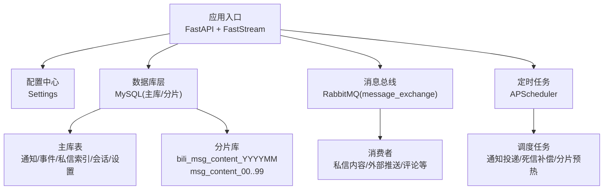
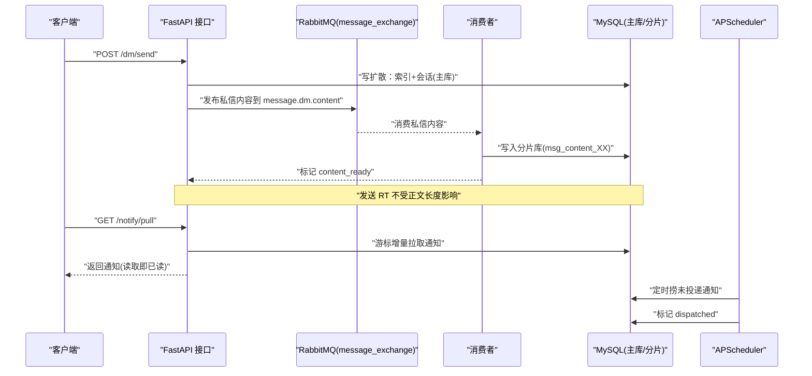
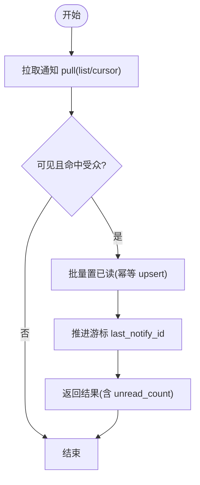
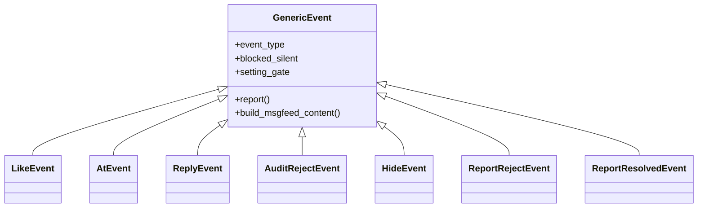
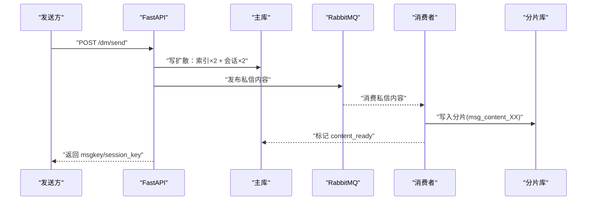
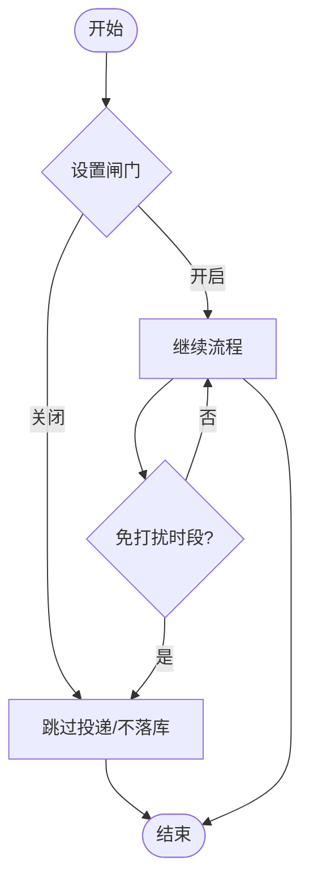
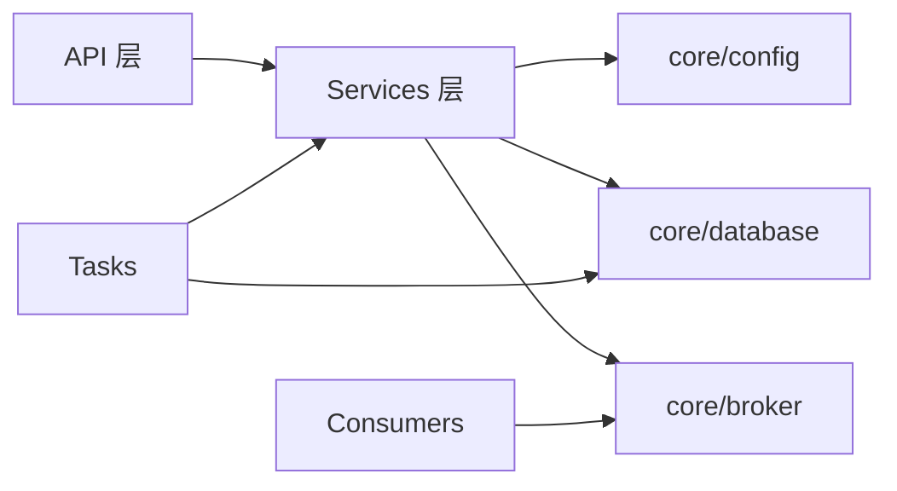

# 服务架构设计

<cite>
**本文引用的文件**
- [be-message-service/README.md](file://be-message-service/README.md)
- [be-message-service/pyproject.toml](file://be-message-service/pyproject.toml)
- [be-message-service/app/core/broker.py](file://be-message-service/app/core/broker.py)
- [be-message-service/app/core/config.py](file://be-message-service/app/core/config.py)
- [be-message-service/app/core/database.py](file://be-message-service/app/core/database.py)
- [be-message-service/app/services/message/insite/notify.py](file://be-message-service/app/services/message/insite/notify.py)
- [be-message-service/app/services/message/insite/events/handlers.py](file://be-message-service/app/services/message/insite/events/handlers.py)
- [be-message-service/app/services/message/dm/dm.py](file://be-message-service/app/services/message/dm/dm.py)
- [be-message-service/app/services/message/insite/setting.py](file://be-message-service/app/services/message/insite/setting.py)
</cite>

## 目录
1. [简介](#简介)
2. [项目结构](#项目结构)
3. [核心组件](#核心组件)
4. [架构总览](#架构总览)
5. [详细组件分析](#详细组件分析)
6. [依赖关系分析](#依赖关系分析)
7. [性能考量](#性能考量)
8. [故障排查指南](#故障排查指南)
9. [结论](#结论)
10. [附录](#附录)

## 简介
本文件为消息推送服务的架构设计文档，聚焦基于 FastAPI + FastStream(RabbitMQ) 的微服务实现。服务承载站内四大消息模块（系统通知、事件提醒、私信、消息设置），并集中接管站外推送能力。存储仅使用 MySQL，不依赖 Redis；私信正文采用按月分库与库内分表策略，通过 MQ 异步落库，保障写路径高性能与最终一致性。

## 项目结构
- 技术栈：FastAPI、FastStream(RabbitMQ)、SQLModel/Alembic、APScheduler、Loguru
- 持久化：MySQL（主库用于索引与会话等元数据；私信内容按月分库+库内分表）
- 消息中间件：RabbitMQ（统一 topic exchange，按 routing_key 分流到独立队列）
- 启动链路：依赖自检 → 自动建库 → Alembic 迁移 → 分片预热 → 启动消费者 → 启动定时任务

**图表来源**
- [be-message-service/app/core/broker.py:1-125](file://be-message-service/app/core/broker.py#L1-L125)
- [be-message-service/app/core/config.py:1-375](file://be-message-service/app/core/config.py#L1-L375)
- [be-message-service/app/core/database.py:1-202](file://be-message-service/app/core/database.py#L1-L202)
- [be-message-service/README.md:125-142](file://be-message-service/README.md#L125-L142)

**章节来源**
- [be-message-service/README.md:1-142](file://be-message-service/README.md#L1-L142)
- [be-message-service/pyproject.toml:1-85](file://be-message-service/pyproject.toml#L1-L85)

## 核心组件
- 消息路由与队列定义：统一 topic exchange，按 routing_key 隔离不同业务队列，避免耦合与争抢
- 配置管理：集中化管理 RabbitMQ、MySQL、分片、日志级别、推送渠道等运行时参数
- 数据库连接与会话：异步引擎、连接池、自动建库、健康探测
- 四大业务模块：
  - 系统通知：读扩散，游标增量拉取，读取即已读
  - 事件提醒：写扩散，聚合展示，幂等去重
  - 私信：写扩散，索引在主线，正文异步落分片，死信补偿
  - 消息设置：全局闸门，免打扰时段控制
- 外部推送：独立于站内信的站外提醒通道，支持多第三方渠道

**章节来源**
- [be-message-service/app/core/broker.py:1-125](file://be-message-service/app/core/broker.py#L1-L125)
- [be-message-service/app/core/config.py:1-375](file://be-message-service/app/core/config.py#L1-L375)
- [be-message-service/app/core/database.py:1-202](file://be-message-service/app/core/database.py#L1-L202)
- [be-message-service/app/services/message/insite/notify.py:1-668](file://be-message-service/app/services/message/insite/notify.py#L1-L668)
- [be-message-service/app/services/message/insite/events/handlers.py:1-102](file://be-message-service/app/services/message/insite/events/handlers.py#L1-L102)
- [be-message-service/app/services/message/dm/dm.py:1-800](file://be-message-service/app/services/message/dm/dm.py#L1-L800)
- [be-message-service/app/services/message/insite/setting.py:1-155](file://be-message-service/app/services/message/insite/setting.py#L1-L155)

## 架构总览
- 请求入口：HTTP API（FastAPI）与 RPC（RabbitMQ RPC）
- 消息总线：message_exchange（topic），routing_key 区分站内信与外部推送、私信内容、评论相关等
- 存储层：主库（元数据）、分片库（私信正文）
- 调度层：APScheduler 负责通知投递、死信补偿、分片预热
- 横切关注点：健康检查、错误处理、日志记录、免打扰与设置闸门

**图表来源**
- [be-message-service/app/core/broker.py:1-125](file://be-message-service/app/core/broker.py#L1-L125)
- [be-message-service/app/services/message/dm/dm.py:1-800](file://be-message-service/app/services/message/dm/dm.py#L1-L800)
- [be-message-service/app/services/message/insite/notify.py:1-668](file://be-message-service/app/services/message/insite/notify.py#L1-L668)
- [be-message-service/README.md:125-142](file://be-message-service/README.md#L125-L142)

## 详细组件分析

### 系统通知（读扩散）
- 设计要点：
  - 通知本体全站一份，用户侧维护游标与已读状态
  - 拉取接口推进游标，重复调用不会重复
  - 读取即已读：pull/list/system 返回前批量置已读
  - 管理员可发布/修改/撤回/列表查询
- 关键流程：
  - 目标受众过滤：ALL/ROLE/LEVEL/VIP/CUSTOM
  - 可见性条件：已发布、生效时间、未过期
  - 定时投递：fetch_dispatchable → mark_dispatched

**图表来源**
- [be-message-service/app/services/message/insite/notify.py:347-415](file://be-message-service/app/services/message/insite/notify.py#L347-L415)
- [be-message-service/app/services/message/insite/notify.py:499-532](file://be-message-service/app/services/message/insite/notify.py#L499-L532)

**章节来源**
- [be-message-service/app/services/message/insite/notify.py:1-668](file://be-message-service/app/services/message/insite/notify.py#L1-L668)

### 事件提醒（写扩散）
- 设计要点：
  - 写扩散：按接收者落行，idx_event_group 聚合展示
  - 幂等：dedup_key 唯一约束
  - 处理器注册：新增类型只需声明 event_type/blocked_silent/setting_gate
- 关键流程：
  - 上报事件 → 设置闸门 → 落库（事件提醒）
  - 聚合列表与明细查询

**图表来源**
- [be-message-service/app/services/message/insite/events/handlers.py:18-102](file://be-message-service/app/services/message/insite/events/handlers.py#L18-L102)

**章节来源**
- [be-message-service/app/services/message/insite/events/handlers.py:1-102](file://be-message-service/app/services/message/insite/events/handlers.py#L1-L102)

### 私信（写扩散 + 内容异步化）
- 设计要点：
  - 写扩散：索引与会话在主库，正文异步落分片
  - 摘要兜底：content_preview + content_ready 保证可读性
  - 失败补偿：死信表 + 定时重试
  - 撤回：时间窗内物理清除分片正文
- 关键流程：
  - 发送：陌生人过滤 → 生成 msgkey → 写索引/会话 → 异步正文 → 活跃心跳
  - 读取：索引分页 → 批量回捞正文 → 摘要兜底
  - 撤回：更新双方索引 → 清理分片正文

**图表来源**
- [be-message-service/app/services/message/dm/dm.py:253-361](file://be-message-service/app/services/message/dm/dm.py#L253-L361)
- [be-message-service/app/services/message/dm/dm.py:476-577](file://be-message-service/app/services/message/dm/dm.py#L476-L577)
- [be-message-service/app/services/message/dm/dm.py:596-651](file://be-message-service/app/services/message/dm/dm.py#L596-L651)

**章节来源**
- [be-message-service/app/services/message/dm/dm.py:1-800](file://be-message-service/app/services/message/dm/dm.py#L1-L800)

### 消息设置（闸门与免打扰）
- 设计要点：
  - 第一道闸门：事件上报、私信投递、通知推送前先查开关
  - 免打扰时段：can_push_now 判定当前是否允许推送
  - 默认值：首次访问按全部开启自动初始化
- 关键流程：
  - 获取/更新设置
  - 接受事件/陌生人私信/系统通知判断
  - 批量确保设置存在

**图表来源**
- [be-message-service/app/services/message/insite/setting.py:89-131](file://be-message-service/app/services/message/insite/setting.py#L89-L131)

**章节来源**
- [be-message-service/app/services/message/insite/setting.py:1-155](file://be-message-service/app/services/message/insite/setting.py#L1-L155)

### 服务间通信机制与消息路由策略
- 统一 exchange：message_exchange（topic）
- routing_key 与队列映射：
  - message.push → message_queue（外部渠道推送）
  - message.dm.content → message_dm_content_queue（私信内容异步落库）
  - 评论相关：comment.notify / comment.audit / comment.count
  - 用户注销：user.deactivate
  - 浏览统计：interaction.view
- 解耦原则：站内信与外部推送物理隔离，避免相互影响

**章节来源**
- [be-message-service/app/core/broker.py:1-125](file://be-message-service/app/core/broker.py#L1-L125)

### 分库分表设计（私信正文）
- 路由键：msgkey（内嵌毫秒时间戳的雪花 ID）
- 库名：{dm_content_db_prefix}_{YYYYMM}
- 表名：{dm_content_table_prefix}_{00..99}
- 特性：
  - 主库只存索引与会话（轻量）
  - 正文经 MQ 异步落分片，RT 不受正文长度与 DDL 影响
  - 分片库由运行时懒创建，预创建下月分表
  - 失败落死信表，定时任务重试补偿

**章节来源**
- [be-message-service/README.md:52-68](file://be-message-service/README.md#L52-L68)
- [be-message-service/app/core/config.py:41-52](file://be-message-service/app/core/config.py#L41-L52)

## 依赖关系分析
- 强依赖：RabbitMQ、MySQL（启动自检失败退出）
- 弱依赖：外部推送渠道（仅告警不阻断主流程）
- 内部依赖：
  - API 层依赖 services 层
  - services 层依赖 core（config/database/broker）
  - consumers 依赖 broker 与 services
  - tasks 依赖 database 与 services

**图表来源**
- [be-message-service/app/core/config.py:1-375](file://be-message-service/app/core/config.py#L1-L375)
- [be-message-service/app/core/database.py:1-202](file://be-message-service/app/core/database.py#L1-L202)
- [be-message-service/app/core/broker.py:1-125](file://be-message-service/app/core/broker.py#L1-L125)

**章节来源**
- [be-message-service/app/core/config.py:1-375](file://be-message-service/app/core/config.py#L1-L375)
- [be-message-service/app/core/database.py:1-202](file://be-message-service/app/core/database.py#L1-L202)
- [be-message-service/app/core/broker.py:1-125](file://be-message-service/app/core/broker.py#L1-L125)

## 性能考量
- 隔离队列：私信内容与外部推送分离，避免互相拖慢
- 写扩散优化：私信索引与会话原子 upsert，减少并发冲突
- 异步正文：MQ 异步落分片，提升发送接口 RT
- 连接池：MySQL 连接池大小与回收周期合理配置，防止 Too many connections
- 隔离级别：READ COMMITTED 降低高并发插入死锁概率
- 游标与摘要：通知游标增量拉取，私信摘要兜底，减少不必要负载

**章节来源**
- [be-message-service/app/core/database.py:28-46](file://be-message-service/app/core/database.py#L28-L46)
- [be-message-service/app/services/message/dm/dm.py:94-107](file://be-message-service/app/services/message/dm/dm.py#L94-L107)
- [be-message-service/app/services/message/dm/dm.py:253-361](file://be-message-service/app/services/message/dm/dm.py#L253-L361)

## 故障排查指南
- 健康检查：/health 返回 204（存活且 broker 连通）或 503（broker 未连）
- 依赖自检：启动时检测 RabbitMQ 与 MySQL 连通性，失败则退出
- 死信补偿：私信正文写入失败进入死信表，定时任务重试
- 日志级别：生产默认 WARNING，开发可设为 DEBUG；FastStream 日志级别独立配置
- 常见运维动作：暂停后台任务、关闭自动迁移、手动执行迁移

**章节来源**
- [be-message-service/README.md:109-121](file://be-message-service/README.md#L109-L121)
- [be-message-service/app/core/config.py:19-34](file://be-message-service/app/core/config.py#L19-L34)
- [be-message-service/app/core/database.py:123-172](file://be-message-service/app/core/database.py#L123-L172)

## 结论
该消息推送服务以 FastAPI + FastStream(RabbitMQ) 为核心，结合 MySQL 主库与分片库，实现了高可用、高性能的消息系统。四大模块职责清晰，读写路径优化到位，具备完善的错误处理、日志记录与健康检查机制。通过 MQ 异步化与分库分表设计，有效提升了系统扩展性与稳定性。

## 附录
- 环境变量说明：SCHEDULER_ENABLED、ALEMBIC_AUTO_MIGRATE、MYSQL_MESSAGE_URL、RABBITMQ_URL、MESSAGE_CONFIG 等
- 测试覆盖：通知游标去重、事件聚合与幂等、私信写扩散与撤回、设置闸门与免打扰、活跃度与未读汇总

**章节来源**
- [be-message-service/README.md:94-121](file://be-message-service/README.md#L94-L121)
- [be-message-service/README.md:166-181](file://be-message-service/README.md#L166-L181)