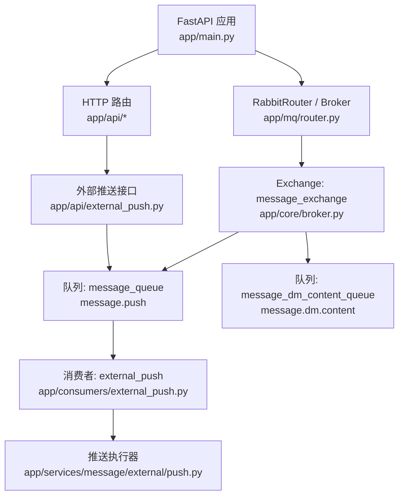
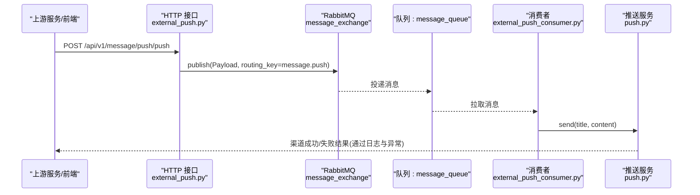
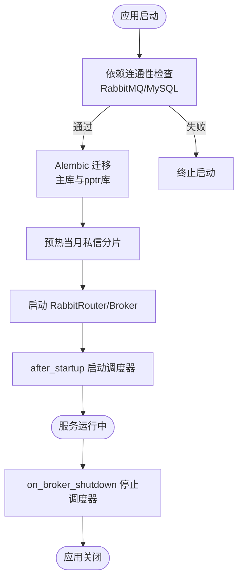
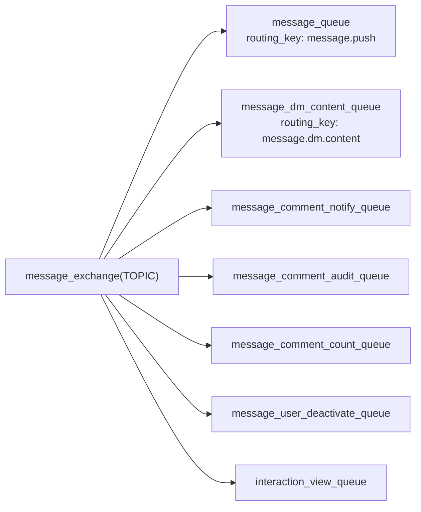
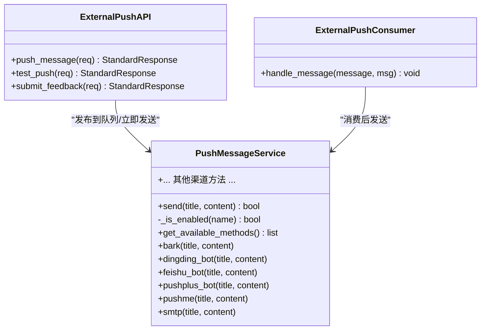
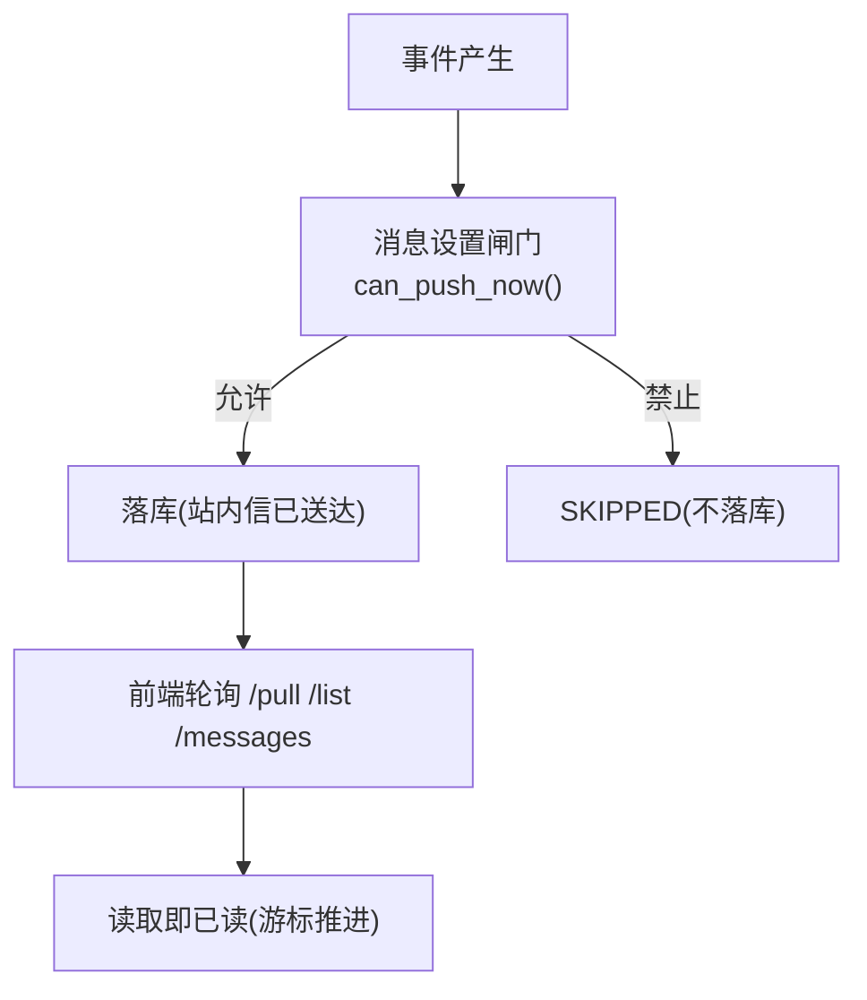
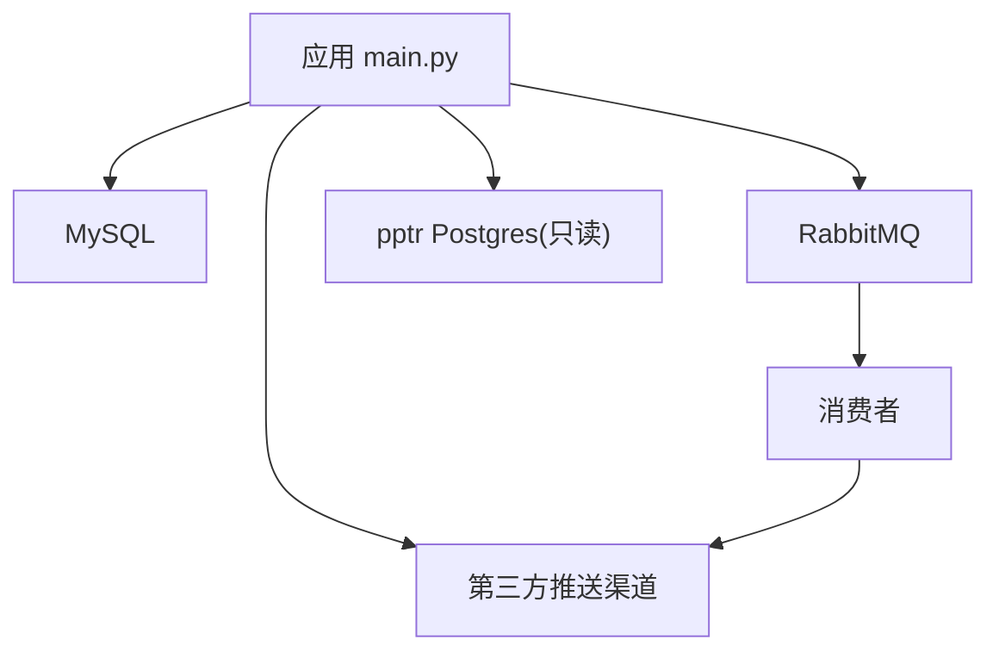

# 消息推送服务 (be-message-service)

<cite>
**本文引用的文件**
- [README.md](file://be-message-service/README.md)
- [main.py](file://be-message-service/app/main.py)
- [broker.py](file://be-message-service/app/core/broker.py)
- [router.py](file://be-message-service/app/mq/router.py)
- [external_push.py](file://be-message-service/app/api/external_push.py)
- [push.py](file://be-message-service/app/services/message/external/push.py)
- [external_push_consumer.py](file://be-message-service/app/consumers/external_push.py)
</cite>

## 目录
1. [简介](#简介)
2. [项目结构](#项目结构)
3. [核心组件](#核心组件)
4. [架构总览](#架构总览)
5. [详细组件分析](#详细组件分析)
6. [依赖关系分析](#依赖关系分析)
7. [性能与可扩展性](#性能与可扩展性)
8. [故障排查指南](#故障排查指南)
9. [结论](#结论)
10. [附录：API 与模型规范](#附录api-与模型规范)

## 简介
be-message-service 是统一消息系统微服务，基于 FastAPI + FastStream(RabbitMQ) + SQLModel + Alembic + APScheduler，承载站内四大消息模块（系统通知、事件提醒、私信、消息设置），并集中接管站外提醒的第三方推送能力。站内信通过数据库写路径保证送达；站外提醒通过 RabbitMQ 异步分发到多种渠道（PushMe、PushPlus、邮箱、钉钉、飞书等）。

## 项目结构
- 入口与生命周期管理：FastAPI 应用启动时进行依赖连通性检查、数据库迁移、分片预热、Broker 启动与定时任务调度。
- MQ 基础设施：统一的 TOPIC exchange 与 routing_key 定义，消费者与发布者共享 broker 实例。
- HTTP 接口：按模块划分路由（notify、event、dm、setting、msg_feed、push 等）。
- 业务服务：站内消息处理与外部渠道推送实现分离，外部渠道统一由 PushMessageService 管理降级策略。
- 消费者：基于 FastStream 的 RabbitMQ 消费者，采用手动 ACK，失败不确认以触发重投或死信。

**图表来源**
- [main.py:172-215](file://be-message-service/app/main.py#L172-L215)
- [router.py:22-56](file://be-message-service/app/mq/router.py#L22-L56)
- [broker.py:25-103](file://be-message-service/app/core/broker.py#L25-L103)
- [external_push.py:36-66](file://be-message-service/app/api/external_push.py#L36-L66)
- [external_push_consumer.py:16-35](file://be-message-service/app/consumers/external_push.py#L16-L35)
- [push.py:664-708](file://be-message-service/app/services/message/external/push.py#L664-L708)

**章节来源**
- [README.md:1-30](file://be-message-service/README.md#L1-L30)
- [main.py:1-20](file://be-message-service/app/main.py#L1-L20)

## 核心组件
- 应用生命周期：健康检查、Alembic 迁移、分片预热、Broker 启动、定时任务钩子。
- MQ 路由与队列：TOPIC exchange 与多个独立队列，按 routing_key 分流。
- 外部推送：统一推送服务，支持多通道降级发送，失败记录日志并上报。
- 消费者：消费 message.push 队列，合并配置后调用推送服务。

**章节来源**
- [main.py:84-158](file://be-message-service/app/main.py#L84-L158)
- [router.py:39-53](file://be-message-service/app/mq/router.py#L39-L53)
- [broker.py:41-103](file://be-message-service/app/core/broker.py#L41-L103)
- [external_push_consumer.py:16-35](file://be-message-service/app/consumers/external_push.py#L16-L35)
- [push.py:628-708](file://be-message-service/app/services/message/external/push.py#L628-L708)

## 架构总览
服务采用“REST 入队 + 消费者出队”的解耦模式：上游通过 HTTP 将推送请求投递至 RabbitMQ，消费者异步分发到各渠道；站内信走数据库写扩散/读扩散，不经过第三方推送。

**图表来源**
- [external_push.py:36-66](file://be-message-service/app/api/external_push.py#L36-L66)
- [broker.py:57-69](file://be-message-service/app/core/broker.py#L57-L69)
- [external_push_consumer.py:16-35](file://be-message-service/app/consumers/external_push.py#L16-L35)
- [push.py:664-708](file://be-message-service/app/services/message/external/push.py#L664-L708)

## 详细组件分析

### 应用启动与生命周期
- 关键依赖自检：RabbitMQ 与 MySQL 为强依赖，失败直接终止启动；第三方推送端点为弱依赖，仅告警。
- 自动迁移与分片预热：Alembic 升级主库与 pptr 用户库；预热当月私信内容分表。
- 定时任务钩子：在 broker 启动后启动调度器，关闭前停止调度器。

**图表来源**
- [main.py:84-158](file://be-message-service/app/main.py#L84-L158)
- [main.py:172-215](file://be-message-service/app/main.py#L172-L215)
- [router.py:39-53](file://be-message-service/app/mq/router.py#L39-L53)

**章节来源**
- [main.py:84-158](file://be-message-service/app/main.py#L84-L158)
- [main.py:172-215](file://be-message-service/app/main.py#L172-L215)
- [router.py:39-53](file://be-message-service/app/mq/router.py#L39-L53)

### RabbitMQ 集成与路由策略
- Exchange：TOPIC 类型，名称 message_exchange，持久化。
- Routing Key：
  - message.push → message_queue（外部渠道推送）
  - message.dm.content → message_dm_content_queue（私信正文异步落库）
  - 其他预留键用于评论审核、计数、用户注销、浏览统计等。
- 消费者使用 AckPolicy.MANUAL，异常不 ack 以触发重投或死信。

**图表来源**
- [broker.py:34-103](file://be-message-service/app/core/broker.py#L34-L103)

**章节来源**
- [broker.py:25-103](file://be-message-service/app/core/broker.py#L25-L103)

### 多渠道推送系统实现
- 统一推送服务：PushMessageService 封装所有渠道实现，失败抛异常供上层降级。
- 降级顺序：优先 pushme、pushplus_bot、smtp，再依次尝试其余渠道。
- 配置合并：消息内 config 优先，否则回落全局环境变量配置。
- 消费者行为：推送失败不重投，记录 CRITICAL 日志并丢弃消息，避免无限重试。

**图表来源**
- [push.py:160-708](file://be-message-service/app/services/message/external/push.py#L160-L708)
- [external_push_consumer.py:16-35](file://be-message-service/app/consumers/external_push.py#L16-L35)
- [external_push.py:36-162](file://be-message-service/app/api/external_push.py#L36-L162)

**章节来源**
- [push.py:60-83](file://be-message-service/app/services/message/external/push.py#L60-L83)
- [push.py:628-708](file://be-message-service/app/services/message/external/push.py#L628-L708)
- [external_push_consumer.py:16-35](file://be-message-service/app/consumers/external_push.py#L16-L35)
- [external_push.py:36-162](file://be-message-service/app/api/external_push.py#L36-L162)

### 站内消息与私信处理机制
- 系统通知：读扩散，按游标增量拉取，天然去重。
- 事件提醒：写扩散，按接收者落行，聚合展示与幂等控制。
- 私信：写扩散，索引与会话在主库，正文经 MQ 异步写入月度分库分表；撤回与删除逻辑保障数据一致性。
- 消息设置：闸门控制上报/投递/推送，免打扰时段跳过落库。

**图表来源**
- [README.md:22-48](file://be-message-service/README.md#L22-L48)

**章节来源**
- [README.md:11-68](file://be-message-service/README.md#L11-L68)

### 定时任务与运维开关
- 调度任务：通知投递、死信补偿、分片预热。
- 运维开关：SCHEDULER_ENABLED、ALEMBIC_AUTO_MIGRATE、MESSAGE_CONFIG 等。
- 健康检查：/health 返回 204 表示存活且 broker 连通。

**章节来源**
- [README.md:84-121](file://be-message-service/README.md#L84-L121)
- [main.py:227-239](file://be-message-service/app/main.py#L227-L239)

## 依赖关系分析
- 强依赖：RabbitMQ、MySQL；连接失败拒绝启动。
- 弱依赖：第三方推送端点、pptr Postgres 只读连接；失败仅告警或降级。
- 内部耦合：HTTP 接口与消费者共享 broker/exchange/queue 定义，避免绑定不一致。

**图表来源**
- [main.py:84-158](file://be-message-service/app/main.py#L84-L158)
- [broker.py:25-103](file://be-message-service/app/core/broker.py#L25-L103)

**章节来源**
- [main.py:84-158](file://be-message-service/app/main.py#L84-L158)
- [broker.py:25-103](file://be-message-service/app/core/broker.py#L25-L103)

## 性能与可扩展性
- 站内信读扩散降低写放大，事件/私信写扩散优化读路径。
- 私信正文异步落库，避免长正文影响发送 RT；分库分表提升扩展性。
- MQ 消费者手动 ACK，失败重投与死信补偿保证最终一致。
- 推送渠道降级链提高成功率，失败快速失败并记录日志。

[本节提供通用指导，无需特定文件引用]

## 故障排查指南
- 健康检查：访问 /health，204 表示存活且 broker 连通；503 表示 broker 未连。
- 启动失败：检查 RabbitMQ 与 MySQL 连通性；查看关键依赖失败日志。
- 推送失败：查看消费者日志中的【彻底推送失败】信息，确认渠道配置与网络可达性。
- 定时任务：可通过 SCHEDULER_ENABLED=false 暂停后台任务进行排障。

**章节来源**
- [main.py:227-239](file://be-message-service/app/main.py#L227-L239)
- [push.py:704-708](file://be-message-service/app/services/message/external/push.py#L704-L708)
- [README.md:109-121](file://be-message-service/README.md#L109-L121)

## 结论
be-message-service 通过清晰的职责划分与解耦设计，实现了站内信与站外提醒的双通道能力。基于 FastStream 的 MQ 集成确保了高可靠的消息流转；多渠道推送的统一抽象提升了可维护性与扩展性。配合完善的启动流程、定时任务与运维开关，服务具备良好的可观测性与可运维性。

[本节总结性内容，无需特定文件引用]

## 附录：API 与模型规范
- 推送相关接口：
  - POST /api/v1/message/push/push：投递推送到队列
  - POST /api/v1/message/push/test：立即发送测试推送
  - POST /api/v1/message/push/feedback：提交用户反馈
- 模型说明：
  - PushMessagePayload：包含 title、content、push_type、config
  - StandardResponse：统一返回码结构 {code, data, msg}
- 认证：微服务间完全互信，不做令牌校验；用户信息由网关注入的请求头解析。

**章节来源**
- [external_push.py:36-162](file://be-message-service/app/api/external_push.py#L36-L162)
- [README.md:184-277](file://be-message-service/README.md#L184-L277)