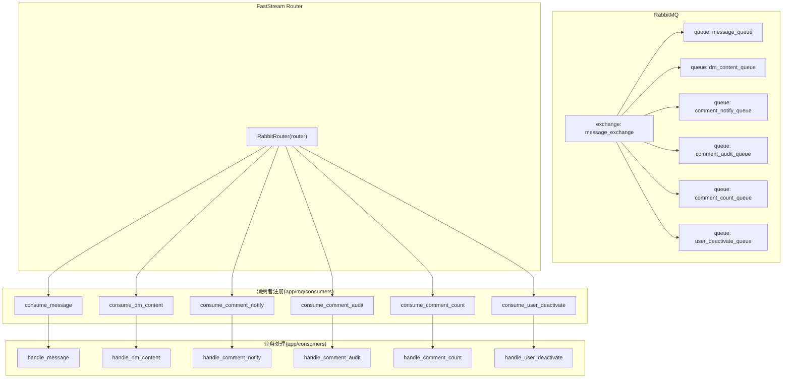
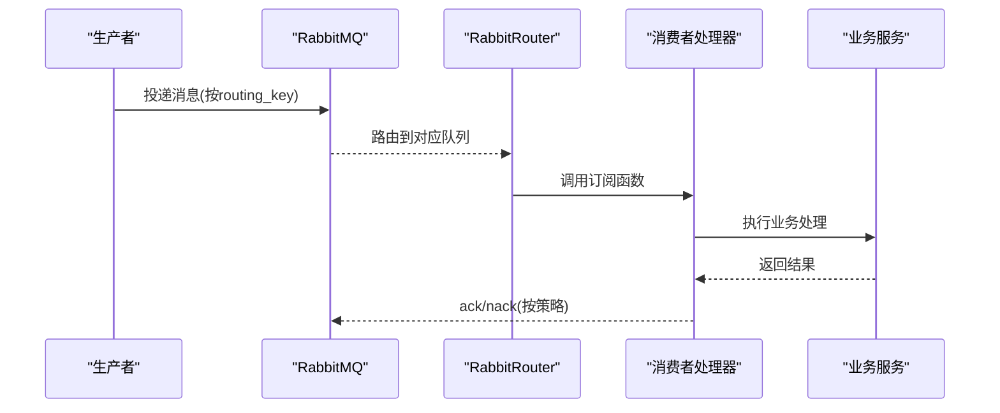
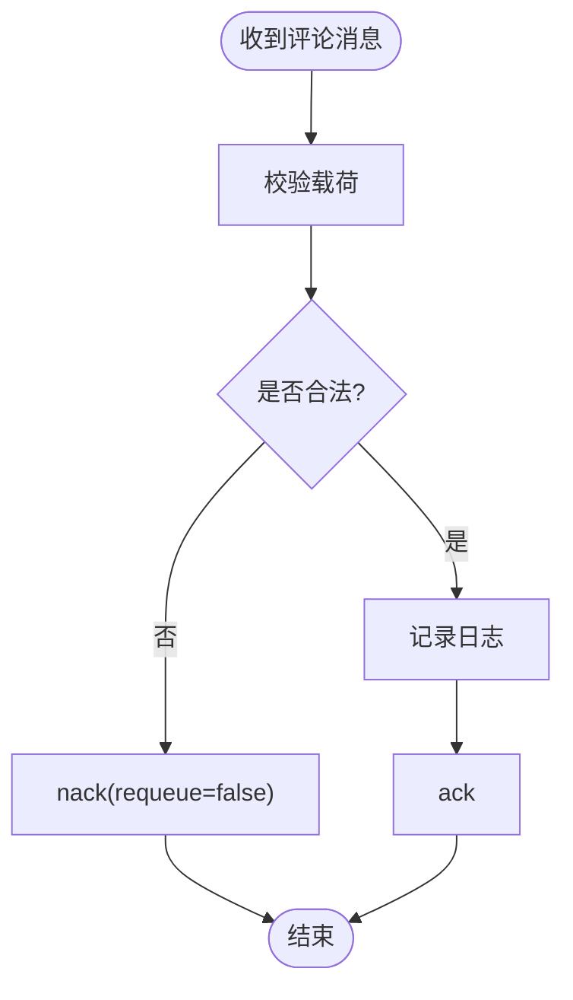
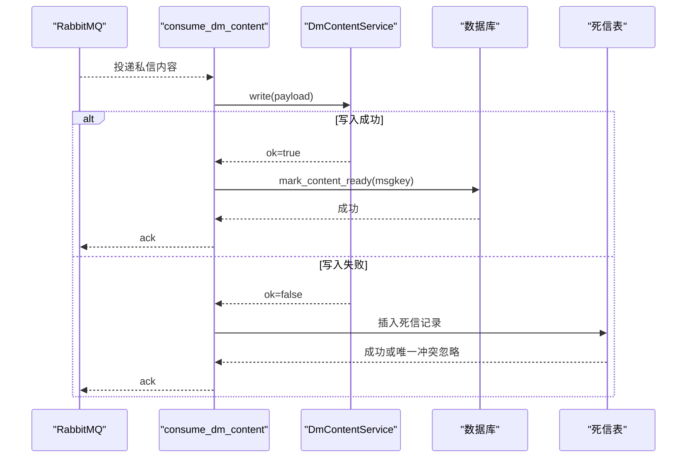
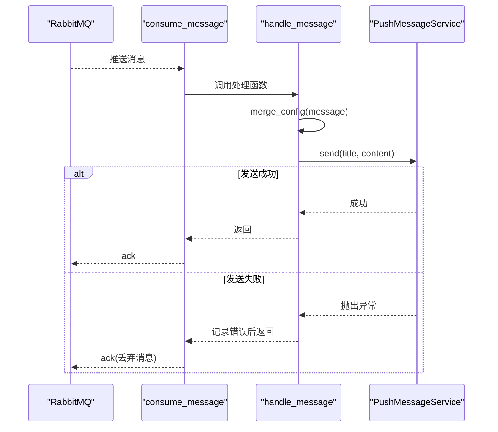
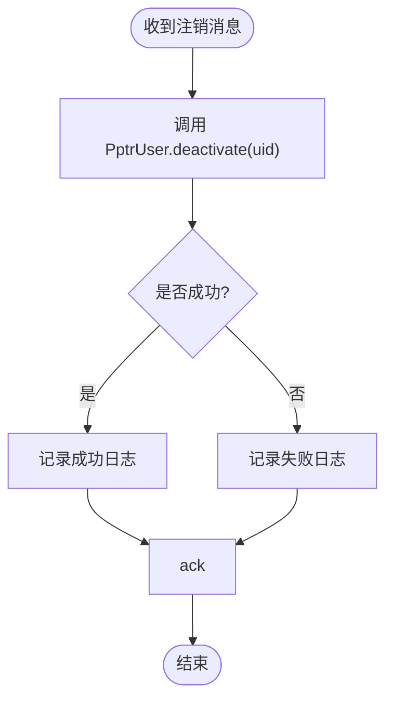
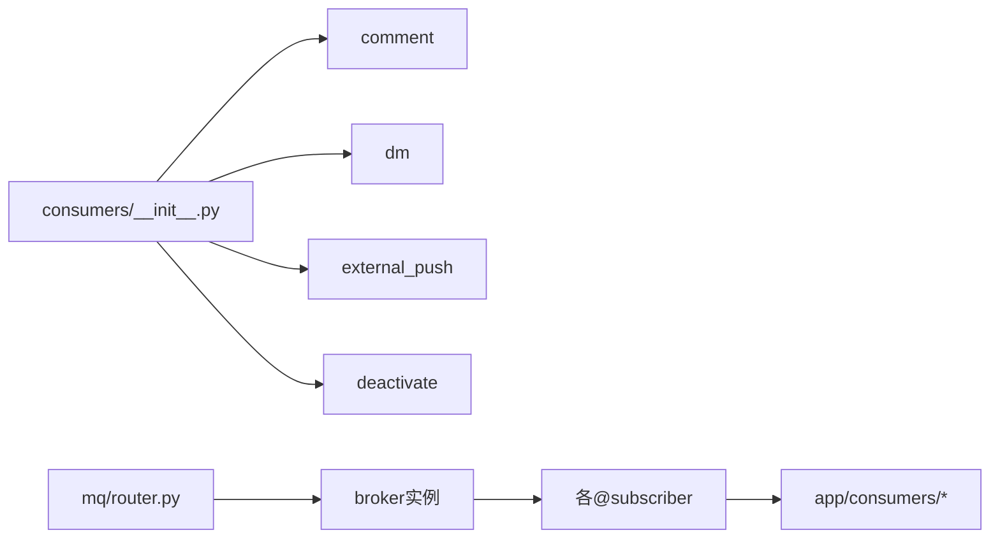

# 消息消费者实现

<cite>
**本文引用的文件**
- [app/consumers/__init__.py](file://be-message-service/app/consumers/__init__.py)
- [app/consumers/comment.py](file://be-message-service/app/consumers/comment.py)
- [app/consumers/dm.py](file://be-message-service/app/consumers/dm.py)
- [app/consumers/external_push.py](file://be-message-service/app/consumers/external_push.py)
- [app/consumers/deactivate.py](file://be-message-service/app/consumers/deactivate.py)
- [app/mq/router.py](file://be-message-service/app/mq/router.py)
- [app/mq/consumers/__init__.py](file://be-message-service/app/mq/consumers/__init__.py)
- [app/mq/consumers/comment.py](file://be-message-service/app/mq/consumers/comment.py)
- [app/mq/consumers/dm.py](file://be-message-service/app/mq/consumers/dm.py)
- [app/mq/consumers/external_push.py](file://be-message-service/app/mq/consumers/external_push.py)
- [app/mq/consumers/deactivate.py](file://be-message-service/app/mq/consumers/deactivate.py)
</cite>

## 目录
1. [简介](#简介)
2. [项目结构](#项目结构)
3. [核心组件](#核心组件)
4. [架构总览](#架构总览)
5. [详细组件分析](#详细组件分析)
6. [依赖关系分析](#依赖关系分析)
7. [性能考量](#性能考量)
8. [故障排查指南](#故障排查指南)
9. [结论](#结论)
10. [附录](#附录)

## 简介
本文件面向消息服务（message-service）中的各类消息消费者，系统性说明其业务职责、处理流程与可靠性保障。覆盖以下消费器：
- 评论消费器：评论通知、异步审核、计数削峰与补偿
- 私信消费器：内容落库与索引更新、失败转死信
- 外部推送消费器：多渠道推送（PushMe/PushPlus 等），失败丢弃不重投
- 用户注销消费器：异步执行完整删除流程

同时文档化消息生命周期（接收、校验、业务处理、持久化、错误处理）、幂等性保证、重试策略、死信队列、消费者注册机制、性能优化建议与监控指标，并提供调试方法。

## 项目结构
消息消费者采用“注册层 + 处理层”的解耦设计：
- 注册层位于 app/mq/consumers/*，负责将路由与队列绑定，使用 FastStream 的 @router.subscriber 装饰器完成消费者注册
- 处理层位于 app/consumers/*，承载具体业务逻辑
- 统一入口通过 app/mq/consumers/__init__.py 导入各模块触发副作用式注册
- RabbitMQ 路由与生命周期由 app/mq/router.py 管理

图表来源
- [app/mq/router.py:30-36](file://be-message-service/app/mq/router.py#L30-L36)
- [app/mq/consumers/external_push.py:20-27](file://be-message-service/app/mq/consumers/external_push.py#L20-L27)
- [app/mq/consumers/dm.py:17-24](file://be-message-service/app/mq/consumers/dm.py#L17-L24)
- [app/mq/consumers/comment.py:30-57](file://be-message-service/app/mq/consumers/comment.py#L30-L57)
- [app/mq/consumers/deactivate.py:17-26](file://be-message-service/app/mq/consumers/deactivate.py#L17-L26)

章节来源
- [app/mq/router.py:1-57](file://be-message-service/app/mq/router.py#L1-L57)
- [app/mq/consumers/__init__.py:1-26](file://be-message-service/app/mq/consumers/__init__.py#L1-L26)

## 核心组件
- 评论消费器：提供三个独立队列用于解耦与补偿，分别处理通知、审核、计数
- 私信消费器：将私信正文写入分库分表，成功则标记内容就绪，失败则入死信表
- 外部推送消费器：组装渠道配置并调用推送服务，失败即丢弃，不重投
- 用户注销消费器：异步执行物理删除与业务数据清理，幂等且失败不阻塞

章节来源
- [app/consumers/comment.py:1-67](file://be-message-service/app/consumers/comment.py#L1-L67)
- [app/consumers/dm.py:1-54](file://be-message-service/app/consumers/dm.py#L1-L54)
- [app/consumers/external_push.py:1-35](file://be-message-service/app/consumers/external_push.py#L1-L35)
- [app/consumers/deactivate.py:1-33](file://be-message-service/app/consumers/deactivate.py#L1-L33)

## 架构总览
整体采用事件驱动架构：生产者将消息投递到指定队列，消费者订阅对应队列并按业务逻辑处理；不同业务域通过 routing_key 区分。Broker 生命周期由 Router 统一管理，启动时连接 MQ，停止时优雅关闭。

图表来源
- [app/mq/router.py:30-36](file://be-message-service/app/mq/router.py#L30-L36)
- [app/mq/consumers/external_push.py:20-27](file://be-message-service/app/mq/consumers/external_push.py#L20-L27)
- [app/mq/consumers/dm.py:17-24](file://be-message-service/app/mq/consumers/dm.py#L17-L24)
- [app/mq/consumers/comment.py:30-57](file://be-message-service/app/mq/consumers/comment.py#L30-L57)
- [app/mq/consumers/deactivate.py:17-26](file://be-message-service/app/mq/consumers/deactivate.py#L17-L26)

## 详细组件分析

### 评论消费器（通知、审核、计数）
- 职责
  - 通知：作为主流程之外的备用通道，确保重复投递不刷屏（基于 dedup_key 幂等）
  - 审核：异步复审任务，弱依赖，失败不阻塞
  - 计数：楼层发号与计数削峰、写倾斜补偿
- 处理流程
  - 接收消息 -> 参数校验 -> 记录日志 -> ack/nack
- 可靠性
  - MANUAL ack，防御式 ack/nack
  - 当前无生产者投递，保持空闲，避免与同步路径重复副作用

图表来源
- [app/consumers/comment.py:21-37](file://be-message-service/app/consumers/comment.py#L21-L37)
- [app/consumers/comment.py:40-48](file://be-message-service/app/consumers/comment.py#L40-L48)
- [app/consumers/comment.py:51-59](file://be-message-service/app/consumers/comment.py#L51-L59)
- [app/mq/consumers/comment.py:30-57](file://be-message-service/app/mq/consumers/comment.py#L30-L57)

章节来源
- [app/consumers/comment.py:1-67](file://be-message-service/app/consumers/comment.py#L1-L67)
- [app/mq/consumers/comment.py:1-58](file://be-message-service/app/mq/consumers/comment.py#L1-L58)

### 私信消费器（内容落库）
- 职责
  - 将私信正文写入月度分库分表
  - 成功后回写索引行 content_ready
  - 失败写入死信表，避免坏消息无限重投
- 处理流程
  - 接收消息 -> 写入分片 -> 成功则标记就绪 / 失败则入死信 -> ack
- 可靠性
  - 失败不 requeue，转入死信表由定时任务补偿
  - 唯一索引冲突时忽略重复死信写入

图表来源
- [app/consumers/dm.py:24-50](file://be-message-service/app/consumers/dm.py#L24-L50)
- [app/mq/consumers/dm.py:17-24](file://be-message-service/app/mq/consumers/dm.py#L17-L24)

章节来源
- [app/consumers/dm.py:1-54](file://be-message-service/app/consumers/dm.py#L1-L54)
- [app/mq/consumers/dm.py:1-25](file://be-message-service/app/mq/consumers/dm.py#L1-L25)

### 外部推送消费器（多渠道推送）
- 职责
  - 消费 message.push 请求，构造渠道配置并调用推送服务发送
- 处理流程
  - 接收消息 -> 合并配置 -> 调用 PushMessageService.send -> 异常捕获并记录日志 -> 正常返回（ACK）
- 可靠性
  - ACK 策略：消费即 ack，失败不重投，避免反复推送直至死信
  - 站外提醒属尽力而为，失败不补

图表来源
- [app/consumers/external_push.py:16-35](file://be-message-service/app/consumers/external_push.py#L16-L35)
- [app/mq/consumers/external_push.py:20-27](file://be-message-service/app/mq/consumers/external_push.py#L20-L27)

章节来源
- [app/consumers/external_push.py:1-35](file://be-message-service/app/consumers/external_push.py#L1-L35)
- [app/mq/consumers/external_push.py:1-28](file://be-message-service/app/mq/consumers/external_push.py#L1-L28)

### 用户注销消费器（异步删除）
- 职责
  - 消费注销消息，执行完整删除流程（pptr 四表物理删除 + be-message 业务数据清除）
- 处理流程
  - 接收消息 -> 调用 PptrUser.deactivate() -> 记录日志 -> ack
- 可靠性
  - 幂等操作，失败不 requeue，避免坏消息无限打转

图表来源
- [app/consumers/deactivate.py:20-29](file://be-message-service/app/consumers/deactivate.py#L20-L29)
- [app/mq/consumers/deactivate.py:17-26](file://be-message-service/app/mq/consumers/deactivate.py#L17-L26)

章节来源
- [app/consumers/deactivate.py:1-33](file://be-message-service/app/consumers/deactivate.py#L1-L33)
- [app/mq/consumers/deactivate.py:1-27](file://be-message-service/app/mq/consumers/deactivate.py#L1-L27)

## 依赖关系分析
- 注册依赖
  - app/mq/consumers/__init__.py 统一导入各消费者模块，触发副作用式注册
  - app/mq/router.py 创建 RabbitRouter 与 broker，管理生命周期与钩子
- 运行时依赖
  - 各消费者依赖 app/core/broker 提供的队列与交换器定义
  - 业务处理依赖各自的服务模块（如 DmContentService、PushMessageService、PptrUser）

图表来源
- [app/mq/consumers/__init__.py:11-17](file://be-message-service/app/mq/consumers/__init__.py#L11-L17)
- [app/mq/router.py:30-36](file://be-message-service/app/mq/router.py#L30-L36)

章节来源
- [app/mq/consumers/__init__.py:1-26](file://be-message-service/app/mq/consumers/__init__.py#L1-L26)
- [app/mq/router.py:1-57](file://be-message-service/app/mq/router.py#L1-L57)

## 性能考量
- 队列隔离：私信落库与外部推送分离，避免相互影响
- 手动确认：关键路径使用 MANUAL ack，精确控制确认时机
- 失败快速失败：外部推送失败直接丢弃，减少队列堆积
- 死信补偿：私信写入失败入死信表，由定时任务补偿，避免阻塞
- 幂等设计：评论通知基于 dedup_key 防重，注销操作幂等
- 资源复用：单一 broker 实例供发布/RPC/健康检查共用，降低连接开销

[本节为通用指导，无需特定文件引用]

## 故障排查指南
- 常见问题定位
  - 推送失败：查看消费者日志中“推送消费失败”的记录，确认渠道配置与网络状态
  - 私信写入失败：检查死信表是否有新增记录，核对分库分表路由键与索引行更新
  - 评论任务未生效：确认队列是否被正确订阅，检查 handler 内日志输出
  - 注销失败：查看“注销失败”日志，确认下游删除接口可用性与幂等性
- 调试方法
  - 启用 FastStream 日志级别：通过 router 的 log_level 调整框架日志
  - 观察 ack/nack：在消费者内部增加更细粒度日志，确认确认时机
  - 检查队列积压：通过 MQ 控制台观察队列长度与消费速率
  - 模拟消息：向对应队列投递测试消息，验证端到端链路

章节来源
- [app/consumers/external_push.py:16-35](file://be-message-service/app/consumers/external_push.py#L16-L35)
- [app/consumers/dm.py:24-50](file://be-message-service/app/consumers/dm.py#L24-L50)
- [app/consumers/comment.py:21-59](file://be-message-service/app/consumers/comment.py#L21-L59)
- [app/consumers/deactivate.py:20-29](file://be-message-service/app/consumers/deactivate.py#L20-L29)
- [app/mq/router.py:30-36](file://be-message-service/app/mq/router.py#L30-L36)

## 结论
该消息消费者体系通过清晰的职责划分与可靠的可靠性保障，实现了高内聚、低耦合的事件处理能力。评论、私信、推送、注销四大消费器分别承担不同业务域，配合 MANUAL ack、死信补偿、幂等设计与失败快速失败策略，确保系统在峰值与异常场景下的稳定性与可维护性。

[本节为总结性内容，无需特定文件引用]

## 附录
- 消费者注册机制
  - 通过 app/mq/consumers/__init__.py 统一导入，触发副作用式注册
  - 每个消费者模块使用 @router.subscriber 绑定队列与交换器
- 消息生命周期
  - 接收：RabbitRouter 从队列拉取消息
  - 验证：handler 内对载荷进行模型校验
  - 处理：调用相应服务完成业务逻辑
  - 持久化：写入数据库或外部系统
  - 确认：根据策略 ack/nack
- 幂等性与重试
  - 评论通知基于 dedup_key 防重
  - 注销操作幂等，失败不重投
  - 私信写入失败入死信表，由定时任务补偿
- 监控指标建议
  - 队列长度与消费速率
  - 消费者处理耗时分布
  - 失败率与死信表增长趋势
  - 外部推送成功率与渠道降级次数

[本节为补充信息，无需特定文件引用]