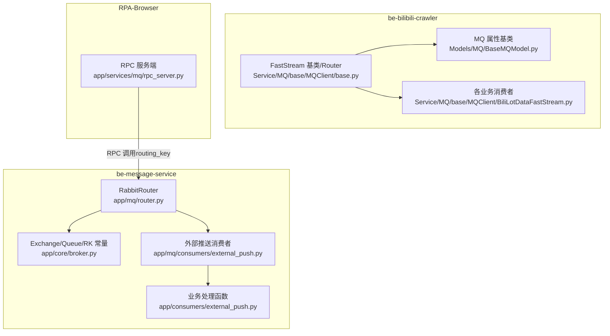
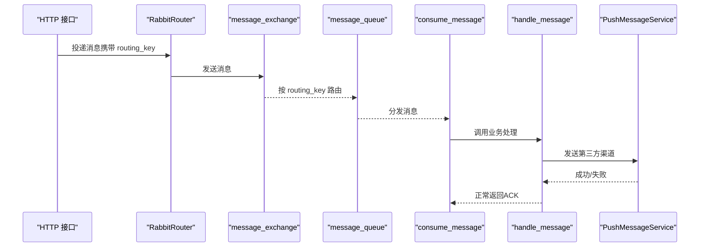
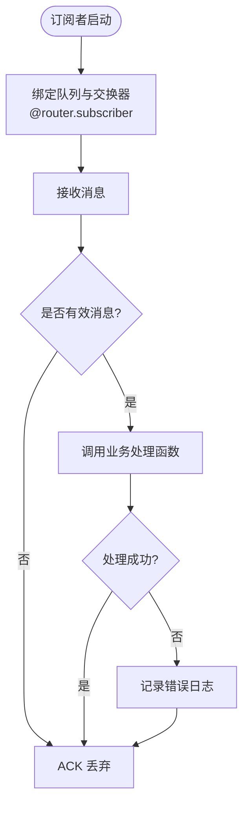
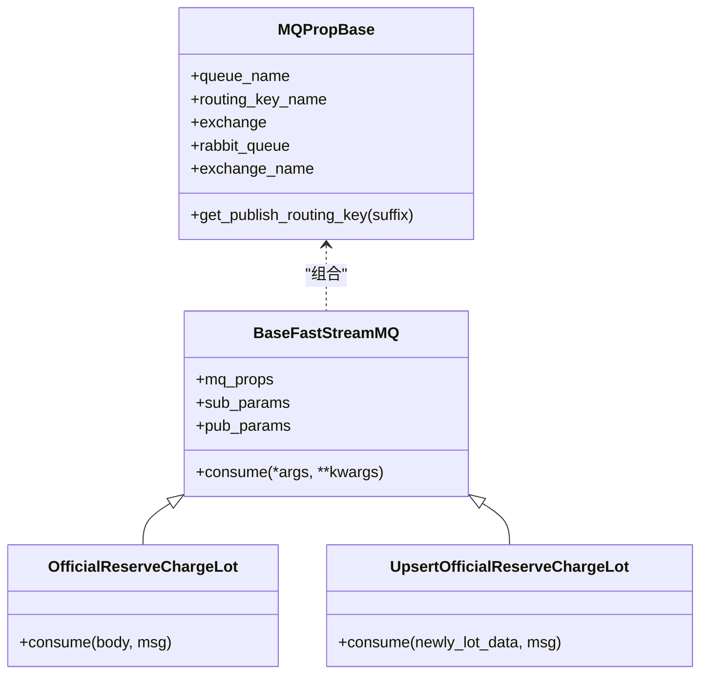
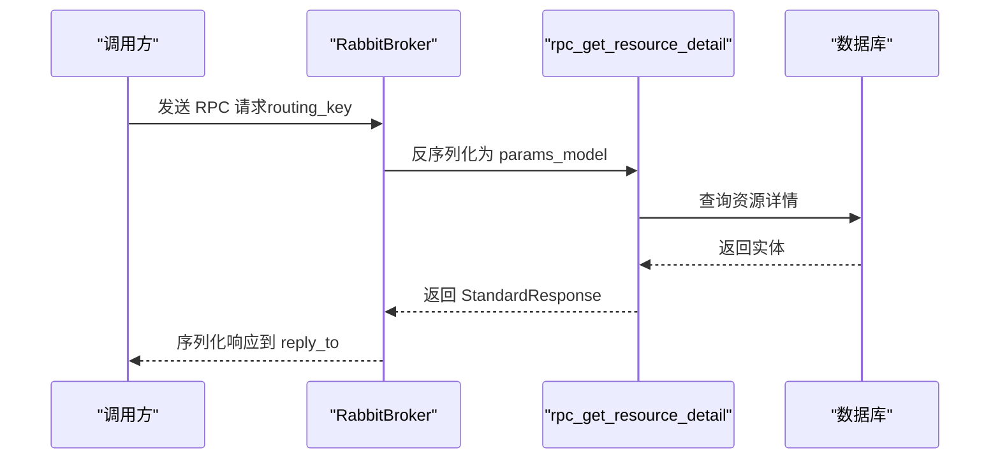
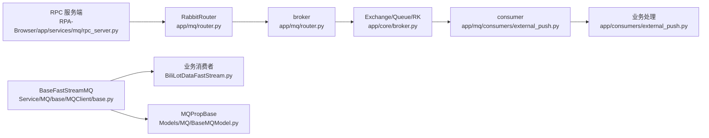

# 消息路由与分发

<cite>
**本文引用的文件**
- [app/core/broker.py](file://be-message-service/app/core/broker.py)
- [app/mq/router.py](file://be-message-service/app/mq/router.py)
- [app/mq/consumers/external_push.py](file://be-message-service/app/mq/consumers/external_push.py)
- [app/consumers/external_push.py](file://be-message-service/app/consumers/external_push.py)
- [Models/MQ/BaseMQModel.py](file://be-bilibili-crawler/Models/MQ/BaseMQModel.py)
- [Service/MQ/base/MQClient/base.py](file://be-bilibili-crawler/Service/MQ/base/MQClient/base.py)
- [Service/MQ/base/MQClient/BiliLotDataFastStream.py](file://be-bilibili-crawler/Service/MQ/base/MQClient/BiliLotDataFastStream.py)
- [RPA-Browser/app/services/mq/rpc_server.py](file://RPA-Browser/app/services/mq/rpc_server.py)
</cite>

## 目录
1. [简介](#简介)
2. [项目结构](#项目结构)
3. [核心组件](#核心组件)
4. [架构总览](#架构总览)
5. [详细组件分析](#详细组件分析)
6. [依赖关系分析](#依赖关系分析)
7. [性能考量](#性能考量)
8. [故障排查指南](#故障排查指南)
9. [结论](#结论)
10. [附录](#附录)

## 简介
本文件聚焦于仓库中的 FastStream 消息路由与分发机制，围绕以下目标展开：
- 路由器注册、消息分发与消费者绑定的实现方式
- routing_key 的路由规则、通配符匹配与优先级处理
- 消息序列化格式、版本兼容性与向后兼容性保证
- 负载均衡、故障转移与高可用机制
- 路由配置示例、调试方法与性能优化建议
- 消息流转图与错误处理策略

## 项目结构
本项目在两个服务中实现了基于 FastStream + RabbitMQ 的消息路由与分发：
- be-message-service：统一 broker/router，集中定义 exchange/queue/routing_key，并通过 @router.subscriber 注册消费者；HTTP 接口作为生产者投递消息。
- be-bilibili-crawler：以 MQPropBase 抽象队列与路由键，配合 BaseFastStreamMQ 提供统一的发布/消费基类；各业务消费者继承该基类实现具体逻辑。
- RPA-Browser：作为 RPC 服务端，使用 RabbitBroker 暴露 RPC 方法，供其他服务按 routing_key 同步调用。

图表来源
- [app/mq/router.py:1-57](file://be-message-service/app/mq/router.py#L1-L57)
- [app/core/broker.py:1-125](file://be-message-service/app/core/broker.py#L1-L125)
- [app/mq/consumers/external_push.py:1-28](file://be-message-service/app/mq/consumers/external_push.py#L1-L28)
- [app/consumers/external_push.py:1-35](file://be-message-service/app/consumers/external_push.py#L1-L35)
- [Models/MQ/BaseMQModel.py:1-74](file://be-bilibili-crawler/Models/MQ/BaseMQModel.py#L1-L74)
- [Service/MQ/base/MQClient/base.py:1-103](file://be-bilibili-crawler/Service/MQ/base/MQClient/base.py#L1-L103)
- [Service/MQ/base/MQClient/BiliLotDataFastStream.py:1-332](file://be-bilibili-crawler/Service/MQ/base/MQClient/BiliLotDataFastStream.py#L1-L332)
- [RPA-Browser/app/services/mq/rpc_server.py:1-156](file://RPA-Browser/app/services/mq/rpc_server.py#L1-L156)

章节来源
- [app/mq/router.py:1-57](file://be-message-service/app/mq/router.py#L1-L57)
- [app/core/broker.py:1-125](file://be-message-service/app/core/broker.py#L1-L125)

## 核心组件
- 统一 Broker/Router（be-message-service）
  - 通过 RabbitRouter 创建并管理 broker 生命周期，所有消费者集中在一个 router 下注册。
  - 共享单一 broker 实例，避免重复连接。
- Exchange/Queue/RoutingKey 集中定义（be-message-service）
  - 使用 TOPIC exchange，按 routing_key 分流到独立队列，确保不同业务解耦。
  - 明确列出各 routing_key 与队列用途，便于维护与审计。
- 消费者注册与处理（be-message-service）
  - 使用 @router.subscriber(queue=..., exchange=..., ack_policy=...) 绑定队列与交换器。
  - 业务处理函数位于 app/consumers/*，被 mq/consumers/* 的 subscriber 调用。
- MQ 属性与基类（be-bilibili-crawler）
  - MQPropBase 封装 queue_name、routing_key_name、exchange，并自动生成 RabbitQueue（支持通配符）。
  - BaseFastStreamMQ 提供 consume/pub_params/sub_params 的统一入口，简化消费者实现。
- RPC 服务端（RPA-Browser）
  - 使用 RabbitBroker 暴露 RPC 方法，按 routing_key 接收请求并返回标准响应。

章节来源
- [app/mq/router.py:1-57](file://be-message-service/app/mq/router.py#L1-L57)
- [app/core/broker.py:1-125](file://be-message-service/app/core/broker.py#L1-L125)
- [app/mq/consumers/external_push.py:1-28](file://be-message-service/app/mq/consumers/external_push.py#L1-L28)
- [app/consumers/external_push.py:1-35](file://be-message-service/app/consumers/external_push.py#L1-L35)
- [Models/MQ/BaseMQModel.py:1-74](file://be-bilibili-crawler/Models/MQ/BaseMQModel.py#L1-L74)
- [Service/MQ/base/MQClient/base.py:1-103](file://be-bilibili-crawler/Service/MQ/base/MQClient/base.py#L1-L103)
- [RPA-Browser/app/services/mq/rpc_server.py:1-156](file://RPA-Browser/app/services/mq/rpc_server.py#L1-L156)

## 架构总览
下图展示了 be-message-service 的外部推送链路：HTTP 接口投递消息到 message_exchange，按 routing_key=message.push 路由到 message_queue，再由 consumer 消费并分发到第三方渠道。

图表来源
- [app/mq/router.py:1-57](file://be-message-service/app/mq/router.py#L1-L57)
- [app/core/broker.py:1-125](file://be-message-service/app/core/broker.py#L1-L125)
- [app/mq/consumers/external_push.py:1-28](file://be-message-service/app/mq/consumers/external_push.py#L1-L28)
- [app/consumers/external_push.py:1-35](file://be-message-service/app/consumers/external_push.py#L1-L35)

## 详细组件分析

### be-message-service：统一路由与消费者绑定
- 路由注册
  - 通过 RabbitRouter 统一管理 broker 生命周期，并在 after_startup/on_broker_shutdown 钩子中启动/停止定时任务。
  - 所有消费者集中在 app/mq/consumers/*，使用 @router.subscriber 绑定 queue/exchange/ack_policy。
- 路由键与队列
  - 集中定义 message_exchange（TOPIC），以及多个 routing_key 与对应队列，如 message.push → message_queue。
  - 历史兼容：message_queue 保持精确匹配 message.push，避免误吞新增的 dm 等消息。
- 消费者处理
  - consume_message 仅负责从队列取消息并调用 handle_message，异常由业务层捕获并记录日志。
  - 推送失败不重投：采用 AckPolicy.ACK，消费即确认，避免死信堆积。

图表来源
- [app/mq/router.py:1-57](file://be-message-service/app/mq/router.py#L1-L57)
- [app/core/broker.py:1-125](file://be-message-service/app/core/broker.py#L1-L125)
- [app/mq/consumers/external_push.py:1-28](file://be-message-service/app/mq/consumers/external_push.py#L1-L28)
- [app/consumers/external_push.py:1-35](file://be-message-service/app/consumers/external_push.py#L1-L35)

章节来源
- [app/mq/router.py:1-57](file://be-message-service/app/mq/router.py#L1-L57)
- [app/core/broker.py:1-125](file://be-message-service/app/core/broker.py#L1-L125)
- [app/mq/consumers/external_push.py:1-28](file://be-message-service/app/mq/consumers/external_push.py#L1-L28)
- [app/consumers/external_push.py:1-35](file://be-message-service/app/consumers/external_push.py#L1-L35)

### be-bilibili-crawler：MQ 属性与消费者基类
- MQPropBase
  - 封装 queue_name、routing_key_name、exchange，并在初始化时生成 RabbitQueue，绑定模式为 base_key.#（通配符）。
  - 提供 get_publish_routing_key(suffix) 动态拼接完整 routing_key，便于扩展。
- BaseFastStreamMQ
  - 提供 sub_params（包含 queue/exchange/ack_policy）与 pub_params（显式指定 queue/exchange/routing_key）。
  - 子类只需实现 consume 方法，即可复用统一的发布/消费参数。
- 业务消费者
  - 各业务消费者继承 BaseFastStreamMQ，实现 consume 并调用 msg.ack() 或 msg.nack()。
  - 异常统一通过 handle_exception 记录日志并通知告警。

图表来源
- [Models/MQ/BaseMQModel.py:1-74](file://be-bilibili-crawler/Models/MQ/BaseMQModel.py#L1-L74)
- [Service/MQ/base/MQClient/base.py:1-103](file://be-bilibili-crawler/Service/MQ/base/MQClient/base.py#L1-L103)
- [Service/MQ/base/MQClient/BiliLotDataFastStream.py:1-332](file://be-bilibili-crawler/Service/MQ/base/MQClient/BiliLotDataFastStream.py#L1-L332)

章节来源
- [Models/MQ/BaseMQModel.py:1-74](file://be-bilibili-crawler/Models/MQ/BaseMQModel.py#L1-L74)
- [Service/MQ/base/MQClient/base.py:1-103](file://be-bilibili-crawler/Service/MQ/base/MQClient/base.py#L1-L103)
- [Service/MQ/base/MQClient/BiliLotDataFastStream.py:1-332](file://be-bilibili-crawler/Service/MQ/base/MQClient/BiliLotDataFastStream.py#L1-L332)

### RPA-Browser：RPC 服务端路由
- 使用 RabbitBroker 暴露 RPC 方法，按 routing_key_for(method) 接收请求。
- 处理器返回 StandardResponse，FastStream 自动序列化并发送到 reply_to。
- 异常通过 rpc_safe 包装，转换为 error_response 回包，避免客户端超时。

图表来源
- [RPA-Browser/app/services/mq/rpc_server.py:1-156](file://RPA-Browser/app/services/mq/rpc_server.py#L1-L156)

章节来源
- [RPA-Browser/app/services/mq/rpc_server.py:1-156](file://RPA-Browser/app/services/mq/rpc_server.py#L1-L156)

## 依赖关系分析
- be-message-service
  - router.py 依赖 core/config 与 tasks，创建 RabbitRouter 并管理 broker 生命周期。
  - consumers/external_push.py 依赖 core/broker 定义的 exchange/queue，以及业务处理函数。
- be-bilibili-crawler
  - BaseMQModel.py 定义 QueueName/ExchangeName/RoutingKey 与 MQPropBase。
  - MQClient/base.py 提供 BaseFastStreamMQ 与全局 router/broker。
  - BiliLotDataFastStream.py 实现各业务消费者，依赖 publisher_producer 进行消息转发。
- RPA-Browser
  - rpc_server.py 依赖 bili_common.rpc.* 定义路由键与模型，使用 RabbitBroker 暴露 RPC。

图表来源
- [app/mq/router.py:1-57](file://be-message-service/app/mq/router.py#L1-L57)
- [app/core/broker.py:1-125](file://be-message-service/app/core/broker.py#L1-L125)
- [app/mq/consumers/external_push.py:1-28](file://be-message-service/app/mq/consumers/external_push.py#L1-L28)
- [app/consumers/external_push.py:1-35](file://be-message-service/app/consumers/external_push.py#L1-L35)
- [Models/MQ/BaseMQModel.py:1-74](file://be-bilibili-crawler/Models/MQ/BaseMQModel.py#L1-L74)
- [Service/MQ/base/MQClient/base.py:1-103](file://be-bilibili-crawler/Service/MQ/base/MQClient/base.py#L1-L103)
- [Service/MQ/base/MQClient/BiliLotDataFastStream.py:1-332](file://be-bilibili-crawler/Service/MQ/base/MQClient/BiliLotDataFastStream.py#L1-L332)
- [RPA-Browser/app/services/mq/rpc_server.py:1-156](file://RPA-Browser/app/services/mq/rpc_server.py#L1-L156)

章节来源
- [app/mq/router.py:1-57](file://be-message-service/app/mq/router.py#L1-L57)
- [app/core/broker.py:1-125](file://be-message-service/app/core/broker.py#L1-L125)
- [Models/MQ/BaseMQModel.py:1-74](file://be-bilibili-crawler/Models/MQ/BaseMQModel.py#L1-L74)
- [Service/MQ/base/MQClient/base.py:1-103](file://be-bilibili-crawler/Service/MQ/base/MQClient/base.py#L1-L103)
- [Service/MQ/base/MQClient/BiliLotDataFastStream.py:1-332](file://be-bilibili-crawler/Service/MQ/base/MQClient/BiliLotDataFastStream.py#L1-L332)
- [RPA-Browser/app/services/mq/rpc_server.py:1-156](file://RPA-Browser/app/services/mq/rpc_server.py#L1-L156)

## 性能考量
- 连接复用
  - be-message-service 通过单一 broker 实例供 publisher/RPC/健康检查共用，减少连接开销。
- 队列隔离
  - 不同业务使用独立队列与 routing_key，避免热点业务相互影响。
- 确认策略
  - 外部推送采用 AckPolicy.ACK，消费即确认，降低重试风暴风险。
  - 其他消费者根据业务需求选择手动确认，结合异常处理与告警。
- 序列化与校验
  - FastStream 自动对消息体进行 JSON 反序列化为 Pydantic 模型，提升类型安全与解析效率。
- 并发控制
  - 部分消费者使用全局锁（如抽奖结果同步）串行化关键操作，避免下游系统过载。

[本节为通用指导，无需特定文件引用]

## 故障排查指南
- 常见问题定位
  - 路由键不匹配：检查 routing_key 是否与队列绑定模式一致（如 testRouter.#）。
  - 消费者未生效：确认 @router.subscriber 是否正确导入并触发副作用。
  - 消息丢失：检查 ack_policy 与异常处理逻辑，避免意外 NACK/ACK。
- 日志与监控
  - 使用 loguru 记录关键路径日志，结合告警通道（如推送错误）快速发现异常。
  - 关注 broker 连接状态与队列积压情况。
- 测试与验证
  - 使用 TestRabbitBroker 进行内存测试，验证发布/消费链路。
  - 通过 HTTP 接口触发发布，再复用发布者经同一队列投递，验证最终消费。

章节来源
- [Service/MQ/base/MQClient/BiliLotDataFastStream.py:1-332](file://be-bilibili-crawler/Service/MQ/base/MQClient/BiliLotDataFastStream.py#L1-L332)
- [app/consumers/external_push.py:1-35](file://be-message-service/app/consumers/external_push.py#L1-L35)

## 结论
本项目通过 FastStream + RabbitMQ 实现了清晰的消息路由与分发机制：
- 统一路由与集中式配置提升了可维护性
- 基于 routing_key 的 Topic 交换器实现了灵活的消息分流
- 消费者基类与属性封装降低了重复代码，提高一致性
- RPC 服务端提供了跨服务的同步调用能力
- 明确的确认策略与异常处理保障了系统的稳定性与可观测性

[本节为总结性内容，无需特定文件引用]

## 附录

### routing_key 路由规则与通配符
- 精确匹配：如 message.push 仅匹配相同 key
- 通配符匹配：如 testRouter.# 匹配 testRouter.test、testRouter.foo.bar 等
- 优先级：精确匹配优先于通配符匹配（RabbitMQ 默认行为）

章节来源
- [Models/MQ/BaseMQModel.py:1-74](file://be-bilibili-crawler/Models/MQ/BaseMQModel.py#L1-L74)
- [app/core/broker.py:1-125](file://be-message-service/app/core/broker.py#L1-L125)

### 消息序列化与版本兼容
- 序列化格式：JSON（FastStream 自动处理）
- 版本兼容：通过 Pydantic 模型约束字段，新增字段可选、旧字段保留，确保向后兼容
- 建议：在模型变更时添加迁移脚本与灰度策略

章节来源
- [RPA-Browser/app/services/mq/rpc_server.py:1-156](file://RPA-Browser/app/services/mq/rpc_server.py#L1-L156)

### 负载均衡与高可用
- 多消费者实例：同一队列可由多个消费者实例消费，实现水平扩展
- 持久化：队列与交换器设置为 durable=True，保障重启后数据不丢失
- 故障转移：RabbitMQ 集群模式下，节点故障自动切换

[本节为通用指导，无需特定文件引用]

### 路由配置示例
- 定义交换器与队列：参考 app/core/broker.py
- 注册消费者：参考 app/mq/consumers/external_push.py
- 发布消息：参考 Service/MQ/base/MQClient/base.py 的 pub_params

章节来源
- [app/core/broker.py:1-125](file://be-message-service/app/core/broker.py#L1-L125)
- [app/mq/consumers/external_push.py:1-28](file://be-message-service/app/mq/consumers/external_push.py#L1-L28)
- [Service/MQ/base/MQClient/base.py:1-103](file://be-bilibili-crawler/Service/MQ/base/MQClient/base.py#L1-L103)

### 调试方法
- 启用框架日志：通过 settings.faststream_log_level_int 调整日志级别
- 单元测试：使用 TestRabbitBroker 模拟真实 MQ 行为
- 抓包与监控：观察 RabbitMQ 控制台队列长度与消息速率

章节来源
- [app/mq/router.py:1-57](file://be-message-service/app/mq/router.py#L1-L57)
- [Service/MQ/base/MQClient/BiliLotDataFastStream.py:1-332](file://be-bilibili-crawler/Service/MQ/base/MQClient/BiliLotDataFastStream.py#L1-L332)

### 性能优化建议
- 批量消费：在高吞吐场景下考虑批量处理
- 异步化：将耗时操作放入后台任务，避免阻塞消费者线程
- 限流与降级：对下游依赖进行限流与降级，防止雪崩
- 索引与缓存：对频繁查询的数据建立索引或使用缓存

[本节为通用指导，无需特定文件引用]