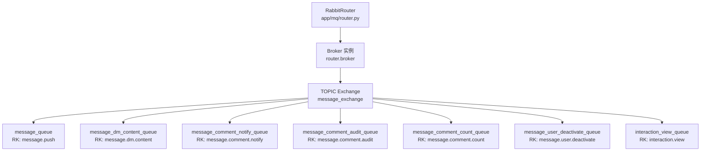
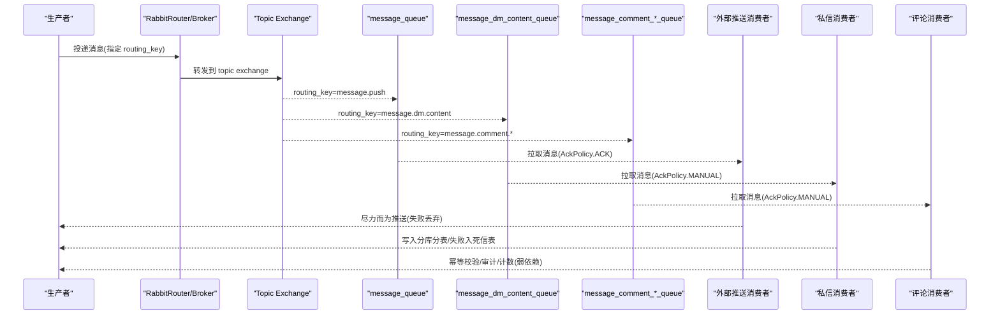
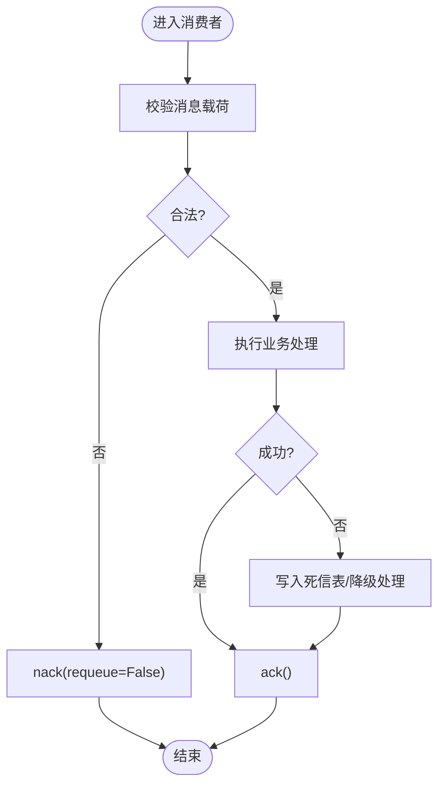
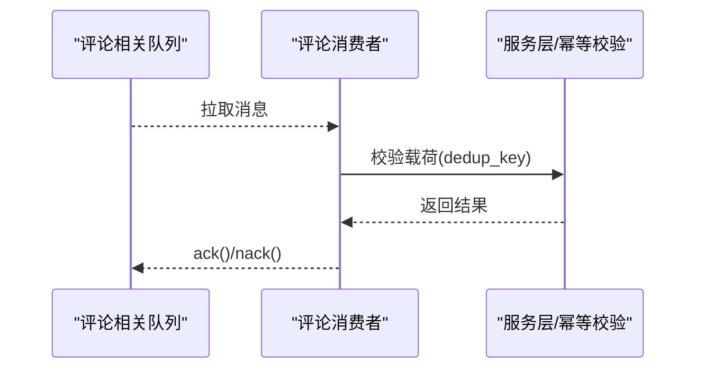
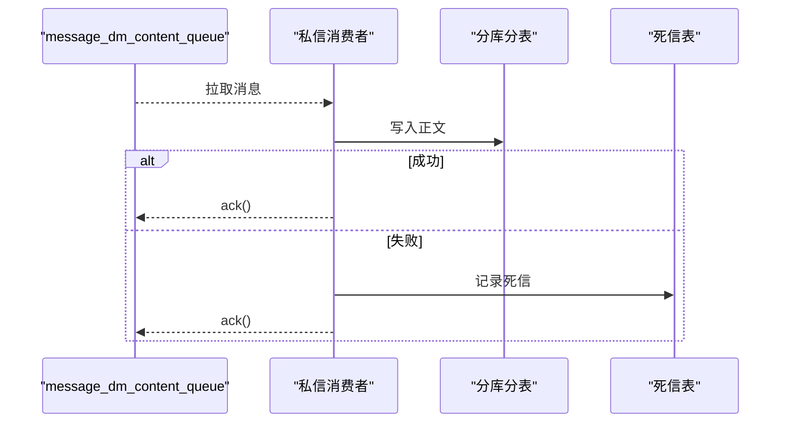
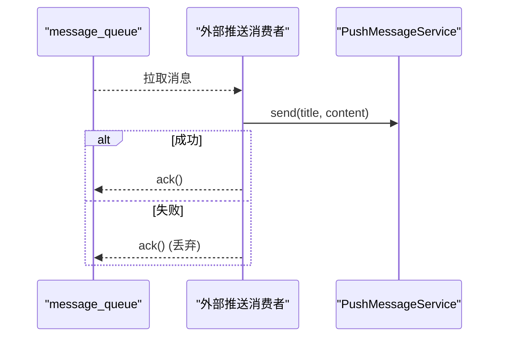
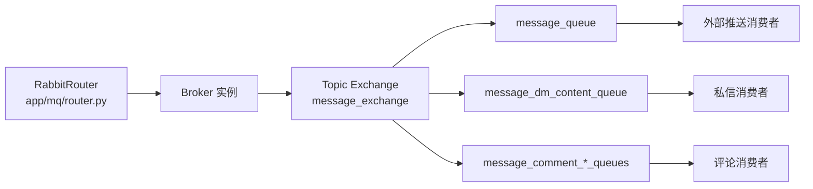
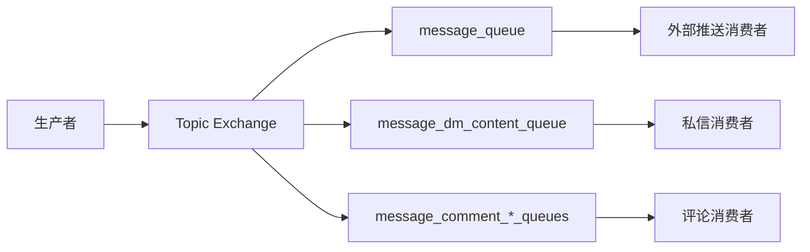

# 消息队列系统

<cite>
**本文引用的文件**
- [router.py](file://be-message-service/app/mq/router.py)
- [broker.py](file://be-message-service/app/core/broker.py)
- [comment.py（MQ 消费者注册）](file://be-message-service/app/mq/consumers/comment.py)
- [dm.py（MQ 消费者注册）](file://be-message-service/app/mq/consumers/dm.py)
- [external_push.py（MQ 消费者注册）](file://be-message-service/app/mq/consumers/external_push.py)
- [comment.py（评论消费逻辑）](file://be-message-service/app/consumers/comment.py)
- [dm.py（私信消费逻辑）](file://be-message-service/app/consumers/dm.py)
- [external_push.py（推送消费逻辑）](file://be-message-service/app/consumers/external_push.py)
- [retry.py（重试计数工具）](file://be-message-service/app/consumers/retry.py)
- [__init__.py（模型导出）](file://be-message-service/app/models/__init__.py)
</cite>

## 目录
1. [简介](#简介)
2. [项目结构](#项目结构)
3. [核心组件](#核心组件)
4. [架构总览](#架构总览)
5. [详细组件分析](#详细组件分析)
6. [依赖关系分析](#依赖关系分析)
7. [性能考量](#性能考量)
8. [故障排查指南](#故障排查指南)
9. [结论](#结论)
10. [附录](#附录)

## 简介
本技术文档围绕基于 FastStream 的 RabbitMQ 集成，系统化梳理 be-message-service 的消息队列实现。内容涵盖连接与路由配置、消费者注册机制、消息模型与序列化、错误重试与死信处理、以及评论消费、私信消费、外部推送消费等关键路径。同时提供消息流图与生产/消费示例指引，帮助读者快速理解并扩展该消息系统。

## 项目结构
be-message-service 将 MQ 基础设施集中在 app/mq 与 app/core/broker.py：
- app/mq/router.py：FastStream 的 RabbitRouter 入口，统一创建 broker、管理生命周期，并通过 after_startup / on_broker_shutdown 钩子协调定时任务。
- app/core/broker.py：集中定义 TOPIC exchange、routing_key 常量与各队列声明；所有消费者与 HTTP 生产者共享同一 broker 实例，避免多连接。
- app/mq/consumers/*：按业务域拆分消费者注册文件，通过 @router.subscriber 绑定到对应 queue/exchange，ack_policy 由业务决定。
- app/consumers/*：具体消费逻辑实现，包含幂等校验、写入分库分表、失败转死信、尽力而为推送等策略。
- app/consumers/retry.py：统一的“重投次数统计”工具，基于 RabbitMQ x-death 头计算重试次数，防止无限重试。

图示来源
- [router.py:22-36](file://be-message-service/app/mq/router.py#L22-L36)
- [broker.py:34-103](file://be-message-service/app/core/broker.py#L34-L103)

章节来源
- [router.py:1-57](file://be-message-service/app/mq/router.py#L1-L57)
- [broker.py:1-125](file://be-message-service/app/core/broker.py#L1-L125)

## 核心组件
- 连接与生命周期
  - RabbitRouter 在 include_router 时合并 lifespan，启动顺序为：应用级启动 → broker.start() → 启动定时任务 → 运行 → 关闭定时任务 → broker.stop()。
  - 单一 broker 实例被 router、publisher、RPC 服务端与健康检查共用，避免重复连接。
- 路由与队列
  - 使用 TOPIC exchange message_exchange，按 routing_key 分流至独立队列，保证各业务解耦与隔离。
  - 关键 routing_key：message.push、message.dm.content、message.comment.*、message.user.deactivate、interaction.view。
- 消费者注册
  - 每个业务域一个消费者注册文件，使用 @router.subscriber(queue=..., exchange=message_exchange, ack_policy=...) 完成绑定。
  - 不同业务采用不同确认策略：MANUAL（评论、私信）或 ACK（外部推送）。

章节来源
- [router.py:22-57](file://be-message-service/app/mq/router.py#L22-L57)
- [broker.py:25-125](file://be-message-service/app/core/broker.py#L25-L125)
- [comment.py（MQ 消费者注册）:30-57](file://be-message-service/app/mq/consumers/comment.py#L30-L57)
- [dm.py（MQ 消费者注册）:17-24](file://be-message-service/app/mq/consumers/dm.py#L17-L24)
- [external_push.py（MQ 消费者注册）:20-27](file://be-message-service/app/mq/consumers/external_push.py#L20-L27)

## 架构总览
下图展示从生产者投递到消费者处理的端到端流程，覆盖外部推送、私信落库、评论备用通道三类典型路径。

图示来源
- [broker.py:34-103](file://be-message-service/app/core/broker.py#L34-L103)
- [external_push.py（MQ 消费者注册）:20-27](file://be-message-service/app/mq/consumers/external_push.py#L20-L27)
- [dm.py（MQ 消费者注册）:17-24](file://be-message-service/app/mq/consumers/dm.py#L17-L24)
- [comment.py（MQ 消费者注册）:30-57](file://be-message-service/app/mq/consumers/comment.py#L30-L57)

## 详细组件分析

### 连接与路由配置
- 连接与日志级别由 settings.rabbitmq_url 与 settings.faststream_log_level_int 注入。
- 单一 broker 实例通过 router.broker 暴露给其他模块复用。
- 定时任务钩子：after_startup 启动调度器，on_broker_shutdown 停止调度器，确保与 broker 生命周期一致。

章节来源
- [router.py:22-57](file://be-message-service/app/mq/router.py#L22-L57)

### 消息模型与序列化
- 消息载体类型来自 app.models.schemas 与 app.models.push：
  - PushMessagePayload：外部推送消息体。
  - DmContentPayload：私信正文载荷。
  - EventReportReq：评论事件上报载荷（用于幂等校验）。
- 模型导出集中于 app/models/__init__.py，供消费者与服务层统一引用。

章节来源
- [__init__.py（模型导出）:1-52](file://be-message-service/app/models/__init__.py#L1-L52)

### 错误重试机制与去重
- 重试计数工具 retry_count(msg) 读取 RabbitMQ 消息头 x-death，统计 requeue 次数，配合 DEFAULT_MAX_RETRIES 控制最大重试。
- 幂等性：评论通知消费者通过 EventReportReq.model_validate(payload) 进行载荷校验，并结合 dedup_key 保证重复投递不刷屏。
- 死信处理：私信消费者写入失败时记录到 DmContentDeadLetter 表，后续由定时任务补偿；不再 requeue，避免坏消息打转。

图示来源
- [retry.py:1-31](file://be-message-service/app/consumers/retry.py#L1-L31)
- [comment.py（评论消费逻辑）:21-60](file://be-message-service/app/consumers/comment.py#L21-L60)
- [dm.py（私信消费逻辑）:24-53](file://be-message-service/app/consumers/dm.py#L24-L53)

章节来源
- [retry.py:1-31](file://be-message-service/app/consumers/retry.py#L1-L31)
- [comment.py（评论消费逻辑）:21-60](file://be-message-service/app/consumers/comment.py#L21-L60)
- [dm.py（私信消费逻辑）:24-53](file://be-message-service/app/consumers/dm.py#L24-L53)

### 评论消费（备用通道）
- 三个队列分别承载：事件提醒、异步审核、计数削峰。
- 当前主流程已同步完成评论通知与审核，这些消费者作为解耦后的备用通道与定时补偿入口，保持空闲但具备幂等能力。
- 使用 MANUAL ack，handler 内部做防御式 ack/nack，异常记录日志且不阻塞。

图示来源
- [comment.py（MQ 消费者注册）:30-57](file://be-message-service/app/mq/consumers/comment.py#L30-L57)
- [comment.py（评论消费逻辑）:21-60](file://be-message-service/app/consumers/comment.py#L21-L60)

章节来源
- [comment.py（MQ 消费者注册）:1-58](file://be-message-service/app/mq/consumers/comment.py#L1-L58)
- [comment.py（评论消费逻辑）:1-67](file://be-message-service/app/consumers/comment.py#L1-L67)

### 私信消费（异步落库）
- 负责将私信正文写入月度分库分表，成功后回写索引行 content_ready。
- 写入失败则记录到死信表，随后 ack 丢弃消息，避免阻塞队列与无限重试。
- 送达由写扩散保证，不向第三方推送渠道发消息。

图示来源
- [dm.py（MQ 消费者注册）:17-24](file://be-message-service/app/mq/consumers/dm.py#L17-L24)
- [dm.py（私信消费逻辑）:24-53](file://be-message-service/app/consumers/dm.py#L24-L53)

章节来源
- [dm.py（MQ 消费者注册）:1-25](file://be-message-service/app/mq/consumers/dm.py#L1-L25)
- [dm.py（私信消费逻辑）:1-54](file://be-message-service/app/consumers/dm.py#L1-L54)

### 外部推送消费（站外提醒）
- 消费 message_queue（routing_key=message.push），分发到 PushMe/PushPlus 等第三方渠道。
- 使用 ACK 策略：消费即确认，失败不重投，属于“尽力而为”的站外提醒。
- 消费者内部捕获异常并记录日志，保证消息不被反复重投直至死信。

图示来源
- [external_push.py（MQ 消费者注册）:20-27](file://be-message-service/app/mq/consumers/external_push.py#L20-L27)
- [external_push.py（推送消费逻辑）:16-35](file://be-message-service/app/consumers/external_push.py#L16-L35)

章节来源
- [external_push.py（MQ 消费者注册）:1-28](file://be-message-service/app/mq/consumers/external_push.py#L1-L28)
- [external_push.py（推送消费逻辑）:1-35](file://be-message-service/app/consumers/external_push.py#L1-L35)

## 依赖关系分析
- 模块耦合
  - app/mq/router.py 仅依赖配置与定时任务，不直接依赖消费者实现，降低循环导入风险。
  - app/core/broker.py 通过 lazy import 引入 router.broker，避免与 router 循环依赖。
  - 消费者注册文件依赖 broker 中定义的 queue/exchange 常量，保证路由一致性。
- 外部依赖
  - FastStream/RabbitMQ：提供 broker、exchange、queue、ack 策略与消息头（如 x-death）。
  - 数据库：私信消费者写入分库分表与死信表。
  - 第三方推送：外部推送消费者调用 PushMessageService。

图示来源
- [router.py:22-36](file://be-message-service/app/mq/router.py#L22-L36)
- [broker.py:34-103](file://be-message-service/app/core/broker.py#L34-L103)

章节来源
- [router.py:1-57](file://be-message-service/app/mq/router.py#L1-L57)
- [broker.py:1-125](file://be-message-service/app/core/broker.py#L1-L125)

## 性能考量
- 连接复用：单一 broker 实例减少连接开销，提升吞吐。
- 队列隔离：按 routing_key 分流到独立队列，避免热点业务相互影响。
- 确认策略：对关键链路（私信、评论）使用 MANUAL ack 精细控制；对非关键链路（外部推送）使用 ACK 简化流程。
- 重试上限：通过 x-death 统计重试次数，防止脏数据导致无限重试。
- 分库分表：私信正文写入月度分库分表，降低单表压力。

[本节为通用指导，无需特定文件引用]

## 故障排查指南
- 消息堆积
  - 检查消费者是否正常运行，确认 ack_policy 是否符合预期。
  - 查看队列长度与消费者并发度，必要时扩容消费者实例。
- 无限重试
  - 使用 retry_count(msg) 检查 x-death 头中的重试次数，超过阈值应丢弃并记录错误。
- 死信积压
  - 私信写入失败会落入死信表，需检查定时补偿任务是否正常执行。
- 推送失败
  - 外部推送失败会被丢弃，关注日志中的 CRITICAL 错误，定位第三方渠道配置问题。

章节来源
- [retry.py:1-31](file://be-message-service/app/consumers/retry.py#L1-L31)
- [dm.py（私信消费逻辑）:24-53](file://be-message-service/app/consumers/dm.py#L24-L53)
- [external_push.py（推送消费逻辑）:16-35](file://be-message-service/app/consumers/external_push.py#L16-L35)

## 结论
本消息系统以 FastStream + RabbitMQ 为核心，通过统一的 broker 与 topic exchange 实现高内聚、低耦合的消息路由。消费者按业务域拆分，结合 MANUAL/ACK 确认策略与重试上限控制，兼顾可靠性与性能。私信落库采用分库分表与死信补偿，外部推送采用尽力而为策略，评论通道预留幂等与补偿能力。整体架构清晰、可扩展性强，适合持续演进。

[本节为总结性内容，无需特定文件引用]

## 附录

### 消息流图（生产/消费示例）
- 生产侧：HTTP 接口或上游服务根据业务选择 routing_key 投递消息到 message_exchange。
- 消费侧：
  - message.push → 外部推送消费者（ACK，失败丢弃）
  - message.dm.content → 私信消费者（MANUAL，失败入死信表）
  - message.comment.* → 评论消费者（MANUAL，幂等校验，弱依赖）

图示来源
- [broker.py:34-103](file://be-message-service/app/core/broker.py#L34-L103)
- [external_push.py（MQ 消费者注册）:20-27](file://be-message-service/app/mq/consumers/external_push.py#L20-L27)
- [dm.py（MQ 消费者注册）:17-24](file://be-message-service/app/mq/consumers/dm.py#L17-L24)
- [comment.py（MQ 消费者注册）:30-57](file://be-message-service/app/mq/consumers/comment.py#L30-L57)

### 幂等性与去重要点
- 评论通知：通过 EventReportReq 校验与 dedup_key 保证重复投递不刷屏。
- 私信落库：失败写入死信表，避免重复重投；成功则标记 content_ready。
- 外部推送：失败丢弃，不追求强一致，侧重可用性。

章节来源
- [comment.py（评论消费逻辑）:21-60](file://be-message-service/app/consumers/comment.py#L21-L60)
- [dm.py（私信消费逻辑）:24-53](file://be-message-service/app/consumers/dm.py#L24-L53)

### 重试与死信处理要点
- 重试计数：基于 x-death 头统计，默认最大重试次数可配置。
- 死信表：私信写入失败记录到 DmContentDeadLetter，后续由定时任务补偿。
- 确认策略：关键链路 MANUAL ack，非关键链路 ACK 丢弃。

章节来源
- [retry.py:1-31](file://be-message-service/app/consumers/retry.py#L1-L31)
- [dm.py（私信消费逻辑）:24-53](file://be-message-service/app/consumers/dm.py#L24-L53)