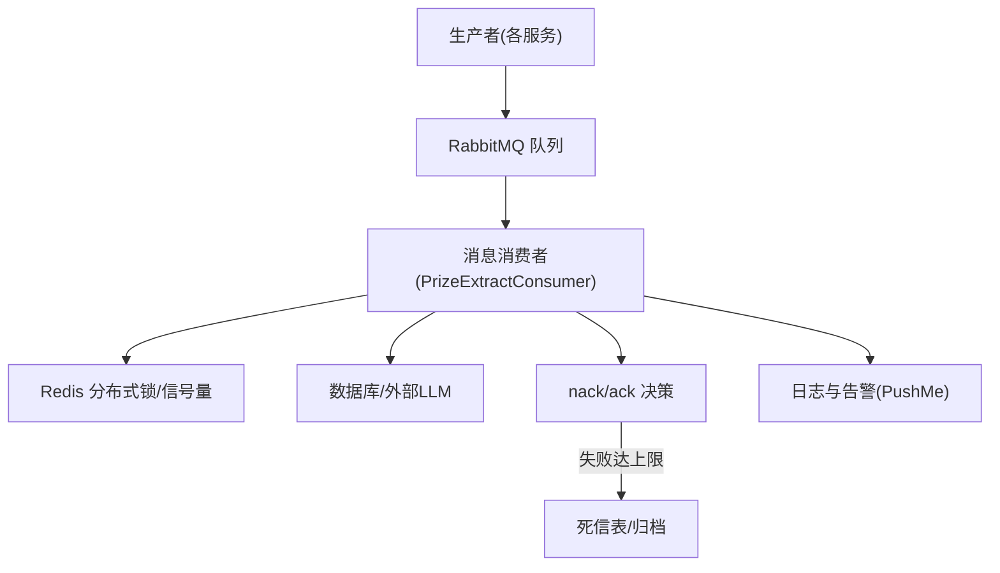
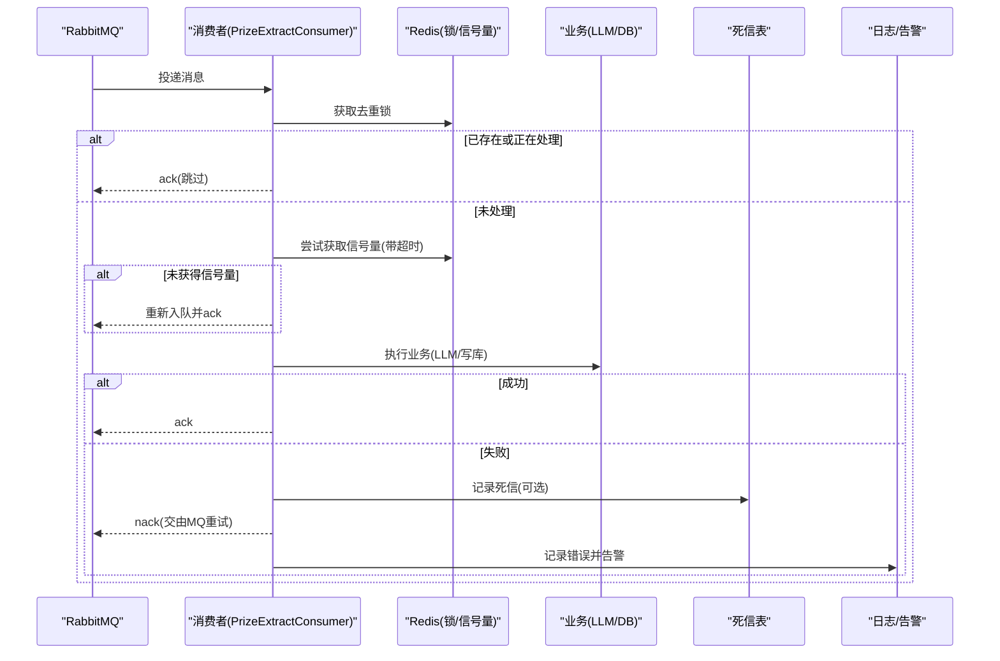
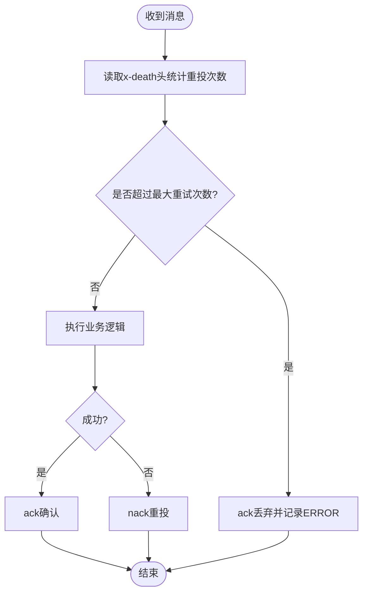
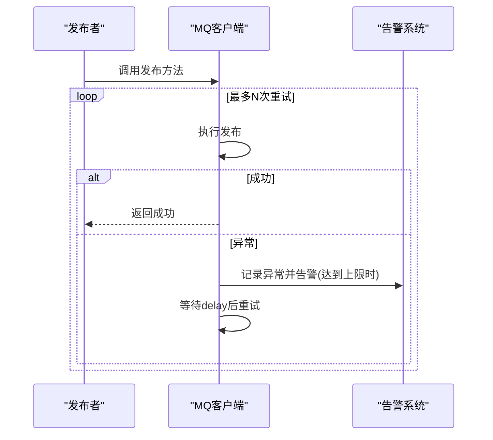
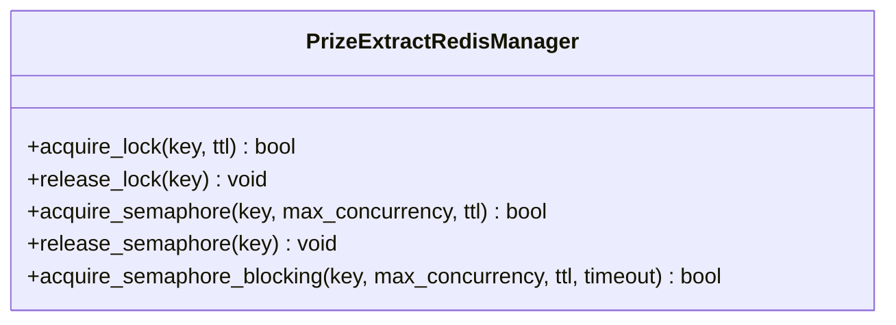
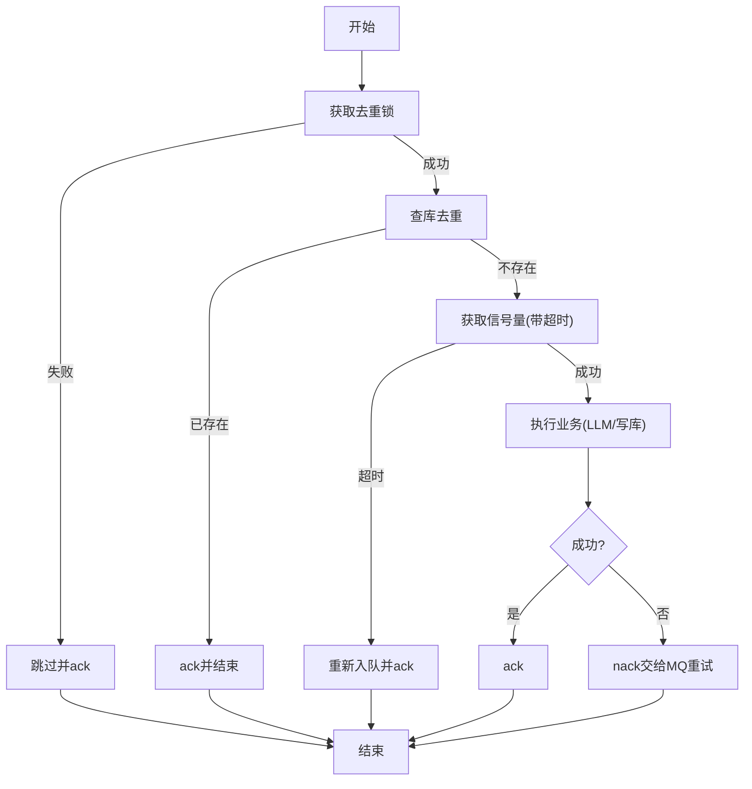
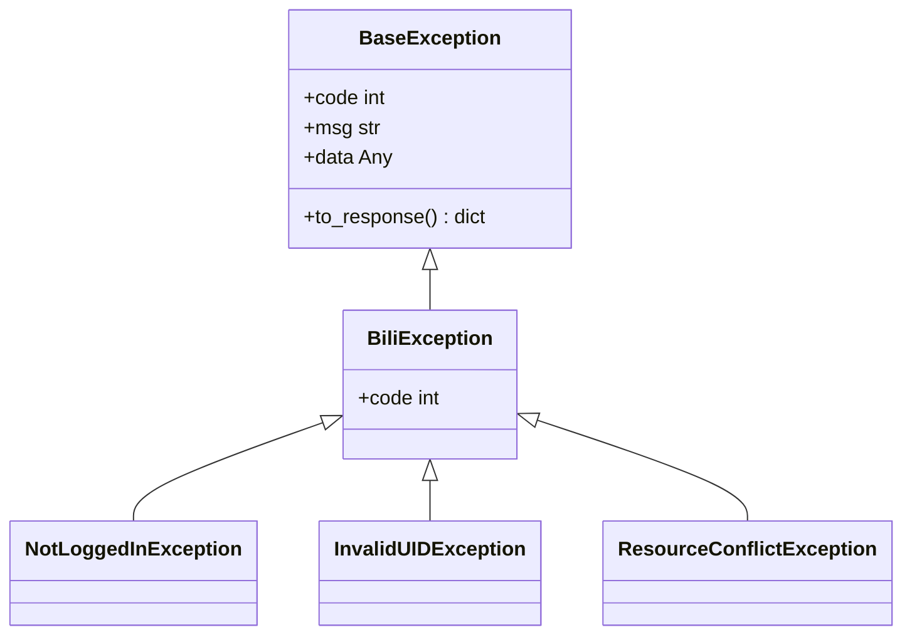
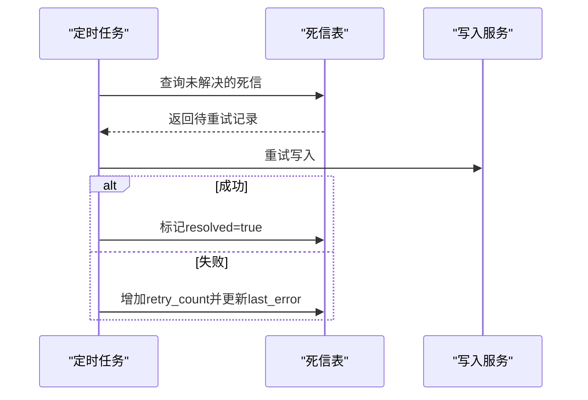
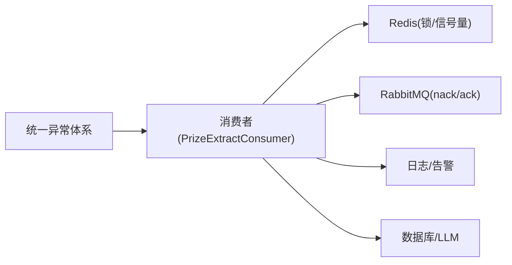

# 错误处理与重试机制

<cite>
**本文引用的文件**
- [be-message-service/app/consumers/retry.py](file://be-message-service/app/consumers/retry.py)
- [be-bilibili-crawler/Service/MQ/base/BasicAsyncClient.py](file://be-bilibili-crawler/Service/MQ/base/BasicAsyncClient.py)
- [be-bilibili-crawler/Service/MQ/base/MQClient/PrizeExtract.py](file://be-bilibili-crawler/Service/MQ/base/MQClient/PrizeExtract.py)
- [bili-common/bili_common/exceptions.py](file://bili-common/bili_common/exceptions.py)
- [RPA-Browser/app/models/common/exceptions/base_exception.py](file://RPA-Browser/app/models/common/exceptions/base_exception.py)
- [be-bilibili-crawler/controller/common/CommonRouter.py](file://be-bilibili-crawler/controller/common/CommonRouter.py)
- [be-bilibili-crawler/log/base_log.py](file://be-bilibili-crawler/log/base_log.py)
- [be-message-service/app/tasks/scheduler.py](file://be-message-service/app/tasks/scheduler.py)
- [be-message-service/app/models/db/dm_tbl.py](file://be-message-service/app/models/db/dm_tbl.py)
</cite>

## 目录
1. [简介](#简介)
2. [项目结构](#项目结构)
3. [核心组件](#核心组件)
4. [架构总览](#架构总览)
5. [详细组件分析](#详细组件分析)
6. [依赖关系分析](#依赖关系分析)
7. [性能考量](#性能考量)
8. [故障排查指南](#故障排查指南)
9. [结论](#结论)
10. [附录](#附录)

## 简介
本文件聚焦于消息处理中的异常捕获、错误分类、重试策略、分布式锁与并发控制、死信队列与归档、以及监控告警与故障诊断。内容基于仓库中消息服务、爬虫服务、公共异常体系与日志体系的实现，提供可操作的实践建议与调优要点。

## 项目结构
围绕错误与重试的关键代码分布在以下模块：
- 消息消费重试计数工具（RabbitMQ x-death 头解析）
- MQ 客户端基础封装（发布端重试装饰器、连接/通道重连）
- 大模型提取消费者（Redis 分布式锁 + 信号量 + 超时等待 + nack/ack）
- 统一异常体系（HTTP 状态码契约、全局异常处理器）
- 日志与告警（按业务分 logger、推送失败告警）
- 死信队列与补偿任务（持久化失败记录 + 定时重试）

**图示来源**
- [be-bilibili-crawler/Service/MQ/base/MQClient/PrizeExtract.py:222-286](file://be-bilibili-crawler/Service/MQ/base/MQClient/PrizeExtract.py#L222-L286)
- [be-message-service/app/consumers/retry.py:19-27](file://be-message-service/app/consumers/retry.py#L19-L27)
- [be-bilibili-crawler/log/base_log.py:63-66](file://be-bilibili-crawler/log/base_log.py#L63-L66)

**章节来源**
- [be-bilibili-crawler/Service/MQ/base/MQClient/PrizeExtract.py:222-286](file://be-bilibili-crawler/Service/MQ/base/MQClient/PrizeExtract.py#L222-L286)
- [be-message-service/app/consumers/retry.py:19-27](file://be-message-service/app/consumers/retry.py#L19-L27)
- [be-bilibili-crawler/log/base_log.py:63-66](file://be-bilibili-crawler/log/base_log.py#L63-L66)

## 核心组件
- 消息消费重试计数：从 RabbitMQ 消息头 x-death 统计重投次数，避免无限重试。
- MQ 发布端重试：对异步发布调用进行固定间隔重试，达到最大次数后推送告警并终止。
- 分布式锁与信号量：使用 Redis 原子操作实现“去重锁”和“全局并发闸”，保护 LLM 调用与写库。
- 统一异常体系：将业务异常、HTTP 异常、参数校验异常、未捕获异常统一为一致的响应体与日志格式。
- 死信队列与归档：通过持久化表记录失败消息，配合定时任务重试补偿，保证最终一致。
- 日志与告警：按业务维度输出结构化日志，并在关键失败点触发告警。

**章节来源**
- [be-message-service/app/consumers/retry.py:19-27](file://be-message-service/app/consumers/retry.py#L19-L27)
- [be-bilibili-crawler/Service/MQ/base/BasicAsyncClient.py:15-47](file://be-bilibili-crawler/Service/MQ/base/BasicAsyncClient.py#L15-L47)
- [be-bilibili-crawler/Service/MQ/base/MQClient/PrizeExtract.py:69-143](file://be-bilibili-crawler/Service/MQ/base/MQClient/PrizeExtract.py#L69-L143)
- [bili-common/bili_common/exceptions.py:132-250](file://bili-common/bili_common/exceptions.py#L132-L250)
- [be-message-service/app/models/db/dm_tbl.py:150-175](file://be-message-service/app/models/db/dm_tbl.py#L150-L175)
- [be-bilibili-crawler/log/base_log.py:63-66](file://be-bilibili-crawler/log/base_log.py#L63-L66)

## 架构总览
下图展示一次消息处理的完整链路：消费者获取消息 → 分布式锁与并发控制 → 业务处理（可能调用 LLM/DB）→ 成功 ack / 失败 nack → 重试计数与死信归档 → 日志与告警。

**图示来源**
- [be-bilibili-crawler/Service/MQ/base/MQClient/PrizeExtract.py:222-286](file://be-bilibili-crawler/Service/MQ/base/MQClient/PrizeExtract.py#L222-L286)
- [be-message-service/app/consumers/retry.py:19-27](file://be-message-service/app/consumers/retry.py#L19-L27)
- [be-bilibili-crawler/log/base_log.py:63-66](file://be-bilibili-crawler/log/base_log.py#L63-L66)

## 详细组件分析

### 消息消费重试计数与策略
- 重试计数来源：读取 RabbitMQ 消息头 x-death 的 count 字段，统计该消息已被 requeue 的次数。
- 默认最大重试次数：DEFAULT_MAX_RETRIES = 3，可在具体 handler 覆盖。
- 策略：失败时 nack(requeue=True) 让 MQ 重试；当达到上限则 ack() 丢弃并记 ERROR，避免死循环污染队列。

**图示来源**
- [be-message-service/app/consumers/retry.py:19-27](file://be-message-service/app/consumers/retry.py#L19-L27)

**章节来源**
- [be-message-service/app/consumers/retry.py:19-27](file://be-message-service/app/consumers/retry.py#L19-L27)

### MQ 发布端重试与告警
- 重试装饰器：对异步发布函数进行固定间隔重试，记录每次异常与次数。
- 最大重试次数：达到阈值后记录彻底失败并推送告警，随后退出重试。
- 适用场景：网络抖动、临时不可用等可自愈问题。

**图示来源**
- [be-bilibili-crawler/Service/MQ/base/BasicAsyncClient.py:15-47](file://be-bilibili-crawler/Service/MQ/base/BasicAsyncClient.py#L15-L47)

**章节来源**
- [be-bilibili-crawler/Service/MQ/base/BasicAsyncClient.py:15-47](file://be-bilibili-crawler/Service/MQ/base/BasicAsyncClient.py#L15-L47)

### 分布式锁与并发控制（Redis）
- 去重锁：SET NX EX，防止同一资源重复处理；TTL 兜底防崩溃残留。
- 全局信号量：Lua 脚本原子判断并发数，INCR 并设置过期，避免泄漏；DECR 释放，归零删除 key。
- 阻塞获取：轮询等待直到超时，超时则重新入队延迟处理，避免瞬时压垮 LLM。

**图示来源**
- [be-bilibili-crawler/Service/MQ/base/MQClient/PrizeExtract.py:69-143](file://be-bilibili-crawler/Service/MQ/base/MQClient/PrizeExtract.py#L69-L143)

**章节来源**
- [be-bilibili-crawler/Service/MQ/base/MQClient/PrizeExtract.py:69-143](file://be-bilibili-crawler/Service/MQ/base/MQClient/PrizeExtract.py#L69-L143)

### 消息处理主流程（含超时与重试）
- 流程：获取去重锁 → 查库去重 → 获取信号量（带超时）→ 调用 LLM/写库 → ack/nack。
- 超时处理：信号量获取超时则重新入队，稍后由 MQ 再次投递。
- 失败处理：异常时 nack，交由 MQ 重试；结合重试计数避免死循环。

**图示来源**
- [be-bilibili-crawler/Service/MQ/base/MQClient/PrizeExtract.py:222-286](file://be-bilibili-crawler/Service/MQ/base/MQClient/PrizeExtract.py#L222-L286)

**章节来源**
- [be-bilibili-crawler/Service/MQ/base/MQClient/PrizeExtract.py:222-286](file://be-bilibili-crawler/Service/MQ/base/MQClient/PrizeExtract.py#L222-L286)

### 统一异常体系与 HTTP 契约
- 业务异常：BaseException 及其子类，对外统一返回 HTTP 200 + {code, msg, data}。
- HTTP 异常：保留原 status_code，body 仍为统一契约。
- 参数校验：RequestValidationError → HTTP 400 + 统一 body。
- 未捕获异常：全局兜底 → HTTP 500 + error_id，DEV 环境附带 traceback。

**图示来源**
- [bili-common/bili_common/exceptions.py:33-118](file://bili-common/bili_common/exceptions.py#L33-L118)

**章节来源**
- [bili-common/bili_common/exceptions.py:132-250](file://bili-common/bili_common/exceptions.py#L132-L250)
- [bili-common/bili_common/exceptions.py:33-118](file://bili-common/bili_common/exceptions.py#L33-L118)

### 前端与服务端错误示例与行为
- 服务端测试接口：主动抛出运行时异常，直接发布到 message 队列绕过限流，再重新抛出以模拟线上 500。
- 前端请求配置：支持 retry、retryDelay、retryStatusCodes、timeout 等选项，便于在客户端侧做重试与超时控制。

**章节来源**
- [be-bilibili-crawler/controller/common/CommonRouter.py:67-94](file://be-bilibili-crawler/controller/common/CommonRouter.py#L67-L94)

### 日志与告警
- 多业务 logger：按业务维度创建独立 logger，落盘、轮转、压缩、保留天数可控。
- 关键失败点：MQ 发布失败、消费者异常、LLM/DB 写入失败均会记录并触发告警。

**章节来源**
- [be-bilibili-crawler/log/base_log.py:44-96](file://be-bilibili-crawler/log/base_log.py#L44-L96)
- [be-bilibili-crawler/Service/MQ/base/BasicAsyncClient.py:15-47](file://be-bilibili-crawler/Service/MQ/base/BasicAsyncClient.py#L15-L47)
- [be-bilibili-crawler/Service/MQ/base/MQClient/PrizeExtract.py:50-58](file://be-bilibili-crawler/Service/MQ/base/MQClient/PrizeExtract.py#L50-L58)

### 死信队列与归档、人工干预
- 死信记录：私信正文异步落库失败的消息持久化到 msg_dm_content_dlq 表，包含 msgkey、session_key、sender_uid、receiver_uid、content、retry_count、last_error、resolved 等字段。
- 补偿任务：定时任务扫描未解决死信并重试写入，成功后标记 resolved。
- 人工干预：可通过查询死信表定位失败消息，必要时手动修复数据或调整重试策略。

**图示来源**
- [be-message-service/app/models/db/dm_tbl.py:150-175](file://be-message-service/app/models/db/dm_tbl.py#L150-L175)
- [be-message-service/app/tasks/scheduler.py:77-80](file://be-message-service/app/tasks/scheduler.py#L77-L80)

**章节来源**
- [be-message-service/app/models/db/dm_tbl.py:150-175](file://be-message-service/app/models/db/dm_tbl.py#L150-L175)
- [be-message-service/app/tasks/scheduler.py:77-80](file://be-message-service/app/tasks/scheduler.py#L77-L80)

## 依赖关系分析
- 消费者依赖 Redis 分布式锁与信号量，确保跨实例并发安全。
- 消费者依赖 MQ 的重试能力（nack/requeue），并结合 x-death 头进行重试计数。
- 统一异常体系被各后端注册，保障对外响应一致性。
- 日志与告警贯穿全链路，便于追踪与排障。

**图示来源**
- [be-bilibili-crawler/Service/MQ/base/MQClient/PrizeExtract.py:222-286](file://be-bilibili-crawler/Service/MQ/base/MQClient/PrizeExtract.py#L222-L286)
- [bili-common/bili_common/exceptions.py:235-250](file://bili-common/bili_common/exceptions.py#L235-L250)

**章节来源**
- [be-bilibili-crawler/Service/MQ/base/MQClient/PrizeExtract.py:222-286](file://be-bilibili-crawler/Service/MQ/base/MQClient/PrizeExtract.py#L222-L286)
- [bili-common/bili_common/exceptions.py:235-250](file://bili-common/bili_common/exceptions.py#L235-L250)

## 性能考量
- 信号量 TTL 与超时：合理设置 SEM_TTL 与 SEM_ACQUIRE_TIMEOUT，避免长时间占用与饥饿。
- 预取与背压：MQ 消费者 prefetch_count 需平衡吞吐与内存/文件描述符限制。
- 重试退避：当前发布端采用固定间隔重试；若需指数退避，可在装饰器中引入 backoff 策略（例如 base * 2^attempt）。
- 死信重试频率：根据业务容忍度调整定时任务周期，避免频繁重试造成二次压力。
- 日志轮转与保留：按业务维度拆分日志，控制文件大小与保留期，降低 I/O 压力。

[本节为通用指导，不直接分析具体文件]

## 故障排查指南
- 快速定位：通过全局异常处理器生成的 error_id 关联日志与响应，快速定位问题上下文。
- 检查重试计数：查看 x-death 头统计的重投次数，判断是否达到上限。
- 检查信号量与锁：观察 Redis 中 sem/lock key 的状态与 TTL，确认是否存在泄漏或竞争。
- 检查死信表：查询 msg_dm_content_dlq 中 unresolved 记录，定位 last_error 与 retry_count。
- 告警与日志：核对 PushMe 告警与对应 logger 输出，确认失败路径与堆栈信息。

**章节来源**
- [bili-common/bili_common/exceptions.py:187-232](file://bili-common/bili_common/exceptions.py#L187-L232)
- [be-message-service/app/consumers/retry.py:19-27](file://be-message-service/app/consumers/retry.py#L19-L27)
- [be-bilibili-crawler/Service/MQ/base/MQClient/PrizeExtract.py:274-286](file://be-bilibili-crawler/Service/MQ/base/MQClient/PrizeExtract.py#L274-L286)
- [be-message-service/app/models/db/dm_tbl.py:150-175](file://be-message-service/app/models/db/dm_tbl.py#L150-L175)
- [be-bilibili-crawler/log/base_log.py:63-66](file://be-bilibili-crawler/log/base_log.py#L63-L66)

## 结论
本项目在消息处理层构建了完善的异常捕获、重试计数、分布式锁与并发控制、死信归档与补偿、以及统一的异常与日志体系。通过合理的超时与重试策略、信号量 TTL 与预取配置，能够在高并发与不稳定环境下保持系统的稳定性与最终一致性。建议在生产环境中持续监控重试次数、死信率与信号量占用，结合告警与日志进行快速定位与优化。

## 附录
- 推荐实践
  - 为不同业务设置独立的 MAX_RETRIES 与 delay/backoff 策略。
  - 对关键路径启用幂等与去重（如 Redis 锁 + 业务唯一键）。
  - 定期清理 Redis 中残留的 sem/lock key，避免泄漏。
  - 对死信表建立索引与监控，设定自动清理策略。
  - 在网关/客户端侧配置合理的超时与重试，避免雪崩。

[本节为通用指导，不直接分析具体文件]