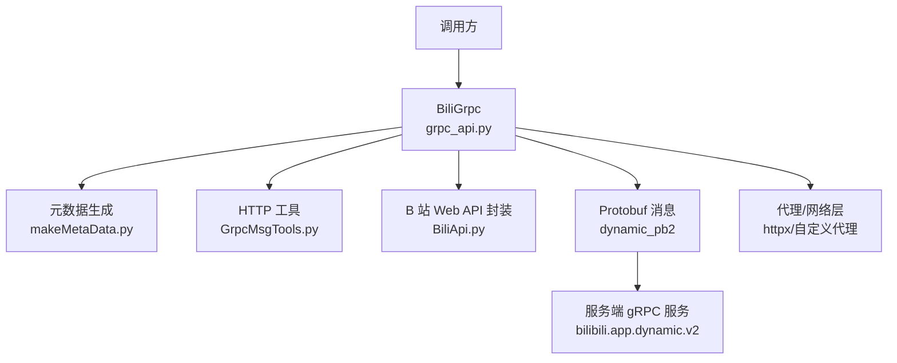
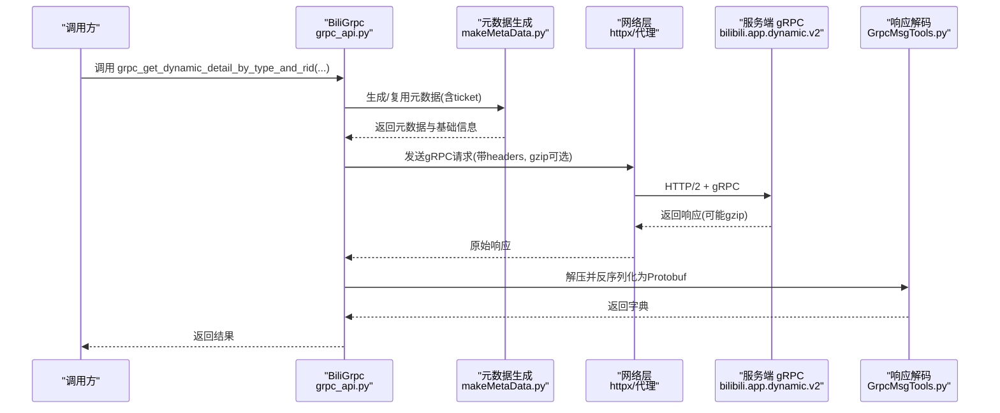
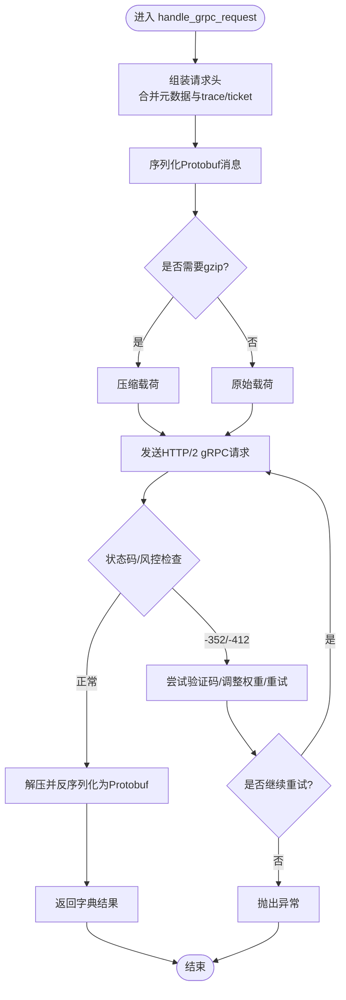
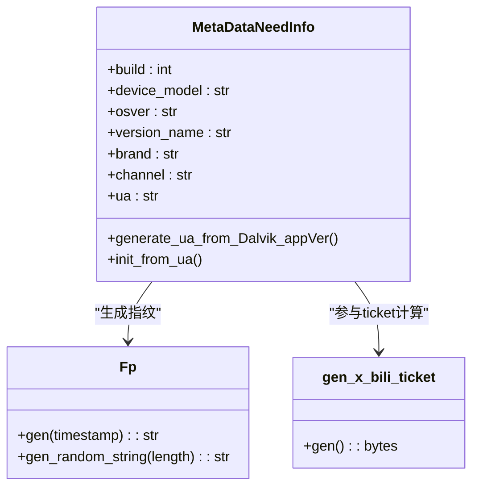
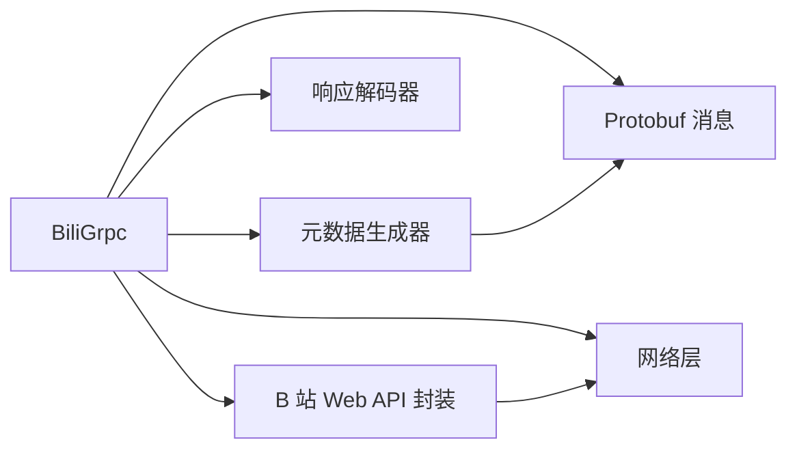

# gRPC 模块

<cite>
**本文引用的文件**
- [grpc_api.py](file://be-bilibili-crawler/Service/GrpcModule/Grpc/grpc_api.py)
- [makeMetaData.py](file://be-bilibili-crawler/Utils/GrpcUtils/metadata/makeMetaData.py)
- [GrpcMsgTools.py](file://be-bilibili-crawler/Utils/GrpcUtils/GrpcMsgTools.py)
- [BiliApi.py](file://be-bilibili-crawler/Service/GrpcModule/Grpc/Bapi/BiliApi.py)
- [ApiResponseModel.py](file://be-bilibili-crawler/Service/GrpcModule/Models/ApiResponseModel.py)
- [GrpcApiBaseModel.py](file://be-bilibili-crawler/Service/GrpcModule/Models/GrpcApiBaseModel.py)
- [DynObjectClass.py](file://be-bilibili-crawler/Service/GrpcModule/GrpcSrc/DynObjectClass.py)
</cite>

## 目录
1. [简介](#简介)
2. [项目结构](#项目结构)
3. [核心组件](#核心组件)
4. [架构总览](#架构总览)
5. [详细组件分析](#详细组件分析)
6. [依赖关系分析](#依赖关系分析)
7. [性能考量](#性能考量)
8. [故障排查指南](#故障排查指南)
9. [结论](#结论)
10. [附录](#附录)

## 简介
本技术文档聚焦于 B 站 API 的 gRPC 封装实现，围绕以下目标展开：
- 解析 BiliApi 类（实际为 BiliGrpc）的接口设计与调用方式
- 说明动态对象模型 DynObjectClass 的数据结构与序列化机制
- 解释统一响应模型 ApiResponseModel 的设计与错误处理策略
- 文档化 gRPC 服务的元数据生成、代理选择、重试与负载均衡机制
- 提供客户端调用示例与服务端对接要点
- 给出性能优化与调试技巧

## 项目结构
gRPC 模块位于 be-bilibili-crawler/Service/GrpcModule 下，关键目录与职责如下：
- Grpc/grpc_api.py：gRPC 请求编排、元数据管理、代理与重试、错误处理的核心入口
- Utils/GrpcUtils/metadata/makeMetaData.py：构造 B 站 gRPC 所需的设备指纹、票据、元数据等
- Utils/GrpcUtils/GrpcMsgTools.py：原始 HTTP 响应到 Protobuf 消息的反序列化工具
- Service/GrpcModule/Grpc/Bapi/BiliApi.py：HTTP 形式的 B 站 Web API 封装（用于获取 ticket、ABTest 等前置能力）
- Service/GrpcModule/Models/ApiResponseModel.py：统一响应模型基类
- Service/GrpcModule/Models/GrpcApiBaseModel.py：元数据包装器与生命周期控制
- Service/GrpcModule/GrpcSrc/DynObjectClass.py：动态对象模型（用于动态详情等业务数据的结构化表示）

图表来源
- [grpc_api.py:59-686](file://be-bilibili-crawler/Service/GrpcModule/Grpc/grpc_api.py#L59-L686)
- [makeMetaData.py:255-405](file://be-bilibili-crawler/Utils/GrpcUtils/metadata/makeMetaData.py#L255-L405)
- [GrpcMsgTools.py:8-31](file://be-bilibili-crawler/Utils/GrpcUtils/GrpcMsgTools.py#L8-L31)
- [BiliApi.py:40-462](file://be-bilibili-crawler/Service/GrpcModule/Grpc/Bapi/BiliApi.py#L40-L462)

章节来源
- [grpc_api.py:59-686](file://be-bilibili-crawler/Service/GrpcModule/Grpc/grpc_api.py#L59-L686)
- [makeMetaData.py:255-405](file://be-bilibili-crawler/Utils/GrpcUtils/metadata/makeMetaData.py#L255-L405)
- [GrpcMsgTools.py:8-31](file://be-bilibili-crawler/Utils/GrpcUtils/GrpcMsgTools.py#L8-L31)
- [BiliApi.py:40-462](file://be-bilibili-crawler/Service/GrpcModule/Grpc/BiliApi.py#L40-L462)

## 核心组件
- BiliGrpc（grpc_api.py）：对外暴露的 gRPC 客户端封装，负责构建请求、组装元数据、选择代理、发送请求、解码响应、错误处理与重试。
- 元数据生成器（makeMetaData.py）：根据 UA、设备信息、渠道、版本等生成 x-bili-ticket、设备指纹、locale、network、metadata 等头部字段。
- 响应解码器（GrpcMsgTools.py）：将原始 HTTP 响应体按 gzip/非 gzip 解压后反序列化为 Protobuf 消息并转为字典。
- B 站 Web API 封装（BiliApi.py）：通过 HTTP 获取 ticket、ABTest、动态详情等前置或辅助能力，供 gRPC 流程使用。
- 统一响应模型（ApiResponseModel.py）：定义通用响应结构 code/data/message，便于上层统一处理。
- 元数据包装器（GrpcApiBaseModel.py）：对元数据进行生命周期管理（过期、使用次数、352 计数），并提供可用性判断。
- 动态对象模型（DynObjectClass.py）：业务侧对动态详情等复杂结构的 Python 对象表示，便于后续入库与处理。

章节来源
- [grpc_api.py:59-686](file://be-bilibili-crawler/Service/GrpcModule/Grpc/grpc_api.py#L59-L686)
- [makeMetaData.py:255-405](file://be-bilibili-crawler/Utils/GrpcUtils/metadata/makeMetaData.py#L255-L405)
- [GrpcMsgTools.py:8-31](file://be-bilibili-crawler/Utils/GrpcUtils/GrpcMsgTools.py#L8-L31)
- [BiliApi.py:40-462](file://be-bilibili-crawler/Service/GrpcModule/Grpc/BiliApi.py#L40-L462)
- [ApiResponseModel.py:1-17](file://be-bilibili-crawler/Service/GrpcModule/Models/ApiResponseModel.py#L1-L17)
- [GrpcApiBaseModel.py:9-49](file://be-bilibili-crawler/Service/GrpcModule/Models/GrpcApiBaseModel.py#L9-L49)
- [DynObjectClass.py:4-78](file://be-bilibili-crawler/Service/GrpcModule/GrpcSrc/DynObjectClass.py#L4-L78)

## 架构总览
BiliGrpc 作为统一入口，内部协调元数据生成、代理选择、请求发送、响应解码与错误恢复。其典型调用链如下：

图表来源
- [grpc_api.py:570-664](file://be-bilibili-crawler/Service/GrpcModule/Grpc/grpc_api.py#L570-L664)
- [makeMetaData.py:255-405](file://be-bilibili-crawler/Utils/GrpcUtils/metadata/makeMetaData.py#L255-L405)
- [GrpcMsgTools.py:8-31](file://be-bilibili-crawler/Utils/GrpcUtils/GrpcMsgTools.py#L8-L31)

## 详细组件分析

### BiliGrpc 类（grpc_api.py）
- 职责
  - 维护 gRPC 服务端地址、超时、代理池权重、元数据池大小等配置
  - 提供多种动态查询方法：按 rid+类型、按 dynamic_id、按空间 uid
  - 统一处理元数据生产、代理选择、请求发送、响应解码、错误分类与重试
- 关键流程
  - 元数据生产：从池中复用或重新生成，包含设备指纹、locale、network、metadata、ticket 等
  - 代理选择：在 IPv6 直连与真实代理之间按权重随机选择；遇到 -352 时调整权重并尝试验证码校验
  - 请求发送：将 Protobuf 消息序列化为字节流，必要时 gzip 压缩，通过 httpx 发送
  - 响应解码：根据头部判断是否 gzip，再反序列化为 Protobuf 并转为字典
  - 错误处理：区分连接错误、代理错误、-352/-412 风控、解码失败等，分别记录日志、调整权重、触发验证码或上报
- 扩展点
  - 可注入自定义代理、超时、UA、渠道、版本号等参数
  - 可通过 force_proxy/force_non_proxy 控制代理行为

图表来源
- [grpc_api.py:255-503](file://be-bilibili-crawler/Service/GrpcModule/Grpc/grpc_api.py#L255-L503)

章节来源
- [grpc_api.py:59-686](file://be-bilibili-crawler/Service/GrpcModule/Grpc/grpc_api.py#L59-L686)

### 元数据生成器（makeMetaData.py）
- 职责
  - 基于 UA、品牌、机型、系统版本、渠道、应用版本等信息生成设备指纹、locale、network、metadata、FawkesReq 等二进制头部
  - 通过 B 站 ticket 接口获取 x-bili-ticket，并回填到元数据中
  - 提供 Dalvik UA 解析、trace-id 生成、app 列表模拟等辅助能力
- 关键点
  - 元数据有效期与使用次数限制由上层包装器控制
  - 支持主动激活 buvid、生成随机设备指纹、模拟系统与应用信息以增强通过率
  - 生成的元数据包含 accept、content-type、grpc-encoding、grpc-timeout 等必要头部

图表来源
- [makeMetaData.py:61-167](file://be-bilibili-crawler/Utils/GrpcUtils/metadata/makeMetaData.py#L61-L167)
- [makeMetaData.py:170-253](file://be-bilibili-crawler/Utils/GrpcUtils/metadata/makeMetaData.py#L170-L253)

章节来源
- [makeMetaData.py:255-405](file://be-bilibili-crawler/Utils/GrpcUtils/metadata/makeMetaData.py#L255-L405)

### 响应解码器（GrpcMsgTools.py）
- 职责
  - 根据响应头判断是否 gzip，解压后尝试 ParseFromString
  - 若解析失败，降级为 MessageToDict 并记录警告；完全失败则抛出解码异常
- 使用场景
  - 在 BiliGrpc.handle_grpc_request 中统一解码所有 gRPC 响应

章节来源
- [GrpcMsgTools.py:8-31](file://be-bilibili-crawler/Utils/GrpcUtils/GrpcMsgTools.py#L8-L31)

### B 站 Web API 封装（BiliApi.py）
- 职责
  - 提供一系列 HTTP 接口封装：回复列表、话题详情、抽奖通知、预约关系信息、空间动态、GAIA 获取 axe、动态详情、ABTest、直播区域列表等
  - 通过 request_wrapper 统一处理代理、Cookie、签名、WBI 签名等
- 与 gRPC 的关系
  - 为 gRPC 流程提供前置能力，如 ABTest 激活、ticket 获取、动态详情等

章节来源
- [BiliApi.py:40-462](file://be-bilibili-crawler/Service/GrpcModule/Grpc/BiliApi.py#L40-L462)

### 统一响应模型（ApiResponseModel.py）
- 设计
  - BiliBaseResp[T]：code、data、message 三字段，泛型 data 承载具体业务数据
  - FrontendFingerSpiResp：前端指纹相关响应结构
- 用途
  - 规范 HTTP 响应格式，便于上层统一处理成功/失败分支

章节来源
- [ApiResponseModel.py:1-17](file://be-bilibili-crawler/Service/GrpcModule/Models/ApiResponseModel.py#L1-L17)

### 元数据包装器（GrpcApiBaseModel.py）
- 设计
  - MetaDataWrapper：封装元数据 tuple、buvid、过期时间、版本、会话、访客ID、352 计数、使用次数、最近使用时间等
  - able()：判断元数据是否可用（未过期、未达最大使用次数、未被标记删除）
  - is_need_delete：根据过期时间、352 次数、使用次数决定是否删除
- 作用
  - 控制元数据生命周期，避免频繁重建，提高吞吐

章节来源
- [GrpcApiBaseModel.py:9-49](file://be-bilibili-crawler/Service/GrpcModule/Models/GrpcApiBaseModel.py#L9-L49)

### 动态对象模型（DynObjectClass.py）
- 数据结构
  - dynAllDetail：写入数据库的动态记录，包含 rid、dynamic_id、dynData、lot_id、创建时间、整型 dynamic_id_int
  - lotDetail：官方抽奖 notice 的关键字段集合
  - lotDynData：普通动态抽奖信息的结构化表示
- 序列化机制
  - 通过 __dict__.update(d) 快速填充字段，便于从 JSON/字典转换
  - 可在上层转换为 Pydantic/SQLAlchemy 模型进行持久化

章节来源
- [DynObjectClass.py:4-78](file://be-bilibili-crawler/Service/GrpcModule/GrpcSrc/DynObjectClass.py#L4-L78)

## 依赖关系分析
- BiliGrpc 依赖
  - 元数据生成器：构造请求头与票据
  - 响应解码器：将原始响应转为 Protobuf 字典
  - B 站 Web API 封装：获取 ticket、ABTest 等前置能力
  - 网络层：httpx 与自定义代理逻辑
  - Protobuf 消息：dynamic_pb2 中的请求/响应结构
- 元数据生成器依赖
  - 常量与枚举：设备、语言、国家、网络类型等
  - Protobuf 消息：Device、Locale、Network、Metadata、FawkesReq、AndroidDeviceInfo 等
- 响应解码器依赖
  - google.protobuf.json_format.MessageToDict 与 DecodeError
- B 站 Web API 封装依赖
  - 代理与 Cookie 管理、WBI 签名、GAIA 工具等

图表来源
- [grpc_api.py:59-686](file://be-bilibili-crawler/Service/GrpcModule/Grpc/grpc_api.py#L59-L686)
- [makeMetaData.py:255-405](file://be-bilibili-crawler/Utils/GrpcUtils/metadata/makeMetaData.py#L255-L405)
- [GrpcMsgTools.py:8-31](file://be-bilibili-crawler/Utils/GrpcUtils/GrpcMsgTools.py#L8-L31)
- [BiliApi.py:40-462](file://be-bilibili-crawler/Service/GrpcModule/Grpc/BiliApi.py#L40-L462)

章节来源
- [grpc_api.py:59-686](file://be-bilibili-crawler/Service/GrpcModule/Grpc/grpc_api.py#L59-L686)
- [makeMetaData.py:255-405](file://be-bilibili-crawler/Utils/GrpcUtils/metadata/makeMetaData.py#L255-L405)
- [GrpcMsgTools.py:8-31](file://be-bilibili-crawler/Utils/GrpcUtils/GrpcMsgTools.py#L8-L31)
- [BiliApi.py:40-462](file://be-bilibili-crawler/Service/GrpcModule/Grpc/BiliApi.py#L40-L462)

## 性能考量
- 元数据池化与复用
  - 通过 metadata_pool_size 控制并发上限，减少频繁重建开销
  - 使用次数与过期时间控制，降低无效请求
- 代理权重与自适应
  - 在 IPv6 直连与真实代理间按权重随机选择，遇 -352 自动调整权重并尝试验证码
  - 连接错误与未知错误分别统计，提升稳定性
- 压缩与超时
  - 根据头部决定是否 gzip 压缩，减少带宽占用
  - 合理设置超时，避免长尾请求阻塞
- 批量与分页
  - 提供按 dynamic_ids 批量获取的方法，但需注意服务端限制与参数完整性
  - 空间动态支持 history_offset 分页，避免一次性拉取过多数据

[本节为通用指导，不直接分析具体文件]

## 故障排查指南
- -352/-412 风控
  - 现象：响应头携带 bili-status-code 或 Grpc-Message 包含 -352/-412
  - 处理：尝试获取验证码 token，替换 x-bili-gaia-vtoken 后重试；否则抛出 Request352Error
  - 建议：检查 UA、设备指纹、ticket 一致性；适当增加代理多样性
- 连接与代理错误
  - 现象：ConnectionError、ProxyError、Timeout 等
  - 处理：记录日志，调整权重，必要时切换代理或直连
- 解码失败
  - 现象：ParseFromString 失败或返回空字典
  - 处理：降级为 MessageToDict 并记录警告；完全失败则抛出 DecodeError 并上报
- 元数据失效
  - 现象：able() 返回 False，is_need_delete 为 True
  - 处理：重建元数据，确保 ticket 有效且未超期

章节来源
- [grpc_api.py:380-503](file://be-bilibili-crawler/Service/GrpcModule/Grpc/grpc_api.py#L380-L503)
- [GrpcMsgTools.py:8-31](file://be-bilibili-crawler/Utils/GrpcUtils/GrpcMsgTools.py#L8-L31)
- [GrpcApiBaseModel.py:22-49](file://be-bilibili-crawler/Service/GrpcModule/Models/GrpcApiBaseModel.py#L22-L49)

## 结论
该 gRPC 模块通过统一的 BiliGrpc 入口，结合元数据生成、代理自适应、响应解码与错误恢复，实现了对 B 站 gRPC 服务的高可靠访问。配合统一响应模型与动态对象模型，既保证了接口的规范性，又提升了业务处理的灵活性。建议在大规模使用时关注元数据池容量、代理权重策略与风控应对，以获得更稳定的性能表现。

[本节为总结性内容，不直接分析具体文件]

## 附录

### 客户端调用示例
- 按 rid 与动态类型获取动态详情
  - 调用方法：grpc_get_dynamic_detail_by_type_and_rid(rid, dynamic_type, force_proxy=False)
  - 返回：字典格式的动态详情
- 按 dynamic_id 获取动态详情
  - 调用方法：grpc_get_dynamic_detail_by_dynamic_id(dynamic_id, force_proxy=False)
- 按 uid 获取空间动态
  - 调用方法：grpc_get_space_dyn_by_uid(uid, history_offset="", page=1, force_non_proxy=False)

章节来源
- [grpc_api.py:570-664](file://be-bilibili-crawler/Service/GrpcModule/Grpc/grpc_api.py#L570-L664)

### 服务端实现指南
- 协议与消息
  - 使用 bilibili.app.dynamic.v2 的 Protobuf 定义，确保请求/响应字段一致
- 元数据要求
  - 必须包含 x-bili-ticket、设备指纹、locale、network、metadata 等头部
  - 建议启用 gzip 压缩以降低带宽
- 代理与负载均衡
  - 建议使用多代理池并按权重分配流量，遇风控自动切换
- 错误处理
  - 对 -352/-412 进行识别与重试，必要时引入验证码流程
  - 对解码失败进行降级与告警

[本节为通用指导，不直接分析具体文件]